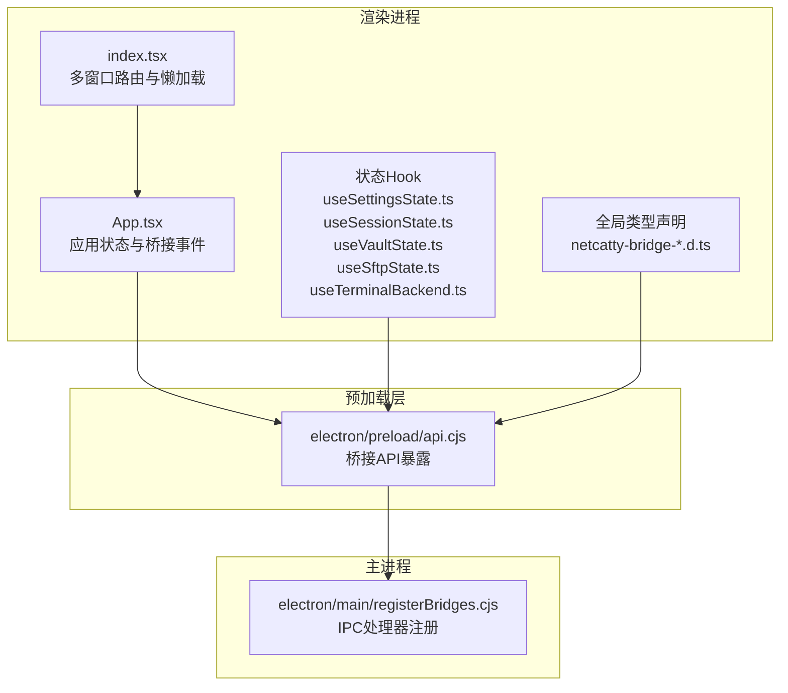
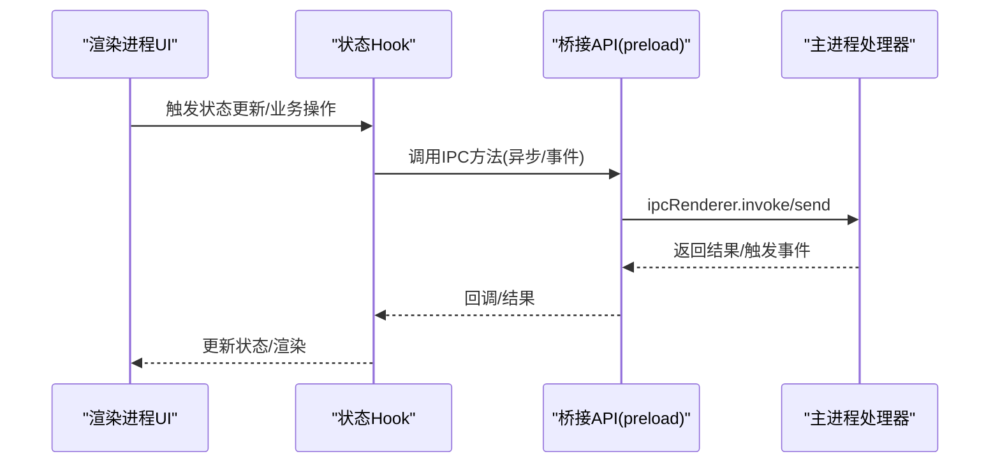
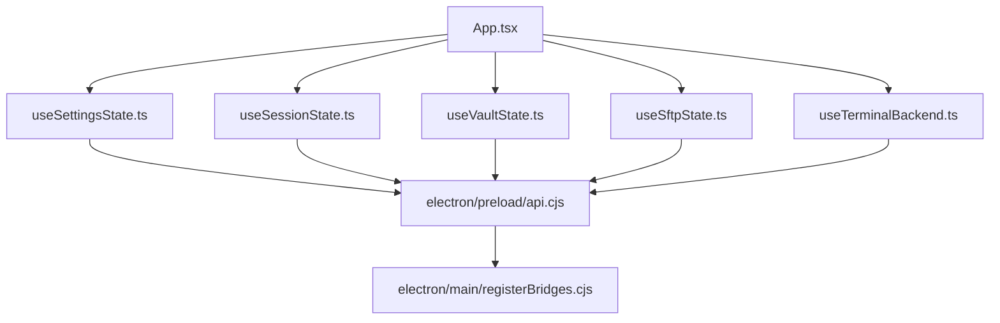

# API参考

<cite>
**本文档引用的文件**
- [index.tsx](file://index.tsx)
- [App.tsx](file://App.tsx)
- [api.cjs](file://electron/preload/api.cjs)
- [registerBridges.cjs](file://electron/main/registerBridges.cjs)
- [global.d.ts](file://global.d.ts)
- [netcatty-bridge-session.d.ts](file://types/global/netcatty-bridge-session.d.ts)
- [netcatty-bridge-sftp.d.ts](file://types/global/netcatty-bridge-sftp.d.ts)
- [netcatty-bridge-ai.d.ts](file://types/global/netcatty-bridge-ai.d.ts)
- [netcatty-bridge-app.d.ts](file://types/global/netcatty-bridge-app.d.ts)
- [useSettingsState.ts](file://application/state/useSettingsState.ts)
- [useSessionState.ts](file://application/state/useSessionState.ts)
- [useVaultState.ts](file://application/state/useVaultState.ts)
- [useSftpState.ts](file://application/state/useSftpState.ts)
- [useTerminalBackend.ts](file://application/state/useTerminalBackend.ts)
</cite>

## 目录
1. [简介](#简介)
2. [项目结构](#项目结构)
3. [核心组件](#核心组件)
4. [架构总览](#架构总览)
5. [详细组件分析](#详细组件分析)
6. [依赖关系分析](#依赖关系分析)
7. [性能考虑](#性能考虑)
8. [故障排除指南](#故障排除指南)
9. [结论](#结论)
10. [附录](#附录)

## 简介
本API参考文档面向需要在Netcatty中进行集成与扩展的开发者，系统梳理了以下三类接口：
- IPC桥接API：主进程与渲染进程之间的通信接口，涵盖会话管理、SFTP、应用控制、AI桥接等。
- 组件API：React组件的属性、方法、事件处理与生命周期约定。
- 状态管理API：Hook函数的使用方法、状态更新机制与数据获取接口。

文档同时提供调用模式、最佳实践、版本兼容性与迁移建议，帮助开发者快速、安全地集成与扩展功能。

## 项目结构
Netcatty采用Electron + React架构，核心模块包括：
- 渲染进程入口与路由：负责多窗口路由（主界面、设置、托盘面板）与懒加载。
- 应用层（App）：集中管理应用状态、同步、热键、托盘交互与桥接事件。
- IPC桥接层：preload脚本暴露统一的桥接API；main进程注册并实现具体处理器。
- 类型系统：通过全局类型声明约束桥接API的参数与返回值。
- 状态管理层：以Hook形式封装设置、会话、密钥库、SFTP等状态与副作用。

**图表来源**
- [index.tsx:83-134](file://index.tsx#L83-L134)
- [App.tsx:1-120](file://App.tsx#L1-L120)
- [api.cjs:1-120](file://electron/preload/api.cjs#L1-L120)
- [registerBridges.cjs:57-177](file://electron/main/registerBridges.cjs#L57-L177)

**章节来源**
- [index.tsx:83-134](file://index.tsx#L83-L134)
- [App.tsx:1-120](file://App.tsx#L1-L120)

## 核心组件

### IPC桥接API（主进程↔渲染进程）
- 暴露位置：preload脚本创建的全局对象，供渲染进程直接调用。
- 主要能力：
  - 会话管理：启动/关闭SSH/Telnet/Mosh/本地/串口会话，写入会话数据、调整大小、暂停流、编码设置、退出回调、ZMODEM事件等。
  - SFTP操作：打开/关闭连接、列出/读写文件、统计信息、权限变更、目录操作、进度回调、压缩上传、同机复制等。
  - 文件系统：本地目录/树/驱动器枚举、文件读写、重命名、删除、状态查询、家目录、系统信息。
  - 设置与主题：主题切换、语言、窗口控制、通知跨窗口设置变化。
  - 云同步：会话密码、WebDAV/S3网络操作代理。
  - 端口转发：规则管理、状态查询、批量停止、链路进度。
  - 认证与钥匙：键盘交互认证、主机密钥验证、密钥短语请求与响应。
  - OAuth与第三方服务：GitHub/Google/OneDrive授权流程代理。
  - 应用信息：应用版本、平台、系统信息、崩溃日志、临时目录管理、会话日志导出与自动保存。
  - AI桥接：外部模型/工具集成、聊天流式传输、执行命令、代理管理等。

- 调用规范：
  - 异步调用使用Promise，同步事件监听使用订阅/取消模式。
  - 大多数方法返回结果包含成功标志或错误信息，便于上层统一处理。
  - 进度/事件类API需注册回调，并在不再需要时返回的取消函数。

- 参数与返回值：
  - 所有参数与返回值均在全局类型声明中严格定义，确保类型安全。
  - 常见字段如sessionId、sftpId、transferId、tunnelId等贯穿各API。

- 错误处理：
  - 失败场景返回错误对象或抛出异常，调用方应捕获并提示用户。
  - 对于超时、取消、认证失败等场景，提供专门的事件回调与错误码。

**章节来源**
- [api.cjs:1-928](file://electron/preload/api.cjs#L1-L928)
- [netcatty-bridge-session.d.ts:1-269](file://types/global/netcatty-bridge-session.d.ts#L1-L269)
- [netcatty-bridge-sftp.d.ts:1-106](file://types/global/netcatty-bridge-sftp.d.ts#L1-L106)
- [netcatty-bridge-ai.d.ts:1-160](file://types/global/netcatty-bridge-ai.d.ts#L1-L160)
- [netcatty-bridge-app.d.ts:1-87](file://types/global/netcatty-bridge-app.d.ts#L1-L87)

### 组件API（React组件）
- 组件职责与约定：
  - 使用状态Hook管理UI状态与业务逻辑，避免在组件内直接访问桥接API。
  - 通过事件回调与副作用处理桥接事件（如键盘交互、主机密钥验证、会话退出等）。
  - 在组件卸载时清理事件监听与定时器，防止内存泄漏。

- 常见组件模式：
  - 会话面板：监听会话数据与退出事件，动态更新UI。
  - SFTP视图：基于useSftpState提供的稳定方法集进行导航、选择、上传下载。
  - 设置页：通过useSettingsState读取与更新设置，跨窗口同步由桥接完成。

- 生命周期与副作用：
  - 在effect中注册桥接事件监听，在cleanup中移除。
  - 对于可能阻塞关闭的会话，使用确认对话框与busy检查。

**章节来源**
- [App.tsx:514-675](file://App.tsx#L514-L675)
- [useSftpState.ts:33-569](file://application/state/useSftpState.ts#L33-L569)
- [useSettingsState.ts:99-800](file://application/state/useSettingsState.ts#L99-L800)

### 状态管理API（Hook函数）
- useSettingsState：应用主题、语言、终端设置、热键方案、SFTP行为、编辑器设置等的持久化与跨窗口同步。
- useSessionState：会话列表、工作区布局、标签页顺序、广播模式、日志视图等。
- useVaultState：主机、密钥、身份、代理配置、片段、分组、已知主机、会话日志、托管源、组配置等的加密存储与跨窗口事件同步。
- useSftpState：SFTP会话、标签页、导航缓存、传输队列、冲突处理、文件操作等。
- useTerminalBackend：会话后端可用性检测与统一API封装。

- 更新机制：
  - 写入操作通过加密存储与跨窗口事件同步，保证一致性。
  - 读取通过localStorageAdapter与解密适配器，支持版本迁移与兼容。

- 数据获取接口：
  - 提供稳定的getter与setter，以及导入/导出、清理等辅助方法。

**章节来源**
- [useSettingsState.ts:99-800](file://application/state/useSettingsState.ts#L99-L800)
- [useSessionState.ts:22-800](file://application/state/useSessionState.ts#L22-L800)
- [useVaultState.ts:112-811](file://application/state/useVaultState.ts#L112-L811)
- [useSftpState.ts:33-569](file://application/state/useSftpState.ts#L33-L569)
- [useTerminalBackend.ts:1-263](file://application/state/useTerminalBackend.ts#L1-L263)

## 架构总览

**图表来源**
- [api.cjs:1-120](file://electron/preload/api.cjs#L1-L120)
- [registerBridges.cjs:155-177](file://electron/main/registerBridges.cjs#L155-L177)

## 详细组件分析

### IPC桥接API（会话管理）
- 方法清单与用途
  - 启动会话：startSSHSession、startTelnetSession、startMoshSession、startLocalSession、startSerialSession
  - 会话控制：writeToSession、resizeSession、setSessionFlowPaused、closeSession、setSessionEncoding
  - 会话信息：getSessionPwd、getSessionRemoteInfo、getSessionDistroInfo、getServerStats
  - 事件监听：onSessionData、onSessionExit、onTelnetAutoLoginComplete、onTelnetAutoLoginCancelled、onHostKeyVerification、onPassphraseRequest等
  - 认证与钥匙：respondHostKeyVerification、respondKeyboardInteractive、respondPassphrase、respondPassphraseSkip
  - ZMODEM：onZmodemEvent、onZmodemOverwriteRequest、respondZmodemOverwrite、cancelZmodem

- 调用模式
  - 启动会话后获得sessionId，后续操作均以该ID为参数。
  - 注册事件监听后，务必在组件卸载时调用返回的取消函数。
  - 对于可能阻塞关闭的会话，先调用busy检查再执行关闭。

- 最佳实践
  - 将sessionId与组件生命周期绑定，避免悬挂引用。
  - 对于编码设置，优先尝试SSH专用接口，失败回退到通用终端接口。
  - 使用onHostKeyVerification与onPassphraseRequest构建安全的认证流程。

**章节来源**
- [netcatty-bridge-session.d.ts:1-269](file://types/global/netcatty-bridge-session.d.ts#L1-L269)
- [api.cjs:18-265](file://electron/preload/api.cjs#L18-L265)
- [App.tsx:547-675](file://App.tsx#L547-L675)

### IPC桥接API（SFTP）
- 方法清单与用途
  - 连接与文件操作：openSftp、listSftp、readSftp、writeSftp、closeSftp、mkdirSftp、deleteSftp、renameSftp、statSftp、chmodSftp、getSftpHomeDir
  - 二进制与进度：readSftpBinary、writeSftpBinaryWithProgress、cancelSftpUpload
  - 传输：startStreamTransfer、sameHostCopyDirectory、uploadFile、downloadFile、cancelTransfer、checkCompressedUploadSupport
  - 本地文件系统：listLocalDir、readLocalFile、writeLocalFile、deleteLocalFile、renameLocalFile、mkdirLocal、statLocal、listLocalTree、getHomeDir、listDrives、getSystemInfo

- 调用模式
  - 获取sftpId后进行文件操作，注意路径编码与权限。
  - 二进制写入支持实时进度回调，适合大文件传输。
  - 同机复制与压缩上传可显著提升效率。

- 最佳实践
  - 使用缓存键策略避免重复请求，结合导航序列号忽略过期结果。
  - 传输完成后及时清理进度监听，避免内存泄漏。

**章节来源**
- [netcatty-bridge-sftp.d.ts:1-106](file://types/global/netcatty-bridge-sftp.d.ts#L1-L106)
- [api.cjs:195-282](file://electron/preload/api.cjs#L195-L282)
- [useSftpState.ts:33-569](file://application/state/useSftpState.ts#L33-L569)

### IPC桥接API（应用控制与系统集成）
- 方法清单与用途
  - 自动更新：checkForUpdate、downloadUpdate、installUpdate、getUpdateStatus、onUpdateAvailable等
  - 全局热键：registerGlobalHotkey、unregisterGlobalHotkey、getGlobalHotkeyStatus
  - 托盘：setCloseToTray、isCloseToTray、updateTrayMenuData、onTrayFocusSession、onTrayTogglePortForward、onTrayPanelMenuData等
  - 窗口控制：windowMinimize、windowMaximize、windowClose、windowIsMaximized、windowIsFullscreen、windowFocus、onWindowFullScreenChanged
  - 设置同步：notifySettingsChanged、onSettingsChanged
  - 云同步：cloudSyncWebdavInitialize/Upload/Download/Delete、cloudSyncS3Initialize/Upload/Download/Delete
  - 外部打开：openExternal、openPath
  - 应用信息：getAppInfo、ptyGetChildProcesses、confirmCloseBusy、getVaultBackupCapabilities、create/read/list/trim/openDir等

- 调用模式
  - 通过notifySettingsChanged与onSettingsChanged实现跨窗口设置同步。
  - 托盘菜单数据通过updateTrayMenuData推送，onTrayPanelMenuData接收回放。

- 最佳实践
  - 在应用启动时初始化自动更新与热键，确保用户体验一致。
  - 对于外部打开链接，优先使用openExternal，失败时降级到系统浏览器。

**章节来源**
- [netcatty-bridge-app.d.ts:1-87](file://types/global/netcatty-bridge-app.d.ts#L1-L87)
- [api.cjs:289-438](file://electron/preload/api.cjs#L289-L438)
- [App.tsx:514-546](file://App.tsx#L514-L546)

### IPC桥接API（AI桥接）
- 方法清单与用途
  - 提供商与搜索：aiSyncProviders、aiSyncWebSearch
  - 流式聊天：aiChatStream、aiChatCancel
  - 外部HTTP：aiFetch
  - 工具与代理：aiExec、aiCattyCancelExec、aiMcpUpdateSessions、aiMcpSetToolIntegrationMode
  - 用户技能：aiUserSkillsGetStatus、aiUserSkillsOpenFolder、aiUserSkillsBuildContext
  - 代理管理：aiSpawnAgent、aiWriteToAgent、aiCloseAgentStdin、aiKillAgent
  - ACP协议：aiAcpStream、aiAcpListModels、aiAcpCancel、aiAcpCleanup
  - 事件监听：onAiStreamData、onAiStreamEnd、onAiAgentStdout、onAiAgentStderr、onAiAgentExit、onAiAcpEvent、onAiAcpDone、onAiAcpError

- 调用模式
  - 使用requestId关联流式操作，支持取消与错误处理。
  - 代理管理支持stdin关闭策略，避免资源泄露。

- 最佳实践
  - 对于长时间运行的流式任务，务必注册取消与错误回调。
  - 使用onAiAcpEvent与onAiAcpDone进行状态跟踪与UI反馈。

**章节来源**
- [netcatty-bridge-ai.d.ts:1-160](file://types/global/netcatty-bridge-ai.d.ts#L1-L160)
- [api.cjs:746-800](file://electron/preload/api.cjs#L746-L800)

### 状态管理API（Hook函数）
- useSettingsState
  - 功能：主题、语言、终端设置、热键、SFTP行为、编辑器设置、会话日志、自动更新、全局热键等。
  - 特性：持久化、跨窗口同步、版本迁移、系统偏好监听。
  - 使用：通过setter更新状态，内部自动持久化与IPC广播。

- useSessionState
  - 功能：会话创建/关闭、工作区布局、标签页顺序、广播模式、日志视图。
  - 特性：严格的布局与焦点管理，支持拖拽与分割。

- useVaultState
  - 功能：主机、密钥、身份、代理、片段、分组、已知主机、会话日志、托管源、组配置。
  - 特性：加密存储、跨窗口事件同步、版本控制、历史清理。

- useSftpState
  - 功能：SFTP会话、标签页、导航缓存、传输队列、冲突处理、文件操作。
  - 特性：稳定方法引用、缓存策略、冲突合并。

- useTerminalBackend
  - 功能：后端可用性检测、统一会话API封装。
  - 特性：memoized返回对象，避免不必要重渲染。

**章节来源**
- [useSettingsState.ts:99-800](file://application/state/useSettingsState.ts#L99-L800)
- [useSessionState.ts:22-800](file://application/state/useSessionState.ts#L22-L800)
- [useVaultState.ts:112-811](file://application/state/useVaultState.ts#L112-L811)
- [useSftpState.ts:33-569](file://application/state/useSftpState.ts#L33-L569)
- [useTerminalBackend.ts:1-263](file://application/state/useTerminalBackend.ts#L1-L263)

## 依赖关系分析

**图表来源**
- [App.tsx:1-120](file://App.tsx#L1-L120)
- [useSettingsState.ts:99-120](file://application/state/useSettingsState.ts#L99-L120)
- [useSessionState.ts:22-45](file://application/state/useSessionState.ts#L22-L45)
- [useVaultState.ts:112-140](file://application/state/useVaultState.ts#L112-L140)
- [useSftpState.ts:33-45](file://application/state/useSftpState.ts#L33-L45)
- [useTerminalBackend.ts:1-20](file://application/state/useTerminalBackend.ts#L1-L20)
- [api.cjs:1-120](file://electron/preload/api.cjs#L1-L120)
- [registerBridges.cjs:57-177](file://electron/main/registerBridges.cjs#L57-L177)

**章节来源**
- [App.tsx:1-120](file://App.tsx#L1-L120)
- [api.cjs:1-120](file://electron/preload/api.cjs#L1-L120)
- [registerBridges.cjs:57-177](file://electron/main/registerBridges.cjs#L57-L177)

## 性能考虑
- 预加载桥接API采用事件监听与回调模式，避免频繁轮询。
- SFTP目录缓存与导航序列号机制减少重复请求与过期结果影响。
- 状态Hook通过稳定方法引用与memo化降低渲染抖动。
- 大文件传输使用二进制与进度回调，避免阻塞UI线程。
- 自动更新与热键注册在应用启动阶段完成，减少运行时开销。

## 故障排除指南
- 会话无法启动
  - 检查后端可用性与网络环境，确认startSSHSession等方法存在。
  - 查看getSessionRemoteInfo与getServerStats返回的错误信息。

- SFTP传输失败
  - 使用onTransferProgress与onError回调定位问题。
  - 对于同机复制与压缩上传，确认支持状态与权限。

- 认证问题
  - 使用onHostKeyVerification与onPassphraseRequest构建认证流程。
  - 对于键盘交互认证，确保respondKeyboardInteractive正确响应。

- 设置不同步
  - 确认notifySettingsChanged与onSettingsChanged配对使用。
  - 检查跨窗口事件是否被正确处理。

**章节来源**
- [App.tsx:547-675](file://App.tsx#L547-L675)
- [api.cjs:156-265](file://electron/preload/api.cjs#L156-L265)
- [useSftpState.ts:273-329](file://application/state/useSftpState.ts#L273-L329)

## 结论
本文档提供了Netcatty的完整API参考，覆盖IPC桥接、组件与状态管理三大领域。通过严格的类型约束、稳定的Hook封装与完善的事件机制，开发者可以安全、高效地集成与扩展功能。建议在实际开发中遵循本文的最佳实践与调用模式，确保系统的稳定性与可维护性。

## 附录

### 版本兼容性与迁移指南
- 类型声明
  - 所有桥接API参数与返回值在全局类型声明中明确定义，升级时请对照类型差异。
- 状态持久化
  - useSettingsState与useVaultState内置版本迁移逻辑，升级时无需手动迁移。
- 事件与回调
  - 新增事件需同时在preload与main两端注册，保持回调签名一致。
- 桥接方法
  - 如需新增方法，先在types中声明，再在preload与main中实现，最后在组件中使用。

**章节来源**
- [global.d.ts:1-200](file://global.d.ts#L1-L200)
- [netcatty-bridge-session.d.ts:1-269](file://types/global/netcatty-bridge-session.d.ts#L1-L269)
- [netcatty-bridge-sftp.d.ts:1-106](file://types/global/netcatty-bridge-sftp.d.ts#L1-L106)
- [netcatty-bridge-ai.d.ts:1-160](file://types/global/netcatty-bridge-ai.d.ts#L1-L160)
- [netcatty-bridge-app.d.ts:1-87](file://types/global/netcatty-bridge-app.d.ts#L1-L87)
- [useSettingsState.ts:418-489](file://application/state/useSettingsState.ts#L418-L489)
- [useVaultState.ts:405-564](file://application/state/useVaultState.ts#L405-L564)