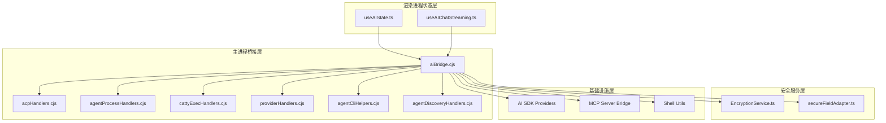
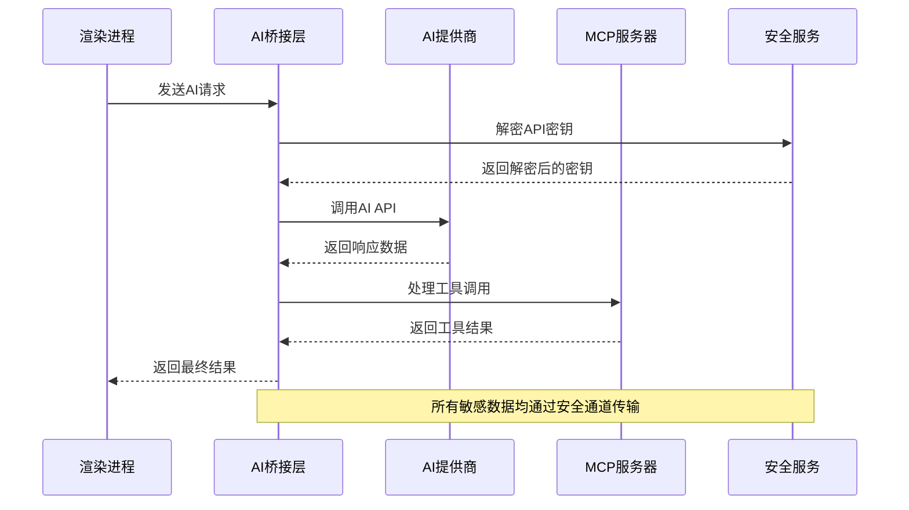
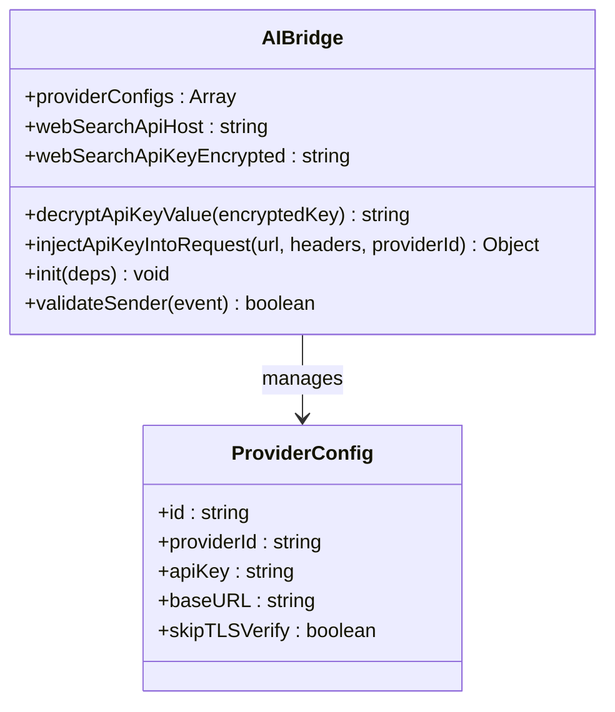
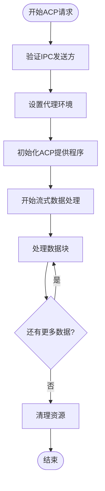
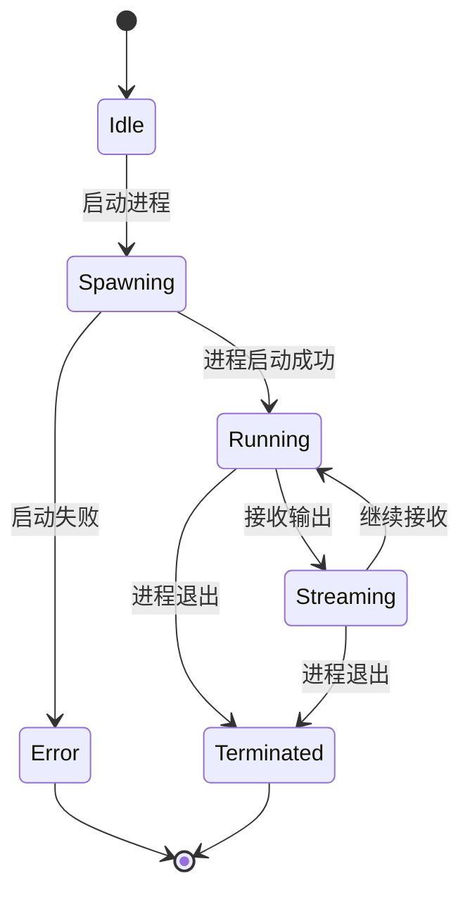
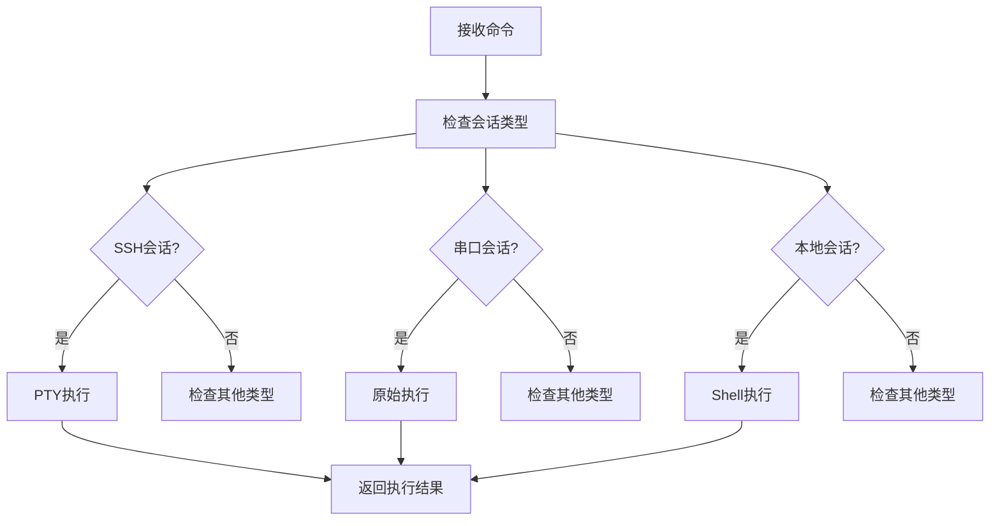
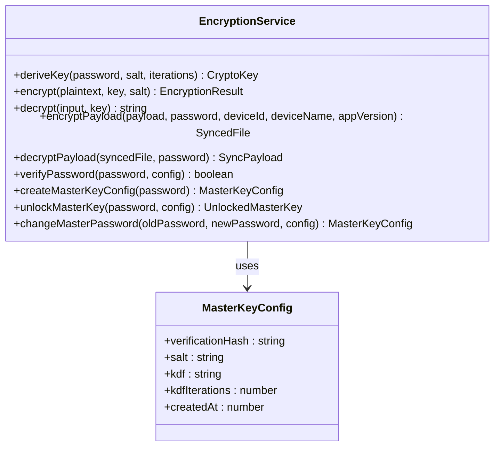
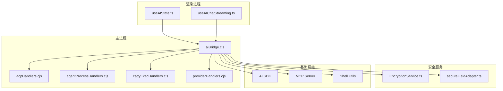

# AI桥接API

<cite>
**本文档引用的文件**
- [aiBridge.cjs](file://electron/bridges/aiBridge.cjs)
- [acpHandlers.cjs](file://electron/bridges/aiBridge/acpHandlers.cjs)
- [agentCliHelpers.cjs](file://electron/bridges/aiBridge/agentCliHelpers.cjs)
- [agentDiscoveryHandlers.cjs](file://electron/bridges/aiBridge/agentDiscoveryHandlers.cjs)
- [agentProcessHandlers.cjs](file://electron/bridges/aiBridge/agentProcessHandlers.cjs)
- [cattyExecHandlers.cjs](file://electron/bridges/aiBridge/cattyExecHandlers.cjs)
- [providerHandlers.cjs](file://electron/bridges/aiBridge/providerHandlers.cjs)
- [EncryptionService.ts](file://infrastructure/services/EncryptionService.ts)
- [secureFieldAdapter.ts](file://infrastructure/persistence/secureFieldAdapter.ts)
- [useAIState.ts](file://application/state/useAIState.ts)
- [useAIChatStreaming.ts](file://components/ai/hooks/useAIChatStreaming.ts)
</cite>

## 目录
1. [简介](#简介)
2. [项目结构](#项目结构)
3. [核心组件](#核心组件)
4. [架构概览](#架构概览)
5. [详细组件分析](#详细组件分析)
6. [依赖关系分析](#依赖关系分析)
7. [性能考虑](#性能考虑)
8. [故障排除指南](#故障排除指南)
9. [结论](#结论)

## 简介

AI桥接API是Netcatty应用中的核心组件，负责管理AI代理和工具执行的IPC接口。该系统提供了完整的AI会话管理、流式请求处理、代理发现和进程管理接口，支持多种AI提供商API调用和代理工具执行。

系统主要功能包括：
- AI提供商API调用代理和加密管理
- 代理工具执行和Catty执行处理器
- AI会话管理和流式响应处理
- 安全的API密钥存储和解密机制
- 外部代理发现和进程管理
- MCP服务器集成和权限控制

## 项目结构

AI桥接API系统采用模块化设计，主要分布在以下目录：

**图表来源**
- [aiBridge.cjs:1-50](file://electron/bridges/aiBridge.cjs#L1-L50)
- [useAIState.ts:1-50](file://application/state/useAIState.ts#L1-L50)

**章节来源**
- [aiBridge.cjs:1-50](file://electron/bridges/aiBridge.cjs#L1-L50)
- [useAIState.ts:1-50](file://application/state/useAIState.ts#L1-L50)

## 核心组件

### 主要模块职责

1. **aiBridge.cjs** - 主要桥接模块，协调所有AI相关操作
2. **acpHandlers.cjs** - ACP（Agent Communication Protocol）处理器
3. **agentProcessHandlers.cjs** - 代理进程管理处理器
4. **cattyExecHandlers.cjs** - Catty执行处理器
5. **providerHandlers.cjs** - 提供商处理器
6. **agentCliHelpers.cjs** - 代理CLI辅助函数
7. **agentDiscoveryHandlers.cjs** - 代理发现处理器

### 安全组件

1. **EncryptionService.ts** - 加密服务，实现零知识加密
2. **secureFieldAdapter.ts** - 字段级加密适配器

**章节来源**
- [aiBridge.cjs:1-100](file://electron/bridges/aiBridge.cjs#L1-L100)
- [EncryptionService.ts:1-50](file://infrastructure/services/EncryptionService.ts#L1-L50)
- [secureFieldAdapter.ts:1-50](file://infrastructure/persistence/secureFieldAdapter.ts#L1-L50)

## 架构概览

AI桥接API采用分层架构设计，确保安全性、可扩展性和易维护性：

**图表来源**
- [aiBridge.cjs:232-260](file://electron/bridges/aiBridge.cjs#L232-L260)
- [providerHandlers.cjs:322-354](file://electron/bridges/aiBridge/providerHandlers.cjs#L322-L354)

## 详细组件分析

### AI桥接主模块

AI桥接主模块是整个系统的核心协调者，负责：

#### API密钥安全管理
- 使用加密前缀标识加密的API密钥
- 通过Electron安全存储进行解密
- 支持明文和加密密钥格式

#### 请求路由和转发
- 统一的IPC消息处理接口
- 请求验证和权限检查
- 错误处理和异常恢复

**图表来源**
- [aiBridge.cjs:221-260](file://electron/bridges/aiBridge.cjs#L221-L260)

**章节来源**
- [aiBridge.cjs:221-325](file://electron/bridges/aiBridge.cjs#L221-L325)

### ACP处理器

ACP处理器专门处理与外部AI代理的通信：

#### 模型发现和会话管理
- 自动发现可用的AI模型
- 管理会话生命周期
- 处理会话重连和恢复

#### 流式响应处理
- 实时流式数据处理
- 响应缓冲和节流
- 错误检测和恢复

**图表来源**
- [acpHandlers.cjs:123-798](file://electron/bridges/aiBridge/acpHandlers.cjs#L123-L798)

**章节来源**
- [acpHandlers.cjs:1-200](file://electron/bridges/aiBridge/acpHandlers.cjs#L1-L200)

### 代理进程管理

代理进程管理器负责外部AI代理的生命周期：

#### 进程安全启动
- 验证命令名称和参数
- 过滤危险环境变量
- 限制并发进程数量

#### 进程监控和控制
- 实时输出监控
- 异常终止处理
- 资源清理

**图表来源**
- [agentProcessHandlers.cjs:11-113](file://electron/bridges/aiBridge/agentProcessHandlers.cjs#L11-L113)

**章节来源**
- [agentProcessHandlers.cjs:1-150](file://electron/bridges/aiBridge/agentProcessHandlers.cjs#L1-L150)

### Catty执行处理器

Catty执行处理器专门处理本地终端会话的命令执行：

#### 会话类型识别
- SSH会话处理
- 串口会话处理
- 本地会话处理

#### 命令执行策略
- PTY流式执行
- 原始命令执行
- 超时和取消管理

**图表来源**
- [cattyExecHandlers.cjs:4-148](file://electron/bridges/aiBridge/cattyExecHandlers.cjs#L4-L148)

**章节来源**
- [cattyExecHandlers.cjs:1-163](file://electron/bridges/aiBridge/cattyExecHandlers.cjs#L1-L163)

### 提供商处理器

提供商处理器管理AI提供商的配置和API调用：

#### 提供商配置同步
- 安全的提供商配置同步
- Web搜索配置管理
- 动态主机白名单管理

#### 请求代理和安全检查
- URL允许列表验证
- TLS验证选项
- 请求头和URL中的API密钥注入

**章节来源**
- [providerHandlers.cjs:1-150](file://electron/bridges/aiBridge/providerHandlers.cjs#L1-L150)

### 安全服务组件

#### 加密服务
实现零知识加密，确保敏感数据的安全存储：

**图表来源**
- [EncryptionService.ts:423-440](file://infrastructure/services/EncryptionService.ts#L423-L440)

#### 字段级加密适配器
为渲染进程提供字段级别的加密功能：

- 通过凭证桥接IPC调用安全存储
- 支持主机、SSH密钥、身份等敏感字段
- 自动降级到明文模式（无桥接时）

**章节来源**
- [EncryptionService.ts:1-100](file://infrastructure/services/EncryptionService.ts#L1-L100)
- [secureFieldAdapter.ts:1-80](file://infrastructure/persistence/secureFieldAdapter.ts#L1-L80)

## 依赖关系分析

AI桥接API系统具有清晰的依赖层次结构：

**图表来源**
- [useAIState.ts:44-65](file://application/state/useAIState.ts#L44-L65)
- [aiBridge.cjs:17-42](file://electron/bridges/aiBridge.cjs#L17-L42)

**章节来源**
- [useAIState.ts:44-100](file://application/state/useAIState.ts#L44-L100)
- [aiBridge.cjs:17-50](file://electron/bridges/aiBridge.cjs#L17-L50)

## 性能考虑

### 流式处理优化
- 使用AbortController管理流式请求的取消
- 实现3秒无响应检测机制
- 数据缓冲区大小限制（10MB）

### 进程管理
- 最大并发代理进程限制（5个）
- 进程树清理确保资源释放
- 子进程发现和管理

### 缓存和重用
- ACP提供程序实例缓存
- 会话ID重用避免重新初始化
- 环境变量指纹验证

## 故障排除指南

### 常见问题和解决方案

#### API密钥解密失败
- 检查加密前缀格式
- 验证Electron安全存储可用性
- 确认密钥未被篡改

#### 代理进程启动失败
- 验证命令路径和权限
- 检查危险环境变量过滤
- 查看进程日志输出

#### 流式请求超时
- 检查网络连接和防火墙设置
- 验证URL允许列表配置
- 调整超时参数设置

**章节来源**
- [aiBridge.cjs:232-245](file://electron/bridges/aiBridge.cjs#L232-L245)
- [agentProcessHandlers.cjs:34-113](file://electron/bridges/aiBridge/agentProcessHandlers.cjs#L34-L113)

## 结论

AI桥接API系统提供了完整、安全且高性能的AI代理和工具执行框架。通过模块化设计、严格的权限控制和安全的数据处理机制，该系统能够可靠地支持各种AI应用场景。

关键优势包括：
- **安全性**：端到端加密、安全存储和访问控制
- **可扩展性**：模块化架构支持新提供商和代理的集成
- **可靠性**：完善的错误处理和恢复机制
- **性能**：优化的流式处理和资源管理

该系统为Netcatty应用提供了强大的AI能力，同时确保了用户数据的安全性和隐私保护。