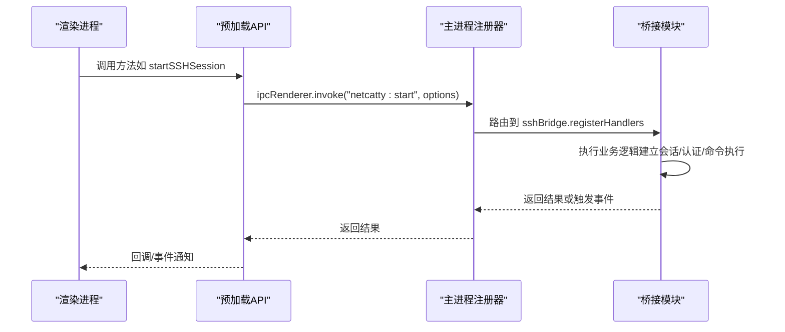
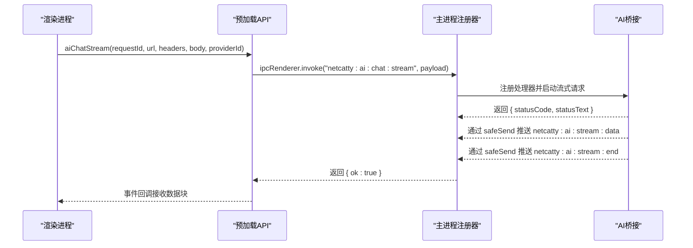
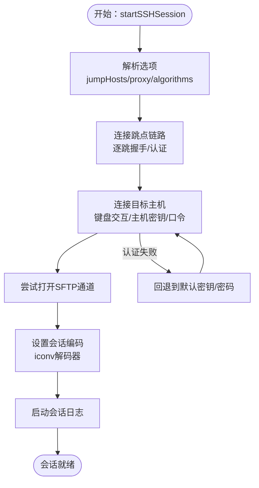
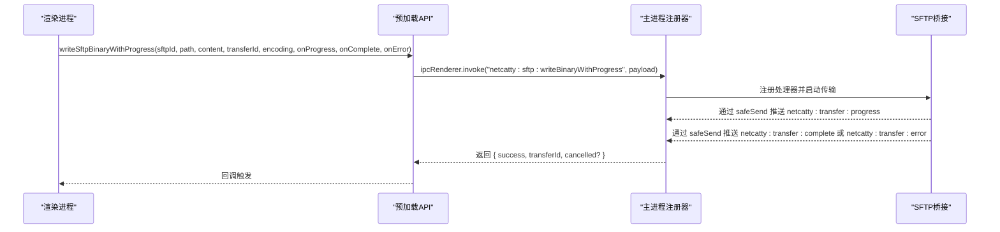
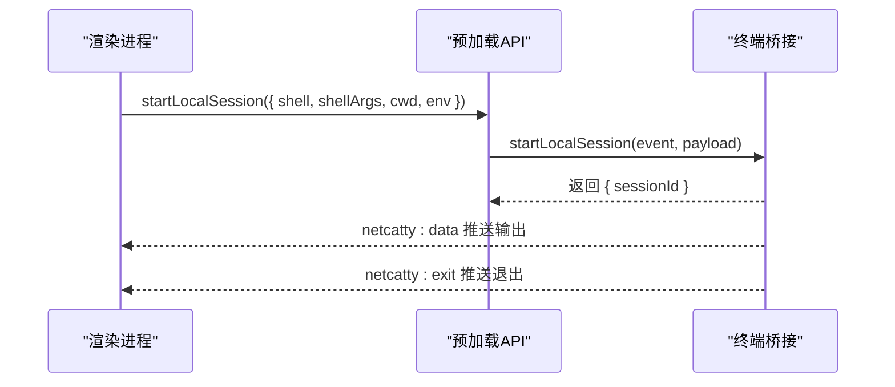
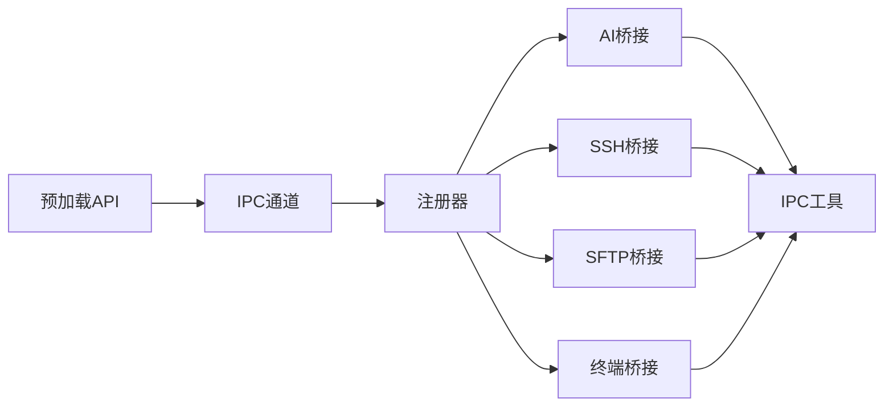

# IPC桥接API

<cite>
**本文档引用的文件**
- [electron/preload/api.cjs](file://electron/preload/api.cjs)
- [electron/main/registerBridges.cjs](file://electron/main/registerBridges.cjs)
- [electron/bridges/aiBridge.cjs](file://electron/bridges/aiBridge.cjs)
- [electron/bridges/sshBridge.cjs](file://electron/bridges/sshBridge.cjs)
- [electron/bridges/sftpBridge.cjs](file://electron/bridges/sftpBridge.cjs)
- [electron/bridges/terminalBridge.cjs](file://electron/bridges/terminalBridge.cjs)
- [electron/bridges/ipcUtils.cjs](file://electron/bridges/ipcUtils.cjs)
- [types/global/netcatty-bridge-ai.d.ts](file://types/global/netcatty-bridge-ai.d.ts)
- [types/global/netcatty-bridge-sftp.d.ts](file://types/global/netcatty-bridge-sftp.d.ts)
- [types/global/netcatty-bridge-session.d.ts](file://types/global/netcatty-bridge-session.d.ts)
</cite>

## 目录
1. [简介](#简介)
2. [项目结构](#项目结构)
3. [核心组件](#核心组件)
4. [架构总览](#架构总览)
5. [详细组件分析](#详细组件分析)
6. [依赖关系分析](#依赖关系分析)
7. [性能考虑](#性能考虑)
8. [故障排除指南](#故障排除指南)
9. [结论](#结论)
10. [附录](#附录)

## 简介
本文件系统性梳理 Netcatty 的 IPC 桥接 API，覆盖主进程与渲染进程之间的通信接口，重点包括：
- AI 桥接 API：外部模型调用、流式传输、工具集成（MCP/Skills）、外部代理管理
- SSH 桥接 API：会话建立、命令执行、密钥对生成、认证流程（键盘交互、主机密钥、口令）
- SFTP 桥接 API：文件列表、读写、重命名、权限变更、编码处理、进度回调、压缩上传
- 终端桥接 API：本地 Shell、Telnet、Mosh、串口会话管理，输出缓冲、ZMODEM 文件传输、窗口大小调整
- 通用能力：跨窗口设置同步、云同步、临时目录、会话日志、自动更新、托盘面板等

文档同时阐述消息格式、事件类型、序列化/反序列化过程、错误处理策略、超时与重试、安全验证与权限控制，并提供最佳实践与性能优化建议。

## 项目结构
IPC 桥接由三部分组成：
- 预加载层（preload）：在渲染进程中暴露统一的 API 调用入口，封装 invoke/send、事件监听器注册与清理、进度回调注册与清理
- 主进程桥接层（bridges）：按功能域拆分（ai、ssh、sftp、terminal），负责业务逻辑、连接管理、事件转发、安全校验
- 注册器（registerBridges）：集中初始化各桥接模块并注册 IPC 处理器

```mermaid
graph TB
subgraph "渲染进程"
Preload["预加载API<br/>electron/preload/api.cjs"]
end
subgraph "主进程"
Registrar["桥接注册器<br/>electron/main/registerBridges.cjs"]
subgraph "桥接模块"
AIBridge["AI桥接<br/>electron/bridges/aiBridge.cjs"]
SSHBridge["SSH桥接<br/>electron/bridges/sshBridge.cjs"]
SFTPBridge["SFTP桥接<br/>electron/bridges/sftpBridge.cjs"]
TermBridge["终端桥接<br/>electron/bridges/terminalBridge.cjs"]
IPCUtil["IPC工具<br/>electron/bridges/ipcUtils.cjs"]
end
end
Preload <- --> |"invoke/send"| Registrar
Registrar --> AIBridge
Registrar --> SSHBridge
Registrar --> SFTPBridge
Registrar --> TermBridge
AIBridge --> IPCUtil
SSHBridge --> IPCUtil
SFTPBridge --> IPCUtil
TermBridge --> IPCUtil
```

**图表来源**
- [electron/preload/api.cjs](file://electron/preload/api.cjs)
- [electron/main/registerBridges.cjs](file://electron/main/registerBridges.cjs)
- [electron/bridges/aiBridge.cjs](file://electron/bridges/aiBridge.cjs)
- [electron/bridges/sshBridge.cjs](file://electron/bridges/sshBridge.cjs)
- [electron/bridges/sftpBridge.cjs](file://electron/bridges/sftpBridge.cjs)
- [electron/bridges/terminalBridge.cjs](file://electron/bridges/terminalBridge.cjs)
- [electron/bridges/ipcUtils.cjs](file://electron/bridges/ipcUtils.cjs)

**章节来源**
- [electron/preload/api.cjs](file://electron/preload/api.cjs)
- [electron/main/registerBridges.cjs](file://electron/main/registerBridges.cjs)

## 核心组件
- 预加载 API（electron/preload/api.cjs）
  - 提供统一的渲染进程调用入口，封装 invoke/send、事件监听器注册/注销、进度回调注册/清理、跨窗口设置同步、云同步代理、临时目录、会话日志、自动更新、托盘面板等
  - 对外暴露方法族：startSSHSession、startTelnetSession、startMoshSession、startLocalSession、startSerialSession、listSerialPorts、getDefaultShell、discoverShells、validatePath、writeToSession、execCommand、getSessionPwd、getSessionRemoteInfo、getSessionDistroInfo、getServerStats、generateKeyPair、checkSshAgent、getDefaultKeys、resizeSession、setSessionFlowPaused、closeSession、setSessionEncoding、onZmodemEvent、cancelZmodem、onZmodemOverwriteRequest、respondZmodemOverwrite、onSessionData、onSessionExit、onTelnetAutoLoginComplete、onTelnetAutoLoginCancelled、onAuthFailed、onKeyboardInteractive、respondKeyboardInteractive、onHostKeyVerification、respondHostKeyVerification、onPassphraseRequest、respondPassphrase、respondPassphraseSkip、onPassphraseTimeout、onPassphraseCancelled、onPassphraseAuthFailed、openSftp、listSftp、readSftp、readSftpBinary、writeSftp、writeSftpBinary、closeSftp、mkdirSftp、deleteSftp、renameSftp、statSftp、chmodSftp、getSftpHomeDir、writeSftpBinaryWithProgress、cancelSftpUpload、listLocalDir、readLocalFile、writeLocalFile、deleteLocalFile、renameLocalFile、mkdirLocal、statLocal、listLocalTree、getHomeDir、listDrives、getSystemInfo、readKnownHosts、setTheme、setBackgroundColor、setLanguage、onLanguageChanged、startStreamTransfer、cancelTransfer、sameHostCopyDirectory、startCompressedUpload、cancelCompressedUpload、checkCompressedUploadSupport、windowMinimize、windowMaximize、windowClose、windowIsMaximized、windowIsFullscreen、windowFocus、onWindowFullScreenChanged、openSettingsWindow、closeSettingsWindow、notifySettingsChanged、onSettingsChanged、cloudSyncSetSessionPassword、cloudSyncGetSessionPassword、cloudSyncClearSessionPassword、cloudSyncWebdavInitialize、cloudSyncWebdavUpload、cloudSyncWebdavDownload、cloudSyncWebdavDelete、cloudSyncS3Initialize、cloudSyncS3Upload、cloudSyncS3Download、cloudSyncS3Delete、openExternal、openPath、getAppInfo、ptyGetChildProcesses、confirmCloseBusy、getVaultBackupCapabilities、createVaultBackup、listVaultBackups、readVaultBackup、trimVaultBackups、openVaultBackupDir、onVaultBackupsChanged、rendererReady、onCheckDirtyEditors、reportDirtyEditorsResult、startPortForward、stopPortForward、getPortForwardStatus、listPortForwards、stopAllPortForwards、stopPortForwardByRuleId、onPortForwardStatus、onChainProgress、onSftpConnectionProgress、prepareOAuthCallback、awaitOAuthCallback、cancelOAuthCallback、githubStartDeviceFlow、githubPollDeviceFlowToken、githubCancelDeviceFlowPoll、googleExchangeCodeForTokens、googleRefreshAccessToken、googleGetUserInfo、googleDriveFindSyncFile、googleDriveCreateSyncFile、googleDriveUpdateSyncFile、googleDriveDownloadSyncFile、googleDriveDeleteSyncFile、onedriveExchangeCodeForTokens、onedriveRefreshAccessToken、onedriveGetUserInfo、onedriveFindSyncFile、onedriveUploadSyncFile、onedriveDownloadSyncFile、onedriveDeleteSyncFile、selectApplication、openWithApplication、downloadSftpToTemp、downloadSftpToTempWithProgress、showSaveDialog、selectDirectory、selectFile、startFileWatch、stopFileWatch、listFileWatches、registerTempFile、onFileWatchSynced、onFileWatchError、deleteTempFile、getTempDirInfo、clearTempDir、getTempDirPath、openTempDir、exportSessionLog、selectSessionLogsDir、autoSaveSessionLog、openSessionLogsDir、getCrashLogs、readCrashLog、clearCrashLogs、openCrashLogsDir、registerGlobalHotkey、unregisterGlobalHotkey、getGlobalHotkeyStatus、setCloseToTray、isCloseToTray、updateTrayMenuData、onTrayFocusSession、onTrayTogglePortForward、onTrayPanelJumpToSession、onTrayPanelConnectToHost、hideTrayPanel、openMainWindow、quitApp、jumpToSessionFromTrayPanel、connectToHostFromTrayPanel、onTrayPanelCloseRequest、onTrayPanelRefresh、onTrayPanelMenuData、getPathForFile、readClipboardText、credentialsAvailable、credentialsEncrypt、credentialsDecrypt、checkForUpdate、downloadUpdate、installUpdate、getUpdateStatus、setAutoUpdate、getAutoUpdate、onUpdateAvailable、onUpdateNotAvailable、onUpdateDownloadProgress、onUpdateDownloaded、onUpdateError、aiSyncProviders、aiSyncWebSearch、aiChatStream、aiChatCancel、aiFetch、aiAllowlistAddHost、aiExec、aiCattyCancelExec、aiDiscoverAgents、aiResolveCli、aiCodexGetIntegration、aiCodexStartLogin、aiCodexGetLoginSession、aiCodexCancelLogin、aiCodexLogout、aiSpawnAgent、aiWriteToAgent、aiCloseAgentStdin、aiWriteToAgent、aiCloseAgentStdin
- 主进程桥接注册器（electron/main/registerBridges.cjs）
  - 初始化各桥接模块（ssh、sftp、localFs、transfer、portForwarding、terminal、oauth、github、google、onedrive、cloudSync、fileWatcher、tempDir、sessionLogs、compressUpload、globalShortcut、credential、autoUpdate、ai、vaultBackup）
  - 注册 IPC 处理器（handle/on），包括 fig 规范加载、本地目录列举、设置窗口、外部链接打开、应用信息、PTY 子进程查询、确认关闭、剪贴板读取、选择应用、打开文件、保存对话框、选择文件/目录、下载到临时文件、删除临时文件、会话日志导出、崩溃日志管理、全局热键、托盘菜单、托盘面板、自动更新、云同步密码、外链打开、路径打开等
- 桥接模块
  - AI 桥接（electron/bridges/aiBridge.cjs）：提供 AI 模型调用、流式传输、工具集成（MCP/Skills）、外部代理管理、发送方验证、API Key 安全存储与解密、超时与重试、进程树清理
  - SSH 桥接（electron/bridges/sshBridge.cjs）：支持跳点链路、代理、算法配置、键盘交互认证、主机密钥验证、加密密钥口令、ZMODEM、会话编码、会话日志、X11 转发、TCP 优化
  - SFTP 桥接（electron/bridges/sftpBridge.cjs）：会话管理、通道恢复、编码检测与转换、路径规范化、递归删除、权限变更、进度回调、取消上传、sudo 支持（通过 ssh2 内部包装器）
  - 终端桥接（electron/bridges/terminalBridge.cjs）：本地 Shell、Telnet、Mosh、串口会话；输出缓冲、ZMODEM、窗口大小调整、流控、日志记录、可执行文件解析
- IPC 工具（electron/bridges/ipcUtils.cjs）：safeSend 封装，避免向已销毁的 WebContents 发送消息

**章节来源**
- [electron/preload/api.cjs](file://electron/preload/api.cjs)
- [electron/main/registerBridges.cjs](file://electron/main/registerBridges.cjs)
- [electron/bridges/aiBridge.cjs](file://electron/bridges/aiBridge.cjs)
- [electron/bridges/sshBridge.cjs](file://electron/bridges/sshBridge.cjs)
- [electron/bridges/sftpBridge.cjs](file://electron/bridges/sftpBridge.cjs)
- [electron/bridges/terminalBridge.cjs](file://electron/bridges/terminalBridge.cjs)
- [electron/bridges/ipcUtils.cjs](file://electron/bridges/ipcUtils.cjs)

## 架构总览
渲染进程通过预加载 API 调用主进程桥接模块，主进程桥接模块根据功能域分别处理请求并返回结果或事件。所有 IPC 通信均使用 Electron 的 ipcRenderer.invoke/ipcMain.handle 与 ipcRenderer.send/ipcMain.on 组合，确保请求-响应与事件推送分离。



**图表来源**
- [electron/preload/api.cjs](file://electron/preload/api.cjs)
- [electron/main/registerBridges.cjs](file://electron/main/registerBridges.cjs)
- [electron/bridges/sshBridge.cjs](file://electron/bridges/sshBridge.cjs)

## 详细组件分析

### AI 桥接 API
- 方法族
  - 同步提供者与网络搜索配置
  - 流式聊天与取消
  - HTTP 请求代理（绕过 CORS）
  - 允许列表添加主机
  - 在会话中执行命令
  - 取消 Catty 执行
  - 代理发现与登录（Codex）
  - 外部代理（Agent）生命周期管理（spawn/write/close-stdin/kill）
  - ACP（Claude Agent Client Protocol）流式与模型查询、取消、清理
  - 用户技能状态与上下文构建
- 参数与返回
  - 使用占位符 API Key（enc:v1: 前缀）在渲染进程传递，主进程解密后注入请求
  - 流式传输通过 netcatty:ai:stream:* 事件推送（data/end/error）
  - 外部代理通过 netcatty:ai:agent:* 事件推送 stdout/stderr/exit
- 错误处理
  - 流式请求超时（默认 2 分钟）、缓冲上限（10MB）、异常时发送 stream:error 并清理
  - ACP 运行时错误分类与重试判断（基于错误消息模式）
  - 进程树清理（跨平台，Windows 使用 taskkill，类 Unix 使用 pgrep/kill）
- 安全与权限
  - 发送方验证：validateSender/validateSenderOrSettings 校验主窗口或设置窗口 WebContents
  - API Key 加密存储：safeStorage，渲染进程仅传递占位符
  - TLS 验证可选跳过（provider 配置）
- 示例（调用路径）
  - 渲染进程调用：[electron/preload/api.cjs](file://electron/preload/api.cjs)
  - 主进程注册：[electron/main/registerBridges.cjs](file://electron/main/registerBridges.cjs)
  - 业务实现：[electron/bridges/aiBridge.cjs](file://electron/bridges/aiBridge.cjs)



**图表来源**
- [electron/preload/api.cjs](file://electron/preload/api.cjs)
- [electron/main/registerBridges.cjs](file://electron/main/registerBridges.cjs)
- [electron/bridges/aiBridge.cjs](file://electron/bridges/aiBridge.cjs)

**章节来源**
- [electron/preload/api.cjs](file://electron/preload/api.cjs)
- [electron/main/registerBridges.cjs](file://electron/main/registerBridges.cjs)
- [electron/bridges/aiBridge.cjs](file://electron/bridges/aiBridge.cjs)
- [types/global/netcatty-bridge-ai.d.ts](file://types/global/netcatty-bridge-ai.d.ts)

### SSH 桥接 API
- 方法族
  - startSSHSession：支持跳点链路、代理、算法、键盘交互认证、主机密钥验证、加密密钥口令、ZMODEM、会话编码、会话日志
  - execCommand：一次性命令执行（带超时）
  - generateKeyPair：生成 RSA/ECDSA/ED25519 密钥对
  - 会话元数据：getSessionPwd、getSessionRemoteInfo、getSessionDistroInfo、getServerStats
  - 认证相关：onKeyboardInteractive/respondKeyboardInteractive、onHostKeyVerification/respondHostKeyVerification、onPassphraseRequest/respondPassphrase/respondPassphraseSkip、onPassphraseTimeout/onPassphraseCancelled/onPassphraseAuthFailed
- 参数与返回
  - jumpHosts 支持多跳，每跳独立认证与算法配置
  - 会话编码通过 setSessionEncoding 切换（优先 SSH，否则回退到终端桥接）
  - 服务器统计字段覆盖 CPU、内存、磁盘、网络接口等
- 错误处理
  - 认证失败缓存与回退（公钥/默认密钥），必要时请求加密密钥口令
  - 跳点链路逐跳进度上报（netcatty:chain:progress）
  - 会话日志与空闲提示跟踪
- 安全与权限
  - 默认密钥扫描（~/.ssh/id_*），跳过加密密钥以允许密码/键盘交互
  - Windows SSH Agent 管道可用性检测
  - 代理支持（socks/http）
- 示例（调用路径）
  - 渲染进程调用：[electron/preload/api.cjs](file://electron/preload/api.cjs)
  - 主进程注册：[electron/main/registerBridges.cjs](file://electron/main/registerBridges.cjs)
  - 业务实现：[electron/bridges/sshBridge.cjs](file://electron/bridges/sshBridge.cjs)



**图表来源**
- [electron/bridges/sshBridge.cjs](file://electron/bridges/sshBridge.cjs)

**章节来源**
- [electron/preload/api.cjs](file://electron/preload/api.cjs)
- [electron/main/registerBridges.cjs](file://electron/main/registerBridges.cjs)
- [electron/bridges/sshBridge.cjs](file://electron/bridges/sshBridge.cjs)

### SFTP 桥接 API
- 方法族
  - openSftp/listSftp/readSftp/readSftpBinary/writeSftp/writeSftpBinary/closeSftp/mkdirSftp/deleteSftp/renameSftp/statSftp/chmodSftp/getSftpHomeDir
  - 写二进制并带进度回调 writeSftpBinaryWithProgress/cancelSftpUpload
  - 本地文件操作：listLocalDir/readLocalFile/writeLocalFile/deleteLocalFile/renameLocalFile/mkdirLocal/statLocal/listLocalTree/getHomeDir/listDrives/getSystemInfo
  - 传输：startStreamTransfer/cancelTransfer/sameHostCopyDirectory
  - 压缩上传：startCompressedUpload/cancelCompressedUpload/checkCompressedUploadSupport
- 编码与路径
  - 自动检测远程文件名编码（UTF-8/Gb18030），支持 ASCII 优化
  - 路径规范化（POSIX/Windows），递归创建目录，递归删除
  - POSIX rename 扩展与备份重命名
- 进度与取消
  - 上传/下载进度通过 transferBridge 事件推送（netcatty:transfer:*）
  - 取消上传/下载清理回调与临时文件
- 错误处理
  - 通道恢复：tryOpenSftpChannel + _reopeningPromise 防抖
  - 中止信号：AbortController 支持（signal.aborted 抛错）
  - sudo 支持：通过 ssh2 内部包装器（SFTPWrapper）
- 示例（调用路径）
  - 渲染进程调用：[electron/preload/api.cjs](file://electron/preload/api.cjs)
  - 主进程注册：[electron/main/registerBridges.cjs](file://electron/main/registerBridges.cjs)
  - 业务实现：[electron/bridges/sftpBridge.cjs](file://electron/bridges/sftpBridge.cjs)



**图表来源**
- [electron/preload/api.cjs](file://electron/preload/api.cjs)
- [electron/main/registerBridges.cjs](file://electron/main/registerBridges.cjs)
- [electron/bridges/sftpBridge.cjs](file://electron/bridges/sftpBridge.cjs)

**章节来源**
- [electron/preload/api.cjs](file://electron/preload/api.cjs)
- [electron/main/registerBridges.cjs](file://electron/main/registerBridges.cjs)
- [electron/bridges/sftpBridge.cjs](file://electron/bridges/sftpBridge.cjs)
- [types/global/netcatty-bridge-sftp.d.ts](file://types/global/netcatty-bridge-sftp.d.ts)

### 终端桥接 API
- 方法族
  - startLocalSession：本地 Shell（含登录 Shell 参数、环境变量、工作目录）
  - startTelnetSession：原生 Telnet（自动登录、协议处理、NAWS 窗口大小）
  - startMoshSession：Mosh（握手、客户端解析、运行时环境、会话日志）
  - startSerialSession：串口（波特率、数据位、停止位、奇偶校验、流控）
  - listSerialPorts：硬件串口枚举
  - getDefaultShell/discoverShells/validatePath：可执行解析与校验
  - writeToSession/resizeSession/setSessionFlowPaused/closeSession：会话控制
  - ZMODEM：onZmodemEvent/onZmodemOverwriteRequest/respondZmodemOverwrite/cancelZmodem
- 输出缓冲与日志
  - createPtyOutputBuffer：背压控制与缓冲刷新
  - sessionLogStreamManager：会话日志流管理
- 错误处理
  - 流控：setSessionFlowPaused/pause/resume
  - 窗口大小：NAWS 更新（Telnet）
  - ZMODEM：IAC 转义（Telnet）、字符串解码（串口）
- 示例（调用路径）
  - 渲染进程调用：[electron/preload/api.cjs](file://electron/preload/api.cjs)
  - 主进程注册：[electron/main/registerBridges.cjs](file://electron/main/registerBridges.cjs)
  - 业务实现：[electron/bridges/terminalBridge.cjs](file://electron/bridges/terminalBridge.cjs)



**图表来源**
- [electron/preload/api.cjs](file://electron/preload/api.cjs)
- [electron/bridges/terminalBridge.cjs](file://electron/bridges/terminalBridge.cjs)

**章节来源**
- [electron/preload/api.cjs](file://electron/preload/api.cjs)
- [electron/main/registerBridges.cjs](file://electron/main/registerBridges.cjs)
- [electron/bridges/terminalBridge.cjs](file://electron/bridges/terminalBridge.cjs)
- [types/global/netcatty-bridge-session.d.ts](file://types/global/netcatty-bridge-session.d.ts)

### 通用能力与事件
- 跨窗口设置同步：notifySettingsChanged/onSettingsChanged
- 云同步：WebDAV/S3 初始化、上传/下载/删除、会话密码（内存 + safeStorage）
- 临时目录：getTempDirInfo/clearTempDir/getTempDirPath/openTempDir、下载到临时文件 downloadSftpToTemp/downloadSftpToTempWithProgress、删除临时文件 deleteTempFile
- 会话日志：exportSessionLog/selectSessionLogsDir/autoSaveSessionLog/openSessionLogsDir
- 崩溃日志：getCrashLogs/readCrashLog/clearCrashLogs/openCrashLogsDir
- 自动更新：checkForUpdate/downloadUpdate/installUpdate/getUpdateStatus/setAutoUpdate/getAutoUpdate、各类 onUpdate* 事件
- 托盘面板：hideTrayPanel/openMainWindow/quitApp/jumpToSessionFromTrayPanel/connectToHostFromTrayPanel/onTrayPanel* 事件
- 全局热键：registerGlobalHotkey/unregisterGlobalHotkey/getGlobalHotkeyStatus
- OAuth/第三方登录：prepareOAuthCallback/awaitOAuthCallback/cancelOAuthCallback、GitHub Device Flow、Google/OneDrive OAuth 与 Google Drive

**章节来源**
- [electron/preload/api.cjs](file://electron/preload/api.cjs)
- [electron/main/registerBridges.cjs](file://electron/main/registerBridges.cjs)

## 依赖关系分析
- 模块耦合
  - 预加载 API 与主进程桥接模块通过 IPC 通道松耦合，事件与回调通过 Map/Set 管理监听器
  - 各桥接模块共享 IPC 工具 safeSend，避免向已销毁 WebContents 发送
- 外部依赖
  - ssh2/ssh2-sftp-client：SSH/SFTP 连接与通道
  - node-pty/serialport：本地 Shell 与串口
  - iconv-lite：字符集解码
  - safeStorage：API Key 加密存储
- 循环依赖
  - 桥接模块之间无直接循环依赖，通过注册器集中初始化与路由



**图表来源**
- [electron/preload/api.cjs](file://electron/preload/api.cjs)
- [electron/main/registerBridges.cjs](file://electron/main/registerBridges.cjs)
- [electron/bridges/ipcUtils.cjs](file://electron/bridges/ipcUtils.cjs)

**章节来源**
- [electron/preload/api.cjs](file://electron/preload/api.cjs)
- [electron/main/registerBridges.cjs](file://electron/main/registerBridges.cjs)
- [electron/bridges/ipcUtils.cjs](file://electron/bridges/ipcUtils.cjs)

## 性能考虑
- 流量控制
  - 终端桥接使用 setSessionFlowPaused/pause/resume 控制输出洪泛
  - SFTP 传输通过 transferBridge 事件与 AbortController 实现进度与取消
- 缓冲与解码
  - AI 桥接流式传输缓冲上限（10MB），超限即终止并报错
  - 终端桥接输出缓冲（createPtyOutputBuffer）减少频繁 IPC
  - SFTP 编码检测与 iconv 解码，避免不必要的 UTF-8/Gb18030 切换
- 连接复用与恢复
  - SSH/SFTP 通道恢复（tryOpenSftpChannel + _reopeningPromise）
  - 跳点链路复用连接（_connectionsRef/_tunnelRef）
- 算法与网络优化
  - SSH 算法配置（buildAlgorithms）与 TCP NoDelay（enableTcpNoDelay/enableSshNoDelay）
  - Mosh 运行时环境与 terminfo 设置（addBundledMoshRuntimeEnv/addBundledMoshTerminfoEnv）

[本节为通用指导，无需特定文件引用]

## 故障排除指南
- 发送方验证失败
  - 现象：AI/SSH/SFTP 某些敏感操作被拒绝
  - 排查：validateSender/validateSenderOrSettings 是否匹配当前主窗口或设置窗口
  - 参考：[electron/bridges/aiBridge.cjs](file://electron/bridges/aiBridge.cjs)
- 流式传输异常
  - 现象：netcatty:ai:stream:error，或缓冲超限
  - 排查：检查超时（2 分钟）、网络状况、缓冲上限（10MB）
  - 参考：[electron/bridges/aiBridge.cjs](file://electron/bridges/aiBridge.cjs)
- SFTP 通道丢失
  - 现象：SFTP 会话丢失，需要重新连接
  - 排查：通道恢复逻辑（tryOpenSftpChannel），sudo 模式下不可自动恢复
  - 参考：[electron/bridges/sftpBridge.cjs](file://electron/bridges/sftpBridge.cjs)
- SSH 认证失败
  - 现象：公钥/密码/键盘交互认证失败
  - 排查：默认密钥扫描（跳过加密密钥），必要时请求口令；检查代理/算法配置
  - 参考：[electron/bridges/sshBridge.cjs](file://electron/bridges/sshBridge.cjs)
- ZMODEM 传输冲突
  - 现象：输入被阻断或覆盖请求未响应
  - 排查：onZmodemOverwriteRequest 回调是否正确响应；cancelZmodem 是否触发
  - 参考：[electron/preload/api.cjs](file://electron/preload/api.cjs)

**章节来源**
- [electron/bridges/aiBridge.cjs](file://electron/bridges/aiBridge.cjs)
- [electron/bridges/sftpBridge.cjs](file://electron/bridges/sftpBridge.cjs)
- [electron/bridges/sshBridge.cjs](file://electron/bridges/sshBridge.cjs)
- [electron/preload/api.cjs](file://electron/preload/api.cjs)

## 结论
本 IPC 桥接体系通过预加载 API 将复杂的功能域（AI、SSH、SFTP、终端）抽象为统一的调用接口，主进程桥接模块负责安全校验、资源管理与事件分发。消息格式采用 Electron 标准 IPC，事件类型丰富且可扩展，配合进度回调与取消机制满足大文件与长任务场景。安全方面通过发送方验证、API Key 加密存储与可选 TLS 跳过策略形成多层防护。性能方面通过流量控制、缓冲与通道恢复等手段保障稳定性与效率。

[本节为总结，无需特定文件引用]

## 附录
- 类型定义参考
  - AI 桥接类型：[types/global/netcatty-bridge-ai.d.ts](file://types/global/netcatty-bridge-ai.d.ts)
  - SFTP 桥接类型：[types/global/netcatty-bridge-sftp.d.ts](file://types/global/netcatty-bridge-sftp.d.ts)
  - 会话/终端桥接类型：[types/global/netcatty-bridge-session.d.ts](file://types/global/netcatty-bridge-session.d.ts)

[本节为补充材料，无需特定文件引用]