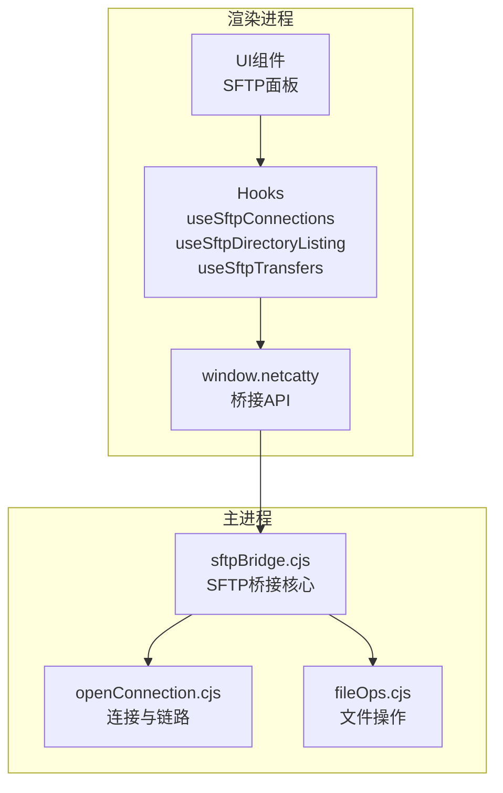
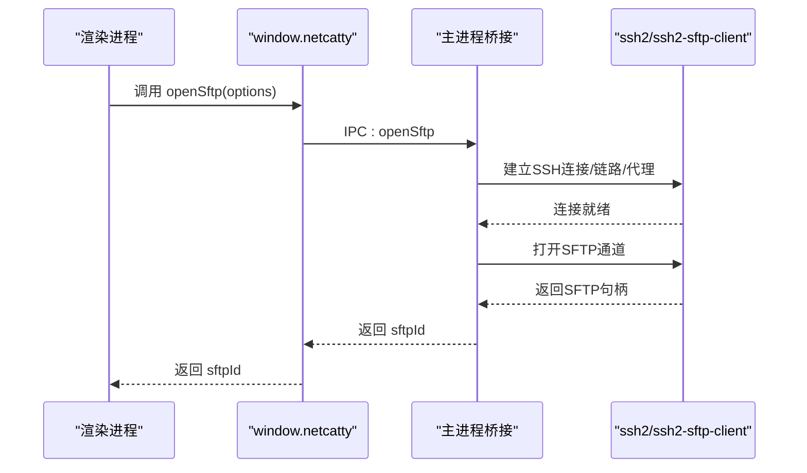
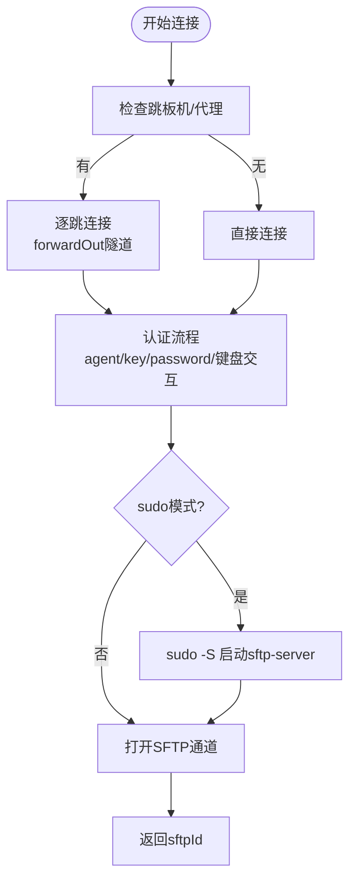
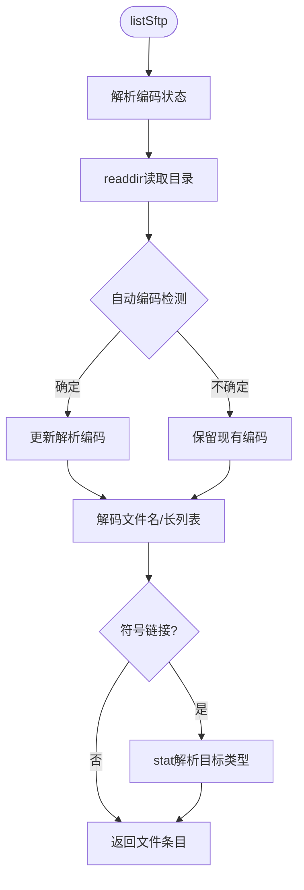
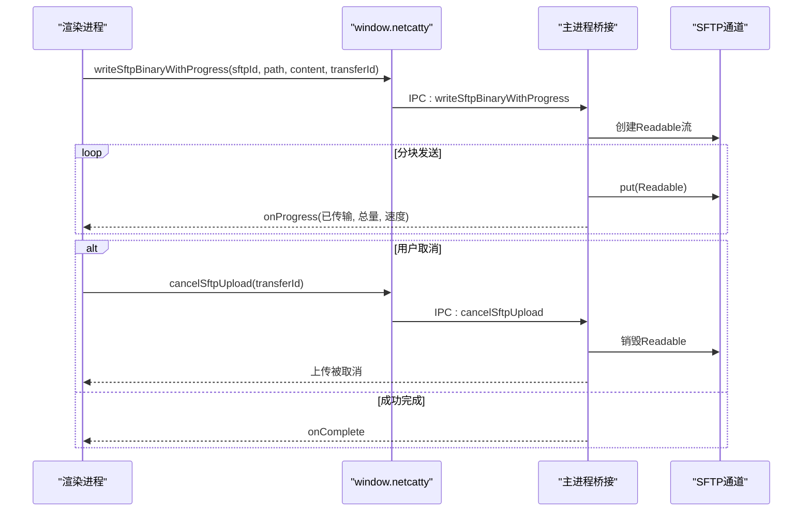
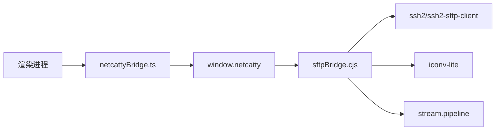

# SFTP桥接API

<cite>
**本文档引用的文件**
- [sftpBridge.cjs](file://electron/bridges/sftpBridge.cjs)
- [openConnection.cjs](file://electron/bridges/sftpBridge/openConnection.cjs)
- [fileOps.cjs](file://electron/bridges/sftpBridge/fileOps.cjs)
- [netcatty-bridge-sftp.d.ts](file://types/global/netcatty-bridge-sftp.d.ts)
- [useSftpConnections.ts](file://application/state/sftp/useSftpConnections.ts)
- [useSftpDirectoryListing.ts](file://application/state/sftp/useSftpDirectoryListing.ts)
- [useSftpTransfers.ts](file://application/state/sftp/useSftpTransfers.ts)
- [sftp.ts](file://domain/models/sftp.ts)
- [sftp.md](file://skills/netcatty-tool-cli/references/sftp.md)
- [netcattyBridge.ts](file://infrastructure/services/netcattyBridge.ts)
</cite>

## 目录
1. [简介](#简介)
2. [项目结构](#项目结构)
3. [核心组件](#核心组件)
4. [架构总览](#架构总览)
5. [详细组件分析](#详细组件分析)
6. [依赖关系分析](#依赖关系分析)
7. [性能考量](#性能考量)
8. [故障排除指南](#故障排除指南)
9. [结论](#结论)
10. [附录](#附录)

## 简介
本文件系统性地文档化了Netcatty应用中的SFTP桥接API，涵盖从渲染进程到主进程的IPC接口设计、SFTP会话管理、文件浏览、上传下载、权限设置、连接建立与断开、目录遍历、传输状态管理与错误处理机制。文档同时提供渲染进程侧的使用示例路径、协议特性说明（如编码检测、sudo模式）、并发传输控制与断点续传能力、安全考虑与性能优化建议，以及大文件传输最佳实践。

## 项目结构
SFTP桥接API由三部分组成：
- 渲染进程桥接层：通过window.netcatty暴露统一的SFTP API，供UI与业务逻辑调用。
- 主进程桥接层：在electron/bridges/sftpBridge中实现具体IPC处理，封装ssh2-sftp-client与ssh2的底层交互。
- 应用状态层：在application/state/sftp中协调会话、目录列表、传输任务与冲突处理。

**图表来源**
- [sftpBridge.cjs:1-970](file://electron/bridges/sftpBridge.cjs#L1-L970)
- [openConnection.cjs:1-874](file://electron/bridges/sftpBridge/openConnection.cjs#L1-L874)
- [fileOps.cjs:1-717](file://electron/bridges/sftpBridge/fileOps.cjs#L1-L717)

**章节来源**
- [sftpBridge.cjs:1-970](file://electron/bridges/sftpBridge.cjs#L1-L970)
- [openConnection.cjs:1-874](file://electron/bridges/sftpBridge/openConnection.cjs#L1-L874)
- [fileOps.cjs:1-717](file://electron/bridges/sftpBridge/fileOps.cjs#L1-L717)

## 核心组件
- SFTP桥接核心（sftpBridge.cjs）：负责SFTP通道管理、编码检测与转换、路径规范化、重试与超时控制、通道恢复与清理。
- 连接与链路（openConnection.cjs）：支持跳板机链路、代理、键盘交互认证、sudo模式、握手与保活策略。
- 文件操作（fileOps.cjs）：提供目录列举、读写、删除、重命名、权限变更、家目录探测、进度回调与取消、压缩包上传等。
- 类型定义（netcatty-bridge-sftp.d.ts）：声明渲染进程可用的SFTP API签名与可选扩展能力。
- 应用状态（useSftpConnections.ts、useSftpDirectoryListing.ts、useSftpTransfers.ts）：协调会话生命周期、目录缓存、传输队列与冲突处理。

**章节来源**
- [sftpBridge.cjs:1-970](file://electron/bridges/sftpBridge.cjs#L1-L970)
- [openConnection.cjs:1-874](file://electron/bridges/sftpBridge/openConnection.cjs#L1-L874)
- [fileOps.cjs:1-717](file://electron/bridges/sftpBridge/fileOps.cjs#L1-L717)
- [netcatty-bridge-sftp.d.ts:1-106](file://types/global/netcatty-bridge-sftp.d.ts#L1-L106)

## 架构总览
SFTP桥接采用“渲染进程API → 主进程桥接 → ssh2-sftp-client”的分层设计。渲染进程通过window.netcatty调用openSftp/listSftp/writeSftp等方法；主进程桥接层解析参数、建立SSH连接与SFTP通道、执行文件操作，并通过IPC返回结果或进度事件。

**图表来源**
- [openConnection.cjs:512-805](file://electron/bridges/sftpBridge/openConnection.cjs#L512-L805)
- [sftpBridge.cjs:760-785](file://electron/bridges/sftpBridge.cjs#L760-L785)

**章节来源**
- [openConnection.cjs:512-805](file://electron/bridges/sftpBridge/openConnection.cjs#L512-L805)
- [sftpBridge.cjs:760-785](file://electron/bridges/sftpBridge.cjs#L760-L785)

## 详细组件分析

### 会话管理与连接建立
- openSftp：支持直连、代理、跳板机链路、证书/密钥/密码认证、键盘交互认证、sudo模式、保活与算法配置。
- openSftpForSession：为已存在的SSH会话创建SFTP客户端包装，支持通道恢复与编码状态复制。
- 连接日志与进度：通过onSftpConnectionProgress向渲染进程推送连接阶段事件（connecting/auth-attempt/connected/error）。

**图表来源**
- [openConnection.cjs:512-805](file://electron/bridges/sftpBridge/openConnection.cjs#L512-L805)
- [sftpBridge.cjs:760-785](file://electron/bridges/sftpBridge.cjs#L760-L785)

**章节来源**
- [openConnection.cjs:1-874](file://electron/bridges/sftpBridge/openConnection.cjs#L1-L874)
- [sftpBridge.cjs:760-785](file://electron/bridges/sftpBridge.cjs#L760-L785)

### 文件浏览与编码处理
- listSftp：列出目录项，自动检测编码（UTF-8/GB18030），解码文件名，解析权限与符号链接目标类型。
- 编码状态：每个sftpId维护请求/解析后的编码状态，避免路径与名称乱码。
- 路径规范化：支持相对路径与Windows路径风格，确保跨平台兼容。

**图表来源**
- [fileOps.cjs:4-125](file://electron/bridges/sftpBridge/fileOps.cjs#L4-L125)
- [sftpBridge.cjs:106-144](file://electron/bridges/sftpBridge.cjs#L106-L144)

**章节来源**
- [fileOps.cjs:4-125](file://electron/bridges/sftpBridge/fileOps.cjs#L4-L125)
- [sftpBridge.cjs:106-144](file://electron/bridges/sftpBridge.cjs#L106-L144)

### 上传下载与传输控制
- 写入（文本/二进制）：支持缓冲区分块写入、流式写入、进度回调与取消。
- 下载：基于流管道，支持中断信号。
- 传输队列与冲突处理：批量任务、冲突提示与默认策略、同主机快速复制、子任务跟踪与进度聚合。
- 取消机制：通过transferId注册上传流，销毁Readable触发取消，最终返回cancelled状态。

**图表来源**
- [fileOps.cjs:223-356](file://electron/bridges/sftpBridge/fileOps.cjs#L223-L356)
- [fileOps.cjs:364-379](file://electron/bridges/sftpBridge/fileOps.cjs#L364-L379)

**章节来源**
- [fileOps.cjs:223-356](file://electron/bridges/sftpBridge/fileOps.cjs#L223-L356)
- [fileOps.cjs:364-379](file://electron/bridges/sftpBridge/fileOps.cjs#L364-L379)

### 权限设置与家目录探测
- chmodSftp：修改文件权限，支持八进制字符串。
- getSftpHomeDir：优先通过SSH执行命令探测家目录，回退到SFTP realpath('.')，并处理超时与中止信号。

**章节来源**
- [fileOps.cjs:572-694](file://electron/bridges/sftpBridge/fileOps.cjs#L572-L694)

### 渲染进程使用示例（路径）
以下为在渲染进程中打开SFTP连接、浏览远程文件、执行文件操作的参考路径（不包含代码内容）：
- 打开SFTP连接：[useSftpConnections.ts:270-321](file://application/state/sftp/useSftpConnections.ts#L270-L321)
- 列出远程文件：[useSftpDirectoryListing.ts:37-58](file://application/state/sftp/useSftpDirectoryListing.ts#L37-L58)
- 上传文件（带进度）：[useSftpTransfers.ts:508-597](file://application/state/sftp/useSftpTransfers.ts#L508-L597)
- 下载文件：[useSftpTransfers.ts:324-401](file://application/state/sftp/useSftpTransfers.ts#L324-L401)
- 关闭SFTP连接：[useSftpConnections.ts:542-575](file://application/state/sftp/useSftpConnections.ts#L542-L575)

**章节来源**
- [useSftpConnections.ts:270-321](file://application/state/sftp/useSftpConnections.ts#L270-L321)
- [useSftpDirectoryListing.ts:37-58](file://application/state/sftp/useSftpDirectoryListing.ts#L37-L58)
- [useSftpTransfers.ts:508-597](file://application/state/sftp/useSftpTransfers.ts#L508-L597)
- [useSftpTransfers.ts:324-401](file://application/state/sftp/useSftpTransfers.ts#L324-L401)
- [useSftpConnections.ts:542-575](file://application/state/sftp/useSftpConnections.ts#L542-L575)

## 依赖关系分析
- 渲染进程依赖window.netcatty桥接API，通过netcattyBridge工具类进行安全访问。
- 主进程桥接层依赖ssh2/ssh2-sftp-client、iconv-lite、pipeline等库，实现SFTP通道、编码转换与流式传输。
- 应用状态层协调UI与桥接层，维护会话映射、目录缓存与传输队列。

**图表来源**
- [netcattyBridge.ts:1-20](file://infrastructure/services/netcattyBridge.ts#L1-L20)
- [sftpBridge.cjs:1-40](file://electron/bridges/sftpBridge.cjs#L1-L40)

**章节来源**
- [netcattyBridge.ts:1-20](file://infrastructure/services/netcattyBridge.ts#L1-L20)
- [sftpBridge.cjs:1-40](file://electron/bridges/sftpBridge.cjs#L1-L40)

## 性能考量
- 编码检测与路径优化：自动检测编码以减少Buffer路径带来的兼容问题，避免不必要的ASCII-only路径转换。
- 并发与保活：支持每跳保活配置，防止NAT/防火墙导致的空闲断开；对跳板机链路采用forwardOut隧道复用。
- 传输优化：二进制写入使用256KB分块与Readable流，配合节流进度上报（时间阈值100ms、字节数1MB），降低IPC压力。
- 大文件传输：推荐使用流式写入与进度回调，避免一次性加载至内存；同主机场景可使用exec快速删除或同主机复制优化。

[本节为通用指导，无需特定文件引用]

## 故障排除指南
- 认证失败：检查代理/跳板机凭据、密钥是否加密且未提供口令；渲染进程可通过连接日志识别“auth-attempt”阶段的尝试与拒绝。
- 连接超时：调整keepalive间隔与计数，或检查网络策略；sudo模式下需确认sudo权限与TTY要求。
- 编码异常：若目录名乱码，确认编码设置（auto/utf-8/gb18030），必要时手动指定；编码状态会在会话间复制。
- 传输中断：使用cancelSftpUpload取消上传，或在传输队列中取消任务；注意同主机exec路径仅在UTF-8编码安全时启用。

**章节来源**
- [openConnection.cjs:198-230](file://electron/bridges/sftpBridge/openConnection.cjs#L198-L230)
- [fileOps.cjs:364-379](file://electron/bridges/sftpBridge/fileOps.cjs#L364-L379)

## 结论
SFTP桥接API在Netcatty中实现了从渲染进程到主进程的完整文件传输链路，覆盖连接建立、目录浏览、文件操作、权限管理、传输控制与错误处理。通过编码状态管理、链路保活、流式传输与进度回调，系统在安全性与性能之间取得平衡，并为大文件与复杂网络环境提供了稳健的支持。

[本节为总结性内容，无需特定文件引用]

## 附录

### API概览（渲染进程）
- 连接与关闭
  - openSftp(options): Promise<string>
  - closeSftp(sftpId): Promise<void>
- 文件浏览与读写
  - listSftp(sftpId, path, encoding?): Promise<RemoteFile[]>
  - readSftp(sftpId, path, encoding?): Promise<string>
  - readSftpBinary(sftpId, path, encoding?): Promise<ArrayBuffer>
  - writeSftp(sftpId, path, content, encoding?): Promise<void>
  - writeSftpBinary(sftpId, path, content, encoding?): Promise<void>
- 传输与进度
  - writeSftpBinaryWithProgress(sftpId, path, content, transferId, encoding?, onProgress?, onComplete?, onError?): Promise<{ success, transferId, cancelled? }>
  - cancelSftpUpload(transferId): Promise<{ success }>
  - uploadFile/sameHostCopyDirectory/startStreamTransfer/startCompressedUpload等（按需启用）
- 其他
  - mkdirSftp, deleteSftp, renameSftp, statSftp, chmodSftp, getSftpHomeDir

**章节来源**
- [netcatty-bridge-sftp.d.ts:1-106](file://types/global/netcatty-bridge-sftp.d.ts#L1-L106)

### 协议特性与限制
- 编码：支持auto/utf-8/gb18030，自动检测与解析；路径编码随会话状态传递。
- sudo模式：需要ssh2内部SFTPWrapper支持，不同平台可用性不同。
- 同主机优化：仅在UTF-8编码安全时使用exec快速路径，否则回退SFTP递归删除。
- 断点续传：当前未实现原生断点续传，但可通过分块流与取消后重新开始模拟；建议结合压缩上传与增量策略。

**章节来源**
- [sftpBridge.cjs:106-144](file://electron/bridges/sftpBridge.cjs#L106-L144)
- [fileOps.cjs:470-532](file://electron/bridges/sftpBridge/fileOps.cjs#L470-L532)

### 安全考虑
- 密钥与口令：优先使用密钥认证；加密密钥需提供口令；避免明文口令存储。
- 代理与跳板：验证代理凭据与跳板机链路完整性；避免在不可信网络中暴露凭据。
- sudo权限：谨慎启用sudo模式，确保最小权限原则与审计日志。

**章节来源**
- [openConnection.cjs:59-77](file://electron/bridges/sftpBridge/openConnection.cjs#L59-L77)
- [sftp.md:1-43](file://skills/netcatty-tool-cli/references/sftp.md#L1-L43)