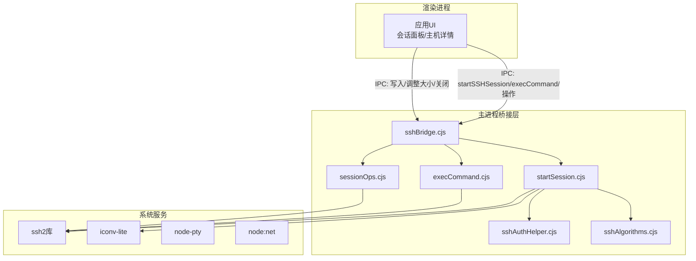
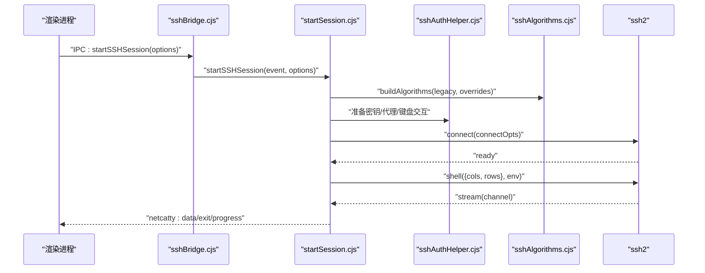
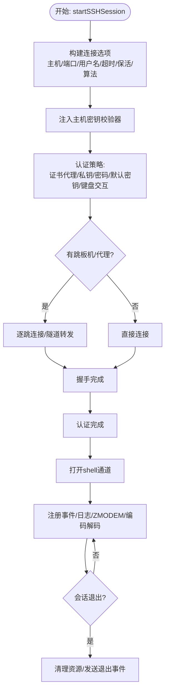
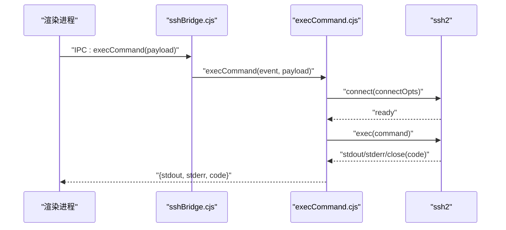
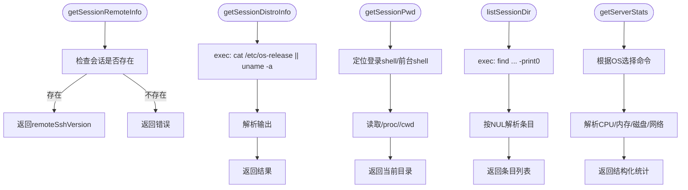
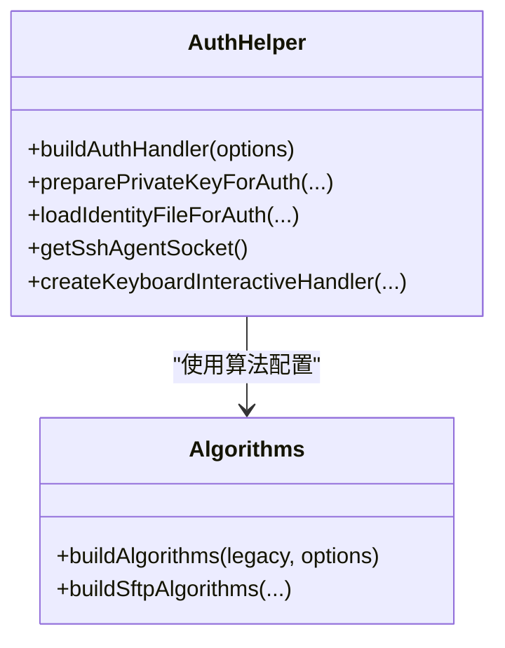
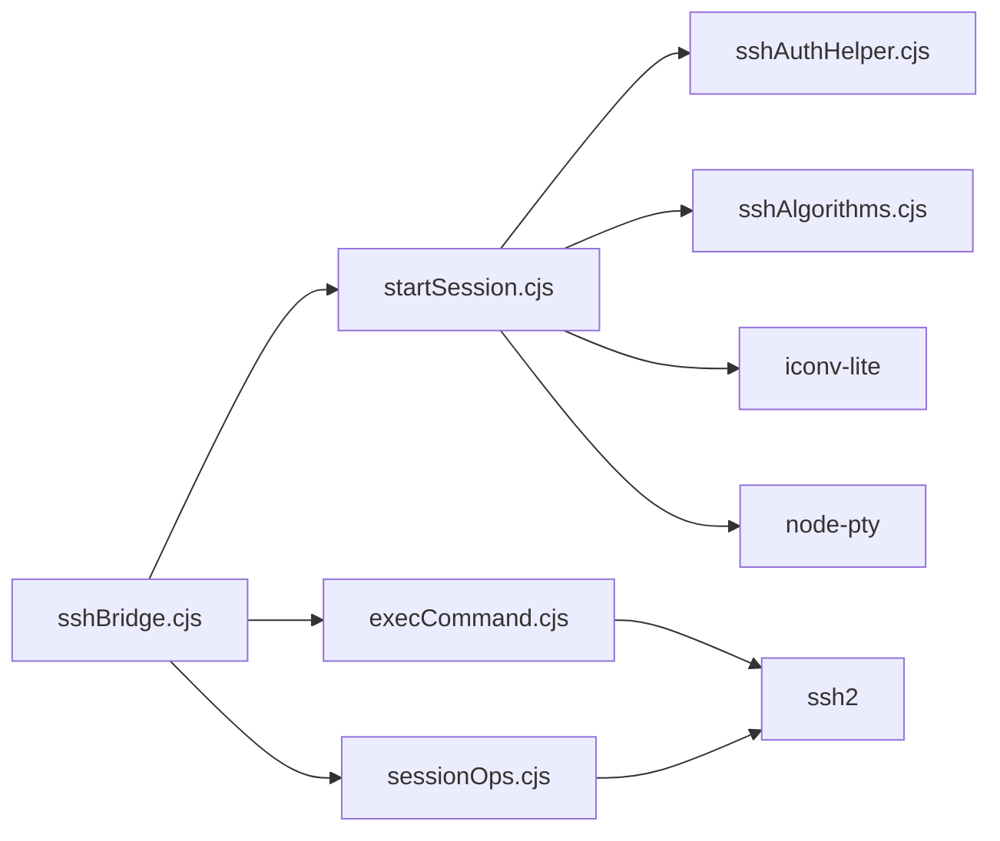

# SSH桥接API

<cite>
**本文档引用的文件**
- [sshBridge.cjs](file://electron/bridges/sshBridge.cjs)
- [startSession.cjs](file://electron/bridges/sshBridge/startSession.cjs)
- [execCommand.cjs](file://electron/bridges/sshBridge/execCommand.cjs)
- [sessionOps.cjs](file://electron/bridges/sshBridge/sessionOps.cjs)
- [sshAuthHelper.cjs](file://electron/bridges/sshAuthHelper.cjs)
- [sshAlgorithms.cjs](file://electron/bridges/sshAlgorithms.cjs)
- [terminalBridge.cjs](file://electron/bridges/terminalBridge.cjs)
- [sshAuth.ts](file://domain/sshAuth.ts)
- [netcatty-bridge-session.d.ts](file://types/global/netcatty-bridge-session.d.ts)
- [terminal.ts](file://domain/models/terminal.ts)
</cite>

## 目录
1. [简介](#简介)
2. [项目结构](#项目结构)
3. [核心组件](#核心组件)
4. [架构总览](#架构总览)
5. [详细组件分析](#详细组件分析)
6. [依赖关系分析](#依赖关系分析)
7. [性能考量](#性能考量)
8. [故障排除指南](#故障排除指南)
9. [结论](#结论)
10. [附录](#附录)

## 简介
本文件系统性梳理Netcatty中SSH桥接API的设计与实现，覆盖IPC接口定义、会话生命周期管理、认证流程、算法协商、链路代理、X11转发、ZMODEM文件传输、错误处理与超时控制等。文档同时给出渲染进程侧调用示例路径，帮助开发者快速集成SSH连接、命令执行与会话操作。

## 项目结构
SSH桥接位于Electron主进程的桥接层，通过IPC向渲染进程暴露统一的会话管理能力。核心模块包括：
- sshBridge：会话启动、命令执行、会话操作的入口封装
- startSession：完整的SSH会话建立、认证、通道管理
- execCommand：一次性命令执行（带超时与键盘交互）
- sessionOps：已连接会话的信息查询、目录列举、服务器统计等
- sshAuthHelper：认证辅助（密钥解析、代理、键盘交互、口令请求）
- sshAlgorithms：算法协商与兼容性处理
- terminalBridge：本地终端、Telnet、Mosh、串口等其他协议桥接（用于对比与参考）

图表来源
- [sshBridge.cjs:696-722](file://electron/bridges/sshBridge.cjs#L696-L722)
- [startSession.cjs:1-120](file://electron/bridges/sshBridge/startSession.cjs#L1-L120)
- [execCommand.cjs:1-120](file://electron/bridges/sshBridge/execCommand.cjs#L1-L120)
- [sessionOps.cjs:1-120](file://electron/bridges/sshBridge/sessionOps.cjs#L1-L120)
- [sshAuthHelper.cjs:1-120](file://electron/bridges/sshAuthHelper.cjs#L1-L120)
- [sshAlgorithms.cjs:1-120](file://electron/bridges/sshAlgorithms.cjs#L1-L120)

章节来源
- [sshBridge.cjs:696-722](file://electron/bridges/sshBridge.cjs#L696-L722)
- [startSession.cjs:1-120](file://electron/bridges/sshBridge/startSession.cjs#L1-L120)
- [execCommand.cjs:1-120](file://electron/bridges/sshBridge/execCommand.cjs#L1-L120)
- [sessionOps.cjs:1-120](file://electron/bridges/sshBridge/sessionOps.cjs#L1-L120)
- [sshAuthHelper.cjs:1-120](file://electron/bridges/sshAuthHelper.cjs#L1-L120)
- [sshAlgorithms.cjs:1-120](file://electron/bridges/sshAlgorithms.cjs#L1-L120)

## 核心组件
- 会话启动器：负责建立SSH连接、处理认证、打开shell通道、X11转发、日志流、ZMODEM事件、输出缓冲与编码解码。
- 命令执行器：一次性连接执行命令，支持超时、键盘交互认证、算法协商与密钥加载。
- 会话操作器：对已连接会话进行信息查询（远端版本、发行版探测）、目录列举、服务器统计等。
- 认证助手：统一处理密钥加载/解析、代理（ssh-agent/证书代理）、键盘交互、口令请求与加密密钥校验。
- 算法协商：根据主机配置与兼容性需求构建现代/传统算法列表，过滤不支持的固定DH组与HMAC。

章节来源
- [sshBridge.cjs:696-722](file://electron/bridges/sshBridge.cjs#L696-L722)
- [sshAuthHelper.cjs:464-718](file://electron/bridges/sshAuthHelper.cjs#L464-L718)
- [sshAlgorithms.cjs:196-213](file://electron/bridges/sshAlgorithms.cjs#L196-L213)

## 架构总览
下图展示从渲染进程发起SSH会话到主进程建立连接、认证、打开shell通道的完整序列：

图表来源
- [sshBridge.cjs:696-722](file://electron/bridges/sshBridge.cjs#L696-L722)
- [startSession.cjs:516-774](file://electron/bridges/sshBridge/startSession.cjs#L516-L774)
- [sshAuthHelper.cjs:136-196](file://electron/bridges/sshAuthHelper.cjs#L136-L196)
- [sshAlgorithms.cjs:196-213](file://electron/bridges/sshAlgorithms.cjs#L196-L213)

## 详细组件分析

### 会话启动（startSSHSession）
- 功能要点
  - 支持直连、跳板机链路、代理（SOCKS/HTTP）三种接入方式
  - 自动发现并缓存成功认证方法，提升后续连接速度
  - 支持X11转发、会话日志流、ZMODEM文件传输、输出缓冲与编码解码
  - 超时控制：握手、认证、保活参数可配置
- 关键流程
  - 构建连接选项（主机、端口、用户名、超时、保活、算法）
  - 主机密钥校验器注入
  - 认证策略：证书代理、私钥、密码、默认密钥回退、键盘交互
  - 链路/代理：逐跳连接、隧道转发、代理套接字
  - 建立shell通道，注册数据/错误/退出事件，启动日志与ZMODEM处理
- 错误处理
  - 认证失败清除缓存，避免重复尝试
  - 运输层错误在关闭前上报，确保UI正确显示
  - 会话退出原因区分：正常退出、超时、网络关闭、错误

图表来源
- [startSession.cjs:38-120](file://electron/bridges/sshBridge/startSession.cjs#L38-L120)
- [startSession.cjs:480-695](file://electron/bridges/sshBridge/startSession.cjs#L480-L695)
- [startSession.cjs:718-774](file://electron/bridges/sshBridge/startSession.cjs#L718-L774)

章节来源
- [startSession.cjs:1-120](file://electron/bridges/sshBridge/startSession.cjs#L1-L120)
- [startSession.cjs:480-695](file://electron/bridges/sshBridge/startSession.cjs#L480-L695)
- [startSession.cjs:718-774](file://electron/bridges/sshBridge/startSession.cjs#L718-L774)

### 命令执行（execCommand）
- 功能要点
  - 一次性连接执行命令，自动选择超时（普通或键盘交互模式）
  - 支持密钥/证书/密码认证，键盘交互认证可选
  - 返回标准输出、标准错误与退出码
- 关键流程
  - 解析密钥/证书与口令
  - 构建连接选项（含算法）
  - 建立连接，执行命令，收集输出，关闭连接
  - 键盘交互模式下注册回调处理挑战

图表来源
- [execCommand.cjs:1-120](file://electron/bridges/sshBridge/execCommand.cjs#L1-L120)
- [execCommand.cjs:120-185](file://electron/bridges/sshBridge/execCommand.cjs#L120-L185)

章节来源
- [execCommand.cjs:1-120](file://electron/bridges/sshBridge/execCommand.cjs#L1-L120)
- [execCommand.cjs:120-185](file://electron/bridges/sshBridge/execCommand.cjs#L120-L185)

### 会话操作（sessionOps）
- 功能要点
  - 获取远端SSH版本（banner中的software字段）
  - 发行版探测（/etc/os-release或uname）
  - 当前工作目录查询（通过exec通道定位前台shell）
  - 目录列举（NUL分隔流，支持前缀过滤与数量限制）
  - 服务器统计（CPU、内存、磁盘、网络），跨Linux/macOS实现
- 关键流程
  - 使用现有连接的exec通道执行命令
  - 解析输出为结构化数据
  - 对网络接口/磁盘使用率做时间窗口计算

图表来源
- [sessionOps.cjs:4-69](file://electron/bridges/sshBridge/sessionOps.cjs#L4-L69)
- [sessionOps.cjs:71-238](file://electron/bridges/sshBridge/sessionOps.cjs#L71-L238)
- [sessionOps.cjs:341-477](file://electron/bridges/sshBridge/sessionOps.cjs#L341-L477)
- [sessionOps.cjs:483-800](file://electron/bridges/sshBridge/sessionOps.cjs#L483-L800)

章节来源
- [sessionOps.cjs:4-69](file://electron/bridges/sshBridge/sessionOps.cjs#L4-L69)
- [sessionOps.cjs:71-238](file://electron/bridges/sshBridge/sessionOps.cjs#L71-L238)
- [sessionOps.cjs:341-477](file://electron/bridges/sshBridge/sessionOps.cjs#L341-L477)
- [sessionOps.cjs:483-800](file://electron/bridges/sshBridge/sessionOps.cjs#L483-L800)

### 认证与算法
- 认证策略
  - 证书代理（NetcattyAgent）优先
  - 私钥（内联/文件）+口令+默认密钥回退
  - 系统ssh-agent（可启用代理转发）
  - 键盘交互（2FA/MFA）与自动填充策略
  - 加密密钥口令请求与取消处理
- 算法协商
  - 默认现代算法集（cipher/kex/compress）
  - 可选追加传统算法（兼容旧设备）
  - 用户覆盖与ECDSA主机密钥剔除
  - 运行时检测不支持的固定DH组与HMAC

图表来源
- [sshAuthHelper.cjs:464-718](file://electron/bridges/sshAuthHelper.cjs#L464-L718)
- [sshAlgorithms.cjs:196-213](file://electron/bridges/sshAlgorithms.cjs#L196-L213)

章节来源
- [sshAuthHelper.cjs:464-718](file://electron/bridges/sshAuthHelper.cjs#L464-L718)
- [sshAlgorithms.cjs:196-213](file://electron/bridges/sshAlgorithms.cjs#L196-L213)

### 渲染进程API与调用示例
- 会话启动
  - IPC接口：startSSHSession(options)
  - 返回值：sessionId（字符串）
  - 示例路径：[startSSHSession调用点:696-722](file://electron/bridges/sshBridge.cjs#L696-L722)
- 命令执行
  - IPC接口：execCommand(payload)
  - 返回值：{ stdout, stderr, code }
  - 示例路径：[execCommand调用点:715-722](file://electron/bridges/sshBridge.cjs#L715-L722)
- 会话操作
  - IPC接口：getSessionRemoteInfo/getSessionDistroInfo/getSessionPwd/listSessionDir/getServerStats
  - 示例路径：[sessionOps导出:715-722](file://electron/bridges/sshBridge.cjs#L715-L722)
- 事件监听
  - 数据/退出/键盘交互/主机密钥验证/口令请求等事件
  - 示例路径：[事件类型定义:182-265](file://types/global/netcatty-bridge-session.d.ts#L182-L265)

章节来源
- [netcatty-bridge-session.d.ts:1-269](file://types/global/netcatty-bridge-session.d.ts#L1-L269)
- [sshBridge.cjs:696-722](file://electron/bridges/sshBridge.cjs#L696-L722)

## 依赖关系分析
- 组件耦合
  - sshBridge.cjs作为门面，聚合startSession/execCommand/sessionOps
  - startSession依赖sshAuthHelper与sshAlgorithms，间接依赖iconv-lite、node-pty（用于日志/输出缓冲）
  - sessionOps复用现有连接，避免额外握手开销
- 外部依赖
  - ssh2：SSH协议栈
  - iconv-lite：字符编码解码
  - node-pty：会话日志与输出缓冲（在某些场景）
  - node:net：TCP/代理套接字

图表来源
- [sshBridge.cjs:696-722](file://electron/bridges/sshBridge.cjs#L696-L722)
- [startSession.cjs:1-120](file://electron/bridges/sshBridge/startSession.cjs#L1-L120)
- [execCommand.cjs:1-120](file://electron/bridges/sshBridge/execCommand.cjs#L1-L120)
- [sessionOps.cjs:1-120](file://electron/bridges/sshBridge/sessionOps.cjs#L1-L120)

章节来源
- [sshBridge.cjs:696-722](file://electron/bridges/sshBridge.cjs#L696-L722)
- [startSession.cjs:1-120](file://electron/bridges/sshBridge/startSession.cjs#L1-L120)
- [execCommand.cjs:1-120](file://electron/bridges/sshBridge/execCommand.cjs#L1-L120)
- [sessionOps.cjs:1-120](file://electron/bridges/sshBridge/sessionOps.cjs#L1-L120)

## 性能考量
- 输出缓冲与批量刷新
  - 使用ptyOutputBuffer在事件循环空闲时批量推送，减少定时器抖动
  - 突发输出设置上限强制立即刷新，避免交互延迟
- TCP优化
  - 启用TCP_NODELAY（SSH与代理套接字）
  - 保活间隔与计数可按跳板/目标主机分别配置
- 算法协商
  - 默认现代算法优先，必要时追加传统算法
  - 运行时检测不支持的固定DH组与HMAC，避免握手失败重试
- 会话复用
  - 缓存成功认证方法，避免重复尝试
  - 已连接会话的探测与统计走同一连接的exec通道，减少额外握手

章节来源
- [startSession.cjs:635-643](file://electron/bridges/sshBridge/startSession.cjs#L635-L643)
- [sshAlgorithms.cjs:27-46](file://electron/bridges/sshAlgorithms.cjs#L27-L46)
- [sshBridge.cjs:300-355](file://electron/bridges/sshBridge.cjs#L300-L355)

## 故障排除指南
- 认证失败
  - 检查是否缓存了错误的认证方法；首次失败会清除缓存
  - 若使用加密密钥，确认口令正确或取消后重新输入
  - 键盘交互挑战中，确认提示词匹配“一次性密码/验证码”等词汇，避免误填
- 主机密钥变更
  - 触发主机密钥验证事件，允许用户接受新密钥或拒绝
- 超时与保活
  - 调整keepaliveInterval/keepaliveCountMax以适配网络环境
  - 链路/代理场景下，逐跳保活独立配置
- X11转发
  - 确认服务器允许X11转发且安装xauth；客户端需设置DISPLAY
- 日志与调试
  - 开启NETCATTY_SSH_DEBUG可输出ssh2调试日志
  - 会话日志流可配置目录与格式，便于问题复现

章节来源
- [startSession.cjs:776-800](file://electron/bridges/sshBridge/startSession.cjs#L776-L800)
- [sshAuthHelper.cjs:120-134](file://electron/bridges/sshAuthHelper.cjs#L120-L134)
- [sshBridge.cjs:259-294](file://electron/bridges/sshBridge.cjs#L259-L294)

## 结论
该SSH桥接API以清晰的职责分离实现了从连接建立、认证、通道管理到会话操作的全链路能力。通过算法协商、认证缓存、保活与TCP优化，兼顾了兼容性与性能。渲染进程可通过统一的IPC接口便捷地发起SSH会话、执行命令与管理会话状态。

## 附录

### 协议支持与认证方式
- 协议支持
  - SSH：直连/跳板机/代理
  - Telnet：原生Telnet会话（另见terminalBridge）
  - Mosh：通过握手与客户端切换（另见terminalBridge）
- 认证方式
  - 密码、密钥（内联/文件）、证书代理（NetcattyAgent）、系统ssh-agent、键盘交互（2FA/MFA）
- 代理配置
  - 支持SOCKS/HTTP代理；链路场景下每跳独立代理

章节来源
- [sshBridge.cjs:380-691](file://electron/bridges/sshBridge.cjs#L380-L691)
- [terminalBridge.cjs:471-514](file://electron/bridges/terminalBridge.cjs#L471-L514)
- [sshAuth.ts:1-125](file://domain/sshAuth.ts#L1-L125)

### 会话生命周期与超时控制
- 生命周期
  - 连接建立 → 握手 → 认证 → 打开shell → 数据/错误/退出事件 → 清理
- 超时控制
  - readyTimeout：连接+认证总时限
  - 一次性命令：默认10秒，键盘交互模式至少120秒
  - 保活：可按跳板/目标主机分别配置

章节来源
- [startSession.cjs:34-60](file://electron/bridges/sshBridge/startSession.cjs#L34-L60)
- [execCommand.cjs:5-10](file://electron/bridges/sshBridge/execCommand.cjs#L5-L10)

### 安全考虑
- 算法安全
  - 默认优先现代算法，必要时追加传统算法
  - 可剔除ECDSA主机密钥，避免严格签名验证导致的握手失败
- 密钥安全
  - 加密密钥口令请求与取消处理
  - 仅在需要时加载密钥文件，避免泄露
- 主机密钥校验
  - 未知/变更主机密钥需用户确认

章节来源
- [sshAlgorithms.cjs:180-213](file://electron/bridges/sshAlgorithms.cjs#L180-L213)
- [sshAuthHelper.cjs:120-134](file://electron/bridges/sshAuthHelper.cjs#L120-L134)
- [sshBridge.cjs:60-68](file://electron/bridges/sshBridge.cjs#L60-L68)