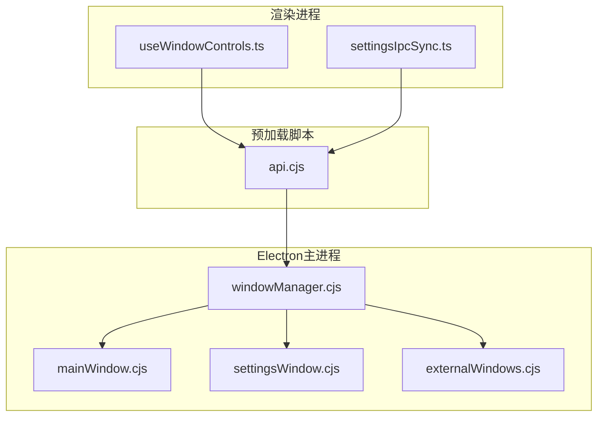
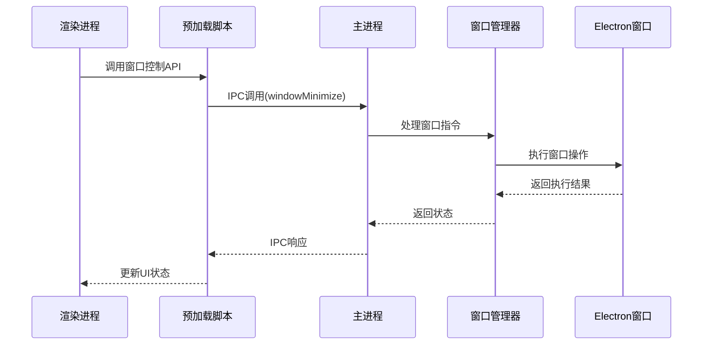
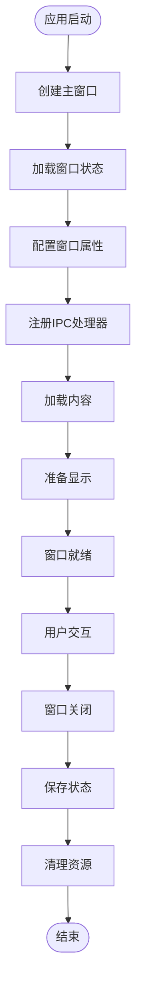
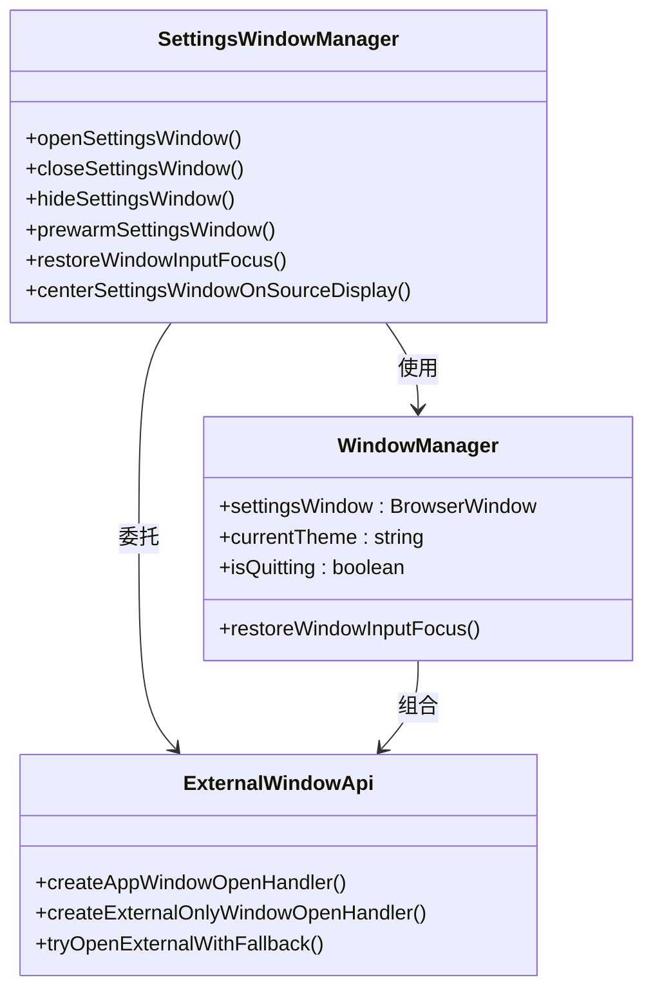
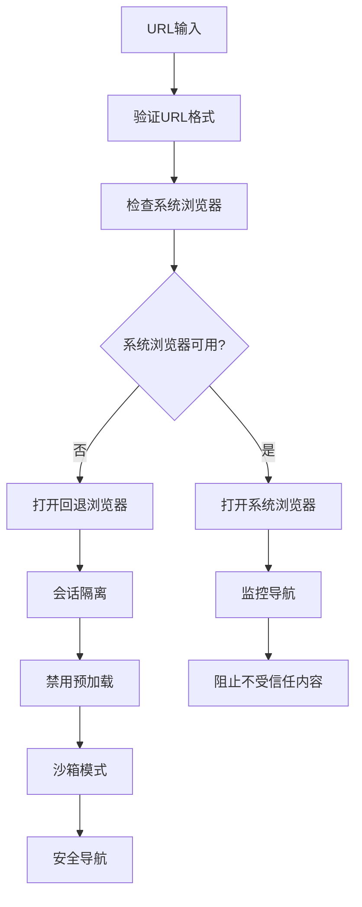
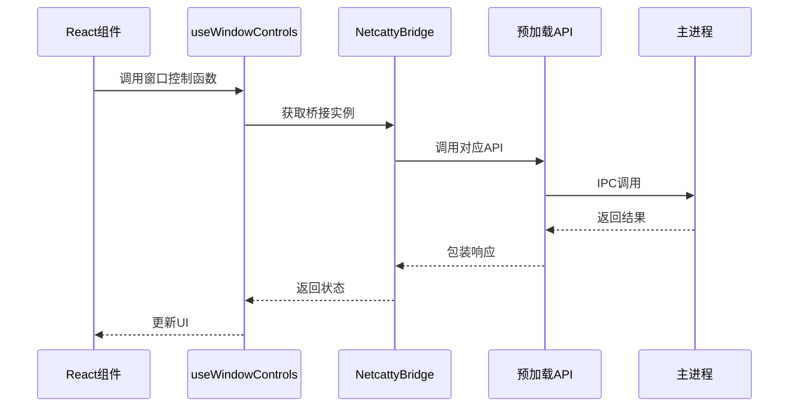
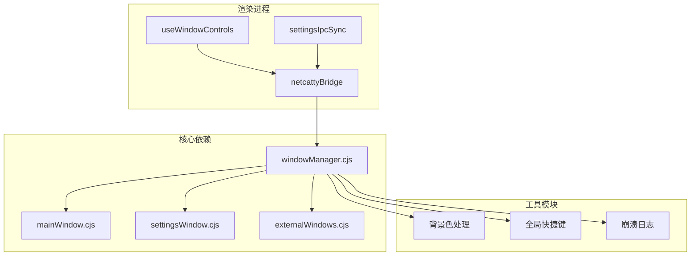

# 窗口管理桥接API

<cite>
**本文档引用的文件**
- [windowManager.cjs](file://electron/bridges/windowManager.cjs)
- [mainWindow.cjs](file://electron/bridges/windowManager/mainWindow.cjs)
- [settingsWindow.cjs](file://electron/bridges/windowManager/settingsWindow.cjs)
- [externalWindows.cjs](file://electron/bridges/windowManager/externalWindows.cjs)
- [api.cjs](file://electron/preload/api.cjs)
- [useWindowControls.ts](file://application/state/useWindowControls.ts)
- [settingsIpcSync.ts](file://application/state/settingsIpcSync.ts)
</cite>

## 目录
1. [简介](#简介)
2. [项目结构](#项目结构)
3. [核心组件](#核心组件)
4. [架构概览](#架构概览)
5. [详细组件分析](#详细组件分析)
6. [依赖关系分析](#依赖关系分析)
7. [性能考量](#性能考量)
8. [故障排除指南](#故障排除指南)
9. [结论](#结论)
10. [附录](#附录)

## 简介

窗口管理桥接API是Netcatty应用中负责Electron窗口生命周期管理的核心模块。该API提供了完整的窗口创建、销毁、最小化、最大化等操作接口，支持主窗口、设置窗口和外部窗口的统一管理。文档化了窗口状态同步、窗口间通信、安全防护和性能优化等关键特性。

该系统采用分层架构设计，通过IPC（进程间通信）实现渲染进程与主进程的窗口控制，确保跨平台兼容性和安全性。

## 项目结构

窗口管理相关文件组织结构如下：



**图表来源**
- [windowManager.cjs:1-951](file://electron/bridges/windowManager.cjs#L1-L951)
- [mainWindow.cjs:1-324](file://electron/bridges/windowManager/mainWindow.cjs#L1-L324)
- [settingsWindow.cjs:1-334](file://electron/bridges/windowManager/settingsWindow.cjs#L1-L334)
- [externalWindows.cjs:1-280](file://electron/bridges/windowManager/externalWindows.cjs#L1-L280)

**章节来源**
- [windowManager.cjs:1-951](file://electron/bridges/windowManager.cjs#L1-L951)
- [mainWindow.cjs:1-324](file://electron/bridges/windowManager/mainWindow.cjs#L1-L324)
- [settingsWindow.cjs:1-334](file://electron/bridges/windowManager/settingsWindow.cjs#L1-L334)
- [externalWindows.cjs:1-280](file://electron/bridges/windowManager/externalWindows.cjs#L1-L280)

## 核心组件

### 主窗口管理器
主窗口管理器负责应用程序主界面的创建、配置和生命周期管理。主要功能包括：

- **窗口创建与配置**：支持自定义窗口尺寸、主题颜色、图标等参数
- **状态持久化**：自动保存和恢复窗口位置、大小、最大化状态
- **导航安全**：防止不受信任的导航操作
- **事件监听**：处理窗口大小变化、移动、关闭等事件

### 设置窗口管理器
设置窗口专门用于应用设置界面的管理，具有以下特性：

- **焦点管理**：跨平台的窗口焦点恢复机制
- **位置计算**：智能定位到源窗口显示区域中心
- **隐藏策略**：关闭时隐藏而非销毁，提升响应速度
- **安全导航**：限制不受信任的内容访问

### 外部窗口管理器
处理外部链接和OAuth流程的窗口管理：

- **浏览器回退机制**：当系统默认浏览器不可用时提供内嵌浏览器
- **OAuth授权窗口**：安全的OAuth回调处理
- **弹窗拦截**：防止恶意弹窗和钓鱼攻击
- **会话隔离**：使用独立的浏览器会话分区

**章节来源**
- [windowManager.cjs:59-166](file://electron/bridges/windowManager.cjs#L59-L166)
- [mainWindow.cjs:4-324](file://electron/bridges/windowManager/mainWindow.cjs#L4-L324)
- [settingsWindow.cjs:102-334](file://electron/bridges/windowManager/settingsWindow.cjs#L102-L334)
- [externalWindows.cjs:16-280](file://electron/bridges/windowManager/externalWindows.cjs#L16-L280)

## 架构概览

窗口管理系统的整体架构采用分层设计，确保职责分离和可维护性：



**图表来源**
- [api.cjs:347-356](file://electron/preload/api.cjs#L347-L356)
- [windowManager.cjs:700-749](file://electron/bridges/windowManager.cjs#L700-L749)

系统架构的关键特点：

1. **分层设计**：渲染进程 → 预加载脚本 → 主进程 → 窗口管理器 → Electron窗口
2. **IPC通信**：所有窗口操作通过IPC进行，确保安全隔离
3. **状态同步**：支持多窗口间的状态同步和事件广播
4. **错误处理**：完善的异常捕获和错误恢复机制

**章节来源**
- [windowManager.cjs:697-853](file://electron/bridges/windowManager.cjs#L697-L853)
- [api.cjs:1-928](file://electron/preload/api.cjs#L1-L928)

## 详细组件分析

### 主窗口生命周期管理

主窗口的生命周期管理是整个系统的核心，涉及复杂的初始化、状态管理和清理过程：



**图表来源**
- [mainWindow.cjs:4-324](file://electron/bridges/windowManager/mainWindow.cjs#L4-L324)
- [windowManager.cjs:173-237](file://electron/bridges/windowManager.cjs#L173-L237)

关键实现特性：

1. **状态持久化**：自动保存窗口位置、大小、最大化状态
2. **安全导航**：限制不受信任的导航请求
3. **崩溃检测**：监控渲染进程崩溃并记录日志
4. **延迟显示**：等待渲染器准备好后再显示窗口

### 设置窗口管理机制

设置窗口采用特殊的管理策略以提升用户体验：



**图表来源**
- [settingsWindow.cjs:102-334](file://electron/bridges/windowManager/settingsWindow.cjs#L102-L334)
- [windowManager.cjs:307-326](file://electron/bridges/windowManager.cjs#L307-L326)

**章节来源**
- [settingsWindow.cjs:53-334](file://electron/bridges/windowManager/settingsWindow.cjs#L53-L334)
- [windowManager.cjs:667-695](file://electron/bridges/windowManager.cjs#L667-L695)

### 外部窗口安全机制

外部窗口管理器实现了多层次的安全防护：



**图表来源**
- [externalWindows.cjs:146-184](file://electron/bridges/windowManager/externalWindows.cjs#L146-L184)
- [externalWindows.cjs:198-268](file://electron/bridges/windowManager/externalWindows.cjs#L198-L268)

**章节来源**
- [externalWindows.cjs:16-280](file://electron/bridges/windowManager/externalWindows.cjs#L16-L280)

### 窗口控制IPC接口

窗口控制通过标准化的IPC接口实现：

| 接口名称 | 功能描述 | 参数 | 返回值 |
|---------|----------|------|--------|
| `netcatty:window:minimize` | 最小化窗口 | event | void |
| `netcatty:window:maximize` | 切换窗口最大化状态 | event | boolean |
| `netcatty:window:close` | 关闭窗口 | event | void |
| `netcatty:window:isMaximized` | 检查窗口是否最大化 | event | boolean |
| `netcatty:window:isFullscreen` | 检查窗口是否全屏 | event | boolean |
| `netcatty:window:focus` | 恢复窗口焦点 | event | boolean |

**章节来源**
- [windowManager.cjs:700-799](file://electron/bridges/windowManager.cjs#L700-L799)

### 渲染进程集成

渲染进程通过预加载脚本提供的API访问窗口控制功能：



**图表来源**
- [useWindowControls.ts:1-65](file://application/state/useWindowControls.ts#L1-L65)
- [api.cjs:347-356](file://electron/preload/api.cjs#L347-L356)

**章节来源**
- [useWindowControls.ts:1-65](file://application/state/useWindowControls.ts#L1-L65)
- [api.cjs:347-356](file://electron/preload/api.cjs#L347-L356)

## 依赖关系分析

窗口管理系统各组件间的依赖关系如下：



**图表来源**
- [windowManager.cjs:11-50](file://electron/bridges/windowManager.cjs#L11-L50)
- [mainWindow.cjs:101-107](file://electron/bridges/windowManager/mainWindow.cjs#L101-L107)

**章节来源**
- [windowManager.cjs:11-50](file://electron/bridges/windowManager.cjs#L11-L50)
- [mainWindow.cjs:101-107](file://electron/bridges/windowManager/mainWindow.cjs#L101-L107)

## 性能考量

### 窗口状态优化

系统采用了多项性能优化措施：

1. **状态队列化**：批量处理窗口状态保存，避免频繁磁盘写入
2. **延迟显示**：等待渲染器准备好后再显示窗口，减少闪烁
3. **内存管理**：及时清理不再使用的窗口引用和事件监听器
4. **异步操作**：所有磁盘IO操作都采用异步方式

### 资源管理策略

- **窗口复用**：设置窗口采用隐藏而非销毁的策略
- **垃圾回收**：跟踪回退浏览器窗口，确保正确释放
- **事件去抖动**：对窗口大小变化事件进行防抖处理

## 故障排除指南

### 常见问题诊断

1. **窗口无法显示**
   - 检查渲染器ready信号是否正常发送
   - 验证开发服务器URL配置
   - 确认窗口权限和安全设置

2. **窗口状态丢失**
   - 检查userData目录权限
   - 验证window-state.json文件完整性
   - 确认磁盘空间充足

3. **导航被阻止**
   - 检查allowedOrigins配置
   - 验证开发服务器URL格式
   - 确认URL协议和端口正确

### 调试方法

启用窗口管理调试：
```bash
NETCATTY_DEBUG_WINDOWS=1 npm run start
```

关键调试信息包括：
- 窗口创建和销毁事件
- IPC调用日志
- 状态保存和加载过程
- 导航拦截记录

**章节来源**
- [windowManager.cjs:59-67](file://electron/bridges/windowManager.cjs#L59-L67)
- [mainWindow.cjs:90-107](file://electron/bridges/windowManager/mainWindow.cjs#L90-L107)

## 结论

窗口管理桥接API为Netcatty应用提供了完整、安全、高性能的窗口管理解决方案。通过分层架构设计、严格的IPC通信机制和全面的安全防护，系统能够在保证安全性的同时提供优秀的用户体验。

主要优势包括：
- **安全性**：多重安全防护机制，防止恶意内容和攻击
- **可靠性**：完善的错误处理和恢复机制
- **性能**：优化的资源管理和状态持久化
- **可维护性**：清晰的代码结构和模块化设计

该系统为类似的企业级应用提供了良好的参考实现，特别是在窗口管理、安全防护和用户体验方面的最佳实践。

## 附录

### API使用示例

#### 在渲染进程中管理窗口
```typescript
// 获取窗口控制钩子
const { minimize, maximize, close } = useWindowControls();

// 最小化窗口
await minimize();

// 切换最大化状态
const isMaximized = await maximize();
```

#### 同步设置状态
```typescript
// 监听设置变更
useEffect(() => {
  const unsubscribe = netcattyBridge.get().onSettingsChanged((payload) => {
    // 处理设置变更
  });
  
  return () => unsubscribe();
}, []);
```

### 安全配置建议

1. **严格URL验证**：始终验证和白名单化允许的URL
2. **会话隔离**：对外部内容使用独立的浏览器会话
3. **权限最小化**：只授予必要的窗口操作权限
4. **监控审计**：记录所有窗口操作和导航行为