# 系统集成桥接API

<cite>
**本文档引用的文件**
- [api.cjs](file://electron/preload/api.cjs)
- [registerBridges.cjs](file://electron/main/registerBridges.cjs)
- [netcatty-bridge-app.d.ts](file://types/global/netcatty-bridge-app.d.ts)
- [netcatty-bridge-session.d.ts](file://types/global/netcatty-bridge-session.d.ts)
- [autoUpdateBridge.cjs](file://electron/bridges/autoUpdateBridge.cjs)
- [credentialBridge.cjs](file://electron/bridges/credentialBridge.cjs)
- [fileWatcherBridge.cjs](file://electron/bridges/fileWatcherBridge.cjs)
- [hostKeyVerifier.cjs](file://electron/bridges/hostKeyVerifier.cjs)
- [portForwardingBridge.cjs](file://electron/bridges/portForwardingBridge.cjs)
- [sessionLogsBridge.cjs](file://electron/bridges/sessionLogsBridge.cjs)
- [vaultBackupBridge.cjs](file://electron/bridges/vaultBackupBridge.cjs)
- [zmodemHelper.cjs](file://electron/bridges/zmodemHelper.cjs)
- [useAutoSync.ts](file://application/state/useAutoSync.ts)
</cite>

## 目录
1. [简介](#简介)
2. [项目结构](#项目结构)
3. [核心组件](#核心组件)
4. [架构总览](#架构总览)
5. [详细组件分析](#详细组件分析)
6. [依赖关系分析](#依赖关系分析)
7. [性能考量](#性能考量)
8. [故障排除指南](#故障排除指南)
9. [结论](#结论)
10. [附录](#附录)

## 简介
本文件系统性梳理了应用中的系统集成桥接API，覆盖自动更新、凭据管理、文件监控、主机密钥验证、端口转发、会话日志、保险库备份、ZMODEM传输等系统级功能。文档面向不同技术背景的读者，既提供高层架构视图，也给出代码级实现细节与调用示例路径，帮助开发者正确集成与扩展系统能力。

## 项目结构
系统桥接API主要由三部分组成：
- 预加载层（Preload）：通过 `window.netcattyBridge` 暴露统一的IPC接口给渲染进程，封装底层桥接能力。
- 主进程桥接层（Main Bridges）：各子系统桥接器（如自动更新、凭据、文件监控、端口转发等）注册IPC处理器，执行系统级操作。
- 类型定义层（TypeScript）：为预加载层提供类型约束，确保API签名一致且可维护。

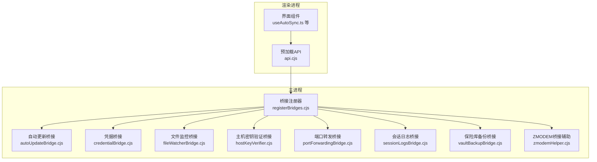

**图表来源**
- [api.cjs:1-928](file://electron/preload/api.cjs#L1-L928)
- [registerBridges.cjs:1-678](file://electron/main/registerBridges.cjs#L1-L678)

**章节来源**
- [api.cjs:1-928](file://electron/preload/api.cjs#L1-L928)
- [registerBridges.cjs:1-678](file://electron/main/registerBridges.cjs#L1-L678)

## 核心组件
- 预加载API（window.netcattyBridge）
  - 统一暴露系统功能入口，包含会话管理、SFTP、本地文件系统、窗口控制、云同步、端口转发、文件监控、会话日志、保险库备份、ZMODEM传输、凭据加密、自动更新等。
  - 提供事件监听器注册与取消、进度回调、错误处理等机制。
- 主进程桥接器
  - 将渲染进程请求路由到具体系统能力，如ssh2连接、文件系统读写、临时目录管理、electron-updater等。
  - 负责安全校验、资源清理、跨窗口状态同步等。
- 类型定义
  - 为预加载API提供强类型约束，确保调用方与实现保持一致。

**章节来源**
- [netcatty-bridge-app.d.ts:1-87](file://types/global/netcatty-bridge-app.d.ts#L1-L87)
- [netcatty-bridge-session.d.ts:1-269](file://types/global/netcatty-bridge-session.d.ts#L1-L269)

## 架构总览
系统采用“预加载API + 主进程桥接”的双层架构：
- 渲染进程通过预加载API发起IPC调用，避免直接使用原始IPC通道。
- 主进程桥接器负责实际系统调用与安全控制，必要时广播状态变化至所有窗口。

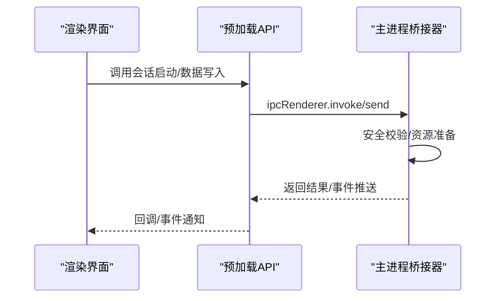

**图表来源**
- [api.cjs:1-928](file://electron/preload/api.cjs#L1-L928)
- [registerBridges.cjs:1-678](file://electron/main/registerBridges.cjs#L1-L678)

## 详细组件分析

### 自动更新桥接（Auto Update）
- 功能概述
  - 支持检查更新、下载更新、安装更新、查询状态、启用/禁用自动下载。
  - 平台支持检测（macOS、Windows、Linux AppImage），非支持平台返回降级提示。
  - 全局状态广播，新窗口可即时获取最新状态快照。
- 关键接口
  - 检查更新：`checkForUpdate`
  - 下载更新：`downloadUpdate`
  - 获取状态：`getUpdateStatus`
  - 安装更新：`installUpdate`
  - 设置/获取自动更新开关：`setAutoUpdate`、`getAutoUpdate`
- 错误处理
  - 区分“检查阶段”与“下载阶段”错误；避免并发检查导致的状态污染。
- 性能与兼容性
  - 使用定时器延迟首次检查，避免启动抖动。
  - Linux仅AppImage支持原地更新，其他格式返回不支持信息。

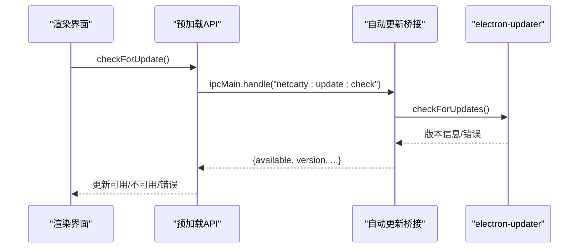

**图表来源**
- [autoUpdateBridge.cjs:255-412](file://electron/bridges/autoUpdateBridge.cjs#L255-L412)

**章节来源**
- [autoUpdateBridge.cjs:1-415](file://electron/bridges/autoUpdateBridge.cjs#L1-L415)
- [api.cjs:718-744](file://electron/preload/api.cjs#L718-L744)

### 凭据管理桥接（Credential Protection）
- 功能概述
  - 基于Electron safeStorage对敏感字段进行加密存储，支持可用性检测、加密、解密。
  - 采用前缀标记避免重复加密，支持迁移场景。
- 关键接口
  - 可用性检测：`credentialsAvailable`
  - 加密：`credentialsEncrypt`
  - 解密：`credentialsDecrypt`
- 安全考虑
  - 在无安全存储的平台（如Linux缺少libsecret）下透明回退为明文，保证功能可用但安全性降低。

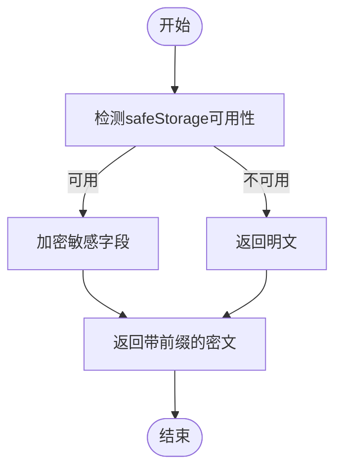

**图表来源**
- [credentialBridge.cjs:25-86](file://electron/bridges/credentialBridge.cjs#L25-L86)

**章节来源**
- [credentialBridge.cjs:1-86](file://electron/bridges/credentialBridge.cjs#L1-L86)
- [api.cjs:713-717](file://electron/preload/api.cjs#L713-L717)

### 文件监控桥接（File Watcher）
- 功能概述
  - 监控本地临时文件变更，自动同步回远程SFTP目标。
  - 支持防抖、系统通知、临时文件注册与清理。
- 关键接口
  - 开始监控：`startFileWatch`
  - 停止监控：`stopFileWatch`
  - 列出监控：`listFileWatches`
  - 注册临时文件：`registerTempFile`
  - 事件监听：`onFileWatchSynced`、`onFileWatchError`
- 实现要点
  - 使用fs.watchFile轮询以提升Windows兼容性。
  - 对原子写入（保存到临时文件再重命名）场景进行容错。
  - 支持SFTP会话关闭时批量清理临时文件。

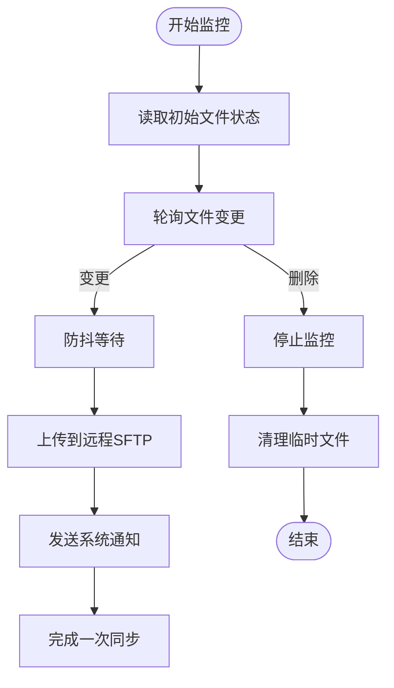

**图表来源**
- [fileWatcherBridge.cjs:84-247](file://electron/bridges/fileWatcherBridge.cjs#L84-L247)

**章节来源**
- [fileWatcherBridge.cjs:1-385](file://electron/bridges/fileWatcherBridge.cjs#L1-L385)
- [api.cjs:574-590](file://electron/preload/api.cjs#L574-L590)

### 主机密钥验证桥接（Host Key Verification）
- 功能概述
  - 对SSH主机密钥进行分类（未知/信任/已变更），支持用户交互确认或加入已知主机。
- 关键接口
  - 请求验证：`onHostKeyVerification`、`respondHostKeyVerification`
  - 分类逻辑：基于指纹与算法类型匹配。
- 安全考虑
  - 严格区分“相同算法但指纹不同”与“不同算法”两种情形，避免误报。
  - 超时保护与请求生命周期管理。

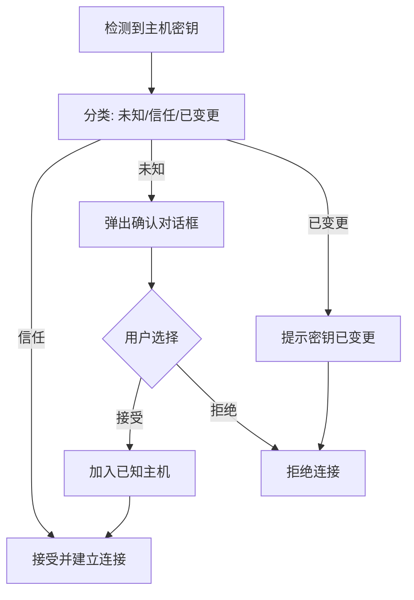

**图表来源**
- [hostKeyVerifier.cjs:95-132](file://electron/bridges/hostKeyVerifier.cjs#L95-L132)

**章节来源**
- [hostKeyVerifier.cjs:1-267](file://electron/bridges/hostKeyVerifier.cjs#L1-L267)
- [api.cjs:153-163](file://electron/preload/api.cjs#L153-L163)

### 端口转发桥接（Port Forwarding）
- 功能概述
  - 支持本地转发、远程转发、动态SOCKS5代理，支持跳板机链路、代理、证书认证、键盘交互认证。
- 关键接口
  - 启动：`startPortForward`
  - 停止：`stopPortForward`
  - 查询状态：`getPortForwardStatus`
  - 列表：`listPortForwards`
  - 批量停止：按规则ID停止、全部停止
- 实现要点
  - 通过ssh2建立隧道，支持keepalive策略与链路清理。
  - 事件驱动的状态广播，支持UI实时反馈。

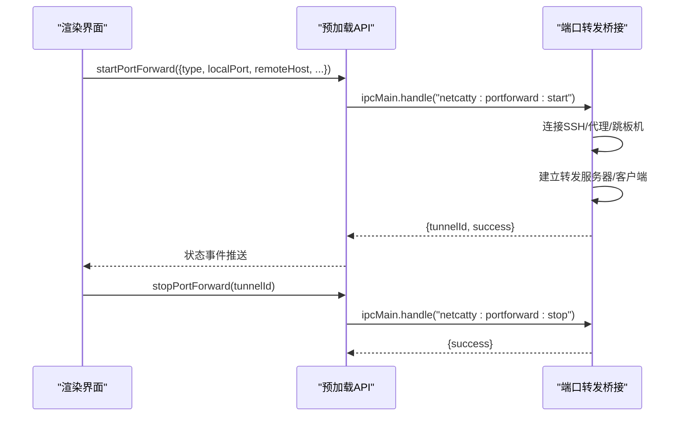

**图表来源**
- [portForwardingBridge.cjs:64-551](file://electron/bridges/portForwardingBridge.cjs#L64-L551)

**章节来源**
- [portForwardingBridge.cjs:1-662](file://electron/bridges/portForwardingBridge.cjs#L1-L662)
- [api.cjs:450-495](file://electron/preload/api.cjs#L450-L495)

### 会话日志桥接（Session Logs）
- 功能概述
  - 支持手动导出（保存对话框）、自动保存（按主机分目录）、打开日志目录。
  - 提供HTML/plain/raw三种输出格式，内置内容净化与安全转义。
- 关键接口
  - 导出：`exportSessionLog`
  - 选择目录：`selectSessionLogsDir`
  - 自动保存：`autoSaveSessionLog`
  - 打开目录：`openSessionLogsDir`

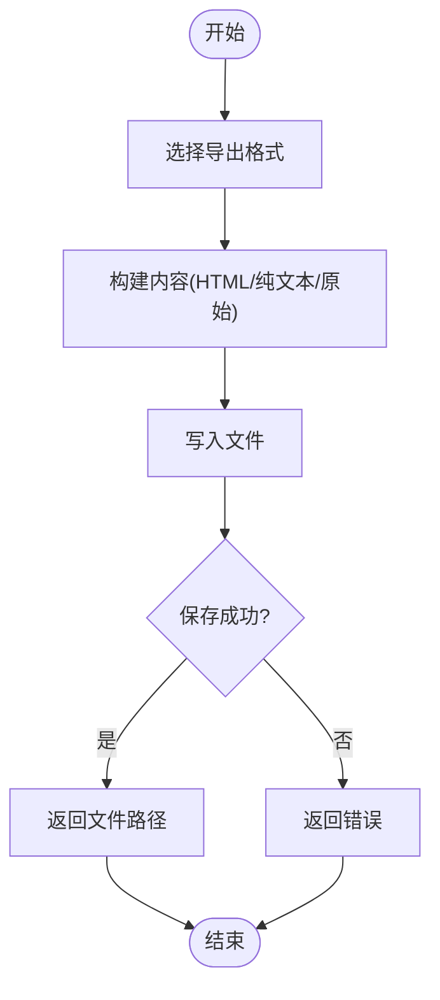

**图表来源**
- [sessionLogsBridge.cjs:125-231](file://electron/bridges/sessionLogsBridge.cjs#L125-L231)

**章节来源**
- [sessionLogsBridge.cjs:1-276](file://electron/bridges/sessionLogsBridge.cjs#L1-L276)
- [api.cjs:606-614](file://electron/preload/api.cjs#L606-L614)

### 保险库备份桥接（Vault Backup）
- 功能概述
  - 对应用保险库进行加密备份，支持指纹去重、保留策略、跨窗口事件通知。
  - 严格输入校验与大小限制，防止磁盘填充攻击。
- 关键接口
  - 能力查询：`getVaultBackupCapabilities`
  - 创建备份：`createVaultBackup`
  - 列表：`listVaultBackups`
  - 读取：`readVaultBackup`
  - 裁剪：`trimVaultBackups`
  - 打开目录：`openVaultBackupDir`
  - 事件：`onVaultBackupsChanged`
- 安全与可靠性
  - 使用safeStorage加密存储，拒绝在无安全存储平台创建备份。
  - 原子写入（临时文件+重命名+目录fsync）保障崩溃后一致性。

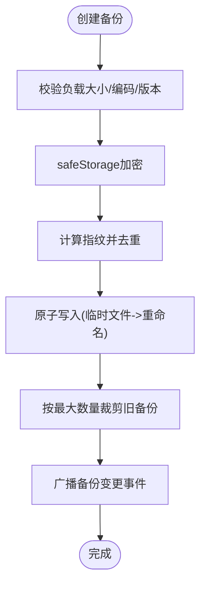

**图表来源**
- [vaultBackupBridge.cjs:385-520](file://electron/bridges/vaultBackupBridge.cjs#L385-L520)

**章节来源**
- [vaultBackupBridge.cjs:1-596](file://electron/bridges/vaultBackupBridge.cjs#L1-L596)
- [api.cjs:407-435](file://electron/preload/api.cjs#L407-L435)

### ZMODEM传输桥接（ZMODEM）
- 功能概述
  - 在主进程内解析ZMODEM协议，支持上传/下载，向渲染进程推送进度事件。
  - 处理回车、控制字符、超时与异常恢复。
- 关键接口
  - 事件监听：`onZmodemEvent`、`onZmodemOverwriteRequest`
  - 取消：`cancelZmodem`
  - 响应覆写：`respondZmodemOverwrite`
- 实现要点
  - Sentry包装数据流，区分普通终端输出与ZMODEM协议帧。
  - 上传/下载分别处理冲突、权限恢复、背压控制。

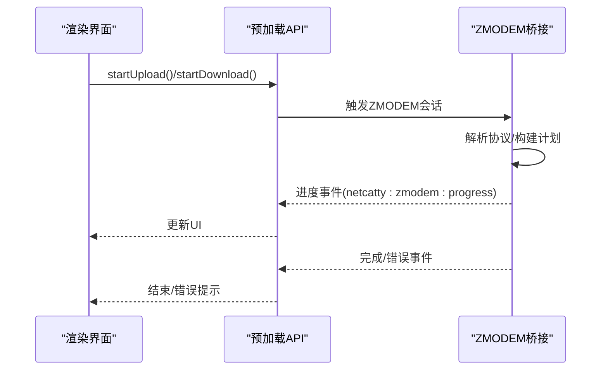

**图表来源**
- [zmodemHelper.cjs:547-800](file://electron/bridges/zmodemHelper.cjs#L547-L800)

**章节来源**
- [zmodemHelper.cjs:1-896](file://electron/bridges/zmodemHelper.cjs#L1-L896)
- [api.cjs:96-111](file://electron/preload/api.cjs#L96-L111)

### 云同步与自动同步（Cloud Sync + Auto Sync）
- 功能概述
  - 自动同步钩子在数据变更时触发，支持去重、节流、跨窗口屏障、空保险库保护等。
  - 启动时检查远端版本，处理空本地/云端冲突，合并后回写本地并可能再次推送。
- 关键流程
  - 构建同步快照 -> 计算哈希 -> 去重/节流 -> 同步 -> 合并应用 -> 成功后开启自动同步门。

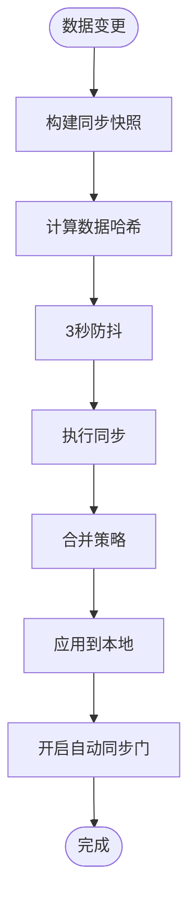

**图表来源**
- [useAutoSync.ts:168-682](file://application/state/useAutoSync.ts#L168-L682)

**章节来源**
- [useAutoSync.ts:1-867](file://application/state/useAutoSync.ts#L1-L867)

## 依赖关系分析
- 预加载API依赖主进程桥接器提供的IPC处理器。
- 主进程桥接器之间存在依赖关系：如压缩上传依赖传输桥接，端口转发依赖SSH认证与代理工具。
- 类型定义层约束预加载API签名，确保前后端一致性。

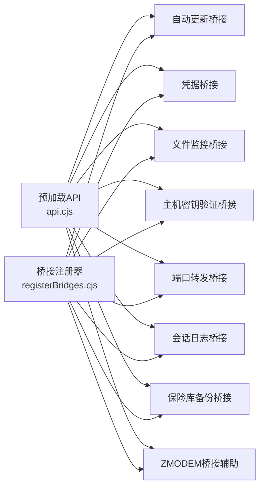

**图表来源**
- [api.cjs:1-928](file://electron/preload/api.cjs#L1-L928)
- [registerBridges.cjs:1-678](file://electron/main/registerBridges.cjs#L1-L678)

**章节来源**
- [registerBridges.cjs:52-177](file://electron/main/registerBridges.cjs#L52-L177)

## 性能考量
- I/O与网络
  - 文件监控使用轮询（fs.watchFile）提升跨平台稳定性，注意CPU占用与磁盘压力。
  - ZMODEM上传采用分块读取与背压控制，避免内存峰值。
  - 自动更新下载阶段广播进度，避免阻塞UI线程。
- 内存与资源
  - 端口转发桥接维护活跃隧道映射，及时清理链路与连接句柄。
  - 保险库备份采用原子写入与目录fsync，确保可靠性但增加磁盘IO。
- 并发与竞态
  - 自动更新桥接避免并发检查与下载，使用定时器与状态快照。
  - 云同步钩子序列化检查远程版本，防止多实例竞争。

[本节为通用指导，无需特定文件引用]

## 故障排除指南
- 自动更新
  - 症状：检查失败或状态卡住。
  - 排查：确认平台支持、避免并发调用、查看全局监听错误事件。
  - 参考：[autoUpdateBridge.cjs:255-412](file://electron/bridges/autoUpdateBridge.cjs#L255-L412)
- 凭据加密
  - 症状：加密/解密失败或返回明文。
  - 排查：检查safeStorage可用性、确认前缀与编码。
  - 参考：[credentialBridge.cjs:25-86](file://electron/bridges/credentialBridge.cjs#L25-L86)
- 文件监控
  - 症状：变更未触发或重复同步。
  - 排查：检查防抖设置、轮询间隔、临时文件清理。
  - 参考：[fileWatcherBridge.cjs:84-247](file://electron/bridges/fileWatcherBridge.cjs#L84-L247)
- 主机密钥验证
  - 症状：频繁提示密钥变更或无法连接。
  - 排查：核对指纹与算法类型、确认已知主机条目。
  - 参考：[hostKeyVerifier.cjs:95-132](file://electron/bridges/hostKeyVerifier.cjs#L95-L132)
- 端口转发
  - 症状：隧道无法建立或连接中断。
  - 排查：检查认证参数、代理/跳板机连通性、keepalive配置。
  - 参考：[portForwardingBridge.cjs:64-551](file://electron/bridges/portForwardingBridge.cjs#L64-L551)
- 会话日志
  - 症状：导出失败或文件名非法。
  - 排查：检查路径合法性、扩展名过滤、编码问题。
  - 参考：[sessionLogsBridge.cjs:125-231](file://electron/bridges/sessionLogsBridge.cjs#L125-L231)
- 保险库备份
  - 症状：无法创建/读取备份或容量超限。
  - 排查：确认安全存储可用、负载大小限制、编码格式。
  - 参考：[vaultBackupBridge.cjs:385-520](file://electron/bridges/vaultBackupBridge.cjs#L385-L520)
- ZMODEM传输
  - 症状：传输卡住或协议错误。
  - 排查：检查背压、超时、协议兼容性、冲突处理。
  - 参考：[zmodemHelper.cjs:547-800](file://electron/bridges/zmodemHelper.cjs#L547-L800)

**章节来源**
- [autoUpdateBridge.cjs:1-415](file://electron/bridges/autoUpdateBridge.cjs#L1-L415)
- [credentialBridge.cjs:1-86](file://electron/bridges/credentialBridge.cjs#L1-L86)
- [fileWatcherBridge.cjs:1-385](file://electron/bridges/fileWatcherBridge.cjs#L1-L385)
- [hostKeyVerifier.cjs:1-267](file://electron/bridges/hostKeyVerifier.cjs#L1-L267)
- [portForwardingBridge.cjs:1-662](file://electron/bridges/portForwardingBridge.cjs#L1-L662)
- [sessionLogsBridge.cjs:1-276](file://electron/bridges/sessionLogsBridge.cjs#L1-L276)
- [vaultBackupBridge.cjs:1-596](file://electron/bridges/vaultBackupBridge.cjs#L1-L596)
- [zmodemHelper.cjs:1-896](file://electron/bridges/zmodemHelper.cjs#L1-L896)

## 结论
本系统通过预加载API与主进程桥接器实现了对系统级功能的统一抽象与安全封装。各桥接器职责清晰、边界明确，配合严格的错误处理与安全校验，既能满足复杂网络与文件操作需求，又兼顾了跨平台兼容性与用户体验。建议在扩展新功能时遵循现有桥接模式，确保类型安全与状态一致性。

[本节为总结性内容，无需特定文件引用]

## 附录
- 调用示例路径（代码片段路径）
  - 自动更新检查：[api.cjs:718-724](file://electron/preload/api.cjs#L718-L724)
  - 凭据加密：[api.cjs:713-717](file://electron/preload/api.cjs#L713-L717)
  - 文件监控：[api.cjs:574-590](file://electron/preload/api.cjs#L574-L590)
  - 主机密钥验证：[api.cjs:153-163](file://electron/preload/api.cjs#L153-L163)
  - 端口转发：[api.cjs:450-495](file://electron/preload/api.cjs#L450-L495)
  - 会话日志：[api.cjs:606-614](file://electron/preload/api.cjs#L606-L614)
  - 保险库备份：[api.cjs:407-435](file://electron/preload/api.cjs#L407-L435)
  - ZMODEM传输：[api.cjs:96-111](file://electron/preload/api.cjs#L96-L111)
- 最佳实践
  - 使用事件监听器时务必在组件卸载时返回的取消函数，避免泄漏。
  - 对大文件/高并发场景启用防抖与背压控制。
  - 在无安全存储平台谨慎处理敏感数据，优先使用加密存储。
  - 对外部命令与系统调用进行输入校验与超时控制。

[本节为补充内容，无需特定文件引用]