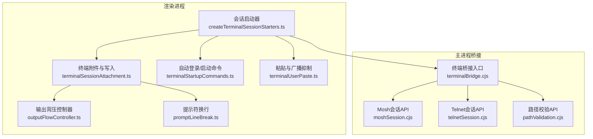
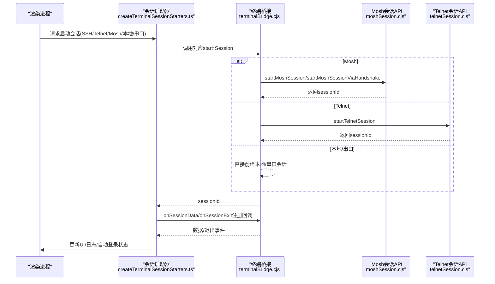
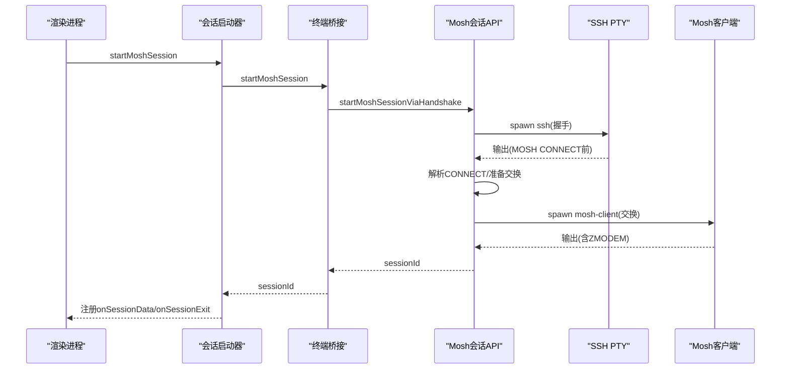
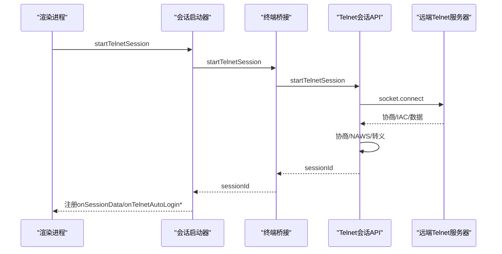
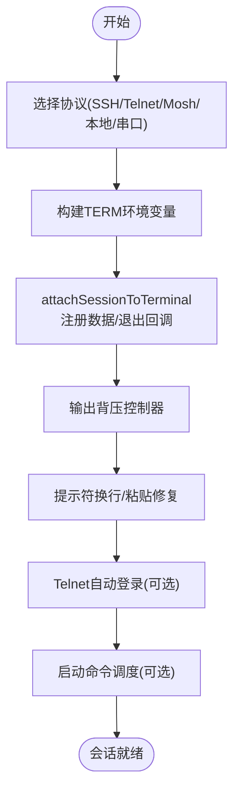
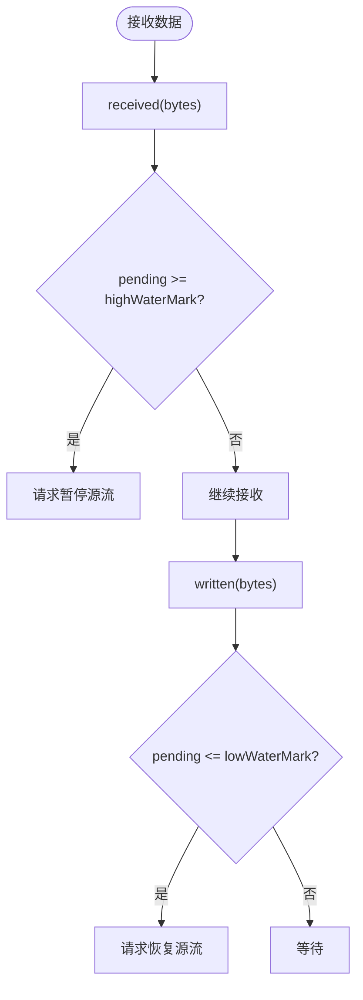
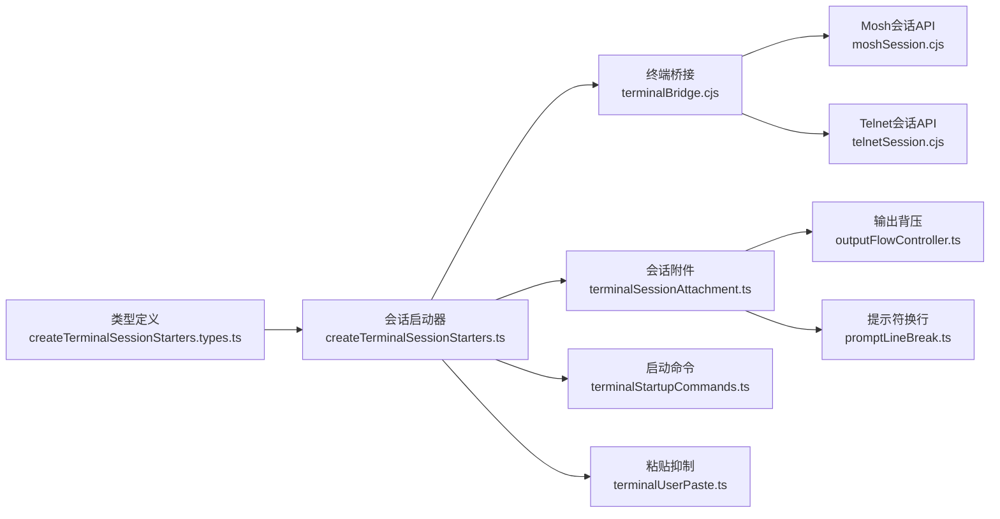

# 终端桥接API

<cite>
**本文档引用的文件**
- [terminalBridge.cjs](file://electron/bridges/terminalBridge.cjs)
- [moshSession.cjs](file://electron/bridges/terminalBridge/moshSession.cjs)
- [telnetSession.cjs](file://electron/bridges/terminalBridge/telnetSession.cjs)
- [pathValidation.cjs](file://electron/bridges/terminalBridge/pathValidation.cjs)
- [createTerminalSessionStarters.ts](file://components/terminal/runtime/createTerminalSessionStarters.ts)
- [createTerminalSessionStarters.types.ts](file://components/terminal/runtime/createTerminalSessionStarters.types.ts)
- [terminalSessionAttachment.ts](file://components/terminal/runtime/terminalSessionAttachment.ts)
- [outputFlowController.ts](file://components/terminal/runtime/outputFlowController.ts)
- [terminalDistroDetection.ts](file://components/terminal/runtime/terminalDistroDetection.ts)
- [terminalStartupCommands.ts](file://components/terminal/runtime/terminalStartupCommands.ts)
- [terminalUserPaste.ts](file://components/terminal/runtime/terminalUserPaste.ts)
- [promptLineBreak.ts](file://components/terminal/runtime/promptLineBreak.ts)
- [serialLineInput.ts](file://components/terminal/runtime/serialLineInput.ts)
</cite>

## 目录
1. [简介](#简介)
2. [项目结构](#项目结构)
3. [核心组件](#核心组件)
4. [架构总览](#架构总览)
5. [详细组件分析](#详细组件分析)
6. [依赖关系分析](#依赖关系分析)
7. [性能考量](#性能考量)
8. [故障排除指南](#故障排除指南)
9. [结论](#结论)
10. [附录](#附录)

## 简介
本文件系统化梳理终端桥接API的设计与实现，覆盖Mosh会话、Telnet会话、本地会话、串口会话的IPC接口与生命周期管理；阐述会话创建、输出流处理、协议转换、字符编码处理、回放与日志、自动登录与ZMODEM传输、性能背压控制、提示符换行策略、命令执行记录等能力。文档同时提供渲染进程侧的使用指引、调试方法与安全配置建议，帮助开发者快速集成与稳定运行。

## 项目结构
终端桥接位于Electron主进程的桥接层，负责与渲染进程通过IPC通信，管理各类会话（SSH/Telnet/Mosh/本地/串口），并把输出数据回传到渲染进程以驱动xterm显示。渲染进程侧通过会话启动器封装统一入口，完成环境变量构建、输出流背压、提示符换行、自动登录、ZMODEM传输、日志回放等高级特性。

**图表来源**
- [terminalBridge.cjs:1-967](file://electron/bridges/terminalBridge.cjs#L1-L967)
- [createTerminalSessionStarters.ts:1-873](file://components/terminal/runtime/createTerminalSessionStarters.ts#L1-L873)
- [terminalSessionAttachment.ts:1-249](file://components/terminal/runtime/terminalSessionAttachment.ts#L1-L249)
- [outputFlowController.ts:1-74](file://components/terminal/runtime/outputFlowController.ts#L1-L74)
- [promptLineBreak.ts:1-243](file://components/terminal/runtime/promptLineBreak.ts#L1-L243)
- [terminalStartupCommands.ts:1-100](file://components/terminal/runtime/terminalStartupCommands.ts#L1-L100)
- [terminalUserPaste.ts:1-487](file://components/terminal/runtime/terminalUserPaste.ts#L1-L487)

**章节来源**
- [terminalBridge.cjs:1-967](file://electron/bridges/terminalBridge.cjs#L1-L967)
- [createTerminalSessionStarters.ts:1-873](file://components/terminal/runtime/createTerminalSessionStarters.ts#L1-L873)

## 核心组件
- 主进程桥接入口：统一暴露会话创建、写入、暂停/恢复、调整窗口大小、关闭等IPC接口，维护会话表，处理输出缓冲与ZMODEM。
- Mosh会话API：封装Mosh握手、SSH引导、裸客户端切换、环境注入、密钥临时文件管理、TERMINFO/PATH补全、语言环境解析。
- Telnet会话API：原生Socket连接、Telnet协商与NAWS、IAC转义、自动登录、编码解码器可替换、ZMODEM。
- 路径校验API：跨平台可执行文件/目录存在性检测、可执行位判断、PATH扩展查找、Windows扩展名补齐。
- 渲染进程会话启动器：统一入口，按协议选择后端，构建环境变量，挂载输出回调，处理链式代理/跳板主机，调度自动登录与启动命令。
- 会话附件与写入：输出背压、提示符换行、粘贴显示修复、滚动策略、序列化捕获、退出事件处理。
- 输出背压控制器：基于水位线的暂停/恢复机制，避免渲染端无界堆积。
- 提示符换行与命令执行：检测提示符、插入换行、同步状态、记录命令执行。
- 自动登录与启动命令：Telnet自动登录监听、命令分拆与延时发送、取消与清理。
- 串口输入模式：行模式缓冲、本地回显、提交/清除/中断处理。

**章节来源**
- [terminalBridge.cjs:1-967](file://electron/bridges/terminalBridge.cjs#L1-L967)
- [moshSession.cjs:1-651](file://electron/bridges/terminalBridge/moshSession.cjs#L1-L651)
- [telnetSession.cjs:1-260](file://electron/bridges/terminalBridge/telnetSession.cjs#L1-L260)
- [pathValidation.cjs:1-88](file://electron/bridges/terminalBridge/pathValidation.cjs#L1-L88)
- [createTerminalSessionStarters.ts:1-873](file://components/terminal/runtime/createTerminalSessionStarters.ts#L1-L873)
- [terminalSessionAttachment.ts:1-249](file://components/terminal/runtime/terminalSessionAttachment.ts#L1-L249)
- [outputFlowController.ts:1-74](file://components/terminal/runtime/outputFlowController.ts#L1-L74)
- [promptLineBreak.ts:1-243](file://components/terminal/runtime/promptLineBreak.ts#L1-L243)
- [terminalStartupCommands.ts:1-100](file://components/terminal/runtime/terminalStartupCommands.ts#L1-L100)
- [terminalUserPaste.ts:1-487](file://components/terminal/runtime/terminalUserPaste.ts#L1-L487)
- [serialLineInput.ts:1-87](file://components/terminal/runtime/serialLineInput.ts#L1-L87)

## 架构总览
主进程桥接负责底层协议与系统资源（PTY/Socket/串口）交互，渲染进程侧通过统一的会话启动器抽象，屏蔽协议差异，提供一致的会话生命周期与输出体验。

**图表来源**
- [createTerminalSessionStarters.ts:1-873](file://components/terminal/runtime/createTerminalSessionStarters.ts#L1-L873)
- [terminalBridge.cjs:1-967](file://electron/bridges/terminalBridge.cjs#L1-L967)
- [moshSession.cjs:1-651](file://electron/bridges/terminalBridge/moshSession.cjs#L1-L651)
- [telnetSession.cjs:1-260](file://electron/bridges/terminalBridge/telnetSession.cjs#L1-L260)

## 详细组件分析

### Mosh会话管理
- 握手与SSH引导：通过内置SSH执行握手，解析MOSH CONNECT消息，提取端口与密钥，随后原子切换到裸Mosh客户端。
- 运行时环境：注入TERM、LANG、TERMINFO/TERMINFO_DIRS、PATH DLL目录，支持Windows DLL与POSIX terminfo优先级。
- 认证与临时文件：私钥/证书写入临时文件并限制权限，支持密码/口令自动应答。
- 输出与ZMODEM：使用输出缓冲器转发数据，POSIX下启用ZMODEM探测器，Windows下直接透传。
- 日志与清理：会话日志流令牌贯穿交换过程，异常时清理临时文件并上报错误。

**图表来源**
- [moshSession.cjs:344-503](file://electron/bridges/terminalBridge/moshSession.cjs#L344-L503)
- [moshSession.cjs:511-588](file://electron/bridges/terminalBridge/moshSession.cjs#L511-L588)
- [terminalBridge.cjs:490-513](file://electron/bridges/terminalBridge.cjs#L490-L513)

**章节来源**
- [moshSession.cjs:1-651](file://electron/bridges/terminalBridge/moshSession.cjs#L1-L651)
- [terminalBridge.cjs:490-513](file://electron/bridges/terminalBridge.cjs#L490-L513)

### Telnet会话管理
- 原生Socket连接：启用TCP_NODELAY，超时控制，协议激活惰性开启（仅当收到IAC时启用协商）。
- Telnet协商与NAWS：支持窗口大小子协商，仅在协议激活后发送。
- 自动登录：监听远端提示，自动填充用户名/密码，支持用户干预取消。
- 编码与ZMODEM：可替换解码器，IAC转义保证二进制数据正确传输。
- 日志与清理：会话日志流令牌贯穿生命周期，错误/关闭时清理并上报。

**图表来源**
- [telnetSession.cjs:4-253](file://electron/bridges/terminalBridge/telnetSession.cjs#L4-L253)
- [terminalBridge.cjs:474-483](file://electron/bridges/terminalBridge.cjs#L474-L483)

**章节来源**
- [telnetSession.cjs:1-260](file://electron/bridges/terminalBridge/telnetSession.cjs#L1-L260)
- [terminalBridge.cjs:474-483](file://electron/bridges/terminalBridge.cjs#L474-L483)

### 本地/串口会话
- 本地会话：通过node-pty创建本地Shell，支持环境变量注入、工作目录、编码、日志流、ZMODEM（非Windows）。
- 串口会话：通过serialport打开硬件/设备节点，支持波特率、数据位、停止位、奇偶校验、流控，编码解码器可替换，ZMODEM。

**章节来源**
- [terminalBridge.cjs:320-469](file://electron/bridges/terminalBridge.cjs#L320-L469)
- [terminalBridge.cjs:540-659](file://electron/bridges/terminalBridge.cjs#L540-L659)

### 路径验证与可执行发现
- 跨平台路径解析：展开~、绝对化、Windows扩展名补齐。
- 可执行检测：POSIX额外搜索路径、Windows where.exe与常见安装位置。
- 可执行位：POSIX检查执行位，Windows视为可执行。

**章节来源**
- [pathValidation.cjs:1-88](file://electron/bridges/terminalBridge/pathValidation.cjs#L1-L88)
- [terminalBridge.cjs:127-256](file://electron/bridges/terminalBridge.cjs#L127-L256)

### 渲染进程会话启动器与附件
- 启动器职责：根据协议调用后端，构建TERM环境，处理代理/跳板主机，调度自动登录与启动命令，挂载数据/退出回调。
- 附件与写入：输出背压、提示符换行、粘贴修复、滚动策略、序列化捕获、退出清理。
- 自动登录：Telnet自动登录完成/取消回调，延迟调度启动命令。
- 启动命令：多行拆分、延时发送、记录执行历史。

**图表来源**
- [createTerminalSessionStarters.ts:32-733](file://components/terminal/runtime/createTerminalSessionStarters.ts#L32-L733)
- [terminalSessionAttachment.ts:180-249](file://components/terminal/runtime/terminalSessionAttachment.ts#L180-L249)
- [terminalStartupCommands.ts:28-98](file://components/terminal/runtime/terminalStartupCommands.ts#L28-L98)

**章节来源**
- [createTerminalSessionStarters.ts:1-873](file://components/terminal/runtime/createTerminalSessionStarters.ts#L1-L873)
- [terminalSessionAttachment.ts:1-249](file://components/terminal/runtime/terminalSessionAttachment.ts#L1-L249)
- [terminalStartupCommands.ts:1-100](file://components/terminal/runtime/terminalStartupCommands.ts#L1-L100)

### 输出流处理与背压控制
- 水位线控制：高水位暂停源，低水位恢复，避免渲染端无界堆积。
- 写入队列：终端写入串行化，防止并发写入导致的乱序。
- 会话级控制：通过setSessionFlowPaused暂停/恢复源流。

**图表来源**
- [outputFlowController.ts:37-73](file://components/terminal/runtime/outputFlowController.ts#L37-L73)
- [terminalSessionAttachment.ts:95-118](file://components/terminal/runtime/terminalSessionAttachment.ts#L95-L118)

**章节来源**
- [outputFlowController.ts:1-74](file://components/terminal/runtime/outputFlowController.ts#L1-L74)
- [terminalSessionAttachment.ts:88-118](file://components/terminal/runtime/terminalSessionAttachment.ts#L88-L118)

### 提示符换行与命令执行记录
- 提示符检测：从终端缓冲中识别当前提示符，缓存用于后续换行插入。
- 换行插入：在命令即将覆盖提示符前插入换行，避免覆盖。
- 命令记录：仅记录“在提示符上输入”的命令，触发后清理状态。

**章节来源**
- [promptLineBreak.ts:108-243](file://components/terminal/runtime/promptLineBreak.ts#L108-L243)
- [terminalCommandExecution.ts:14-58](file://components/terminal/runtime/terminalCommandExecution.ts#L14-L58)

### 粘贴与广播抑制
- 长文本粘贴修复：检测粘贴活跃区域与回显片段，清理残留高亮。
- 广播抑制：抑制粘贴输入与终端协议回复的重复广播，避免二次输入。
- 用户输入广播：在允许且有处理器时广播用户输入。

**章节来源**
- [terminalUserPaste.ts:15-487](file://components/terminal/runtime/terminalUserPaste.ts#L15-L487)

### 串口行模式输入
- 行缓冲：回车/换行标准化，按回车分割与提交。
- 本地回显：删除键退格、清屏、中断符处理。
- 提交/清除：支持Ctrl+U/Ctrl+C等快捷键。

**章节来源**
- [serialLineInput.ts:1-87](file://components/terminal/runtime/serialLineInput.ts#L1-L87)

## 依赖关系分析
- 组件内聚与耦合：主进程桥接集中管理会话生命周期与输出，渲染进程启动器负责高层编排；二者通过类型定义契约解耦。
- 外部依赖：node-pty、serialport、iconv-lite、zmodemHelper、moshHandshake等。
- 事件与回调：onSessionData/onSessionExit/onTelnetAutoLogin*等回调贯穿会话生命周期。

**图表来源**
- [createTerminalSessionStarters.types.ts:1-134](file://components/terminal/runtime/createTerminalSessionStarters.types.ts#L1-L134)
- [createTerminalSessionStarters.ts:1-873](file://components/terminal/runtime/createTerminalSessionStarters.ts#L1-L873)
- [terminalBridge.cjs:1-967](file://electron/bridges/terminalBridge.cjs#L1-L967)
- [terminalSessionAttachment.ts:1-249](file://components/terminal/runtime/terminalSessionAttachment.ts#L1-L249)
- [outputFlowController.ts:1-74](file://components/terminal/runtime/outputFlowController.ts#L1-L74)
- [promptLineBreak.ts:1-243](file://components/terminal/runtime/promptLineBreak.ts#L1-L243)
- [terminalStartupCommands.ts:1-100](file://components/terminal/runtime/terminalStartupCommands.ts#L1-L100)
- [terminalUserPaste.ts:1-487](file://components/terminal/runtime/terminalUserPaste.ts#L1-L487)

**章节来源**
- [createTerminalSessionStarters.types.ts:1-134](file://components/terminal/runtime/createTerminalSessionStarters.types.ts#L1-L134)
- [createTerminalSessionStarters.ts:1-873](file://components/terminal/runtime/createTerminalSessionStarters.ts#L1-L873)
- [terminalBridge.cjs:1-967](file://electron/bridges/terminalBridge.cjs#L1-L967)

## 性能考量
- 输出背压：通过高/低水位与暂停/恢复机制，避免渲染端内存膨胀与UI卡顿。
- 写入串行化：终端写入队列确保顺序与稳定性。
- 会话复用与令牌：连接令牌避免重连时旧定时器误触发，提升稳定性。
- 编码与转义：Telnet IAC转义与可替换解码器减少协议层开销。
- 日志流：会话日志流令牌避免重启场景下的交叉影响。

[本节为通用性能指导，无需特定文件引用]

## 故障排除指南
- Mosh握手失败：检查OpenSSH可用性、PATH解析、TERM/LANG设置、TERMINFO/PATH DLL注入是否成功。
- Telnet连接超时/协议未激活：确认目标端口与服务，惰性协议激活仅在收到IAC后生效。
- 字符编码异常：使用normalizeTerminalEncoding统一编码，Windows下注意GBK/GB18030映射。
- ZMODEM传输冲突：写入时阻塞用户输入，Ctrl+C可取消；确保会话类型正确启用ZMODEM。
- 会话退出码/信号：区分外部杀死与正常退出，UI据此更新状态。
- 串口无法打开：检查端口是否存在、权限与参数配置。

**章节来源**
- [moshSession.cjs:604-633](file://electron/bridges/terminalBridge/moshSession.cjs#L604-L633)
- [telnetSession.cjs:96-102](file://electron/bridges/terminalBridge/telnetSession.cjs#L96-L102)
- [terminalBridge.cjs:42-49](file://electron/bridges/terminalBridge.cjs#L42-L49)
- [terminalBridge.cjs:664-707](file://electron/bridges/terminalBridge.cjs#L664-L707)

## 结论
终端桥接API通过主进程桥接与渲染进程启动器的协作，实现了对多种协议的一致抽象与高效运行。其关键优势包括：协议无关的会话生命周期管理、完善的输出背压与提示符换行策略、灵活的自动登录与启动命令调度、可靠的ZMODEM传输与日志回放、以及跨平台的路径与可执行发现。配合安全的临时文件权限控制与编码处理，整体方案在易用性、稳定性与性能之间取得良好平衡。

[本节为总结性内容，无需特定文件引用]

## 附录

### 渲染进程使用指引（示例路径）
- 创建SSH会话：参考 [createTerminalSessionStarters.ts:39-486](file://components/terminal/runtime/createTerminalSessionStarters.ts#L39-L486)
- 创建Telnet会话：参考 [createTerminalSessionStarters.ts:488-604](file://components/terminal/runtime/createTerminalSessionStarters.ts#L488-L604)
- 创建Mosh会话：参考 [createTerminalSessionStarters.ts:606-733](file://components/terminal/runtime/createTerminalSessionStarters.ts#L606-L733)
- 处理终端输出：参考 [terminalSessionAttachment.ts:132-178](file://components/terminal/runtime/terminalSessionAttachment.ts#L132-L178)
- 实现会话恢复/重启：参考 [terminalBridge.cjs:775-800](file://electron/bridges/terminalBridge.cjs#L775-L800)

### 安全配置要点
- Mosh临时密钥：写入临时目录并限制权限，Windows通过icacls加固ACL。
- 会话日志：启用会话日志流令牌，避免重启场景交叉影响。
- 编码与语言：统一LANG/TERM设置，避免远程locale警告与显示异常。

**章节来源**
- [moshSession.cjs:201-273](file://electron/bridges/terminalBridge/moshSession.cjs#L201-L273)
- [terminalBridge.cjs:404-413](file://electron/bridges/terminalBridge.cjs#L404-L413)
- [moshSession.cjs:349-369](file://electron/bridges/terminalBridge/moshSession.cjs#L349-L369)