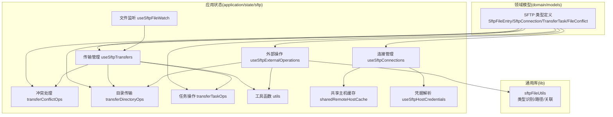
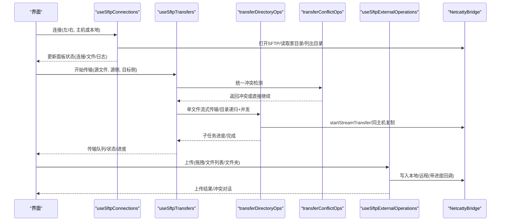
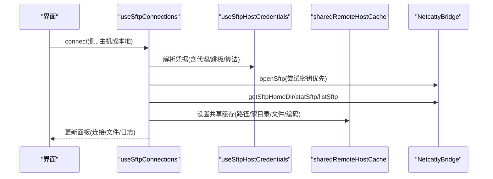
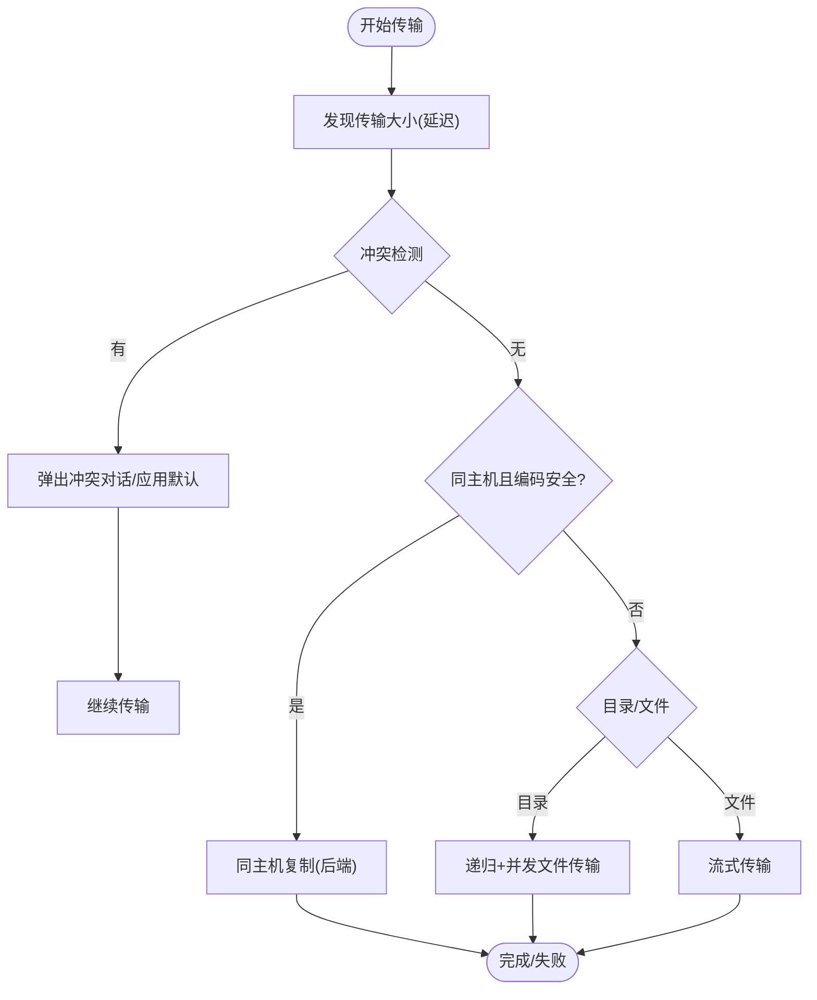
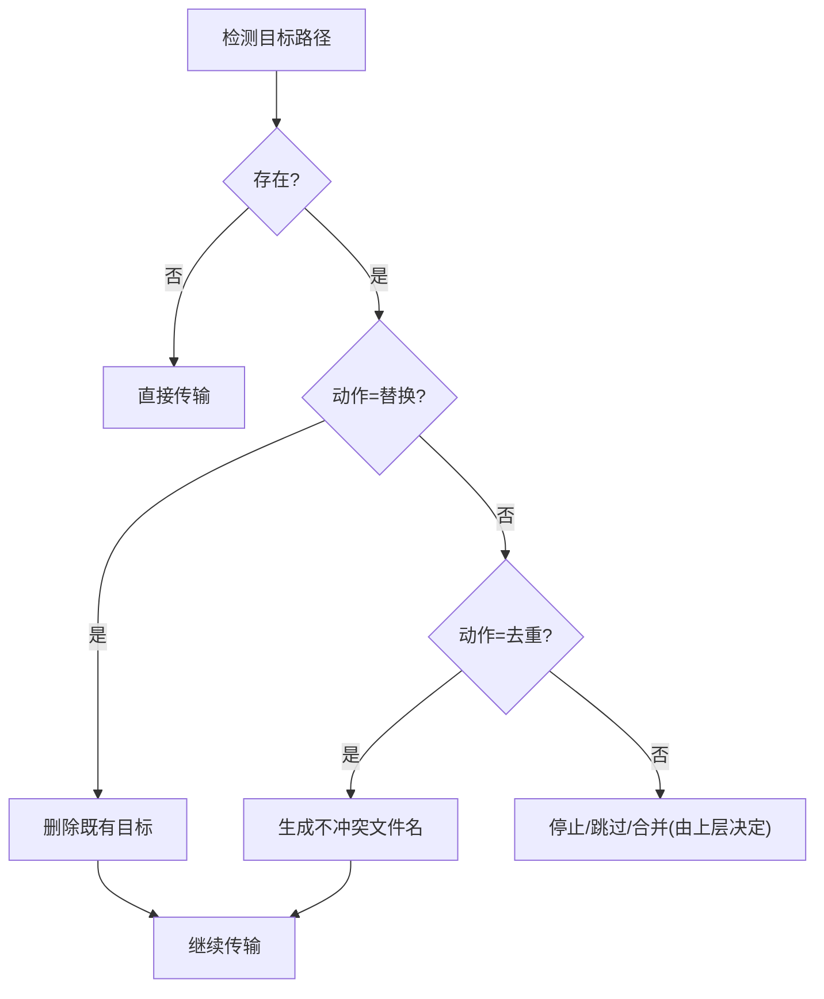
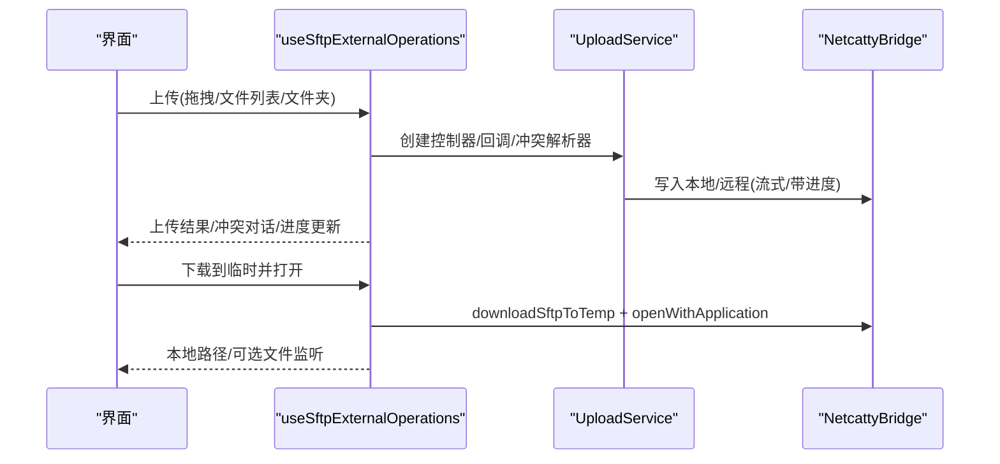
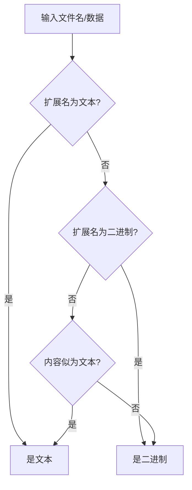
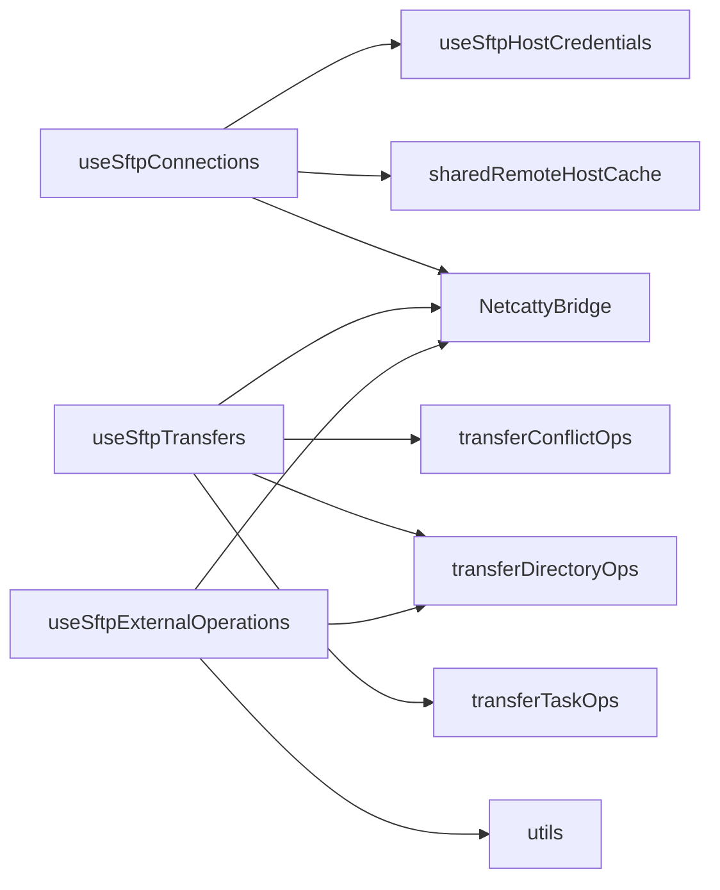
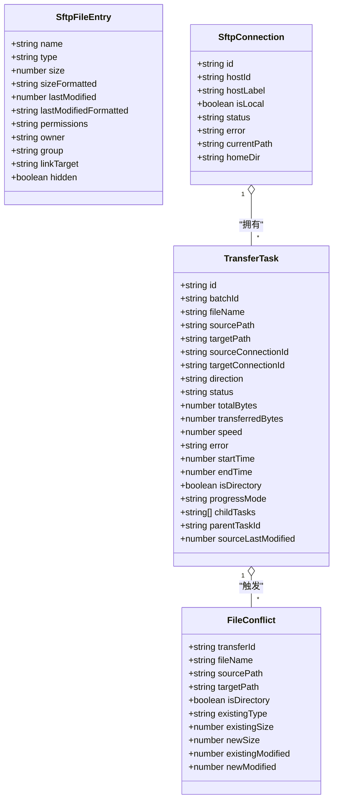

# SFTP模型

<cite>
**本文引用的文件**
- [domain/models/sftp.ts](file://domain/models/sftp.ts)
- [application/state/sftp/types.ts](file://application/state/sftp/types.ts)
- [application/state/sftp/useSftpTransfers.types.ts](file://application/state/sftp/useSftpTransfers.types.ts)
- [application/state/sftp/useSftpExternalOperations.types.ts](file://application/state/sftp/useSftpExternalOperations.types.ts)
- [lib/sftpFileUtils.ts](file://lib/sftpFileUtils.ts)
- [application/state/sftp/useSftpConnections.ts](file://application/state/sftp/useSftpConnections.ts)
- [application/state/sftp/useSftpTransfers.ts](file://application/state/sftp/useSftpTransfers.ts)
- [application/state/sftp/useSftpExternalOperations.ts](file://application/state/sftp/useSftpExternalOperations.ts)
- [application/state/sftp/utils.ts](file://application/state/sftp/utils.ts)
- [application/state/sftp/transferConflictOps.ts](file://application/state/sftp/transferConflictOps.ts)
- [application/state/sftp/transferDirectoryOps.ts](file://application/state/sftp/transferDirectoryOps.ts)
- [application/state/sftp/transferTaskOps.ts](file://application/state/sftp/transferTaskOps.ts)
- [application/state/sftp/sharedRemoteHostCache.ts](file://application/state/sftp/sharedRemoteHostCache.ts)
- [application/state/sftp/useSftpHostCredentials.ts](file://application/state/sftp/useSftpHostCredentials.ts)
- [application/state/sftp/useSftpFileWatch.ts](file://application/state/sftp/useSftpFileWatch.ts)
</cite>

## 目录
1. [简介](#简介)
2. [项目结构](#项目结构)
3. [核心组件](#核心组件)
4. [架构总览](#架构总览)
5. [详细组件分析](#详细组件分析)
6. [依赖关系分析](#依赖关系分析)
7. [性能考量](#性能考量)
8. [故障排查指南](#故障排查指南)
9. [结论](#结论)
10. [附录](#附录)

## 简介
本文件系统性梳理并文档化Netcatty应用中的SFTP模型与相关API，覆盖以下主题：
- 数据结构：文件条目、连接、传输任务、冲突、编码与路径工具
- 文件操作：读取文本/二进制、写入文本、下载到临时文件并打开、上传（拖拽/文件列表/文件夹）
- 传输流程：状态管理、进度跟踪、错误处理、冲突解决、批量与并发控制
- 会话与缓存：连接建立与断开、共享远程主机缓存、目录缓存、编码策略
- 预览与关联：文件类型识别、语言映射、语法高亮、文件关联与打开
- 并发与性能：目录传输并发、同主机复制优化、取消与清理

## 项目结构
SFTP相关代码主要分布在domain/models、application/state/sftp以及lib层：
- domain/models：定义SFTP核心数据类型（文件条目、连接、传输任务、冲突）
- application/state/sftp：状态钩子与业务逻辑（连接、传输、外部操作、冲突、目录传输、工具函数）
- lib：通用工具（文件类型识别、路径拼接、扩展名解析等）

图示来源
- [domain/models/sftp.ts:1-79](file://domain/models/sftp.ts#L1-L79)
- [application/state/sftp/useSftpConnections.ts:1-584](file://application/state/sftp/useSftpConnections.ts#L1-L584)
- [application/state/sftp/useSftpTransfers.ts:1-990](file://application/state/sftp/useSftpTransfers.ts#L1-L990)
- [application/state/sftp/useSftpExternalOperations.ts:1-928](file://application/state/sftp/useSftpExternalOperations.ts#L1-L928)
- [application/state/sftp/transferConflictOps.ts:1-106](file://application/state/sftp/transferConflictOps.ts#L1-L106)
- [application/state/sftp/transferDirectoryOps.ts:1-456](file://application/state/sftp/transferDirectoryOps.ts#L1-L456)
- [application/state/sftp/transferTaskOps.ts:1-116](file://application/state/sftp/transferTaskOps.ts#L1-L116)
- [application/state/sftp/utils.ts:1-88](file://application/state/sftp/utils.ts#L1-L88)
- [application/state/sftp/sharedRemoteHostCache.ts:1-53](file://application/state/sftp/sharedRemoteHostCache.ts#L1-L53)
- [application/state/sftp/useSftpHostCredentials.ts:1-185](file://application/state/sftp/useSftpHostCredentials.ts#L1-L185)
- [application/state/sftp/useSftpFileWatch.ts:1-28](file://application/state/sftp/useSftpFileWatch.ts#L1-L28)
- [lib/sftpFileUtils.ts:1-661](file://lib/sftpFileUtils.ts#L1-L661)

章节来源
- [domain/models/sftp.ts:1-79](file://domain/models/sftp.ts#L1-L79)
- [application/state/sftp/types.ts:1-74](file://application/state/sftp/types.ts#L1-L74)

## 核心组件
本节对SFTP模型的核心数据结构进行逐项说明。

- 文件条目 SftpFileEntry
  - 字段：名称、类型（文件/目录/符号链接）、大小、格式化大小、最后修改时间、格式化时间、权限、所有者、组、目标类型（仅符号链接）、隐藏标记（本地Windows）
  - 用途：展示与导航、权限显示、符号链接目标判断
  - 复杂度：O(1)访问；用于UI渲染时需注意跨端路径分隔符差异
  - 参考路径：[domain/models/sftp.ts:4-16](file://domain/models/sftp.ts#L4-L16)

- 连接 SftpConnection
  - 字段：连接ID、宿主ID、标签、是否本地、状态（连接中/已连接/断开/错误）、错误信息、当前路径、家目录
  - 用途：面板状态、日志、路径与家目录缓存
  - 参考路径：[domain/models/sftp.ts:18-27](file://domain/models/sftp.ts#L18-L27)

- 传输任务 TransferTask
  - 字段：任务ID、批次ID、文件名、原始文件名、源路径、目标路径、源连接ID、目标连接ID、目标宿主ID、目标连接键、方向（上传/下载/远端到远端/本地复制）、状态、总字节、已传输字节、速度、错误、开始/结束时间、是否目录、进度模式、子任务ID、父任务ID、源最后修改时间、跳过冲突检查、替换目标、可重试
  - 用途：统一描述单文件/目录传输，支持父子级目录传输与批量操作
  - 参考路径：[domain/models/sftp.ts:32-61](file://domain/models/sftp.ts#L32-L61)

- 冲突 FileConflict
  - 字段：传输ID、批次ID、文件名、源路径、目标路径、是否目录、现有类型、影响总数、现有/新大小、现有/新修改时间
  - 用途：在覆盖/去重/合并前收集上下文，供用户决策
  - 参考路径：[domain/models/sftp.ts:65-78](file://domain/models/sftp.ts#L65-L78)

- 面板状态 SftpPane
  - 字段：面板ID、连接、文件列表、加载中、重连中、错误、连接日志、选中集合、过滤器、文件名编码、显示隐藏文件、传输互斥令牌
  - 用途：承载当前视图状态与UI行为
  - 参考路径：[application/state/sftp/types.ts:3-16](file://application/state/sftp/types.ts#L3-L16)

- 文件名编码 SftpFilenameEncoding
  - 值域：自动/UTF-8/GB18030
  - 用途：控制SFTP读写与列表时的字符编码
  - 参考路径：[domain/models/sftp.ts](file://domain/models/sftp.ts#L2)

- 传输方向/状态
  - 方向：上传/下载/远端到远端/本地复制
  - 状态：待定/传输中/已完成/失败/已取消
  - 参考路径：[domain/models/sftp.ts:29-30](file://domain/models/sftp.ts#L29-L30)

章节来源
- [domain/models/sftp.ts:1-79](file://domain/models/sftp.ts#L1-L79)
- [application/state/sftp/types.ts:1-74](file://application/state/sftp/types.ts#L1-L74)

## 架构总览
SFTP模块采用“领域模型 + 应用状态钩子 + 通用工具”的分层设计：
- 领域模型：稳定的数据契约，确保UI与桥接层交互一致
- 应用状态钩子：封装连接、传输、冲突、目录传输、外部操作等复杂流程
- 通用工具：文件类型识别、路径处理、文件关联与打开

图示来源
- [application/state/sftp/useSftpConnections.ts:73-486](file://application/state/sftp/useSftpConnections.ts#L73-L486)
- [application/state/sftp/useSftpTransfers.ts:96-506](file://application/state/sftp/useSftpTransfers.ts#L96-L506)
- [application/state/sftp/transferDirectoryOps.ts:104-451](file://application/state/sftp/transferDirectoryOps.ts#L104-L451)
- [application/state/sftp/transferConflictOps.ts:18-101](file://application/state/sftp/transferConflictOps.ts#L18-L101)
- [application/state/sftp/useSftpExternalOperations.ts:513-800](file://application/state/sftp/useSftpExternalOperations.ts#L513-L800)

## 详细组件分析

### 组件A：连接与会话管理
- 职责
  - 建立/断开SFTP会话，维护连接映射与缓存键
  - 列举本地/远程目录，缓存目录列表与家目录
  - 认证凭据解析与代理/跳板配置
  - 连接日志与错误处理
- 关键点
  - 同步通知tab创建，避免竞态
  - 断开旧会话前先删除映射，防止使用过期ID
  - 共享远程主机缓存（含TTL）以提升重连体验
  - 自动探测家目录与回退路径
- 并发与错误
  - 导航序列号防重入，避免过时请求覆盖最新状态
  - 连接失败时清理重连状态，保留错误信息
- 参考路径
  - [application/state/sftp/useSftpConnections.ts:73-486](file://application/state/sftp/useSftpConnections.ts#L73-L486)
  - [application/state/sftp/sharedRemoteHostCache.ts:1-53](file://application/state/sftp/sharedRemoteHostCache.ts#L1-L53)
  - [application/state/sftp/useSftpHostCredentials.ts:19-185](file://application/state/sftp/useSftpHostCredentials.ts#L19-L185)

图示来源
- [application/state/sftp/useSftpConnections.ts:270-461](file://application/state/sftp/useSftpConnections.ts#L270-L461)
- [application/state/sftp/useSftpHostCredentials.ts:19-185](file://application/state/sftp/useSftpHostCredentials.ts#L19-L185)
- [application/state/sftp/sharedRemoteHostCache.ts:44-52](file://application/state/sftp/sharedRemoteHostCache.ts#L44-L52)

章节来源
- [application/state/sftp/useSftpConnections.ts:1-584](file://application/state/sftp/useSftpConnections.ts#L1-L584)
- [application/state/sftp/sharedRemoteHostCache.ts:1-53](file://application/state/sftp/sharedRemoteHostCache.ts#L1-L53)
- [application/state/sftp/useSftpHostCredentials.ts:1-185](file://application/state/sftp/useSftpHostCredentials.ts#L1-L185)

### 组件B：传输任务与状态管理
- 职责
  - 创建传输任务、批量调度、状态推进
  - 冲突检测与默认动作记忆
  - 子任务注册与进度聚合（目录传输）
  - 取消/重试/清理与后端同步
- 关键点
  - 传输大小延迟发现（单文件异步统计，目录估算）
  - 同主机UTF-8兼容路径优化（同主机复制）
  - 子任务并发（文件级），目录顺序遍历（避免无界并发）
  - 进度节流更新，保证UI流畅
- 错误处理
  - 取消检查贯穿所有阶段，异常转为“已取消”状态
  - 目录部分失败标记为失败，禁止通用重试
- 参考路径
  - [application/state/sftp/useSftpTransfers.ts:96-506](file://application/state/sftp/useSftpTransfers.ts#L96-L506)
  - [application/state/sftp/transferDirectoryOps.ts:188-451](file://application/state/sftp/transferDirectoryOps.ts#L188-L451)
  - [application/state/sftp/transferTaskOps.ts:43-111](file://application/state/sftp/transferTaskOps.ts#L43-L111)

图示来源
- [application/state/sftp/useSftpTransfers.ts:154-401](file://application/state/sftp/useSftpTransfers.ts#L154-L401)
- [application/state/sftp/transferDirectoryOps.ts:240-451](file://application/state/sftp/transferDirectoryOps.ts#L240-L451)

章节来源
- [application/state/sftp/useSftpTransfers.ts:1-990](file://application/state/sftp/useSftpTransfers.ts#L1-L990)
- [application/state/sftp/transferDirectoryOps.ts:1-456](file://application/state/sftp/transferDirectoryOps.ts#L1-L456)
- [application/state/sftp/transferTaskOps.ts:1-116](file://application/state/sftp/transferTaskOps.ts#L1-L116)

### 组件C：冲突检测与解决
- 职责
  - 统一检测目标路径是否存在、类型与元信息
  - 生成“复制”命名的去重目标
  - 删除既有目标（替换前）
- 关键点
  - 本地/远程路径分别调用对应stat接口
  - 去重策略：(copy)/(copy N)，超限回退到时间戳后缀
- 参考路径
  - [application/state/sftp/transferConflictOps.ts:18-101](file://application/state/sftp/transferConflictOps.ts#L18-L101)

图示来源
- [application/state/sftp/transferConflictOps.ts:18-101](file://application/state/sftp/transferConflictOps.ts#L18-L101)

章节来源
- [application/state/sftp/transferConflictOps.ts:1-106](file://application/state/sftp/transferConflictOps.ts#L1-L106)

### 组件D：外部操作（读写/上传/下载）
- 职责
  - 读取文本/二进制文件
  - 写入文本文件（按连接或按面板编码）
  - 下载到临时文件并打开，支持文件监听
  - 上传：拖拽(DataTransfer)/文件列表/文件夹（树枚举）
- 关键点
  - 通过UploadService与UploadController实现流式上传与取消
  - 上传冲突对话框支持“全部应用”
  - 临时下载进度回调映射为外部传输任务
- 参考路径
  - [application/state/sftp/useSftpExternalOperations.ts:53-800](file://application/state/sftp/useSftpExternalOperations.ts#L53-L800)
  - [application/state/sftp/useSftpExternalOperations.types.ts:1-66](file://application/state/sftp/useSftpExternalOperations.types.ts#L1-L66)

图示来源
- [application/state/sftp/useSftpExternalOperations.ts:513-800](file://application/state/sftp/useSftpExternalOperations.ts#L513-L800)

章节来源
- [application/state/sftp/useSftpExternalOperations.ts:1-928](file://application/state/sftp/useSftpExternalOperations.ts#L1-L928)
- [application/state/sftp/useSftpExternalOperations.types.ts:1-66](file://application/state/sftp/useSftpExternalOperations.types.ts#L1-L66)

### 组件E：文件类型识别与预览
- 职责
  - 基于扩展名与内容的文本/二进制/图片识别
  - 语言ID与语法高亮映射
  - 文件关联（内置编辑器/系统应用）
- 关键点
  - isTextData基于首段字节分析，提高准确性
  - 图片MIME类型映射用于Blob URL
  - 支持“可能为文本”用于上下文菜单可用性判断
- 参考路径
  - [lib/sftpFileUtils.ts:8-428](file://lib/sftpFileUtils.ts#L8-L428)

图示来源
- [lib/sftpFileUtils.ts:195-292](file://lib/sftpFileUtils.ts#L195-L292)

章节来源
- [lib/sftpFileUtils.ts:1-661](file://lib/sftpFileUtils.ts#L1-L661)

### 组件F：路径与工具函数
- 职责
  - 路径拼接/父路径/根路径判断（兼容Windows）
  - 文件大小/日期格式化
  - 可迁移传输目标判定
- 参考路径
  - [application/state/sftp/utils.ts:1-88](file://application/state/sftp/utils.ts#L1-L88)

章节来源
- [application/state/sftp/utils.ts:1-88](file://application/state/sftp/utils.ts#L1-L88)

## 依赖关系分析
- 组件耦合
  - useSftpTransfers 依赖 transferConflictOps、transferDirectoryOps、transferTaskOps
  - useSftpExternalOperations 依赖 transferDirectoryOps 与 UploadService
  - useSftpConnections 依赖 useSftpHostCredentials 与 sharedRemoteHostCache
- 外部依赖
  - NetcattyBridge 提供SFTP/本地文件系统能力（读写/统计/删除/列表/下载/打开/取消）
- 循环依赖
  - 未见循环依赖；各模块职责清晰，通过参数注入解耦

图示来源
- [application/state/sftp/useSftpConnections.ts:1-584](file://application/state/sftp/useSftpConnections.ts#L1-L584)
- [application/state/sftp/useSftpTransfers.ts:1-990](file://application/state/sftp/useSftpTransfers.ts#L1-L990)
- [application/state/sftp/useSftpExternalOperations.ts:1-928](file://application/state/sftp/useSftpExternalOperations.ts#L1-L928)
- [application/state/sftp/transferConflictOps.ts:1-106](file://application/state/sftp/transferConflictOps.ts#L1-L106)
- [application/state/sftp/transferDirectoryOps.ts:1-456](file://application/state/sftp/transferDirectoryOps.ts#L1-L456)
- [application/state/sftp/transferTaskOps.ts:1-116](file://application/state/sftp/transferTaskOps.ts#L1-L116)
- [application/state/sftp/sharedRemoteHostCache.ts:1-53](file://application/state/sftp/sharedRemoteHostCache.ts#L1-L53)
- [application/state/sftp/useSftpHostCredentials.ts:1-185](file://application/state/sftp/useSftpHostCredentials.ts#L1-L185)
- [application/state/sftp/utils.ts:1-88](file://application/state/sftp/utils.ts#L1-L88)

章节来源
- [application/state/sftp/useSftpConnections.ts:1-584](file://application/state/sftp/useSftpConnections.ts#L1-L584)
- [application/state/sftp/useSftpTransfers.ts:1-990](file://application/state/sftp/useSftpTransfers.ts#L1-L990)
- [application/state/sftp/useSftpExternalOperations.ts:1-928](file://application/state/sftp/useSftpExternalOperations.ts#L1-L928)

## 性能考量
- 目录传输并发
  - 目录内文件并发数来自本地存储配置，默认4，范围1–16
  - 目录层级顺序处理，避免无界并发导致服务器压力
- 同主机复制
  - UTF-8/自动编码下尝试同主机exec复制，避免网络往返
- 进度更新节流
  - 子任务进度每约100ms一次，避免频繁渲染
- 缓存策略
  - 共享远程主机缓存（TTL 60s）与目录缓存，减少重复列举
- 取消与清理
  - 取消传播至子任务与后端，及时释放资源

章节来源
- [application/state/sftp/transferDirectoryOps.ts:188-191](file://application/state/sftp/transferDirectoryOps.ts#L188-L191)
- [application/state/sftp/transferDirectoryOps.ts:437-442](file://application/state/sftp/transferDirectoryOps.ts#L437-L442)
- [application/state/sftp/sharedRemoteHostCache.ts:11-11](file://application/state/sftp/sharedRemoteHostCache.ts#L11-L11)

## 故障排查指南
- 连接失败
  - 检查凭据解析与代理/跳板配置是否完整
  - 查看连接日志与错误消息，确认认证方式与算法设置
  - 参考路径：[application/state/sftp/useSftpConnections.ts:270-482](file://application/state/sftp/useSftpConnections.ts#L270-L482)
- 传输中断/取消
  - 确认任务是否被标记为“已取消”，检查父任务与子任务链
  - 使用取消后端传输接口同步清理
  - 参考路径：[application/state/sftp/transferTaskOps.ts:43-76](file://application/state/sftp/transferTaskOps.ts#L43-L76)
- 冲突处理
  - 使用默认动作记忆（全部应用）快速批量处理
  - 对于替换，先删除既有目标再传输
  - 参考路径：[application/state/sftp/transferConflictOps.ts:81-101](file://application/state/sftp/transferConflictOps.ts#L81-L101)
- 文件监听
  - 监听onFileWatchSynced/onFileWatchError事件，处理外部编辑同步
  - 参考路径：[application/state/sftp/useSftpFileWatch.ts:1-28](file://application/state/sftp/useSftpFileWatch.ts#L1-L28)

章节来源
- [application/state/sftp/useSftpConnections.ts:270-482](file://application/state/sftp/useSftpConnections.ts#L270-L482)
- [application/state/sftp/transferTaskOps.ts:43-76](file://application/state/sftp/transferTaskOps.ts#L43-L76)
- [application/state/sftp/transferConflictOps.ts:81-101](file://application/state/sftp/transferConflictOps.ts#L81-L101)
- [application/state/sftp/useSftpFileWatch.ts:1-28](file://application/state/sftp/useSftpFileWatch.ts#L1-L28)

## 结论
本SFTP模型通过稳定的领域数据结构与模块化的状态钩子，提供了从连接、传输、冲突、到预览与缓存的全链路能力。其并发控制、取消传播与缓存策略在保证用户体验的同时兼顾了性能与可靠性。建议在集成时重点关注：
- 凭据与代理/跳板配置的完整性
- 编码一致性（特别是同主机复制场景）
- 冲突处理策略与批量默认动作
- 目录传输的并发与取消传播

## 附录

### API方法清单（按模块）
- 连接管理
  - connect(side, host, options?)：建立连接，支持强制新标签
  - disconnect(side)：断开连接并清理缓存
  - 参考路径：[application/state/sftp/useSftpConnections.ts:73-582](file://application/state/sftp/useSftpConnections.ts#L73-L582)

- 传输管理
  - startTransfer(sourceFiles, sourceSide, targetSide, options?)：批量开始传输
  - cancelTransfer(transferId)：取消任务及子任务
  - retryTransfer(transferId)：重试可重试任务
  - clearCompletedTransfers()/dismissTransfer(transferId)：清理/移除
  - resolveConflict(conflictId, action, applyToAll?)：解决冲突
  - 参考路径：[application/state/sftp/useSftpTransfers.types.ts:19-53](file://application/state/sftp/useSftpTransfers.types.ts#L19-L53)

- 外部操作
  - readTextFile(side, filePath)/readBinaryFile(side, filePath)
  - writeTextFile(side, filePath, content)/writeTextFileByConnection(...)
  - downloadToTempAndOpen(side, remotePath, fileName, appPath, options?)
  - uploadExternalFiles(...)/uploadExternalFileList(...)/uploadExternalFolderPath(...)
  - 参考路径：[application/state/sftp/useSftpExternalOperations.types.ts:21-64](file://application/state/sftp/useSftpExternalOperations.types.ts#L21-L64)

### 数据模型类图

图示来源
- [domain/models/sftp.ts:4-78](file://domain/models/sftp.ts#L4-L78)