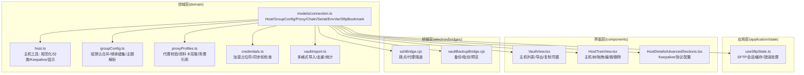
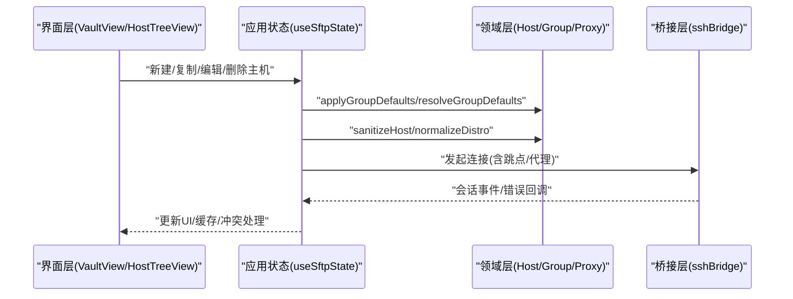
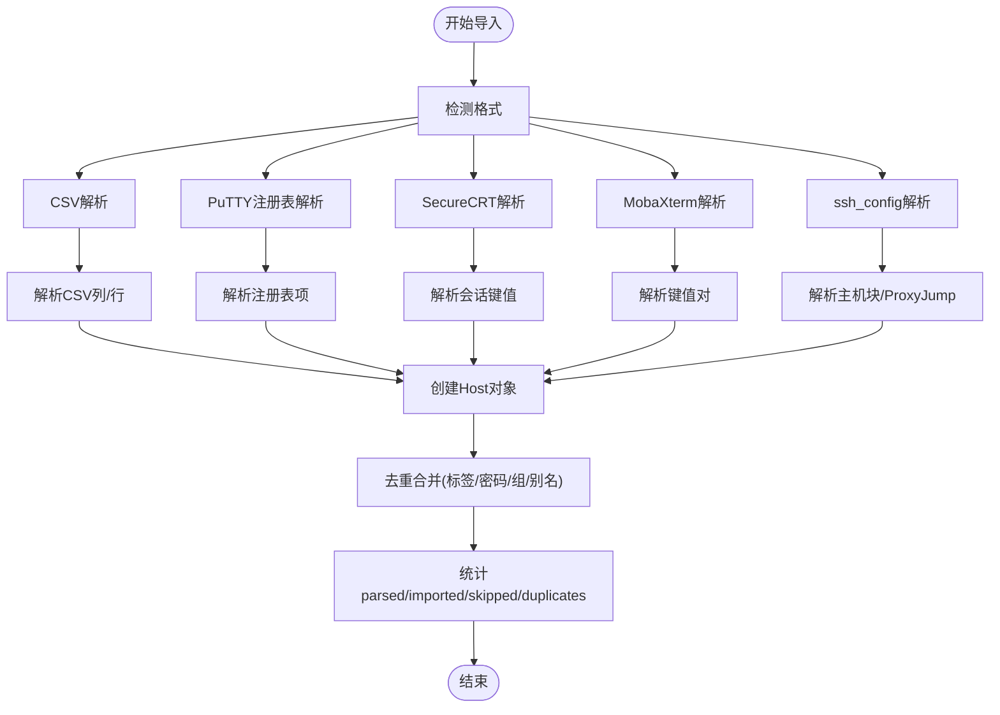
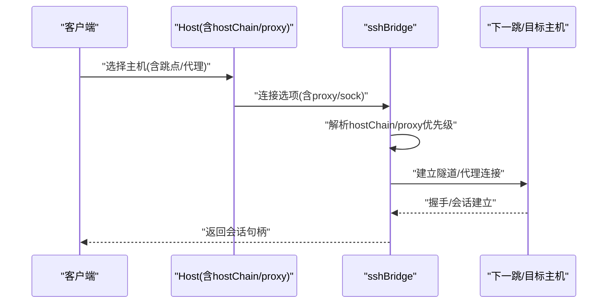
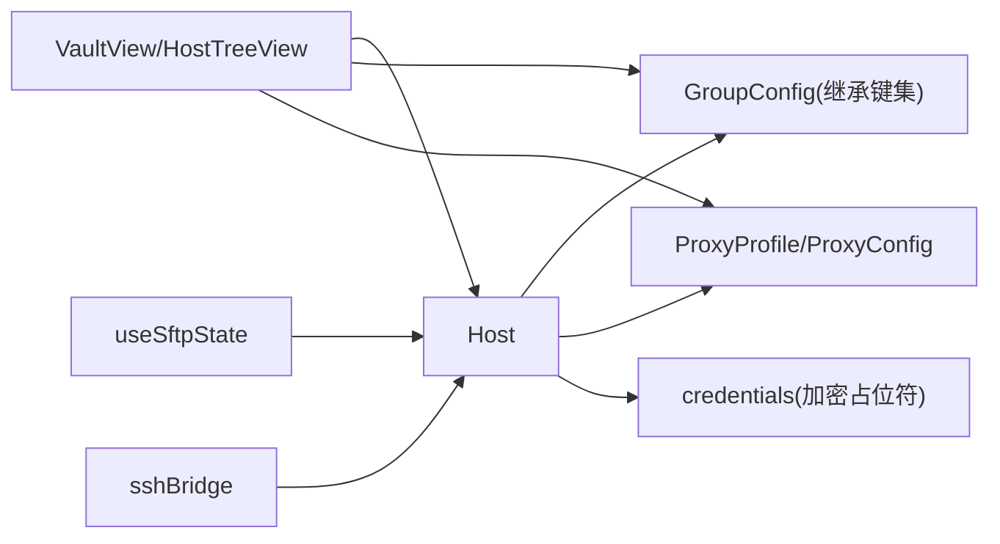

# 主机模型

<cite>
**本文引用的文件**
- [domain/models/connection.ts](file://domain/models/connection.ts)
- [domain/host.ts](file://domain/host.ts)
- [domain/groupConfig.ts](file://domain/groupConfig.ts)
- [domain/proxyProfiles.ts](file://domain/proxyProfiles.ts)
- [domain/credentials.ts](file://domain/credentials.ts)
- [domain/vaultImport.ts](file://domain/vaultImport.ts)
- [components/VaultView.tsx](file://components/VaultView.tsx)
- [components/HostTreeView.tsx](file://components/HostTreeView.tsx)
- [components/HostDetailsAdvancedSections.tsx](file://components/HostDetailsAdvancedSections.tsx)
- [electron/bridges/sshBridge.cjs](file://electron/bridges/sshBridge.cjs)
- [electron/bridges/vaultBackupBridge.cjs](file://electron/bridges/vaultBackupBridge.cjs)
- [application/state/useSftpState.ts](file://application/state/useSftpState.ts)
</cite>

## 目录
1. [简介](#简介)
2. [项目结构](#项目结构)
3. [核心组件](#核心组件)
4. [架构总览](#架构总览)
5. [详细组件分析](#详细组件分析)
6. [依赖关系分析](#依赖关系分析)
7. [性能考量](#性能考量)
8. [故障排查指南](#故障排查指南)
9. [结论](#结论)
10. [附录](#附录)

## 简介
本文件为“主机模型”的权威API文档，面向开发者与运维人员，系统性阐述Host实体的结构定义、连接参数、认证信息、分组与代理配置、元数据字段及校验规则；并覆盖主机的创建、更新、删除等生命周期操作；同时给出状态管理、连接池与错误恢复机制、以及导入导出、批量操作与迁移的最佳实践。

## 项目结构
主机模型位于领域层（domain），通过清晰的数据结构与纯函数支撑上层应用状态与UI组件。关键模块如下：
- 模型定义：Host、GroupConfig、ProxyConfig、HostChainConfig、SerialConfig、EnvVar、SftpBookmark 等
- 主机工具：主机规范化、设备分类、Keepalive解析、显示格式化等
- 分组与继承：组默认配置合并、继承键集、终端主题解析
- 代理与凭据：代理配置校验、代理资料卡克隆、凭据占位符与同步前检查
- 导入导出：CSV/PuTTY/SecureCRT/MobaXterm/ssh_config 多格式导入，CSV模板与统计
- UI与状态：主机树视图、主机面板、SFTP会话状态、桥接层（SSH隧道/跳点）

图表来源
- [domain/models/connection.ts:84-275](file://domain/models/connection.ts#L84-L275)
- [domain/host.ts:129-265](file://domain/host.ts#L129-L265)
- [domain/groupConfig.ts:106-140](file://domain/groupConfig.ts#L106-L140)
- [domain/proxyProfiles.ts:41-78](file://domain/proxyProfiles.ts#L41-L78)
- [domain/credentials.ts:59-111](file://domain/credentials.ts#L59-L111)
- [domain/vaultImport.ts:906-929](file://domain/vaultImport.ts#L906-L929)
- [application/state/useSftpState.ts:33-569](file://application/state/useSftpState.ts#L33-L569)
- [components/VaultView.tsx:473-512](file://components/VaultView.tsx#L473-L512)
- [components/HostTreeView.tsx:15-43](file://components/HostTreeView.tsx#L15-L43)
- [components/HostDetailsAdvancedSections.tsx:404-441](file://components/HostDetailsAdvancedSections.tsx#L404-L441)
- [electron/bridges/sshBridge.cjs:568-592](file://electron/bridges/sshBridge.cjs#L568-L592)
- [electron/bridges/vaultBackupBridge.cjs:74-115](file://electron/bridges/vaultBackupBridge.cjs#L74-L115)

章节来源
- [domain/models/connection.ts:84-275](file://domain/models/connection.ts#L84-L275)
- [domain/host.ts:129-265](file://domain/host.ts#L129-L265)
- [domain/groupConfig.ts:106-140](file://domain/groupConfig.ts#L106-L140)
- [domain/proxyProfiles.ts:41-78](file://domain/proxyProfiles.ts#L41-L78)
- [domain/credentials.ts:59-111](file://domain/credentials.ts#L59-L111)
- [domain/vaultImport.ts:906-929](file://domain/vaultImport.ts#L906-L929)
- [application/state/useSftpState.ts:33-569](file://application/state/useSftpState.ts#L33-L569)
- [components/VaultView.tsx:473-512](file://components/VaultView.tsx#L473-L512)
- [components/HostTreeView.tsx:15-43](file://components/HostTreeView.tsx#L15-L43)
- [components/HostDetailsAdvancedSections.tsx:404-441](file://components/HostDetailsAdvancedSections.tsx#L404-L441)
- [electron/bridges/sshBridge.cjs:568-592](file://electron/bridges/sshBridge.cjs#L568-L592)
- [electron/bridges/vaultBackupBridge.cjs:74-115](file://electron/bridges/vaultBackupBridge.cjs#L74-L115)

## 核心组件
- Host 实体：统一承载主机标识、连接参数、认证方式、协议与端口、代理与跳点、环境变量、主题与字体覆盖、序列串口、SFTP配置、关键字高亮、算法与Keepalive、本地Shell等。
- GroupConfig：组级默认配置，支持按路径继承与覆盖，用于批量下发到子主机。
- ProxyConfig/ProxyProfile：结构化代理配置与可复用代理资料卡，支持HTTP/SOCKS5，含端口范围校验。
- HostChainConfig：跳点链路，按顺序串联多个主机ID，支持循环检测与清理。
- SerialConfig：串口参数（波特率、数据位、停止位、奇偶校验、流控、本地回显、行模式）。
- EnvVar：会话级环境变量数组。
- SftpBookmark：SFTP书签路径集合。
- 凭据保护：加密占位符识别与同步前检查，避免推送不可解密数据。

章节来源
- [domain/models/connection.ts:84-275](file://domain/models/connection.ts#L84-L275)
- [domain/host.ts:129-265](file://domain/host.ts#L129-L265)
- [domain/proxyProfiles.ts:7-20](file://domain/proxyProfiles.ts#L7-L20)
- [domain/groupConfig.ts:239-275](file://domain/groupConfig.ts#L239-L275)

## 架构总览
主机模型贯穿“领域层-应用状态-界面-桥接层”：
- 领域层提供纯数据与纯函数，确保业务不变量与可测试性
- 应用状态层封装会话、缓存、错误处理与稳定方法引用
- 界面层负责用户交互与批量操作（新建/复制/删除/导出）
- 桥接层负责底层网络（SSH/Telnet/Mosh/Serial）与隧道（跳点/代理）

图表来源
- [components/VaultView.tsx:458-471](file://components/VaultView.tsx#L458-L471)
- [components/HostTreeView.tsx:24-32](file://components/HostTreeView.tsx#L24-L32)
- [application/state/useSftpState.ts:173-198](file://application/state/useSftpState.ts#L173-L198)
- [domain/groupConfig.ts:106-131](file://domain/groupConfig.ts#L106-L131)
- [domain/host.ts:246-264](file://domain/host.ts#L246-L264)
- [electron/bridges/sshBridge.cjs:568-592](file://electron/bridges/sshBridge.cjs#L568-L592)

## 详细组件分析

### Host 实体结构与属性规范
- 基本标识与元数据
  - id: 字符串，唯一标识
  - label: 字符串，显示名称
  - hostname: 字符串，主机名或IP
  - port?: 数字，端口
  - group?: 字符串，分组路径
  - tags: 字符串数组
  - os: 'linux' | 'windows' | 'macos'
  - deviceType?: 'general' | 'network'（网络设备禁用POSIX特性）
  - createdAt?: 时间戳
  - pinned?: 是否置顶
  - lastConnectedAt?: 最后一次成功连接时间
- 认证与协议
  - username: 字符串
  - password?: 字符串
  - savePassword?: 布尔，默认true
  - authMethod?: 'password' | 'key' | 'certificate'
  - identityId?: 引用Keychain中的身份
  - identityFileId?: 引用SSHKey
  - identityFilePaths?: 本地私钥文件路径数组（连接时读取）
  - protocol?: 'ssh' | 'telnet' | 'local' | 'serial'
  - protocols?: 多协议配置数组（每项含protocol/port/enabled/theme）
  - telnetEnabled?: 布尔
  - telnetPort?: 数字
  - telnetUsername?: 字符串
  - telnetPassword?: 字符串
  - serialConfig?: SerialConfig
- 代理与跳点
  - proxyProfileId?: 引用代理资料卡
  - proxyConfig?: 结构化代理配置
  - hostChain?: HostChainConfig（hostIds数组）
- 环境与主题
  - environmentVariables?: EnvVar[]
  - charset?: 字符串
  - theme?: 字符串
  - themeOverride?: 布尔
  - fontFamily?: 字符串
  - fontFamilyOverride?: 布尔
  - fontSize?: 数字
  - fontSizeOverride?: 布尔
  - fontWeight?: 数字(100-900)
  - fontWeightOverride?: 布尔
  - backspaceBehavior?: 'ctrl-h'
- 设备与算法
  - distro?: 字符串（发行版检测）
  - distroMode?: 'auto' | 'manual'
  - manualDistro?: 字符串
  - legacyAlgorithms?: 布尔（兼容旧设备）
  - skipEcdsaHostKey?: 布尔（规避特定设备签名问题）
  - algorithms?: HostAlgorithmOverrides（kex/cipher/hmac/serverHostKey/compress）
- Keepalive
  - keepaliveInterval?: 数字(秒)，0表示禁用
  - keepaliveCountMax?: 数字(未响应探测次数)
  - keepaliveOverride?: 布尔（是否覆盖全局）
- SFTP与书签
  - sftpSudo?: 布尔
  - sftpEncoding?: SftpFilenameEncoding
  - sftpBookmarks?: SftpBookmark[]
- 关键字高亮
  - keywordHighlightRules?: KeywordHighlightRule[]
  - keywordHighlightEnabled?: 布尔
- 本地Shell
  - localShell?: 字符串
  - localShellArgs?: 字符串数组
  - localShellName?: 字符串
  - localShellIcon?: 字符串
- 管理源
  - managedSourceId?: 字符串（外部文件如~/.ssh/config）

章节来源
- [domain/models/connection.ts:84-275](file://domain/models/connection.ts#L84-L275)

### 连接参数与认证信息
- 协议与端口
  - protocol 支持 ssh/telnet/local/serial
  - 默认端口：SSH=22，Telnet=23，Mosh自定义路径
- 认证方式
  - authMethod: password/key/certificate
  - password/savePassword 与 identityId/identityFileId 可组合
  - identityFilePaths 在连接时读取私钥内容
- 代理与跳点
  - proxyProfileId 与 proxyConfig 二选一或并用
  - hostChain 串联多个主机ID，支持循环检测与清理
- 算法与兼容性
  - legacyAlgorithms/skipEcdsaHostKey 适配老旧网络设备
  - algorithms 允许按类别替换默认算法列表

章节来源
- [domain/models/connection.ts:48-76](file://domain/models/connection.ts#L48-L76)
- [domain/models/connection.ts:145-155](file://domain/models/connection.ts#L145-L155)
- [domain/proxyProfiles.ts:33-52](file://domain/proxyProfiles.ts#L33-L52)
- [domain/vaultImport.ts:560-682](file://domain/vaultImport.ts#L560-L682)

### 分组配置与继承
- 继承键集：username/password/savePassword/authMethod/identityId/identityFileId/identityFilePaths/port/protocol/agentForwarding/proxyProfileId/proxyConfig/hostChain/startupCommand/legacyAlgorithms/skipEcdsaHostKey/algorithms/environmentVariables/charset/moshEnabled/moshServerPath/telnetEnabled/telnetPort/telnetUsername/telnetPassword/theme/themeOverride/fontFamily/fontFamilyOverride/fontSize/fontSizeOverride/fontWeight/fontWeightOverride/backspaceBehavior
- 合并策略：从祖先到子级逐层合并，子级覆盖父级；当存在主题/字体覆盖开关时，关闭则跳过对应覆盖
- 终端主题解析：若组无主题则回退到全局主题

章节来源
- [domain/groupConfig.ts:87-140](file://domain/groupConfig.ts#L87-L140)

### 代理设置与关系映射
- 代理资料卡（ProxyProfile）包含 id/label/config/时间戳
- 代理配置（ProxyConfig）包含 type/host/port/username/password
- 校验规则：端口1..65535；空草稿判空；完成度校验
- 资料卡克隆：materializeHostProxyProfile 将资料卡注入到主机
- 清理引用：removeProxyProfileReferences 删除被删资料卡在主机与组中的引用

章节来源
- [domain/proxyProfiles.ts:1-78](file://domain/proxyProfiles.ts#L1-L78)

### 凭据保护与同步安全
- 加密占位符识别：enc:v1: 前缀 + Base64 + 平台头部签名
- 同步前检查：findSyncPayloadEncryptedCredentialPaths 扫描payload中仍携带设备绑定密文的字段路径
- 连接边界清洗：sanitizeCredentialValue 在连接边界移除加密占位符

章节来源
- [domain/credentials.ts:30-111](file://domain/credentials.ts#L30-L111)

### 主机创建、更新、删除 API
- 创建
  - UI触发：VaultView/HostTreeView 新建主机
  - 数据准备：applyGroupDefaults 合并组默认；sanitizeHost 清洗字段
  - 列表更新：onUpdateHosts 追加新主机
- 更新
  - 编辑面板：HostDetailsAdvancedSections 等组件修改字段
  - 组默认：再次调用 applyGroupDefaults 以反映变更
  - 保存：持久化至存储
- 删除
  - UI触发：onDeleteHost
  - 清理：移除主机并关闭编辑面板

章节来源
- [components/VaultView.tsx:458-471](file://components/VaultView.tsx#L458-L471)
- [components/HostTreeView.tsx:24-32](file://components/HostTreeView.tsx#L24-L32)
- [domain/groupConfig.ts:106-131](file://domain/groupConfig.ts#L106-L131)
- [domain/host.ts:246-264](file://domain/host.ts#L246-L264)

### 主机状态管理、连接池与错误恢复
- SFTP会话与连接池
  - useSftpState 管理左右面板、标签页、目录缓存、导航序列、连接映射
  - 目录缓存 TTL 10秒，按编码与路径组合键缓存
  - 连接失败时清理缓存、重置导航序列、标记重连中
- 错误恢复
  - handleSessionError 统一处理会话错误，触发清理与重连
  - 重连防抖：reconnectingRef 避免重复尝试
  - 冲突解决：传输/上传冲突统一入口 resolveConflict

章节来源
- [application/state/useSftpState.ts:33-569](file://application/state/useSftpState.ts#L33-L569)

### 导入导出、批量操作与迁移
- 导入
  - 支持格式：CSV/PuTTY/SecureCRT/MobaXterm/ssh_config
  - 去重策略：基于 protocol|hostname|port|username 去重，合并标签与密码
  - 统计：parsed/imported/skipped/duplicates
  - 跳点链：ssh_config 解析 ProxyJump，支持内联创建与循环检测
- 导出
  - VaultView 提供CSV导出，统计导出数量与跳过数量
- 批量操作
  - 复制主机：duplicateHost 生成新ID与副本
  - 复制凭据：applyGroupDefaults 合并组默认后提取有效凭据
- 迁移
  - vaultBackupBridge 提供备份/指纹/预览/去重逻辑，支持版本变化与重复载入

图表来源
- [domain/vaultImport.ts:244-341](file://domain/vaultImport.ts#L244-L341)
- [domain/vaultImport.ts:367-443](file://domain/vaultImport.ts#L367-L443)
- [domain/vaultImport.ts:685-782](file://domain/vaultImport.ts#L685-L782)
- [domain/vaultImport.ts:800-904](file://domain/vaultImport.ts#L800-L904)
- [domain/vaultImport.ts:906-929](file://domain/vaultImport.ts#L906-L929)

章节来源
- [domain/vaultImport.ts:906-929](file://domain/vaultImport.ts#L906-L929)
- [components/VaultView.tsx:473-512](file://components/VaultView.tsx#L473-L512)
- [electron/bridges/vaultBackupBridge.cjs:74-115](file://electron/bridges/vaultBackupBridge.cjs#L74-L115)

### 跳点与代理隧道流程
- 跳点链：按 hostChain.hostIds 顺序建立连接
- 代理优先级：首跳可用时优先使用跳点代理；否则沿用上一跳隧道
- 循环检测：构建链时检测直接/间接环，发现后移除链

图表来源
- [domain/models/connection.ts:25-28](file://domain/models/connection.ts#L25-L28)
- [domain/models/connection.ts:110-111](file://domain/models/connection.ts#L110-L111)
- [electron/bridges/sshBridge.cjs:568-592](file://electron/bridges/sshBridge.cjs#L568-L592)

章节来源
- [domain/models/connection.ts:25-28](file://domain/models/connection.ts#L25-L28)
- [domain/models/connection.ts:110-111](file://domain/models/connection.ts#L110-L111)
- [electron/bridges/sshBridge.cjs:568-592](file://electron/bridges/sshBridge.cjs#L568-L592)

## 依赖关系分析
- Host 依赖 GroupConfig 的继承键集进行默认值填充
- Host 依赖 ProxyProfile/ProxyConfig 进行代理注入与校验
- Host 依赖 credentials 工具在同步前剔除加密占位符
- UI 层通过 VaultView/HostTreeView 触发 CRUD 与批量操作
- 应用状态层 useSftpState 统一管理会话、缓存与错误
- 桥接层 sshBridge 负责跳点/代理隧道与底层连接

图表来源
- [domain/groupConfig.ts:87-140](file://domain/groupConfig.ts#L87-L140)
- [domain/proxyProfiles.ts:33-52](file://domain/proxyProfiles.ts#L33-L52)
- [domain/credentials.ts:59-111](file://domain/credentials.ts#L59-L111)
- [components/VaultView.tsx:458-471](file://components/VaultView.tsx#L458-L471)
- [application/state/useSftpState.ts:173-198](file://application/state/useSftpState.ts#L173-L198)
- [electron/bridges/sshBridge.cjs:568-592](file://electron/bridges/sshBridge.cjs#L568-L592)

章节来源
- [domain/groupConfig.ts:87-140](file://domain/groupConfig.ts#L87-L140)
- [domain/proxyProfiles.ts:33-52](file://domain/proxyProfiles.ts#L33-L52)
- [domain/credentials.ts:59-111](file://domain/credentials.ts#L59-L111)
- [components/VaultView.tsx:458-471](file://components/VaultView.tsx#L458-L471)
- [application/state/useSftpState.ts:173-198](file://application/state/useSftpState.ts#L173-L198)
- [electron/bridges/sshBridge.cjs:568-592](file://electron/bridges/sshBridge.cjs#L568-L592)

## 性能考量
- 目录缓存：10秒TTL，减少重复远端目录读取
- 稳定方法引用：useSftpState 使用 ref 包裹方法，避免回调引用变化导致的额外渲染
- 去重与合并：导入阶段对重复主机进行合并，降低存储与渲染压力
- Keepalive：主机可覆盖全局设置，避免在特定设备上频繁断开

## 故障排查指南
- 同步前报错“仍携带加密占位符”
  - 使用 findSyncPayloadEncryptedCredentialPaths 定位具体字段路径，补齐或移除
- 连接频繁中断
  - 检查 keepaliveInterval/keepaliveCountMax 设置；必要时启用 keepaliveOverride
- 代理/跳点无效
  - 确认 proxyProfileId 与 proxyConfig 互斥且有效；ssh_config 中 ProxyJump 循环会被清理
- SFTP目录异常
  - 清理缓存：clearCacheForConnection 或按路径清理；调整 filenameEncoding 后强制刷新

章节来源
- [domain/credentials.ts:59-111](file://domain/credentials.ts#L59-L111)
- [components/HostDetailsAdvancedSections.tsx:404-441](file://components/HostDetailsAdvancedSections.tsx#L404-L441)
- [domain/vaultImport.ts:650-676](file://domain/vaultImport.ts#L650-L676)
- [application/state/useSftpState.ts:97-112](file://application/state/useSftpState.ts#L97-L112)

## 结论
Host 模型通过严谨的数据结构与完善的工具函数，实现了从连接参数、认证信息、分组继承、代理与跳点、到状态管理与错误恢复的全链路能力。配合多格式导入导出与桥接层隧道支持，满足复杂网络环境下的主机管理需求。建议在生产环境中：
- 使用组默认集中管理通用配置
- 对老旧设备启用 legacyAlgorithms/skipEcdsaHostKey
- 正确配置 Keepalive 与代理，避免长连接中断
- 导入前先做去重与循环检测，导出前检查加密占位符

## 附录
- 最佳实践示例
  - 网络设备：deviceType='network'，禁用POSIX特性；启用 skipEcdsaHostKey
  - 跳点链：ssh_config 中 ProxyJump 自动解析，注意循环检测
  - 代理：优先使用 proxyProfileId；若需临时覆盖，使用 proxyConfig
  - SFTP：根据远端编码选择 filenameEncoding，必要时切换编码并刷新
- 常见配置场景
  - 批量导入：CSV/PuTTY/ssh_config；导入后统一去重与标签合并
  - 复制主机：duplicateHost 生成新ID，保留原标签与组
  - 备份迁移：vaultBackupBridge 去重与指纹校验，支持版本升级