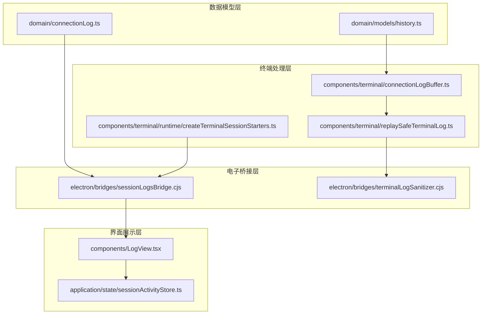
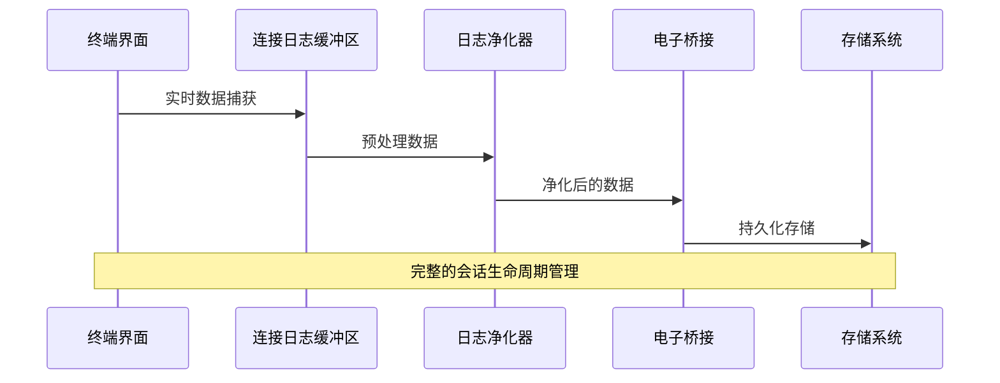
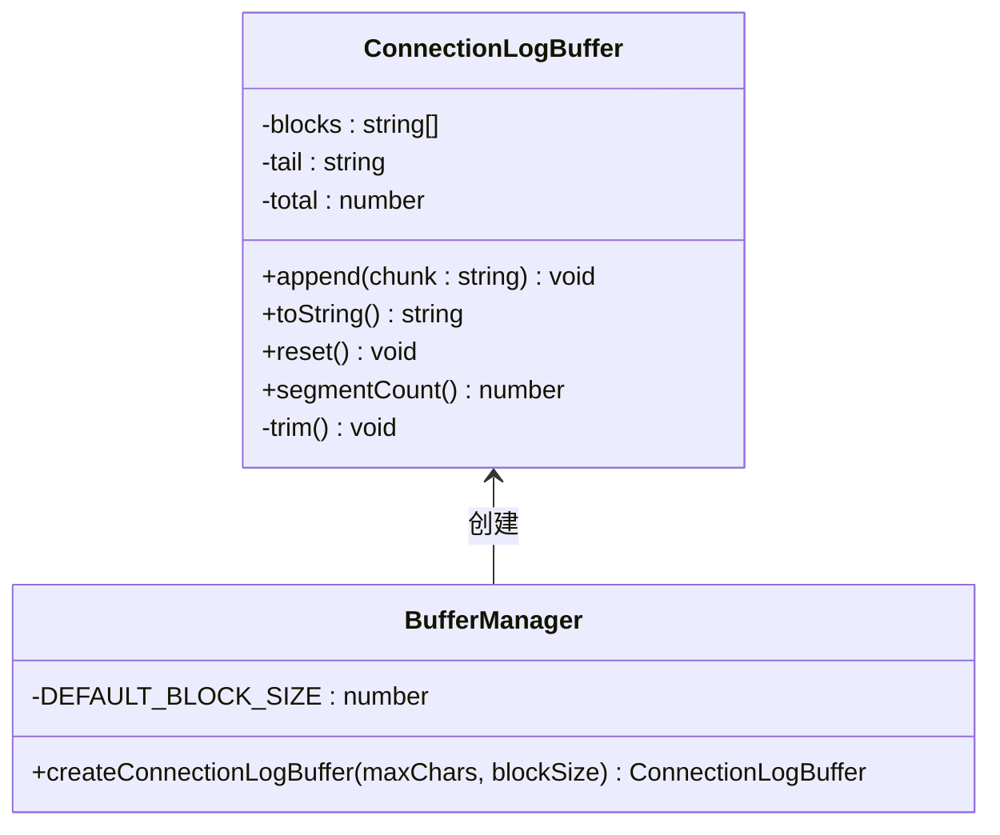
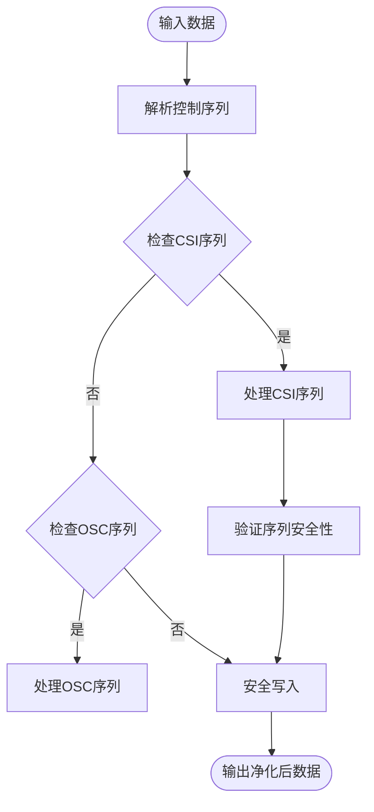
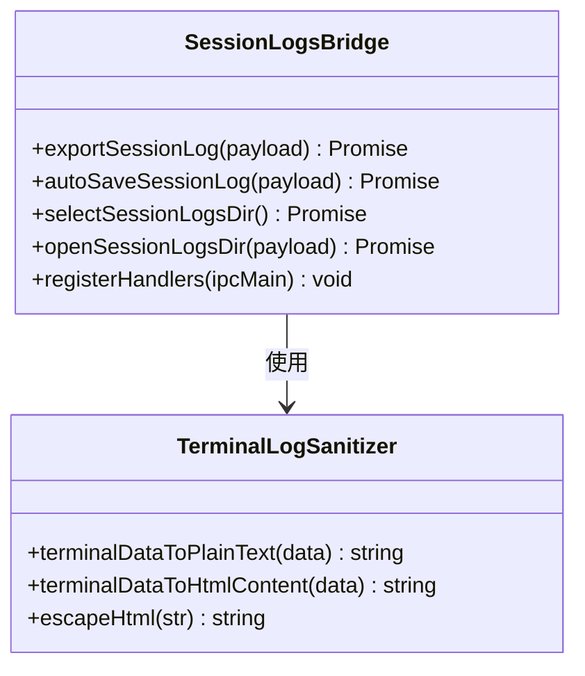
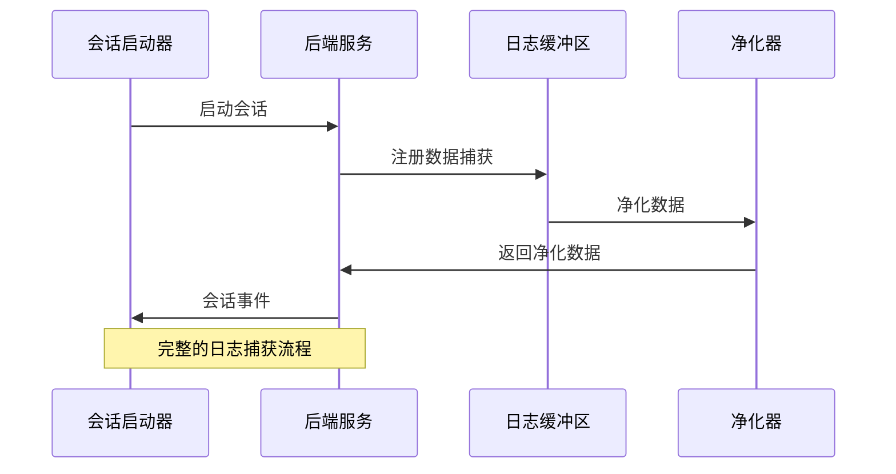
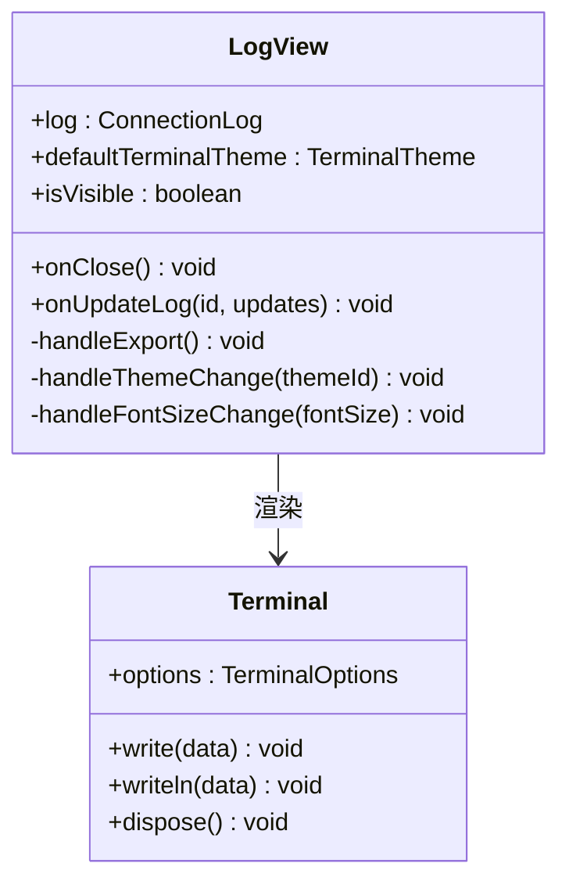
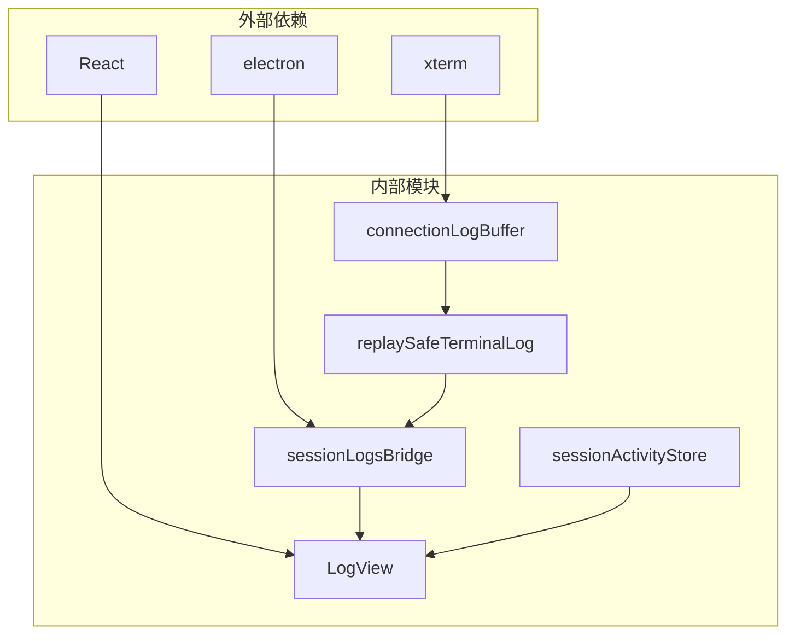

# 历史记录模型

<cite>
**本文档引用的文件**
- [domain/models/history.ts](file://domain/models/history.ts)
- [domain/connectionLog.ts](file://domain/connectionLog.ts)
- [components/terminal/connectionLogBuffer.ts](file://components/terminal/connectionLogBuffer.ts)
- [electron/bridges/sessionLogsBridge.cjs](file://electron/bridges/sessionLogsBridge.cjs)
- [components/terminal/replaySafeTerminalLog.ts](file://components/terminal/replaySafeTerminalLog.ts)
- [components/terminal/runtime/createTerminalSessionStarters.ts](file://components/terminal/runtime/createTerminalSessionStarters.ts)
- [electron/bridges/terminalLogSanitizer.cjs](file://electron/bridges/terminalLogSanitizer.cjs)
- [components/LogView.tsx](file://components/LogView.tsx)
- [application/state/sessionActivityStore.ts](file://application/state/sessionActivityStore.ts)
</cite>

## 目录
1. [简介](#简介)
2. [项目结构](#项目结构)
3. [核心组件](#核心组件)
4. [架构概览](#架构概览)
5. [详细组件分析](#详细组件分析)
6. [依赖关系分析](#依赖关系分析)
7. [性能考虑](#性能考虑)
8. [故障排除指南](#故障排除指南)
9. [结论](#结论)

## 简介

历史记录模型是Netcatty应用中用于管理会话历史、连接日志和操作记录的核心数据结构系统。该系统提供了完整的会话生命周期管理，包括实时数据捕获、持久化存储、检索查询、导出备份等功能。本文档详细描述了历史记录的数据结构定义、存储格式、索引策略、查询接口以及完整的生命周期管理机制。

## 项目结构

历史记录系统在项目中的组织结构如下：

**图表来源**
- [domain/models/history.ts:1-57](file://domain/models/history.ts#L1-L57)
- [components/terminal/connectionLogBuffer.ts:1-95](file://components/terminal/connectionLogBuffer.ts#L1-L95)
- [electron/bridges/sessionLogsBridge.cjs:1-276](file://electron/bridges/sessionLogsBridge.cjs#L1-L276)

**章节来源**
- [domain/models/history.ts:1-57](file://domain/models/history.ts#L1-L57)
- [domain/connectionLog.ts:1-26](file://domain/connectionLog.ts#L1-L26)

## 核心组件

### 数据模型定义

历史记录系统包含以下核心数据模型：

#### 已知主机模型 (KnownHost)
用于记录从系统SSH已知主机文件中发现的主机信息，包括指纹验证和转换状态。

#### Shell历史记录模型 (ShellHistoryEntry)
记录实际在终端会话中执行的真实命令，包含命令内容、执行上下文和时间戳信息。

#### 连接日志模型 (ConnectionLog)
核心的会话历史记录模型，记录完整的连接生命周期信息，支持多种协议类型。

#### 会话日志设置 (SessionLogFormat)
定义自动保存终端日志到本地文件系统的格式选项。

**章节来源**
- [domain/models/history.ts:14-57](file://domain/models/history.ts#L14-L57)

### 连接日志选择器

提供智能的连接日志匹配逻辑，支持基于会话ID和主机名的双重匹配策略。

**章节来源**
- [domain/connectionLog.ts:8-26](file://domain/connectionLog.ts#L8-L26)

## 架构概览

历史记录系统采用分层架构设计，确保数据流的清晰分离和职责明确划分：

**图表来源**
- [components/terminal/connectionLogBuffer.ts:31-95](file://components/terminal/connectionLogBuffer.ts#L31-L95)
- [components/terminal/replaySafeTerminalLog.ts:417-428](file://components/terminal/replaySafeTerminalLog.ts#L417-L428)
- [electron/bridges/sessionLogsBridge.cjs:193-231](file://electron/bridges/sessionLogsBridge.cjs#L193-L231)

## 详细组件分析

### 连接日志缓冲区

连接日志缓冲区实现了高效的内存管理策略，通过固定大小的块结构来限制内存使用：

**图表来源**
- [components/terminal/connectionLogBuffer.ts:18-95](file://components/terminal/connectionLogBuffer.ts#L18-L95)

#### 关键特性
- **内存限制**: 通过块大小和总字符数限制防止内存无限增长
- **高效追加**: 摊销复杂度O(chunk)，避免每次追加都进行字符串重建
- **智能修剪**: 只删除必要的块，保持操作的高效性

**章节来源**
- [components/terminal/connectionLogBuffer.ts:1-95](file://components/terminal/connectionLogBuffer.ts#L1-L95)

### 会话日志净化器

会话日志净化器确保日志内容的安全性和可重现性：

**图表来源**
- [components/terminal/replaySafeTerminalLog.ts:150-428](file://components/terminal/replaySafeTerminalLog.ts#L150-L428)

#### 安全特性
- **清除序列防护**: 阻止`clear`和`erase`序列擦除历史记录
- **光标控制保护**: 防止不安全的光标移动和状态更改
- **替代屏幕模式处理**: 正确处理替代屏幕模式的进入和退出

**章节来源**
- [components/terminal/replaySafeTerminalLog.ts:1-428](file://components/terminal/replaySafeTerminalLog.ts#L1-L428)

### 电子桥接层

电子桥接层提供跨进程的日志处理能力：

**图表来源**
- [electron/bridges/sessionLogsBridge.cjs:257-276](file://electron/bridges/sessionLogsBridge.cjs#L257-L276)
- [electron/bridges/terminalLogSanitizer.cjs:445-451](file://electron/bridges/terminalLogSanitizer.cjs#L445-L451)

#### 功能特性
- **多格式导出**: 支持TXT、HTML、RAW格式的会话日志导出
- **自动保存**: 在会话结束时自动保存日志到指定目录
- **路径安全**: 处理文件名中的特殊字符和保留设备名称
- **HTML转义**: 防止XSS攻击的HTML内容转义

**章节来源**
- [electron/bridges/sessionLogsBridge.cjs:1-276](file://electron/bridges/sessionLogsBridge.cjs#L1-L276)

### 终端会话启动器

终端会话启动器集成日志捕获功能：

**图表来源**
- [components/terminal/runtime/createTerminalSessionStarters.ts:371-375](file://components/terminal/runtime/createTerminalSessionStarters.ts#L371-L375)

**章节来源**
- [components/terminal/runtime/createTerminalSessionStarters.ts:1-800](file://components/terminal/runtime/createTerminalSessionStarters.ts#L1-L800)

### 日志视图组件

日志视图组件提供交互式的日志查看体验：

**图表来源**
- [components/LogView.tsx:15-343](file://components/LogView.tsx#L15-L343)

**章节来源**
- [components/LogView.tsx:1-343](file://components/LogView.tsx#L1-L343)

## 依赖关系分析

历史记录系统各组件之间的依赖关系如下：

**图表来源**
- [components/terminal/connectionLogBuffer.ts:1-95](file://components/terminal/connectionLogBuffer.ts#L1-L95)
- [electron/bridges/sessionLogsBridge.cjs:6-12](file://electron/bridges/sessionLogsBridge.cjs#L6-L12)

**章节来源**
- [application/state/sessionActivityStore.ts:1-79](file://application/state/sessionActivityStore.ts#L1-L79)

## 性能考虑

历史记录系统在设计时充分考虑了性能优化：

### 内存管理
- **固定块大小**: 默认64KB块大小，平衡内存使用和性能
- **智能修剪**: 当超过容量限制时，只删除必要数量的块
- **字符串段计数**: 限制内部字符串段数量，防止内存泄漏

### 处理效率
- **摊销复杂度**: 追加操作的摊销复杂度为O(chunk)
- **延迟字符串拼接**: 只在需要时才拼接完整字符串
- **增量净化**: 实时处理终端输出，避免大量数据堆积

### 存储优化
- **条件保存**: 只保存有活动的会话日志
- **格式选择**: 支持多种格式以平衡存储空间和可读性
- **自动清理**: 提供自动清理机制防止磁盘空间占用过多

## 故障排除指南

### 常见问题及解决方案

#### 日志丢失问题
- **症状**: 会话结束后找不到日志文件
- **原因**: 自动保存目录配置错误或权限问题
- **解决**: 检查会话日志目录设置，确保有写入权限

#### 内存使用过高
- **症状**: 应用程序内存持续增长
- **原因**: 日志缓冲区未正确修剪
- **解决**: 检查缓冲区配置，调整最大字符数限制

#### 导出失败
- **症状**: 导出日志时出现错误
- **原因**: 文件路径包含非法字符或目标目录不存在
- **解决**: 使用安全路径生成器，确保目标目录存在

**章节来源**
- [electron/bridges/sessionLogsBridge.cjs:176-252](file://electron/bridges/sessionLogsBridge.cjs#L176-L252)

## 结论

Netcatty的历史记录模型提供了一个完整、高效且安全的会话历史管理系统。通过分层架构设计、智能内存管理和严格的安全控制，该系统能够可靠地处理各种类型的终端会话数据。其模块化的组件设计使得系统易于维护和扩展，同时提供了丰富的API接口支持各种使用场景。

未来可以考虑的功能增强包括：分布式日志存储、实时搜索功能、高级分析报告等，这些都可以在现有架构基础上进行扩展实现。