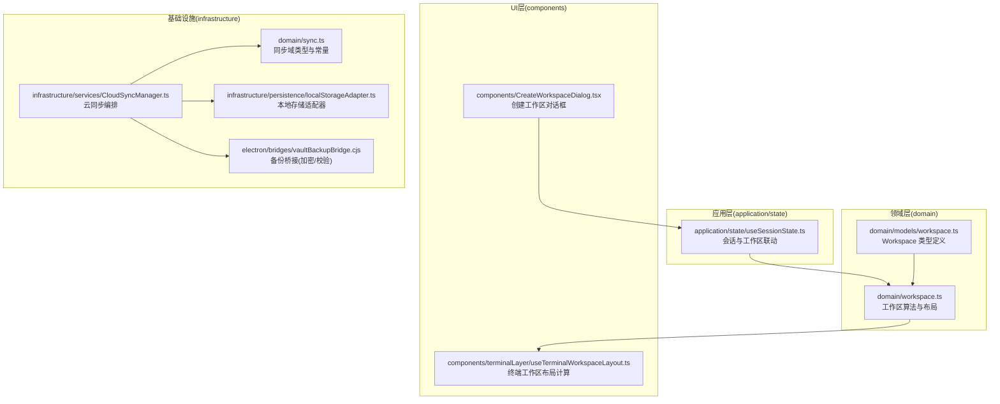
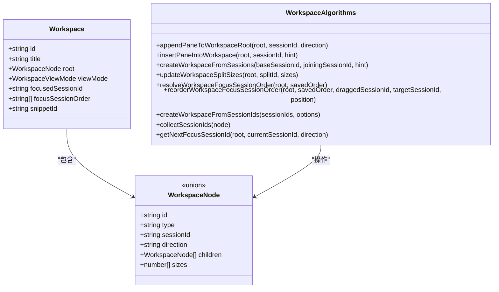
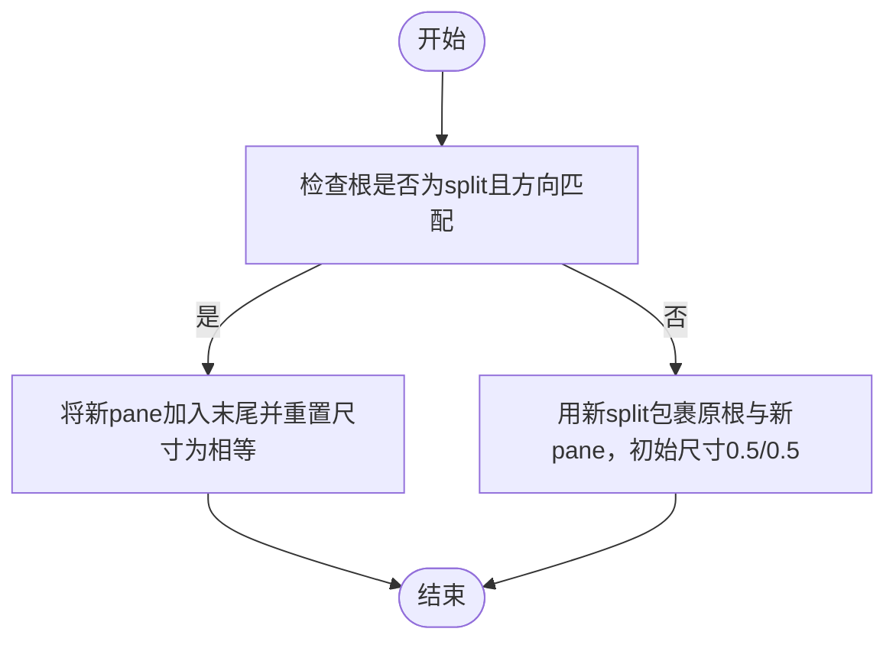
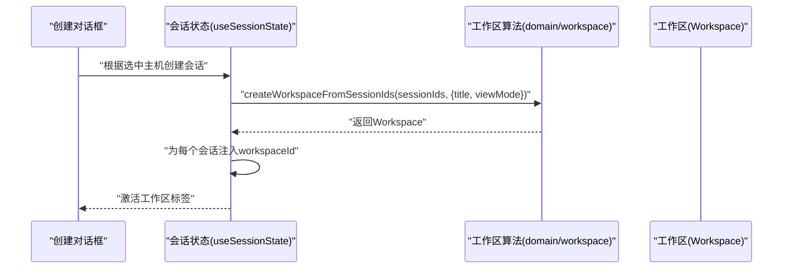
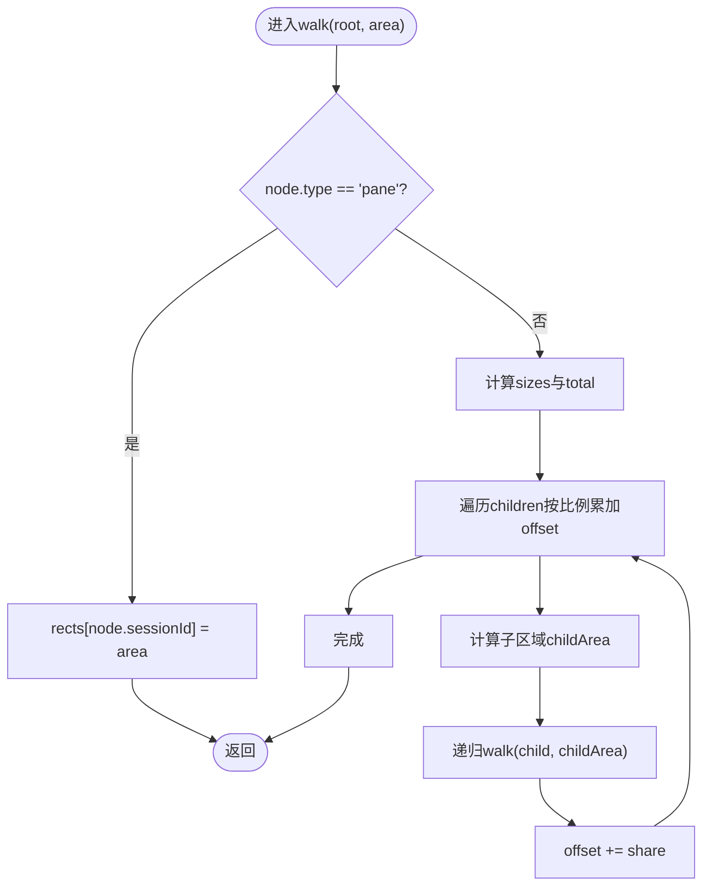
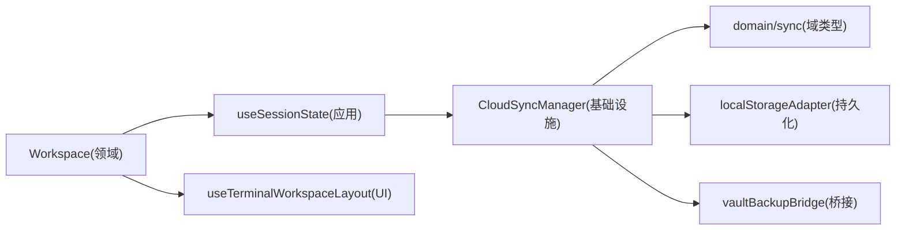

# 工作区模型

<cite>
**本文引用的文件**
- [domain/models/workspace.ts](file://domain/models/workspace.ts)
- [domain/workspace.ts](file://domain/workspace.ts)
- [components/CreateWorkspaceDialog.tsx](file://components/CreateWorkspaceDialog.tsx)
- [components/terminalLayer/useTerminalWorkspaceLayout.ts](file://components/terminalLayer/useTerminalWorkspaceLayout.ts)
- [application/state/useSessionState.ts](file://application/state/useSessionState.ts)
- [infrastructure/services/CloudSyncManager.ts](file://infrastructure/services/CloudSyncManager.ts)
- [domain/sync.ts](file://domain/sync.ts)
- [infrastructure/persistence/localStorageAdapter.ts](file://infrastructure/persistence/localStorageAdapter.ts)
- [electron/bridges/vaultBackupBridge.cjs](file://electron/bridges/vaultBackupBridge.cjs)
- [infrastructure/ai/cattyAgent/systemPrompt.ts](file://infrastructure/ai/cattyAgent/systemPrompt.ts)
</cite>

## 目录
1. [简介](#简介)
2. [项目结构](#项目结构)
3. [核心组件](#核心组件)
4. [架构总览](#架构总览)
5. [详细组件分析](#详细组件分析)
6. [依赖分析](#依赖分析)
7. [性能考虑](#性能考虑)
8. [故障排查指南](#故障排查指南)
9. [结论](#结论)
10. [附录](#附录)

## 简介
本文件为“工作区模型”的权威API文档，聚焦于Workspace实体的结构定义、布局与视图模式、与会话（Session）的关系、以及工作区在应用中的创建、修改、删除、复制等生命周期操作。同时覆盖工作区与主机、标签页、会话的关联关系与数据同步机制，工作区导入导出、模板管理与版本控制，安全配置、访问控制与权限管理，备份恢复、迁移升级与数据一致性保障，以及多用户协作、远程同步与冲突解决策略。

## 项目结构
工作区模型位于领域层（domain），通过工具函数与UI组件协同完成工作区的构建、渲染与交互；状态层（application/state）负责会话与工作区的联动；基础设施层（infrastructure）提供云同步、本地持久化与加密能力；UI层（components）提供工作区创建对话框与终端布局计算。

图表来源
- [domain/models/workspace.ts:1-36](file://domain/models/workspace.ts#L1-L36)
- [domain/workspace.ts:1-489](file://domain/workspace.ts#L1-L489)
- [components/CreateWorkspaceDialog.tsx:1-144](file://components/CreateWorkspaceDialog.tsx#L1-L144)
- [components/terminalLayer/useTerminalWorkspaceLayout.ts:52-85](file://components/terminalLayer/useTerminalWorkspaceLayout.ts#L52-L85)
- [application/state/useSessionState.ts:358-405](file://application/state/useSessionState.ts#L358-L405)
- [infrastructure/services/CloudSyncManager.ts:1-800](file://infrastructure/services/CloudSyncManager.ts#L1-L800)
- [domain/sync.ts:1-562](file://domain/sync.ts#L1-L562)
- [infrastructure/persistence/localStorageAdapter.ts:47-68](file://infrastructure/persistence/localStorageAdapter.ts#L47-L68)
- [electron/bridges/vaultBackupBridge.cjs:174-215](file://electron/bridges/vaultBackupBridge.cjs#L174-L215)

章节来源
- [domain/models/workspace.ts:1-36](file://domain/models/workspace.ts#L1-L36)
- [domain/workspace.ts:1-489](file://domain/workspace.ts#L1-L489)
- [components/CreateWorkspaceDialog.tsx:1-144](file://components/CreateWorkspaceDialog.tsx#L1-L144)
- [components/terminalLayer/useTerminalWorkspaceLayout.ts:52-85](file://components/terminalLayer/useTerminalWorkspaceLayout.ts#L52-L85)
- [application/state/useSessionState.ts:358-405](file://application/state/useSessionState.ts#L358-L405)
- [infrastructure/services/CloudSyncManager.ts:1-800](file://infrastructure/services/CloudSyncManager.ts#L1-L800)
- [domain/sync.ts:1-562](file://domain/sync.ts#L1-L562)
- [infrastructure/persistence/localStorageAdapter.ts:47-68](file://infrastructure/persistence/localStorageAdapter.ts#L47-L68)
- [electron/bridges/vaultBackupBridge.cjs:174-215](file://electron/bridges/vaultBackupBridge.cjs#L174-L215)

## 核心组件
- Workspace 实体：包含唯一标识、标题、根节点树（pane/split）、视图模式（split/focus）、当前焦点会话、焦点会话顺序、以及由脚本运行创建时的脚本标识。
- WorkspaceNode：递归树形结构，支持“pane”（承载会话）与“split”（分割容器，含方向与子节点及相对尺寸）。
- Workspace 视图模式：split（平铺）与 focus（侧边栏+单面板）两种。
- 工作区算法：插入/追加面板、按提示拆分、从会话集合创建、更新分割尺寸、收集会话ID、查找路径、计算焦点下一目标、解析焦点顺序等。
- 会话与工作区联动：创建/合并工作区、注入工作区ID到会话、焦点切换与顺序维护。
- UI与布局：创建对话框选择主机生成工作区；终端层根据树形结构计算每个pane的矩形区域。
- 同步与持久化：云同步编排、安全状态机、冲突检测与解决、本地存储适配器、备份桥接（加密/指纹/去重）。

章节来源
- [domain/models/workspace.ts:11-36](file://domain/models/workspace.ts#L11-L36)
- [domain/workspace.ts:12-173](file://domain/workspace.ts#L12-L173)
- [domain/workspace.ts:134-281](file://domain/workspace.ts#L134-L281)
- [application/state/useSessionState.ts:358-405](file://application/state/useSessionState.ts#L358-L405)
- [components/terminalLayer/useTerminalWorkspaceLayout.ts:52-85](file://components/terminalLayer/useTerminalWorkspaceLayout.ts#L52-L85)

## 架构总览
工作区模型采用“领域算法 + UI联动 + 基础设施支撑”的分层设计。领域层提供不可变的树形结构与布局算法；应用层负责会话与工作区的绑定与状态变更；UI层提供创建与布局；基础设施层提供云同步、本地持久化与加密。

图表来源
- [domain/models/workspace.ts:11-36](file://domain/models/workspace.ts#L11-L36)
- [domain/workspace.ts:62-173](file://domain/workspace.ts#L62-L173)
- [domain/workspace.ts:134-281](file://domain/workspace.ts#L134-L281)

## 详细组件分析

### 工作区实体与布局算法
- 结构定义
  - Workspace：唯一ID、标题、根节点树、视图模式、当前焦点会话、焦点顺序、脚本来源标识。
  - WorkspaceNode：pane（承载sessionId）与split（含方向、子节点、尺寸数组）。
  - WorkspaceViewMode：split（默认平铺）与 focus（左侧列表+右侧单面板）。
- 关键算法
  - 追加面板至根：根据方向将新pane加入同向根分支末尾，并重置兄弟尺寸为相等。
  - 插入面板：基于SplitHint（方向、位置、目标会话）在指定位置拆分或作为根包裹。
  - 从会话创建：以两个会话为基础，按提示方向与位置创建split根。
  - 更新分割尺寸：按splitId定位并更新sizes数组。
  - 收集会话ID：遍历树形结构收集所有pane的sessionId。
  - 计算焦点下一目标：基于屏幕坐标与重叠关系，计算上下左右方向的最近目标。
  - 解析/重排焦点顺序：结合当前树中会话与保存顺序，保持稳定且不丢失会话。

图表来源
- [domain/workspace.ts:62-86](file://domain/workspace.ts#L62-L86)

章节来源
- [domain/models/workspace.ts:11-36](file://domain/models/workspace.ts#L11-L36)
- [domain/workspace.ts:12-173](file://domain/workspace.ts#L12-L173)
- [domain/workspace.ts:134-281](file://domain/workspace.ts#L134-L281)

### 会话与工作区的关联与生命周期
- 创建工作区：从会话ID集合创建，支持单pane或多pane水平并排；默认焦点为首个会话。
- 合并工作区：将一个会话加入另一个工作区，基于SplitHint进行插入或包裹。
- 注入工作区ID：创建后将workspaceId写回到对应会话，便于后续导航与状态管理。
- 焦点与顺序：提供解析与重排焦点顺序的方法，支持拖拽调整。

图表来源
- [application/state/useSessionState.ts:358-405](file://application/state/useSessionState.ts#L358-L405)
- [domain/workspace.ts:220-271](file://domain/workspace.ts#L220-L271)

章节来源
- [application/state/useSessionState.ts:358-405](file://application/state/useSessionState.ts#L358-L405)
- [domain/workspace.ts:134-281](file://domain/workspace.ts#L134-L281)

### 终端工作区布局计算
- 输入：工作区根节点树、可用画布区域。
- 输出：每个sessionId对应的矩形区域映射，用于UI渲染与焦点导航。
- 算法要点：按方向（水平/垂直）累加比例，递归计算子节点区域，确保尺寸总和归一化。

图表来源
- [components/terminalLayer/useTerminalWorkspaceLayout.ts:52-85](file://components/terminalLayer/useTerminalWorkspaceLayout.ts#L52-L85)

章节来源
- [components/terminalLayer/useTerminalWorkspaceLayout.ts:52-85](file://components/terminalLayer/useTerminalWorkspaceLayout.ts#L52-L85)

### 工作区创建、修改、删除与复制
- 创建
  - 通过对话框选择主机，生成会话列表，调用createWorkspaceFromSessionIds创建split/focus视图。
  - 参考：[CreateWorkspaceDialog:1-144](file://components/CreateWorkspaceDialog.tsx#L1-L144)，[createWorkspaceFromSessionIds:220-271](file://domain/workspace.ts#L220-L271)。
- 修改
  - 追加/插入面板：appendPaneToWorkspaceRoot、insertPaneIntoWorkspace。
  - 更新分割尺寸：updateWorkspaceSplitSizes。
  - 调整焦点顺序：resolveWorkspaceFocusSessionOrder、reorderWorkspaceFocusSessionOrder。
  - 参考：[appendPaneToWorkspaceRoot:62-86](file://domain/workspace.ts#L62-L86)，[insertPaneIntoWorkspace:103-132](file://domain/workspace.ts#L103-L132)，[updateWorkspaceSplitSizes:158-173](file://domain/workspace.ts#L158-L173)，[焦点顺序:175-214](file://domain/workspace.ts#L175-L214)。
- 删除
  - 通过修剪算法pruneWorkspaceNode移除指定会话对应的pane或子树，自动平衡兄弟尺寸。
  - 参考：[pruneWorkspaceNode:12-52](file://domain/workspace.ts#L12-L52)。
- 复制
  - 通过从会话集合创建新的Workspace实例，复制布局与焦点信息。
  - 参考：[createWorkspaceFromSessionIds:220-271](file://domain/workspace.ts#L220-L271)。

章节来源
- [components/CreateWorkspaceDialog.tsx:1-144](file://components/CreateWorkspaceDialog.tsx#L1-L144)
- [domain/workspace.ts:12-173](file://domain/workspace.ts#L12-L173)
- [domain/workspace.ts:134-281](file://domain/workspace.ts#L134-L281)

### 工作区与主机、标签页、会话的关联与数据同步
- 关联关系
  - 会话（Session）通过workspaceId与工作区关联；焦点会话与焦点顺序决定UI侧边栏与单面板布局。
  - 主机（Host）通过会话连接，工作区承载多个会话，形成“主机—会话—工作区”的层级。
- 数据同步
  - 云同步编排：CloudSyncManager管理安全状态机（NO_KEY/LOCKED/UNLOCKED）、同步状态机（IDLE/SYNCING/CONFLICT/BLOCKED/ERROR）、冲突检测与解决、自动同步调度。
  - 同步域类型：SyncPayload定义可同步实体（主机、密钥、脚本、自定义分组、端口转发规则、已知主机、代理配置、设置等）。
  - 本地持久化：localStorageAdapter提供安全写入与配额异常处理。
  - 参考：[CloudSyncManager:1-800](file://infrastructure/services/CloudSyncManager.ts#L1-L800)，[domain/sync:1-562](file://domain/sync.ts#L1-L562)，[localStorageAdapter:47-68](file://infrastructure/persistence/localStorageAdapter.ts#L47-L68)。

章节来源
- [infrastructure/services/CloudSyncManager.ts:1-800](file://infrastructure/services/CloudSyncManager.ts#L1-L800)
- [domain/sync.ts:1-562](file://domain/sync.ts#L1-L562)
- [infrastructure/persistence/localStorageAdapter.ts:47-68](file://infrastructure/persistence/localStorageAdapter.ts#L47-L68)

### 工作区导入导出、模板管理与版本控制
- 导入导出
  - 通过云同步系统下载/上传加密的SyncPayload，实现跨设备导入导出。
  - 支持历史版本查看与一键恢复（如GitHub Gist历史）。
  - 参考：[CloudSyncManager 下载/修订:648-672](file://infrastructure/services/CloudSyncManager.ts#L648-L672)。
- 模板管理
  - 通过会话集合批量创建工作区（如脚本运行场景），支持自定义标题与视图模式。
  - 参考：[createWorkspaceFromSessionIds:220-271](file://domain/workspace.ts#L220-L271)。
- 版本控制
  - 同步文件包含版本号、时间戳、设备信息、加密参数与签名，支持三向合并与收缩检测（shrink guard）。
  - 参考：[SyncFileMeta:137-148](file://domain/sync.ts#L137-L148)，[SyncResult:344-357](file://domain/sync.ts#L344-L357)。

章节来源
- [infrastructure/services/CloudSyncManager.ts:648-672](file://infrastructure/services/CloudSyncManager.ts#L648-L672)
- [domain/workspace.ts:220-271](file://domain/workspace.ts#L220-L271)
- [domain/sync.ts:137-148](file://domain/sync.ts#L137-L148)
- [domain/sync.ts:344-357](file://domain/sync.ts#L344-L357)

### 安全配置、访问控制与权限管理
- 零知识加密
  - 使用AES-256-GCM对称加密，PBKDF2/Argon2id派生密钥，带盐与迭代次数，meta中记录算法与KDF参数。
  - 参考：[SyncFileMeta:137-148](file://domain/sync.ts#L137-L148)，[EncryptionResult/DecryptionInput:292-310](file://domain/sync.ts#L292-L310)。
- 主密码与解锁
  - MasterKeyConfig存储验证哈希、盐与KDF参数；UnlockedMasterKey在内存中持有派生密钥。
  - 参考：[MasterKeyConfig/UnlockedMasterKey:319-335](file://domain/sync.ts#L319-L335)。
- 权限模式（AI）
  - observer（只读）、confirm（需要确认）、autonomous（自主执行但受阻断清单约束）。
  - 参考：[systemPrompt 权限规则:109-141](file://infrastructure/ai/cattyAgent/systemPrompt.ts#L109-L141)。

章节来源
- [domain/sync.ts:137-148](file://domain/sync.ts#L137-L148)
- [domain/sync.ts:292-310](file://domain/sync.ts#L292-L310)
- [domain/sync.ts:319-335](file://domain/sync.ts#L319-L335)
- [infrastructure/ai/cattyAgent/systemPrompt.ts:109-141](file://infrastructure/ai/cattyAgent/systemPrompt.ts#L109-L141)

### 备份恢复、迁移升级与数据一致性
- 备份
  - 通过vaultBackupBridge对payload进行safeStorage加密编码，支持指纹去重与并发互斥，限制最大负载大小。
  - 参考：[encodePayload/decodePayload:188-215](file://electron/bridges/vaultBackupBridge.cjs#L188-L215)，[TooLargeError:174-182](file://electron/bridges/vaultBackupBridge.cjs#L174-L182)。
- 恢复
  - 云同步下载后解密，应用到本地状态；冲突时提供USE_LOCAL/USE_REMOTE选择。
  - 参考：[CloudSyncManager 下载/冲突解决:636-679](file://infrastructure/services/CloudSyncManager.ts#L636-L679)。
- 迁移升级
  - 版本字符串清洗与校验，保留合法SemVer格式；同步数据版本字段持久化与清理。
  - 参考：[备份测试片段:382-466](file://electron/bridges/vaultBackupBridge.test.cjs#L382-L466)。

章节来源
- [electron/bridges/vaultBackupBridge.cjs:174-215](file://electron/bridges/vaultBackupBridge.cjs#L174-L215)
- [infrastructure/services/CloudSyncManager.ts:636-679](file://infrastructure/services/CloudSyncManager.ts#L636-L679)
- [electron/bridges/vaultBackupBridge.test.cjs:382-466](file://electron/bridges/vaultBackupBridge.test.cjs#L382-L466)

### 多用户协作、远程同步与冲突解决
- 协作与同步
  - 多云适配器（GitHub/Google/OneDrive/WebDAV/S3），统一安全状态机与同步状态机。
  - 自动同步与历史版本回溯，支持三向合并与收缩检测。
  - 参考：[CloudSyncManager 公共API:362-794](file://infrastructure/services/CloudSyncManager.ts#L362-L794)，[domain/sync 常量与事件:445-508](file://domain/sync.ts#L445-L508)。
- 冲突解决
  - 检测冲突后弹窗，提供USE_LOCAL（上传本地）与USE_REMOTE（下载云端）两种策略；支持BLOCKED状态下的强制推送与清理。
  - 参考：[冲突解决流程:487-506](file://infrastructure/services/CloudSyncManager.ts#L487-L506)，[UI冲突模态:528-619](file://components/cloud-sync/CloudSyncControls.tsx#L528-L619)。

章节来源
- [infrastructure/services/CloudSyncManager.ts:362-794](file://infrastructure/services/CloudSyncManager.ts#L362-L794)
- [domain/sync.ts:445-508](file://domain/sync.ts#L445-L508)
- [components/cloud-sync/CloudSyncControls.tsx:528-619](file://components/cloud-sync/CloudSyncControls.tsx#L528-L619)

## 依赖分析
- 工作区模型依赖
  - 与会话状态联动：useSessionState负责创建/合并工作区并将workspaceId写回会话。
  - 与终端布局联动：useTerminalWorkspaceLayout基于WorkspaceNode计算矩形区域。
  - 与云同步联动：CloudSyncManager管理安全/同步状态、冲突检测与解决、自动同步。
  - 与本地持久化联动：localStorageAdapter提供安全写入与配额保护。
- 外部依赖
  - Electron桥接：vaultBackupBridge提供备份加密与校验。
  - AI权限：systemPrompt定义不同权限模式的行为边界。

图表来源
- [domain/workspace.ts:1-489](file://domain/workspace.ts#L1-L489)
- [application/state/useSessionState.ts:358-405](file://application/state/useSessionState.ts#L358-L405)
- [components/terminalLayer/useTerminalWorkspaceLayout.ts:52-85](file://components/terminalLayer/useTerminalWorkspaceLayout.ts#L52-L85)
- [infrastructure/services/CloudSyncManager.ts:1-800](file://infrastructure/services/CloudSyncManager.ts#L1-L800)
- [domain/sync.ts:1-562](file://domain/sync.ts#L1-L562)
- [infrastructure/persistence/localStorageAdapter.ts:47-68](file://infrastructure/persistence/localStorageAdapter.ts#L47-L68)
- [electron/bridges/vaultBackupBridge.cjs:174-215](file://electron/bridges/vaultBackupBridge.cjs#L174-L215)

章节来源
- [domain/workspace.ts:1-489](file://domain/workspace.ts#L1-L489)
- [application/state/useSessionState.ts:358-405](file://application/state/useSessionState.ts#L358-L405)
- [components/terminalLayer/useTerminalWorkspaceLayout.ts:52-85](file://components/terminalLayer/useTerminalWorkspaceLayout.ts#L52-L85)
- [infrastructure/services/CloudSyncManager.ts:1-800](file://infrastructure/services/CloudSyncManager.ts#L1-L800)
- [domain/sync.ts:1-562](file://domain/sync.ts#L1-L562)
- [infrastructure/persistence/localStorageAdapter.ts:47-68](file://infrastructure/persistence/localStorageAdapter.ts#L47-L68)
- [electron/bridges/vaultBackupBridge.cjs:174-215](file://electron/bridges/vaultBackupBridge.cjs#L174-L215)

## 性能考虑
- 布局计算
  - 递归遍历WorkspaceNode计算矩形区域，时间复杂度O(N)，其中N为pane数量；按方向累加比例避免浮点误差累积。
- 分割尺寸更新
  - updateWorkspaceSplitSizes采用深度优先patch，仅在命中splitId时更新sizes，避免全树重绘。
- 修剪与平衡
  - pruneWorkspaceNode在移除子树时按需重平衡兄弟尺寸，防止比例失衡导致UI异常。
- 云同步
  - 并发互斥（mutex）避免重复备份；指纹去重减少冗余；收缩检测（shrink guard）防止误删过多数据。
- 本地存储
  - safeSetItem捕获配额异常，避免崩溃并记录警告日志。

[本节为通用指导，无需列出章节来源]

## 故障排查指南
- 云同步冲突
  - 现象：出现CONFLICT或BLOCKED状态。
  - 处理：在UI中选择USE_LOCAL或USE_REMOTE；必要时清理BLOCKED状态后重试。
  - 参考：[冲突解决:487-506](file://infrastructure/services/CloudSyncManager.ts#L487-L506)，[UI冲突模态:528-619](file://components/cloud-sync/CloudSyncControls.tsx#L528-L619)。
- 备份过大
  - 现象：抛出VaultBackupTooLargeError。
  - 处理：减小payload规模或拆分备份。
  - 参考：[TooLargeError:174-182](file://electron/bridges/vaultBackupBridge.cjs#L174-L182)。
- 存储配额不足
  - 现象：localStorageAdapter写入失败并记录QuotaExceededError。
  - 处理：清理缓存或降低写入频率。
  - 参考：[safeSetItem:51-68](file://infrastructure/persistence/localStorageAdapter.ts#L51-L68)。
- 布局异常
  - 现象：面板尺寸错乱或焦点跳转异常。
  - 处理：检查sizes数组与方向；使用updateWorkspaceSplitSizes重置；必要时重建split。
  - 参考：[updateWorkspaceSplitSizes:158-173](file://domain/workspace.ts#L158-L173)，[getNextFocusSessionId:378-488](file://domain/workspace.ts#L378-L488)。

章节来源
- [infrastructure/services/CloudSyncManager.ts:487-506](file://infrastructure/services/CloudSyncManager.ts#L487-L506)
- [components/cloud-sync/CloudSyncControls.tsx:528-619](file://components/cloud-sync/CloudSyncControls.tsx#L528-L619)
- [electron/bridges/vaultBackupBridge.cjs:174-182](file://electron/bridges/vaultBackupBridge.cjs#L174-L182)
- [infrastructure/persistence/localStorageAdapter.ts:51-68](file://infrastructure/persistence/localStorageAdapter.ts#L51-L68)
- [domain/workspace.ts:158-173](file://domain/workspace.ts#L158-L173)
- [domain/workspace.ts:378-488](file://domain/workspace.ts#L378-L488)

## 结论
工作区模型以不可变树形结构为核心，配合完善的布局算法与UI联动，实现了灵活的多会话组织与可视化呈现。通过云同步与零知识加密，保障了跨设备协作与数据安全；通过冲突检测与历史版本回溯，提供了稳健的版本控制与恢复能力。结合本地持久化与备份桥接，进一步增强了系统的可靠性与可维护性。

[本节为总结，无需列出章节来源]

## 附录
- API速查
  - 创建：createWorkspaceFromSessionIds
  - 合并：createWorkspaceFromSessions
  - 插入/追加：insertPaneIntoWorkspace、appendPaneToWorkspaceRoot
  - 修改：updateWorkspaceSplitSizes、reorderWorkspaceFocusSessionOrder
  - 删除：pruneWorkspaceNode
  - 查询：collectSessionIds、getNextFocusSessionId
  - 云同步：buildPayload、syncToProvider、downloadFromProvider、resolveConflict
  - 备份：encodePayload/decodePayload、createBackup（桥接）

[本节为概览，无需列出章节来源]