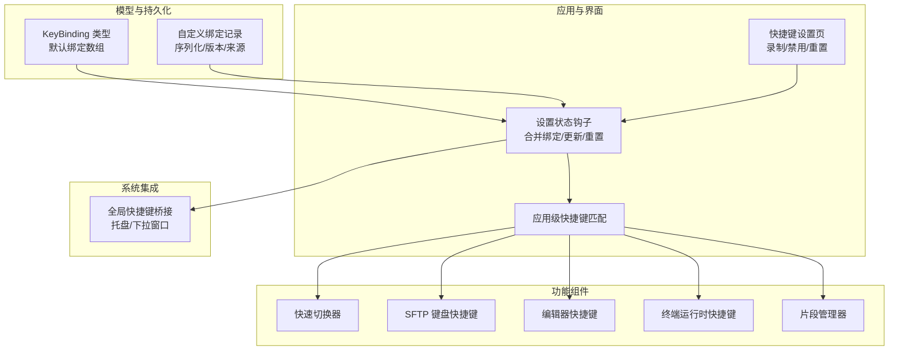
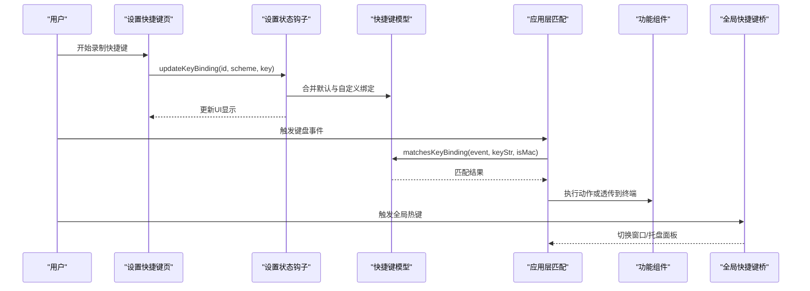
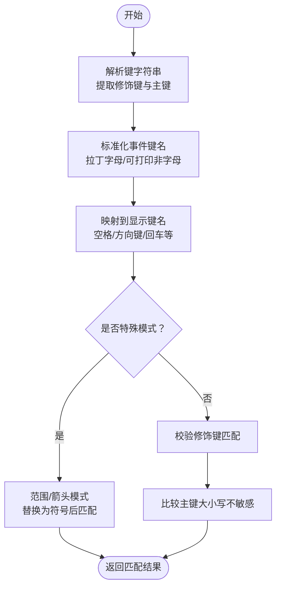
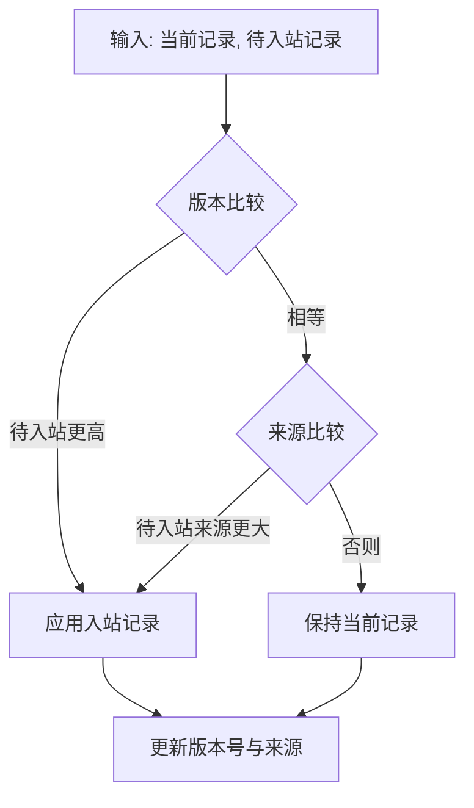
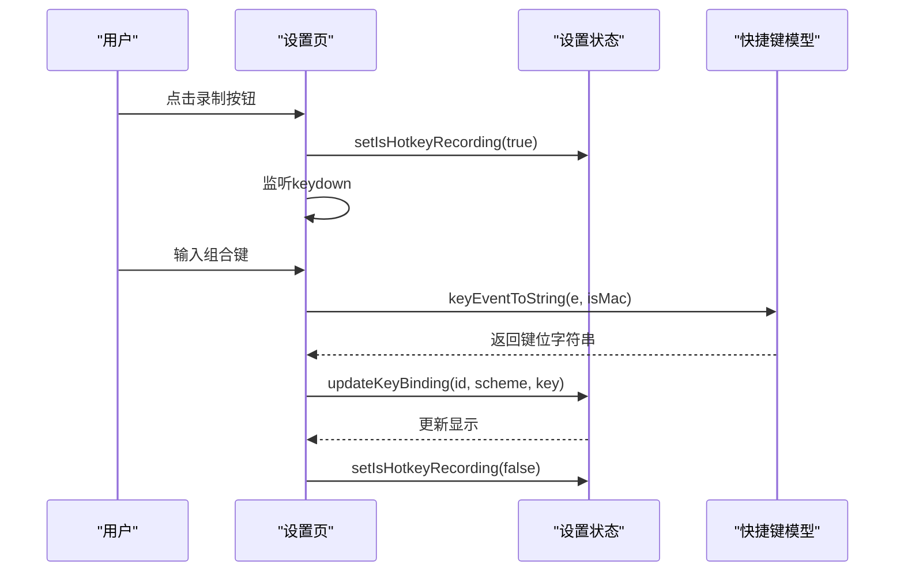
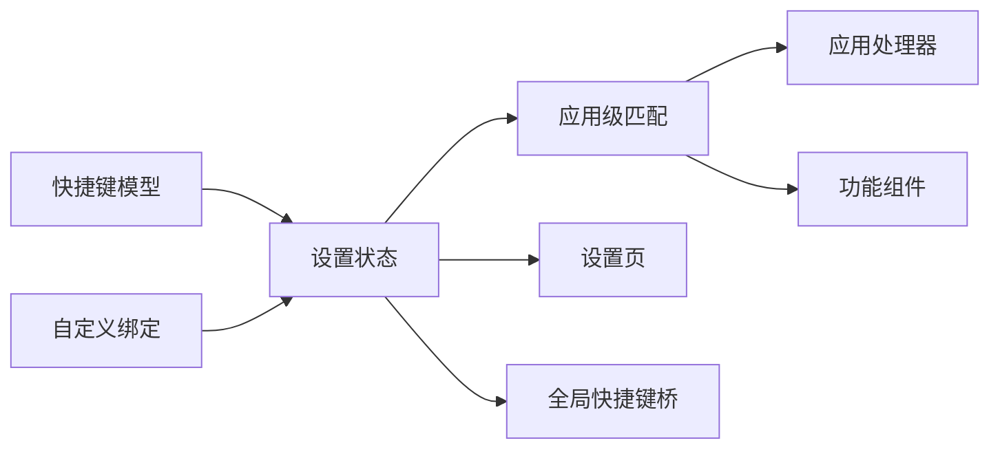

# 快捷键模型

<cite>
**本文引用的文件**
- [domain/models/keyBindings.ts](file://domain/models/keyBindings.ts)
- [domain/customKeyBindings.ts](file://domain/customKeyBindings.ts)
- [application/state/useSettingsState.ts](file://application/state/useSettingsState.ts)
- [application/state/useGlobalHotkeys.ts](file://application/state/useGlobalHotkeys.ts)
- [components/settings/tabs/SettingsShortcutsTab.tsx](file://components/settings/tabs/SettingsShortcutsTab.tsx)
- [electron/bridges/globalShortcutBridge.cjs](file://electron/bridges/globalShortcutBridge.cjs)
- [components/QuickSwitcher.tsx](file://components/QuickSwitcher.tsx)
- [components/sftp/hooks/useSftpKeyboardShortcuts.ts](file://components/sftp/hooks/useSftpKeyboardShortcuts.ts)
- [components/editor/TextEditorPane.tsx](file://components/editor/TextEditorPane.tsx)
- [components/terminal/runtime/createXTermRuntime.ts](file://components/terminal/runtime/createXTermRuntime.ts)
- [components/SnippetsManager.tsx](file://components/SnippetsManager.tsx)
- [App.tsx](file://App.tsx)
- [application/app/AppHandlers.ts](file://application/app/AppHandlers.ts)
</cite>

## 目录
1. [简介](#简介)
2. [项目结构](#项目结构)
3. [核心组件](#核心组件)
4. [架构总览](#架构总览)
5. [详细组件分析](#详细组件分析)
6. [依赖关系分析](#依赖关系分析)
7. [性能考量](#性能考量)
8. [故障排查指南](#故障排查指南)
9. [结论](#结论)
10. [附录](#附录)

## 简介
本文件为“快捷键模型”的详细API文档，覆盖快捷键配置数据结构、注册/修改/删除/重置API、全局/局部/动态快捷键规则、冲突检测与优先级处理、模板与预设管理、持久化与跨平台集成、调试与性能优化等主题。目标是帮助开发者与使用者理解并正确使用快捷键系统。

## 项目结构
快捷键系统由以下层次构成：
- 数据模型层：定义快捷键数据结构、默认绑定、解析与匹配逻辑
- 配置与持久化层：合并默认与用户自定义绑定、序列化/反序列化、版本与来源控制
- 应用层：应用级快捷键匹配、终端级透传策略
- 设置界面层：快捷键录制、禁用、重置、分类展示
- 系统集成层：全局热键（托盘/下拉窗口）注册与平台适配
- 组件层：各功能模块（SFTP、编辑器、片段等）的键盘快捷键处理

图表来源
- [domain/models/keyBindings.ts:194-241](file://domain/models/keyBindings.ts#L194-L241)
- [domain/customKeyBindings.ts:68-134](file://domain/customKeyBindings.ts#L68-L134)
- [application/state/useSettingsState.ts:800-827](file://application/state/useSettingsState.ts#L800-L827)
- [application/state/useGlobalHotkeys.ts:5-54](file://application/state/useGlobalHotkeys.ts#L5-L54)
- [components/settings/tabs/SettingsShortcutsTab.tsx:1-258](file://components/settings/tabs/SettingsShortcutsTab.tsx#L1-L258)
- [electron/bridges/globalShortcutBridge.cjs:525-581](file://electron/bridges/globalShortcutBridge.cjs#L525-L581)

章节来源
- [domain/models/keyBindings.ts:1-241](file://domain/models/keyBindings.ts#L1-L241)
- [domain/customKeyBindings.ts:1-134](file://domain/customKeyBindings.ts#L1-L134)
- [application/state/useSettingsState.ts:790-970](file://application/state/useSettingsState.ts#L790-L970)
- [application/state/useGlobalHotkeys.ts:1-54](file://application/state/useGlobalHotkeys.ts#L1-L54)
- [components/settings/tabs/SettingsShortcutsTab.tsx:1-258](file://components/settings/tabs/SettingsShortcutsTab.tsx#L1-L258)
- [electron/bridges/globalShortcutBridge.cjs:1-932](file://electron/bridges/globalShortcutBridge.cjs#L1-L932)

## 核心组件
- 快捷键数据模型与默认绑定
  - KeyBinding：包含唯一标识、动作ID、标签、mac与pc平台键位字符串、类别
  - 默认绑定数组：覆盖标签页、终端、导航、应用、SFTP五大类
- 自定义快捷键持久化
  - 记录结构含版本号与来源，支持序列化/反序列化、版本比较与来源仲裁
- 设置状态与合并逻辑
  - 将默认绑定与用户自定义绑定合并，暴露更新/重置单个/全部绑定的API
- 应用级快捷键匹配
  - 检查事件是否匹配某绑定；区分应用级动作与终端透传动作
- 设置页快捷键录制
  - 录制流程、特殊后缀（范围/箭头）、禁用与重置操作
- 全局快捷键桥接
  - 注册/注销全局热键，托盘面板与下拉窗口可见性切换

章节来源
- [domain/models/keyBindings.ts:4-241](file://domain/models/keyBindings.ts#L4-L241)
- [domain/customKeyBindings.ts:6-134](file://domain/customKeyBindings.ts#L6-L134)
- [application/state/useSettingsState.ts:800-827](file://application/state/useSettingsState.ts#L800-L827)
- [application/state/useGlobalHotkeys.ts:5-54](file://application/state/useGlobalHotkeys.ts#L5-L54)
- [components/settings/tabs/SettingsShortcutsTab.tsx:1-258](file://components/settings/tabs/SettingsShortcutsTab.tsx#L1-L258)
- [electron/bridges/globalShortcutBridge.cjs:525-581](file://electron/bridges/globalShortcutBridge.cjs#L525-L581)

## 架构总览
快捷键从“模型—配置—应用—界面—系统”五层协同工作，形成统一的快捷键体验。

图表来源
- [components/settings/tabs/SettingsShortcutsTab.tsx:50-116](file://components/settings/tabs/SettingsShortcutsTab.tsx#L50-L116)
- [application/state/useSettingsState.ts:800-827](file://application/state/useSettingsState.ts#L800-L827)
- [domain/models/keyBindings.ts:100-192](file://domain/models/keyBindings.ts#L100-L192)
- [application/state/useGlobalHotkeys.ts:5-54](file://application/state/useGlobalHotkeys.ts#L5-L54)
- [electron/bridges/globalShortcutBridge.cjs:525-581](file://electron/bridges/globalShortcutBridge.cjs#L525-L581)

## 详细组件分析

### 数据模型与默认绑定
- 关键类型与字段
  - HotkeyScheme：'disabled' | 'mac' | 'pc'
  - KeyBinding：id, action, label, mac, pc, category
  - CustomKeyBindings：按绑定ID映射到{mac?, pc?}
- 默认绑定
  - 覆盖标签页、终端、导航、应用、SFTP五大类，部分平台禁用（如PC端某些应用快捷键）
- 解析与匹配
  - 解析键字符串为修饰键与主键集合
  - 事件到字符串转换，符号标准化（方向键、空格、退格、删除、回车、制表符等）
  - 支持特殊模式：数字范围[1...9]与箭头关键词，自动扩展为对应键位

图表来源
- [domain/models/keyBindings.ts:16-98](file://domain/models/keyBindings.ts#L16-L98)
- [domain/models/keyBindings.ts:100-192](file://domain/models/keyBindings.ts#L100-L192)

章节来源
- [domain/models/keyBindings.ts:1-241](file://domain/models/keyBindings.ts#L1-L241)

### 自定义快捷键持久化与同步
- 记录结构
  - bindings: CustomKeyBindings
  - version: number
  - origin: string
- 版本与来源仲裁
  - 版本号递增，来源字符串用于同版本冲突时的仲裁
- 更新与重置
  - 单条更新：updateCustomKeyBinding
  - 单条重置：resetCustomKeyBinding（可选择仅清空某平台）
  - 全部重置：清空自定义记录

图表来源
- [domain/customKeyBindings.ts:82-91](file://domain/customKeyBindings.ts#L82-L91)
- [domain/customKeyBindings.ts:93-134](file://domain/customKeyBindings.ts#L93-L134)

章节来源
- [domain/customKeyBindings.ts:1-134](file://domain/customKeyBindings.ts#L1-L134)

### 设置状态与合并逻辑
- 合并策略
  - 默认绑定逐项映射，若存在自定义则以自定义为准（mac或pc）
- API
  - updateKeyBinding：更新单个绑定
  - resetKeyBinding：重置单个绑定（可指定平台）
  - resetAllKeyBindings：重置全部
- 状态字段
  - hotkeyScheme：当前方案
  - customKeyBindings：自定义记录
  - isHotkeyRecording：录制中状态

章节来源
- [application/state/useSettingsState.ts:800-827](file://application/state/useSettingsState.ts#L800-L827)
- [application/state/useSettingsState.ts:170-176](file://application/state/useSettingsState.ts#L170-L176)

### 应用级快捷键匹配与透传
- 匹配
  - 依据当前方案选择mac或pc键位，调用匹配函数判断
- 动作分类
  - 应用级动作：如切换标签、新建/关闭标签、打开侧边栏、命令面板等
  - 终端透传动作：复制/粘贴/全选/清屏/搜索等交由终端处理
- 事件拦截
  - 若命中应用级动作，则阻止事件继续传递至终端

章节来源
- [application/state/useGlobalHotkeys.ts:5-54](file://application/state/useGlobalHotkeys.ts#L5-L54)
- [application/app/AppHandlers.ts:92-144](file://application/app/AppHandlers.ts#L92-L144)

### 设置页快捷键录制与交互
- 录制流程
  - 开始录制：记录绑定ID与方案（mac或pc），捕获keydown事件
  - 特殊后缀：当绑定包含[1...9]或arrows时，仅允许组合键，主键自动补全
  - 取消：Esc键取消录制
- 操作按钮
  - 禁用：将该绑定键位设为"Disabled"
  - 重置：恢复默认键位
  - 全部重置：清空所有自定义绑定

图表来源
- [components/settings/tabs/SettingsShortcutsTab.tsx:50-116](file://components/settings/tabs/SettingsShortcutsTab.tsx#L50-L116)
- [domain/models/keyBindings.ts:60-98](file://domain/models/keyBindings.ts#L60-L98)

章节来源
- [components/settings/tabs/SettingsShortcutsTab.tsx:1-258](file://components/settings/tabs/SettingsShortcutsTab.tsx#L1-L258)
- [domain/models/keyBindings.ts:60-98](file://domain/models/keyBindings.ts#L60-L98)

### 全局快捷键与系统集成
- 全局热键注册
  - 将前端键位字符串转换为Electron加速键格式
  - 注册/注销回调，处理占用与错误
- 下拉窗口/托盘
  - 切换主窗口可见性，托盘面板显示/隐藏
  - macOS全屏场景下的隐藏策略与看门狗保护

章节来源
- [electron/bridges/globalShortcutBridge.cjs:421-468](file://electron/bridges/globalShortcutBridge.cjs#L421-L468)
- [electron/bridges/globalShortcutBridge.cjs:525-581](file://electron/bridges/globalShortcutBridge.cjs#L525-L581)
- [electron/bridges/globalShortcutBridge.cjs:356-413](file://electron/bridges/globalShortcutBridge.cjs#L356-L413)

### 功能组件中的快捷键处理
- 快速切换器
  - 展示快捷键提示，根据当前方案选择mac或pc键位
- SFTP
  - 基于绑定进行键盘导航与操作
- 编辑器
  - 对终端内编辑器的快捷键进行匹配与透传
- 终端运行时
  - 片段快捷键与应用级快捷键共同作用
- 片段管理器
  - 解析与匹配片段快捷键

章节来源
- [components/QuickSwitcher.tsx:106-111](file://components/QuickSwitcher.tsx#L106-L111)
- [components/sftp/hooks/useSftpKeyboardShortcuts.ts:100-115](file://components/sftp/hooks/useSftpKeyboardShortcuts.ts#L100-L115)
- [components/editor/TextEditorPane.tsx:440-455](file://components/editor/TextEditorPane.tsx#L440-L455)
- [components/terminal/runtime/createXTermRuntime.ts:540-560](file://components/terminal/runtime/createXTermRuntime.ts#L540-L560)
- [components/SnippetsManager.tsx:180-200](file://components/SnippetsManager.tsx#L180-L200)

## 依赖关系分析
- 模块耦合
  - 模型层被设置状态、应用层、组件层广泛依赖
  - 设置状态负责合并与持久化，应用层负责匹配与透传
  - 系统层独立于前端逻辑，通过桥接与主进程交互
- 外部依赖
  - Electron全局快捷键API
  - DOM键盘事件与标准化键名

图表来源
- [domain/models/keyBindings.ts:194-241](file://domain/models/keyBindings.ts#L194-L241)
- [domain/customKeyBindings.ts:68-134](file://domain/customKeyBindings.ts#L68-L134)
- [application/state/useSettingsState.ts:800-827](file://application/state/useSettingsState.ts#L800-L827)
- [application/state/useGlobalHotkeys.ts:5-54](file://application/state/useGlobalHotkeys.ts#L5-L54)
- [electron/bridges/globalShortcutBridge.cjs:525-581](file://electron/bridges/globalShortcutBridge.cjs#L525-L581)

章节来源
- [domain/models/keyBindings.ts:1-241](file://domain/models/keyBindings.ts#L1-L241)
- [domain/customKeyBindings.ts:1-134](file://domain/customKeyBindings.ts#L1-L134)
- [application/state/useSettingsState.ts:790-970](file://application/state/useSettingsState.ts#L790-L970)
- [application/state/useGlobalHotkeys.ts:1-54](file://application/state/useGlobalHotkeys.ts#L1-L54)
- [electron/bridges/globalShortcutBridge.cjs:1-932](file://electron/bridges/globalShortcutBridge.cjs#L1-L932)

## 性能考量
- 匹配复杂度
  - 单次匹配为O(1)（修饰键与主键比较），默认绑定数量有限，整体开销极低
- 渲染与状态
  - 合并绑定使用memo化，避免重复计算
  - 录制过程仅在录制期间监听keydown，结束后移除监听
- 终端透传
  - 应用级动作命中即短路，减少不必要的事件分发

## 故障排查指南
- 录制无效
  - 确认未处于录制状态且方案正确（mac或pc）
  - 检查是否触发了特殊后缀模式（仅组合键有效）
- 匹配失败
  - 确认当前方案与绑定方案一致
  - 检查修饰键顺序与大小写（匹配不区分主键大小写，但修饰键需严格一致）
- 全局热键无效
  - 检查是否被其他应用占用
  - macOS全屏场景下，确认隐藏策略已生效（看门狗与尾随show事件处理）

章节来源
- [components/settings/tabs/SettingsShortcutsTab.tsx:50-116](file://components/settings/tabs/SettingsShortcutsTab.tsx#L50-L116)
- [domain/models/keyBindings.ts:100-192](file://domain/models/keyBindings.ts#L100-L192)
- [electron/bridges/globalShortcutBridge.cjs:356-413](file://electron/bridges/globalShortcutBridge.cjs#L356-L413)

## 结论
快捷键模型通过清晰的数据结构、完善的持久化与版本仲裁、严格的匹配与透传策略，以及跨平台的系统集成，提供了稳定、可定制、可扩展的快捷键体验。建议在扩展新动作时遵循现有分类与命名规范，并在变更默认绑定时充分评估兼容性与冲突风险。

## 附录

### API清单与说明
- 数据模型
  - KeyBinding：动作映射、平台键位、类别
  - HotkeyScheme：'disabled' | 'mac' | 'pc'
- 默认绑定
  - 覆盖五大类，部分平台禁用
- 自定义绑定
  - 序列化/反序列化、版本与来源仲裁
- 设置状态
  - 合并默认与自定义绑定
  - updateKeyBinding(bindingId, scheme, newKey)
  - resetKeyBinding(bindingId, scheme?)
  - resetAllKeyBindings()
- 应用级匹配
  - checkAppShortcut(e, keyBindings, isMac)
  - getAppLevelActions()/getTerminalPassthroughActions()
- 设置页录制
  - 录制开始/结束、特殊后缀处理、禁用与重置
- 全局快捷键
  - registerGlobalHotkey/unregisterGlobalHotkey
  - toggleWindowVisibility

章节来源
- [domain/models/keyBindings.ts:4-241](file://domain/models/keyBindings.ts#L4-L241)
- [domain/customKeyBindings.ts:68-134](file://domain/customKeyBindings.ts#L68-L134)
- [application/state/useSettingsState.ts:800-827](file://application/state/useSettingsState.ts#L800-L827)
- [application/state/useGlobalHotkeys.ts:5-54](file://application/state/useGlobalHotkeys.ts#L5-L54)
- [components/settings/tabs/SettingsShortcutsTab.tsx:1-258](file://components/settings/tabs/SettingsShortcutsTab.tsx#L1-L258)
- [electron/bridges/globalShortcutBridge.cjs:525-581](file://electron/bridges/globalShortcutBridge.cjs#L525-L581)