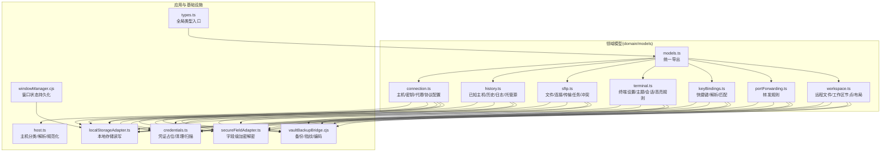
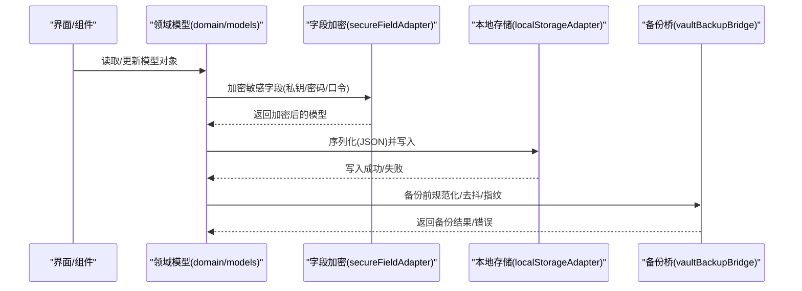
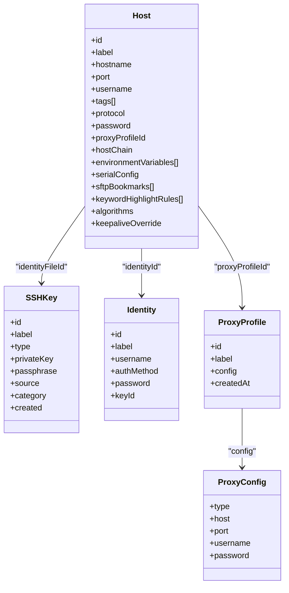
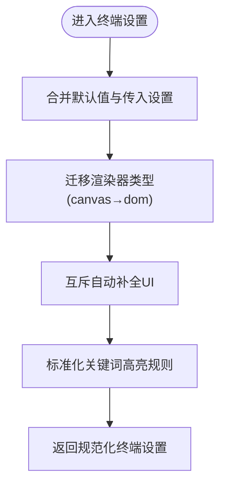
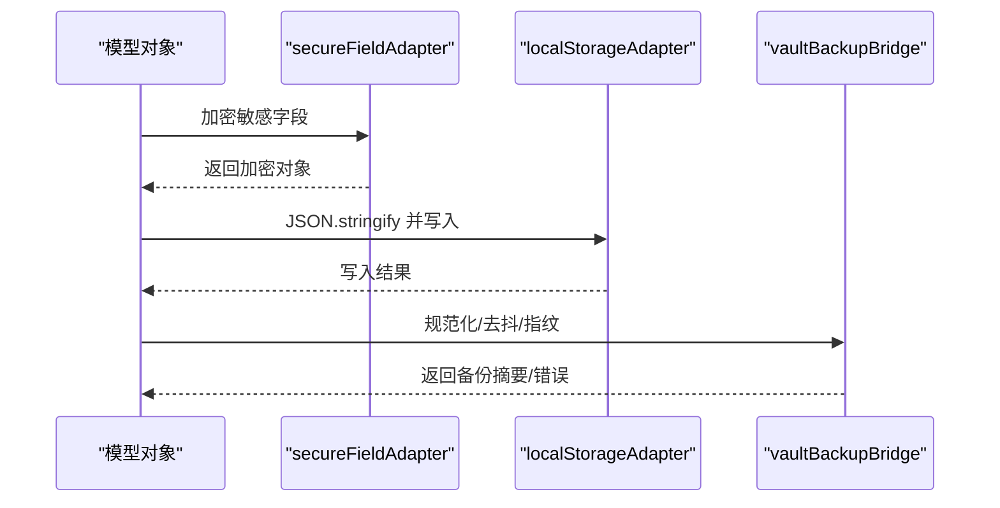
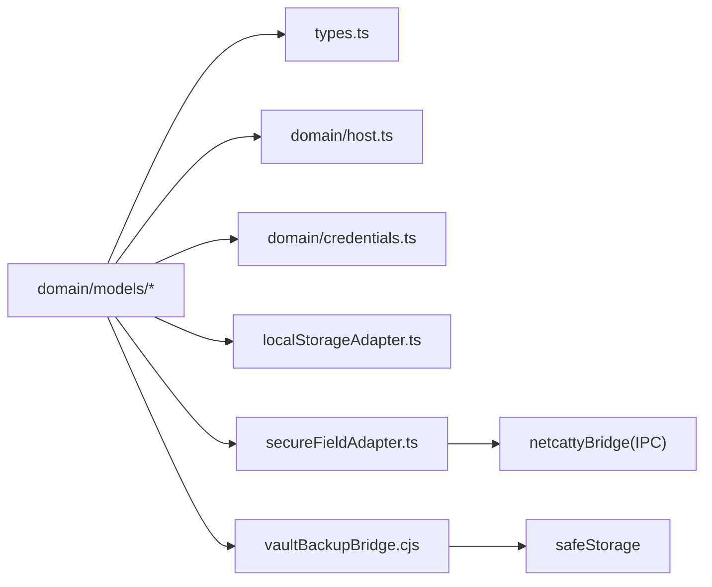

# 数据模型API

<cite>
**本文引用的文件**
- [domain/models.ts](file://domain/models.ts)
- [domain/models/connection.ts](file://domain/models/connection.ts)
- [domain/models/history.ts](file://domain/models/history.ts)
- [domain/models/sftp.ts](file://domain/models/sftp.ts)
- [domain/models/terminal.ts](file://domain/models/terminal.ts)
- [domain/models/keyBindings.ts](file://domain/models/keyBindings.ts)
- [domain/models/portForwarding.ts](file://domain/models/portForwarding.ts)
- [domain/models/workspace.ts](file://domain/models/workspace.ts)
- [domain/host.ts](file://domain/host.ts)
- [domain/credentials.ts](file://domain/credentials.ts)
- [infrastructure/persistence/localStorageAdapter.ts](file://infrastructure/persistence/localStorageAdapter.ts)
- [infrastructure/persistence/secureFieldAdapter.ts](file://infrastructure/persistence/secureFieldAdapter.ts)
- [electron/bridges/vaultBackupBridge.cjs](file://electron/bridges/vaultBackupBridge.cjs)
- [electron/bridges/windowManager.cjs](file://electron/bridges/windowManager.cjs)
- [types.ts](file://types.ts)
</cite>

## 目录
1. [简介](#简介)
2. [项目结构](#项目结构)
3. [核心组件](#核心组件)
4. [架构总览](#架构总览)
5. [详细组件分析](#详细组件分析)
6. [依赖分析](#依赖分析)
7. [性能考虑](#性能考虑)
8. [故障排查指南](#故障排查指南)
9. [结论](#结论)
10. [附录](#附录)

## 简介
本文件系统化梳理 Netcatty 的数据模型API，覆盖核心实体结构、字段语义与约束、实体间关系、序列化与加密、校验与业务规则、以及版本与迁移策略。目标是帮助开发者与集成者快速理解并正确使用数据模型，确保在连接管理、终端会话、SFTP传输、端口转发、工作区布局等场景中实现数据一致性与安全性。

## 项目结构
数据模型集中于 domain/models 目录，通过统一入口导出，供应用层与状态管理模块使用；同时配合基础设施层的持久化与安全适配器，完成本地存储、字段级加密与备份归档。

**图表来源**
- [domain/models.ts:1-8](file://domain/models.ts#L1-L8)
- [types.ts:1-1](file://types.ts#L1-L1)
- [domain/host.ts:1-265](file://domain/host.ts#L1-L265)
- [domain/credentials.ts:1-111](file://domain/credentials.ts#L1-L111)
- [infrastructure/persistence/localStorageAdapter.ts:1-107](file://infrastructure/persistence/localStorageAdapter.ts#L1-L107)
- [infrastructure/persistence/secureFieldAdapter.ts:1-241](file://infrastructure/persistence/secureFieldAdapter.ts#L1-L241)
- [electron/bridges/vaultBackupBridge.cjs:53-215](file://electron/bridges/vaultBackupBridge.cjs#L53-L215)
- [electron/bridges/windowManager.cjs:112-166](file://electron/bridges/windowManager.cjs#L112-L166)

**章节来源**
- [domain/models.ts:1-8](file://domain/models.ts#L1-L8)
- [types.ts:1-1](file://types.ts#L1-L1)

## 核心组件
本节概述各模型模块的核心职责与边界，便于快速定位与引用。

- 连接与主机：定义主机、密钥、身份、代理、算法覆盖、多协议配置、串口配置、SFTP书签等。
- 历史与日志：记录已知主机、命令历史、连接日志、托管源（如 SSH 配置）。
- 终端：终端外观与行为设置、主题、会话、关键字高亮规则与标准化流程。
- SFTP：文件条目、连接状态、传输任务、冲突处理。
- 键盘快捷键：快捷键方案、绑定、解析与匹配。
- 端口转发：转发类型、状态、自动启动、运行时状态。
- 工作区：远程文件、节点树（面板/分割）、视图模式与焦点会话。

**章节来源**
- [domain/models/connection.ts:1-283](file://domain/models/connection.ts#L1-L283)
- [domain/models/history.ts:1-57](file://domain/models/history.ts#L1-L57)
- [domain/models/terminal.ts:1-339](file://domain/models/terminal.ts#L1-L339)
- [domain/models/sftp.ts:1-79](file://domain/models/sftp.ts#L1-L79)
- [domain/models/keyBindings.ts:1-241](file://domain/models/keyBindings.ts#L1-L241)
- [domain/models/portForwarding.ts:1-25](file://domain/models/portForwarding.ts#L1-L25)
- [domain/models/workspace.ts:1-36](file://domain/models/workspace.ts#L1-L36)

## 架构总览
数据模型贯穿“模型定义—序列化—加密—持久化/备份—UI消费”的全链路。下图展示关键交互：

**图表来源**
- [domain/models/connection.ts:186-211](file://domain/models/connection.ts#L186-L211)
- [domain/models/history.ts:24-41](file://domain/models/history.ts#L24-L41)
- [domain/models/sftp.ts:32-61](file://domain/models/sftp.ts#L32-L61)
- [domain/models/terminal.ts:316-338](file://domain/models/terminal.ts#L316-L338)
- [domain/models/keyBindings.ts:1-241](file://domain/models/keyBindings.ts#L1-L241)
- [domain/models/portForwarding.ts:5-24](file://domain/models/portForwarding.ts#L5-L24)
- [domain/models/workspace.ts:27-35](file://domain/models/workspace.ts#L27-L35)
- [infrastructure/persistence/secureFieldAdapter.ts:22-34](file://infrastructure/persistence/secureFieldAdapter.ts#L22-L34)
- [infrastructure/persistence/localStorageAdapter.ts:70-106](file://infrastructure/persistence/localStorageAdapter.ts#L70-L106)
- [electron/bridges/vaultBackupBridge.cjs:53-215](file://electron/bridges/vaultBackupBridge.cjs#L53-L215)

## 详细组件分析

### 主机与密钥模型（Host/SSHKey/Identity/Proxy/算法）
- 关键实体
  - Host：主机标识、标签、主机名、端口、用户名、设备类型、认证方式、代理/跳板链、环境变量、字体/主题覆盖、串口配置、SFTP参数、关键字高亮、SSH算法覆盖、保活策略、本地shell等。
  - SSHKey：密钥类型、大小、私钥/公钥/证书、口令、来源与类别、创建时间、文件路径。
  - Identity：用户名与认证方式组合，支持密码/密钥/证书。
  - ProxyProfile/ProxyConfig：代理类型、主机、端口、可选凭据。
  - HostAlgorithmOverrides：按类别的算法覆盖（kex/cipher/hmac/serverHostKey/compress）。
- 字段约束与默认
  - Host.tags 默认为空数组；savePassword 默认为真；themeOverride/fontFamilyOverride/fontSizeOverride/fontWeightOverride 默认为假以继承全局；keepaliveOverride 默认关闭；serialConfig 的 dataBits/stopBits/parity/flowControl 有枚举与默认值；distroMode 支持 auto/manual。
  - SSHKey.keySize 对 RSA/ECDSA 有典型值；passphrase/savePassphrase 控制是否保存口令；category/source 定义密钥用途与来源。
  - Identity.authMethod 限定为 password/key/certificate。
- 关系映射
  - Host.identityId 引用 Identity.id；Host.identityFileId 引用 SSHKey.id；Host.proxyProfileId 引用 ProxyProfile.id；Host.managedSourceId 引用 ManagedSource.id。
  - GroupConfig 可继承 Host 的认证/代理/算法/环境变量等默认值。
- 序列化与转换
  - 使用 JSON 序列化；敏感字段通过 secureFieldAdapter 在持久化前加密。
- 校验与业务规则
  - sanitizeHost 清理 hostname、规范化 distro 与 distroMode，并迁移旧字体覆盖字段。
  - resolveHostKeepalive 支持主机级保活覆盖，避免特定设备误判断开。
  - resolveTelnetUsername/resolveTelnetPassword/resolveTelnetPort 提供 Telnet 参数解析与默认值。
- 版本与迁移
  - 模型内含大量“弃用字段”注释与新字段映射（如 hostChaining/proxy/proxyProfileId 等），用于向后兼容与平滑迁移。

**图表来源**
- [domain/models/connection.ts:84-179](file://domain/models/connection.ts#L84-L179)
- [domain/models/connection.ts:186-211](file://domain/models/connection.ts#L186-L211)
- [domain/models/connection.ts:17-23](file://domain/models/connection.ts#L17-L23)
- [domain/models/connection.ts:34-40](file://domain/models/connection.ts#L34-L40)

**章节来源**
- [domain/models/connection.ts:17-283](file://domain/models/connection.ts#L17-L283)
- [domain/host.ts:246-265](file://domain/host.ts#L246-L265)
- [domain/host.ts:151-198](file://domain/host.ts#L151-L198)

### 历史与日志模型（KnownHost/ShellHistoryEntry/ConnectionLog/ManagedSource）
- KnownHost：从系统 known_hosts 解析的主机条目，包含主机模式、端口、密钥类型、公钥/指纹、发现时间与最后出现时间。
- ShellHistoryEntry：命令历史，记录执行命令、宿主信息、会话ID与时间戳。
- ConnectionLog：连接日志，记录会话ID、主机信息、协议、起止时间、本地用户/主机、是否保存、终端数据与主题字号。
- ManagedSource：外部托管源（如 ~/.ssh/config），记录类型、文件路径、分组名、同步时间与文件哈希。
- 关系映射
  - ShellHistoryEntry.hostId/label 与 Host 关联；ConnectionLog.hostId/hostLabel 与 Host 关联；Host.managedSourceId 与 ManagedSource.id 关联。
- 校验与业务规则
  - ConnectionLog.endTime 可空表示活动会话；saved 标记收藏；terminalData 仅用于回放。
  - ManagedSource.lastSyncedAt 与 lastFileHash 用于增量同步判断。

**章节来源**
- [domain/models/history.ts:1-57](file://domain/models/history.ts#L1-L57)

### 终端模型（TerminalSettings/TerminalTheme/TerminalSession/KeywordHighlightRule）
- TerminalSettings：滚动缓冲、字体、光标、键盘、鼠标、关键词高亮、本地Shell、SSH保活、Mosh客户端路径、服务器统计显示、粘贴模式、清屏行为、剪贴板OSC-52、渲染器类型、自动补全等。
- TerminalTheme：主题ID、名称、明暗、颜色集。
- TerminalSession：会话ID、主机信息、状态、协议/端口覆盖、串口配置、本地Shell信息。
- KeywordHighlightRule：高亮规则ID、标签、正则模式、颜色、启用状态、自定义标记。
- 规范化与默认
  - normalizeTerminalSettings 合并默认值、迁移旧渲染器 canvas→dom、互斥自动补全UI、标准化高亮规则。
  - DEFAULT_TERMINAL_SETTINGS 提供完整默认集。
- 校验与业务规则
  - DEFAULT_KEYWORD_HIGHLIGHT_RULES 提供内置规则集合；normalizeKeywordHighlightRules 支持用户自定义保留与默认同步。

**图表来源**
- [domain/models/terminal.ts:208-231](file://domain/models/terminal.ts#L208-L231)
- [domain/models/terminal.ts:233-285](file://domain/models/terminal.ts#L233-L285)
- [domain/models/terminal.ts:159-206](file://domain/models/terminal.ts#L159-L206)

**章节来源**
- [domain/models/terminal.ts:23-339](file://domain/models/terminal.ts#L23-L339)

### SFTP 模型（SftpFileEntry/SftpConnection/TransferTask/FileConflict）
- SftpFileEntry：文件/目录/符号链接条目，包含名称、类型、大小、修改时间、权限、属主/组、链接目标、隐藏属性。
- SftpConnection：连接ID、主机信息、本地/远程、状态、当前路径、家目录。
- TransferTask：任务ID、批次ID、文件名、源/目标路径、方向、状态、字节数、速度、开始/结束时间、是否目录、子任务、父任务、冲突处理标志、可重试标志。
- FileConflict：冲突任务ID、文件名、路径、类型、现有/新尺寸与修改时间、冲突计数。
- 关系映射
  - TransferTask.sourceConnectionId/targetConnectionId 分别指向 SftpConnection.id；parentTaskId 指向父任务；childTasks 指向子任务。
- 校验与业务规则
  - TransferStatus/TransferDirection 枚举约束；progressMode 支持按字节或按文件；skipConflictCheck/repeatExistingTarget 控制冲突策略。

**章节来源**
- [domain/models/sftp.ts:1-79](file://domain/models/sftp.ts#L1-L79)

### 键盘快捷键模型（KeyBinding/CustomKeyBindings/解析与匹配）
- KeyBinding：动作ID、标签、mac/pc 平台键位、分类（tabs/terminal/navigation/app/sftp）。
- CustomKeyBindings：用户自定义覆盖映射。
- 解析与匹配
  - parseKeyCombo 将字符串解析为修饰键与主键；keyEventToString 将键盘事件转为平台键位字符串；matchesKeyBinding 判断事件是否匹配键位字符串，支持范围模式与箭头键映射。
- 默认快捷键集合 DEFAULT_KEY_BINDINGS 覆盖标签页、终端、导航、应用、SFTP等常用操作。

**章节来源**
- [domain/models/keyBindings.ts:1-241](file://domain/models/keyBindings.ts#L1-L241)

### 端口转发模型（PortForwardingRule）
- PortForwardingType：local/remote/dynamic。
- PortForwardingRule：规则ID、标签、类型、本地监听端口与绑定地址、远端主机/端口、隧道主机ID、自动启动、状态与错误、创建时间与最后使用时间。
- 校验与业务规则
  - 本地/远程转发需校验端口范围（1–65535）与远端主机/端口非空；hostId 指定隧道主机。

**章节来源**
- [domain/models/portForwarding.ts:1-25](file://domain/models/portForwarding.ts#L1-L25)

### 工作区模型（WorkspaceNode/Workspace）
- RemoteFile：远程文件/目录/符号链接元数据。
- WorkspaceNode：面板（pane）或分割（split）节点，支持水平/垂直方向与相对尺寸。
- Workspace：工作区ID、标题、根节点、视图模式（split/focus）、聚焦会话ID与焦点顺序、片段来源。
- 校验与业务规则
  - split 节点必须包含 children；sizes 与 children 数量一致；focus 模式下聚焦会话与顺序由用户维护。

**章节来源**
- [domain/models/workspace.ts:1-36](file://domain/models/workspace.ts#L1-L36)

### 数据序列化、反序列化与转换
- JSON 序列化
  - 所有模型均以 JSON 形式进行序列化与反序列化，便于跨进程与持久化。
- 字段级加密
  - secureFieldAdapter 提供 encryptField/decryptField 与批量加密/解密函数，对 Host/SSHKey/Identity/GroupConfig/ProxyProfile/ProviderConnection 中的敏感字段进行加密存储。
- 本地存储
  - localStorageAdapter 提供类型安全的读写接口，自动 JSON 序列化/反序列化，并处理 QuotaExceededError。
- 备份与指纹
  - vaultBackupBridge 对备份负载进行稳定化序列化（normalizePayloadForHash），计算指纹，支持安全存储编码/解码与大小限制。

**图表来源**
- [infrastructure/persistence/secureFieldAdapter.ts:22-34](file://infrastructure/persistence/secureFieldAdapter.ts#L22-L34)
- [infrastructure/persistence/localStorageAdapter.ts:70-106](file://infrastructure/persistence/localStorageAdapter.ts#L70-L106)
- [electron/bridges/vaultBackupBridge.cjs:53-215](file://electron/bridges/vaultBackupBridge.cjs#L53-L215)

**章节来源**
- [infrastructure/persistence/secureFieldAdapter.ts:1-241](file://infrastructure/persistence/secureFieldAdapter.ts#L1-L241)
- [infrastructure/persistence/localStorageAdapter.ts:1-107](file://infrastructure/persistence/localStorageAdapter.ts#L1-L107)
- [electron/bridges/vaultBackupBridge.cjs:53-215](file://electron/bridges/vaultBackupBridge.cjs#L53-L215)

### 数据校验规则、业务逻辑与数据完整性
- 凭证占位与清理
  - credentials.ts 提供 isEncryptedCredentialPlaceholder 与 sanitizeCredentialValue，防止将加密占位符作为真实密码提交。
  - findSyncPayloadEncryptedCredentialPaths 扫描同步负载中的加密占位路径，避免推送不可解密数据。
- 主机规范化
  - sanitizeHost 清洗 hostname，规范化 distro 与 distroMode，并迁移旧字体覆盖字段。
- 保活策略
  - resolveHostKeepalive 支持主机级覆盖，避免特定设备误判断开。
- 窗口状态持久化
  - windowManager.cjs 提供同步/异步窗口状态保存，带原子写入与队列去抖。

**章节来源**
- [domain/credentials.ts:1-111](file://domain/credentials.ts#L1-L111)
- [domain/host.ts:246-265](file://domain/host.ts#L246-L265)
- [electron/bridges/windowManager.cjs:112-166](file://electron/bridges/windowManager.cjs#L112-L166)

### 模型版本管理、迁移策略与向后兼容
- 弃用字段与新字段映射
  - Host 中存在大量“弃用”注释与新字段（如 hostChaining/proxy/proxyProfileId、envVars/environmentVariables、charset 等），用于向后兼容与平滑迁移。
- 默认值与规范化
  - TerminalSettings/KeywordHighlightRule/ProxyConfig 等通过默认值与标准化函数确保新旧版本差异下的稳定性。
- 备份指纹与去抖
  - vaultBackupBridge.normalizePayloadForHash 对顶层 syncedAt 进行零值处理以实现语义相等的负载去重，同时保留嵌套 syncedAt 的语义差异，避免误判。

**章节来源**
- [domain/models/connection.ts:107-179](file://domain/models/connection.ts#L107-L179)
- [domain/models/terminal.ts:208-231](file://domain/models/terminal.ts#L208-L231)
- [electron/bridges/vaultBackupBridge.cjs:53-83](file://electron/bridges/vaultBackupBridge.cjs#L53-L83)

## 依赖分析
- 模块耦合
  - domain/models.* 之间低耦合，通过明确的引用关系（如 Host→Identity/SSHKey/ProxyProfile）形成清晰边界。
  - 应用层通过 types.ts 统一导出，避免直接引用具体文件。
- 外部依赖
  - secureFieldAdapter 依赖 netcattyBridge 的 IPC 接口进行字段级加密。
  - vaultBackupBridge 依赖 safeStorage 的加密能力与文件系统写入。
- 循环依赖
  - 未见循环导入；模型文件仅相互引用类型，不引入运行时依赖。

**图表来源**
- [types.ts:1-1](file://types.ts#L1-L1)
- [domain/host.ts:1-265](file://domain/host.ts#L1-L265)
- [domain/credentials.ts:1-111](file://domain/credentials.ts#L1-L111)
- [infrastructure/persistence/localStorageAdapter.ts:1-107](file://infrastructure/persistence/localStorageAdapter.ts#L1-L107)
- [infrastructure/persistence/secureFieldAdapter.ts:1-241](file://infrastructure/persistence/secureFieldAdapter.ts#L1-L241)
- [electron/bridges/vaultBackupBridge.cjs:184-215](file://electron/bridges/vaultBackupBridge.cjs#L184-L215)

**章节来源**
- [types.ts:1-1](file://types.ts#L1-L1)

## 性能考虑
- JSON 序列化成本
  - 大型模型（如 SFTP 文件列表、传输任务）频繁序列化可能带来开销；建议批量写入与去抖（如 windowManager.cjs 的队列写入）。
- 字段级加密
  - 对敏感字段进行加密/解密会增加 CPU 开销；建议仅对必要字段加解密，并在 UI 层延迟解密。
- 备份指纹
  - normalizePayloadForHash 递归排序与过滤，避免重复备份；注意 payload 过大时的内存占用与哈希计算时间。

[本节为通用指导，无需列出具体文件来源]

## 故障排查指南
- 无法保存到本地存储
  - 检查 QuotaExceededError；查看 localStorageAdapter 的写入返回值与警告日志。
- 备份失败或无法读取
  - 确认平台安全存储可用；检查编码类型与解码流程；核对备份负载大小限制。
- 凭证未生效或被替换
  - 使用 sanitizeCredentialValue 清理加密占位符；通过 findSyncPayloadEncryptedCredentialPaths 扫描潜在问题字段。
- 窗口状态未持久化
  - 检查 saveWindowStateSync/saveWindowState 的返回值与异常日志；确认路径与权限。

**章节来源**
- [infrastructure/persistence/localStorageAdapter.ts:47-68](file://infrastructure/persistence/localStorageAdapter.ts#L47-L68)
- [electron/bridges/vaultBackupBridge.cjs:144-215](file://electron/bridges/vaultBackupBridge.cjs#L144-L215)
- [domain/credentials.ts:47-52](file://domain/credentials.ts#L47-L52)
- [electron/bridges/windowManager.cjs:112-166](file://electron/bridges/windowManager.cjs#L112-L166)

## 结论
本数据模型API以清晰的实体边界、严格的字段约束与默认值、完善的序列化与加密机制，支撑了连接管理、终端会话、SFTP传输、端口转发与工作区布局等核心功能。通过规范化流程与备份指纹策略，确保了跨版本兼容与数据一致性；通过凭证占位清理与保活策略，兼顾了安全性与可用性。建议在扩展新模型时遵循现有命名、约束与默认值约定，并配套完善序列化/加密与校验逻辑。

[本节为总结性内容，无需列出具体文件来源]

## 附录
- 使用示例与数据操作要点
  - 创建/更新 Host：设置必要字段（hostname/username），可选设置 proxyProfileId/identityId/serialConfig/sftpBookmarks 等；调用 sanitizeHost 规范化后再持久化。
  - 读取/写入终端设置：使用 normalizeTerminalSettings 合并默认值；通过 localStorageAdapter 进行类型安全读写。
  - SFTP 传输：构建 TransferTask 并根据状态推进；遇到冲突使用 FileConflictAction 决策。
  - 端口转发：校验端口范围与远端主机/端口；设置 autoStart 实现开机自启。
  - 工作区：根据 split/focus 模式组织 WorkspaceNode；维护聚焦会话顺序。
- 关键流程参考路径
  - [sanitizeHost:246-265](file://domain/host.ts#L246-L265)
  - [normalizeTerminalSettings:208-231](file://domain/models/terminal.ts#L208-L231)
  - [encryptHostSecrets/decryptHostSecrets:40-58](file://infrastructure/persistence/secureFieldAdapter.ts#L40-L58)
  - [saveWindowStateSync/saveWindowState:112-166](file://electron/bridges/windowManager.cjs#L112-L166)
  - [normalizePayloadForHash/stableStringify:53-76](file://electron/bridges/vaultBackupBridge.cjs#L53-L76)

[本节为补充说明，无需列出具体文件来源]