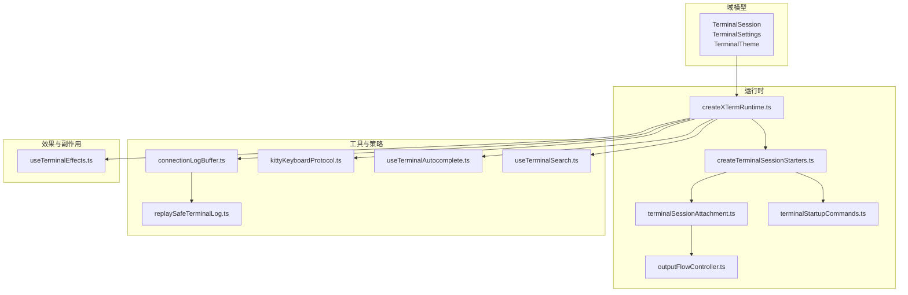
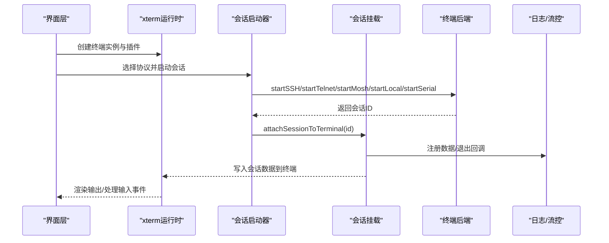
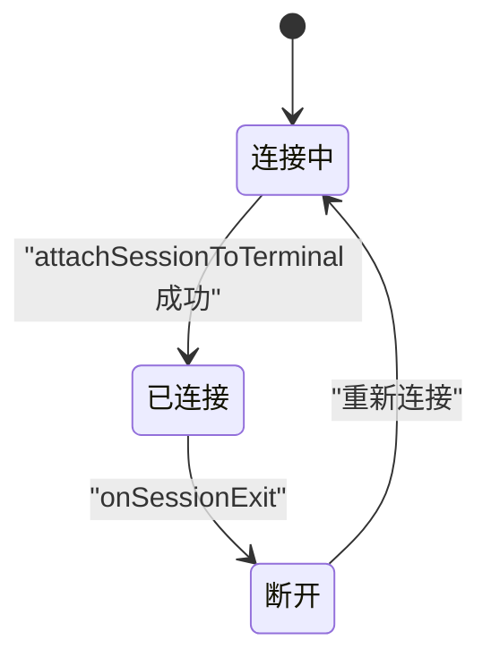
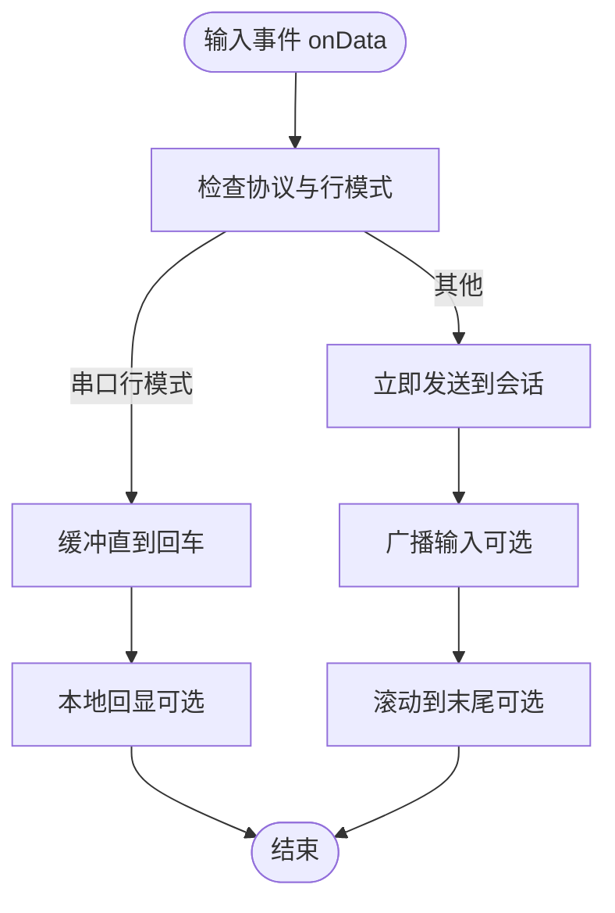
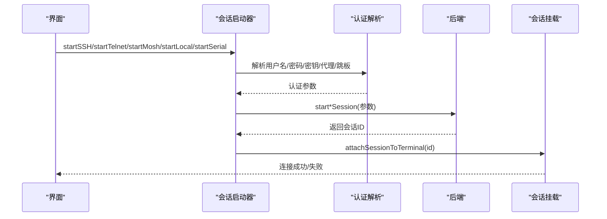
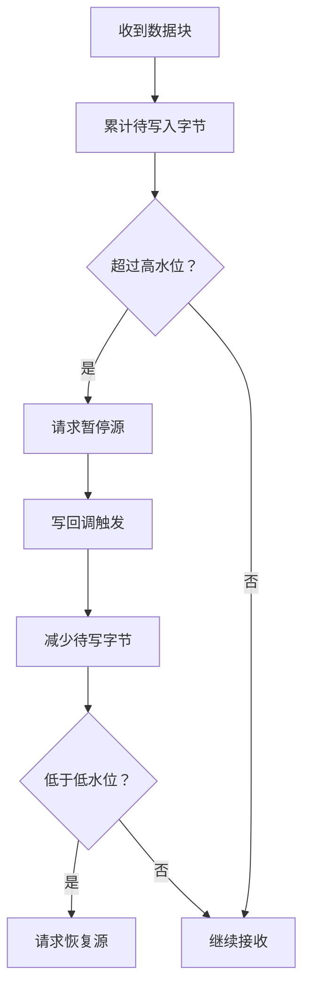
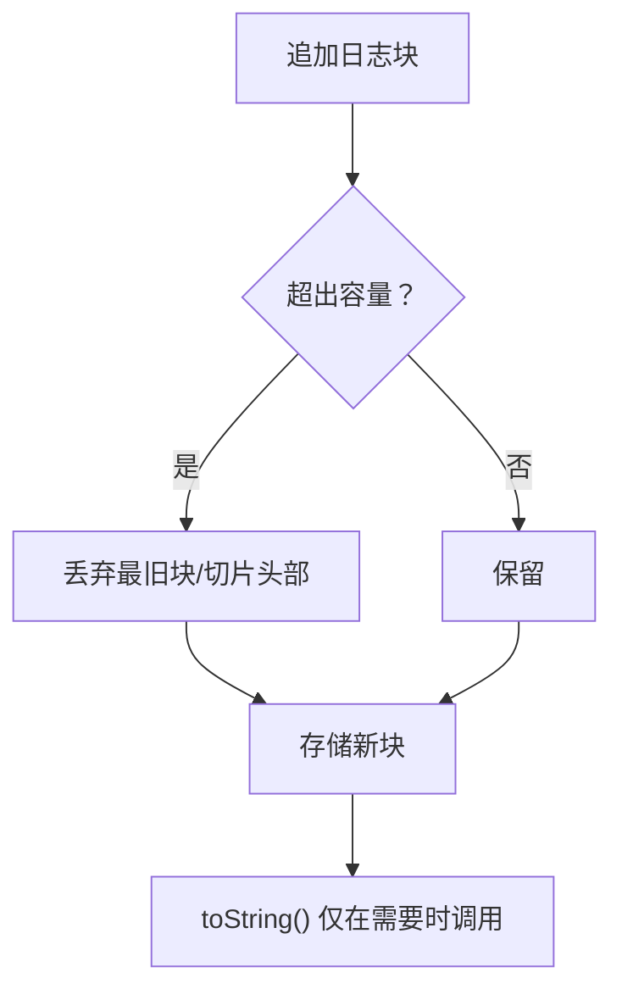
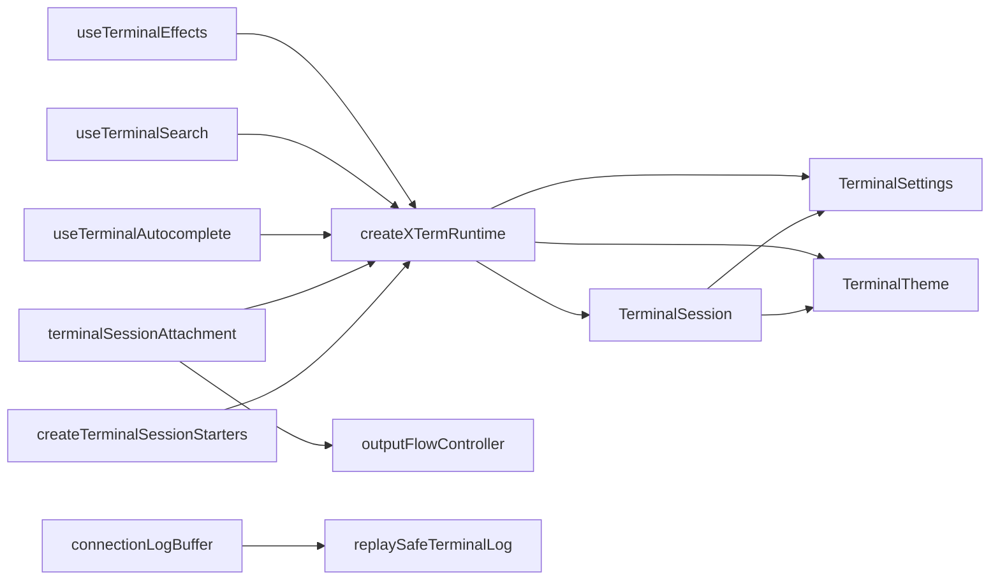

# 终端模型

<cite>
**本文档引用的文件**
- [domain/models/terminal.ts](file://domain/models/terminal.ts)
- [components/terminal/runtime/createTerminalSessionStarters.ts](file://components/terminal/runtime/createTerminalSessionStarters.ts)
- [components/terminal/runtime/createXTermRuntime.ts](file://components/terminal/runtime/createXTermRuntime.ts)
- [components/terminal/runtime/terminalSessionAttachment.ts](file://components/terminal/runtime/terminalSessionAttachment.ts)
- [components/terminal/runtime/outputFlowController.ts](file://components/terminal/runtime/outputFlowController.ts)
- [components/terminal/connectionLogBuffer.ts](file://components/terminal/connectionLogBuffer.ts)
- [components/terminal/replaySafeTerminalLog.ts](file://components/terminal/replaySafeTerminalLog.ts)
- [components/terminal/runtime/terminalStartupCommands.ts](file://components/terminal/runtime/terminalStartupCommands.ts)
- [components/terminal/runtime/terminalCommandExecution.ts](file://components/terminal/runtime/terminalCommandExecution.ts)
- [components/terminal/hooks/useTerminalSearch.ts](file://components/terminal/hooks/useTerminalSearch.ts)
- [components/terminal/runtime/kittyKeyboardProtocol.ts](file://components/terminal/runtime/kittyKeyboardProtocol.ts)
- [components/terminal/autocomplete/useTerminalAutocomplete.ts](file://components/terminal/autocomplete/useTerminalAutocomplete.ts)
- [components/terminal/useTerminalEffects.ts](file://components/terminal/useTerminalEffects.ts)
</cite>

## 目录
1. [简介](#简介)
2. [项目结构](#项目结构)
3. [核心组件](#核心组件)
4. [架构总览](#架构总览)
5. [详细组件分析](#详细组件分析)
6. [依赖关系分析](#依赖关系分析)
7. [性能考虑](#性能考虑)
8. [故障排查指南](#故障排查指南)
9. [结论](#结论)
10. [附录](#附录)

## 简介
本文件系统性梳理终端模型的API与实现，覆盖 TerminalSession 及相关终端实体的结构定义、会话生命周期与状态转换、配置参数（字体、颜色主题、光标、键盘映射等）、行为选项、性能优化与输出缓冲、日志与回放安全策略，以及与 AI 集成、自动完成、搜索等能力的接口规范。目标是为开发者提供从高层到代码级的完整参考。

## 项目结构
终端相关代码主要分布在以下模块：
- 域模型：定义终端会话、设置、主题与关键字高亮规则
- 运行时：创建 xterm 实例、协议启动器、会话挂载、输出流控、启动命令调度
- 工具与策略：连接日志缓冲、回放安全清洗、搜索、Kitty 键盘协议、自动完成钩子
- 效果与副作用：终端渲染、主题与字体更新、可见性与尺寸变化处理、粘贴与选择行为

**图示来源**
- [domain/models/terminal.ts:233-339](file://domain/models/terminal.ts#L233-L339)
- [components/terminal/runtime/createXTermRuntime.ts:195-998](file://components/terminal/runtime/createXTermRuntime.ts#L195-L998)
- [components/terminal/runtime/createTerminalSessionStarters.ts:32-873](file://components/terminal/runtime/createTerminalSessionStarters.ts#L32-L873)
- [components/terminal/runtime/terminalSessionAttachment.ts:17-249](file://components/terminal/runtime/terminalSessionAttachment.ts#L17-L249)
- [components/terminal/runtime/outputFlowController.ts:17-74](file://components/terminal/runtime/outputFlowController.ts#L17-L74)
- [components/terminal/connectionLogBuffer.ts:18-95](file://components/terminal/connectionLogBuffer.ts#L18-L95)
- [components/terminal/replaySafeTerminalLog.ts:16-428](file://components/terminal/replaySafeTerminalLog.ts#L16-L428)
- [components/terminal/runtime/terminalStartupCommands.ts:28-100](file://components/terminal/runtime/terminalStartupCommands.ts#L28-L100)
- [components/terminal/runtime/kittyKeyboardProtocol.ts:9-166](file://components/terminal/runtime/kittyKeyboardProtocol.ts#L9-L166)
- [components/terminal/autocomplete/useTerminalAutocomplete.ts:140-928](file://components/terminal/autocomplete/useTerminalAutocomplete.ts#L140-L928)
- [components/terminal/hooks/useTerminalSearch.ts:24-103](file://components/terminal/hooks/useTerminalSearch.ts#L24-L103)
- [components/terminal/useTerminalEffects.ts:5-749](file://components/terminal/useTerminalEffects.ts#L5-L749)

**章节来源**
- [domain/models/terminal.ts:233-339](file://domain/models/terminal.ts#L233-L339)
- [components/terminal/runtime/createXTermRuntime.ts:195-998](file://components/terminal/runtime/createXTermRuntime.ts#L195-L998)
- [components/terminal/runtime/createTerminalSessionStarters.ts:32-873](file://components/terminal/runtime/createTerminalSessionStarters.ts#L32-L873)
- [components/terminal/runtime/terminalSessionAttachment.ts:17-249](file://components/terminal/runtime/terminalSessionAttachment.ts#L17-L249)
- [components/terminal/runtime/outputFlowController.ts:17-74](file://components/terminal/runtime/outputFlowController.ts#L17-L74)
- [components/terminal/connectionLogBuffer.ts:18-95](file://components/terminal/connectionLogBuffer.ts#L18-L95)
- [components/terminal/replaySafeTerminalLog.ts:16-428](file://components/terminal/replaySafeTerminalLog.ts#L16-L428)
- [components/terminal/runtime/terminalStartupCommands.ts:28-100](file://components/terminal/runtime/terminalStartupCommands.ts#L28-L100)
- [components/terminal/runtime/kittyKeyboardProtocol.ts:9-166](file://components/terminal/runtime/kittyKeyboardProtocol.ts#L9-L166)
- [components/terminal/autocomplete/useTerminalAutocomplete.ts:140-928](file://components/terminal/autocomplete/useTerminalAutocomplete.ts#L140-L928)
- [components/terminal/hooks/useTerminalSearch.ts:24-103](file://components/terminal/hooks/useTerminalSearch.ts#L24-L103)
- [components/terminal/useTerminalEffects.ts:5-749](file://components/terminal/useTerminalEffects.ts#L5-L749)

## 核心组件
- TerminalSession：终端会话标识、主机信息、协议、状态、启动命令与本地 shell 配置
- TerminalSettings：渲染、字体、光标、可访问性、键盘、鼠标、关键字高亮、本地 shell、SSH/Mosh、服务器统计、粘贴、清屏行为、剪贴板 OSC-52、渲染器类型、自动完成等
- TerminalTheme：主题色板（背景、前景、光标、选择、16色）
- 关键字高亮规则：默认规则、用户自定义规则、规范化流程
- xterm 运行时：创建终端实例、加载插件、主题与字体应用、输入事件处理、粘贴与选择、搜索、链接点击、Kitty 键盘协议、串口本地回显与行模式
- 会话启动器：SSH/Telnet/Mosh/Local/Serial 启动、认证、代理、跳板、进度与错误处理、启动命令调度
- 输出流控：背压水位控制、暂停/恢复源、写入队列
- 日志与回放：连接日志缓冲、回放安全清洗、序列化与捕获
- 自动完成：提示检测、幽灵文本、弹出菜单、键盘交互、路径补全、子目录面板、实时预览
- 搜索：查找、匹配计数、装饰样式、前后查找
- 效果与副作用：主题与字体更新、可见性与尺寸变化、选中复制、鼠标跟踪、右键行为、焦点与自动滚动

**章节来源**
- [domain/models/terminal.ts:23-339](file://domain/models/terminal.ts#L23-L339)
- [components/terminal/runtime/createXTermRuntime.ts:69-150](file://components/terminal/runtime/createXTermRuntime.ts#L69-L150)
- [components/terminal/runtime/createTerminalSessionStarters.ts:32-873](file://components/terminal/runtime/createTerminalSessionStarters.ts#L32-L873)
- [components/terminal/runtime/terminalSessionAttachment.ts:17-249](file://components/terminal/runtime/terminalSessionAttachment.ts#L17-L249)
- [components/terminal/runtime/outputFlowController.ts:17-74](file://components/terminal/runtime/outputFlowController.ts#L17-L74)
- [components/terminal/connectionLogBuffer.ts:18-95](file://components/terminal/connectionLogBuffer.ts#L18-L95)
- [components/terminal/replaySafeTerminalLog.ts:16-428](file://components/terminal/replaySafeTerminalLog.ts#L16-L428)
- [components/terminal/autocomplete/useTerminalAutocomplete.ts:140-928](file://components/terminal/autocomplete/useTerminalAutocomplete.ts#L140-L928)
- [components/terminal/hooks/useTerminalSearch.ts:24-103](file://components/terminal/hooks/useTerminalSearch.ts#L24-L103)
- [components/terminal/useTerminalEffects.ts:5-749](file://components/terminal/useTerminalEffects.ts#L5-L749)

## 架构总览
终端模型围绕“会话”展开，从 UI 层触发，经由运行时创建 xterm 实例与插件，再通过会话启动器建立底层连接（SSH/Telnet/Mosh/Local/Serial），在连接建立后进行环境变量注入、窗口大小适配、启动命令调度、输出流控与日志记录。同时，自动完成、搜索、键盘协议与主题/字体更新贯穿整个生命周期。

**图示来源**
- [components/terminal/runtime/createXTermRuntime.ts:195-998](file://components/terminal/runtime/createXTermRuntime.ts#L195-L998)
- [components/terminal/runtime/createTerminalSessionStarters.ts:32-873](file://components/terminal/runtime/createTerminalSessionStarters.ts#L32-L873)
- [components/terminal/runtime/terminalSessionAttachment.ts:180-249](file://components/terminal/runtime/terminalSessionAttachment.ts#L180-L249)

## 详细组件分析

### TerminalSession 结构与生命周期
- 结构字段：会话标识、主机标识与标签、用户名/主机名、状态（连接中/已连接/断开）、工作区标识、启动命令、协议覆盖、端口、Mosh 开关、shell 类型、字符集、串口配置、本地 shell 及参数
- 生命周期：
  - 初始化：根据协议调用对应启动器（SSH/Telnet/Mosh/Local/Serial）
  - 连接中：显示进度与链路状态；多跳时逐跳上报
  - 已连接：适配终端尺寸、注册数据/退出回调、启动命令调度、记录命令执行
  - 断开：清理资源、记录退出消息、序列化终端数据用于捕获

**图示来源**
- [domain/models/terminal.ts:316-339](file://domain/models/terminal.ts#L316-L339)
- [components/terminal/runtime/terminalSessionAttachment.ts:180-249](file://components/terminal/runtime/terminalSessionAttachment.ts#L180-L249)
- [components/terminal/runtime/createTerminalSessionStarters.ts:32-873](file://components/terminal/runtime/createTerminalSessionStarters.ts#L32-L873)

**章节来源**
- [domain/models/terminal.ts:316-339](file://domain/models/terminal.ts#L316-L339)
- [components/terminal/runtime/terminalSessionAttachment.ts:180-249](file://components/terminal/runtime/terminalSessionAttachment.ts#L180-L249)
- [components/terminal/runtime/createTerminalSessionStarters.ts:32-873](file://components/terminal/runtime/createTerminalSessionStarters.ts#L32-L873)

### TerminalSettings 配置项与默认值
- 渲染与性能：滚动缓存、粗体亮色绘制、终端仿真类型、启动命令延迟、渲染器类型（自动/WebGL/DOM）
- 字体与排版：字体连字、常规/粗体字重、行间距、后备字体
- 光标：形状（块/条/下划线）、闪烁
- 可访问性：最小对比度
- 键盘：Option 作为 Meta、Option+左右词跳转、输入/输出/按键/粘贴滚动、平滑滚动
- 鼠标：右键行为（上下文菜单/粘贴/选词）、自动复制、中键粘贴、单词分隔符、链接修饰键
- 关键字高亮：开关、规则列表（默认规则、用户自定义、规范化）
- 本地 shell：默认 shell、起始目录
- SSH：保活间隔与最大次数、X11 显示、Mosh 客户端路径
- 服务器统计：显示开关、刷新间隔
- 粘贴：禁用方括号粘贴模式
- 清屏行为：POSIX 清屏是否清除滚动缓存
- 输入保留：输入不清理选择、强制提示换行
- 剪贴板：OSC-52 访问策略（关闭/只写/读写/提示）
- 自动完成：开关、幽灵文本、弹出菜单、去抖、最小字符、最大建议数

默认值集中于 DEFAULT_TERMINAL_SETTINGS，部分字段存在向后兼容迁移逻辑（如渲染器 canvas→dom）。

**章节来源**
- [domain/models/terminal.ts:23-339](file://domain/models/terminal.ts#L23-L339)

### TerminalTheme 主题与颜色
- 主题类型：深色/浅色
- 颜色字段：背景、前景、光标、选择、16 色（含亮色）
- xterm 主题应用：在运行时设置 term.options.theme，并同步滚动条样式

**章节来源**
- [domain/models/terminal.ts:287-314](file://domain/models/terminal.ts#L287-L314)
- [components/terminal/runtime/createXTermRuntime.ts:301-308](file://components/terminal/runtime/createXTermRuntime.ts#L301-L308)

### xterm 运行时与输入/输出处理
- 插件加载：Fit、Serialize、Search、Unicode Graphemes、WebLinks、WebGL（按性能配置）
- 主题与字体：字体族、字号、粗细、行高、对比度、平滑滚动、Alt 作为 Meta、单词分隔符、忽略方括号粘贴
- 输入事件：自定义键盘处理器，支持：
  - 自动完成事件拦截与透传
  - 快捷键动作（复制/粘贴/全选/清屏/搜索）
  - Kitty 键盘协议编码
  - Option+左右词跳转序列
  - 中键粘贴、广播输入、滚动到末尾
- 输出写入：写入队列、回放安全清洗、提示换行同步、粘贴残留清理、自动滚动
- 串口：行模式缓冲、本地回显、回车换行转换

**图示来源**
- [components/terminal/runtime/createXTermRuntime.ts:719-786](file://components/terminal/runtime/createXTermRuntime.ts#L719-L786)

**章节来源**
- [components/terminal/runtime/createXTermRuntime.ts:195-998](file://components/terminal/runtime/createXTermRuntime.ts#L195-L998)

### 会话启动器与协议栈
- SSH：构建 TERM 环境、解析认证（密码/密钥/代理/跳板）、保活、代理与算法覆盖、链路进度与错误处理、启动命令调度
- Telnet：用户名/密码解析、自动登录等待、代理限制、自动登录完成回调
- Mosh：代理与跳板限制、认证与密钥处理、启动命令调度
- Local/Serial：本地 shell 启动、串口配置与本地回显

**图示来源**
- [components/terminal/runtime/createTerminalSessionStarters.ts:32-873](file://components/terminal/runtime/createTerminalSessionStarters.ts#L32-L873)
- [components/terminal/runtime/terminalSessionAttachment.ts:180-249](file://components/terminal/runtime/terminalSessionAttachment.ts#L180-L249)

**章节来源**
- [components/terminal/runtime/createTerminalSessionStarters.ts:32-873](file://components/terminal/runtime/createTerminalSessionStarters.ts#L32-L873)
- [components/terminal/runtime/terminalSessionAttachment.ts:17-249](file://components/terminal/runtime/terminalSessionAttachment.ts#L17-L249)

### 输出流控与性能优化
- 水位控制：高水位暂停源、低水位恢复，避免无界增长导致 UI 卡顿
- 写入队列：串行化写入，保证顺序与稳定性
- 性能配置：基于平台/设备内存/渲染器类型动态选择渲染策略

**图示来源**
- [components/terminal/runtime/outputFlowController.ts:17-74](file://components/terminal/runtime/outputFlowController.ts#L17-L74)
- [components/terminal/runtime/terminalSessionAttachment.ts:95-118](file://components/terminal/runtime/terminalSessionAttachment.ts#L95-L118)

**章节来源**
- [components/terminal/runtime/outputFlowController.ts:17-74](file://components/terminal/runtime/outputFlowController.ts#L17-L74)
- [components/terminal/runtime/terminalSessionAttachment.ts:95-118](file://components/terminal/runtime/terminalSessionAttachment.ts#L95-L118)

### 日志记录与回放安全
- 连接日志缓冲：固定块大小的追加缓冲，达到容量上限时丢弃最旧块，保持内存与修剪复杂度可控
- 回放安全清洗：识别并保护清屏/擦除序列，避免回放时覆盖历史；处理光标状态与替代屏切换

**图示来源**
- [components/terminal/connectionLogBuffer.ts:18-95](file://components/terminal/connectionLogBuffer.ts#L18-L95)
- [components/terminal/replaySafeTerminalLog.ts:150-428](file://components/terminal/replaySafeTerminalLog.ts#L150-L428)

**章节来源**
- [components/terminal/connectionLogBuffer.ts:18-95](file://components/terminal/connectionLogBuffer.ts#L18-L95)
- [components/terminal/replaySafeTerminalLog.ts:150-428](file://components/terminal/replaySafeTerminalLog.ts#L150-L428)

### 启动命令与命令执行记录
- 启动命令：拆分行、延迟调度、逐行发送、标记提示换行、记录执行
- 命令执行：对齐提示符、判断是否应记录历史、外部命令协调

**章节来源**
- [components/terminal/runtime/terminalStartupCommands.ts:28-100](file://components/terminal/runtime/terminalStartupCommands.ts#L28-L100)
- [components/terminal/runtime/terminalCommandExecution.ts:14-58](file://components/terminal/runtime/terminalCommandExecution.ts#L14-L58)

### 搜索功能
- 使用 xterm SearchAddon，支持正则/大小写/整词匹配与装饰样式
- 提供打开/关闭、查找下一个/上一个、清除装饰与焦点管理

**章节来源**
- [components/terminal/hooks/useTerminalSearch.ts:24-103](file://components/terminal/hooks/useTerminalSearch.ts#L24-L103)

### 键盘映射与 Kitty 协议
- 支持 Kitty 键盘协议标志与模式栈，生成 ESC 序列以兼容现代 TUI
- 在运行时根据模式状态编码控制键事件

**章节来源**
- [components/terminal/runtime/kittyKeyboardProtocol.ts:9-166](file://components/terminal/runtime/kittyKeyboardProtocol.ts#L9-L166)
- [components/terminal/runtime/createXTermRuntime.ts:644-659](file://components/terminal/runtime/createXTermRuntime.ts#L644-L659)

### 自动完成与 AI 集成
- 提示检测：对齐当前行与用户输入，排除主题干扰
- 幽灵文本：基于策略决定显示/隐藏与稳定预测
- 弹出菜单：位置计算、子目录面板、实时预览、路径补全
- 键盘交互：接受/导航/关闭、子目录展开与选择
- 与 AI 的集成：通过 onAcceptText/onAcceptSnippet 将建议或片段写入会话，结合命令历史记录

**章节来源**
- [components/terminal/autocomplete/useTerminalAutocomplete.ts:140-928](file://components/terminal/autocomplete/useTerminalAutocomplete.ts#L140-L928)

### 效果与副作用（主题/字体/可见性/尺寸）
- 主题与字体：布局前同步主题，字体变更时清理 WebGL 纹理图集并重测量
- 可见性：标签页切换恢复时清理纹理图集并强制重绘
- 尺寸：ResizeObserver 监听容器尺寸变化，延迟适配并保持滚动位置
- 选中复制、鼠标跟踪、右键行为、自动聚焦

**章节来源**
- [components/terminal/useTerminalEffects.ts:5-749](file://components/terminal/useTerminalEffects.ts#L5-L749)

## 依赖关系分析
- TerminalSession 依赖 TerminalSettings 与 TerminalTheme
- 运行时依赖 xterm 与插件，受 TerminalSettings 影响
- 会话启动器依赖后端桥接与认证解析
- 附件与流控依赖运行时与后端
- 日志缓冲与回放清洗独立于运行时但被使用
- 自动完成与搜索依赖运行时与后端能力

**图示来源**
- [domain/models/terminal.ts:23-339](file://domain/models/terminal.ts#L23-L339)
- [components/terminal/runtime/createXTermRuntime.ts:195-998](file://components/terminal/runtime/createXTermRuntime.ts#L195-L998)
- [components/terminal/runtime/createTerminalSessionStarters.ts:32-873](file://components/terminal/runtime/createTerminalSessionStarters.ts#L32-L873)
- [components/terminal/runtime/terminalSessionAttachment.ts:17-249](file://components/terminal/runtime/terminalSessionAttachment.ts#L17-L249)
- [components/terminal/runtime/outputFlowController.ts:17-74](file://components/terminal/runtime/outputFlowController.ts#L17-L74)
- [components/terminal/connectionLogBuffer.ts:18-95](file://components/terminal/connectionLogBuffer.ts#L18-L95)
- [components/terminal/replaySafeTerminalLog.ts:150-428](file://components/terminal/replaySafeTerminalLog.ts#L150-L428)
- [components/terminal/autocomplete/useTerminalAutocomplete.ts:140-928](file://components/terminal/autocomplete/useTerminalAutocomplete.ts#L140-L928)
- [components/terminal/hooks/useTerminalSearch.ts:24-103](file://components/terminal/hooks/useTerminalSearch.ts#L24-L103)
- [components/terminal/useTerminalEffects.ts:5-749](file://components/terminal/useTerminalEffects.ts#L5-L749)

**章节来源**
- [domain/models/terminal.ts:23-339](file://domain/models/terminal.ts#L23-L339)
- [components/terminal/runtime/createXTermRuntime.ts:195-998](file://components/terminal/runtime/createXTermRuntime.ts#L195-L998)
- [components/terminal/runtime/createTerminalSessionStarters.ts:32-873](file://components/terminal/runtime/createTerminalSessionStarters.ts#L32-L873)
- [components/terminal/runtime/terminalSessionAttachment.ts:17-249](file://components/terminal/runtime/terminalSessionAttachment.ts#L17-L249)
- [components/terminal/runtime/outputFlowController.ts:17-74](file://components/terminal/runtime/outputFlowController.ts#L17-L74)
- [components/terminal/connectionLogBuffer.ts:18-95](file://components/terminal/connectionLogBuffer.ts#L18-L95)
- [components/terminal/replaySafeTerminalLog.ts:150-428](file://components/terminal/replaySafeTerminalLog.ts#L150-L428)
- [components/terminal/autocomplete/useTerminalAutocomplete.ts:140-928](file://components/terminal/autocomplete/useTerminalAutocomplete.ts#L140-L928)
- [components/terminal/hooks/useTerminalSearch.ts:24-103](file://components/terminal/hooks/useTerminalSearch.ts#L24-L103)
- [components/terminal/useTerminalEffects.ts:5-749](file://components/terminal/useTerminalEffects.ts#L5-L749)

## 性能考虑
- 渲染器选择：自动/Canvas/DOM，Canvas 已移除，Canvas→DOM 兼容迁移
- WebGL 抖动修复：设备像素比变化时清理纹理图集并强制重绘
- 字体与粗细：字体加载完成后重测量并修正粗细权重
- 输出流控：高/低水位暂停/恢复，避免 UI 卡顿
- 滚动缓存：0 映射为大值以避免滚轮异常
- 平滑滚动：按设置启用，减少瞬跳
- 串口行模式：LF→CRLF 转换避免阶梯效应

[本节为通用指导，无需特定文件引用]

## 故障排查指南
- 连接超时：连接阶段定时器与进度条，超时自动断开并记录
- 认证失败：提示重新输入凭据，区分密码/密钥不可用场景
- 代理/跳板问题：缺失代理或跳板配置时阻断并提示修复
- Telnet 限制：不支持代理与自动登录等待，需改用 SSH
- Mosh 限制：不支持代理与跳板链
- 日志捕获：卸载时序列化终端内容，失败记录警告
- WebGL 问题：上下文丢失时清理并降级渲染

**章节来源**
- [components/terminal/runtime/createTerminalSessionStarters.ts:32-873](file://components/terminal/runtime/createTerminalSessionStarters.ts#L32-L873)
- [components/terminal/runtime/terminalSessionAttachment.ts:223-249](file://components/terminal/runtime/terminalSessionAttachment.ts#L223-L249)
- [components/terminal/runtime/createXTermRuntime.ts:376-387](file://components/terminal/runtime/createXTermRuntime.ts#L376-L387)

## 结论
终端模型通过清晰的域模型与运行时解耦，实现了跨协议的统一接入、完善的性能与体验保障（流控、渲染器选择、字体/主题动态更新、搜索与自动完成），并提供了安全的日志与回放能力。其 API 设计兼顾易用性与扩展性，适合在多协议、多主题、多插件场景下稳定运行。

## 附录
- 关键 API 路径
  - TerminalSession 定义：[domain/models/terminal.ts:316-339](file://domain/models/terminal.ts#L316-L339)
  - TerminalSettings 默认值与规范化：[domain/models/terminal.ts:233-339](file://domain/models/terminal.ts#L233-L339)
  - xterm 运行时创建与事件处理：[components/terminal/runtime/createXTermRuntime.ts:195-998](file://components/terminal/runtime/createXTermRuntime.ts#L195-L998)
  - 会话启动器（SSH/Telnet/Mosh/Local/Serial）：[components/terminal/runtime/createTerminalSessionStarters.ts:32-873](file://components/terminal/runtime/createTerminalSessionStarters.ts#L32-L873)
  - 会话挂载与输出流控：[components/terminal/runtime/terminalSessionAttachment.ts:17-249](file://components/terminal/runtime/terminalSessionAttachment.ts#L17-L249)
  - 输出流控控制器：[components/terminal/runtime/outputFlowController.ts:17-74](file://components/terminal/runtime/outputFlowController.ts#L17-L74)
  - 连接日志缓冲：[components/terminal/connectionLogBuffer.ts:18-95](file://components/terminal/connectionLogBuffer.ts#L18-L95)
  - 回放安全清洗：[components/terminal/replaySafeTerminalLog.ts:150-428](file://components/terminal/replaySafeTerminalLog.ts#L150-L428)
  - 启动命令调度：[components/terminal/runtime/terminalStartupCommands.ts:28-100](file://components/terminal/runtime/terminalStartupCommands.ts#L28-L100)
  - 命令执行记录：[components/terminal/runtime/terminalCommandExecution.ts:14-58](file://components/terminal/runtime/terminalCommandExecution.ts#L14-L58)
  - 搜索功能：[components/terminal/hooks/useTerminalSearch.ts:24-103](file://components/terminal/hooks/useTerminalSearch.ts#L24-L103)
  - Kitty 键盘协议：[components/terminal/runtime/kittyKeyboardProtocol.ts:9-166](file://components/terminal/runtime/kittyKeyboardProtocol.ts#L9-L166)
  - 自动完成钩子：[components/terminal/autocomplete/useTerminalAutocomplete.ts:140-928](file://components/terminal/autocomplete/useTerminalAutocomplete.ts#L140-L928)
  - 效果与副作用：[components/terminal/useTerminalEffects.ts:5-749](file://components/terminal/useTerminalEffects.ts#L5-L749)