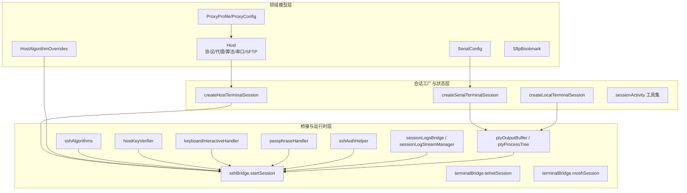
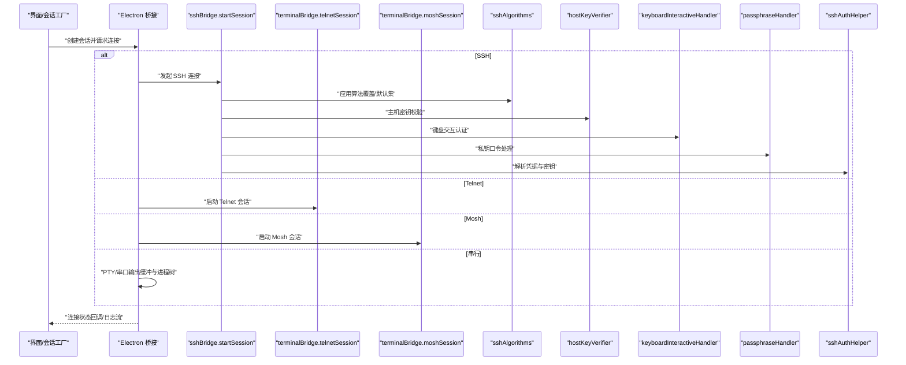
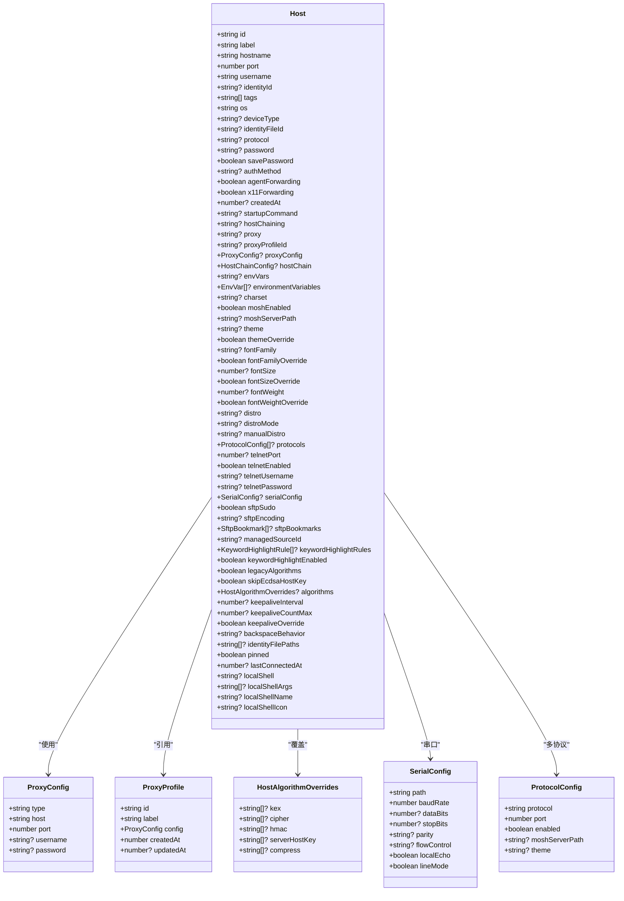
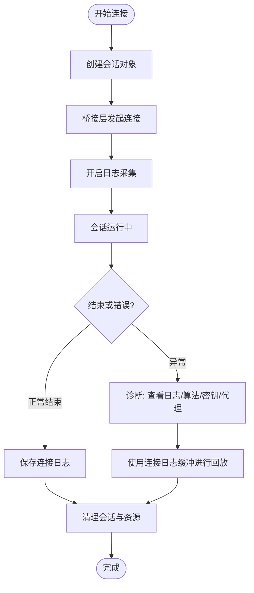
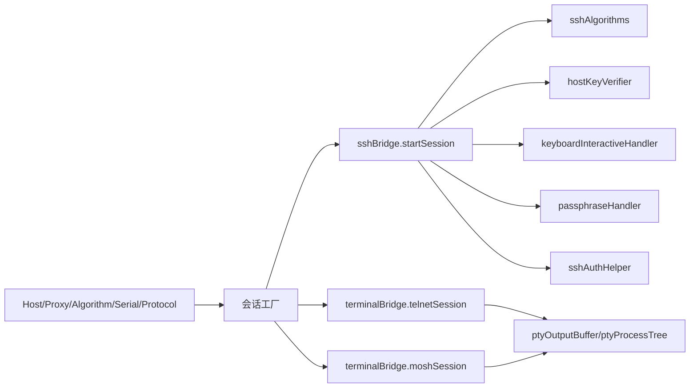

# 连接模型

<cite>
**本文引用的文件**
- [domain/models/connection.ts](file://domain/models/connection.ts)
- [domain/host.ts](file://domain/host.ts)
- [domain/sshAuth.ts](file://domain/sshAuth.ts)
- [domain/proxyProfiles.ts](file://domain/proxyProfiles.ts)
- [domain/sshAlgorithmList.ts](file://domain/sshAlgorithmList.ts)
- [domain/models/history.ts](file://domain/models/history.ts)
- [domain/connectionLog.ts](file://domain/connectionLog.ts)
- [domain/quickConnect.ts](file://domain/quickConnect.ts)
- [application/state/sessionFactories.ts](file://application/state/sessionFactories.ts)
- [application/state/sessionActivity.ts](file://application/state/sessionActivity.ts)
- [components/terminal/connectionLogBuffer.ts](file://components/terminal/connectionLogBuffer.ts)
- [components/terminal/runtime/createTerminalSessionStarters.ts](file://components/terminal/runtime/createTerminalSessionStarters.ts)
- [components/terminal/runtime/createTerminalSessionStarters.mosh.test.ts](file://components/terminal/runtime/createTerminalSessionStarters.mosh.test.ts)
- [components/terminal/runtime/createTerminalSessionStarters.telnet.test.ts](file://components/terminal/runtime/createTerminalSessionStarters.telnet.test.ts)
- [components/terminal/runtime/createTerminalSessionStarters.types.ts](file://components/terminal/runtime/createTerminalSessionStarters.types.ts)
- [electron/bridges/sshBridge/startSession.cjs](file://electron/bridges/sshBridge/startSession.cjs)
- [electron/bridges/terminalBridge/moshSession.cjs](file://electron/bridges/terminalBridge/moshSession.cjs)
- [electron/bridges/terminalBridge/telnetSession.cjs](file://electron/bridges/terminalBridge/telnetSession.cjs)
- [electron/bridges/sshAlgorithms.cjs](file://electron/bridges/sshAlgorithms.cjs)
- [electron/bridges/hostKeyVerifier.cjs](file://electron/bridges/hostKeyVerifier.cjs)
- [electron/bridges/keyboardInteractiveHandler.cjs](file://electron/bridges/keyboardInteractiveHandler.cjs)
- [electron/bridges/passphraseHandler.cjs](file://electron/bridges/passphraseHandler.cjs)
- [electron/bridges/sshAuthHelper.cjs](file://electron/bridges/sshAuthHelper.cjs)
- [electron/bridges/tcpNoDelay.cjs](file://electron/bridges/tcpNoDelay.cjs)
- [electron/bridges/portForwardingBridge.cjs](file://electron/bridges/portForwardingBridge.cjs)
- [electron/bridges/sessionLogsBridge.cjs](file://electron/bridges/sessionLogsBridge.cjs)
- [electron/bridges/sessionLogStreamManager.cjs](file://electron/bridges/sessionLogStreamManager.cjs)
- [electron/bridges/ptyOutputBuffer.cjs](file://electron/bridges/ptyOutputBuffer.cjs)
- [electron/bridges/ptyProcessTree.cjs](file://electron/bridges/ptyProcessTree.cjs)
- [electron/bridges/zmodemHelper.cjs](file://electron/bridges/zmodemHelper.cjs)
</cite>

## 目录
1. [简介](#简介)
2. [项目结构](#项目结构)
3. [核心组件](#核心组件)
4. [架构总览](#架构总览)
5. [详细组件分析](#详细组件分析)
6. [依赖关系分析](#依赖关系分析)
7. [性能考量](#性能考量)
8. [故障排查指南](#故障排查指南)
9. [结论](#结论)
10. [附录](#附录)

## 简介
本文件系统性梳理 Netcatty 的“连接模型”API，覆盖 SSH、Telnet、Mosh、串行（Serial）与本地（Local）五类连接的模型定义、参数校验、协议特定配置、安全设置、状态管理、重连与超时、代理与算法协商、认证流程、连接测试与健康检查、日志与诊断、连接池与资源清理、以及快速连接、连接历史与最近使用等能力。目标是为开发者与运维人员提供可操作、可扩展、可审计的连接层规范。

## 项目结构
连接模型由三层构成：
- 领域模型层：定义主机、协议、代理、算法、序列端口、SFTP 书签等数据结构与默认值。
- 会话工厂与状态层：负责从主机或直接输入生成会话对象，维护会话活动与工作区映射。
- 桥接与运行时层：在 Electron 主进程侧实现 SSH/Telnet/Mosh/串行等连接启动、算法协商、密钥与口令处理、日志采集与回放等。

图表来源
- [domain/models/connection.ts:84-179](file://domain/models/connection.ts#L84-L179)
- [domain/models/connection.ts:9-23](file://domain/models/connection.ts#L9-L23)
- [domain/models/connection.ts:34-40](file://domain/models/connection.ts#L34-L40)
- [domain/models/connection.ts:55-64](file://domain/models/connection.ts#L55-L64)
- [domain/models/connection.ts:77-82](file://domain/models/connection.ts#L77-L82)
- [application/state/sessionFactories.ts:48-89](file://application/state/sessionFactories.ts#L48-L89)
- [application/state/sessionFactories.ts:29-46](file://application/state/sessionFactories.ts#L29-L46)
- [application/state/sessionFactories.ts:11-27](file://application/state/sessionFactories.ts#L11-L27)
- [application/state/sessionActivity.ts:1-47](file://application/state/sessionActivity.ts#L1-L47)
- [electron/bridges/sshBridge/startSession.cjs](file://electron/bridges/sshBridge/startSession.cjs)
- [electron/bridges/terminalBridge/telnetSession.cjs](file://electron/bridges/terminalBridge/telnetSession.cjs)
- [electron/bridges/terminalBridge/moshSession.cjs](file://electron/bridges/terminalBridge/moshSession.cjs)
- [electron/bridges/sshAlgorithms.cjs](file://electron/bridges/sshAlgorithms.cjs)
- [electron/bridges/hostKeyVerifier.cjs](file://electron/bridges/hostKeyVerifier.cjs)
- [electron/bridges/keyboardInteractiveHandler.cjs](file://electron/bridges/keyboardInteractiveHandler.cjs)
- [electron/bridges/passphraseHandler.cjs](file://electron/bridges/passphraseHandler.cjs)
- [electron/bridges/sshAuthHelper.cjs](file://electron/bridges/sshAuthHelper.cjs)
- [electron/bridges/sessionLogsBridge.cjs](file://electron/bridges/sessionLogsBridge.cjs)
- [electron/bridges/sessionLogStreamManager.cjs](file://electron/bridges/sessionLogStreamManager.cjs)
- [electron/bridges/ptyOutputBuffer.cjs](file://electron/bridges/ptyOutputBuffer.cjs)
- [electron/bridges/ptyProcessTree.cjs](file://electron/bridges/ptyProcessTree.cjs)

章节来源
- [domain/models/connection.ts:1-283](file://domain/models/connection.ts#L1-L283)
- [application/state/sessionFactories.ts:1-90](file://application/state/sessionFactories.ts#L1-L90)
- [application/state/sessionActivity.ts:1-47](file://application/state/sessionActivity.ts#L1-L47)

## 核心组件
- 主机模型（Host）
  - 支持多协议：ssh、telnet、mosh、local、serial；支持主协议与多协议配置数组。
  - 代理：支持结构化 ProxyConfig 与 ProxyProfile 引用；兼容旧字段（proxy、hostChaining）。
  - 算法：支持全局与主机级算法覆盖（kex/cipher/hmac/serverHostKey/compress），并提供“遗留模式”兼容列表。
  - 串口：SerialConfig 定义路径、波特率、数据位、停止位、奇偶校验、流控、本地回显与行模式。
  - SFTP：sudo、编码、书签；支持按主机的字体/主题覆盖。
  - 其他：启动命令、键盘交互、字符集、设备类型（网络设备）、关键字高亮、SSH keepalive 覆盖、后退键行为、本地 shell 等。
- 认证与身份（Identity/SSHKey/resolveHostAuth）
  - 支持 password/key/certificate 三种方法；优先级可被显式覆盖；支持从 Host/Identity/Key 推导用户名与密钥文件路径。
- 代理配置（ProxyProfile/ProxyConfig）
  - 校验 host/port/username/password；支持从 Profile 注入到 Host；移除引用时自动清理。
- 快速连接（parseQuickConnectInput）
  - 解析 user@host[:port] 与 ssh 命令行风格输入，返回目标信息与警告清单。
- 会话工厂（createHostTerminalSession/createSerialTerminalSession/createLocalTerminalSession）
  - 将 Host 或 SerialConfig 映射为 TerminalSession，统一状态为 connecting，并携带协议、端口、串口配置、字符集等。
- 会话活动（sessionActivity）
  - 维护活动会话集合、清理非活跃会话、构建工作区活动映射。

章节来源
- [domain/models/connection.ts:84-179](file://domain/models/connection.ts#L84-L179)
- [domain/sshAuth.ts:44-103](file://domain/sshAuth.ts#L44-L103)
- [domain/proxyProfiles.ts:33-77](file://domain/proxyProfiles.ts#L33-L77)
- [domain/quickConnect.ts:282-299](file://domain/quickConnect.ts#L282-L299)
- [application/state/sessionFactories.ts:48-89](file://application/state/sessionFactories.ts#L48-L89)
- [application/state/sessionActivity.ts:5-46](file://application/state/sessionActivity.ts#L5-L46)

## 架构总览
下图展示从用户输入到连接建立的关键调用链，涵盖 SSH/Telnet/Mosh/串行四类协议的启动入口与关键桥接模块。

图表来源
- [application/state/sessionFactories.ts:48-89](file://application/state/sessionFactories.ts#L48-L89)
- [electron/bridges/sshBridge/startSession.cjs](file://electron/bridges/sshBridge/startSession.cjs)
- [electron/bridges/terminalBridge/telnetSession.cjs](file://electron/bridges/terminalBridge/telnetSession.cjs)
- [electron/bridges/terminalBridge/moshSession.cjs](file://electron/bridges/terminalBridge/moshSession.cjs)
- [electron/bridges/sshAlgorithms.cjs](file://electron/bridges/sshAlgorithms.cjs)
- [electron/bridges/hostKeyVerifier.cjs](file://electron/bridges/hostKeyVerifier.cjs)
- [electron/bridges/keyboardInteractiveHandler.cjs](file://electron/bridges/keyboardInteractiveHandler.cjs)
- [electron/bridges/passphraseHandler.cjs](file://electron/bridges/passphraseHandler.cjs)
- [electron/bridges/sshAuthHelper.cjs](file://electron/bridges/sshAuthHelper.cjs)
- [electron/bridges/ptyOutputBuffer.cjs](file://electron/bridges/ptyOutputBuffer.cjs)
- [electron/bridges/ptyProcessTree.cjs](file://electron/bridges/ptyProcessTree.cjs)

## 详细组件分析

### SSH 连接模型与参数校验
- 协议与端口
  - Host.protocol 可选 ssh/telnet/mosh/local/serial；多协议数组 protocols 提供每协议独立端口与启用状态。
- 代理与跳板
  - 支持 ProxyConfig 结构化代理；ProxyProfile 引用；HostChainConfig 支持多跳主机链。
- 算法协商
  - HostAlgorithmOverrides 支持 kex/cipher/hmac/serverHostKey/compress 的主机级覆盖；legacyAlgorithms 与 skipEcdsaHostKey 提供兼容性开关；effectiveDefaultAlgorithms 返回当前生效的默认算法集。
- 安全与认证
  - 支持 password/key/certificate；resolveHostAuth 严格尊重用户显式选择；resolveBridgeKeyAuth 输出桥接可用的私钥/身份文件路径/口令。
- 字体/主题/字符集/启动命令/键盘交互/SSH keepalive 覆盖/后退键行为/本地 shell 等均在 Host 中定义。

图表来源
- [domain/models/connection.ts:84-179](file://domain/models/connection.ts#L84-L179)
- [domain/models/connection.ts:9-23](file://domain/models/connection.ts#L9-L23)
- [domain/models/connection.ts:34-40](file://domain/models/connection.ts#L34-L40)
- [domain/models/connection.ts:55-64](file://domain/models/connection.ts#L55-L64)
- [domain/models/connection.ts:67-75](file://domain/models/connection.ts#L67-L75)

章节来源
- [domain/models/connection.ts:84-179](file://domain/models/connection.ts#L84-L179)
- [domain/sshAlgorithmList.ts:186-206](file://domain/sshAlgorithmList.ts#L186-L206)
- [domain/sshAuth.ts:44-103](file://domain/sshAuth.ts#L44-L103)

### Telnet 连接模型与参数
- 端口与凭据
  - 支持 telnetPort/telnetEnabled/telnetUsername/telnetPassword；resolveTelnetPort 与 resolveTelnetUsername/Password 提供解析逻辑。
- 启动与自动登录
  - 通过 terminalBridge.telnetSession.cjs 实现 Telnet 会话；支持自动登录流程（如存在相关桥接模块）。

章节来源
- [domain/host.ts:176-198](file://domain/host.ts#L176-L198)
- [electron/bridges/terminalBridge/telnetSession.cjs](file://electron/bridges/terminalBridge/telnetSession.cjs)

### Mosh 连接模型与参数
- 服务器路径与特性
  - moshEnabled 与 moshServerPath 控制是否启用与自定义 mosh-server 路径。
- 握手与会话
  - terminalBridge.moshSession.cjs 负责 Mosh 会话生命周期；createTerminalSessionStarters.mosh.test.ts 展示了测试场景。

章节来源
- [domain/models/connection.ts:115-116](file://domain/models/connection.ts#L115-L116)
- [electron/bridges/terminalBridge/moshSession.cjs](file://electron/bridges/terminalBridge/moshSession.cjs)
- [components/terminal/runtime/createTerminalSessionStarters.mosh.test.ts](file://components/terminal/runtime/createTerminalSessionStarters.mosh.test.ts)

### 串行（Serial）连接模型与参数
- 端口与速率
  - SerialConfig 定义 path/baudRate/dataBits/stopBits/parity/flowControl/localEcho/lineMode。
- 会话创建
  - createSerialTerminalSession 将 SerialConfig 映射为 TerminalSession；当 Host.protocol=serial 时，createHostTerminalSession 自动推导 SerialConfig 并创建会话。

章节来源
- [domain/models/connection.ts:55-64](file://domain/models/connection.ts#L55-L64)
- [application/state/sessionFactories.ts:29-46](file://application/state/sessionFactories.ts#L29-L46)
- [application/state/sessionFactories.ts:48-75](file://application/state/sessionFactories.ts#L48-L75)

### 本地（Local）终端模型
- 本地会话
  - createLocalTerminalSession 支持 shellType/shell/shellArgs/shellName/shellIcon 等参数，统一标识为 protocol=local。

章节来源
- [application/state/sessionFactories.ts:11-27](file://application/state/sessionFactories.ts#L11-L27)

### 代理配置与校验
- ProxyConfig 校验
  - isValidProxyPort、isCompleteProxyConfig、normalizeManualProxyConfig 提供端口范围校验、完整度判断与规范化。
- Profile 注入与引用清理
  - materializeHostProxyProfile 将 ProxyProfile 注入 Host；removeProxyProfileReferences 清理引用。

章节来源
- [domain/proxyProfiles.ts:7-19](file://domain/proxyProfiles.ts#L7-L19)
- [domain/proxyProfiles.ts:21-31](file://domain/proxyProfiles.ts#L21-L31)
- [domain/proxyProfiles.ts:41-52](file://domain/proxyProfiles.ts#L41-L52)
- [domain/proxyProfiles.ts:63-77](file://domain/proxyProfiles.ts#L63-L77)

### 算法协商与兼容性
- 算法类别与默认集
  - SUPPORTED_* 算法列表与 MODERN_DEFAULT_ALGORITHMS/LEGACY_DEFAULT_ADDITIONS 提供现代与遗留默认集。
- 生效算法计算
  - effectiveDefaultAlgorithms 返回当前 legacyEnabled 下的实际默认算法集，避免 UI 误选导致不可达。

章节来源
- [domain/sshAlgorithmList.ts:32-102](file://domain/sshAlgorithmList.ts#L32-L102)
- [domain/sshAlgorithmList.ts:122-177](file://domain/sshAlgorithmList.ts#L122-L177)
- [domain/sshAlgorithmList.ts:186-206](file://domain/sshAlgorithmList.ts#L186-L206)

### 认证流程与凭据解析
- 凭据解析
  - resolveHostAuth 严格遵循显式覆盖 > Identity > Host 的优先级；当选择 password 时不会加载 key。
- 桥接密钥处理
  - resolveBridgeKeyAuth 输出桥接可用的私钥内容或身份文件路径、口令，确保安全传递。

章节来源
- [domain/sshAuth.ts:44-103](file://domain/sshAuth.ts#L44-L103)
- [domain/sshAuth.ts:105-124](file://domain/sshAuth.ts#L105-L124)

### 快速连接与解析
- 输入格式
  - 支持 user@host[:port] 与 ssh 命令行风格；解析 IPv6 地址、端口合法性、-o/-p/-l 等选项。
- 警告与结果
  - parseQuickConnectInputWithWarnings 返回 warnings 以提示不支持的选项；parseQuickConnectInput 返回目标。

章节来源
- [domain/quickConnect.ts:282-299](file://domain/quickConnect.ts#L282-L299)
- [domain/quickConnect.ts:12-78](file://domain/quickConnect.ts#L12-L78)

### 连接建立过程的状态管理、重连与超时
- 状态流转
  - TerminalSession.status 初始为 connecting；具体状态更新由桥接层回调驱动（见后续日志与会话管理）。
- 会话活动与工作区
  - sessionActivity 提供活动会话集合、清理策略与工作区映射，避免无用会话占用资源。
- 重连与超时
  - 代码库未直接暴露统一的“重连策略/超时配置”API；建议在上层 UI/控制器中基于会话状态与错误码实现指数退避与最大重试次数。

章节来源
- [application/state/sessionFactories.ts:48-89](file://application/state/sessionFactories.ts#L48-L89)
- [application/state/sessionActivity.ts:16-32](file://application/state/sessionActivity.ts#L16-L32)

### 日志、健康检查与诊断
- 连接日志模型
  - ConnectionLog 记录会话 ID、主机信息、协议、起止时间、本地用户/主机、保存标记、终端数据与主题/字号等。
- 会话日志采集
  - sessionLogsBridge 与 sessionLogStreamManager 负责会话日志的采集与流管理；selectConnectionLogForTerminalDataCapture 支持按会话或主机匹配打开的日志。
- 诊断缓冲
  - connectionLogBuffer 提供有界文本缓冲，采用分块尾部追加与边界修剪，保证内存上限与低开销。

图表来源
- [domain/models/history.ts:24-41](file://domain/models/history.ts#L24-L41)
- [domain/connectionLog.ts:8-25](file://domain/connectionLog.ts#L8-L25)
- [electron/bridges/sessionLogsBridge.cjs](file://electron/bridges/sessionLogsBridge.cjs)
- [electron/bridges/sessionLogStreamManager.cjs](file://electron/bridges/sessionLogStreamManager.cjs)
- [components/terminal/connectionLogBuffer.ts:31-94](file://components/terminal/connectionLogBuffer.ts#L31-L94)

章节来源
- [domain/models/history.ts:24-41](file://domain/models/history.ts#L24-L41)
- [domain/connectionLog.ts:8-25](file://domain/connectionLog.ts#L8-L25)
- [components/terminal/connectionLogBuffer.ts:1-95](file://components/terminal/connectionLogBuffer.ts#L1-L95)

### 连接池管理、资源清理与内存优化
- 连接池
  - 代码库未提供显式的“连接池”抽象；会话生命周期由 TerminalSession 与桥接层管理。
- 资源清理
  - ptyProcessTree.cjs 管理进程树；ptyOutputBuffer.cjs 提供输出缓冲；tcpNoDelay.cjs 控制 TCP 行为；portForwardingBridge.cjs 管理端口转发。
- 内存优化
  - connectionLogBuffer 使用固定块大小的分段存储与尾部追加，修剪仅删除少量块，避免每次追加的线性摊销成本。

章节来源
- [electron/bridges/ptyProcessTree.cjs](file://electron/bridges/ptyProcessTree.cjs)
- [electron/bridges/ptyOutputBuffer.cjs](file://electron/bridges/ptyOutputBuffer.cjs)
- [electron/bridges/tcpNoDelay.cjs](file://electron/bridges/tcpNoDelay.cjs)
- [electron/bridges/portForwardingBridge.cjs](file://electron/bridges/portForwardingBridge.cjs)
- [components/terminal/connectionLogBuffer.ts:29-62](file://components/terminal/connectionLogBuffer.ts#L29-L62)

### 快速连接、连接历史与最近使用
- 快速连接
  - parseQuickConnectInput/WithWarnings 支持 user@host[:port] 与 ssh 命令行解析；isQuickConnectInput 用于判定输入类型。
- 连接历史
  - ConnectionLog 记录连接历史；lastConnectedAt 在 Host 上维护最近成功连接时间戳，用于“最近连接”视图。
- 最近使用
  - Host.pinned 可将主机置顶至“所有主机”视图；Host.lastConnectedAt 用于排序“最近连接”。

章节来源
- [domain/quickConnect.ts:282-304](file://domain/quickConnect.ts#L282-L304)
- [domain/models/history.ts:24-41](file://domain/models/history.ts#L24-L41)
- [domain/models/connection.ts:170-173](file://domain/models/connection.ts#L170-L173)

## 依赖关系分析
- 模型依赖
  - Host 依赖 ProxyConfig/ProxyProfile、HostAlgorithmOverrides、SerialConfig、ProtocolConfig、SftpBookmark。
- 会话工厂依赖
  - createHostTerminalSession/createSerialTerminalSession/createLocalTerminalSession 依赖 Host/SerialConfig。
- 桥接依赖
  - sshBridge.startSession 依赖 sshAlgorithms、hostKeyVerifier、keyboardInteractiveHandler、passphraseHandler、sshAuthHelper；telnet/mosh 对应各自桥接模块；ptyOutputBuffer/ptyProcessTree 用于串行/本地会话。

图表来源
- [domain/models/connection.ts:84-179](file://domain/models/connection.ts#L84-L179)
- [application/state/sessionFactories.ts:48-89](file://application/state/sessionFactories.ts#L48-L89)
- [electron/bridges/sshBridge/startSession.cjs](file://electron/bridges/sshBridge/startSession.cjs)
- [electron/bridges/terminalBridge/telnetSession.cjs](file://electron/bridges/terminalBridge/telnetSession.cjs)
- [electron/bridges/terminalBridge/moshSession.cjs](file://electron/bridges/terminalBridge/moshSession.cjs)
- [electron/bridges/sshAlgorithms.cjs](file://electron/bridges/sshAlgorithms.cjs)
- [electron/bridges/hostKeyVerifier.cjs](file://electron/bridges/hostKeyVerifier.cjs)
- [electron/bridges/keyboardInteractiveHandler.cjs](file://electron/bridges/keyboardInteractiveHandler.cjs)
- [electron/bridges/passphraseHandler.cjs](file://electron/bridges/passphraseHandler.cjs)
- [electron/bridges/sshAuthHelper.cjs](file://electron/bridges/sshAuthHelper.cjs)
- [electron/bridges/ptyOutputBuffer.cjs](file://electron/bridges/ptyOutputBuffer.cjs)
- [electron/bridges/ptyProcessTree.cjs](file://electron/bridges/ptyProcessTree.cjs)

章节来源
- [domain/models/connection.ts:84-179](file://domain/models/connection.ts#L84-L179)
- [application/state/sessionFactories.ts:48-89](file://application/state/sessionFactories.ts#L48-L89)

## 性能考量
- 算法协商
  - 使用 effectiveDefaultAlgorithms 限定生效算法集，避免无效算法导致握手失败与重试开销。
- 日志缓冲
  - connectionLogBuffer 采用分块追加与边界修剪，避免字符串拼接的线性摊销，降低渲染线程压力。
- 会话活动清理
  - sessionActivity 的清理策略减少非活跃会话对系统资源的占用。
- TCP 行为
  - tcpNoDelay.cjs 可控制 Nagle 策略，改善交互延迟。

章节来源
- [domain/sshAlgorithmList.ts:186-206](file://domain/sshAlgorithmList.ts#L186-L206)
- [components/terminal/connectionLogBuffer.ts:31-94](file://components/terminal/connectionLogBuffer.ts#L31-L94)
- [application/state/sessionActivity.ts:16-32](file://application/state/sessionActivity.ts#L16-L32)
- [electron/bridges/tcpNoDelay.cjs](file://electron/bridges/tcpNoDelay.cjs)

## 故障排查指南
- 主机密钥校验
  - hostKeyVerifier.cjs 处理未知主机或密钥变更；若失败需确认 Host.skipEcdsaHostKey/legacyAlgorithms 设置或导入已知主机。
- 键盘交互认证
  - keyboardInteractiveHandler.cjs 处理交互式问题；检查 resolveHostAuth 的用户名/凭据来源。
- 私钥口令
  - passphraseHandler.cjs 处理受保护私钥；确保 resolveBridgeKeyAuth 输出的 passphrase 正确。
- 算法不兼容
  - 若出现“不支持的算法”，检查 Host.algorithms 与 legacyAlgorithms；必要时回退到 MODERN 默认集。
- 代理与网络
  - 使用 isValidProxyPort/isCompleteProxyConfig 校验代理配置；确认 ProxyProfile 是否正确注入到 Host。
- 日志与回放
  - 使用 sessionLogsBridge/sessionLogStreamManager 采集日志；connectionLogBuffer 保留最近最大字符数，便于诊断。

章节来源
- [electron/bridges/hostKeyVerifier.cjs](file://electron/bridges/hostKeyVerifier.cjs)
- [electron/bridges/keyboardInteractiveHandler.cjs](file://electron/bridges/keyboardInteractiveHandler.cjs)
- [electron/bridges/passphraseHandler.cjs](file://electron/bridges/passphraseHandler.cjs)
- [domain/sshAlgorithmList.ts:186-206](file://domain/sshAlgorithmList.ts#L186-L206)
- [domain/proxyProfiles.ts:7-19](file://domain/proxyProfiles.ts#L7-L19)
- [electron/bridges/sessionLogsBridge.cjs](file://electron/bridges/sessionLogsBridge.cjs)
- [electron/bridges/sessionLogStreamManager.cjs](file://electron/bridges/sessionLogStreamManager.cjs)
- [components/terminal/connectionLogBuffer.ts:31-94](file://components/terminal/connectionLogBuffer.ts#L31-L94)

## 结论
本文件系统化梳理了 Netcatty 的连接模型，覆盖五类连接的模型定义、参数校验、安全与算法、认证流程、状态管理、日志与诊断、资源清理与内存优化，并给出了快速连接、连接历史与最近使用的能力说明。建议在上层控制器中补充统一的重连与超时策略，结合现有桥接模块实现稳定可靠的连接体验。

## 附录
- 关键流程参考
  - SSH 连接启动：[sshBridge/startSession.cjs](file://electron/bridges/sshBridge/startSession.cjs)
  - Telnet 会话：[terminalBridge/telnetSession.cjs](file://electron/bridges/terminalBridge/telnetSession.cjs)
  - Mosh 会话：[terminalBridge/moshSession.cjs](file://electron/bridges/terminalBridge/moshSession.cjs)
  - 算法协商：[sshAlgorithms.cjs](file://electron/bridges/sshAlgorithms.cjs)
  - 主机密钥校验：[hostKeyVerifier.cjs](file://electron/bridges/hostKeyVerifier.cjs)
  - 键盘交互：[keyboardInteractiveHandler.cjs](file://electron/bridges/keyboardInteractiveHandler.cjs)
  - 私钥口令：[passphraseHandler.cjs](file://electron/bridges/passphraseHandler.cjs)
  - 凭据解析：[sshAuthHelper.cjs](file://electron/bridges/sshAuthHelper.cjs)
  - 会话日志采集：[sessionLogsBridge.cjs](file://electron/bridges/sessionLogsBridge.cjs)、[sessionLogStreamManager.cjs](file://electron/bridges/sessionLogStreamManager.cjs)
  - 串行/本地会话：[ptyOutputBuffer.cjs](file://electron/bridges/ptyOutputBuffer.cjs)、[ptyProcessTree.cjs](file://electron/bridges/ptyProcessTree.cjs)