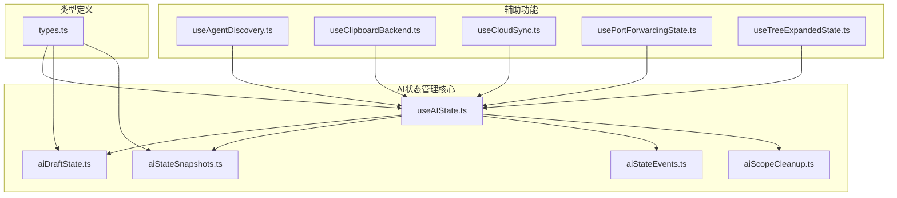
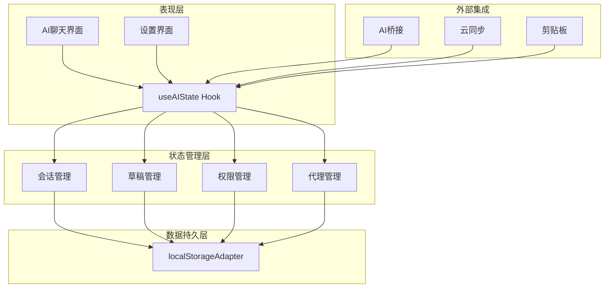
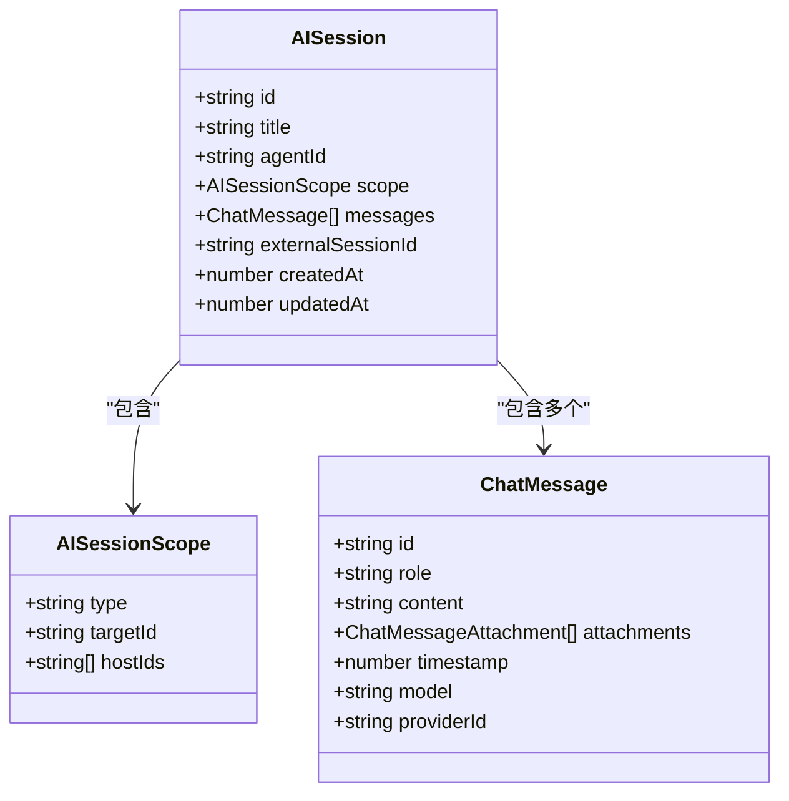
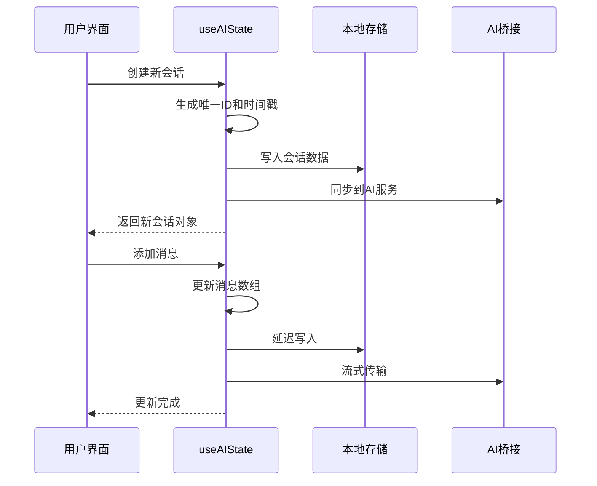
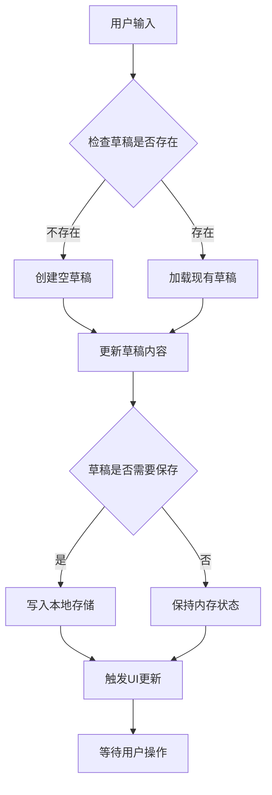
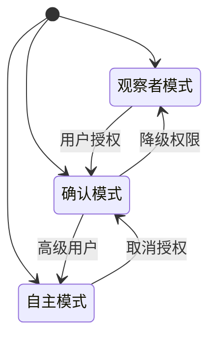
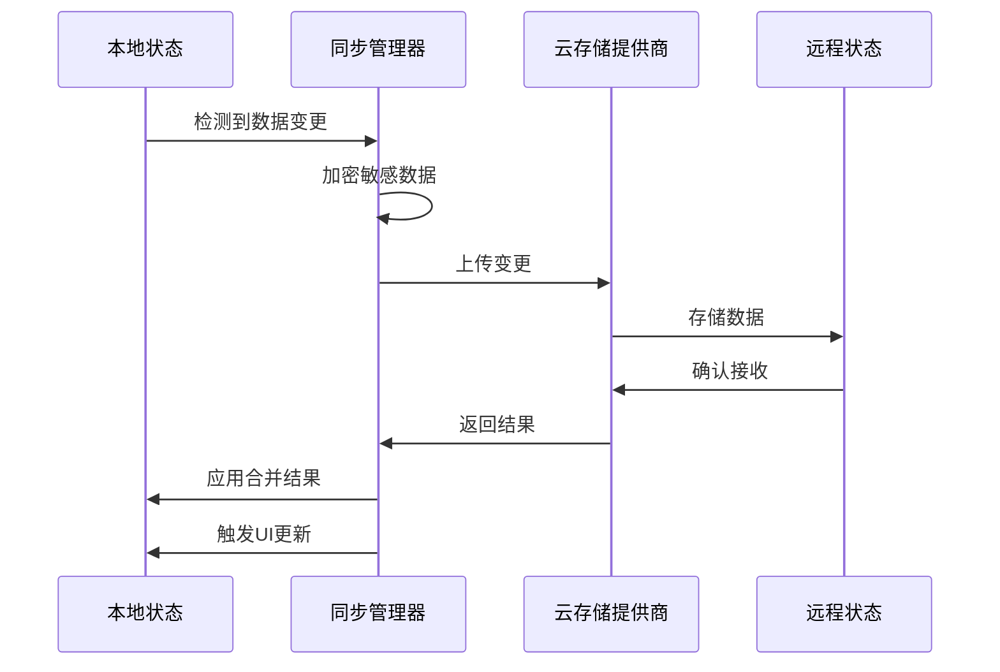
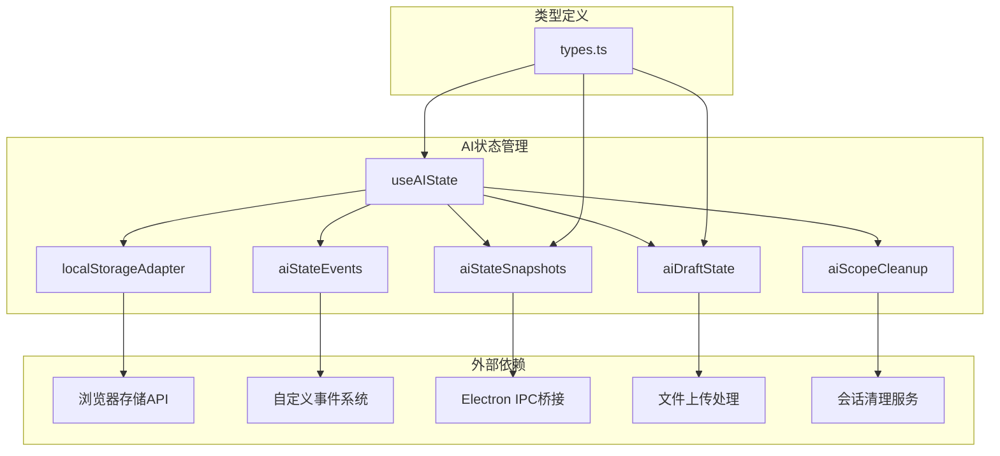

# AI状态Hook

<cite>
**本文档引用的文件**
- [useAIState.ts](file://application/state/useAIState.ts)
- [aiDraftState.ts](file://application/state/aiDraftState.ts)
- [useAgentDiscovery.ts](file://application/state/useAgentDiscovery.ts)
- [aiStateEvents.ts](file://application/state/aiStateEvents.ts)
- [aiStateSnapshots.ts](file://application/state/aiStateSnapshots.ts)
- [aiScopeCleanup.ts](file://application/state/aiScopeCleanup.ts)
- [types.ts](file://infrastructure/ai/types.ts)
- [useClipboardBackend.ts](file://application/state/useClipboardBackend.ts)
- [useCloudSync.ts](file://application/state/useCloudSync.ts)
- [usePortForwardingState.ts](file://application/state/usePortForwardingState.ts)
- [useTreeExpandedState.ts](file://application/state/useTreeExpandedState.ts)
</cite>

## 目录
1. [简介](#简介)
2. [项目结构](#项目结构)
3. [核心组件](#核心组件)
4. [架构概览](#架构概览)
5. [详细组件分析](#详细组件分析)
6. [依赖关系分析](#依赖关系分析)
7. [性能考虑](#性能考虑)
8. [故障排除指南](#故障排除指南)
9. [结论](#结论)

## 简介

AI状态Hook是Netcatty应用中负责管理AI对话状态、草稿管理和状态快照的核心模块。该系统提供了完整的AI会话生命周期管理，包括状态持久化、跨窗口同步、内存优化和错误恢复机制。

本系统采用React Hooks模式，通过本地存储适配器实现数据持久化，并通过自定义事件系统实现跨组件通信。系统支持多代理、多会话管理，以及与外部AI服务的集成。

## 项目结构

AI状态管理相关的文件组织结构如下：

**图表来源**
- [useAIState.ts:1-1001](file://application/state/useAIState.ts#L1-L1001)
- [aiDraftState.ts:1-283](file://application/state/aiDraftState.ts#L1-L283)
- [types.ts:1-348](file://infrastructure/ai/types.ts#L1-L348)

**章节来源**
- [useAIState.ts:1-1001](file://application/state/useAIState.ts#L1-L1001)
- [aiDraftState.ts:1-283](file://application/state/aiDraftState.ts#L1-L283)
- [types.ts:1-348](file://infrastructure/ai/types.ts#L1-L348)

## 核心组件

### useAIState Hook

useAIState是AI状态管理的核心Hook，提供以下主要功能：

#### 主要状态管理
- **AI提供商配置**：管理多个AI提供商的配置和当前活动提供商
- **会话管理**：创建、更新、删除AI对话会话
- **权限模型**：支持观察者、确认和自主三种权限模式
- **工具集成**：支持MCP和技能两种工具集成模式

#### 草稿管理系统
- **多范围草稿**：支持按作用域（终端、工作区、全局）管理草稿
- **实时预览**：草稿内容变更时自动触发UI更新
- **附件管理**：支持文件上传和附件管理

#### 数据持久化
- **本地存储**：使用localStorageAdapter进行数据持久化
- **跨窗口同步**：通过storage事件实现多窗口间状态同步
- **内存快照**：维护最新状态的内存快照以提高性能

**章节来源**
- [useAIState.ts:66-1001](file://application/state/useAIState.ts#L66-L1001)

### aiDraftState 模块

aiDraftState专门处理草稿状态管理，包含以下核心功能：

#### 草稿数据结构
- **AIDraft**：包含文本内容、代理ID、附件列表和用户技能选择
- **DraftsByScope**：按作用域组织的草稿映射
- **PanelViewByScope**：面板视图状态映射

#### 草稿操作函数
- **createEmptyDraft**：创建空草稿
- **updateDraftForScope**：按作用域更新草稿
- **activateDraftView**：激活草稿视图
- **clearScopeDraftState**：清理指定作用域的草稿状态

**章节来源**
- [aiDraftState.ts:1-283](file://application/state/aiDraftState.ts#L1-L283)

### useAgentDiscovery Hook

useAgentDiscovery用于发现和管理外部AI代理：

#### 代理发现机制
- **系统扫描**：扫描系统PATH中的可用代理
- **动态配置**：根据发现结果动态生成代理配置
- **版本管理**：跟踪代理版本信息

#### 代理配置管理
- **自动更新**：当发现新的代理参数时自动更新配置
- **冲突解决**：处理已配置代理与发现代理之间的冲突
- **启用管理**：提供启用和禁用代理的功能

**章节来源**
- [useAgentDiscovery.ts:1-108](file://application/state/useAgentDiscovery.ts#L1-L108)

## 架构概览

AI状态管理系统采用分层架构设计，确保各组件职责清晰且松耦合：

**图表来源**
- [useAIState.ts:1-1001](file://application/state/useAIState.ts#L1-L1001)
- [aiStateSnapshots.ts:1-227](file://application/state/aiStateSnapshots.ts#L1-L227)

## 详细组件分析

### AI会话管理

AI会话管理是系统的核心功能之一，提供完整的对话生命周期管理：

#### 会话数据结构

**图表来源**
- [types.ts:161-176](file://infrastructure/ai/types.ts#L161-L176)
- [types.ts:93-123](file://infrastructure/ai/types.ts#L93-L123)

#### 会话操作流程

**图表来源**
- [useAIState.ts:551-673](file://application/state/useAIState.ts#L551-L673)

**章节来源**
- [useAIState.ts:520-716](file://application/state/useAIState.ts#L520-L716)
- [types.ts:161-176](file://infrastructure/ai/types.ts#L161-L176)

### 草稿管理系统

草稿管理系统提供智能的草稿保存和恢复功能：

#### 草稿状态管理

**图表来源**
- [aiDraftState.ts:118-146](file://application/state/aiDraftState.ts#L118-L146)

#### 草稿清理机制
系统实现了智能的草稿清理机制，防止内存泄漏：

- **作用域清理**：当作用域目标关闭时自动清理相关草稿
- **内存限制**：限制同时存在的草稿数量
- **过期检测**：定期检测和清理长时间未使用的草稿

**章节来源**
- [aiDraftState.ts:173-283](file://application/state/aiDraftState.ts#L173-L283)
- [aiScopeCleanup.ts:1-146](file://application/state/aiScopeCleanup.ts#L1-L146)

### 权限和安全模型

系统实现了多层次的安全权限控制：

#### 权限模式

#### 命令过滤机制
- **全局阻断清单**：阻止危险命令执行
- **主机特定权限**：为不同主机设置不同的权限级别
- **实时监控**：监控命令执行过程

**章节来源**
- [useAIState.ts:285-343](file://application/state/useAIState.ts#L285-L343)
- [types.ts:178-189](file://infrastructure/ai/types.ts#L178-L189)

### 云同步集成

系统提供了完整的云同步功能：

#### 同步流程

**图表来源**
- [useCloudSync.ts:1-768](file://application/state/useCloudSync.ts#L1-L768)

**章节来源**
- [useCloudSync.ts:190-765](file://application/state/useCloudSync.ts#L190-L765)

## 依赖关系分析

AI状态管理系统与其他系统组件的依赖关系：

**图表来源**
- [useAIState.ts:1-1001](file://application/state/useAIState.ts#L1-L1001)
- [types.ts:1-348](file://infrastructure/ai/types.ts#L1-L348)

**章节来源**
- [useAIState.ts:1-65](file://application/state/useAIState.ts#L1-L65)
- [aiStateSnapshots.ts:24-36](file://application/state/aiStateSnapshots.ts#L24-L36)

## 性能考虑

### 内存管理优化

系统采用了多种内存管理策略来确保高性能运行：

#### 懒加载机制
- **延迟初始化**：状态在首次使用时才从存储中加载
- **按需渲染**：只渲染当前活跃的作用域状态
- **虚拟化列表**：对大量会话和草稿使用虚拟化技术

#### 缓存策略
- **内存快照**：维护最新状态的内存副本
- **增量更新**：只更新发生变化的部分
- **去重机制**：避免重复的状态更新

#### 存储优化
- **数据压缩**：对存储的数据进行压缩
- **批量写入**：使用防抖机制减少存储写入次数
- **清理策略**：定期清理过期和无用数据

### 并发控制

系统实现了完善的并发控制机制：

#### 状态一致性
- **原子操作**：所有状态更新都是原子性的
- **锁机制**：使用ref计数确保资源正确释放
- **竞态条件防护**：通过状态检查避免竞态条件

#### 异步处理
- **Promise链**：使用Promise链处理异步操作
- **错误隔离**：每个异步操作都有独立的错误处理
- **超时机制**：为长时间运行的操作设置超时

**章节来源**
- [useAIState.ts:525-549](file://application/state/useAIState.ts#L525-L549)
- [usePortForwardingState.ts:22-30](file://application/state/usePortForwardingState.ts#L22-L30)

## 故障排除指南

### 常见问题及解决方案

#### 状态不一致问题
**症状**：UI显示与实际状态不符
**原因**：跨窗口同步延迟或事件丢失
**解决方案**：
1. 检查storage事件监听器是否正常工作
2. 验证自定义事件系统的事件分发
3. 确认localStorageAdapter的读写操作

#### 内存泄漏问题
**症状**：应用运行时间越长内存占用越大
**原因**：草稿状态未正确清理或监听器未移除
**解决方案**：
1. 检查useEffect清理函数的实现
2. 验证草稿清理逻辑的完整性
3. 确认定时器和事件监听器的正确移除

#### 性能问题
**症状**：界面响应缓慢或卡顿
**原因**：频繁的状态更新或大数据量处理
**解决方案**：
1. 检查防抖机制的配置
2. 优化状态更新的粒度
3. 实施虚拟化和懒加载策略

### 调试技巧

#### 状态追踪
- 使用浏览器开发者工具的Redux DevTools
- 监控localStorage的变化
- 跟踪自定义事件的触发频率

#### 性能监控
- 监控组件重新渲染次数
- 分析内存使用情况
- 跟踪异步操作的执行时间

**章节来源**
- [aiStateEvents.ts:1-21](file://application/state/aiStateEvents.ts#L1-L21)
- [useAIState.ts:498-518](file://application/state/useAIState.ts#L498-L518)

## 结论

AI状态Hook系统通过精心设计的架构和实现，为Netcatty应用提供了强大而灵活的AI状态管理能力。系统的主要优势包括：

### 技术优势
- **模块化设计**：清晰的职责分离和接口定义
- **性能优化**：多种内存管理和缓存策略
- **可靠性保证**：完善的错误处理和恢复机制
- **扩展性**：支持新的AI提供商和代理类型

### 功能特性
- **完整的生命周期管理**：从创建到清理的全流程支持
- **智能持久化**：平衡性能和数据安全的存储策略
- **跨平台兼容**：支持桌面和Web环境
- **安全控制**：多层次的权限和安全机制

该系统为AI功能的集成和扩展奠定了坚实的基础，能够满足复杂应用场景的需求。通过持续的优化和改进，系统将继续提升用户体验和开发效率。