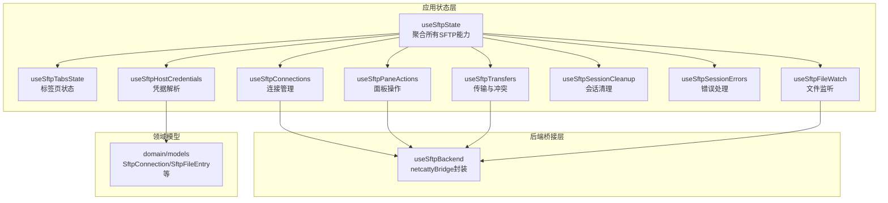
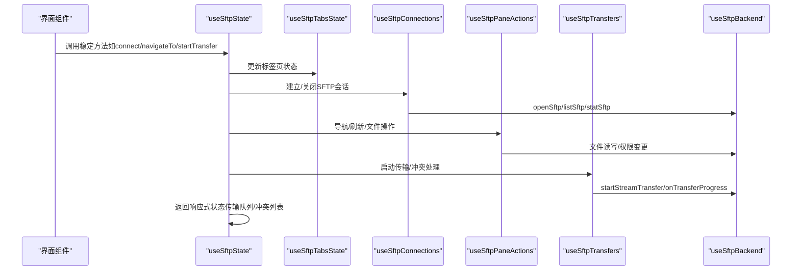
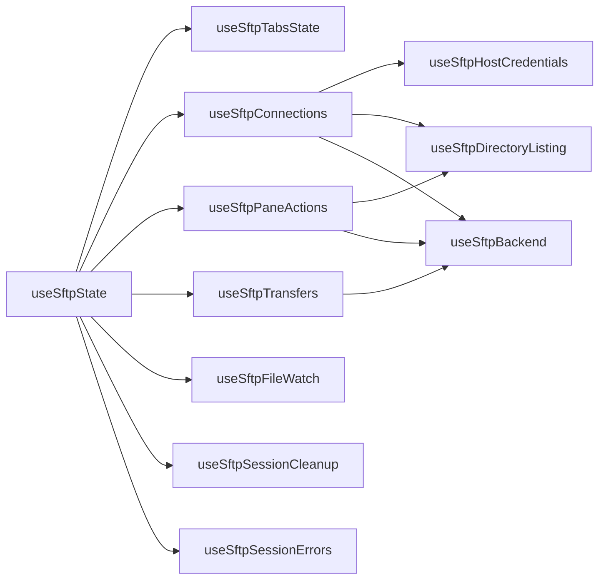

# SFTP状态Hook

<cite>
**本文档引用的文件**
- [useSftpState.ts](file://application/state/useSftpState.ts)
- [useSftpBackend.ts](file://application/state/useSftpBackend.ts)
- [useSftpConnections.ts](file://application/state/sftp/useSftpConnections.ts)
- [useSftpDirectoryListing.ts](file://application/state/sftp/useSftpDirectoryListing.ts)
- [useSftpPaneActions.ts](file://application/state/sftp/useSftpPaneActions.ts)
- [useSftpTabsState.ts](file://application/state/sftp/useSftpTabsState.ts)
- [useSftpTransfers.ts](file://application/state/sftp/useSftpTransfers.ts)
- [useSftpTransfers.types.ts](file://application/state/sftp/useSftpTransfers.types.ts)
- [types.ts](file://application/state/sftp/types.ts)
- [useSftpFileWatch.ts](file://application/state/sftp/useSftpFileWatch.ts)
- [useSftpSessionCleanup.ts](file://application/state/sftp/useSftpSessionCleanup.ts)
- [useSftpSessionErrors.ts](file://application/state/sftp/useSftpSessionErrors.ts)
- [useSftpHostCredentials.ts](file://application/state/sftp/useSftpHostCredentials.ts)
</cite>

## 目录
1. [简介](#简介)
2. [项目结构](#项目结构)
3. [核心组件](#核心组件)
4. [架构总览](#架构总览)
5. [详细组件分析](#详细组件分析)
6. [依赖关系分析](#依赖关系分析)
7. [性能考虑](#性能考虑)
8. [故障排除指南](#故障排除指南)
9. [结论](#结论)

## 简介
本文件系统性梳理并文档化SFTP状态Hook体系，重点覆盖以下方面：
- useSftpState：统一聚合SFTP状态与行为的顶层Hook，协调标签页、连接、目录浏览、传输、外部操作、文件监听与会话清理。
- useSftpBackend：桥接到底层桥接层（netcattyBridge）的SFTP后端能力封装，提供打开/关闭SFTP会话、读写文件、列出目录、执行权限变更、流式传输等接口。
- useSftpConnections：负责SFTP连接生命周期管理，包括本地/远程连接、凭据解析、路径探测、缓存键构建、重连策略与错误恢复。
- useSftpPaneActions：面板级操作集合，涵盖导航、刷新、过滤、文件创建/删除/重命名、权限修改、批量移动等。
- useSftpTransfers：传输队列与冲突处理，支持上传/下载/同机复制、目录递归传输、进度跟踪、取消/重试、批量冲突决策。
- useSftpTabsState：多标签页状态管理，支持左右两侧独立标签页、拖拽排序、跨侧移动、隐藏文件显示切换等。
- useSftpFileWatch：文件监听事件订阅，转发到上层以支持外部应用同步与自动打开。
- useSftpSessionCleanup：组件卸载时清理SFTP会话，避免资源泄漏。
- useSftpSessionErrors：会话异常处理与自动重连触发。
- useSftpHostCredentials：主机凭据解析与参数构建，支持代理链、跳板机、算法覆盖与保活设置。

## 项目结构
SFTP状态Hook位于 application/state/sftp 与 application/state 下，采用“按功能域分层”的组织方式：
- application/state：顶层状态聚合（useSftpState）
- application/state/sftp：SFTP子域Hook与类型定义
- domain/models：SFTP数据模型（连接、文件条目、编码等）
- infrastructure/services：桥接层（netcattyBridge）抽象
- lib：通用工具（日志、路径、格式化）

图示来源
- [useSftpState.ts:33-569](file://application/state/useSftpState.ts#L33-L569)
- [useSftpConnections.ts:44-584](file://application/state/sftp/useSftpConnections.ts#L44-L584)
- [useSftpPaneActions.ts:63-965](file://application/state/sftp/useSftpPaneActions.ts#L63-L965)
- [useSftpTransfers.ts:19-990](file://application/state/sftp/useSftpTransfers.ts#L19-L990)
- [useSftpBackend.ts:5-294](file://application/state/useSftpBackend.ts#L5-L294)
- [useSftpHostCredentials.ts:19-185](file://application/state/sftp/useSftpHostCredentials.ts#L19-L185)

章节来源
- [useSftpState.ts:33-569](file://application/state/useSftpState.ts#L33-L569)
- [useSftpBackend.ts:5-294](file://application/state/useSftpBackend.ts#L5-L294)

## 核心组件
本节对关键Hook进行API级说明，强调输入输出、副作用与约束条件。

- useSftpState
  - 职责：聚合SFTP状态与行为，提供稳定方法引用与响应式状态；协调连接、目录浏览、传输、外部操作、文件监听与会话清理。
  - 关键返回值（稳定方法）：连接/断开、导航、刷新、文件操作、传输控制、外部上传、权限变更、错误上报等。
  - 关键状态：左右面板、传输队列、冲突列表、活动传输数。
  - 复杂度：方法稳定引用避免重渲染；状态变化触发重渲染。
  - 参考路径：[useSftpState.ts:33-569](file://application/state/useSftpState.ts#L33-L569)

- useSftpBackend
  - 职责：封装netcattyBridge的SFTP能力，包括打开/关闭SFTP、列出/读取/写入文件、创建/删除/重命名、权限变更、本地文件操作、流式传输与进度回调、临时文件注册与清理、外部应用选择与打开。
  - 关键API：openSftp/closeSftp、listSftp/readSftp/writeSftp、mkdirSftp/deleteSftp/renameSftp、chmodSftp、listLocalDir/readLocalFile/writeLocalFile、startStreamTransfer/onTransferProgress/cancelTransfer、downloadSftpToTempAndOpen等。
  - 并发与错误：对不可用桥接方法抛出明确错误；进度与完成回调需正确清理。
  - 参考路径：[useSftpBackend.ts:5-294](file://application/state/useSftpBackend.ts#L5-L294)

- useSftpConnections
  - 职责：建立/关闭SFTP会话，解析主机凭据，探测起始路径，维护连接映射与缓存键，处理连接进度日志，触发自动重连。
  - 关键流程：连接请求序列号、缓存键构建、共享主机缓存、连接失败回退路径、会话丢失清理。
  - 参考路径：[useSftpConnections.ts:73-584](file://application/state/sftp/useSftpConnections.ts#L73-L584)

- useSftpPaneActions
  - 职责：面板级文件系统操作，包括导航、刷新、过滤、文件创建/删除/重命名、权限修改、批量移动等；支持乐观更新与错误恢复。
  - 关键机制：导航序列号、最后确认状态、缓存键、共享主机缓存、会话错误检测。
  - 参考路径：[useSftpPaneActions.ts:152-965](file://application/state/sftp/useSftpPaneActions.ts#L152-L965)

- useSftpTransfers
  - 职责：传输任务编排、冲突检测与决策、同机复制优化、目录递归传输、进度与速度统计、取消/重试、外部上传集成。
  - 关键机制：任务状态机、冲突默认策略、同主机路径优化、后台取消、完成回调。
  - 参考路径：[useSftpTransfers.ts:19-990](file://application/state/sftp/useSftpTransfers.ts#L19-L990)

- useSftpTabsState
  - 职责：多标签页状态管理，支持添加/关闭/选择/重排/跨侧移动，隐藏文件显示切换，清空其他标签选择。
  - 参考路径：[useSftpTabsState.ts:40-300](file://application/state/sftp/useSftpTabsState.ts#L40-L300)

- useSftpFileWatch
  - 职责：订阅文件监听事件（同步/错误），转发给上层选项回调。
  - 参考路径：[useSftpFileWatch.ts:5-28](file://application/state/sftp/useSftpFileWatch.ts#L5-L28)

- useSftpSessionCleanup
  - 职责：组件卸载时关闭所有SFTP会话，避免资源泄漏。
  - 参考路径：[useSftpSessionCleanup.ts:5-20](file://application/state/sftp/useSftpSessionCleanup.ts#L5-L20)

- useSftpSessionErrors
  - 职责：会话错误处理，清理会话映射与缓存，触发自动重连或清空面板状态。
  - 参考路径：[useSftpSessionErrors.ts:31-79](file://application/state/sftp/useSftpSessionErrors.ts#L31-L79)

- useSftpHostCredentials
  - 职责：解析主机认证信息，构建桥接层所需的NetcattySSHOptions，支持代理链、跳板机、算法覆盖与保活设置。
  - 参考路径：[useSftpHostCredentials.ts:19-185](file://application/state/sftp/useSftpHostCredentials.ts#L19-L185)

章节来源
- [useSftpState.ts:33-569](file://application/state/useSftpState.ts#L33-L569)
- [useSftpBackend.ts:5-294](file://application/state/useSftpBackend.ts#L5-L294)
- [useSftpConnections.ts:73-584](file://application/state/sftp/useSftpConnections.ts#L73-L584)
- [useSftpPaneActions.ts:152-965](file://application/state/sftp/useSftpPaneActions.ts#L152-L965)
- [useSftpTransfers.ts:19-990](file://application/state/sftp/useSftpTransfers.ts#L19-L990)
- [useSftpTabsState.ts:40-300](file://application/state/sftp/useSftpTabsState.ts#L40-L300)
- [useSftpFileWatch.ts:5-28](file://application/state/sftp/useSftpFileWatch.ts#L5-L28)
- [useSftpSessionCleanup.ts:5-20](file://application/state/sftp/useSftpSessionCleanup.ts#L5-L20)
- [useSftpSessionErrors.ts:31-79](file://application/state/sftp/useSftpSessionErrors.ts#L31-L79)
- [useSftpHostCredentials.ts:19-185](file://application/state/sftp/useSftpHostCredentials.ts#L19-L185)

## 架构总览
SFTP状态Hook通过useSftpState统一调度各子模块，形成“状态聚合—能力拆分—桥接后端”的清晰层次。下图展示关键交互：

图示来源
- [useSftpState.ts:273-569](file://application/state/useSftpState.ts#L273-L569)
- [useSftpConnections.ts:73-584](file://application/state/sftp/useSftpConnections.ts#L73-L584)
- [useSftpPaneActions.ts:152-965](file://application/state/sftp/useSftpPaneActions.ts#L152-L965)
- [useSftpTransfers.ts:19-990](file://application/state/sftp/useSftpTransfers.ts#L19-L990)
- [useSftpBackend.ts:5-294](file://application/state/useSftpBackend.ts#L5-L294)

## 详细组件分析

### useSftpState：SFTP状态聚合器
- 稳定方法引用：通过ref存储方法并在useMemo中生成稳定包装，避免因方法引用变化导致的重渲染。
- 状态暴露：左/右面板、传输队列、活动传输数、冲突列表。
- 协调关系：连接、目录浏览、传输、外部操作、文件监听、会话清理、错误处理均在此汇聚。
- 性能策略：仅将状态加入依赖数组，方法引用保持稳定；目录缓存与导航序列号减少无效渲染与竞态。

参考路径
- [useSftpState.ts:33-569](file://application/state/useSftpState.ts#L33-L569)

章节来源
- [useSftpState.ts:33-569](file://application/state/useSftpState.ts#L33-L569)

### useSftpBackend：SFTP后端桥接
- SFTP会话：openSftp/closeSftp，支持会话进度事件订阅。
- 目录与文件：listSftp/listLocalDir、readSftp/readSftpBinary、writeSftp/writeSftpBinary、mkdirSftp/deleteSftp/renameSftp、statSftp、chmodSftp。
- 流式传输：startStreamTransfer、onTransferProgress、cancelTransfer、cancelSftpUpload。
- 本地文件：readLocalFile/writeLocalFile/deleteLocalFile/renameLocalFile、mkdirLocal、statLocal、getHomeDir、listDrives、openPath。
- 外部应用：downloadSftpToTempAndOpen（下载至临时文件、注册清理、打开应用、可选开启文件监听）。
- 错误处理：对缺失桥接方法抛出明确错误，确保调用方显式处理。

参考路径
- [useSftpBackend.ts:5-294](file://application/state/useSftpBackend.ts#L5-L294)

章节来源
- [useSftpBackend.ts:5-294](file://application/state/useSftpBackend.ts#L5-L294)

### useSftpConnections：连接生命周期
- 连接流程：构建连接ID、缓存键、连接请求序列号；订阅SFTP连接进度日志；解析凭据（优先密钥，失败则密码）；探测家目录与起始路径；缓存目录列表与共享主机缓存。
- 断开流程：清理缓存、关闭会话、重置面板状态。
- 自动重连：在面板处于重连状态且存在上次连接主机时，定时重试连接。
- 错误处理：连接失败时根据是否为重连场景决定清空面板或提示重连。

参考路径
- [useSftpConnections.ts:73-584](file://application/state/sftp/useSftpConnections.ts#L73-L584)

章节来源
- [useSftpConnections.ts:73-584](file://application/state/sftp/useSftpConnections.ts#L73-L584)

### useSftpPaneActions：面板操作集
- 导航与刷新：基于导航序列号与最后确认状态，避免竞态；支持强制刷新与指定标签页刷新。
- 缓存策略：目录缓存（含编码维度）、共享主机缓存、确认状态回滚。
- 文件操作：创建/删除/重命名、权限变更、批量移动；对本地与远程分别调用桥接方法。
- 乐观更新：在目标路径与当前路径一致时刷新，否则局部更新文件列表与选择集。

参考路径
- [useSftpPaneActions.ts:152-965](file://application/state/sftp/useSftpPaneActions.ts#L152-L965)

章节来源
- [useSftpPaneActions.ts:152-965](file://application/state/sftp/useSftpPaneActions.ts#L152-L965)

### useSftpTransfers：传输与冲突处理
- 传输任务：支持上传/下载/同机复制，目录递归传输，进度与速度统计，取消/重试，完成回调。
- 冲突检测：目标路径存在时检测大小/时间戳差异，弹出冲突对话框；支持“停止/跳过/重复/替换/合并”等动作，并可应用到全部。
- 同机优化：当源/目标在同一主机且编码兼容时，尝试使用同机复制（exec）以提升性能。
- 缓存清理：传输完成后清理目标连接缓存并刷新目标面板。
- 外部上传：支持外部上传任务的添加与进度更新，保证UI稳定性。

参考路径
- [useSftpTransfers.ts:19-990](file://application/state/sftp/useSftpTransfers.ts#L19-L990)
- [useSftpTransfers.types.ts:5-61](file://application/state/sftp/useSftpTransfers.types.ts#L5-L61)

章节来源
- [useSftpTransfers.ts:19-990](file://application/state/sftp/useSftpTransfers.ts#L19-L990)
- [useSftpTransfers.types.ts:5-61](file://application/state/sftp/useSftpTransfers.types.ts#L5-L61)

### useSftpTabsState：标签页状态
- 功能：添加/关闭/选择/重排/跨侧移动标签；清空其他标签的选择；切换隐藏文件显示。
- 数据结构：左侧/右侧标签页集合与活跃标签ID；空面板占位符。
- 性能：通过ref持有最新状态，避免不必要的重渲染。

参考路径
- [useSftpTabsState.ts:40-300](file://application/state/sftp/useSftpTabsState.ts#L40-L300)

章节来源
- [useSftpTabsState.ts:40-300](file://application/state/sftp/useSftpTabsState.ts#L40-L300)

### useSftpFileWatch：文件监听
- 订阅：onFileWatchSynced/onFileWatchError，转发到useSftpState选项回调。
- 清理：组件卸载时取消订阅。

参考路径
- [useSftpFileWatch.ts:5-28](file://application/state/sftp/useSftpFileWatch.ts#L5-L28)

章节来源
- [useSftpFileWatch.ts:5-28](file://application/state/sftp/useSftpFileWatch.ts#L5-L28)

### useSftpSessionCleanup：会话清理
- 行为：组件卸载时遍历会话映射，逐个关闭SFTP会话，忽略关闭过程中的错误。

参考路径
- [useSftpSessionCleanup.ts:5-20](file://application/state/sftp/useSftpSessionCleanup.ts#L5-L20)

章节来源
- [useSftpSessionCleanup.ts:5-20](file://application/state/sftp/useSftpSessionCleanup.ts#L5-L20)

### useSftpSessionErrors：错误处理
- 行为：清理会话映射与缓存，根据是否存在上次连接主机与面板是否有文件决定进入重连状态或清空面板。
- 触发：由连接/面板操作捕获会话错误时调用。

参考路径
- [useSftpSessionErrors.ts:31-79](file://application/state/sftp/useSftpSessionErrors.ts#L31-L79)

章节来源
- [useSftpSessionErrors.ts:31-79](file://application/state/sftp/useSftpSessionErrors.ts#L31-L79)

### useSftpHostCredentials：主机凭据解析
- 输入：主机、密钥、身份、终端设置。
- 输出：NetcattySSHOptions，包含主机名、端口、用户名、密码/私钥/证书/密钥ID/身份文件、代理、跳板机链、sudo、算法覆盖、保活设置等。
- 安全：对加密凭证进行解密检查，缺失时抛出明确错误。

参考路径
- [useSftpHostCredentials.ts:19-185](file://application/state/sftp/useSftpHostCredentials.ts#L19-L185)

章节来源
- [useSftpHostCredentials.ts:19-185](file://application/state/sftp/useSftpHostCredentials.ts#L19-L185)

## 依赖关系分析
- useSftpState依赖：useSftpTabsState、useSftpConnections、useSftpPaneActions、useSftpTransfers、useSftpFileWatch、useSftpSessionCleanup、useSftpSessionErrors、useSftpExternalOperations（外部操作由useSftpTransfers间接使用）。
- useSftpConnections依赖：useSftpHostCredentials、useSftpDirectoryListing、netcattyBridge。
- useSftpPaneActions依赖：useSftpDirectoryListing、netcattyBridge、导航序列号与缓存。
- useSftpTransfers依赖：netcattyBridge（流式传输、同机复制）、冲突与任务操作模块。
- useSftpBackend直接依赖：netcattyBridge。

图示来源
- [useSftpState.ts:45-328](file://application/state/useSftpState.ts#L45-L328)
- [useSftpConnections.ts:70-71](file://application/state/sftp/useSftpConnections.ts#L70-L71)
- [useSftpPaneActions.ts:78-79](file://application/state/sftp/useSftpPaneActions.ts#L78-L79)
- [useSftpTransfers.ts:86-94](file://application/state/sftp/useSftpTransfers.ts#L86-L94)
- [useSftpBackend.ts:5-294](file://application/state/useSftpBackend.ts#L5-L294)

章节来源
- [useSftpState.ts:45-328](file://application/state/useSftpState.ts#L45-L328)
- [useSftpConnections.ts:70-71](file://application/state/sftp/useSftpConnections.ts#L70-L71)
- [useSftpPaneActions.ts:78-79](file://application/state/sftp/useSftpPaneActions.ts#L78-L79)
- [useSftpTransfers.ts:86-94](file://application/state/sftp/useSftpTransfers.ts#L86-L94)
- [useSftpBackend.ts:5-294](file://application/state/useSftpBackend.ts#L5-L294)

## 性能考虑
- 目录缓存：按连接ID+编码+路径构建缓存键，TTL为10秒，显著降低重复目录列举开销。
- 导航序列号：避免竞态，确保超时或被其他标签页覆盖的请求不会污染当前状态。
- 最后确认状态：在乐观更新后保留已确认状态，失败时可回滚到已知良好状态。
- 同机复制：当源/目标在同一主机且编码兼容时，使用同机复制避免网络往返。
- 稳定方法引用：通过ref与useMemo生成稳定方法，避免因方法引用变化导致的重渲染。
- 外部上传进度：单调递增与边界约束，保证UI进度稳定。

## 故障排除指南
- 连接失败
  - 检查凭据解析是否成功（加密凭证无法解密会抛错）。
  - 查看连接进度日志与错误消息，必要时切换到密码认证或修复密钥。
  - 若多次失败，观察是否触发自动重连。
  - 参考路径：[useSftpConnections.ts:270-485](file://application/state/sftp/useSftpConnections.ts#L270-L485)

- 会话丢失
  - 当面板处于重连状态且存在上次连接主机时，自动重连；否则清空面板状态。
  - 参考路径：[useSftpSessionErrors.ts:31-79](file://application/state/sftp/useSftpSessionErrors.ts#L31-L79)

- 传输中断/取消
  - 通过cancelTransfer取消任务，内部清理子任务并调用后端取消。
  - 对部分失败的目录传输，禁用重试以避免重复覆盖。
  - 参考路径：[useSftpTransfers.ts:602-629](file://application/state/sftp/useSftpTransfers.ts#L602-L629)

- 文件监听失败
  - 监听事件订阅失败不影响主流程，但会记录警告；可手动重新启用。
  - 参考路径：[useSftpBackend.ts:244-253](file://application/state/useSftpBackend.ts#L244-L253)

- 临时文件未清理
  - 注册临时文件清理失败会被忽略，不影响下载/打开流程。
  - 参考路径：[useSftpBackend.ts:233-238](file://application/state/useSftpBackend.ts#L233-L238)

章节来源
- [useSftpConnections.ts:270-485](file://application/state/sftp/useSftpConnections.ts#L270-L485)
- [useSftpSessionErrors.ts:31-79](file://application/state/sftp/useSftpSessionErrors.ts#L31-L79)
- [useSftpTransfers.ts:602-629](file://application/state/sftp/useSftpTransfers.ts#L602-L629)
- [useSftpBackend.ts:233-253](file://application/state/useSftpBackend.ts#L233-L253)

## 结论
SFTP状态Hook体系通过useSftpState实现统一聚合，结合useSftpConnections、useSftpPaneActions、useSftpTransfers等子模块，提供了从连接、导航、文件操作到传输与监听的完整能力闭环。其设计注重稳定性（稳定方法引用）、性能（缓存与序列号）、安全性（凭据解密校验）与可用性（自动重连与错误恢复）。建议在实际使用中：
- 使用useSftpState提供的稳定方法引用，避免不必要的重渲染。
- 正确处理传输冲突与会话错误，合理配置自动重连。
- 利用目录缓存与同机复制优化大文件传输性能。
- 在外部上传场景中，使用addExternalUpload与updateExternalUpload保证进度UI稳定。