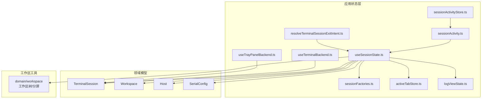
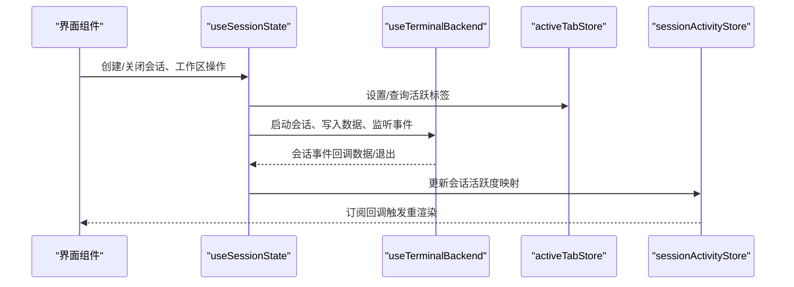
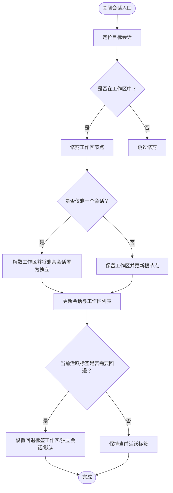
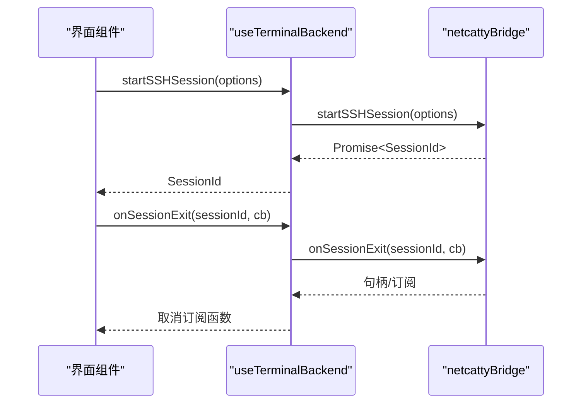
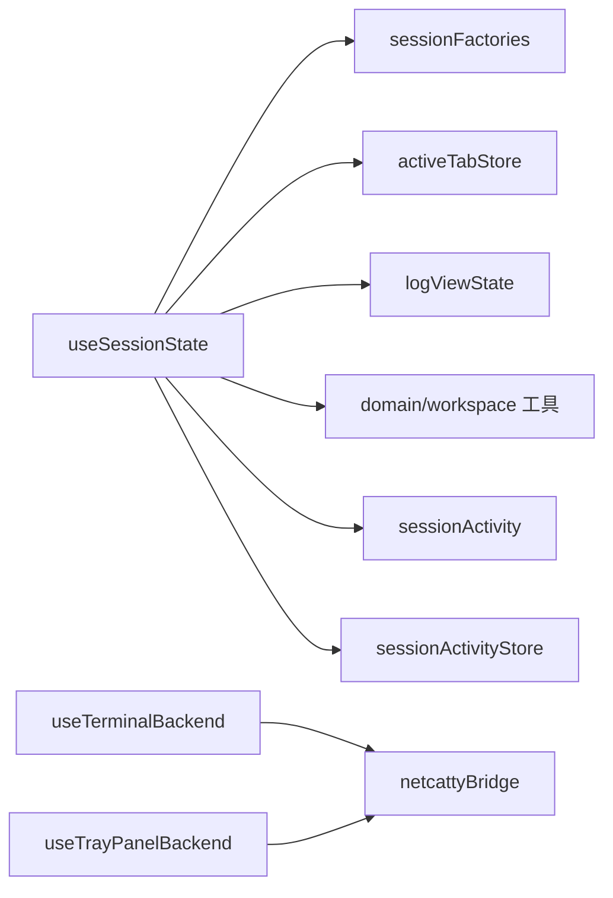

# 会话状态Hook

<cite>
**本文引用的文件**
- [useSessionState.ts](file://application/state/useSessionState.ts)
- [useTerminalBackend.ts](file://application/state/useTerminalBackend.ts)
- [useTrayPanelBackend.ts](file://application/state/useTrayPanelBackend.ts)
- [sessionActivity.ts](file://application/state/sessionActivity.ts)
- [sessionActivityStore.ts](file://application/state/sessionActivityStore.ts)
- [sessionFactories.ts](file://application/state/sessionFactories.ts)
- [activeTabStore.ts](file://application/state/activeTabStore.ts)
- [logViewState.ts](file://application/state/logViewState.ts)
- [resolveTerminalSessionExitIntent.ts](file://application/state/resolveTerminalSessionExitIntent.ts)
</cite>

## 目录
1. [简介](#简介)
2. [项目结构](#项目结构)
3. [核心组件](#核心组件)
4. [架构总览](#架构总览)
5. [详细组件分析](#详细组件分析)
6. [依赖关系分析](#依赖关系分析)
7. [性能考量](#性能考量)
8. [故障排查指南](#故障排查指南)
9. [结论](#结论)
10. [附录](#附录)

## 简介
本文件系统性地记录与“会话状态”相关的React Hooks与支撑模块，重点覆盖以下能力：
- 会话生命周期管理：创建、连接、分割、复制、重命名、关闭与工作区联动
- 活动状态跟踪：基于外部存储的会话/工作区活跃度映射
- 会话工厂模式：统一创建本地、串口、主机类会话
- 退出意图处理：根据会话退出事件推导后续行为（关闭或标记断开）
- 终端后端与托盘面板后端：桥接Electron主进程能力，提供会话操作与事件订阅
- 数据结构、初始化流程与状态转换规则
- 终端会话创建、销毁与恢复的实现要点
- 会话状态持久化、并发控制与错误处理策略
- 事件处理、副作用管理与性能优化建议

## 项目结构
围绕会话状态的核心文件组织如下：
- 应用层状态与逻辑：application/state 下的 useSessionState、useTerminalBackend、useTrayPanelBackend、sessionActivity、sessionActivityStore、sessionFactories、activeTabStore、logViewState、resolveTerminalSessionExitIntent
- 领域模型与类型：domain/models 中的 TerminalSession、Workspace、Host、SerialConfig 等
- 工作区与布局：domain/workspace 提供工作区树与分屏布局的增删改查工具
- 布局与视图：components/terminal 下的视图与运行时支持模块

**图表来源**
- [useSessionState.ts:1-990](file://application/state/useSessionState.ts#L1-L990)
- [useTerminalBackend.ts:1-263](file://application/state/useTerminalBackend.ts#L1-L263)
- [useTrayPanelBackend.ts:1-73](file://application/state/useTrayPanelBackend.ts#L1-L73)
- [sessionActivity.ts:1-47](file://application/state/sessionActivity.ts#L1-L47)
- [sessionActivityStore.ts:1-79](file://application/state/sessionActivityStore.ts#L1-L79)
- [sessionFactories.ts:1-90](file://application/state/sessionFactories.ts#L1-L90)
- [activeTabStore.ts:1-103](file://application/state/activeTabStore.ts#L1-L103)
- [logViewState.ts:1-25](file://application/state/logViewState.ts#L1-L25)
- [resolveTerminalSessionExitIntent.ts:1-23](file://application/state/resolveTerminalSessionExitIntent.ts#L1-L23)

**章节来源**
- [useSessionState.ts:1-990](file://application/state/useSessionState.ts#L1-L990)
- [useTerminalBackend.ts:1-263](file://application/state/useTerminalBackend.ts#L1-L263)
- [useTrayPanelBackend.ts:1-73](file://application/state/useTrayPanelBackend.ts#L1-L73)
- [sessionActivity.ts:1-47](file://application/state/sessionActivity.ts#L1-L47)
- [sessionActivityStore.ts:1-79](file://application/state/sessionActivityStore.ts#L1-L79)
- [sessionFactories.ts:1-90](file://application/state/sessionFactories.ts#L1-L90)
- [activeTabStore.ts:1-103](file://application/state/activeTabStore.ts#L1-L103)
- [logViewState.ts:1-25](file://application/state/logViewState.ts#L1-L25)
- [resolveTerminalSessionExitIntent.ts:1-23](file://application/state/resolveTerminalSessionExitIntent.ts#L1-L23)

## 核心组件
- useSessionState：会话与工作区的中心状态管理，负责创建/关闭会话、工作区拆分与合并、焦点切换、标签顺序、日志视图、广播模式等
- useTerminalBackend：封装与主进程桥接的终端能力，包括协议可用性检测、会话启动、数据写入、尺寸调整、编码设置、事件监听等
- useTrayPanelBackend：托盘面板与主进程交互，提供隐藏面板、打开主窗口、退出应用、跳转会话、连接主机、菜单数据订阅等
- sessionActivity 与 sessionActivityStore：会话/工作区活跃度映射的计算与存储，支持清理与裁剪
- sessionFactories：会话工厂函数，统一创建本地、串口、主机类会话
- activeTabStore：全局活跃标签存储，支持细粒度订阅与可见性判断
- logViewState：连接日志视图的增删与标签ID生成
- resolveTerminalSessionExitIntent：根据会话退出事件决定是关闭还是仅标记断开

**章节来源**
- [useSessionState.ts:22-990](file://application/state/useSessionState.ts#L22-L990)
- [useTerminalBackend.ts:4-263](file://application/state/useTerminalBackend.ts#L4-L263)
- [useTrayPanelBackend.ts:4-73](file://application/state/useTrayPanelBackend.ts#L4-L73)
- [sessionActivity.ts:1-47](file://application/state/sessionActivity.ts#L1-L47)
- [sessionActivityStore.ts:1-79](file://application/state/sessionActivityStore.ts#L1-L79)
- [sessionFactories.ts:1-90](file://application/state/sessionFactories.ts#L1-L90)
- [activeTabStore.ts:1-103](file://application/state/activeTabStore.ts#L1-L103)
- [logViewState.ts:1-25](file://application/state/logViewState.ts#L1-L25)
- [resolveTerminalSessionExitIntent.ts:1-23](file://application/state/resolveTerminalSessionExitIntent.ts#L1-L23)

## 架构总览
下图展示会话状态Hook之间的协作关系与数据流向。

**图表来源**
- [useSessionState.ts:22-990](file://application/state/useSessionState.ts#L22-L990)
- [useTerminalBackend.ts:4-263](file://application/state/useTerminalBackend.ts#L4-L263)
- [activeTabStore.ts:18-103](file://application/state/activeTabStore.ts#L18-L103)
- [sessionActivityStore.ts:5-79](file://application/state/sessionActivityStore.ts#L5-L79)

## 详细组件分析

### useSessionState：会话与工作区状态管理
- 职责
  - 维护会话列表与工作区树，支持会话创建（本地、串口、主机）、复制、分割、重命名、关闭与工作区合并/解散
  - 管理标签顺序与有序标签集合，支持拖拽重排
  - 管理会话状态（如连接中/已连接/断开），并支持日志视图的打开与关闭
  - 支持工作区广播模式、焦点模式切换、焦点会话设置与焦点移动
  - 通过外部活跃标签存储与会话活跃度映射，实现活动状态跟踪
- 关键API（节选）
  - 创建：createLocalTerminal、createSerialSession、connectToHost、copySession、runSnippet
  - 关闭：closeSession、closeWorkspace
  - 工作区：createWorkspaceWithHosts、createWorkspaceFromTargets、createWorkspaceFromSessions、addSessionToWorkspace、appendHostToWorkspace、appendLocalTerminalToWorkspace、splitSession
  - 视图与焦点：toggleWorkspaceViewMode、setWorkspaceFocusedSession、moveFocusInWorkspace、reorderWorkspaceSessions
  - 标签与广播：orderedTabs、reorderTabs、toggleBroadcast、isBroadcastEnabled
  - 日志视图：openLogView、closeLogView
  - 其他：updateSessionStatus、updateSplitSizes
- 并发与一致性
  - 使用ref保存最新工作区快照以避免竞态导致的孤儿面板
  - 在更新器内部进行权威匹配，确保并发关闭场景下的数据一致性
  - 对活跃标签与tabOrder的更新采用“存在即拼接、不存在则重建”的策略，保证顺序稳定
- 事件与副作用
  - 关闭会话时根据当前活跃标签与工作区状态自动选择回退目标
  - 分解工作区时将剩余会话提升为独立会话，避免悬挂引用
- 错误处理
  - 对不存在的源会话直接跳过更新，避免异常传播
  - 对空目标集进行早返回，防止无效操作

**图表来源**
- [useSessionState.ts:89-183](file://application/state/useSessionState.ts#L89-L183)

**章节来源**
- [useSessionState.ts:22-990](file://application/state/useSessionState.ts#L22-L990)

### useTerminalBackend：终端后端能力封装
- 职责
  - 暴露协议可用性检测（SSH/Telnet/Mosh/Local/Serial/Exec）
  - 提供会话启动（SSH/Telnet/Mosh/Local/Serial/Exec）、命令执行、数据写入、尺寸调整、编码设置
  - 提供会话事件订阅（数据、退出、自动登录完成/取消、链路进度、主机密钥验证）
  - 提供系统级能力（打开外部链接、列出串口、获取远程信息、服务器统计）
- 关键API（节选）
  - 协议可用性：backendAvailable、telnetAvailable、moshAvailable、localAvailable、serialAvailable、execAvailable、openExternalAvailable
  - 会话控制：startSSHSession、startTelnetSession、startMoshSession、startLocalSession、startSerialSession、execCommand、writeToSession、resizeSession、setSessionFlowPaused、closeSession、setSessionEncoding
  - 事件订阅：onSessionData、onSessionExit、onTelnetAutoLoginComplete、onTelnetAutoLoginCancelled、onChainProgress、onHostKeyVerification
  - 查询能力：getSessionPwd、getSessionRemoteInfo、getSessionDistroInfo、getServerStats、listSerialPorts、openExternal
- 设计要点
  - 返回稳定的对象引用，避免每次渲染产生新对象导致上层副作用重复执行
  - 对不可用能力抛出明确错误，便于调用方降级处理

**图表来源**
- [useTerminalBackend.ts:30-102](file://application/state/useTerminalBackend.ts#L30-L102)

**章节来源**
- [useTerminalBackend.ts:4-263](file://application/state/useTerminalBackend.ts#L4-L263)

### useTrayPanelBackend：托盘面板后端
- 职责
  - 提供托盘面板与主进程交互的能力：隐藏面板、打开主窗口、退出应用、跳转到指定会话、从托盘发起连接、订阅托盘面板关闭与刷新事件、订阅托盘菜单数据
- 关键API（节选）
  - hideTrayPanel、openMainWindow、quitApp、jumpToSession、connectToHostFromTrayPanel
  - onTrayPanelCloseRequest、onTrayPanelRefresh、onTrayPanelMenuData
- 设计要点
  - 所有方法均为异步，便于与主进程通信
  - 菜单数据回调包含会话与端口转发规则的结构化信息，便于托盘面板渲染

**章节来源**
- [useTrayPanelBackend.ts:4-73](file://application/state/useTrayPanelBackend.ts#L4-L73)

### 会话工厂模式：sessionFactories
- 职责
  - 统一创建不同类型的终端会话：本地、串口、主机（含串口特例）
- 关键工厂函数（节选）
  - createLocalTerminalSession、createSerialTerminalSession、createHostTerminalSession
- 设计要点
  - 为串口会话提供默认配置，确保路径解析与标签生成一致
  - 主机会话根据协议类型（如serial）分支构造

**章节来源**
- [sessionFactories.ts:11-89](file://application/state/sessionFactories.ts#L11-L89)

### 活动状态跟踪：sessionActivity 与 sessionActivityStore
- 职责
  - 计算有效活跃ID集合、判定是否应标记会话活跃、清理特定活跃项、构建工作区活跃映射
  - 提供外部存储以订阅活跃状态变化，避免频繁重渲染
- 关键API（节选）
  - getValidSessionActivityIds、shouldMarkSessionActivity、getSessionActivityIdsToClear、buildWorkspaceActivityMap
  - sessionActivityStore.setTabActive、clearTab、clearTabs、prune
  - useSessionActivityMap 订阅活跃映射
- 设计要点
  - 使用useSyncExternalStore与订阅者集合，确保最小化重渲染
  - 支持按有效ID集合裁剪，避免陈旧键残留

**章节来源**
- [sessionActivity.ts:1-47](file://application/state/sessionActivity.ts#L1-L47)
- [sessionActivityStore.ts:1-79](file://application/state/sessionActivityStore.ts#L1-L79)

### 活跃标签与可见性：activeTabStore
- 职责
  - 维护全局活跃标签ID，支持细粒度订阅、编辑器标签前缀约定、终端层可见性判断
- 关键API（节选）
  - setActiveTabId、getActiveTabId、subscribe
  - useActiveTabId、useSetActiveTabId、useIsTabActive、useIsVaultActive、useIsSftpActive、useIsEditorTabActive、useIsTerminalLayerVisible
- 设计要点
  - 通过微任务延迟通知订阅者，避免渲染阶段setState
  - 终端层可见性同时考虑活跃标签与拖拽状态

**章节来源**
- [activeTabStore.ts:18-103](file://application/state/activeTabStore.ts#L18-L103)

### 日志视图：logViewState
- 职责
  - 管理连接日志视图的打开与关闭，生成唯一标签ID，避免重复打开
- 关键API（节选）
  - getLogViewTabId、addLogView、removeLogView
- 设计要点
  - 通过过滤当前活跃标签ID确保关闭后回退到合理目标

**章节来源**
- [logViewState.ts:1-25](file://application/state/logViewState.ts#L1-L25)

### 退出意图处理：resolveTerminalSessionExitIntent
- 职责
  - 根据会话退出事件（退出码、信号、错误、原因）推导后续意图：关闭会话或仅标记断开
- 关键API（节选）
  - resolveTerminalSessionExitIntent
- 设计要点
  - 正常退出关闭会话；超时、传输错误、通道关闭保留标签以便用户查看与重连

**章节来源**
- [resolveTerminalSessionExitIntent.ts:12-22](file://application/state/resolveTerminalSessionExitIntent.ts#L12-L22)

## 依赖关系分析
- useSessionState 依赖
  - sessionFactories：创建不同类型会话
  - activeTabStore：维护活跃标签与可见性
  - logViewState：日志视图管理
  - domain/workspace：工作区树与分屏布局工具
  - sessionActivity / sessionActivityStore：活跃度映射
- useTerminalBackend 依赖
  - netcattyBridge：主进程桥接
- useTrayPanelBackend 依赖
  - netcattyBridge：托盘面板交互

**图表来源**
- [useSessionState.ts:1-20](file://application/state/useSessionState.ts#L1-L20)
- [useTerminalBackend.ts:1-3](file://application/state/useTerminalBackend.ts#L1-L3)
- [useTrayPanelBackend.ts:1-3](file://application/state/useTrayPanelBackend.ts#L1-L3)

**章节来源**
- [useSessionState.ts:1-20](file://application/state/useSessionState.ts#L1-L20)
- [useTerminalBackend.ts:1-3](file://application/state/useTerminalBackend.ts#L1-L3)
- [useTrayPanelBackend.ts:1-3](file://application/state/useTrayPanelBackend.ts#L1-L3)

## 性能考量
- 稳定引用缓存
  - useTerminalBackend 通过 useMemo 缓存返回对象，避免每次渲染产生新引用导致上层副作用重复执行
- 外部存储订阅
  - sessionActivityStore 使用订阅者集合与useSyncExternalStore，仅在活跃状态变化时触发重渲染
- 并发更新防护
  - useSessionState 使用workspacesRef保存最新工作区快照，避免竞态导致孤儿面板；在更新器内进行权威匹配
- 渲染阶段防抖
  - activeTabStore 通过微任务延迟通知订阅者，避免渲染阶段setState
- 有序标签与重排
  - 通过“存在即拼接、不存在重建”的策略减少不必要的重排成本

[本节为通用性能建议，不直接分析具体文件]

## 故障排查指南
- 会话关闭后标签未正确回退
  - 检查关闭逻辑中的活跃标签回退分支，确认工作区是否存在、是否为最后一个会话、是否有独立会话可回退
  - 参考：[useSessionState.ts:89-183](file://application/state/useSessionState.ts#L89-L183)
- 工作区解散后出现孤儿会话
  - 确认在修剪后仅剩一个会话时将其移除workspaceId，避免悬挂引用
  - 参考：[useSessionState.ts:160-178](file://application/state/useSessionState.ts#L160-L178)
- 串口会话无法加入工作区
  - appendHostToWorkspace对串口主机直接拒绝，需使用专门的串口创建流程
  - 参考：[useSessionState.ts:456-504](file://application/state/useSessionState.ts#L456-L504)
- 会话活跃度映射未清理
  - 使用prune按有效ID集合裁剪，避免陈旧键残留
  - 参考：[sessionActivityStore.ts:53-68](file://application/state/sessionActivityStore.ts#L53-L68)
- 退出事件处理不当
  - 正常退出应关闭会话，其他情况仅标记断开
  - 参考：[resolveTerminalSessionExitIntent.ts:12-22](file://application/state/resolveTerminalSessionExitIntent.ts#L12-L22)
- 后端能力不可用
  - 调用前先检查对应可用性方法，不可用时进行降级或提示
  - 参考：[useTerminalBackend.ts:5-28](file://application/state/useTerminalBackend.ts#L5-L28)

**章节来源**
- [useSessionState.ts:89-183](file://application/state/useSessionState.ts#L89-L183)
- [useSessionState.ts:456-504](file://application/state/useSessionState.ts#L456-L504)
- [sessionActivityStore.ts:53-68](file://application/state/sessionActivityStore.ts#L53-L68)
- [resolveTerminalSessionExitIntent.ts:12-22](file://application/state/resolveTerminalSessionExitIntent.ts#L12-L22)
- [useTerminalBackend.ts:5-28](file://application/state/useTerminalBackend.ts#L5-L28)

## 结论
本套会话状态Hook围绕“会话生命周期、工作区布局、活跃度跟踪、后端桥接与事件处理”构建了完整的前端状态体系。通过工厂模式统一创建、外部存储与稳定引用缓存降低渲染成本、并发更新防护避免竞态问题，并提供清晰的退出意图处理与托盘面板集成，满足复杂多会话场景下的可用性与稳定性需求。

[本节为总结性内容，不直接分析具体文件]

## 附录
- 数据结构概览
  - TerminalSession：会话标识、主机信息、协议、状态、字符集、串口配置、本地Shell参数等
  - Workspace：工作区标识、视图模式、焦点会话、根节点与分割尺寸、片段ID等
  - Host：主机标识、标签、协议、端口、串口配置、字符集等
  - SerialConfig：串口路径、波特率、数据位、停止位、奇偶校验、流控、本地回显、行模式等
- 初始化流程
  - 使用sessionFactories创建会话，注入到useSessionState的状态中
  - 通过activeTabStore设置初始活跃标签
  - 通过useTerminalBackend启动会话并订阅事件
- 状态转换规则
  - 连接中 → 已连接/断开（由后端事件驱动）
  - 断开 → 重连（由用户操作或自动重连策略触发）
  - 工作区视图模式：split ↔ focus（由toggleWorkspaceViewMode切换）
- 持久化与并发
  - 标签顺序与广播模式可通过外部存储持久化
  - 并发关闭通过workspacesRef与更新器内的权威匹配保障一致性
- 错误处理
  - 对不可用后端能力抛出明确错误，调用方可进行降级
  - 对不存在的源会话直接跳过更新，避免异常传播

**章节来源**
- [sessionFactories.ts:11-89](file://application/state/sessionFactories.ts#L11-L89)
- [activeTabStore.ts:18-103](file://application/state/activeTabStore.ts#L18-L103)
- [useTerminalBackend.ts:30-102](file://application/state/useTerminalBackend.ts#L30-L102)
- [useSessionState.ts:22-990](file://application/state/useSessionState.ts#L22-L990)