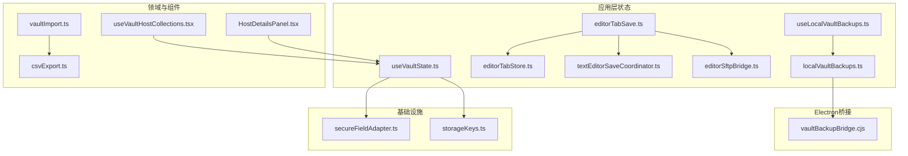
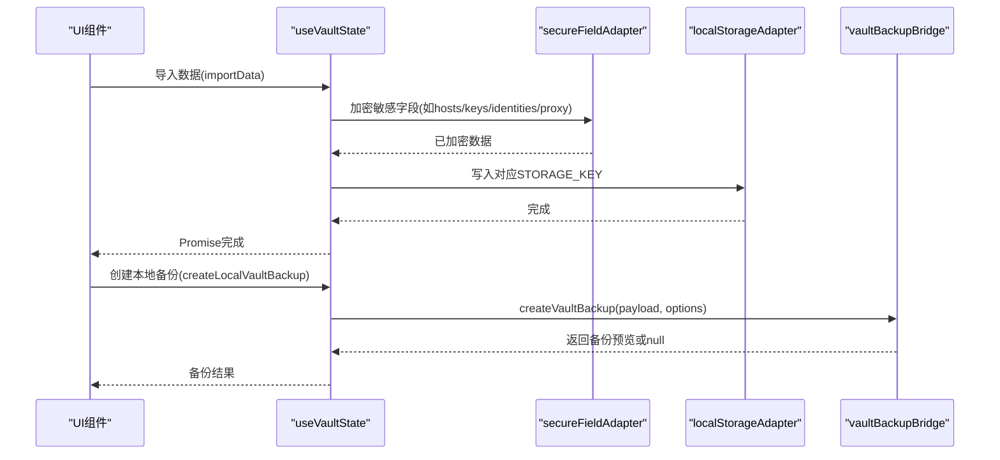
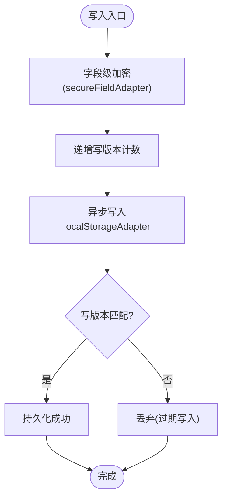
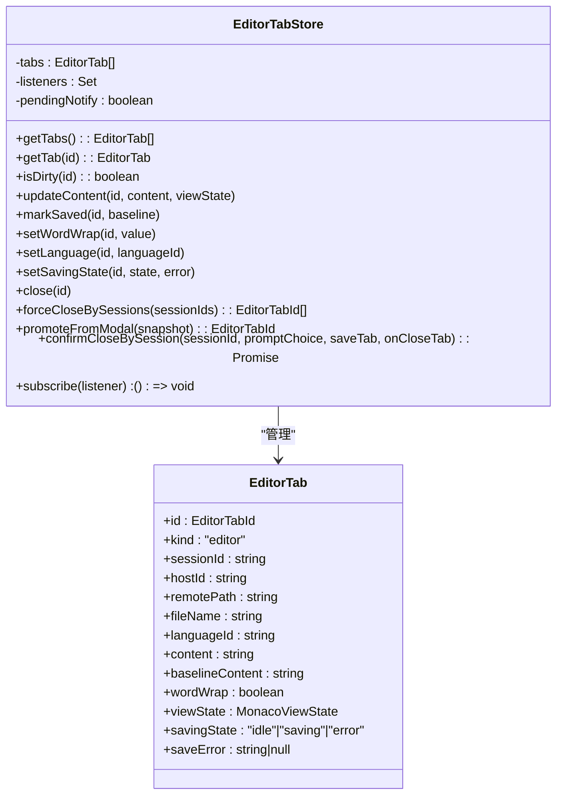
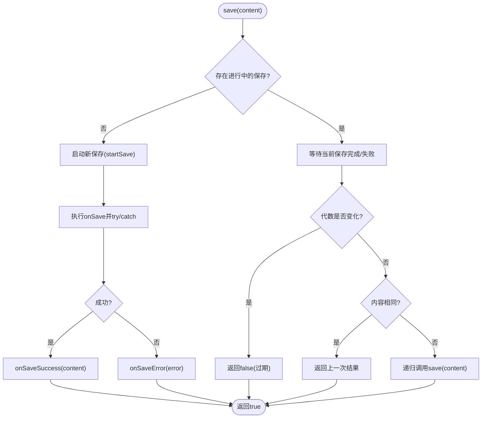
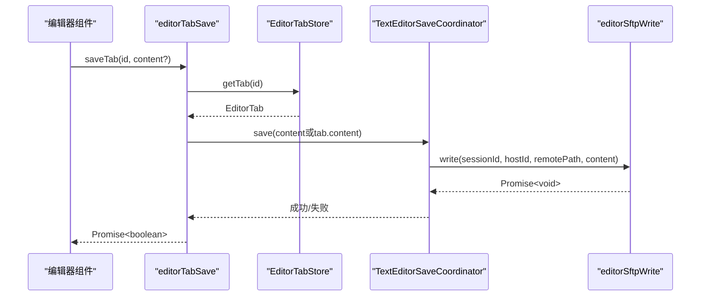
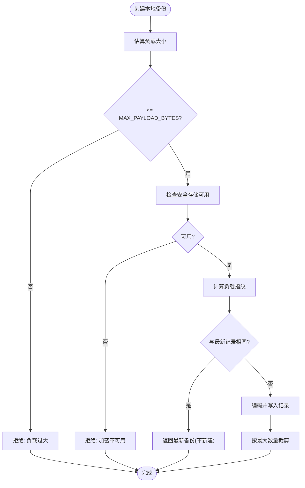
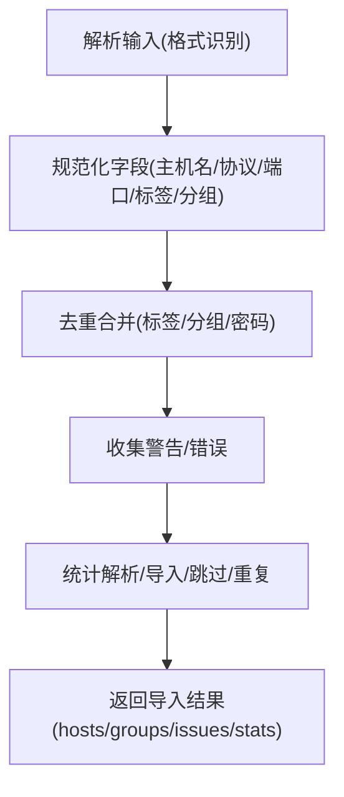
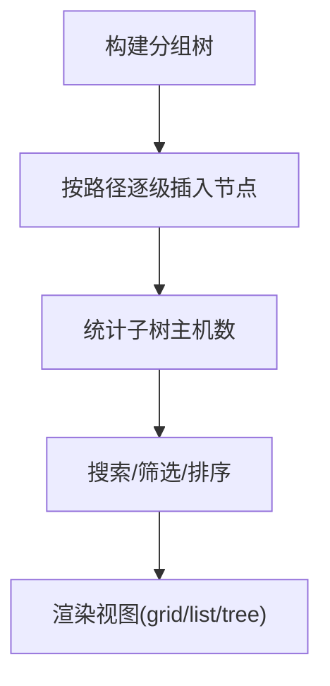
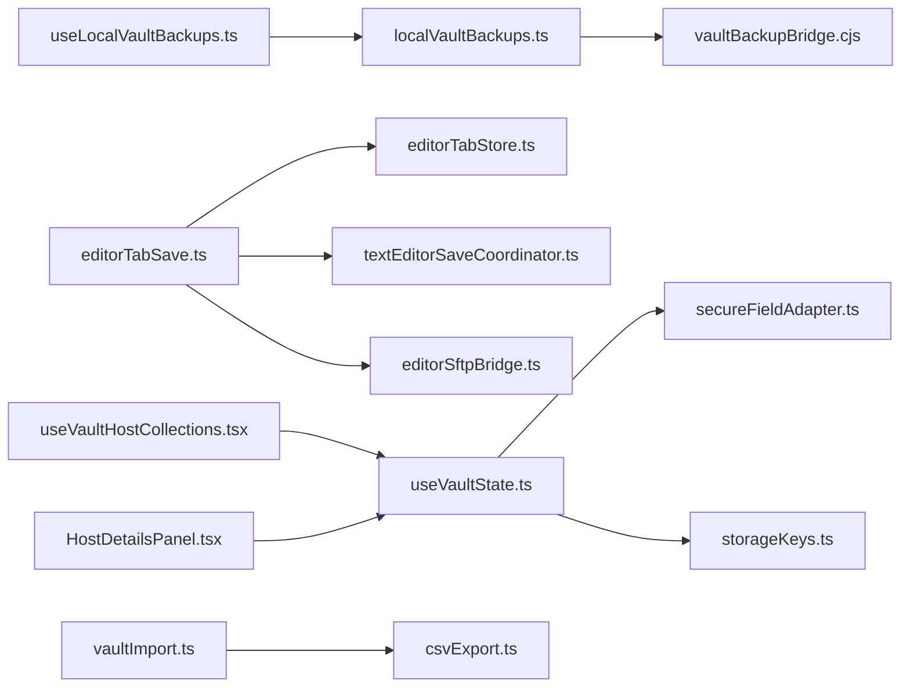

# 保管库状态Hook

<cite>
**本文档引用的文件**
- [useVaultState.ts](file://application/state/useVaultState.ts)
- [editorTabStore.ts](file://application/state/editorTabStore.ts)
- [textEditorSaveCoordinator.ts](file://application/state/textEditorSaveCoordinator.ts)
- [editorTabSave.ts](file://application/state/editorTabSave.ts)
- [editorSftpBridge.ts](file://application/state/editorSftpBridge.ts)
- [useLocalVaultBackups.ts](file://application/state/useLocalVaultBackups.ts)
- [localVaultBackups.ts](file://application/localVaultBackups.ts)
- [secureFieldAdapter.ts](file://infrastructure/persistence/secureFieldAdapter.ts)
- [storageKeys.ts](file://infrastructure/config/storageKeys.ts)
- [vaultImport.ts](file://domain/vaultImport.ts)
- [csvExport.ts](file://domain/vaultImport/csvExport.ts)
- [useVaultHostCollections.tsx](file://components/vault/useVaultHostCollections.tsx)
- [HostDetailsPanel.tsx](file://components/HostDetailsPanel.tsx)
- [vaultBackupBridge.cjs](file://electron/bridges/vaultBackupBridge.cjs)
</cite>

## 目录
1. [简介](#简介)
2. [项目结构](#项目结构)
3. [核心组件](#核心组件)
4. [架构总览](#架构总览)
5. [详细组件分析](#详细组件分析)
6. [依赖关系分析](#依赖关系分析)
7. [性能考量](#性能考量)
8. [故障排查指南](#故障排查指南)
9. [结论](#结论)
10. [附录](#附录)

## 简介
本文件系统性地梳理并文档化保管库状态Hook及相关编辑器与SFTP桥接能力，覆盖以下主题：
- 保管库数据结构与持久化：主机、密钥、身份、代理配置、片段、分组、已知主机、连接日志、Shell历史、托管来源、分组配置等。
- 保管库管理API：导入/导出、备份恢复、同步冲突防护、跨窗口一致性、版本/序列号控制。
- 编辑器标签状态与保存协调：编辑器标签存储、保存协调器、SFTP写入桥接。
- 主机组织与标签管理：分组树构建、标签增删改、搜索与排序、最近连接展示。
- 错误处理与安全策略：字段级加密、平台安全存储可用性检查、备份大小限制、并发互斥。

## 项目结构
围绕保管库状态管理的关键模块分布如下：
- 应用层状态
  - 保管库状态Hook：useVaultState.ts
  - 编辑器标签存储：editorTabStore.ts
  - 文本编辑器保存协调器：textEditorSaveCoordinator.ts
  - 编辑器保存服务：editorTabSave.ts
  - SFTP写入桥接：editorSftpBridge.ts
  - 本地保管库备份Hook：useLocalVaultBackups.ts
  - 本地保管库备份服务：localVaultBackups.ts
- 基础设施
  - 字段级加密适配器：secureFieldAdapter.ts
  - 存储键名常量：storageKeys.ts
- 领域模型与导入
  - 保管库导入解析：vaultImport.ts
  - CSV模板与导出：csvExport.ts
- 组件层
  - 保管库主机集合与视图：useVaultHostCollections.tsx
  - 主机详情面板（分组/标签编辑）：HostDetailsPanel.tsx

**图表来源**
- [useVaultState.ts:112-811](file://application/state/useVaultState.ts#L112-L811)
- [editorTabStore.ts:40-233](file://application/state/editorTabStore.ts#L40-L233)
- [textEditorSaveCoordinator.ts:20-91](file://application/state/textEditorSaveCoordinator.ts#L20-L91)
- [editorTabSave.ts:21-73](file://application/state/editorTabSave.ts#L21-L73)
- [editorSftpBridge.ts:47-70](file://application/state/editorSftpBridge.ts#L47-L70)
- [useLocalVaultBackups.ts:14-96](file://application/state/useLocalVaultBackups.ts#L14-L96)
- [localVaultBackups.ts:116-226](file://application/localVaultBackups.ts#L116-L226)
- [secureFieldAdapter.ts:12-200](file://infrastructure/persistence/secureFieldAdapter.ts#L12-L200)
- [storageKeys.ts:1-169](file://infrastructure/config/storageKeys.ts#L1-L169)
- [vaultImport.ts:1-800](file://domain/vaultImport.ts#L1-L800)
- [csvExport.ts:1-30](file://domain/vaultImport/csvExport.ts#L1-L30)
- [useVaultHostCollections.tsx:24-68](file://components/vault/useVaultHostCollections.tsx#L24-L68)
- [HostDetailsPanel.tsx:724-762](file://components/HostDetailsPanel.tsx#L724-L762)
- [vaultBackupBridge.cjs:391-435](file://electron/bridges/vaultBackupBridge.cjs#L391-L435)

**章节来源**
- [useVaultState.ts:112-811](file://application/state/useVaultState.ts#L112-L811)
- [storageKeys.ts:1-169](file://infrastructure/config/storageKeys.ts#L1-L169)

## 核心组件
- useVaultState：保管库全局状态与持久化入口，提供主机、密钥、身份、代理、片段、自定义分组、片段包、已知主机、Shell历史、连接日志、托管来源、分组配置等的读写与导入导出。
- editorTabStore：编辑器标签内存存储，支持内容更新、脏状态、语言/换行设置、保存状态、按会话批量关闭与强制关闭、从模态弹出提升为标签等。
- textEditorSaveCoordinator：文本编辑器保存协调器，负责串行化保存请求、生成代数、防抖重入、回调通知与错误传播。
- editorTabSave：编辑器标签保存服务，绑定store与SFTP写入桥接，统一处理保存开始、成功、失败状态与错误提示。
- editorSftpBridge：SFTP写入桥接，多实例注册与分发，确保编辑器保存落到正确的SFTP实例。
- useLocalVaultBackups/localVaultBackups：本地保管库备份列表、容量管理、目录打开、读取与创建保护性备份，以及恢复屏障与中断检测。
- secureFieldAdapter：字段级加密/解密适配器，针对敏感字段在localStorage前进行加密。
- storageKeys：所有持久化键名常量，含保管库相关键及恢复屏障、应用中止哨兵等。
- vaultImport/csvExport：保管库导入（CSV/PuTTY/SecureCRT/ssh_config等）与CSV模板导出。
- useVaultHostCollections/HostDetailsPanel：保管库主机集合构建、分组树、标签增删改、搜索/排序、最近连接展示；主机详情面板支持分组与标签编辑。

**章节来源**
- [useVaultState.ts:112-811](file://application/state/useVaultState.ts#L112-L811)
- [editorTabStore.ts:40-233](file://application/state/editorTabStore.ts#L40-L233)
- [textEditorSaveCoordinator.ts:20-91](file://application/state/textEditorSaveCoordinator.ts#L20-L91)
- [editorTabSave.ts:21-73](file://application/state/editorTabSave.ts#L21-L73)
- [editorSftpBridge.ts:47-70](file://application/state/editorSftpBridge.ts#L47-L70)
- [useLocalVaultBackups.ts:14-96](file://application/state/useLocalVaultBackups.ts#L14-L96)
- [localVaultBackups.ts:116-226](file://application/localVaultBackups.ts#L116-L226)
- [secureFieldAdapter.ts:12-200](file://infrastructure/persistence/secureFieldAdapter.ts#L12-L200)
- [storageKeys.ts:1-169](file://infrastructure/config/storageKeys.ts#L1-L169)
- [vaultImport.ts:1-800](file://domain/vaultImport.ts#L1-L800)
- [csvExport.ts:1-30](file://domain/vaultImport/csvExport.ts#L1-L30)
- [useVaultHostCollections.tsx:24-68](file://components/vault/useVaultHostCollections.tsx#L24-L68)
- [HostDetailsPanel.tsx:724-762](file://components/HostDetailsPanel.tsx#L724-L762)

## 架构总览
保管库状态由useVaultState集中管理，采用“写版本计数+读序列计数”防止跨窗口/异步写入竞态；敏感字段通过secureFieldAdapter在localStorage前加密；导入导出通过exportData/importData实现；本地备份通过Electron桥接vaultBackupBridge进行安全存储与并发互斥。

**图表来源**
- [useVaultState.ts:736-770](file://application/state/useVaultState.ts#L736-L770)
- [secureFieldAdapter.ts:118-148](file://infrastructure/persistence/secureFieldAdapter.ts#L118-L148)
- [localVaultBackups.ts:116-226](file://application/localVaultBackups.ts#L116-L226)
- [vaultBackupBridge.cjs:391-435](file://electron/bridges/vaultBackupBridge.cjs#L391-L435)

## 详细组件分析

### useVaultState 保管库状态Hook
- 数据结构与持久化
  - 主机：hosts，支持最后连接时间、发行版归一化、转换已知主机为托管主机。
  - 密钥：keys，支持导入复用、兼容旧格式迁移、字段级加密。
  - 身份：identities，字段级加密。
  - 代理配置：proxyProfiles，字段级加密。
  - 片段：snippets，非加密。
  - 自定义分组：customGroups，非加密。
  - 片段包：snippetPackages，非加密。
  - 已知主机：knownHosts，归一化指纹与类型后持久化。
  - Shell历史：shellHistory，最多保留1000条。
  - 连接日志：connectionLogs，最多保留500条未保存+全部已保存，按开始时间倒序。
  - 托管来源：managedSources，非加密。
  - 分组配置：groupConfigs，字段级加密，写路径同时做模型清理。
- 写入一致性
  - hosts、keys、identities、proxyProfiles、groupConfigs分别维护写版本计数，确保异步加密完成后仍以最新版本写入，避免过期写入。
  - 读取时维护读序列计数，跨窗口storage事件到达时仅应用最新序列，防止乱序覆盖。
- 导入导出
  - exportData：聚合当前保管库数据为可序列化对象。
  - importData/importDataFromString：批量异步加密写入，支持部分字段导入。
- 清空与清理
  - clearVaultData：清空所有保管库数据并移除遗留密钥记录。
- 辅助功能
  - addShellHistoryEntry/clearShellHistory/addConnectionLog/updateConnectionLog/toggleConnectionLogSaved/deleteConnectionLog/clearUnsavedConnectionLogs：历史与日志管理。
  - updateHostLastConnected/updateHostDistro：主机元数据更新。
  - convertKnownHostToHost：将已知主机转换为托管主机并同步更新。

**图表来源**
- [useVaultState.ts:146-163](file://application/state/useVaultState.ts#L146-L163)
- [secureFieldAdapter.ts:118-148](file://infrastructure/persistence/secureFieldAdapter.ts#L118-L148)

**章节来源**
- [useVaultState.ts:112-811](file://application/state/useVaultState.ts#L112-L811)
- [storageKeys.ts:1-169](file://infrastructure/config/storageKeys.ts#L1-L169)
- [secureFieldAdapter.ts:12-200](file://infrastructure/persistence/secureFieldAdapter.ts#L12-L200)

### editorTabStore 编辑器标签状态
- 结构
  - EditorTab：包含会话ID、主机ID、远端路径、文件名、语言ID、内容、基线内容、换行、视图状态、保存状态与错误信息。
- 能力
  - 获取标签列表/单个标签、判断是否脏、更新内容/语言/换行、标记保存、设置保存状态、关闭标签、按会话强制关闭、从模态弹出提升为标签、按会话确认关闭（保存/丢弃/取消）。
- 订阅与通知
  - 使用useSyncExternalStore订阅，内部延迟批量通知，避免重复渲染。

**图表来源**
- [editorTabStore.ts:40-233](file://application/state/editorTabStore.ts#L40-L233)

**章节来源**
- [editorTabStore.ts:40-233](file://application/state/editorTabStore.ts#L40-L233)

### textEditorSaveCoordinator 保存协调器
- 设计要点
  - 保存串行化：同一时刻仅允许一个保存任务进行，后续保存等待当前任务完成或失败后重试。
  - 代数生成：每次保存递增generation，若保存过程中generation变化则视为“过期”，不再触发回调。
  - 回调通知：onSaveStart/onSaveSuccess/onSaveError/onSavingChange。
- 行为流程

**图表来源**
- [textEditorSaveCoordinator.ts:20-91](file://application/state/textEditorSaveCoordinator.ts#L20-L91)

**章节来源**
- [textEditorSaveCoordinator.ts:20-91](file://application/state/textEditorSaveCoordinator.ts#L20-L91)

### editorTabSave 保存服务与SFTP桥接
- 依赖
  - store: EditorTabStore
  - write: EditorSftpWrite（SFTP写入桥接）
- 功能
  - saveTab：根据标签内容或覆盖内容发起保存，统一设置保存状态、成功/失败回调。
  - releaseTab：重置保存协调器，释放资源。
- 错误处理
  - 若标签关闭则直接返回false；保存异常时设置错误状态并提示。

**图表来源**
- [editorTabSave.ts:21-73](file://application/state/editorTabSave.ts#L21-L73)
- [editorSftpBridge.ts:47-70](file://application/state/editorSftpBridge.ts#L47-L70)
- [textEditorSaveCoordinator.ts:20-91](file://application/state/textEditorSaveCoordinator.ts#L20-L91)

**章节来源**
- [editorTabSave.ts:21-73](file://application/state/editorTabSave.ts#L21-L73)
- [editorSftpBridge.ts:47-70](file://application/state/editorSftpBridge.ts#L47-L70)

### 本地保管库备份与恢复屏障
- useLocalVaultBackups
  - 列表刷新、最大备份数量、加密可用性检测、跨窗口广播监听。
- localVaultBackups
  - createLocalVaultBackup：估算负载大小、安全存储可用性检查、去重指纹、写入备份记录、并发互斥、自动裁剪。
  - 恢复屏障：RESTORE_BARRIER_HOLD_MS与心跳刷新，防止并发auto-sync写入。
  - 中断检测：STORAGE_KEY_VAULT_APPLY_IN_PROGRESS用于检测上次应用是否中断。

**图表来源**
- [localVaultBackups.ts:116-226](file://application/localVaultBackups.ts#L116-L226)
- [vaultBackupBridge.cjs:391-435](file://electron/bridges/vaultBackupBridge.cjs#L391-L435)

**章节来源**
- [useLocalVaultBackups.ts:14-96](file://application/state/useLocalVaultBackups.ts#L14-L96)
- [localVaultBackups.ts:116-226](file://application/localVaultBackups.ts#L116-L226)
- [storageKeys.ts:51-74](file://infrastructure/config/storageKeys.ts#L51-L74)
- [vaultBackupBridge.cjs:144-252](file://electron/bridges/vaultBackupBridge.cjs#L144-L252)

### 保管库导入与导出
- 导入
  - 支持格式：CSV、PuTTY注册表、SecureCRT、ssh_config等。
  - 解析与规范化：主机名/协议/端口/用户名/密码/标签/分组等字段解析与去重合并。
  - 代理跳转链：ssh_config支持解析ProxyJump并解析为主机链，循环检测与内联主机创建。
- 导出
  - CSV模板与示例行导出，便于用户导入其他工具。

**图表来源**
- [vaultImport.ts:244-341](file://domain/vaultImport.ts#L244-L341)
- [vaultImport.ts:445-683](file://domain/vaultImport.ts#L445-L683)
- [csvExport.ts:1-30](file://domain/vaultImport/csvExport.ts#L1-L30)

**章节来源**
- [vaultImport.ts:1-800](file://domain/vaultImport.ts#L1-L800)
- [csvExport.ts:1-30](file://domain/vaultImport/csvExport.ts#L1-L30)

### 主机组织与标签管理
- 分组树构建
  - 将分组路径拆分为层级，逐级插入节点，统计子树主机总数。
- 标签管理
  - 修改标签：遍历主机，替换旧标签为新标签，去重。
  - 删除标签：遍历主机，移除指定标签。
- 视图与交互
  - 支持网格/列表/树三种视图模式，搜索过滤、标签筛选、最近连接展示、根部仅显示未分组主机开关。

**图表来源**
- [useVaultHostCollections.tsx:48-68](file://components/vault/useVaultHostCollections.tsx#L48-L68)
- [useVaultHostCollections.tsx:346-383](file://components/vault/useVaultHostCollections.tsx#L346-L383)

**章节来源**
- [useVaultHostCollections.tsx:24-68](file://components/vault/useVaultHostCollections.tsx#L24-L68)
- [HostDetailsPanel.tsx:724-762](file://components/HostDetailsPanel.tsx#L724-L762)

## 依赖关系分析
- useVaultState依赖secureFieldAdapter进行字段级加密，依赖localStorageAdapter进行持久化，依赖storageKeys作为键名常量。
- editorTabSave依赖editorTabStore与textEditorSaveCoordinator，并通过editorSftpBridge与SFTP实例通信。
- useLocalVaultBackups依赖localVaultBackups，后者通过vaultBackupBridge与主进程交互。
- vaultImport与csvExport为保管库导入导出提供数据处理能力。

**图表来源**
- [useVaultState.ts:112-811](file://application/state/useVaultState.ts#L112-L811)
- [secureFieldAdapter.ts:12-200](file://infrastructure/persistence/secureFieldAdapter.ts#L12-L200)
- [storageKeys.ts:1-169](file://infrastructure/config/storageKeys.ts#L1-L169)
- [editorTabSave.ts:21-73](file://application/state/editorTabSave.ts#L21-L73)
- [editorTabStore.ts:40-233](file://application/state/editorTabStore.ts#L40-L233)
- [textEditorSaveCoordinator.ts:20-91](file://application/state/textEditorSaveCoordinator.ts#L20-L91)
- [editorSftpBridge.ts:47-70](file://application/state/editorSftpBridge.ts#L47-L70)
- [useLocalVaultBackups.ts:14-96](file://application/state/useLocalVaultBackups.ts#L14-L96)
- [localVaultBackups.ts:116-226](file://application/localVaultBackups.ts#L116-L226)
- [vaultBackupBridge.cjs:391-435](file://electron/bridges/vaultBackupBridge.cjs#L391-L435)
- [vaultImport.ts:1-800](file://domain/vaultImport.ts#L1-L800)
- [csvExport.ts:1-30](file://domain/vaultImport/csvExport.ts#L1-L30)
- [useVaultHostCollections.tsx:24-68](file://components/vault/useVaultHostCollections.tsx#L24-L68)
- [HostDetailsPanel.tsx:724-762](file://components/HostDetailsPanel.tsx#L724-L762)

**章节来源**
- [useVaultState.ts:112-811](file://application/state/useVaultState.ts#L112-L811)
- [editorTabSave.ts:21-73](file://application/state/editorTabSave.ts#L21-L73)
- [localVaultBackups.ts:116-226](file://application/localVaultBackups.ts#L116-L226)

## 性能考量
- 异步写入与版本控制：通过写版本计数避免竞态写入，减少无效重绘与重复持久化。
- 读序列计数：跨窗口storage事件按序列应用，避免乱序导致的状态回退。
- 保存串行化：textEditorSaveCoordinator串行化保存请求，降低SFTP写入压力与冲突概率。
- 负载估算与并发互斥：vaultBackupBridge在写入前估算负载大小并检查安全存储可用性，避免磁盘填满与明文备份。
- 历史与日志上限：Shell历史与连接日志设置上限，控制内存与IO开销。

[本节为通用性能建议，无需特定文件引用]

## 故障排查指南
- 保管库导入失败
  - 检查CSV列头是否包含主机名字段；确认协议/端口/用户名解析正确；查看导入结果中的issues与stats。
  - ssh_config的ProxyJump循环引用会被检测并移除，注意查看warning消息。
- 本地备份创建失败
  - 确认安全存储可用；检查负载大小是否超过MAX_PAYLOAD_BYTES；查看vaultBackupBridge抛出的具体错误类型。
- 编辑器保存失败
  - 检查editorSftpBridge是否注册了正确的writer；确认会话ID与主机ID匹配；查看保存状态与错误信息。
- 跨窗口状态不同步
  - 确认storage事件监听正常；检查写版本与读序列计数是否一致；避免在解密期间进行本地写入。

**章节来源**
- [vaultImport.ts:244-341](file://domain/vaultImport.ts#L244-L341)
- [vaultBackupBridge.cjs:144-252](file://electron/bridges/vaultBackupBridge.cjs#L144-L252)
- [editorSftpBridge.ts:47-70](file://application/state/editorSftpBridge.ts#L47-L70)
- [useVaultState.ts:566-690](file://application/state/useVaultState.ts#L566-L690)

## 结论
本套保管库状态Hook与编辑器/SFTP桥接方案提供了完整的数据持久化、导入导出、备份恢复与并发控制能力。通过字段级加密、版本/序列计数、保存协调器与恢复屏障等机制，确保了数据安全与一致性。组件间职责清晰、耦合度低，便于扩展与维护。

[本节为总结性内容，无需特定文件引用]

## 附录

### API速查：useVaultState
- 状态访问
  - isInitialized, hosts, keys, identities, proxyProfiles, snippets, customGroups, snippetPackages, knownHosts, shellHistory, connectionLogs, managedSources, groupConfigs
- 更新与写入
  - updateHosts, updateKeys, importOrReuseKey, updateIdentities, updateProxyProfiles, updateSnippets, updateSnippetPackages, updateCustomGroups, updateKnownHosts, updateManagedSources, updateGroupConfigs
- 导入导出
  - exportData, importData, importDataFromString
- 历史与日志
  - addShellHistoryEntry, clearShellHistory, addConnectionLog, updateConnectionLog, toggleConnectionLogSaved, deleteConnectionLog, clearUnsavedConnectionLogs
- 主机元数据
  - updateHostLastConnected, updateHostDistro
- 转换与清理
  - convertKnownHostToHost, clearVaultData

**章节来源**
- [useVaultState.ts:771-811](file://application/state/useVaultState.ts#L771-L811)

### API速查：编辑器标签与保存
- 编辑器标签
  - useEditorTabs, useEditorTab, EditorTabStore: getTabs, getTab, isDirty, updateContent, markSaved, setWordWrap, setLanguage, setSavingState, close, forceCloseBySessions, promoteFromModal, confirmCloseBySession
- 保存协调
  - createTextEditorSaveCoordinator: save, isSaving, reset
- 保存服务
  - saveEditorTab, releaseEditorTabSaveCoordinator

**章节来源**
- [editorTabStore.ts:240-247](file://application/state/editorTabStore.ts#L240-L247)
- [textEditorSaveCoordinator.ts:20-91](file://application/state/textEditorSaveCoordinator.ts#L20-L91)
- [editorTabSave.ts:66-73](file://application/state/editorTabSave.ts#L66-L73)

### API速查：本地备份
- useLocalVaultBackups
  - backups, isLoading, maxBackups, encryptionAvailable, refreshBackups, readBackup, setMaxBackups, openBackupDirectory
- localVaultBackups
  - createLocalVaultBackup, readLocalVaultBackup, openLocalVaultBackupDir, trimLocalVaultBackups, listLocalVaultBackups

**章节来源**
- [useLocalVaultBackups.ts:14-96](file://application/state/useLocalVaultBackups.ts#L14-L96)
- [localVaultBackups.ts:105-226](file://application/localVaultBackups.ts#L105-L226)