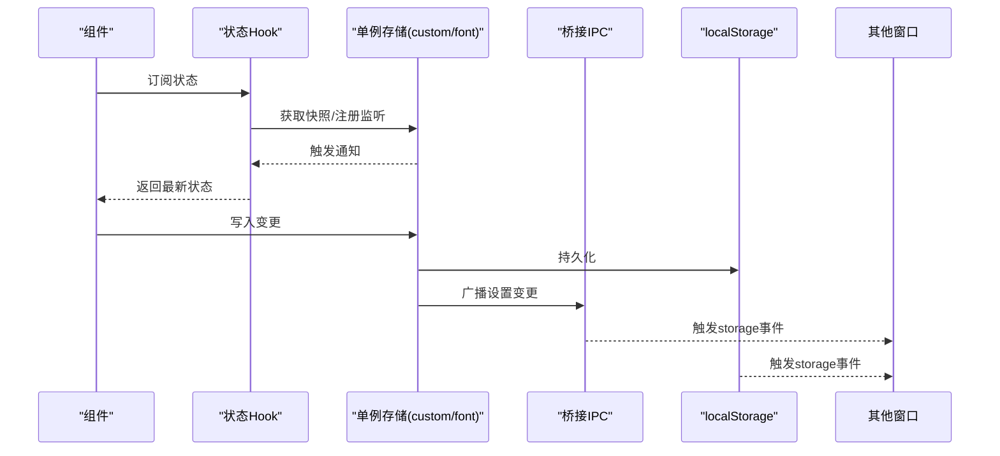
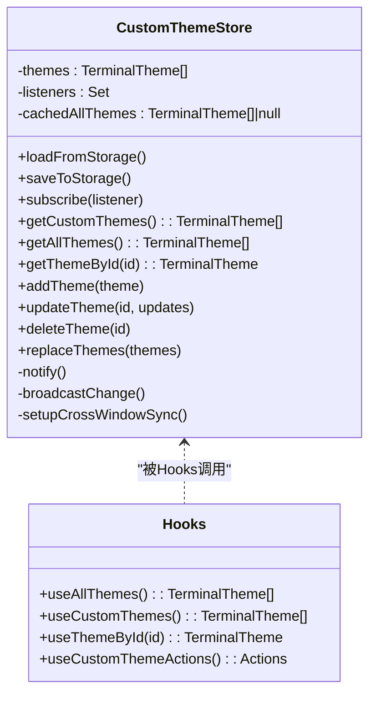
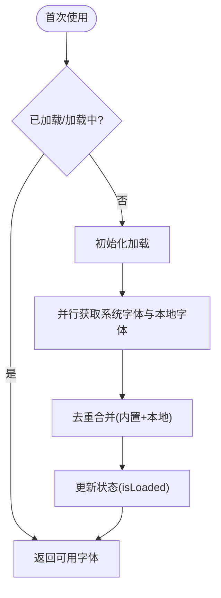
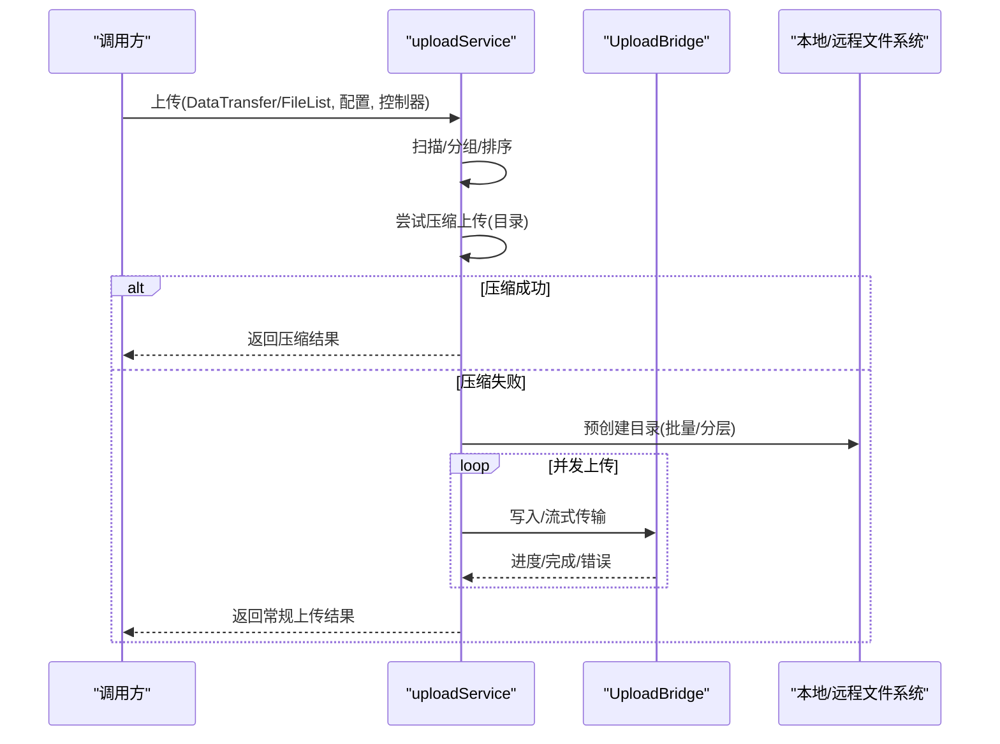
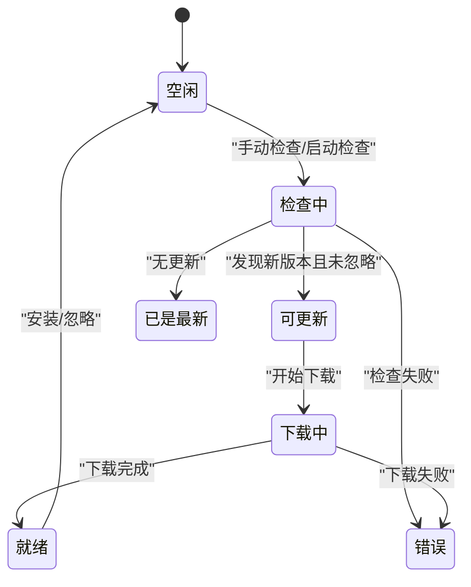
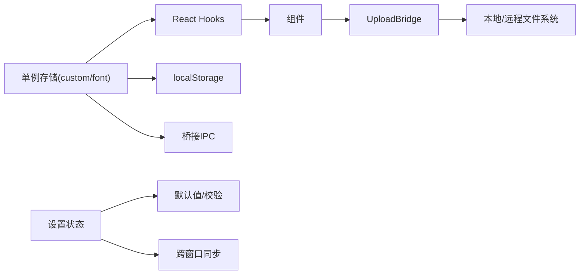

# 工具状态Hook

<cite>
**本文档引用的文件**
- [customThemeStore.ts](file://application/state/customThemeStore.ts)
- [fontStore.ts](file://application/state/fontStore.ts)
- [uploadService.ts](file://lib/uploadService.ts)
- [uploadService.types.ts](file://lib/uploadService.types.ts)
- [logViewState.ts](file://application/state/logViewState.ts)
- [useGlobalHotkeys.ts](file://application/state/useGlobalHotkeys.ts)
- [useUpdateCheck.ts](file://application/state/useUpdateCheck.ts)
- [useTreeExpandedState.ts](file://application/state/useTreeExpandedState.ts)
- [resolveCloseIntent.ts](file://application/state/resolveCloseIntent.ts)
- [resolveSidePanelToggleIntent.ts](file://application/state/resolveSidePanelToggleIntent.ts)
- [resolveSnippetsShortcutIntent.ts](file://application/state/resolveSnippetsShortcutIntent.ts)
- [useApplicationBackend.ts](file://application/state/useApplicationBackend.ts)
- [useSettingsState.ts](file://application/state/useSettingsState.ts)
- [settingsStateDefaults.ts](file://application/state/settingsStateDefaults.ts)
- [settingsStorageSync.ts](file://application/state/settingsStorageSync.ts)
- [useStoredBoolean.ts](file://application/state/useStoredBoolean.ts)
- [useStoredString.ts](file://application/state/useStoredString.ts)
- [useStoredNumber.ts](file://application/state/useStoredNumber.ts)
- [useStoredViewMode.ts](file://application/state/useStoredViewMode.ts)
</cite>

## 目录
1. [简介](#简介)
2. [项目结构](#项目结构)
3. [核心组件](#核心组件)
4. [架构总览](#架构总览)
5. [详细组件分析](#详细组件分析)
6. [依赖关系分析](#依赖关系分析)
7. [性能考虑](#性能考虑)
8. [故障排除指南](#故障排除指南)
9. [结论](#结论)
10. [附录](#附录)

## 简介
本文件系统性梳理与工具状态相关的Hook与服务，覆盖以下主题：
- 主题存储：自定义终端主题的持久化与跨窗口同步
- 字体管理：系统字体加载、可用字体集合与字体选择
- 上传服务：拖拽/文件列表上传、压缩上传、冲突处理与进度回调
- 日志视图状态：连接日志标签页的增删与标识
- 全局热键：应用级快捷键匹配与分发
- 更新检查：自动/手动检查、下载与安装流程
- 树形展开状态：本地存储的展开路径集合
- 关闭意图、侧边栏切换与片段快捷键：根据上下文解析操作
- 应用后端：外部链接打开、应用信息与SSH代理状态
- 设置状态：主题、字体、语言、SFTP行为等的读取、校验与跨窗口同步
- 性能优化与内存管理：懒加载、缓存、去抖与事件监听优化
- 调试方法：日志、演示模式与桥接错误处理

## 项目结构
围绕“工具状态”这一核心，相关代码主要分布在以下位置：
- application/state：状态Hook与业务逻辑（主题、字体、热键、更新、树展开、解析逻辑、应用后端、设置状态）
- lib：通用服务（上传服务、类型定义）
- infrastructure：配置与桥接（存储键、主题/字体配置、桥接服务）

```mermaid
graph TB
subgraph "应用状态(application/state)"
A["customThemeStore.ts<br/>自定义主题存储"]
B["fontStore.ts<br/>字体存储"]
C["useUpdateCheck.ts<br/>更新检查"]
D["useGlobalHotkeys.ts<br/>全局热键"]
E["useTreeExpandedState.ts<br/>树展开状态"]
F["resolveCloseIntent.ts<br/>关闭意图解析"]
G["resolveSidePanelToggleIntent.ts<br/>侧边栏切换解析"]
H["resolveSnippetsShortcutIntent.ts<br/>片段快捷键解析"]
I["useApplicationBackend.ts<br/>应用后端"]
J["useSettingsState.ts<br/>设置状态"]
K["settingsStateDefaults.ts<br/>设置默认与校验"]
L["settingsStorageSync.ts<br/>设置跨窗口同步"]
M["logViewState.ts<br/>日志视图状态"]
end
subgraph "通用服务(lib)"
U1["uploadService.ts<br/>上传服务"]
U2["uploadService.types.ts<br/>上传类型定义"]
end
subgraph "基础设施(infrastructure)"
I1["storageKeys.ts<br/>存储键"]
I2["terminalThemes.ts<br/>终端主题配置"]
I3["fonts.ts<br/>字体配置"]
I4["netcattyBridge.ts<br/>桥接服务"]
end
A --> I2
B --> I3
J --> K
J --> L
C --> I4
I --> I4
U1 --> U2
U1 --> I4
A --> I1
B --> I1
J --> I1
C --> I1
```

图表来源
- [customThemeStore.ts:1-187](file://application/state/customThemeStore.ts#L1-L187)
- [fontStore.ts:1-161](file://application/state/fontStore.ts#L1-L161)
- [uploadService.ts:1-962](file://lib/uploadService.ts#L1-L962)
- [uploadService.types.ts:1-115](file://lib/uploadService.types.ts#L1-L115)
- [useSettingsState.ts:1-970](file://application/state/useSettingsState.ts#L1-L970)
- [settingsStateDefaults.ts:1-159](file://application/state/settingsStateDefaults.ts#L1-L159)
- [settingsStorageSync.ts:1-413](file://application/state/settingsStorageSync.ts#L1-L413)
- [useApplicationBackend.ts:1-45](file://application/state/useApplicationBackend.ts#L1-L45)
- [useUpdateCheck.ts:1-701](file://application/state/useUpdateCheck.ts#L1-L701)

章节来源
- [customThemeStore.ts:1-187](file://application/state/customThemeStore.ts#L1-L187)
- [fontStore.ts:1-161](file://application/state/fontStore.ts#L1-L161)
- [uploadService.ts:1-962](file://lib/uploadService.ts#L1-L962)
- [uploadService.types.ts:1-115](file://lib/uploadService.types.ts#L1-L115)
- [useSettingsState.ts:1-970](file://application/state/useSettingsState.ts#L1-L970)
- [settingsStateDefaults.ts:1-159](file://application/state/settingsStateDefaults.ts#L1-L159)
- [settingsStorageSync.ts:1-413](file://application/state/settingsStorageSync.ts#L1-L413)
- [useApplicationBackend.ts:1-45](file://application/state/useApplicationBackend.ts#L1-L45)
- [useUpdateCheck.ts:1-701](file://application/state/useUpdateCheck.ts#L1-L701)

## 核心组件
- 自定义主题存储（customThemeStore）
  - 单例类封装主题增删改查与跨窗口同步
  - 提供React Hooks用于订阅与获取主题
- 字体存储（fontStore）
  - 单例类封装字体加载、可用字体集合与查询
  - 提供React Hooks用于订阅与获取字体
- 上传服务（uploadService）
  - 支持DataTransfer/FileList上传、目录打包、冲突解决、进度回调
  - 统一桥接接口抽象（本地/远程写入、统计、删除、流式传输）
- 日志视图状态（logViewState）
  - 定义日志视图模型与增删操作
- 全局热键（useGlobalHotkeys）
  - 键盘事件匹配、应用级动作集合、终端透传动作集合
- 更新检查（useUpdateCheck）
  - 自动/手动检查、下载进度、错误处理、跨窗口状态同步
- 树形展开状态（useTreeExpandedState）
  - 基于localStorage的展开路径集合，支持全展/折叠/切换
- 关闭意图解析（resolveCloseIntent）
  - 根据活动标签、工作区与焦点位置决定关闭行为
- 侧边栏切换解析（resolveSidePanelToggleIntent）
  - 打开/关闭侧边栏或回显上次子面板
- 片段快捷键解析（resolveSnippetsShortcutIntent）
  - 切换终端脚本面板或打开Vault片段
- 应用后端（useApplicationBackend）
  - 外部链接打开、应用信息、SSH代理状态
- 设置状态（useSettingsState）
  - 主题、UI字体、语言、终端主题/字体/设置、SFTP行为、编辑器、会话日志、全局热键、自动更新等
- 设置默认与校验（settingsStateDefaults）
  - 默认值、平台适配、校验函数、主题令牌应用
- 设置跨窗口同步（settingsStorageSync）
  - storage事件监听与合并策略
- 存储Hook（useStoredBoolean/String/Number/ViewMode）
  - 通用的localStorage持久化与跨组件同步

章节来源
- [customThemeStore.ts:140-187](file://application/state/customThemeStore.ts#L140-L187)
- [fontStore.ts:117-161](file://application/state/fontStore.ts#L117-L161)
- [uploadService.ts:1-962](file://lib/uploadService.ts#L1-L962)
- [logViewState.ts:1-25](file://application/state/logViewState.ts#L1-L25)
- [useGlobalHotkeys.ts:1-54](file://application/state/useGlobalHotkeys.ts#L1-L54)
- [useUpdateCheck.ts:56-701](file://application/state/useUpdateCheck.ts#L56-L701)
- [useTreeExpandedState.ts:1-47](file://application/state/useTreeExpandedState.ts#L1-L47)
- [resolveCloseIntent.ts:1-35](file://application/state/resolveCloseIntent.ts#L1-L35)
- [resolveSidePanelToggleIntent.ts:1-19](file://application/state/resolveSidePanelToggleIntent.ts#L1-L19)
- [resolveSnippetsShortcutIntent.ts:1-43](file://application/state/resolveSnippetsShortcutIntent.ts#L1-L43)
- [useApplicationBackend.ts:16-45](file://application/state/useApplicationBackend.ts#L16-L45)
- [useSettingsState.ts:99-970](file://application/state/useSettingsState.ts#L99-L970)
- [settingsStateDefaults.ts:1-159](file://application/state/settingsStateDefaults.ts#L1-L159)
- [settingsStorageSync.ts:1-413](file://application/state/settingsStorageSync.ts#L1-L413)
- [useStoredBoolean.ts:1-56](file://application/state/useStoredBoolean.ts#L1-L56)
- [useStoredString.ts:1-29](file://application/state/useStoredString.ts#L1-L29)
- [useStoredNumber.ts:1-30](file://application/state/useStoredNumber.ts#L1-L30)
- [useStoredViewMode.ts:1-24](file://application/state/useStoredViewMode.ts#L1-L24)

## 架构总览
下图展示工具状态的核心交互：状态存储（单例）通过React Hooks暴露给组件；跨窗口同步通过storage事件与桥接IPC；上传服务通过统一桥接接口访问本地/远程能力。

图表来源
- [customThemeStore.ts:85-138](file://application/state/customThemeStore.ts#L85-L138)
- [fontStore.ts:46-106](file://application/state/fontStore.ts#L46-L106)
- [settingsStorageSync.ts:158-413](file://application/state/settingsStorageSync.ts#L158-L413)
- [useSettingsState.ts:539-564](file://application/state/useSettingsState.ts#L539-L564)

## 详细组件分析

### 自定义主题存储（customThemeStore）
- 数据结构
  - 主题数组（含自定义标记），合并后的主题快照缓存
  - 存储键：自定义主题集合
- 关键API
  - 订阅/取消订阅
  - 获取全部主题（内置+自定义）、自定义主题、按ID查找
  - 添加/更新/删除/替换主题
  - 加载/保存/广播/跨窗口同步
- 使用方式
  - 通过Hooks获取主题集合与单个主题
  - 通过动作Hooks执行增删改

图表来源
- [customThemeStore.ts:22-138](file://application/state/customThemeStore.ts#L22-L138)
- [customThemeStore.ts:145-187](file://application/state/customThemeStore.ts#L145-L187)

章节来源
- [customThemeStore.ts:1-187](file://application/state/customThemeStore.ts#L1-L187)

### 字体存储（fontStore）
- 数据结构
  - 可用字体数组、加载状态（isLoading/isLoaded/error）
- 关键API
  - 初始化字体加载（并发查询系统字体与本地字体，去重合并）
  - 获取可用字体、加载状态、按ID查询
  - 首次使用触发初始化
- 使用方式
  - 通过Hooks获取字体集合与加载状态
  - 在应用启动时可预加载

图表来源
- [fontStore.ts:55-106](file://application/state/fontStore.ts#L55-L106)
- [fontStore.ts:125-161](file://application/state/fontStore.ts#L125-L161)

章节来源
- [fontStore.ts:1-161](file://application/state/fontStore.ts#L1-L161)

### 上传服务（uploadService）
- 数据结构与类型
  - 任务信息、进度、结果、回调、桥接接口
- 关键流程
  - 扫描阶段：从DataTransfer或FileList提取条目，识别根目录
  - 压缩上传：对目录尝试压缩上传，失败则回退常规上传
  - 冲突处理：支持停止/跳过/替换/复制命名/合并
  - 目录预创建：按层级批量创建目录
  - 文件上传：支持流式传输与二进制写入，带进度回调
  - 并发控制：固定并发数，RAF节流进度更新
- 使用方式
  - 通过配置对象注入桥接接口与回调
  - 通过控制器支持取消

图表来源
- [uploadService.ts:125-205](file://lib/uploadService.ts#L125-L205)
- [uploadService.ts:297-800](file://lib/uploadService.ts#L297-L800)
- [uploadService.types.ts:50-86](file://lib/uploadService.types.ts#L50-L86)

章节来源
- [uploadService.ts:1-962](file://lib/uploadService.ts#L1-L962)
- [uploadService.types.ts:1-115](file://lib/uploadService.types.ts#L1-L115)

### 日志视图状态（logViewState）
- 数据结构
  - 日志视图项：包含唯一ID、关联连接日志ID与日志对象
- 关键API
  - 生成标签ID
  - 添加日志视图（去重）
  - 移除日志视图

章节来源
- [logViewState.ts:1-25](file://application/state/logViewState.ts#L1-L25)

### 全局热键（useGlobalHotkeys）
- 功能
  - 匹配键盘事件与键位绑定
  - 区分应用级动作与终端透传动作
- 使用方式
  - 在应用顶层监听键盘事件，调用匹配函数决定是否拦截

章节来源
- [useGlobalHotkeys.ts:1-54](file://application/state/useGlobalHotkeys.ts#L1-L54)

### 更新检查（useUpdateCheck）
- 状态
  - 检查中、是否有更新、当前版本、最新发布信息、错误、最后检查时间
  - 自动下载状态（空闲/下载中/就绪/错误）、下载百分比、下载错误
  - 手动检查状态（空闲/检查中/可更新/已是最新/错误）
- 行为
  - 启动延迟检查、节流最近检查时间
  - 读取/写入本地缓存与存储键
  - 订阅主进程IPC事件，同步下载进度/完成/错误
  - 支持演示模式（开发调试）
- API
  - 检查、忽略更新、打开发布页、安装更新、开始下载
  - 返回当前状态与操作函数

图表来源
- [useUpdateCheck.ts:25-48](file://application/state/useUpdateCheck.ts#L25-L48)
- [useUpdateCheck.ts:56-701](file://application/state/useUpdateCheck.ts#L56-L701)

章节来源
- [useUpdateCheck.ts:1-701](file://application/state/useUpdateCheck.ts#L1-L701)

### 树形展开状态（useTreeExpandedState）
- 功能
  - 从localStorage读取展开路径集合
  - 提供切换、全展、折叠操作
  - 自动持久化到localStorage
- 使用场景
  - 文件树、主机树等需要记住展开状态的组件

章节来源
- [useTreeExpandedState.ts:1-47](file://application/state/useTreeExpandedState.ts#L1-L47)

### 关闭意图解析（resolveCloseIntent）
- 输入
  - 活动标签ID、工作区（含焦点会话ID）、标签对应会话、焦点是否在终端内
- 输出
  - 关闭单个标签、关闭终端会话、关闭整个工作区或无操作

章节来源
- [resolveCloseIntent.ts:1-35](file://application/state/resolveCloseIntent.ts#L1-L35)

### 侧边栏切换解析（resolveSidePanelToggleIntent）
- 输入
  - 当前面板是否打开、上次显示的子面板、回退子面板
- 输出
  - 关闭或打开指定子面板

章节来源
- [resolveSidePanelToggleIntent.ts:1-19](file://application/state/resolveSidePanelToggleIntent.ts#L1-L19)

### 片段快捷键解析（resolveSnippetsShortcutIntent）
- 输入
  - 活动标签、标签对应的会话/工作区、终端脚本开关可用性
- 输出
  - 切换终端脚本面板或打开Vault片段面板
- 辅助
  - 侧边栏脚本面板的打开/关闭解析

章节来源
- [resolveSnippetsShortcutIntent.ts:1-43](file://application/state/resolveSnippetsShortcutIntent.ts#L1-L43)

### 应用后端（useApplicationBackend）
- 功能
  - 打开外部链接（优先系统浏览器，失败回退新窗口）
  - 获取应用信息（名称/版本/平台）
  - 检查SSH代理运行状态
- 适用
  - 外链跳转、关于页面、SSH相关提示

章节来源
- [useApplicationBackend.ts:16-45](file://application/state/useApplicationBackend.ts#L16-L45)

### 设置状态（useSettingsState）
- 职责
  - 统一读取/校验/应用/持久化各类设置
  - 跨窗口同步（storage事件与IPC）
  - 主题令牌应用、UI字体、语言、终端主题/字体/设置、SFTP行为、编辑器、会话日志、全局热键、自动更新
- 关键点
  - 默认值与平台适配
  - 字体ID迁移（兼容旧值）
  - 终端设置序列化比较，避免重复广播
  - 自定义键位记录的版本与来源管理

章节来源
- [useSettingsState.ts:99-970](file://application/state/useSettingsState.ts#L99-L970)
- [settingsStateDefaults.ts:1-159](file://application/state/settingsStateDefaults.ts#L1-L159)
- [settingsStorageSync.ts:1-413](file://application/state/settingsStorageSync.ts#L1-L413)

### 存储Hook（useStoredBoolean/String/Number/ViewMode）
- 通用特性
  - 读取/写入localStorage
  - 同窗口自定义事件同步
  - 跨窗口storage事件同步
- 差异
  - Number：惰性持久化，需显式调用persist以减少高频写入
  - Boolean/String/ViewMode：自动持久化

章节来源
- [useStoredBoolean.ts:1-56](file://application/state/useStoredBoolean.ts#L1-L56)
- [useStoredString.ts:1-29](file://application/state/useStoredString.ts#L1-L29)
- [useStoredNumber.ts:1-30](file://application/state/useStoredNumber.ts#L1-L30)
- [useStoredViewMode.ts:1-24](file://application/state/useStoredViewMode.ts#L1-L24)

## 依赖关系分析
- 单例存储与Hooks
  - customThemeStore/fontStore作为单例，通过useSyncExternalStore暴露给组件
- 跨窗口同步
  - storage事件监听与桥接IPC共同实现跨窗口设置同步
- 上传服务依赖
  - 通过UploadBridge抽象访问本地/远程文件系统能力
- 设置状态依赖
  - 依赖默认值校验、UI主题令牌应用、桥接服务与存储键

图表来源
- [customThemeStore.ts:85-138](file://application/state/customThemeStore.ts#L85-L138)
- [fontStore.ts:46-106](file://application/state/fontStore.ts#L46-L106)
- [settingsStorageSync.ts:158-413](file://application/state/settingsStorageSync.ts#L158-L413)
- [uploadService.types.ts:50-86](file://lib/uploadService.types.ts#L50-L86)

章节来源
- [customThemeStore.ts:1-187](file://application/state/customThemeStore.ts#L1-L187)
- [fontStore.ts:1-161](file://application/state/fontStore.ts#L1-L161)
- [settingsStorageSync.ts:1-413](file://application/state/settingsStorageSync.ts#L1-L413)
- [uploadService.types.ts:1-115](file://lib/uploadService.types.ts#L1-L115)

## 性能考虑
- 字体加载
  - 并行获取系统字体与本地字体，去重合并，避免重复请求
  - 首次使用触发初始化，后续复用加载状态
- 主题存储
  - 合并主题数组采用缓存快照，稳定引用减少渲染
  - 变更后失效缓存，确保一致性
- 上传服务
  - 目录预创建按层级并发，减少多次往返
  - 并发限制与RAF节流进度更新，降低主线程压力
  - 流式传输避免大文件内存占用
- 设置同步
  - storage事件监听使用快照ref避免每次重绑
  - 终端设置序列化签名避免重复广播
- 通用存储Hook
  - Number惰性持久化，拖拽等高频场景减少写入次数

## 故障排除指南
- 更新检查
  - 检查失败：查看错误状态与下载错误字段
  - 下载被忽略：确认是否已忽略该版本
  - 主进程检查冲突：等待进行中的检查完成再发起
- 上传服务
  - 压缩上传失败：自动回退常规上传
  - 权限/路径错误：检查目标路径与权限
  - 进度不更新：确认回调与RAF调度
- 设置同步
  - 跨窗口不同步：检查storage事件监听与IPC广播
  - 值无效：确认校验函数与默认回退
- 字体加载
  - 加载失败：降级使用默认字体并记录警告
- 应用后端
  - 外链失败：回退到window.open

章节来源
- [useUpdateCheck.ts:244-262](file://application/state/useUpdateCheck.ts#L244-L262)
- [uploadService.ts:197-201](file://lib/uploadService.ts#L197-L201)
- [settingsStorageSync.ts:158-413](file://application/state/settingsStorageSync.ts#L158-L413)
- [fontStore.ts:96-105](file://application/state/fontStore.ts#L96-L105)
- [useApplicationBackend.ts:17-28](file://application/state/useApplicationBackend.ts#L17-L28)

## 结论
本文档系统化梳理了工具状态相关的Hook与服务，涵盖主题、字体、上传、日志视图、热键、更新、树展开、意图解析、应用后端与设置状态等模块。通过单例存储+React Hooks的模式实现状态共享与跨窗口同步，结合桥接与localStorage实现稳定的持久化与跨进程通信。上传服务在复杂场景下提供完善的冲突处理与进度反馈；设置状态在保证一致性的同时兼顾性能与可维护性。建议在实际使用中遵循惰性持久化、并发控制与事件监听优化的原则，以获得最佳体验。

## 附录
- 关键存储键
  - 自定义主题集合、终端主题、跟随应用主题、终端字体、终端字号、终端设置、UI主题、UI字体、语言、SFTP行为、编辑器、会话日志、全局热键、自动更新等
- 类型参考
  - 上传任务信息、进度、结果、桥接接口、配置参数

章节来源
- [settingsStateDefaults.ts:1-159](file://application/state/settingsStateDefaults.ts#L1-L159)
- [uploadService.types.ts:1-115](file://lib/uploadService.types.ts#L1-L115)