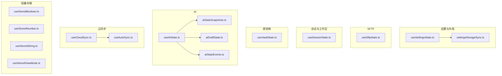
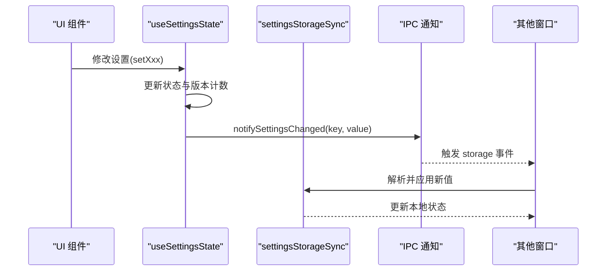
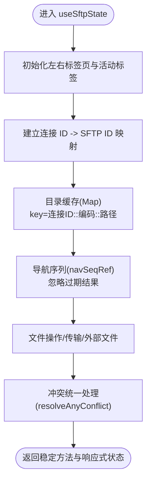
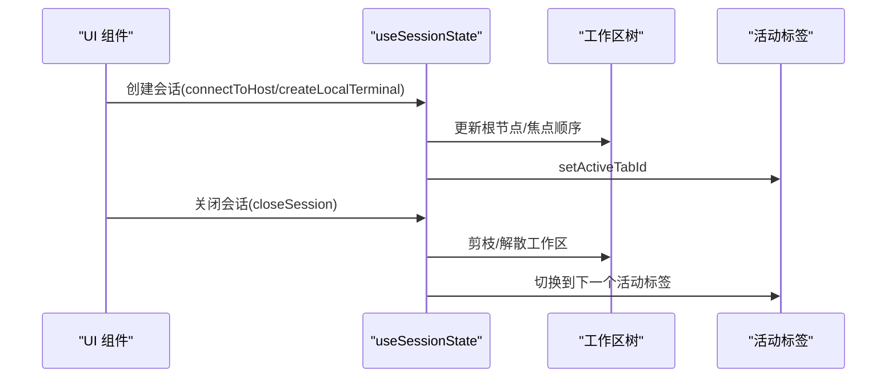
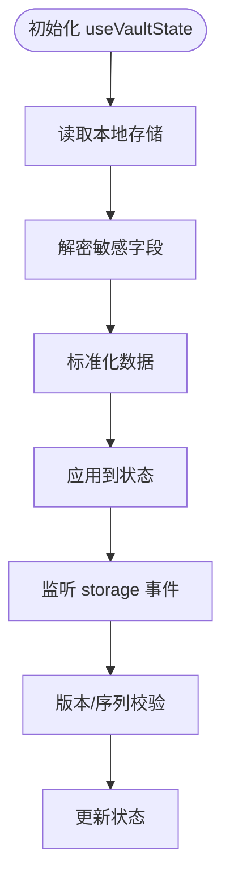
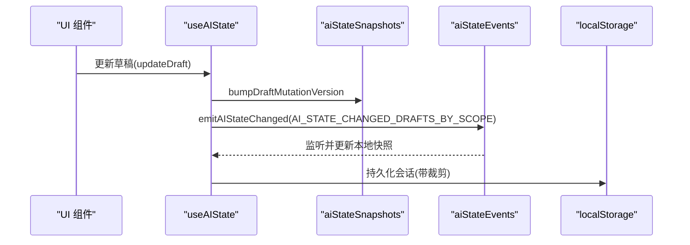
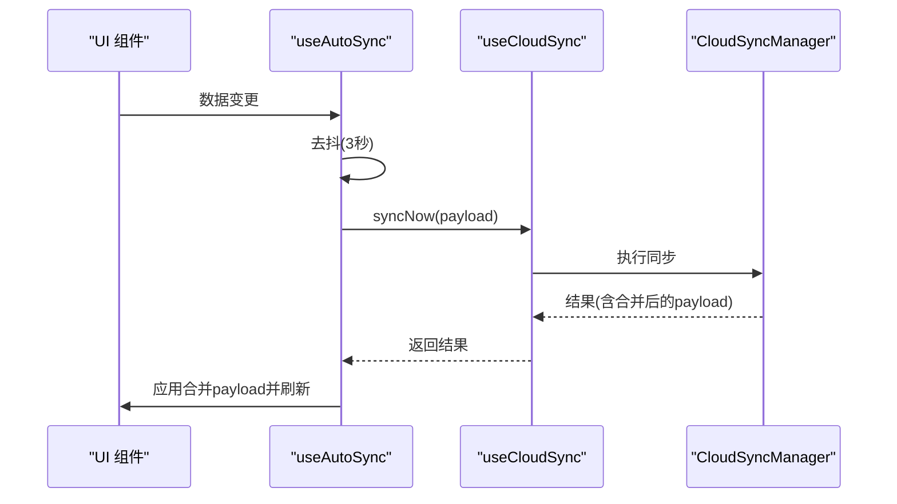
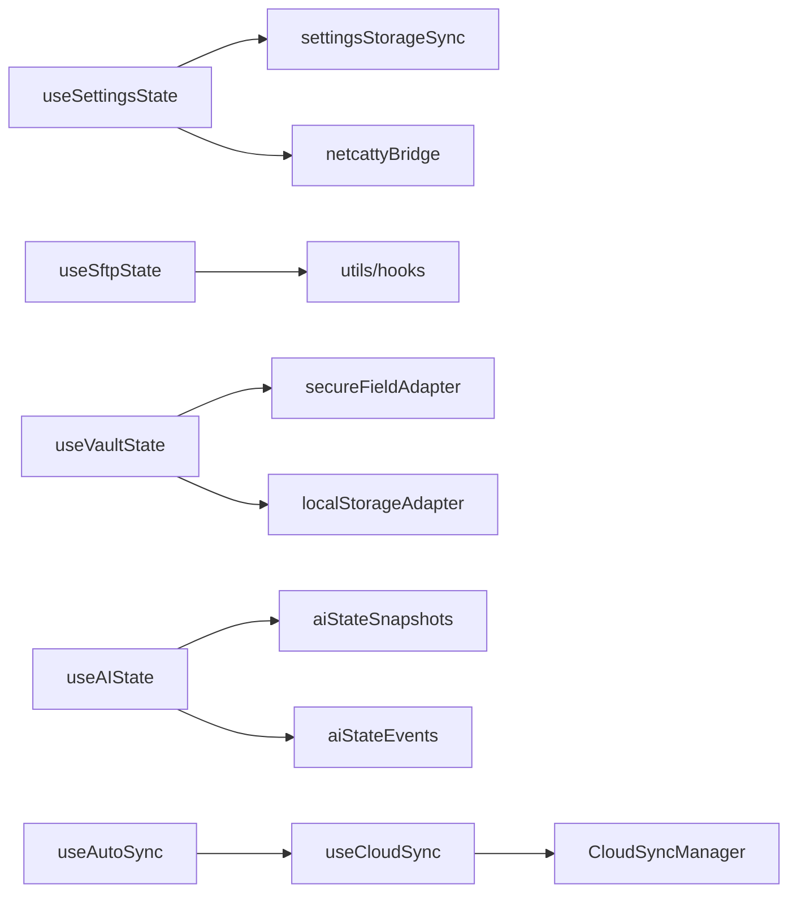

# 状态管理API

<cite>
**本文档引用的文件**
- [useSettingsState.ts](file://application/state/useSettingsState.ts)
- [useSftpState.ts](file://application/state/useSftpState.ts)
- [useSessionState.ts](file://application/state/useSessionState.ts)
- [useVaultState.ts](file://application/state/useVaultState.ts)
- [useAIState.ts](file://application/state/useAIState.ts)
- [useStoredBoolean.ts](file://application/state/useStoredBoolean.ts)
- [useStoredNumber.ts](file://application/state/useStoredNumber.ts)
- [useStoredString.ts](file://application/state/useStoredString.ts)
- [useStoredViewMode.ts](file://application/state/useStoredViewMode.ts)
- [settingsStorageSync.ts](file://application/state/settingsStorageSync.ts)
- [aiStateSnapshots.ts](file://application/state/aiStateSnapshots.ts)
- [aiStateEvents.ts](file://application/state/aiStateEvents.ts)
- [aiDraftState.ts](file://application/state/aiDraftState.ts)
- [useCloudSync.ts](file://application/state/useCloudSync.ts)
- [useAutoSync.ts](file://application/state/useAutoSync.ts)
</cite>

## 目录
1. [简介](#简介)
2. [项目结构](#项目结构)
3. [核心组件](#核心组件)
4. [架构总览](#架构总览)
5. [详细组件分析](#详细组件分析)
6. [依赖关系分析](#依赖关系分析)
7. [性能考量](#性能考量)
8. [故障排除指南](#故障排除指南)
9. [结论](#结论)
10. [附录](#附录)

## 简介
本文件系统性梳理 Netcatty 的状态管理 API，覆盖 React Hooks 的使用方式、状态更新机制、数据获取接口与持久化策略。重点包括：
- 各 Hook 的作用域、状态结构、初始化参数与返回值
- 订阅机制（跨窗口同步、事件派发）
- 副作用处理与异步状态更新
- 持久化、同步策略与冲突解决
- 状态快照、撤销重做与状态导出
- 最佳实践、性能优化与调试方法

## 项目结构
状态管理主要集中在 application/state 目录，按功能域拆分：
- 设置与外观：useSettingsState、settingsStorageSync
- SFTP 文件传输与会话：useSftpState、useSftpConnections、useSftpTransfers 等
- 会话与工作区：useSessionState
- 密钥库与凭据：useVaultState
- AI 对话与草稿：useAIState、aiStateSnapshots、aiDraftState、aiStateEvents
- 云同步：useCloudSync、useAutoSync
- 轻量存储：useStoredBoolean、useStoredNumber、useStoredString、useStoredViewMode



**图表来源**
- [useSettingsState.ts:1-970](file://application/state/useSettingsState.ts#L1-L970)
- [settingsStorageSync.ts:1-413](file://application/state/settingsStorageSync.ts#L1-L413)
- [useSftpState.ts:1-569](file://application/state/useSftpState.ts#L1-L569)
- [useSessionState.ts:1-990](file://application/state/useSessionState.ts#L1-L990)
- [useVaultState.ts:1-811](file://application/state/useVaultState.ts#L1-L811)
- [useAIState.ts:1-1001](file://application/state/useAIState.ts#L1-L1001)
- [aiStateSnapshots.ts:1-227](file://application/state/aiStateSnapshots.ts#L1-L227)
- [aiDraftState.ts:1-283](file://application/state/aiDraftState.ts#L1-L283)
- [aiStateEvents.ts:1-21](file://application/state/aiStateEvents.ts#L1-L21)
- [useCloudSync.ts:1-768](file://application/state/useCloudSync.ts#L1-L768)
- [useAutoSync.ts:1-867](file://application/state/useAutoSync.ts#L1-L867)
- [useStoredBoolean.ts:1-56](file://application/state/useStoredBoolean.ts#L1-L56)
- [useStoredNumber.ts:1-30](file://application/state/useStoredNumber.ts#L1-L30)
- [useStoredString.ts:1-29](file://application/state/useStoredString.ts#L1-L29)
- [useStoredViewMode.ts:1-24](file://application/state/useStoredViewMode.ts#L1-L24)

**章节来源**
- [useSettingsState.ts:1-970](file://application/state/useSettingsState.ts#L1-L970)
- [useSftpState.ts:1-569](file://application/state/useSftpState.ts#L1-L569)
- [useSessionState.ts:1-990](file://application/state/useSessionState.ts#L1-L990)
- [useVaultState.ts:1-811](file://application/state/useVaultState.ts#L1-L811)
- [useAIState.ts:1-1001](file://application/state/useAIState.ts#L1-L1001)
- [useCloudSync.ts:1-768](file://application/state/useCloudSync.ts#L1-L768)
- [useAutoSync.ts:1-867](file://application/state/useAutoSync.ts#L1-L867)
- [useStoredBoolean.ts:1-56](file://application/state/useStoredBoolean.ts#L1-L56)
- [useStoredNumber.ts:1-30](file://application/state/useStoredNumber.ts#L1-L30)
- [useStoredString.ts:1-29](file://application/state/useStoredString.ts#L1-L29)
- [useStoredViewMode.ts:1-24](file://application/state/useStoredViewMode.ts#L1-L24)

## 核心组件
本节概述各状态管理 Hook 的职责与能力边界。

- 设置与外观（useSettingsState）
  - 统一管理主题、语言、字体、终端设置、键盘绑定、SFTP 行为等
  - 提供跨窗口同步、IPC 通知、本地持久化与回放保护
  - 返回稳定方法引用与响应式状态对象

- SFTP（useSftpState）
  - 管理左右面板、标签页、目录缓存、传输任务、文件操作与错误处理
  - 提供稳定的 API 包装，避免回调引用抖动导致的重复渲染

- 会话与工作区（useSessionState）
  - 管理终端会话、工作区树形布局、焦点切换、重排顺序
  - 支持复制会话、运行脚本、日志视图等

- 密钥库（useVaultState）
  - 管理主机、密钥、身份、代理、片段、已知主机、组配置等
  - 提供加密写入、跨窗口同步、版本控制与导入导出

- AI（useAIState）
  - 管理对话会话、草稿、权限模式、工具集成、外部代理与安全设置
  - 支持跨窗口事件派发、快照清理与持久化裁剪

- 云同步（useCloudSync、useAutoSync）
  - 提供主密钥管理、提供商连接、冲突解决、自动同步与远程检查
  - 支持浏览器 OAuth 手柄、设备码流程与回退策略

- 轻量存储（useStoredXxx）
  - 提供布尔、数字、字符串与视图模式的本地持久化与跨窗口同步

**章节来源**
- [useSettingsState.ts:1-970](file://application/state/useSettingsState.ts#L1-L970)
- [useSftpState.ts:1-569](file://application/state/useSftpState.ts#L1-L569)
- [useSessionState.ts:1-990](file://application/state/useSessionState.ts#L1-L990)
- [useVaultState.ts:1-811](file://application/state/useVaultState.ts#L1-L811)
- [useAIState.ts:1-1001](file://application/state/useAIState.ts#L1-L1001)
- [useCloudSync.ts:1-768](file://application/state/useCloudSync.ts#L1-L768)
- [useAutoSync.ts:1-867](file://application/state/useAutoSync.ts#L1-L867)
- [useStoredBoolean.ts:1-56](file://application/state/useStoredBoolean.ts#L1-L56)
- [useStoredNumber.ts:1-30](file://application/state/useStoredNumber.ts#L1-L30)
- [useStoredString.ts:1-29](file://application/state/useStoredString.ts#L1-L29)
- [useStoredViewMode.ts:1-24](file://application/state/useStoredViewMode.ts#L1-L24)

## 架构总览
下图展示状态管理的整体交互：React Hooks 作为状态源，通过本地存储与跨窗口事件实现持久化与同步；云同步模块负责远端一致性与冲突解决。

```mermaid
graph TB
UI["组件层<br/>React 组件"] --> Hooks["状态 Hooks<br/>useSettingsState / useSftpState / useSessionState / useVaultState / useAIState / useCloudSync / useAutoSync"]
Hooks --> LS["本地存储<br/>localStorageAdapter"]
Hooks --> IPC["IPC 通知<br/>netcattyBridge"]
Hooks --> Events["事件系统<br/>storage / CustomEvent"]
Hooks --> Cloud["云同步管理器<br/>CloudSyncManager"]
LS <- --> Events
Hooks --> Events
Hooks --> IPC
Hooks --> Cloud
```

**图表来源**
- [useSettingsState.ts:1-970](file://application/state/useSettingsState.ts#L1-L970)
- [useCloudSync.ts:1-768](file://application/state/useCloudSync.ts#L1-L768)
- [useAutoSync.ts:1-867](file://application/state/useAutoSync.ts#L1-L867)
- [settingsStorageSync.ts:1-413](file://application/state/settingsStorageSync.ts#L1-L413)
- [aiStateEvents.ts:1-21](file://application/state/aiStateEvents.ts#L1-L21)

## 详细组件分析

### 设置与外观（useSettingsState）
- 作用域与状态结构
  - 主题与外观：theme、resolvedTheme、uiThemeId、accentMode、customAccent
  - 语言与字体：uiLanguage、uiFontFamilyId
  - 终端设置：terminalThemeId、followAppTerminalTheme、terminalThemeDark/Light、terminalFontFamilyId、terminalFontSize、terminalSettings
  - 键盘绑定：hotkeyScheme、customKeyBindings、isHotkeyRecording
  - SFTP 默认行为：doubleClickBehavior、autoSync、showHiddenFiles、compressedUpload、autoOpenSidebar、defaultViewMode、transferConcurrency
  - 编辑器与日志：editorWordWrap、sessionLogsEnabled/dir/format
  - 全局开关：globalHotkeyEnabled、autoUpdateEnabled、closeToTray、toggleWindowHotkey、workspaceFocusStyle
- 初始化参数
  - 从 localStorageAdapter 读取初始值，进行合法性校验与迁移
- 返回值
  - 稳定的方法引用（如 setTheme、setTerminalSettings 等）与响应式状态对象
- 订阅机制
  - 通过 useSettingsStorageSync 与 useSettingsIpcSync 实现跨窗口同步与 IPC 通知
  - 使用自定义事件与 storage 事件监听，确保多窗口一致
- 异步状态更新
  - 终端设置与键盘绑定采用签名比对与版本号递增，避免广播风暴
- 持久化与同步策略
  - 写入 localStorage 并通过 IPC 通知其他窗口；合并 incoming 数据时进行版本与来源判定
- 冲突解决
  - 键盘绑定与终端设置采用版本号与来源字段，决定是否应用新值



**图表来源**
- [useSettingsState.ts:1-970](file://application/state/useSettingsState.ts#L1-L970)
- [settingsStorageSync.ts:1-413](file://application/state/settingsStorageSync.ts#L1-L413)

**章节来源**
- [useSettingsState.ts:1-970](file://application/state/useSettingsState.ts#L1-L970)
- [settingsStorageSync.ts:1-413](file://application/state/settingsStorageSync.ts#L1-L413)

### SFTP（useSftpState）
- 作用域与状态结构
  - 左右面板、标签页集合与活动标签
  - 目录列表缓存（带 TTL）、导航序列、连接映射、重连状态
  - 传输任务、冲突、文件操作（创建、删除、重命名、权限变更）
  - 外部文件读写与上传、文件监控计数
- 初始化参数
  - hosts、keys、identities、options（默认显示隐藏文件、自动连接本地等）
- 返回值
  - 稳定方法包装（stableMethods）与响应式状态（leftPane/rightPane/leftTabs/rightTabs/transfers/activeTransfersCount/conflicts）
- 订阅机制
  - 通过 ref 存储方法，避免引用变化导致的重复渲染
- 异步状态更新
  - 目录缓存基于连接 ID 与路径生成键，支持按连接清理与按路径清理
  - 导航序列用于忽略过期异步结果
- 持久化与同步策略
  - 通过连接 ID 映射与缓存键，保证多标签共享同一主机时的正确缓存
- 冲突解决
  - 传输与上传冲突统一聚合，提供统一的 resolveConflict 接口



**图表来源**
- [useSftpState.ts:1-569](file://application/state/useSftpState.ts#L1-L569)

**章节来源**
- [useSftpState.ts:1-569](file://application/state/useSftpState.ts#L1-L569)

### 会话与工作区（useSessionState）
- 作用域与状态结构
  - 会话数组、工作区树、拖拽状态、重命名状态、标签顺序、广播工作区集合、日志视图
- 初始化参数
  - 无
- 返回值
  - 创建/关闭会话、拆分/合并工作区、焦点切换、重排顺序、运行脚本、打开/关闭日志视图等方法
- 订阅机制
  - 通过外部 activeTabStore 管理活动标签
- 异步状态更新
  - 严格模式下使用预计算与微任务队列，避免竞态条件
- 持久化与同步策略
  - 会话与工作区状态在内存中维护，配合工作区树结构与焦点顺序
- 冲突解决
  - 关闭会话时自动清理孤立工作区或降级为独立会话



**图表来源**
- [useSessionState.ts:1-990](file://application/state/useSessionState.ts#L1-L990)

**章节来源**
- [useSessionState.ts:1-990](file://application/state/useSessionState.ts#L1-L990)

### 密钥库（useVaultState）
- 作用域与状态结构
  - 主机、密钥、身份、代理、片段、自定义分组、片段包、已知主机、Shell 历史、连接日志、托管源、组配置
- 初始化参数
  - 无
- 返回值
  - 更新/导入/清空等方法，以及只读状态访问器
- 订阅机制
  - 通过 storage 事件监听跨窗口同步，使用版本计数防止乱序写入
- 异步状态更新
  - 加密写入后异步持久化，读取时解密并校验
- 持久化与同步策略
  - 敏感字段加密存储；非敏感字段直接持久化；版本计数确保最终一致性
- 冲突解决
  - 版本计数与序列号双重校验，丢弃过期事件



**图表来源**
- [useVaultState.ts:1-811](file://application/state/useVaultState.ts#L1-L811)

**章节来源**
- [useVaultState.ts:1-811](file://application/state/useVaultState.ts#L1-L811)

### AI（useAIState）
- 作用域与状态结构
  - 提供商配置、活动提供商/模型、权限模式、工具集成模式、外部代理、命令阻断列表、超时与最大迭代次数
  - 会话列表、活动会话映射、按作用域草稿与面板视图
- 初始化参数
  - 无
- 返回值
  - 设置/更新提供商、权限、工具模式、外部代理、命令阻断、超时、最大迭代次数
  - 会话 CRUD、消息追加/更新、草稿更新、视图切换、冲突清理
- 订阅机制
  - 通过 aiStateEvents 发送自定义事件，useAIState 监听 storage 与自定义事件
  - aiStateSnapshots 提供快照与清理逻辑
- 异步状态更新
  - 会话消息上限裁剪，防内存膨胀；草稿版本与上传代次 bump
- 持久化与同步策略
  - 会话持久化前裁剪；跨窗口事件派发与接收
- 冲突解决
  - 清理孤儿会话与作用域状态；按目标设备修剪



**图表来源**
- [useAIState.ts:1-1001](file://application/state/useAIState.ts#L1-L1001)
- [aiStateSnapshots.ts:1-227](file://application/state/aiStateSnapshots.ts#L1-L227)
- [aiStateEvents.ts:1-21](file://application/state/aiStateEvents.ts#L1-L21)

**章节来源**
- [useAIState.ts:1-1001](file://application/state/useAIState.ts#L1-L1001)
- [aiStateSnapshots.ts:1-227](file://application/state/aiStateSnapshots.ts#L1-L227)
- [aiDraftState.ts:1-283](file://application/state/aiDraftState.ts#L1-L283)
- [aiStateEvents.ts:1-21](file://application/state/aiStateEvents.ts#L1-L21)

### 云同步（useCloudSync、useAutoSync）
- 作用域与状态结构
  - 安全状态、同步状态、提供商连接、冲突信息、错误、设备名、自动同步开关与间隔、版本与时间戳、同步历史
- 初始化参数
  - 无
- 返回值
  - 主密钥设置/解锁/锁定/修改/验证
  - OAuth 连接（GitHub 设备码、Google/OneDrive PKCE）、WebDAV/S3 配置连接
  - 同步/下载/冲突解决/修订历史查询
  - 自动同步配置与运行
- 订阅机制
  - useSyncExternalStore 订阅 CloudSyncManager 状态变化
  - useCloudSync 内部使用 useSyncExternalStore 获取快照
- 异步状态更新
  - 自动同步去抖（3 秒），启动时远程检查与指数退避重试
  - 运行时定期远程检查，受最小间隔限制
- 持久化与同步策略
  - 交叉窗口恢复屏障防止并发写入；中断应用哨兵防止推送半成品
  - 空仓保护：拒绝推送空库到云端
- 冲突解决
  - 下载/合并/回传三步法；收缩阻塞时重置状态并提示用户手动推进



**图表来源**
- [useCloudSync.ts:1-768](file://application/state/useCloudSync.ts#L1-L768)
- [useAutoSync.ts:1-867](file://application/state/useAutoSync.ts#L1-L867)

**章节来源**
- [useCloudSync.ts:1-768](file://application/state/useCloudSync.ts#L1-L768)
- [useAutoSync.ts:1-867](file://application/state/useAutoSync.ts#L1-L867)

### 轻量存储（useStoredXxx）
- 作用域与状态结构
  - useStoredBoolean：布尔值持久化与跨窗口同步
  - useStoredNumber：数值持久化（惰性写入）
  - useStoredString：字符串持久化（可选校验）
  - useStoredViewMode：视图模式持久化
- 初始化参数
  - storageKey、fallback、可选校验函数/范围
- 返回值
  - [value, setter, persist?] 元组
- 订阅机制
  - 自定义事件与 storage 事件监听，实现同窗与跨窗同步
- 异步状态更新
  - 惰性持久化（useStoredNumber）避免高频写入
- 持久化与同步策略
  - 通过 localStorageAdapter 读写；校验失败回退到 fallback

**章节来源**
- [useStoredBoolean.ts:1-56](file://application/state/useStoredBoolean.ts#L1-L56)
- [useStoredNumber.ts:1-30](file://application/state/useStoredNumber.ts#L1-L30)
- [useStoredString.ts:1-29](file://application/state/useStoredString.ts#L1-L29)
- [useStoredViewMode.ts:1-24](file://application/state/useStoredViewMode.ts#L1-L24)

## 依赖关系分析
- 组件耦合
  - useSettingsState 依赖 settingsStorageSync 与 IPC 桥接，形成“状态-持久化-同步”闭环
  - useSftpState 通过 ref 与多个子模块协作，保持方法引用稳定
  - useVaultState 依赖加密适配器与 localStorageAdapter，确保敏感数据安全
  - useAIState 依赖 aiStateSnapshots 与 aiStateEvents，实现跨窗口状态同步与清理
  - useCloudSync 与 useAutoSync 依赖 CloudSyncManager 单例，统一状态与事件
- 外部依赖
  - netcattyBridge：IPC 通信
  - localStorageAdapter：本地存储抽象
  - useSyncExternalStore：外部状态订阅



**图表来源**
- [useSettingsState.ts:1-970](file://application/state/useSettingsState.ts#L1-L970)
- [settingsStorageSync.ts:1-413](file://application/state/settingsStorageSync.ts#L1-L413)
- [useSftpState.ts:1-569](file://application/state/useSftpState.ts#L1-L569)
- [useVaultState.ts:1-811](file://application/state/useVaultState.ts#L1-L811)
- [useAIState.ts:1-1001](file://application/state/useAIState.ts#L1-L1001)
- [aiStateSnapshots.ts:1-227](file://application/state/aiStateSnapshots.ts#L1-L227)
- [aiStateEvents.ts:1-21](file://application/state/aiStateEvents.ts#L1-L21)
- [useCloudSync.ts:1-768](file://application/state/useCloudSync.ts#L1-L768)
- [useAutoSync.ts:1-867](file://application/state/useAutoSync.ts#L1-L867)

**章节来源**
- [useSettingsState.ts:1-970](file://application/state/useSettingsState.ts#L1-L970)
- [useSftpState.ts:1-569](file://application/state/useSftpState.ts#L1-L569)
- [useVaultState.ts:1-811](file://application/state/useVaultState.ts#L1-L811)
- [useAIState.ts:1-1001](file://application/state/useAIState.ts#L1-L1001)
- [useCloudSync.ts:1-768](file://application/state/useCloudSync.ts#L1-L768)
- [useAutoSync.ts:1-867](file://application/state/useAutoSync.ts#L1-L867)

## 性能考量
- 稳定方法引用
  - useSftpState 使用 ref + useMemo 包裹方法，避免回调引用变化导致的重复渲染
- 去抖与批处理
  - useAutoSync 对同步进行 3 秒去抖；useAIState 对会话持久化使用 500ms 延迟批处理
- 缓存与剪枝
  - useSftpState 的目录缓存带 TTL；useAIState 对会话消息与存储条目进行上限裁剪
- 跨窗口同步
  - useSettingsState 与 useVaultState 使用版本计数与序列号，避免乱序写入与无效更新
- 渲染优化
  - 将稳定方法与响应式状态分离，仅在状态变化时触发重渲染

[本节为通用指导，不涉及特定文件分析]

## 故障排除指南
- 设置同步异常
  - 检查 storage 事件监听与 IPC 通知是否正常；确认版本号与来源字段是否正确
- SFTP 缓存问题
  - 确认连接 ID 与路径键生成规则；检查目录缓存 TTL 与清理时机
- 密钥库导入失败
  - 校验加密写入是否成功；检查版本计数与序列号是否被后续事件覆盖
- AI 草稿不同步
  - 确认 aiStateEvents 是否派发；检查快照更新与 mutation 版本 bump
- 云同步卡住
  - 检查自动同步开关与提供商连接状态；查看恢复屏障与中断应用哨兵状态

**章节来源**
- [useSettingsState.ts:1-970](file://application/state/useSettingsState.ts#L1-L970)
- [useSftpState.ts:1-569](file://application/state/useSftpState.ts#L1-L569)
- [useVaultState.ts:1-811](file://application/state/useVaultState.ts#L1-L811)
- [useAIState.ts:1-1001](file://application/state/useAIState.ts#L1-L1001)
- [useCloudSync.ts:1-768](file://application/state/useCloudSync.ts#L1-L768)
- [useAutoSync.ts:1-867](file://application/state/useAutoSync.ts#L1-L867)

## 结论
本状态管理体系以 Hooks 为核心，结合本地存储、跨窗口事件与 IPC 通知，实现了高可用、可扩展且具备冲突处理能力的状态管理方案。通过稳定方法引用、去抖与批处理、缓存与剪枝等策略，兼顾了性能与一致性。建议在新增状态模块时遵循现有模式：明确作用域与状态结构、提供稳定方法、实现跨窗口同步与持久化、设计清晰的冲突解决策略。

[本节为总结性内容，不涉及特定文件分析]

## 附录
- 状态快照与清理
  - useAIState 与 aiStateSnapshots 提供会话与草稿的快照与清理逻辑，支持按作用域修剪
- 撤销重做
  - 当前未提供内置撤销/重做机制；可通过自定义草稿版本与快照实现
- 状态导出
  - useVaultState 提供 exportData/importData/importDataFromString，支持 JSON 导出与导入

**章节来源**
- [aiStateSnapshots.ts:1-227](file://application/state/aiStateSnapshots.ts#L1-L227)
- [useVaultState.ts:1-811](file://application/state/useVaultState.ts#L1-L811)