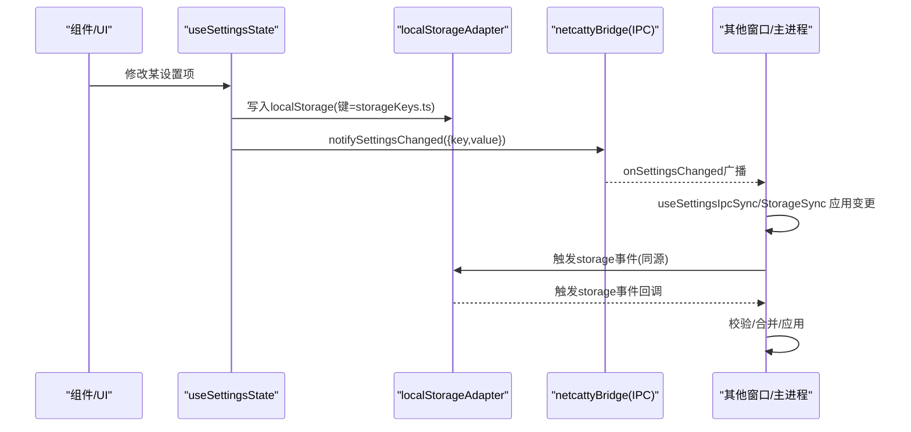
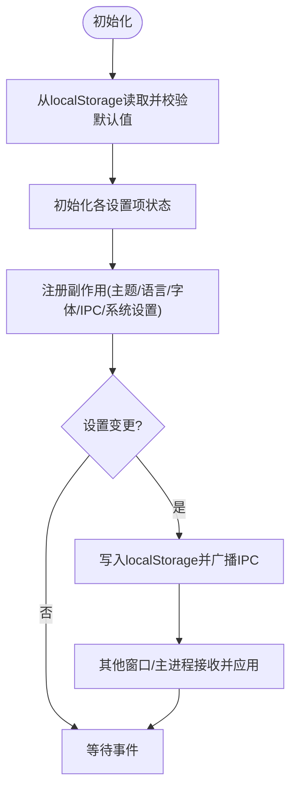
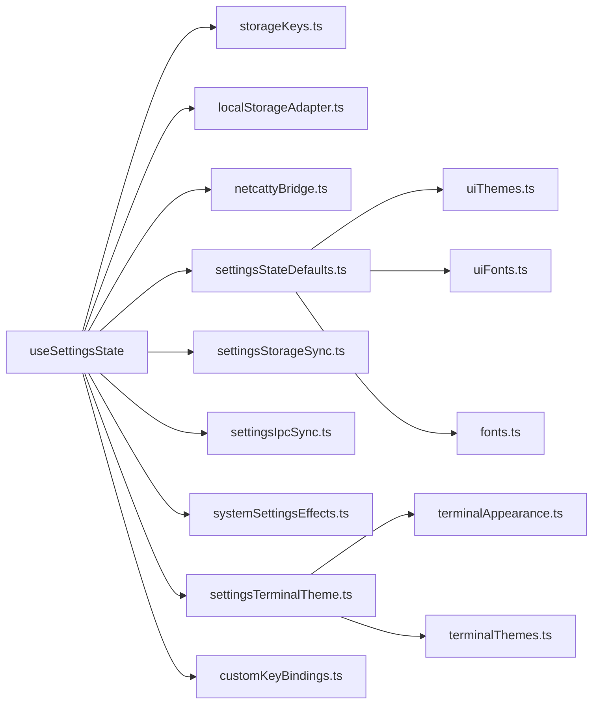

# 设置状态Hook

<cite>
**本文引用的文件**
- [useSettingsState.ts](file://application/state/useSettingsState.ts)
- [useStoredBoolean.ts](file://application/state/useStoredBoolean.ts)
- [useStoredNumber.ts](file://application/state/useStoredNumber.ts)
- [useStoredString.ts](file://application/state/useStoredString.ts)
- [useStoredViewMode.ts](file://application/state/useStoredViewMode.ts)
- [settingsStateDefaults.ts](file://application/state/settingsStateDefaults.ts)
- [settingsStorageSync.ts](file://application/state/settingsStorageSync.ts)
- [settingsIpcSync.ts](file://application/state/settingsIpcSync.ts)
- [systemSettingsEffects.ts](file://application/state/systemSettingsEffects.ts)
- [settingsTerminalTheme.ts](file://application/state/settingsTerminalTheme.ts)
- [storageKeys.ts](file://infrastructure/config/storageKeys.ts)
- [customKeyBindings.ts](file://domain/customKeyBindings.ts)
- [netcattyBridge.ts](file://infrastructure/services/netcattyBridge.ts)
- [localStorageAdapter.ts](file://infrastructure/persistence/localStorageAdapter.ts)
- [uiFontStore.ts](file://application/state/uiFontStore.ts)
- [customThemeStore.ts](file://application/state/customThemeStore.ts)
- [fonts.ts](file://infrastructure/config/fonts.ts)
- [uiThemes.ts](file://infrastructure/config/uiThemes.ts)
- [uiFonts.ts](file://infrastructure/config/uiFonts.ts)
- [i18n.ts](file://infrastructure/config/i18n.ts)
- [terminalAppearance.ts](file://domain/terminalAppearance.ts)
- [terminalThemes.ts](file://infrastructure/config/terminalThemes.ts)
</cite>

## 目录
1. [简介](#简介)
2. [项目结构与定位](#项目结构与定位)
3. [核心组件总览](#核心组件总览)
4. [架构概览](#架构概览)
5. [详细组件分析](#详细组件分析)
6. [依赖关系分析](#依赖关系分析)
7. [性能考量](#性能考量)
8. [故障排查指南](#故障排查指南)
9. [结论](#结论)
10. [附录：API参考与最佳实践](#附录api参考与最佳实践)

## 简介
本文件为“设置状态Hook”的权威API文档，覆盖 useSettingsState、useStoredBoolean、useStoredNumber、useStoredString、useStoredViewMode 等设置管理相关Hook的使用方法与内部机制。内容包括：
- 设置数据结构与默认值管理
- 持久化策略（localStorage）与跨窗口同步（storage事件）
- IPC 同步（多窗口/主进程联动）
- 系统设置效果（全局热键、托盘行为、自动更新）
- 主题、字体、快捷键绑定、视图模式等关键设置项的API说明
- 设置验证、迁移与回滚策略
- 副作用处理、性能优化与调试方法

## 项目结构与定位
- 设置状态Hook位于 application/state 目录，围绕 useSettingsState 为核心，辅以 useStored* 系列Hook与各类同步/效果Hook，形成统一的设置状态管理子系统。
- 配置键名集中于 infrastructure/config/storageKeys.ts，确保键名一致性与可追踪性。
- 默认值与校验逻辑集中在 settingsStateDefaults.ts；跨窗口/IPC同步分别由 settingsStorageSync.ts 与 settingsIpcSync.ts 负责；系统设置副作用由 systemSettingsEffects.ts 处理。

```mermaid
graph TB
subgraph "设置状态层"
U["useSettingsState.ts"]
SB["useStoredBoolean.ts"]
SN["useStoredNumber.ts"]
SS["useStoredString.ts"]
SVM["useStoredViewMode.ts"]
end
subgraph "同步与效果"
SR["settingsStorageSync.ts"]
SI["settingsIpcSync.ts"]
SE["systemSettingsEffects.ts"]
end
subgraph "基础设施"
SK["storageKeys.ts"]
LSA["localStorageAdapter.ts"]
BR["netcattyBridge.ts"]
DEF["settingsStateDefaults.ts"]
CK["customKeyBindings.ts"]
TT["settingsTerminalTheme.ts"]
THEME["uiThemes.ts"]
FONT["fonts.ts"]
UIF["uiFonts.ts"]
TA["terminalAppearance.ts"]
TTS["terminalThemes.ts"]
end
U --> SR
U --> SI
U --> SE
U --> DEF
U --> CK
U --> TT
U --> SK
U --> LSA
U --> BR
U --> THEME
U --> UIF
U --> TA
U --> TTS
SB --> LSA
SN --> LSA
SS --> LSA
SVM --> LSA
```

**图表来源**
- [useSettingsState.ts:1-970](file://application/state/useSettingsState.ts#L1-L970)
- [settingsStorageSync.ts:1-413](file://application/state/settingsStorageSync.ts#L1-L413)
- [settingsIpcSync.ts:1-236](file://application/state/settingsIpcSync.ts#L1-L236)
- [systemSettingsEffects.ts:1-124](file://application/state/systemSettingsEffects.ts#L1-L124)
- [storageKeys.ts:1-169](file://infrastructure/config/storageKeys.ts#L1-L169)
- [settingsStateDefaults.ts:1-159](file://application/state/settingsStateDefaults.ts#L1-L159)
- [customKeyBindings.ts:1-134](file://domain/customKeyBindings.ts#L1-L134)
- [settingsTerminalTheme.ts:1-50](file://application/state/settingsTerminalTheme.ts#L1-L50)
- [uiThemes.ts](file://infrastructure/config/uiThemes.ts)
- [fonts.ts](file://infrastructure/config/fonts.ts)
- [uiFonts.ts](file://infrastructure/config/uiFonts.ts)
- [terminalAppearance.ts](file://domain/terminalAppearance.ts)
- [terminalThemes.ts](file://infrastructure/config/terminalThemes.ts)

**章节来源**
- [useSettingsState.ts:1-970](file://application/state/useSettingsState.ts#L1-L970)
- [storageKeys.ts:1-169](file://infrastructure/config/storageKeys.ts#L1-L169)

## 核心组件总览
- useSettingsState：聚合所有设置项的状态初始化、持久化、跨窗口/IPC同步、系统设置副作用与主题/终端主题解析。
- useStoredBoolean/useStoredNumber/useStoredString/useStoredViewMode：通用的本地存储Hook，提供默认值、校验与跨组件/窗口同步能力。
- settingsStateDefaults：默认值、平台/系统偏好检测、主题令牌应用、终端设置序列化/比较、快捷键绑定记录版本与来源生成。
- settingsStorageSync：基于浏览器 storage 事件的跨窗口同步，按键名分流处理。
- settingsIpcSync：基于 Electron Bridge 的IPC同步，接收主进程/其他窗口变更并应用。
- systemSettingsEffects：系统级设置副作用（全局热键注册、托盘行为、自动更新主进程同步）。
- settingsTerminalTheme：根据应用主题与用户选择解析当前终端主题，并支持跟随UI主题与自定义强调色。

**章节来源**
- [useSettingsState.ts:99-800](file://application/state/useSettingsState.ts#L99-L800)
- [useStoredBoolean.ts:1-56](file://application/state/useStoredBoolean.ts#L1-L56)
- [useStoredNumber.ts:1-30](file://application/state/useStoredNumber.ts#L1-L30)
- [useStoredString.ts:1-29](file://application/state/useStoredString.ts#L1-L29)
- [useStoredViewMode.ts:1-24](file://application/state/useStoredViewMode.ts#L1-L24)
- [settingsStateDefaults.ts:1-159](file://application/state/settingsStateDefaults.ts#L1-L159)
- [settingsStorageSync.ts:1-413](file://application/state/settingsStorageSync.ts#L1-L413)
- [settingsIpcSync.ts:1-236](file://application/state/settingsIpcSync.ts#L1-L236)
- [systemSettingsEffects.ts:1-124](file://application/state/systemSettingsEffects.ts#L1-L124)
- [settingsTerminalTheme.ts:1-50](file://application/state/settingsTerminalTheme.ts#L1-L50)

## 架构概览
设置状态在渲染进程内通过 localStorage 持久化，同时借助 storage 事件与 IPC 实现跨窗口/主进程同步。useSettingsState 负责：
- 初始化：从 localStorage 读取并进行默认值/校验迁移
- 变更：本地状态更新后写入 localStorage，并通过 IPC 广播
- 同步：监听 storage 事件与 IPC 事件，对过期或冲突的设置进行合并与应用
- 效果：对主题、语言、字体、终端主题等即时生效，并通知主进程

**图表来源**
- [useSettingsState.ts:353-359](file://application/state/useSettingsState.ts#L353-L359)
- [settingsIpcSync.ts:95-199](file://application/state/settingsIpcSync.ts#L95-L199)
- [settingsStorageSync.ts:159-370](file://application/state/settingsStorageSync.ts#L159-L370)
- [storageKeys.ts:1-169](file://infrastructure/config/storageKeys.ts#L1-L169)

## 详细组件分析

### useSettingsState：设置状态聚合器
- 数据结构与默认值
  - 主题：light/dark/system，默认 dark；系统偏好通过 matchMedia 监听
  - UI主题：明/暗主题ID，默认随系统主题变化
  - 强调色：HSL字符串或主题色，默认自定义色
  - UI字体：默认UI字体ID，动态加载字体后应用
  - 终端主题：可跟随应用主题或独立设置，支持明/暗分设
  - 终端字体与字号：兼容旧版字体ID迁移
  - 语言：支持国际化，自动解析受支持语言
  - 快捷键方案：pc/mac/disabled，默认按平台推断
  - 自定义快捷键：带版本号与来源的记录，支持三向合并
  - SFTP/编辑/会话日志/工作区焦点样式等：均有默认值与范围校验
- 持久化与同步
  - 每个设置项在变更时写入 localStorage 对应键
  - 通过 IPC 广播变更，触发其他窗口与主进程同步
  - 针对终端设置与自定义快捷键，采用签名/版本/来源策略避免重复广播与冲突
- 系统设置副作用
  - 全局热键注册/注销、托盘行为、自动更新主进程同步
- 主题与终端主题解析
  - 根据 followAppTerminalTheme 决定是否跟随UI主题
  - 支持自定义强调色注入CSS变量并同步到原生窗口标题栏

**图表来源**
- [useSettingsState.ts:99-798](file://application/state/useSettingsState.ts#L99-L798)
- [settingsStateDefaults.ts:10-159](file://application/state/settingsStateDefaults.ts#L10-L159)
- [settingsIpcSync.ts:91-232](file://application/state/settingsIpcSync.ts#L91-L232)
- [settingsStorageSync.ts:158-409](file://application/state/settingsStorageSync.ts#L158-L409)
- [systemSettingsEffects.ts:32-120](file://application/state/systemSettingsEffects.ts#L32-L120)

**章节来源**
- [useSettingsState.ts:99-800](file://application/state/useSettingsState.ts#L99-L800)
- [settingsStateDefaults.ts:10-159](file://application/state/settingsStateDefaults.ts#L10-L159)
- [settingsIpcSync.ts:65-235](file://application/state/settingsIpcSync.ts#L65-L235)
- [settingsStorageSync.ts:114-412](file://application/state/settingsStorageSync.ts#L114-L412)
- [systemSettingsEffects.ts:22-123](file://application/state/systemSettingsEffects.ts#L22-L123)
- [settingsTerminalTheme.ts:18-49](file://application/state/settingsTerminalTheme.ts#L18-L49)

### useStoredBoolean：布尔型设置Hook
- 功能要点
  - 从 localStorage 读取布尔值，无值则使用默认值
  - setValue 支持函数式更新，写入 localStorage 并通过自定义事件与 storage 事件实现同窗/跨窗同步
- 使用建议
  - 适合频繁切换但无需高频率持久化的设置（如显示/隐藏、开关类）

**章节来源**
- [useStoredBoolean.ts:1-56](file://application/state/useStoredBoolean.ts#L1-L56)

### useStoredNumber：数值型设置Hook
- 功能要点
  - 从 localStorage 读取数字，无值则使用默认值；可选范围限制
  - 不在每次变更时自动持久化，需显式调用 persist 完成写入，降低高频更新（如拖拽）对localStorage的压力
- 使用建议
  - 适合拖拽调整、滑杆等高频率变更场景

**章节来源**
- [useStoredNumber.ts:1-30](file://application/state/useStoredNumber.ts#L1-L30)

### useStoredString：字符串型设置Hook
- 功能要点
  - 从 localStorage 读取字符串，无值则使用默认值
  - 可选校验函数，非法值回退到默认值
  - 每次变更自动持久化
- 使用建议
  - 适合语言、字体ID、路径等需要即时持久化的字符串设置

**章节来源**
- [useStoredString.ts:1-29](file://application/state/useStoredString.ts#L1-L29)

### useStoredViewMode：视图模式设置Hook
- 功能要点
  - 限定为 grid/list/tree 三种模式
  - 从 localStorage 读取并校验，无效值回退默认
  - 每次变更自动持久化
- 使用建议
  - 适合列表/树形视图的切换偏好

**章节来源**
- [useStoredViewMode.ts:1-24](file://application/state/useStoredViewMode.ts#L1-L24)

### settingsStateDefaults：默认值与校验工具
- 默认值
  - 主题、UI主题、强调色、终端主题、字体、快捷键方案、SFTP/编辑/日志/工作区等均有明确默认值
- 校验与迁移
  - 主题ID、UI主题ID、UI字体ID、HSL强调色格式校验
  - 终端字体ID迁移：将废弃字体ID重写为安全字体ID并持久化
  - 终端设置序列化/相等性判断，用于去重与广播控制
  - 自定义快捷键记录版本与来源生成，用于冲突解决
- 主题令牌应用
  - 将UI主题令牌与强调色注入CSS变量，并同步原生窗口主题与背景色

**章节来源**
- [settingsStateDefaults.ts:10-159](file://application/state/settingsStateDefaults.ts#L10-L159)

### settingsStorageSync：跨窗口同步
- 机制
  - 监听 storage 事件，按键名分流处理，逐项校验后应用
  - 支持主题、语言、字体、终端主题/跟随开关、终端字体/字号、终端设置、SFTP、编辑、日志、工作区焦点样式、传输并发等
- 性能优化
  - 使用快照引用避免每次变更都重新挂载监听器
  - 对复杂对象采用JSON解析与签名比对，减少不必要更新

**章节来源**
- [settingsStorageSync.ts:114-412](file://application/state/settingsStorageSync.ts#L114-L412)

### settingsIpcSync：IPC同步
- 机制
  - 订阅桥接事件 onSettingsChanged，按键名分流处理
  - 支持外观、语言、字体、终端主题/跟随开关、终端字体/字号、终端设置、编辑、日志、快捷键方案、自定义快捷键、录制状态、全局热键开关、自动更新、SFTP、工作区焦点样式、传输并发等
- 与 storage 同步的关系
  - IPC优先级更高，用于实时跨窗口/主进程联动；storage用于刷新/重启后的恢复

**章节来源**
- [settingsIpcSync.ts:65-235](file://application/state/settingsIpcSync.ts#L65-L235)

### systemSettingsEffects：系统设置副作用
- 全局热键
  - 根据 toggleWindowHotkey 与 globalHotkeyEnabled 注册/注销全局热键，失败时记录错误
- 托盘行为
  - closeToTray 变化时同步至主进程托盘
- 自动更新
  - 首次启动从主进程偏好文件拉取 autoUpdateEnabled 并与本地一致
  - 用户变更时写入localStorage并通知主进程

**章节来源**
- [systemSettingsEffects.ts:22-123](file://application/state/systemSettingsEffects.ts#L22-L123)

### settingsTerminalTheme：终端主题解析
- 机制
  - 当 followAppTerminalTheme 为真时，根据 resolvedTheme 与明/暗终端主题ID解析跟随主题
  - 否则使用 terminalThemeId；最终应用自定义强调色
- 与UI主题联动
  - 当跟随UI主题时，终端主题随UI主题变化而变化

**章节来源**
- [settingsTerminalTheme.ts:18-49](file://application/state/settingsTerminalTheme.ts#L18-L49)

## 依赖关系分析
- 键名集中管理：storageKeys.ts 提供所有设置键名，保证一致性
- 适配器与桥接：localStorageAdapter 负责读写；netcattyBridge 提供IPC通信
- 校验与迁移：settingsStateDefaults 提供统一校验与迁移入口
- 字体与主题：uiFonts.ts、uiThemes.ts、terminalThemes.ts、terminalAppearance.ts 提供字体/主题/终端主题解析与应用
- 快捷键：customKeyBindings.ts 提供快捷键记录结构、版本/来源管理与序列化

**图表来源**
- [useSettingsState.ts:1-970](file://application/state/useSettingsState.ts#L1-L970)
- [storageKeys.ts:1-169](file://infrastructure/config/storageKeys.ts#L1-L169)
- [settingsStateDefaults.ts:1-159](file://application/state/settingsStateDefaults.ts#L1-L159)
- [settingsStorageSync.ts:1-413](file://application/state/settingsStorageSync.ts#L1-L413)
- [settingsIpcSync.ts:1-236](file://application/state/settingsIpcSync.ts#L1-L236)
- [systemSettingsEffects.ts:1-124](file://application/state/systemSettingsEffects.ts#L1-L124)
- [settingsTerminalTheme.ts:1-50](file://application/state/settingsTerminalTheme.ts#L1-L50)
- [customKeyBindings.ts:1-134](file://domain/customKeyBindings.ts#L1-L134)
- [uiThemes.ts](file://infrastructure/config/uiThemes.ts)
- [uiFonts.ts](file://infrastructure/config/uiFonts.ts)
- [fonts.ts](file://infrastructure/config/fonts.ts)
- [terminalAppearance.ts](file://domain/terminalAppearance.ts)
- [terminalThemes.ts](file://infrastructure/config/terminalThemes.ts)

**章节来源**
- [useSettingsState.ts:1-970](file://application/state/useSettingsState.ts#L1-L970)
- [storageKeys.ts:1-169](file://infrastructure/config/storageKeys.ts#L1-L169)

## 性能考量
- 跨窗口同步优化
  - settingsStorageSync 使用快照引用避免重复挂载监听器
  - 对终端设置与自定义快捷键采用签名/版本/来源策略，减少重复广播与无效更新
- 高频变更优化
  - useStoredNumber 显式 persist，避免高频写入localStorage
  - useSettingsState 中对主题/语言/字体等应用前进行“是否变化”判断，避免不必要的DOM操作与IPC
- 渲染与资源
  - UI字体加载完成后才应用，避免闪烁
  - 终端主题跟随UI主题时，仅在resolvedTheme变化时更新

[本节为通用性能建议，不直接分析具体文件]

## 故障排查指南
- 快捷键注册失败
  - 检查 globalHotkeyEnabled 与 toggleWindowHotkey 是否有效
  - 查看 systemSettingsEffects 中的错误回调与控制台日志
- 主题/语言未生效
  - 确认 useSettingsState 是否已调用 applyThemeTokens 与 setLanguage
  - 检查 IPC/Storage 同步是否正常，确认键名一致
- 终端主题未跟随UI主题
  - 检查 followAppTerminalTheme 与 resolvedTheme 是否正确
  - 确认 settingsTerminalTheme 解析流程
- 自定义快捷键冲突
  - 检查版本/来源字段，确认 shouldApplyIncomingCustomKeyBindingsRecord 判定逻辑
- 存储异常
  - 检查 localStorageAdapter 的读写是否成功
  - 确认 storage 事件与 IPC 事件是否被正确订阅/取消

**章节来源**
- [systemSettingsEffects.ts:32-120](file://application/state/systemSettingsEffects.ts#L32-L120)
- [settingsIpcSync.ts:95-199](file://application/state/settingsIpcSync.ts#L95-L199)
- [settingsStorageSync.ts:159-370](file://application/state/settingsStorageSync.ts#L159-L370)
- [customKeyBindings.ts:82-91](file://domain/customKeyBindings.ts#L82-L91)

## 结论
该设置状态体系通过 useSettingsState 聚合了主题、语言、字体、终端主题、快捷键、SFTP、编辑、日志、工作区等全量设置项，结合 localStorage、storage 事件与 IPC 实现了可靠的跨窗口/主进程同步；同时通过默认值、校验与迁移机制保障了升级与回退的稳定性。配合 useStored* 系列Hook与系统设置副作用，整体具备良好的扩展性与可维护性。

[本节为总结性内容，不直接分析具体文件]

## 附录：API参考与最佳实践

### API参考

- useSettingsState
  - 输入：无
  - 返回：包含主题、语言、字体、终端主题、快捷键、SFTP、编辑、日志、工作区等状态与setter，以及 rehydrateAllFromStorage、notifySettingsChanged 等辅助方法
  - 关键点：变更时自动持久化并广播；支持外观/语言/字体/终端主题/快捷键/系统设置等多类同步

- useStoredBoolean(storageKey, fallback)
  - 返回：[value, setValue]
  - 行为：读取布尔值，setValue 写入localStorage并跨窗同步

- useStoredNumber(storageKey, fallback, clamp?)
  - 返回：[value, setValue, persist]
  - 行为：读取数字，persist 显式写入localStorage

- useStoredString(storageKey, fallback, validate?)
  - 返回：[value, setValue]
  - 行为：读取字符串，setValue 自动持久化

- useStoredViewMode(storageKey, fallback)
  - 返回：[viewMode, setViewMode]
  - 行为：限定模式，读取并持久化

**章节来源**
- [useSettingsState.ts:99-800](file://application/state/useSettingsState.ts#L99-L800)
- [useStoredBoolean.ts:1-56](file://application/state/useStoredBoolean.ts#L1-L56)
- [useStoredNumber.ts:1-30](file://application/state/useStoredNumber.ts#L1-L30)
- [useStoredString.ts:1-29](file://application/state/useStoredString.ts#L1-L29)
- [useStoredViewMode.ts:1-24](file://application/state/useStoredViewMode.ts#L1-L24)

### 最佳实践
- 使用 useStoredNumber 的 persist 显式控制写入时机，避免高频拖拽导致的性能问题
- 在 useSettingsState 中尽量复用 setter，避免绕过持久化与广播
- 对于跨窗口/主进程联动的设置，优先使用 useSettingsState 的内置同步，而非手动IPC
- 快捷键设置建议使用自定义记录结构（含版本/来源），便于冲突解决
- 主题与终端主题解析建议启用 followAppTerminalTheme，保持视觉一致性

[本节为通用建议，不直接分析具体文件]