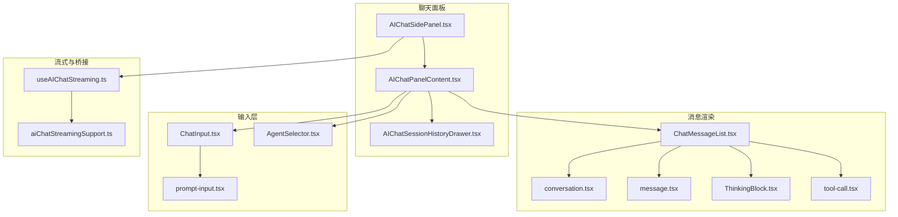
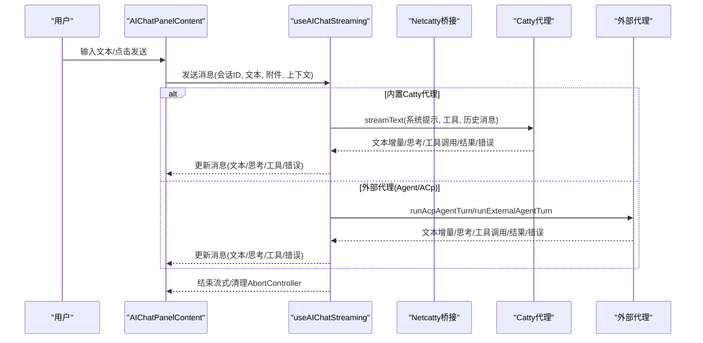
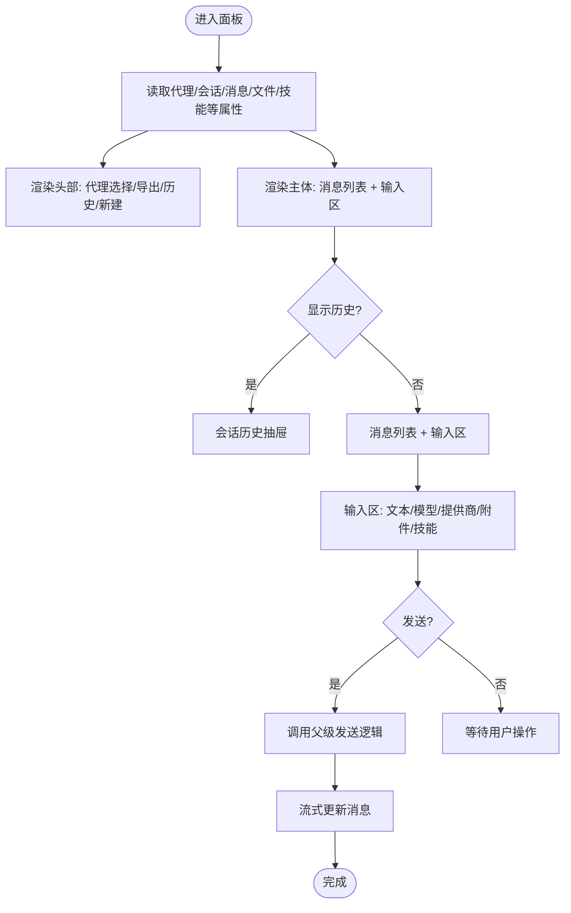
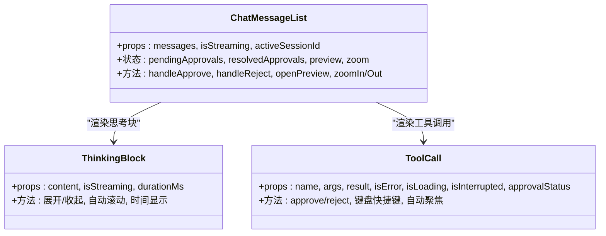
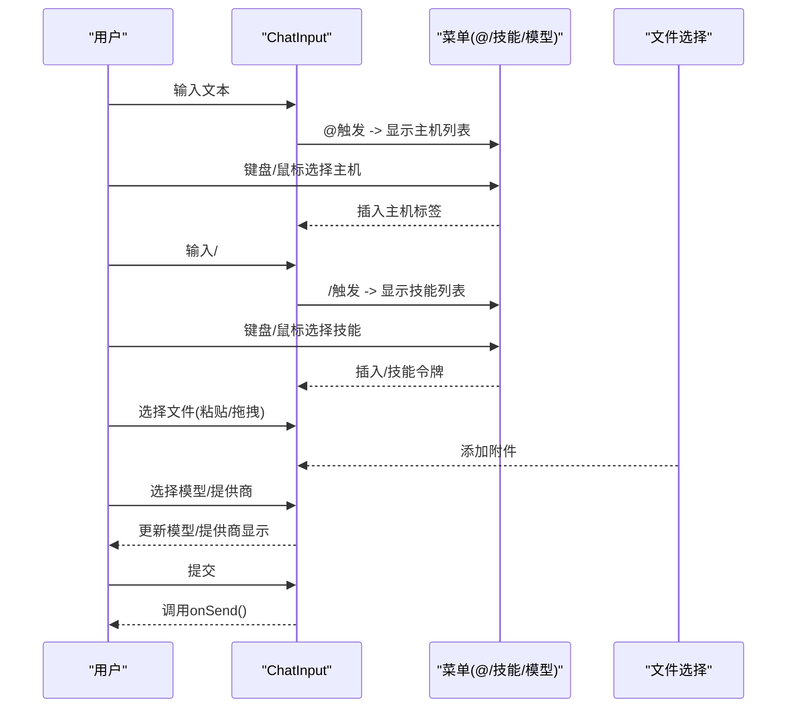
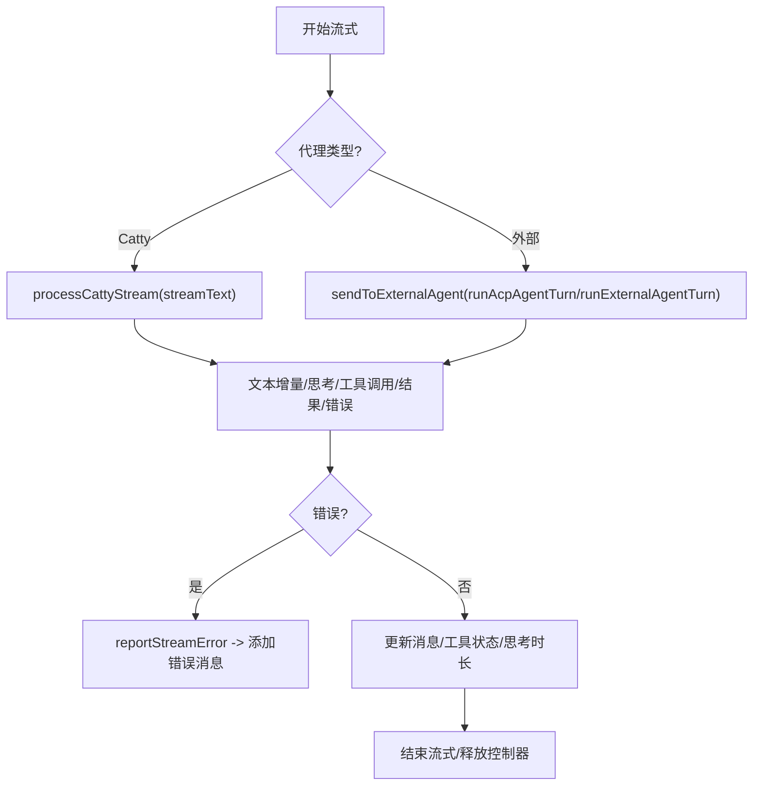
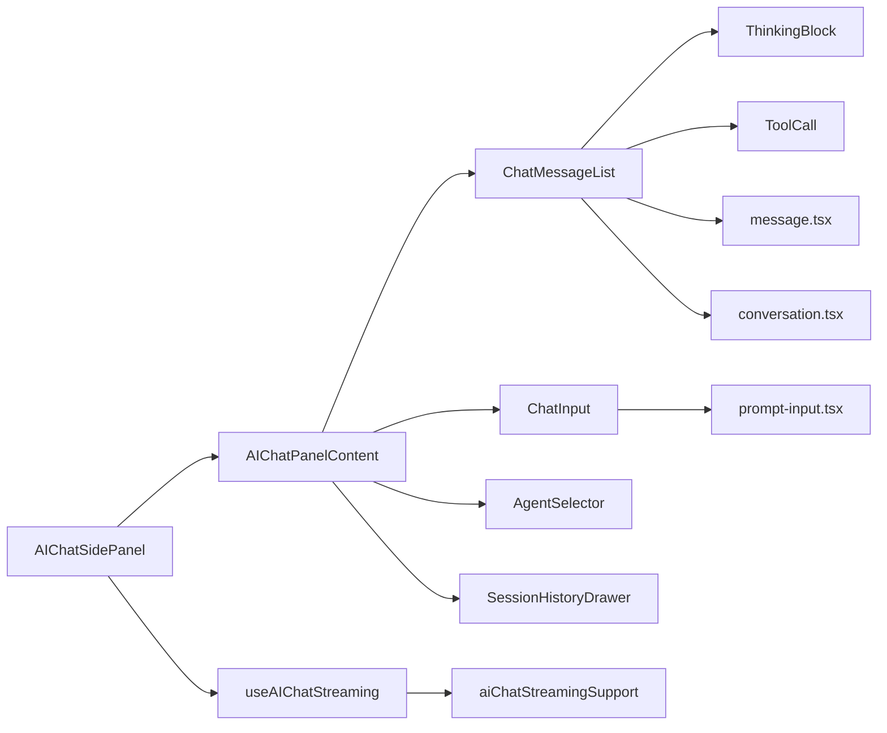

# AI组件

<cite>
**本文档引用的文件**
- [AIChatPanelContent.tsx](file://components/AIChatPanelContent.tsx)
- [AIChatSidePanel.tsx](file://components/AIChatSidePanel.tsx)
- [ChatMessageList.tsx](file://components/ai/ChatMessageList.tsx)
- [ChatInput.tsx](file://components/ai/ChatInput.tsx)
- [ThinkingBlock.tsx](file://components/ai/ThinkingBlock.tsx)
- [conversation.tsx](file://components/ai-elements/conversation.tsx)
- [message.tsx](file://components/ai-elements/message.tsx)
- [prompt-input.tsx](file://components/ai-elements/prompt-input.tsx)
- [tool-call.tsx](file://components/ai-elements/tool-call.tsx)
- [AgentSelector.tsx](file://components/ai/AgentSelector.tsx)
- [useAIChatStreaming.ts](file://components/ai/hooks/useAIChatStreaming.ts)
- [aiChatStreamingSupport.ts](file://components/ai/hooks/aiChatStreamingSupport.ts)
- [aiPanelViewState.ts](file://components/ai/aiPanelViewState.ts)
- [streamdownCodeHighlighter.ts](file://components/ai-elements/streamdownCodeHighlighter.ts)
- [AIChatSessionHistoryDrawer.tsx](file://components/AIChatSessionHistoryDrawer.tsx)
</cite>

## 目录
1. [简介](#简介)
2. [项目结构](#项目结构)
3. [核心组件](#核心组件)
4. [架构总览](#架构总览)
5. [详细组件分析](#详细组件分析)
6. [依赖关系分析](#依赖关系分析)
7. [性能考虑](#性能考虑)
8. [故障排除指南](#故障排除指南)
9. [结论](#结论)
10. [附录](#附录)

## 简介
本文件为Netcatty项目中AI相关组件的详细API文档，覆盖聊天面板、消息列表、输入框、代理选择器、会话历史抽屉、思考过程显示、工具调用与权限审批、流式响应处理与错误恢复、以及代码高亮渲染等能力。文档同时给出组件属性与方法说明、交互流程图、状态管理要点、组合使用模式与扩展建议，并总结性能优化与并发控制最佳实践。

## 项目结构
AI组件主要分布在以下位置：
- 侧边栏聊天面板：负责会话视图解析、发送逻辑、外部/内置代理路由、流式状态管理
- 消息渲染层：消息容器、消息内容、思考块、工具调用卡片、附件预览
- 输入层：提示输入、模型/提供商切换、文件附件、@主机提及、/技能插入、展开折叠
- 工具与钩子：流式处理钩子、桥接支持、用户技能上下文、面板视图解析

**图表来源**
- [AIChatSidePanel.tsx:1-924](file://components/AIChatSidePanel.tsx#L1-L924)
- [AIChatPanelContent.tsx:1-249](file://components/AIChatPanelContent.tsx#L1-L249)
- [ChatMessageList.tsx:1-468](file://components/ai/ChatMessageList.tsx#L1-L468)
- [ChatInput.tsx:1-955](file://components/ai/ChatInput.tsx#L1-L955)
- [useAIChatStreaming.ts:1-927](file://components/ai/hooks/useAIChatStreaming.ts#L1-L927)
- [aiChatStreamingSupport.ts:1-206](file://components/ai/hooks/aiChatStreamingSupport.ts#L1-L206)

**章节来源**
- [AIChatSidePanel.tsx:1-924](file://components/AIChatSidePanel.tsx#L1-L924)
- [AIChatPanelContent.tsx:1-249](file://components/AIChatPanelContent.tsx#L1-L249)

## 核心组件
- 聊天面板容器：负责会话视图解析、代理选择、消息渲染、输入区、会话历史抽屉、导出、新会话、停止发送等
- 消息列表：渲染用户/助手/工具消息，支持思考块、附件预览、工具调用卡片、待审批工具、错误信息、流式指示
- 输入区：文本域、模型/提供商切换、文件附件、@主机提及、/技能插入、展开折叠、提交/停止按钮
- 代理选择器：内置/外部/发现代理菜单，启用/重扫/设置入口
- 流式处理钩子：统一处理Catty内置代理与外部代理（ACP/进程）的流式响应、文本批处理、思考内容、工具调用、错误分类与上报
- 代码高亮：安全的语言检测与高亮，避免不支持语言导致的异常
- 思考块：可折叠的推理/思考过程展示，流式时自动滚动与时间显示
- 工具调用卡片：参数/结果查看、审批状态、键盘快捷键、中断状态

**章节来源**
- [ChatMessageList.tsx:1-468](file://components/ai/ChatMessageList.tsx#L1-L468)
- [ChatInput.tsx:1-955](file://components/ai/ChatInput.tsx#L1-L955)
- [AgentSelector.tsx:1-300](file://components/ai/AgentSelector.tsx#L1-L300)
- [useAIChatStreaming.ts:1-927](file://components/ai/hooks/useAIChatStreaming.ts#L1-L927)
- [streamdownCodeHighlighter.ts:1-78](file://components/ai-elements/streamdownCodeHighlighter.ts#L1-L78)
- [ThinkingBlock.tsx:1-139](file://components/ai/ThinkingBlock.tsx#L1-L139)
- [tool-call.tsx:1-315](file://components/ai-elements/tool-call.tsx#L1-L315)

## 架构总览
AI组件采用“容器-元素”分层设计：
- 容器层：AIChatSidePanel/AIChatPanelContent负责状态聚合、视图解析、发送调度、流式状态与错误处理
- 元素层：消息、输入、思考块、工具调用等UI元素独立封装，通过属性驱动渲染
- 钩子层：useAIChatStreaming统一抽象流式处理细节，屏蔽Catty与外部代理差异
- 桥接层：aiChatStreamingSupport提供桥接类型、工具结果判定、用户技能上下文构建、ID生成等

**图表来源**
- [AIChatPanelContent.tsx:69-249](file://components/AIChatPanelContent.tsx#L69-L249)
- [useAIChatStreaming.ts:172-927](file://components/ai/hooks/useAIChatStreaming.ts#L172-L927)
- [aiChatStreamingSupport.ts:155-206](file://components/ai/hooks/aiChatStreamingSupport.ts#L155-L206)

## 详细组件分析

### 聊天面板容器（AIChatPanelContent）
- 角色：承载头部代理选择、会话历史抽屉、消息列表、输入区、导出、新会话、停止发送等
- 关键属性
  - t: 国际化函数
  - 当前代理ID、外部代理列表、发现代理、是否扫描中、代理变更回调
  - 活动会话、导出回调、历史抽屉开关
  - 新建会话、选择会话、删除会话
  - 消息数组、是否流式、输入值、输入变更、发送/停止
  - 提供商显示名/模型显示名、模型预设、当前模型、模型选择
  - 提供商配置、有效提供商/模型、提供商/模型选择
  - 文件列表、添加/移除文件
  - 终端会话摘要、已选用户技能、技能选项、增删技能
  - 全局权限模式、变更回调
- 关键方法
  - handleExport(format): 导出会话为指定格式
  - handleNewChat(): 清空草稿并进入草稿视图
  - handleSelectSession(sessionId)/handleDeleteSession(event, sessionId)
  - handleSend()/handleStop(): 发送/停止
  - handleAgentChange(agentId)/handleAgentModelSelect(modelId)
  - handleAgentProviderModelSelect(providerId, modelId)
  - addFiles(files)/removeFile(fileId)
  - addSelectedUserSkill(slug)/removeSelectedUserSkill(slug)
  - setShowHistory(flag)

**图表来源**
- [AIChatPanelContent.tsx:69-249](file://components/AIChatPanelContent.tsx#L69-L249)

**章节来源**
- [AIChatPanelContent.tsx:22-67](file://components/AIChatPanelContent.tsx#L22-L67)
- [AIChatPanelContent.tsx:69-249](file://components/AIChatPanelContent.tsx#L69-L249)

### 消息列表（ChatMessageList）
- 角色：渲染所有消息，支持思考块、工具调用、附件预览、待审批工具、错误信息、流式指示
- 关键属性
  - messages: ChatMessage[]
  - isStreaming?: 是否正在流式
  - activeSessionId?: 当前会话ID（用于过滤独立MCP审批块）
- 关键行为
  - 订阅审批门事件，维护待审批/已解决映射
  - 支持图片放大/拖拽/缩放预览
  - 最后一条助手消息标记流式状态
  - 工具调用按出现顺序与结果顺序排列
  - 错误信息卡片，含可重试提示
  - 流式开始但无内容时显示打点动画

**图表来源**
- [ChatMessageList.tsx:30-468](file://components/ai/ChatMessageList.tsx#L30-L468)
- [ThinkingBlock.tsx:14-139](file://components/ai/ThinkingBlock.tsx#L14-L139)
- [tool-call.tsx:116-315](file://components/ai-elements/tool-call.tsx#L116-L315)

**章节来源**
- [ChatMessageList.tsx:30-468](file://components/ai/ChatMessageList.tsx#L30-L468)

### 输入区（ChatInput）
- 角色：Zed风格底部输入区，支持多行展开、模型/提供商切换、文件附件、@主机提及、/技能插入、权限模式（内置代理）
- 关键属性
  - value, onChange, onSend, onStop, isStreaming, disabled
  - providerName/modelName/agentName, 占位符
  - modelPresets/selectedModelId/onModelSelect
  - files/onAddFiles/onRemoveFile
  - hosts/selectedUserSkills/userSkills/onAddUserSkill/onRemoveUserSkill
  - permissionMode/onPermissionModeChange
  - providerSwitcher(仅内置代理)
- 关键行为
  - @触发弹出主机列表，支持键盘上下导航与回车选择
  - /触发弹出技能列表，支持模糊查询与键盘导航
  - 文件粘贴/拖拽上传
  - 模型/提供商切换弹窗，内置代理显示提供商图标+默认模型
  - 展开/收起文本域
  - 提交时触发onSend

**图表来源**
- [ChatInput.tsx:55-99](file://components/ai/ChatInput.tsx#L55-L99)
- [ChatInput.tsx:174-336](file://components/ai/ChatInput.tsx#L174-L336)
- [ChatInput.tsx:526-717](file://components/ai/ChatInput.tsx#L526-L717)

**章节来源**
- [ChatInput.tsx:55-99](file://components/ai/ChatInput.tsx#L55-L99)
- [ChatInput.tsx:174-336](file://components/ai/ChatInput.tsx#L174-L336)

### 代理选择器（AgentSelector）
- 角色：内置/外部/发现代理菜单，支持启用发现代理、重扫、打开设置
- 关键属性
  - currentAgentId, externalAgents, discoveredAgents, isDiscovering
  - onSelectAgent, onEnableDiscoveredAgent, onRediscover, onManageAgents
- 关键行为
  - 分组显示内置与外部代理
  - 未配置的发现代理显示启用按钮
  - 设置入口跳转到全局设置窗口

**章节来源**
- [AgentSelector.tsx:25-34](file://components/ai/AgentSelector.tsx#L25-L34)
- [AgentSelector.tsx:118-299](file://components/ai/AgentSelector.tsx#L118-L299)

### 会话历史抽屉（AIChatSessionHistoryDrawer）
- 角色：右侧抽屉展示历史会话，支持选择与删除
- 关键属性
  - sessions, activeSessionId, onSelect, onDelete, onClose
- 关键行为
  - 相对时间格式化
  - 选中项高亮
  - 删除按钮带提示

**章节来源**
- [AIChatSessionHistoryDrawer.tsx:14-94](file://components/AIChatSessionHistoryDrawer.tsx#L14-L94)
- [AIChatSessionHistoryDrawer.tsx:100-113](file://components/AIChatSessionHistoryDrawer.tsx#L100-L113)

### 流式处理钩子（useAIChatStreaming）
- 角色：统一处理Catty内置代理与外部代理的流式响应，包括文本增量、思考内容、工具调用、工具结果、错误分类与上报
- 关键返回
  - streamingSessionIds: 当前流式会话集合
  - setStreamingForScope: 设置/清除流式状态
  - abortControllersRef: 会话级AbortController映射
  - processCattyStream: 处理Catty代理流
  - sendToCattyAgent: 发送到Catty代理
  - sendToExternalAgent: 发送到外部代理
  - reportStreamError: 报告流式错误
- 关键上下文
  - SendToCattyContext: 提供商/模型/作用域/权限/终端会话/Web搜索/用户技能等
  - SendToExternalContext: 历史消息/终端会话/默认目标会话/提供商/模型/工具集成模式/用户技能

**图表来源**
- [useAIChatStreaming.ts:96-167](file://components/ai/hooks/useAIChatStreaming.ts#L96-L167)
- [useAIChatStreaming.ts:243-514](file://components/ai/hooks/useAIChatStreaming.ts#L243-L514)
- [useAIChatStreaming.ts:520-657](file://components/ai/hooks/useAIChatStreaming.ts#L520-L657)
- [useAIChatStreaming.ts:663-927](file://components/ai/hooks/useAIChatStreaming.ts#L663-L927)

**章节来源**
- [useAIChatStreaming.ts:96-167](file://components/ai/hooks/useAIChatStreaming.ts#L96-L167)
- [useAIChatStreaming.ts:243-514](file://components/ai/hooks/useAIChatStreaming.ts#L243-L514)

### 代码高亮（streamdownCodeHighlighter）
- 角色：安全的代码高亮插件，支持语言别名与不支持语言降级为纯文本
- 关键能力
  - 语言规范化与别名映射
  - 不支持语言返回纯文本高亮结果
  - 与Streamdown插件组合使用

**章节来源**
- [streamdownCodeHighlighter.ts:40-78](file://components/ai-elements/streamdownCodeHighlighter.ts#L40-L78)

### 思考块（ThinkingBlock）
- 角色：可折叠的思考/推理块，流式时自动展开并显示耗时
- 关键行为
  - 流式开始自动展开并计时
  - 流式结束自动收起并显示预览
  - 支持最大高度与顶部渐隐遮罩
  - 自动滚动到底部

**章节来源**
- [ThinkingBlock.tsx:14-139](file://components/ai/ThinkingBlock.tsx#L14-L139)

### 工具调用卡片（tool-call）
- 角色：展示工具名称、参数、结果、错误、加载/中断/审批状态
- 关键行为
  - 解析显示命令（支持不同工具表面的参数形态）
  - 格式化工具结果（stdout/stderr/退出码）
  - 待审批时自动滚动与焦点管理
  - 键盘Enter/Escape快速批准/拒绝

**章节来源**
- [tool-call.tsx:116-315](file://components/ai-elements/tool-call.tsx#L116-L315)

### 消息与对话元素（message, conversation）
- 角色：消息容器与对话滚动容器，提供粘底、滚动按钮、Markdown渲染与代码高亮
- 关键能力
  - Conversation/Content提供滚动粘底与内容区域
  - Message/MessageContent区分用户/助手样式
  - MessageResponse使用Streamdown渲染Markdown与代码高亮

**章节来源**
- [conversation.tsx:7-55](file://components/ai-elements/conversation.tsx#L7-L55)
- [message.tsx:9-86](file://components/ai-elements/message.tsx#L9-L86)

### 提示输入（prompt-input）
- 角色：简化版提示输入组件，支持提交/停止、状态指示、键盘提交
- 关键状态
  - idle/submitted/streaming/error
  - 停止按钮在运行时显示

**章节来源**
- [prompt-input.tsx:147-215](file://components/ai-elements/prompt-input.tsx#L147-L215)

### 面板视图解析（aiPanelViewState）
- 角色：根据草稿、持久化会话、最新会话决定初始面板视图
- 关键函数
  - resolveDisplayedPanelView: 解析显示视图
  - normalizePanelView: 校验会话存在性
  - resolveDisplayedSession: 获取当前会话
  - applyHistorySessionSelection/applyDraftEntrySelection: 应用选择动作

**章节来源**
- [aiPanelViewState.ts:20-95](file://components/ai/aiPanelViewState.ts#L20-L95)

## 依赖关系分析
- 组件耦合
  - AIChatSidePanel是顶层容器，依赖useAIChatStreaming进行流式处理；依赖AIChatPanelContent组织UI；依赖AIChatSessionHistoryDrawer提供历史抽屉
  - AIChatPanelContent依赖AgentSelector、ChatMessageList、ChatInput、Conversation/message/ThinkingBlock/tool-call
  - ChatMessageList依赖ThinkingBlock、ToolCall、Streamdown代码高亮
  - ChatInput依赖PromptInput、AgentSelector、ProviderSwitcher
  - useAIChatStreaming依赖aiChatStreamingSupport提供桥接与工具结果判定
- 外部依赖
  - Vercel AI SDK streamText用于Catty代理流式
  - Streamdown用于Markdown与代码高亮
  - use-stick-to-bottom用于消息滚动粘底

**图表来源**
- [AIChatSidePanel.tsx:48-46](file://components/AIChatSidePanel.tsx#L48-L46)
- [AIChatPanelContent.tsx:69-114](file://components/AIChatPanelContent.tsx#L69-L114)
- [ChatMessageList.tsx:37-51](file://components/ai/ChatMessageList.tsx#L37-L51)
- [useAIChatStreaming.ts:172-177](file://components/ai/hooks/useAIChatStreaming.ts#L172-L177)
- [aiChatStreamingSupport.ts:155-206](file://components/ai/hooks/aiChatStreamingSupport.ts#L155-L206)

**章节来源**
- [AIChatSidePanel.tsx:48-46](file://components/AIChatSidePanel.tsx#L48-L46)
- [AIChatPanelContent.tsx:69-114](file://components/AIChatPanelContent.tsx#L69-L114)
- [ChatMessageList.tsx:37-51](file://components/ai/ChatMessageList.tsx#L37-L51)
- [useAIChatStreaming.ts:172-177](file://components/ai/hooks/useAIChatStreaming.ts#L172-L177)

## 性能考虑
- 文本批处理与帧刷新
  - 使用requestAnimationFrame批量合并文本增量，减少频繁DOM更新
  - 在reasoning/text切换时取消待刷写入，保证顺序正确
- 流式状态与控制器
  - 每会话独立AbortController，避免竞态与泄漏
  - 流式状态集中管理并通过订阅通知更新
- 渲染优化
  - ChatMessageList对消息数组浅比较，避免不必要的重渲染
  - MessageResponse对children与isAnimating做浅比较
  - ThinkingBlock与ToolCall使用memo化
- 资源管理
  - 流结束时释放reader锁与待刷写入
  - 图片预览缩放/拖拽状态在关闭时复位
- 并发控制
  - draft发送加锁，防止重复提交
  - 多会话并行流式，各自独立状态与控制器

[本节为通用指导，无需特定文件引用]

## 故障排除指南
- 错误分类与展示
  - reportStreamError将错误分类并注入最后一条助手消息的errorInfo字段，支持可重试提示
- 工具结果错误判定
  - isToolResultError支持对象与字符串两种形式的错误标识，避免误判
- 流式状态机错误抑制
  - 对第三方后端的SDK流式状态机错误进行过滤，避免产生孤立占位消息
- 用户技能上下文
  - resolveUserSkillsContext在超时或失败时回退到显式选择的技能描述

**章节来源**
- [useAIChatStreaming.ts:212-237](file://components/ai/hooks/useAIChatStreaming.ts#L212-L237)
- [aiChatStreamingSupport.ts:50-73](file://components/ai/hooks/aiChatStreamingSupport.ts#L50-L73)
- [useAIChatStreaming.ts:466-502](file://components/ai/hooks/useAIChatStreaming.ts#L466-L502)
- [aiChatStreamingSupport.ts:181-205](file://components/ai/hooks/aiChatStreamingSupport.ts#L181-L205)

## 结论
该AI组件体系以容器-元素分层设计实现高内聚低耦合，通过useAIChatStreaming统一抽象流式细节，结合消息渲染、输入与代理选择器形成完整的聊天体验。思考块、工具调用卡片与代码高亮增强了可解释性与可观测性。配合完善的错误分类与恢复机制、性能优化策略与并发控制，满足复杂终端场景下的AI对话需求。

[本节为总结，无需特定文件引用]

## 附录

### 组件属性与方法速查
- AIChatPanelContent
  - 属性：t, currentAgentId, externalAgents, discoveredAgents, isDiscovering, handleAgentChange, handleEnableDiscoveredAgent, rediscover, handleOpenSettings, activeSession, handleExport, showHistory, setShowHistory, handleNewChat, historySessions, activeSessionId, handleSelectSession, handleDeleteSession, messages, isStreaming, inputValue, setInputValue, handleSend, handleStop, canSendCurrentAgent, providerDisplayName, modelDisplayName, agentModelPresets, selectedAgentModel, handleAgentModelSelect, cattyConfiguredProviders, effectiveActiveProvider, effectiveActiveModelId, handleAgentProviderModelSelect, files, addFiles, removeFile, terminalSessions, selectedUserSkills, userSkillOptions, addSelectedUserSkill, removeSelectedUserSkill, globalPermissionMode, setGlobalPermissionMode
  - 方法：handleExport, handleNewChat, handleSelectSession, handleDeleteSession, handleSend, handleStop, handleAgentModelSelect, handleAgentProviderModelSelect, addFiles, removeFile, addSelectedUserSkill, removeSelectedUserSkill
- ChatMessageList
  - 属性：messages, isStreaming, activeSessionId
  - 方法：handleApprove, handleReject, openPreview, zoomIn, zoomOut
- ChatInput
  - 属性：value, onChange, onSend, onStop, isStreaming, disabled, providerName, modelName, agentName, placeholder, modelPresets, selectedModelId, onModelSelect, files, onAddFiles, onRemoveFile, hosts, selectedUserSkills, userSkills, onAddUserSkill, onRemoveUserSkill, permissionMode, onPermissionModeChange, providerSwitcher
  - 方法：@提及/ /技能插入、文件粘贴/拖拽、模型/提供商切换、展开/收起
- AgentSelector
  - 属性：currentAgentId, externalAgents, discoveredAgents, isDiscovering, onSelectAgent, onEnableDiscoveredAgent, onRediscover, onManageAgents
- useAIChatStreaming
  - 返回：streamingSessionIds, setStreamingForScope, abortControllersRef, processCattyStream, sendToCattyAgent, sendToExternalAgent, reportStreamError
  - 上下文：SendToCattyContext, SendToExternalContext

**章节来源**
- [AIChatPanelContent.tsx:22-67](file://components/AIChatPanelContent.tsx#L22-L67)
- [ChatMessageList.tsx:30-41](file://components/ai/ChatMessageList.tsx#L30-L41)
- [ChatInput.tsx:55-99](file://components/ai/ChatInput.tsx#L55-L99)
- [AgentSelector.tsx:25-34](file://components/ai/AgentSelector.tsx#L25-L34)
- [useAIChatStreaming.ts:96-167](file://components/ai/hooks/useAIChatStreaming.ts#L96-L167)

### 组合使用模式与扩展建议
- 组合模式
  - 草稿模式：在AIChatPanelContent中通过clearScopeDraft与showScopeDraftView切换至草稿视图，再通过createSession进入会话视图
  - 多会话并行：每个会话拥有独立AbortController与流式状态，互不影响
  - 权限与工具：通过globalPermissionMode与toolIntegrationMode控制Catty代理的工具执行范围
- 扩展建议
  - 自定义代理：实现ExternalAgentConfig并接入sendToExternalAgent路径
  - 自定义工具：在Catty代理侧注册工具，流式中自动识别工具调用与结果
  - 自定义代码高亮：替换或扩展streamdownCodeHighlighter中的语言支持
  - 自定义思考块：扩展ThinkingBlock以支持更多元数据展示

**章节来源**
- [AIChatSidePanel.tsx:584-600](file://components/AIChatSidePanel.tsx#L584-L600)
- [useAIChatStreaming.ts:520-657](file://components/ai/hooks/useAIChatStreaming.ts#L520-L657)
- [streamdownCodeHighlighter.ts:40-78](file://components/ai-elements/streamdownCodeHighlighter.ts#L40-L78)