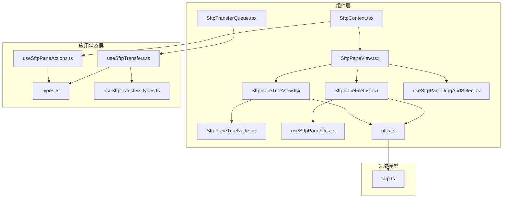
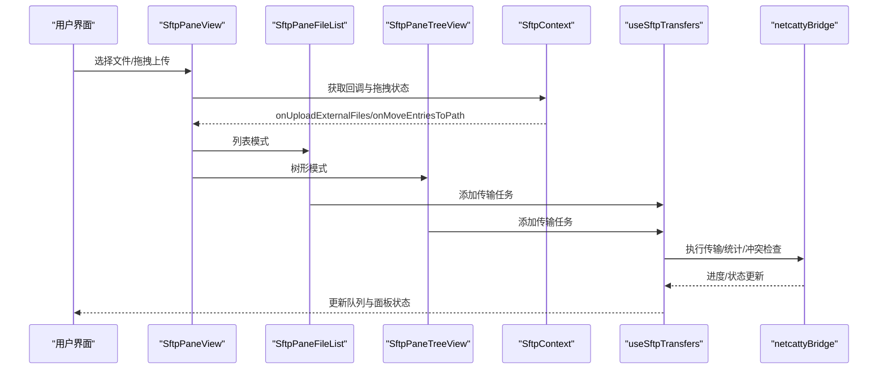
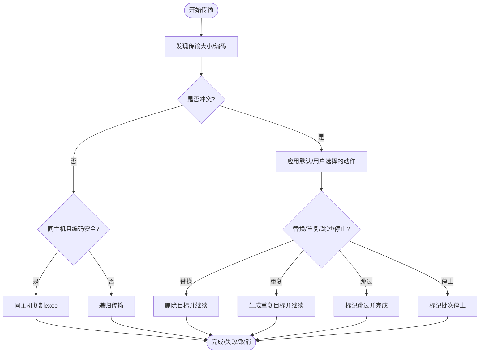
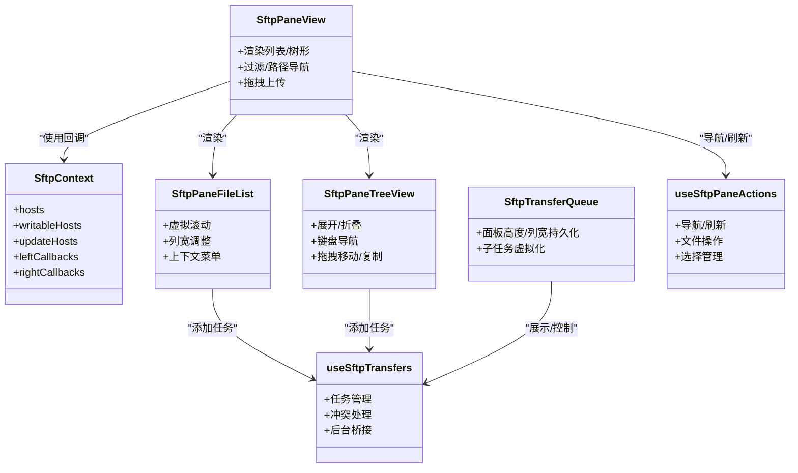

# SFTP组件

<cite>
**本文档引用的文件**
- [SftpContext.tsx](file://components/sftp/SftpContext.tsx)
- [SftpPaneView.tsx](file://components/sftp/SftpPaneView.tsx)
- [SftpPaneFileList.tsx](file://components/sftp/SftpPaneFileList.tsx)
- [SftpPaneTreeView.tsx](file://components/sftp/SftpPaneTreeView.tsx)
- [SftpPaneTreeNode.tsx](file://components/sftp/SftpPaneTreeNode.tsx)
- [SftpTransferQueue.tsx](file://components/sftp/SftpTransferQueue.tsx)
- [useSftpPaneDragAndSelect.ts](file://components/sftp/hooks/useSftpPaneDragAndSelect.ts)
- [useSftpPaneFiles.ts](file://components/sftp/hooks/useSftpPaneFiles.ts)
- [utils.ts](file://components/sftp/utils.ts)
- [types.ts](file://application/state/sftp/types.ts)
- [useSftpTransfers.types.ts](file://application/state/sftp/useSftpTransfers.types.ts)
- [useSftpTransfers.ts](file://application/state/sftp/useSftpTransfers.ts)
- [useSftpPaneActions.ts](file://application/state/sftp/useSftpPaneActions.ts)
- [sftp.ts](file://domain/models/sftp.ts)
</cite>

## 目录
1. [简介](#简介)
2. [项目结构](#项目结构)
3. [核心组件](#核心组件)
4. [架构总览](#架构总览)
5. [详细组件分析](#详细组件分析)
6. [依赖关系分析](#依赖关系分析)
7. [性能考虑](#性能考虑)
8. [故障排查指南](#故障排查指南)
9. [结论](#结论)
10. [附录](#附录)

## 简介
本文件为 Netcatty 项目中 SFTP 组件的详细 API 文档，覆盖文件浏览器（列表与树形）、传输队列、树节点渲染、文件操作 API、传输状态管理、冲突处理、文件选择与拖拽上传、权限设置、会话管理与连接状态处理、错误恢复机制、组件组合使用模式与批量操作示例，以及文件传输性能优化、进度监控与断点续传实现方案。

## 项目结构
SFTP 相关代码主要分布在以下位置：
- 组件层：components/sftp 下的 UI 组件与钩子，负责视图渲染、交互与拖拽选择
- 应用状态层：application/state/sftp 下的状态逻辑与类型定义，负责传输任务、冲突、面板状态与动作
- 领域模型：domain/models/sftp.ts 定义了 SFTP 文件条目、连接、传输任务与冲突等数据模型
- 工具函数：components/sftp/utils.ts 提供排序、过滤、格式化、图标映射等通用工具

**图表来源**
- [SftpPaneView.tsx:1-671](file://components/sftp/SftpPaneView.tsx#L1-L671)
- [SftpPaneFileList.tsx:1-704](file://components/sftp/SftpPaneFileList.tsx#L1-L704)
- [SftpPaneTreeView.tsx:1-988](file://components/sftp/SftpPaneTreeView.tsx#L1-L988)
- [SftpPaneTreeNode.tsx:1-117](file://components/sftp/SftpPaneTreeNode.tsx#L1-L117)
- [SftpTransferQueue.tsx:1-456](file://components/sftp/SftpTransferQueue.tsx#L1-L456)
- [useSftpPaneDragAndSelect.ts:1-289](file://components/sftp/hooks/useSftpPaneDragAndSelect.ts#L1-L289)
- [useSftpPaneFiles.ts:1-87](file://components/sftp/hooks/useSftpPaneFiles.ts#L1-L87)
- [utils.ts:1-355](file://components/sftp/utils.ts#L1-L355)
- [types.ts:1-74](file://application/state/sftp/types.ts#L1-L74)
- [useSftpTransfers.types.ts:1-61](file://application/state/sftp/useSftpTransfers.types.ts#L1-L61)
- [useSftpTransfers.ts:1-990](file://application/state/sftp/useSftpTransfers.ts#L1-L990)
- [useSftpPaneActions.ts:1-965](file://application/state/sftp/useSftpPaneActions.ts#L1-L965)
- [sftp.ts:1-79](file://domain/models/sftp.ts#L1-L79)

**章节来源**
- [SftpPaneView.tsx:1-671](file://components/sftp/SftpPaneView.tsx#L1-L671)
- [types.ts:1-74](file://application/state/sftp/types.ts#L1-L74)

## 核心组件
- SftpContext：提供稳定回调引用，避免 props 深度传递导致的重渲染，集中管理左右面板回调与拖拽状态
- SftpPaneView：面板容器，根据视图模式（列表/树）渲染文件列表或树视图，支持过滤、路径导航、书签、对话框与拖拽上传
- SftpPaneFileList：文件列表视图，支持虚拟滚动、列宽调整、上下文菜单、拖拽上传、加载/重连/错误状态展示
- SftpPaneTreeView：树形视图，支持展开/折叠、键盘导航、拖拽移动/复制、上下文菜单、滚动优化
- SftpPaneTreeNode：树节点渲染单元，按列布局显示名称、修改时间、大小、类型
- SftpTransferQueue：传输队列面板，支持面板高度与列宽持久化、子任务虚拟化、取消/重试/关闭等操作
- 钩子：useSftpPaneDragAndSelect 负责拖拽与多选；useSftpPaneFiles 负责过滤与排序
- 工具：utils 提供排序、过滤、格式化、图标映射等

**章节来源**
- [SftpContext.tsx:1-223](file://components/sftp/SftpContext.tsx#L1-L223)
- [SftpPaneView.tsx:1-671](file://components/sftp/SftpPaneView.tsx#L1-L671)
- [SftpPaneFileList.tsx:1-704](file://components/sftp/SftpPaneFileList.tsx#L1-L704)
- [SftpPaneTreeView.tsx:1-988](file://components/sftp/SftpPaneTreeView.tsx#L1-L988)
- [SftpPaneTreeNode.tsx:1-117](file://components/sftp/SftpPaneTreeNode.tsx#L1-L117)
- [SftpTransferQueue.tsx:1-456](file://components/sftp/SftpTransferQueue.tsx#L1-L456)
- [useSftpPaneDragAndSelect.ts:1-289](file://components/sftp/hooks/useSftpPaneDragAndSelect.ts#L1-L289)
- [useSftpPaneFiles.ts:1-87](file://components/sftp/hooks/useSftpPaneFiles.ts#L1-L87)
- [utils.ts:1-355](file://components/sftp/utils.ts#L1-L355)

## 架构总览
SFTP 组件采用“上下文 + 面板 + 视图 + 状态”的分层设计：
- 上下文层：SftpContext 提供稳定的回调与拖拽状态，减少重渲染
- 面板层：SftpPaneView 根据当前连接状态与视图模式渲染列表或树视图，并协调对话框与工具栏
- 视图层：SftpPaneFileList 与 SftpPaneTreeView 分别处理列表与树形渲染，支持虚拟化、拖拽、上下文菜单
- 状态层：useSftpTransfers 管理传输任务、冲突、重试与完成回调；useSftpPaneActions 管理文件操作与导航刷新
- 领域模型：domain/models/sftp.ts 定义文件条目、连接、传输任务与冲突类型

**图表来源**
- [SftpPaneView.tsx:1-671](file://components/sftp/SftpPaneView.tsx#L1-L671)
- [SftpPaneFileList.tsx:1-704](file://components/sftp/SftpPaneFileList.tsx#L1-L704)
- [SftpPaneTreeView.tsx:1-988](file://components/sftp/SftpPaneTreeView.tsx#L1-L988)
- [SftpContext.tsx:1-223](file://components/sftp/SftpContext.tsx#L1-L223)
- [useSftpTransfers.ts:1-990](file://application/state/sftp/useSftpTransfers.ts#L1-L990)

## 详细组件分析

### SftpContext（上下文）
- 职责：提供左右面板回调、拖拽状态、主机列表与写回方法，避免 props 深度传递
- 关键回调（SftpPaneCallbacks）：
  - 连接/断开：onConnect/onDisconnect
  - 导航与刷新：onNavigateTo/onNavigateUp/onRefresh/onRefreshTab/onSetFilenameEncoding
  - 选择与范围：onToggleSelection/onRangeSelect/onClearSelection/onSetFilter
  - 文件操作：onCreateDirectory/onCreateDirectoryAtPath/onCreateFile/onCreateFileAtPath/onDeleteFiles/onRenameFile
  - 移动/复制/打开：onMoveEntriesToPath/onCopyToOtherPane/onReceiveFromOtherPane/onOpenEntry
  - 外部上传：onUploadExternalFiles/onUploadExternalFileList/onUploadExternalFolder
  - 目录列举：onListDirectory/onListDrives
- 拖拽回调：onDragStart/onDragEnd
- 主机管理：hosts/writableHosts/updateHosts

**章节来源**
- [SftpContext.tsx:21-69](file://components/sftp/SftpContext.tsx#L21-L69)

### SftpPaneView（面板容器）
- 功能：根据视图模式渲染列表或树形视图，支持过滤、路径导航、书签、对话框、拖拽上传
- 视图模式：通过 hostViewMode 与默认模式切换，树形模式下隐藏过滤栏
- 事件处理：路径编辑、刷新、视图切换、书签增删、拖拽上传外部文件/文件夹
- 子组件：SftpPaneFileList、SftpPaneTreeView、SftpPaneToolbar、SftpPaneDialogs、SftpPaneEmptyState

**章节来源**
- [SftpPaneView.tsx:68-671](file://components/sftp/SftpPaneView.tsx#L68-L671)

### SftpPaneFileList（文件列表视图）
- 功能：渲染文件列表，支持虚拟滚动、列宽调整、上下文菜单、拖拽上传、加载/重连/错误状态
- 列头：名称、修改时间、大小、类型，支持排序与列宽拖拽
- 行渲染：SftpFileRow，支持选择、拖拽、右键菜单（打开/编辑/下载/复制到另一面板/剪贴板路径/移动到上级/重命名/权限/删除/新建）
- 外部上传：支持 DataTransfer 与 <input type="file"> 两种方式
- 状态展示：加载中、重连中、错误与日志

**章节来源**
- [SftpPaneFileList.tsx:28-704](file://components/sftp/SftpPaneFileList.tsx#L28-L704)
- [utils.ts:248-355](file://components/sftp/utils.ts#L248-L355)

### SftpPaneTreeView（树形视图）
- 功能：渲染树形目录，支持展开/折叠、键盘导航、拖拽移动/复制、上下文菜单、滚动优化
- 缓存与懒加载：childrenCacheRef/sortedChildrenCacheRef，按需加载子节点
- 选择与拖拽：支持 Shift/多选、同窗体移动、跨窗体复制、外部文件拖拽上传
- 虚拟化：useSftpPaneTreeRows，基于 requestAnimationFrame 的滚动帧控制
- 冲突与移动：支持移动到指定路径、输入建议、执行本地乐观变更与后端同步

**章节来源**
- [SftpPaneTreeView.tsx:26-988](file://components/sftp/SftpPaneTreeView.tsx#L26-L988)

### SftpPaneTreeNode（树节点）
- 功能：单个树节点渲染，按列布局显示图标、名称、修改时间、大小、类型
- 交互：点击/双击、拖拽、右键菜单、展开/折叠指示器

**章节来源**
- [SftpPaneTreeNode.tsx:14-117](file://components/sftp/SftpPaneTreeNode.tsx#L14-L117)

### SftpTransferQueue（传输队列）
- 功能：展示传输任务，支持面板高度与列宽持久化、子任务虚拟化、取消/重试/关闭
- 虚拟化：对子任务进行虚拟化，提升大量子任务场景下的性能
- 控制：拖拽调整面板高度与列宽、批量清理已完成/已取消任务

**章节来源**
- [SftpTransferQueue.tsx:17-456](file://components/sftp/SftpTransferQueue.tsx#L17-L456)

### 钩子：useSftpPaneDragAndSelect（拖拽与选择）
- 功能：处理面板级与行级拖拽、跨面板拖拽、同面板移动、外部文件拖拽上传、范围选择
- 状态：dragOverEntry/isDragOverPane、lastSelectedIndexRef
- 逻辑：识别同窗体拖拽路径、目标目录判定、移动/复制行为、外部上传触发

**章节来源**
- [useSftpPaneDragAndSelect.ts:7-289](file://components/sftp/hooks/useSftpPaneDragAndSelect.ts#L7-L289)

### 钩子：useSftpPaneFiles（文件过滤与排序）
- 功能：根据过滤条件与隐藏文件设置过滤文件，生成显示与排序后的文件列表
- 逻辑：分离 ".." 父目录、根路径处理、排序字段与顺序

**章节来源**
- [useSftpPaneFiles.ts:7-87](file://components/sftp/hooks/useSftpPaneFiles.ts#L7-L87)

### 工具：utils（排序/过滤/格式化/图标）
- 排序：sortSftpEntries 支持按名称/大小/修改时间/类型排序，目录优先
- 过滤：filterHiddenFiles 支持隐藏文件过滤
- 格式化：formatBytes/formatTransferBytes/formatDate/formatSpeed
- 图标：getFileIcon 基于扩展名映射图标

**章节来源**
- [utils.ts:248-355](file://components/sftp/utils.ts#L248-L355)

### 应用状态：useSftpTransfers（传输任务与冲突）
- 任务管理：startTransfer/addExternalUpload/updateExternalUpload/cancelTransfer/retryTransfer/clearCompletedTransfers/dismissTransfer
- 冲突处理：resolveConflict 支持 stop/skip/replace/duplicate/merge，支持“应用到全部”
- 后台桥接：通过 netcattyBridge 执行传输、统计、同主机复制、同主机目录复制
- 性能：父任务按文件数计数，子任务按字节计数；进度单调递增与速度归一化

**图表来源**
- [useSftpTransfers.ts:96-506](file://application/state/sftp/useSftpTransfers.ts#L96-L506)

**章节来源**
- [useSftpTransfers.types.ts:5-61](file://application/state/sftp/useSftpTransfers.types.ts#L5-L61)
- [useSftpTransfers.ts:19-990](file://application/state/sftp/useSftpTransfers.ts#L19-L990)

### 应用状态：useSftpPaneActions（文件操作与导航）
- 导航：navigateTo/navigateUp/openEntry，支持缓存、序列号去重、错误恢复
- 刷新：refresh，支持后台标签刷新与重连提示
- 文件操作：createDirectory/createDirectoryAtPath、createFile/createFileAtPath、deleteFiles/deleteFilesAtPath、renameFile/renameFileAtPath
- 选择：toggleSelection/rangeSelect/clearSelection/selectAll/setFilter/getFilteredFiles

**章节来源**
- [useSftpPaneActions.ts:152-965](file://application/state/sftp/useSftpPaneActions.ts#L152-L965)

### 类型定义：domain/models/sftp.ts
- SftpFileEntry：文件条目字段（名称、类型、大小、修改时间、权限、链接目标等）
- SftpConnection：连接信息（主机、状态、当前路径、家目录）
- TransferTask：传输任务（方向、状态、字节数、速度、开始/结束时间、是否目录、父子任务等）
- FileConflict：冲突信息（现有/新文件大小与修改时间、可应用到全部数量）

**章节来源**
- [sftp.ts:4-79](file://domain/models/sftp.ts#L4-L79)

## 依赖关系分析

**图表来源**
- [SftpContext.tsx:107-140](file://components/sftp/SftpContext.tsx#L107-L140)
- [SftpPaneView.tsx:82-671](file://components/sftp/SftpPaneView.tsx#L82-L671)
- [SftpPaneFileList.tsx:120-704](file://components/sftp/SftpPaneFileList.tsx#L120-L704)
- [SftpPaneTreeView.tsx:26-988](file://components/sftp/SftpPaneTreeView.tsx#L26-L988)
- [SftpTransferQueue.tsx:150-456](file://components/sftp/SftpTransferQueue.tsx#L150-L456)
- [useSftpTransfers.ts:19-990](file://application/state/sftp/useSftpTransfers.ts#L19-L990)
- [useSftpPaneActions.ts:63-965](file://application/state/sftp/useSftpPaneActions.ts#L63-L965)

**章节来源**
- [SftpContext.tsx:107-140](file://components/sftp/SftpContext.tsx#L107-L140)
- [SftpPaneView.tsx:82-671](file://components/sftp/SftpPaneView.tsx#L82-L671)
- [useSftpTransfers.ts:19-990](file://application/state/sftp/useSftpTransfers.ts#L19-L990)
- [useSftpPaneActions.ts:63-965](file://application/state/sftp/useSftpPaneActions.ts#L63-L965)

## 性能考虑
- 虚拟化
  - 文件列表：useSftpPaneVirtualList（列表模式）与 SftpPaneTreeView 的 useSftpPaneTreeRows（树形模式），均通过 requestAnimationFrame 控制滚动帧，避免频繁重排
  - 传输子任务：SftpTransferQueue 对子任务进行虚拟化，阈值与可视区域计算减少 DOM 数量
- 缓存与懒加载
  - SftpPaneTreeView 使用 childrenCacheRef/sortedChildrenCacheRef 缓存子节点与排序结果，按需加载
  - useSftpPaneActions 的目录缓存与请求序列号去重，避免竞态与重复渲染
- 进度与速度
  - useSftpTransfers 对进度单调递增与速度归一化，保证 UI 稳定性
- 列宽与面板尺寸持久化
  - SftpTransferQueue 将面板高度与列宽保存到存储，减少每次初始化的测量成本

**章节来源**
- [SftpPaneFileList.tsx:334-704](file://components/sftp/SftpPaneFileList.tsx#L334-L704)
- [SftpPaneTreeView.tsx:788-988](file://components/sftp/SftpPaneTreeView.tsx#L788-L988)
- [SftpTransferQueue.tsx:150-456](file://components/sftp/SftpTransferQueue.tsx#L150-L456)
- [useSftpTransfers.ts:718-718](file://application/state/sftp/useSftpTransfers.ts#L718-L718)

## 故障排查指南
- 连接丢失与重连
  - useSftpPaneActions.refresh 在无会话时触发重连提示；SftpPaneFileList 展示重连覆盖层
  - SftpPaneView 监听 transferMutationToken 变化以刷新树形视图
- 错误恢复
  - useSftpPaneActions.navigateTo 在导航失败时回滚到上次确认状态，保留文件与选择
  - SftpPaneFileList 提供“重试”按钮与连接日志查看
- 传输失败
  - useSftpTransfers 将失败任务标记为 failed，保留错误消息；支持 retryTransfer（部分失败的目录不重试）
  - SftpTransferQueue 提供“清除已完成/已取消”按钮
- 冲突处理
  - useSftpTransfers.resolveConflict 支持“应用到全部”，避免重复弹窗
- 权限设置
  - SftpPaneFileList 与 SftpPaneTreeView 的上下文菜单提供“权限”入口（仅远程）

**章节来源**
- [useSftpPaneActions.ts:375-424](file://application/state/sftp/useSftpPaneActions.ts#L375-L424)
- [SftpPaneFileList.tsx:80-118](file://components/sftp/SftpPaneFileList.tsx#L80-L118)
- [SftpPaneView.tsx:434-443](file://components/sftp/SftpPaneView.tsx#L434-L443)
- [useSftpTransfers.ts:720-800](file://application/state/sftp/useSftpTransfers.ts#L720-L800)

## 结论
本 SFTP 组件体系通过上下文解耦、视图虚拟化、缓存与懒加载、传输状态与冲突处理的完善设计，提供了高性能、易用且可扩展的文件浏览与传输能力。结合树形与列表两种视图模式、丰富的交互与权限控制，满足复杂场景下的文件管理需求。

## 附录

### 组件属性与方法速查
- SftpContext
  - 回调：onConnect/onDisconnect/onNavigateTo/onRefresh/onOpenEntry/onUploadExternalFiles 等
  - 拖拽：onDragStart/onDragEnd
- SftpPaneView
  - 属性：side/pane/dialogActionScopeId/isPaneFocused/sftpDefaultViewMode/showHeader/showEmptyHeader/onToggleShowHiddenFiles/onGoToTerminalCwd/forceActive
  - 方法：视图切换、过滤、路径导航、书签、拖拽上传
- SftpPaneFileList
  - 属性：columnWidths/sortField/sortOrder/handleSort/handleResizeStart/shouldVirtualize/visibleRows 等
  - 方法：刷新、打开/编辑/下载/权限、上传外部文件/文件夹、上下文菜单
- SftpPaneTreeView
  - 属性：columnWidths/sortField/sortOrder/handleSort/handleResizeStart/reloadRequest 等
  - 方法：展开/折叠、键盘导航、拖拽移动/复制、上下文菜单
- SftpTransferQueue
  - 属性：visibleTransfers/allTransfers/canRevealTransferTarget/onRevealTransferTarget/canCopyTransferTargetPath/onCopyTransferTargetPath
  - 方法：面板高度/列宽调整、取消/重试/关闭任务

**章节来源**
- [SftpContext.tsx:21-69](file://components/sftp/SftpContext.tsx#L21-L69)
- [SftpPaneView.tsx:68-110](file://components/sftp/SftpPaneView.tsx#L68-L110)
- [SftpPaneFileList.tsx:28-78](file://components/sftp/SftpPaneFileList.tsx#L28-L78)
- [SftpPaneTreeView.tsx:26-58](file://components/sftp/SftpPaneTreeView.tsx#L26-L58)
- [SftpTransferQueue.tsx:17-25](file://components/sftp/SftpTransferQueue.tsx#L17-L25)

### 交互行为配置选项
- 文件选择：单选/多选/范围选择（Shift/Ctrl/Meta），支持 clearSelection/selectAll
- 拖拽上传：支持 DataTransfer 与 <input type="file">，支持跨面板复制与同面板移动
- 权限设置：远程文件权限编辑入口
- 视图模式：列表/树形切换，树形模式下自动清空过滤与选择
- 过滤与隐藏文件：支持按名称过滤与隐藏文件显示开关

**章节来源**
- [useSftpPaneDragAndSelect.ts:244-289](file://components/sftp/hooks/useSftpPaneDragAndSelect.ts#L244-L289)
- [SftpPaneFileList.tsx:198-247](file://components/sftp/SftpPaneFileList.tsx#L198-L247)
- [SftpPaneTreeView.tsx:703-781](file://components/sftp/SftpPaneTreeView.tsx#L703-L781)
- [utils.ts:348-355](file://components/sftp/utils.ts#L348-L355)

### SFTP 会话管理与错误恢复
- 会话丢失：在导航与刷新时检测会话是否存在，触发重连提示或错误状态
- 错误恢复：导航失败时回滚到上次确认状态，保留文件与选择
- 传输恢复：传输失败时保留错误消息，支持重试（非目录或可重试任务）

**章节来源**
- [useSftpPaneActions.ts:250-355](file://application/state/sftp/useSftpPaneActions.ts#L250-L355)
- [useSftpTransfers.ts:460-506](file://application/state/sftp/useSftpTransfers.ts#L460-L506)

### 组合使用模式与批量操作示例
- 组合模式
  - 列表与树形视图切换：SftpPaneView 根据 hostViewMode 与默认模式切换
  - 传输队列与面板联动：SftpTransferQueue 展示任务，完成后刷新目标面板
- 批量操作
  - 批量下载：SftpPaneFileList.onDownloadFiles 支持多选下载
  - 批量重试：SftpTransferQueue 对选中任务重试
  - 冲突批量处理：resolveConflict 支持“应用到全部”

**章节来源**
- [SftpPaneView.tsx:399-408](file://components/sftp/SftpPaneView.tsx#L399-L408)
- [SftpPaneFileList.tsx:300-316](file://components/sftp/SftpPaneFileList.tsx#L300-L316)
- [SftpTransferQueue.tsx:400-432](file://components/sftp/SftpTransferQueue.tsx#L400-L432)
- [useSftpTransfers.ts:720-771](file://application/state/sftp/useSftpTransfers.ts#L720-L771)

### 断点续传与性能优化
- 断点续传
  - 当前实现未见断点续传专用 API；传输采用一次性写入/读取，失败则重试或替换
- 性能优化
  - 虚拟化：列表与树形视图均采用虚拟化
  - 缓存：目录缓存、子节点缓存、排序缓存
  - 进度与速度：单调递增与速度归一化，避免 UI 抖动

**章节来源**
- [SftpPaneFileList.tsx:334-704](file://components/sftp/SftpPaneFileList.tsx#L334-L704)
- [SftpPaneTreeView.tsx:236-280](file://components/sftp/SftpPaneTreeView.tsx#L236-L280)
- [useSftpTransfers.ts:702-718](file://application/state/sftp/useSftpTransfers.ts#L702-L718)