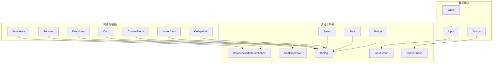
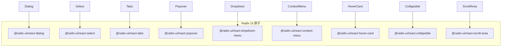
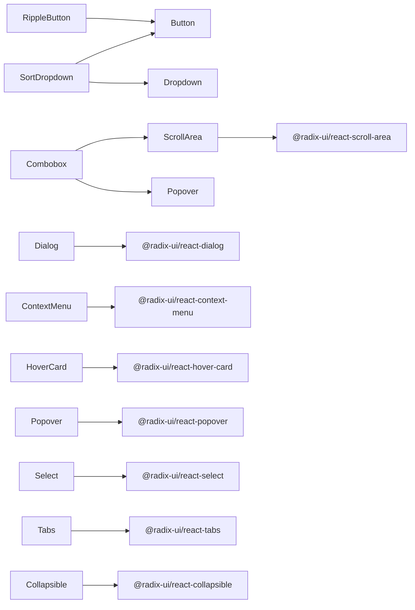

# UI基础组件

<cite>
**本文引用的文件**
- [button.tsx](file://components/ui/button.tsx)
- [input.tsx](file://components/ui/input.tsx)
- [card.tsx](file://components/ui/card.tsx)
- [dialog.tsx](file://components/ui/dialog.tsx)
- [select.tsx](file://components/ui/select.tsx)
- [tabs.tsx](file://components/ui/tabs.tsx)
- [badge.tsx](file://components/ui/badge.tsx)
- [collapsible.tsx](file://components/ui/collapsible.tsx)
- [combobox.tsx](file://components/ui/combobox.tsx)
- [context-menu.tsx](file://components/ui/context-menu.tsx)
- [dropdown.tsx](file://components/ui/dropdown.tsx)
- [hover-card.tsx](file://components/ui/hover-card.tsx)
- [input-group.tsx](file://components/ui/input-group.tsx)
- [label.tsx](file://components/ui/label.tsx)
- [popover.tsx](file://components/ui/popover.tsx)
- [ripple.tsx](file://components/ui/ripple.tsx)
- [scroll-area.tsx](file://components/ui/scroll-area.tsx)
- [sort-dropdown.tsx](file://components/ui/sort-dropdown.tsx)
</cite>

## 目录
1. [简介](#简介)
2. [项目结构](#项目结构)
3. [核心组件](#核心组件)
4. [架构总览](#架构总览)
5. [详细组件分析](#详细组件分析)
6. [依赖分析](#依赖分析)
7. [性能考虑](#性能考虑)
8. [故障排查指南](#故障排查指南)
9. [结论](#结论)
10. [附录](#附录)

## 简介
本文件为 Netcatty 项目中“UI基础组件”的权威API文档，覆盖所有基础UI组件的属性、方法、事件处理与样式定制选项。文档同时记录各组件的 props 接口定义、默认值、类型约束与校验规则；阐述事件回调、状态管理与内部方法；并提供可访问性支持、响应式设计与跨浏览器兼容性说明。最后给出常见用法、高级配置、组合模式、嵌套使用与样式覆盖方法，并附带性能优化建议与调试技巧。

## 项目结构
UI基础组件集中于 components/ui 目录，采用按功能分层组织：原子级输入控件（button、input、label）、容器与布局（card、scroll-area、popover、dropdown、context-menu、hover-card、collapsible）、复合选择器（select、combobox、sort-dropdown）、对话框与标签页（dialog、tabs）、徽标与输入组合（badge、input-group）以及交互增强（ripple）。这些组件统一通过 cn 工具函数进行类名合并，确保主题与样式一致性。

图表来源
- [button.tsx:1-39](file://components/ui/button.tsx#L1-L39)
- [input.tsx:1-25](file://components/ui/input.tsx#L1-L25)
- [label.tsx:1-20](file://components/ui/label.tsx#L1-L20)
- [card.tsx:1-20](file://components/ui/card.tsx#L1-L20)
- [scroll-area.tsx:1-47](file://components/ui/scroll-area.tsx#L1-L47)
- [popover.tsx:1-74](file://components/ui/popover.tsx#L1-L74)
- [dropdown.tsx:1-261](file://components/ui/dropdown.tsx#L1-L261)
- [context-menu.tsx:1-273](file://components/ui/context-menu.tsx#L1-L273)
- [hover-card.tsx:1-31](file://components/ui/hover-card.tsx#L1-L31)
- [collapsible.tsx:1-10](file://components/ui/collapsible.tsx#L1-L10)
- [select.tsx:1-151](file://components/ui/select.tsx#L1-L151)
- [combobox.tsx:1-429](file://components/ui/combobox.tsx#L1-L429)
- [sort-dropdown.tsx:1-56](file://components/ui/sort-dropdown.tsx#L1-L56)
- [tabs.tsx:1-54](file://components/ui/tabs.tsx#L1-L54)
- [dialog.tsx:1-132](file://components/ui/dialog.tsx#L1-L132)
- [badge.tsx:1-29](file://components/ui/badge.tsx#L1-L29)
- [input-group.tsx:1-92](file://components/ui/input-group.tsx#L1-L92)
- [ripple.tsx:1-64](file://components/ui/ripple.tsx#L1-L64)

章节来源
- [button.tsx:1-39](file://components/ui/button.tsx#L1-L39)
- [input.tsx:1-25](file://components/ui/input.tsx#L1-L25)
- [label.tsx:1-20](file://components/ui/label.tsx#L1-L20)
- [card.tsx:1-20](file://components/ui/card.tsx#L1-L20)
- [scroll-area.tsx:1-47](file://components/ui/scroll-area.tsx#L1-L47)
- [popover.tsx:1-74](file://components/ui/popover.tsx#L1-L74)
- [dropdown.tsx:1-261](file://components/ui/dropdown.tsx#L1-L261)
- [context-menu.tsx:1-273](file://components/ui/context-menu.tsx#L1-L273)
- [hover-card.tsx:1-31](file://components/ui/hover-card.tsx#L1-L31)
- [collapsible.tsx:1-10](file://components/ui/collapsible.tsx#L1-L10)
- [select.tsx:1-151](file://components/ui/select.tsx#L1-L151)
- [combobox.tsx:1-429](file://components/ui/combobox.tsx#L1-L429)
- [sort-dropdown.tsx:1-56](file://components/ui/sort-dropdown.tsx#L1-L56)
- [tabs.tsx:1-54](file://components/ui/tabs.tsx#L1-L54)
- [dialog.tsx:1-132](file://components/ui/dialog.tsx#L1-L132)
- [badge.tsx:1-29](file://components/ui/badge.tsx#L1-L29)
- [input-group.tsx:1-92](file://components/ui/input-group.tsx#L1-L92)
- [ripple.tsx:1-64](file://components/ui/ripple.tsx#L1-L64)

## 核心组件
本节概述所有基础UI组件的职责、典型用途与通用特性（如类名合并、无障碍与键盘交互等），便于快速定位与选型。

- Button：语义化按钮，支持多种变体与尺寸，继承原生button属性，提供焦点可见性与禁用态控制。
- Input：文本输入框，继承原生input属性，内置焦点与禁用态样式。
- Label：表单标签，配合表单控件使用，支持禁用态与可读性优化。
- Card：卡片容器，用于内容分组与阴影装饰。
- ScrollArea：滚动区域，提供自定义滚动条与滚动视口。
- Popover：弹出层，基于Radix UI，支持对齐、偏移与碰撞检测。
- Dropdown：下拉菜单，提供受控/非受控模式、位置计算与点击外部关闭。
- ContextMenu：上下文菜单，全局最高层级渲染，避免被其他UI遮挡。
- HoverCard：悬停卡片，基于Radix UI，支持动画与定位。
- Collapsible：可折叠容器，基于Radix UI，支持展开/收起。
- Select：选择器，支持分组、滚动按钮、标签与项。
- Combobox：组合选择器，支持搜索、创建新项、多选标签等。
- SortDropdown：排序下拉，集成国际化文案与图标。
- Tabs：标签页，支持列表、触发器与内容区。
- Dialog：对话框，支持遮罩、居中内容、关闭按钮与无障碍描述。
- Badge：徽标，用于状态标识与辅助信息。
- InputGroup：输入组合，提供输入框、附加元素与按钮的组合样式。
- RippleButton：波纹效果按钮，基于Button封装，提供点击波纹动效。
- 所有组件均通过 cn 合并类名，遵循主题变量命名约定，具备一致的视觉与交互体验。

章节来源
- [button.tsx:1-39](file://components/ui/button.tsx#L1-L39)
- [input.tsx:1-25](file://components/ui/input.tsx#L1-L25)
- [label.tsx:1-20](file://components/ui/label.tsx#L1-L20)
- [card.tsx:1-20](file://components/ui/card.tsx#L1-L20)
- [scroll-area.tsx:1-47](file://components/ui/scroll-area.tsx#L1-L47)
- [popover.tsx:1-74](file://components/ui/popover.tsx#L1-L74)
- [dropdown.tsx:1-261](file://components/ui/dropdown.tsx#L1-L261)
- [context-menu.tsx:1-273](file://components/ui/context-menu.tsx#L1-L273)
- [hover-card.tsx:1-31](file://components/ui/hover-card.tsx#L1-L31)
- [collapsible.tsx:1-10](file://components/ui/collapsible.tsx#L1-L10)
- [select.tsx:1-151](file://components/ui/select.tsx#L1-L151)
- [combobox.tsx:1-429](file://components/ui/combobox.tsx#L1-L429)
- [sort-dropdown.tsx:1-56](file://components/ui/sort-dropdown.tsx#L1-L56)
- [tabs.tsx:1-54](file://components/ui/tabs.tsx#L1-L54)
- [dialog.tsx:1-132](file://components/ui/dialog.tsx#L1-L132)
- [badge.tsx:1-29](file://components/ui/badge.tsx#L1-L29)
- [input-group.tsx:1-92](file://components/ui/input-group.tsx#L1-L92)
- [ripple.tsx:1-64](file://components/ui/ripple.tsx#L1-L64)

## 架构总览
UI基础组件围绕 Radix UI 原子能力构建，结合自研工具与主题系统，形成统一的可组合UI生态。组件间通过组合与复用实现复杂交互，例如 RippleButton 组合 Button，Combobox 组合 Popover 与 ScrollArea，SortDropdown 组合 Dropdown 与 Button 等。

图表来源
- [dialog.tsx:1-132](file://components/ui/dialog.tsx#L1-L132)
- [select.tsx:1-151](file://components/ui/select.tsx#L1-L151)
- [tabs.tsx:1-54](file://components/ui/tabs.tsx#L1-L54)
- [popover.tsx:1-74](file://components/ui/popover.tsx#L1-L74)
- [dropdown.tsx:1-261](file://components/ui/dropdown.tsx#L1-L261)
- [context-menu.tsx:1-273](file://components/ui/context-menu.tsx#L1-L273)
- [hover-card.tsx:1-31](file://components/ui/hover-card.tsx#L1-L31)
- [collapsible.tsx:1-10](file://components/ui/collapsible.tsx#L1-L10)
- [scroll-area.tsx:1-47](file://components/ui/scroll-area.tsx#L1-L47)

## 详细组件分析

### Button 按钮
- 属性与默认值
  - variant: 可选值 "default" | "destructive" | "outline" | "secondary" | "ghost" | "link"，默认 "default"
  - size: 可选值 "default" | "sm" | "lg" | "icon"，默认 "default"
  - 继承原生 button 属性（如 type、disabled、onClick 等）
- 方法与事件
  - 无内部方法；通过 ref 访问底层 HTMLButtonElement
  - 支持 onClick、onFocus、onBlur 等原生事件
- 样式与主题
  - 使用 cn 合并类名，根据 variant/size 应用不同背景、边框、文字颜色与尺寸
- 可访问性
  - 内置 focus-visible 样式，支持键盘操作
- 典型用法
  - 基础按钮、危险操作按钮、链接风格按钮、图标按钮
- 高级配置
  - 通过 className 覆盖尺寸或颜色；与 RippleButton 组合实现波纹动效

章节来源
- [button.tsx:1-39](file://components/ui/button.tsx#L1-L39)

### Input 输入框
- 属性与默认值
  - 继承原生 input 属性（type、value、onChange、placeholder 等）
- 方法与事件
  - 无内部方法；通过 ref 访问 HTMLInputElement
  - 支持 onChange、onFocus、onBlur、onKeyDown 等
- 样式与主题
  - 内置边框、背景、占位符与禁用态样式
- 可访问性
  - 自动聚焦与禁用态处理
- 典型用法
  - 文本输入、密码输入、搜索框
- 高级配置
  - 通过 className 调整内边距与字体大小

章节来源
- [input.tsx:1-25](file://components/ui/input.tsx#L1-L25)

### Label 标签
- 属性与默认值
  - 继承原生 label 属性（htmlFor、children 等）
- 方法与事件
  - 无内部方法；通过 ref 访问 HTMLLabelElement
- 样式与主题
  - 内置禁用态与可读性样式
- 可访问性
  - 与表单控件配合使用，提升可点击区域与可读性
- 典型用法
  - 与 Input、Select 等控件关联
- 高级配置
  - 通过 className 调整字号与字重

章节来源
- [label.tsx:1-20](file://components/ui/label.tsx#L1-L20)

### Card 卡片
- 属性与默认值
  - 继承原生 div 属性（className、children 等）
- 方法与事件
  - 无内部方法；通过 ref 访问 HTMLDivElement
- 样式与主题
  - 内置边框、背景与阴影样式
- 可访问性
  - 无特殊要求
- 典型用法
  - 分组内容、设置面板、对话框主体
- 高级配置
  - 通过 className 调整圆角与阴影强度

章节来源
- [card.tsx:1-20](file://components/ui/card.tsx#L1-L20)

### ScrollArea 滚动区域
- 属性与默认值
  - 继承 Radix UI ScrollArea 原生属性（type、scrollHideDelay 等）
- 方法与事件
  - 无内部方法；通过 ref 访问根元素
- 样式与主题
  - 自定义滚动条尺寸与颜色
- 可访问性
  - 支持键盘滚动与屏幕阅读器
- 典型用法
  - 下拉列表、长内容面板
- 高级配置
  - 通过 className 调整滚动条宽度与颜色

章节来源
- [scroll-area.tsx:1-47](file://components/ui/scroll-area.tsx#L1-L47)

### Popover 弹出层
- 属性与默认值
  - 继承 Radix UI Popover 原生属性（open、onOpenChange、align、sideOffset 等）
  - 默认 align="center"，sideOffset=4
- 方法与事件
  - 无内部方法；通过 ref 访问内容区
- 样式与主题
  - 内置阴影与动画；通过 className 覆盖定位与尺寸
- 可访问性
  - 支持键盘打开/关闭与焦点管理
- 典型用法
  - 设置菜单、用户头像菜单、帮助提示
- 高级配置
  - 在 Electron 环境中通过双 requestAnimationFrame 确保定位稳定

章节来源
- [popover.tsx:1-74](file://components/ui/popover.tsx#L1-L74)

### Dropdown 下拉菜单
- 属性与默认值
  - open?: 受控开关；onOpenChange?: 回调；align?: "start"|"center"|"end"；sideOffset?: number；side?: "top"|"bottom"；alignToParent?: boolean
- 方法与事件
  - 内部维护 open 状态；支持点击外部关闭与 Escape 键关闭
- 样式与主题
  - 固定定位与阴影；通过 className 覆盖尺寸
- 可访问性
  - 支持键盘导航与焦点回退
- 典型用法
  - 用户菜单、排序菜单、操作菜单
- 高级配置
  - alignToParent 控制对齐到父元素而非触发元素；side 控制上下弹出方向

章节来源
- [dropdown.tsx:1-261](file://components/ui/dropdown.tsx#L1-L261)

### ContextMenu 上下文菜单
- 属性与默认值
  - 继承 Radix UI ContextMenu 原生属性（open、onOpenChange、align、sideOffset 等）
- 方法与事件
  - 内置全局 Portal 容器，避免层级问题；拦截 aria-hidden 以防止焦点丢失警告
- 样式与主题
  - 固定最高层级 z-index；内置动画与阴影
- 可访问性
  - 支持键盘与鼠标操作；避免被其他层遮挡
- 典型用法
  - 表格右键菜单、树节点菜单
- 高级配置
  - 通过 Portal 容器保证在任何层级之上显示

章节来源
- [context-menu.tsx:1-273](file://components/ui/context-menu.tsx#L1-L273)

### HoverCard 悬停卡片
- 属性与默认值
  - 继承 Radix UI HoverCard 原生属性（open、onOpenChange、align、sideOffset 等）
- 方法与事件
  - 无内部方法；通过 ref 访问内容区
- 样式与主题
  - 内置阴影与动画；通过 className 覆盖尺寸
- 可访问性
  - 支持键盘触发与焦点管理
- 典型用法
  - 头像悬停预览、快捷信息卡片
- 高级配置
  - 通过 align 与 sideOffset 控制定位

章节来源
- [hover-card.tsx:1-31](file://components/ui/hover-card.tsx#L1-L31)

### Collapsible 可折叠
- 属性与默认值
  - 继承 Radix UI Collapsible 原生属性（open、onOpenChange 等）
- 方法与事件
  - 无内部方法；通过 ref 访问内容区
- 样式与主题
  - 无内置样式；通过 className 控制外观
- 可访问性
  - 支持键盘切换
- 典型用法
  - 设置面板、FAQ、侧边栏
- 高级配置
  - 与 Tabs、Dialog 组合实现复杂交互

章节来源
- [collapsible.tsx:1-10](file://components/ui/collapsible.tsx#L1-L10)

### Select 选择器
- 属性与默认值
  - Trigger: 继承原生属性；Content: position?: "popper" 或其他 Radix 位置策略
- 方法与事件
  - 无内部方法；通过 ref 访问触发器与内容区
- 样式与主题
  - 内置滚动按钮、分隔线与选中指示器
- 可访问性
  - 支持键盘导航与无障碍标签
- 典型用法
  - 下拉选择、排序、过滤
- 高级配置
  - 通过 position 控制弹出位置；支持分组与标签

章节来源
- [select.tsx:1-151](file://components/ui/select.tsx#L1-L151)

### Combobox 组合选择器
- 属性与默认值
  - 单选：value?: string；onValueChange?: (value: string) => void；options: ComboboxOption[]；placeholder?: string；emptyText?: string；allowCreate?: boolean；onCreateNew?: (value: string) => void；createText?: string；icon?: React.ReactNode；className?: string；triggerClassName?: string；disabled?: boolean
  - 多选：values: string[]；onValuesChange?: (values: string[]) => void；其余同上
- 方法与事件
  - 内部维护 open、inputValue、isSearching 状态；支持 Enter/Escape/Backspace 等键盘事件
- 样式与主题
  - 触发器与选项列表样式；支持清空按钮与图标
- 可访问性
  - 支持键盘导航与无障碍描述
- 典型用法
  - 搜索选择、标签选择、动态创建
- 高级配置
  - 通过 className/triggerClassName 覆盖样式；通过 ScrollArea 实现长列表滚动

章节来源
- [combobox.tsx:1-429](file://components/ui/combobox.tsx#L1-L429)

### SortDropdown 排序下拉
- 属性与默认值
  - value: SortMode；onChange: (mode: SortMode) => void；className?: string
  - SortMode: 'az'|'za'|'newest'|'oldest'|'group'
- 方法与事件
  - 内部维护 open 状态；点击选项后调用 onChange 并关闭
- 样式与主题
  - 基于 Button 的 ghost/icon 尺寸；支持图标与选中态
- 可访问性
  - 支持键盘操作与无障碍标签
- 典型用法
  - 列表排序、分组展示
- 高级配置
  - 通过 className 调整尺寸与对齐

章节来源
- [sort-dropdown.tsx:1-56](file://components/ui/sort-dropdown.tsx#L1-L56)

### Tabs 标签页
- 属性与默认值
  - 继承 Radix UI Tabs 原生属性（value、onValueChange、orientation 等）
- 方法与事件
  - 无内部方法；通过 ref 访问列表、触发器与内容区
- 样式与主题
  - 触发器激活态与阴影；通过 className 覆盖布局
- 可访问性
  - 支持键盘切换与无障碍标签
- 典型用法
  - 设置面板、详情页、多步骤向导
- 高级配置
  - 与 Dialog、Card 组合实现复杂布局

章节来源
- [tabs.tsx:1-54](file://components/ui/tabs.tsx#L1-L54)

### Dialog 对话框
- 属性与默认值
  - Content: 继承 Radix UI Content 原生属性；新增 hideCloseButton?: boolean；overlayClassName?: string
- 方法与事件
  - 无内部方法；通过 ref 访问 Overlay 与 Content
- 样式与主题
  - 内置阴影与动画；支持自定义 overlay 样式
- 可访问性
  - 自动隐藏关闭按钮但保留无障碍文本；支持 Escape 关闭
- 典型用法
  - 确认对话框、设置面板、模态窗口
- 高级配置
  - 通过 overlayClassName 覆盖遮罩样式；通过 hideCloseButton 控制关闭按钮显隐

章节来源
- [dialog.tsx:1-132](file://components/ui/dialog.tsx#L1-L132)

### Badge 徽标
- 属性与默认值
  - variant: "default" | "secondary" | "destructive" | "outline"，默认 "default"
- 方法与事件
  - 无内部方法；通过 ref 访问 div
- 样式与主题
  - 圆角徽标样式；通过 variant 切换颜色方案
- 可访问性
  - 无特殊要求
- 典型用法
  - 状态标记、未读数、标签
- 高级配置
  - 通过 className 调整尺寸与间距

章节来源
- [badge.tsx:1-29](file://components/ui/badge.tsx#L1-L29)

### InputGroup 输入组合
- 属性与默认值
  - InputGroup: 继承 div 属性
  - InputGroupTextarea: 继承 textarea 属性
  - InputGroupAddon: align?: 'block-start' | 'block-end'
  - InputGroupButton: variant?: 'default' | 'ghost' | 'outline' | 'destructive'；size?: 'sm' | 'icon-sm' | 'default'
- 方法与事件
  - 无内部方法；通过 ref 访问对应元素
- 样式与主题
  - 组合容器圆角与阴影；按钮与文本域样式
- 可访问性
  - 与表单控件配合使用
- 典型用法
  - 搜索栏、输入+按钮、前置/后置标签
- 高级配置
  - 通过 className 调整圆角、阴影与按钮尺寸

章节来源
- [input-group.tsx:1-92](file://components/ui/input-group.tsx#L1-L92)

### RippleButton 波纹按钮
- 属性与默认值
  - 继承 Button Props；内部维护波纹状态数组
- 方法与事件
  - onPointerDown 捕获点击坐标与尺寸，生成波纹动画；自动清理过期波纹
- 样式与主题
  - 基于 Button；通过相对定位与绝对定位实现波纹覆盖
- 可访问性
  - 无特殊要求
- 典型用法
  - 主按钮、强调按钮、图标按钮
- 高级配置
  - 通过 className 覆盖布局与动画

章节来源
- [ripple.tsx:1-64](file://components/ui/ripple.tsx#L1-L64)

## 依赖分析
- 组件间依赖
  - RippleButton 依赖 Button
  - Combobox 依赖 Popover 与 ScrollArea
  - SortDropdown 依赖 Dropdown 与 Button
  - Dialog、ContextMenu、HoverCard、Popover、ScrollArea、Select、Tabs、Collapsible 均依赖 Radix UI
- 外部依赖
  - @radix-ui/react-*：提供可访问性与状态管理
  - lucide-react：提供图标
  - i18n：Dialog、SortDropdown 使用国际化文案
- 内聚与耦合
  - 组件保持高内聚、低耦合；通过组合与复用实现功能扩展

图表来源
- [ripple.tsx:1-64](file://components/ui/ripple.tsx#L1-L64)
- [combobox.tsx:1-429](file://components/ui/combobox.tsx#L1-L429)
- [sort-dropdown.tsx:1-56](file://components/ui/sort-dropdown.tsx#L1-L56)
- [dialog.tsx:1-132](file://components/ui/dialog.tsx#L1-L132)
- [context-menu.tsx:1-273](file://components/ui/context-menu.tsx#L1-L273)
- [hover-card.tsx:1-31](file://components/ui/hover-card.tsx#L1-L31)
- [popover.tsx:1-74](file://components/ui/popover.tsx#L1-L74)
- [scroll-area.tsx:1-47](file://components/ui/scroll-area.tsx#L1-L47)
- [select.tsx:1-151](file://components/ui/select.tsx#L1-L151)
- [tabs.tsx:1-54](file://components/ui/tabs.tsx#L1-L54)
- [collapsible.tsx:1-10](file://components/ui/collapsible.tsx#L1-L10)

章节来源
- [ripple.tsx:1-64](file://components/ui/ripple.tsx#L1-L64)
- [combobox.tsx:1-429](file://components/ui/combobox.tsx#L1-L429)
- [sort-dropdown.tsx:1-56](file://components/ui/sort-dropdown.tsx#L1-L56)
- [dialog.tsx:1-132](file://components/ui/dialog.tsx#L1-L132)
- [context-menu.tsx:1-273](file://components/ui/context-menu.tsx#L1-L273)
- [hover-card.tsx:1-31](file://components/ui/hover-card.tsx#L1-L31)
- [popover.tsx:1-74](file://components/ui/popover.tsx#L1-L74)
- [scroll-area.tsx:1-47](file://components/ui/scroll-area.tsx#L1-L47)
- [select.tsx:1-151](file://components/ui/select.tsx#L1-L151)
- [tabs.tsx:1-54](file://components/ui/tabs.tsx#L1-L54)
- [collapsible.tsx:1-10](file://components/ui/collapsible.tsx#L1-L10)

## 性能考虑
- 渲染与定位
  - Dropdown 与 Popover 在打开时使用双 requestAnimationFrame 确保尺寸与定位稳定，减少闪烁
  - ContextMenu 通过固定 Portal 容器避免层级问题与重绘
- 动画与过渡
  - 组件普遍使用 Radix UI 的动画系统，确保流畅与可中断
- 事件与状态
  - Combobox 使用 useMemo 过滤选项，避免不必要的重渲染
  - RippleButton 使用定时器清理波纹，避免内存泄漏
- 可访问性与键盘
  - 所有交互组件支持键盘操作与无障碍标签，降低重排与重绘成本
- 跨浏览器兼容
  - 通过 cn 合并与主题系统，确保在不同浏览器中样式一致
  - 在 Electron 环境中对定位逻辑进行适配，提升稳定性

[本节为通用指导，不直接分析具体文件]

## 故障排查指南
- 打开/关闭异常
  - Dropdown：检查是否正确传递 open/onOpenChange；确认点击外部关闭逻辑生效
  - Popover：确认内容挂载后再计算位置；检查 align 与 sideOffset 配置
  - ContextMenu：确认 Portal 容器存在且未被其他层遮挡
- 定位错位
  - Dropdown：alignToParent 与 side/align 配置不当会导致偏移；检查触发元素与父元素关系
  - Popover：在 Electron 中需等待两帧再计算尺寸
- 选项过滤无效
  - Combobox：确认 isSearching 与 inputValue 状态同步；检查过滤条件
- 波纹不消失
  - RippleButton：确认定时器是否执行；检查动画时长与清理逻辑
- 可访问性问题
  - Dialog：确认关闭按钮的无障碍文本；避免 aria-hidden 警告
  - Tabs/Select：确保标签与描述正确绑定

章节来源
- [dropdown.tsx:1-261](file://components/ui/dropdown.tsx#L1-L261)
- [popover.tsx:1-74](file://components/ui/popover.tsx#L1-L74)
- [context-menu.tsx:1-273](file://components/ui/context-menu.tsx#L1-L273)
- [combobox.tsx:1-429](file://components/ui/combobox.tsx#L1-L429)
- [ripple.tsx:1-64](file://components/ui/ripple.tsx#L1-L64)
- [dialog.tsx:1-132](file://components/ui/dialog.tsx#L1-L132)
- [tabs.tsx:1-54](file://components/ui/tabs.tsx#L1-L54)
- [select.tsx:1-151](file://components/ui/select.tsx#L1-L151)

## 结论
本API文档系统梳理了 Netcatty UI基础组件的属性、方法、事件与样式定制，明确了可访问性、响应式与跨浏览器兼容性要点，并提供了组合模式、嵌套使用与性能优化建议。建议在实际开发中优先使用组合组件（如 RippleButton、Combobox、SortDropdown）以获得更佳的用户体验与可维护性。

[本节为总结性内容，不直接分析具体文件]

## 附录
- 使用示例与代码片段路径
  - 基础按钮：[button.tsx:10-35](file://components/ui/button.tsx#L10-L35)
  - 输入框：[input.tsx:7-20](file://components/ui/input.tsx#L7-L20)
  - 卡片：[card.tsx:4-16](file://components/ui/card.tsx#L4-L16)
  - 对话框：[dialog.tsx:31-71](file://components/ui/dialog.tsx#L31-L71)
  - 选择器：[select.tsx:13-98](file://components/ui/select.tsx#L13-L98)
  - 标签页：[tabs.tsx:8-51](file://components/ui/tabs.tsx#L8-L51)
  - 徽标：[badge.tsx:10-26](file://components/ui/badge.tsx#L10-L26)
  - 输入组合：[input-group.tsx:7-91](file://components/ui/input-group.tsx#L7-L91)
  - 波纹按钮：[ripple.tsx:14-62](file://components/ui/ripple.tsx#L14-L62)
  - 组合选择器：[combobox.tsx:29-221](file://components/ui/combobox.tsx#L29-L221)
  - 排序下拉：[sort-dropdown.tsx:23-52](file://components/ui/sort-dropdown.tsx#L23-L52)
  - 弹出层：[popover.tsx:15-70](file://components/ui/popover.tsx#L15-L70)
  - 下拉菜单：[dropdown.tsx:34-258](file://components/ui/dropdown.tsx#L34-L258)
  - 上下文菜单：[context-menu.tsx:64-272](file://components/ui/context-menu.tsx#L64-L272)
  - 悬停卡片：[hover-card.tsx:6-28](file://components/ui/hover-card.tsx#L6-L28)
  - 可折叠：[collapsible.tsx:3-9](file://components/ui/collapsible.tsx#L3-L9)
  - 滚动区域：[scroll-area.tsx:6-44](file://components/ui/scroll-area.tsx#L6-L44)

[本节为索引性内容，不直接分析具体文件]