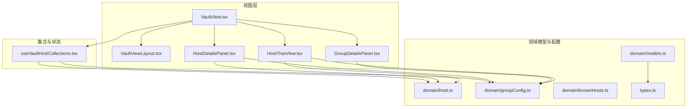
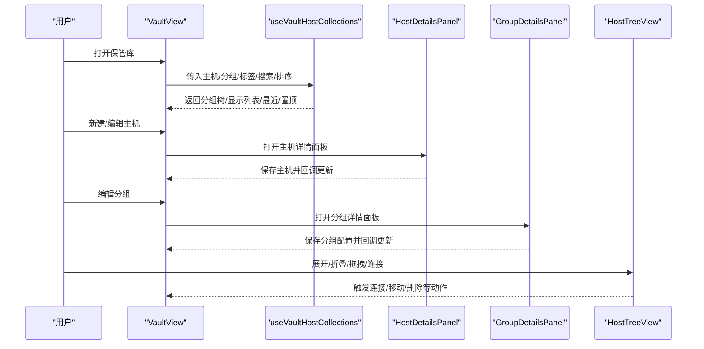
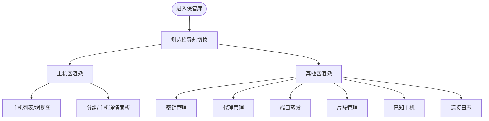
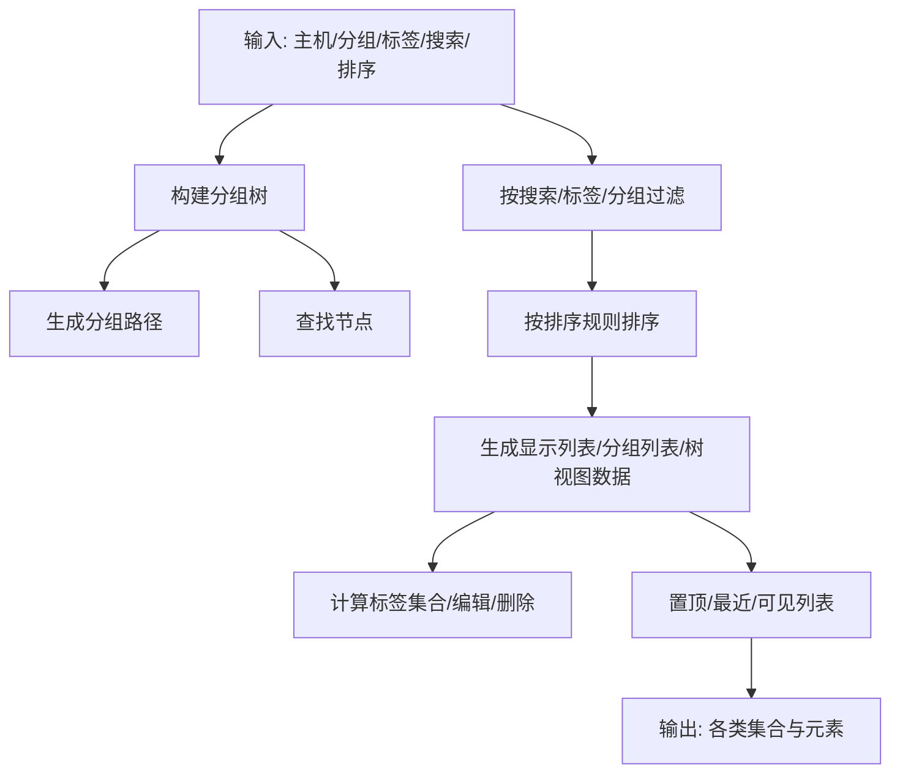
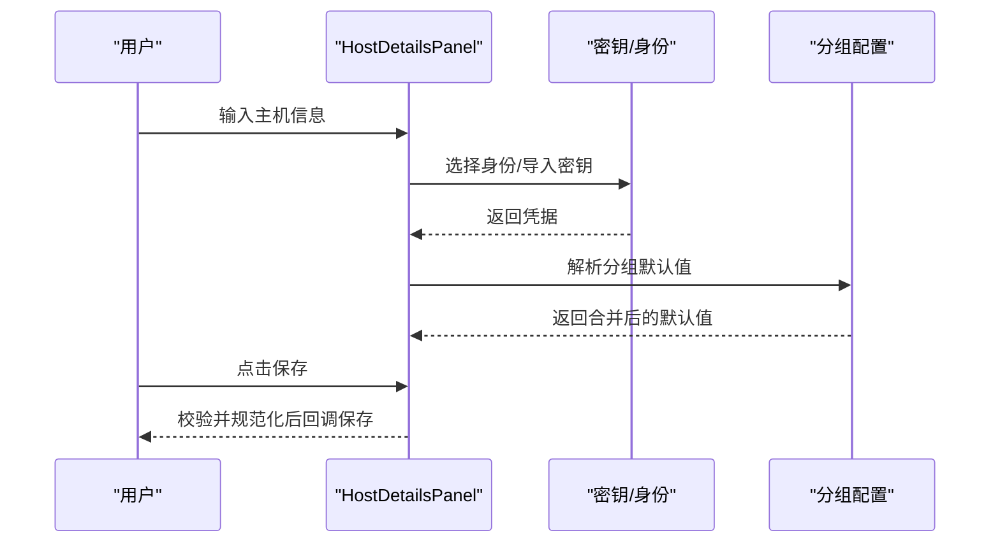
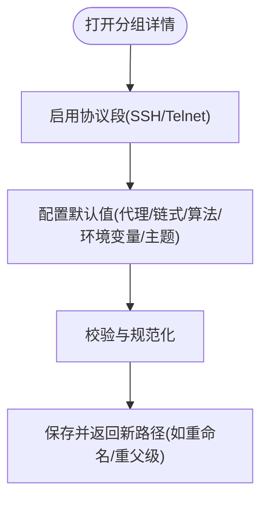
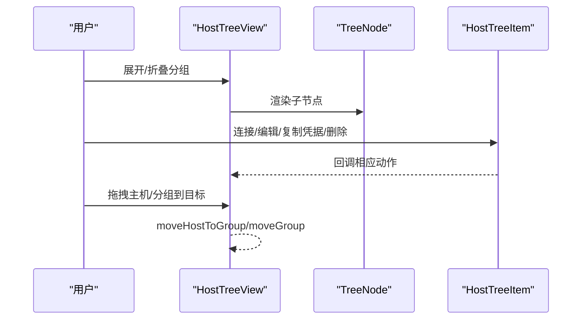
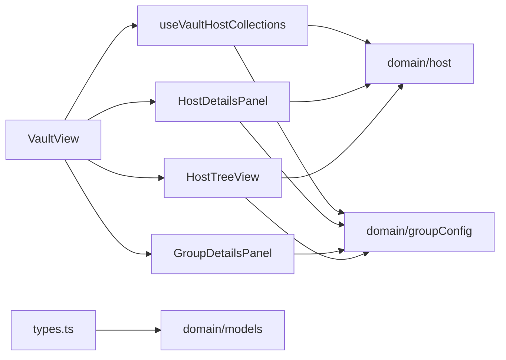
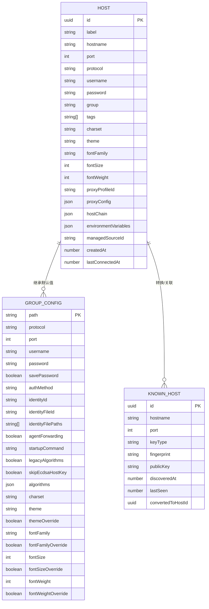

# 保管库组件

<cite>
**本文档引用的文件**
- [VaultView.tsx](file://components/VaultView.tsx)
- [VaultViewLayout.tsx](file://components/vault/VaultViewLayout.tsx)
- [useVaultHostCollections.tsx](file://components/vault/useVaultHostCollections.tsx)
- [HostDetailsPanel.tsx](file://components/HostDetailsPanel.tsx)
- [GroupDetailsPanel.tsx](file://components/GroupDetailsPanel.tsx)
- [HostTreeView.tsx](file://components/HostTreeView.tsx)
- [host.ts](file://domain/host.ts)
- [groupConfig.ts](file://domain/groupConfig.ts)
- [knownHosts.ts](file://domain/knownHosts.ts)
- [models.ts](file://domain/models.ts)
- [types.ts](file://types.ts)
</cite>

## 目录
1. [简介](#简介)
2. [项目结构](#项目结构)
3. [核心组件](#核心组件)
4. [架构总览](#架构总览)
5. [详细组件分析](#详细组件分析)
6. [依赖分析](#依赖分析)
7. [性能考虑](#性能考虑)
8. [故障排除指南](#故障排除指南)
9. [结论](#结论)
10. [附录](#附录)

## 简介
本文件面向保管库（Vault）相关组件，系统性梳理主机视图、主机详情、分组管理等核心功能的API与行为，覆盖主机配置管理、凭据存储、分组组织、连接与认证处理、代理设置、数据模型与关系映射、状态同步机制，并提供组件组合使用模式与数据绑定示例，以及数据安全与访问控制的实现要点。

## 项目结构
保管库模块由视图容器、布局与集合计算、主机与分组详情面板、树形视图等组成，配合领域层的数据模型与配置解析逻辑，形成完整的主机与分组管理能力。

**图表来源**
- [VaultView.tsx:1-120](file://components/VaultView.tsx#L1-L120)
- [VaultViewLayout.tsx:1-120](file://components/vault/VaultViewLayout.tsx#L1-L120)
- [useVaultHostCollections.tsx:1-120](file://components/vault/useVaultHostCollections.tsx#L1-L120)
- [HostDetailsPanel.tsx:1-120](file://components/HostDetailsPanel.tsx#L1-L120)
- [GroupDetailsPanel.tsx:1-120](file://components/GroupDetailsPanel.tsx#L1-L120)
- [HostTreeView.tsx:1-120](file://components/HostTreeView.tsx#L1-L120)
- [host.ts:1-120](file://domain/host.ts#L1-L120)
- [groupConfig.ts:1-120](file://domain/groupConfig.ts#L1-L120)
- [knownHosts.ts:1-120](file://domain/knownHosts.ts#L1-L120)
- [models.ts:1-8](file://domain/models.ts#L1-L8)
- [types.ts:1-2](file://types.ts#L1-L2)

**章节来源**
- [VaultView.tsx:1-120](file://components/VaultView.tsx#L1-L120)
- [VaultViewLayout.tsx:1-120](file://components/vault/VaultViewLayout.tsx#L1-L120)
- [useVaultHostCollections.tsx:1-120](file://components/vault/useVaultHostCollections.tsx#L1-L120)
- [HostDetailsPanel.tsx:1-120](file://components/HostDetailsPanel.tsx#L1-L120)
- [GroupDetailsPanel.tsx:1-120](file://components/GroupDetailsPanel.tsx#L1-L120)
- [HostTreeView.tsx:1-120](file://components/HostTreeView.tsx#L1-L120)
- [host.ts:1-120](file://domain/host.ts#L1-L120)
- [groupConfig.ts:1-120](file://domain/groupConfig.ts#L1-L120)
- [knownHosts.ts:1-120](file://domain/knownHosts.ts#L1-L120)
- [models.ts:1-8](file://domain/models.ts#L1-L8)
- [types.ts:1-2](file://types.ts#L1-L2)

## 核心组件
- 保管库视图容器：负责状态管理、视图模式、排序、标签过滤、多选、快速连接、导入导出、分组操作、已知主机管理等。
- 保管库布局：侧边栏导航、主内容区、分组详情与主机详情面板、片段、密钥、代理、端口转发、已知主机、日志等区域的切换与渲染。
- 集合与筛选：基于主机、分组、标签、搜索条件构建树形分组、显示列表、最近连接、置顶主机等。
- 主机详情面板：通用主机编辑器，支持协议选择、凭据、代理、链式跳转、环境变量、主题与字体等高级设置。
- 分组详情面板：为分组配置SSH/Telnet默认值、代理、链式跳转、环境变量、外观等。
- 树形视图：展示分组与主机层级，支持展开/折叠、拖拽移动、上下文菜单、多选连接等。

**章节来源**
- [VaultView.tsx:120-300](file://components/VaultView.tsx#L120-L300)
- [VaultViewLayout.tsx:1-200](file://components/vault/VaultViewLayout.tsx#L1-L200)
- [useVaultHostCollections.tsx:24-120](file://components/vault/useVaultHostCollections.tsx#L24-L120)
- [HostDetailsPanel.tsx:61-120](file://components/HostDetailsPanel.tsx#L61-L120)
- [GroupDetailsPanel.tsx:49-120](file://components/GroupDetailsPanel.tsx#L49-L120)
- [HostTreeView.tsx:15-72](file://components/HostTreeView.tsx#L15-L72)

## 架构总览
保管库采用“容器组件 + 布局 + 面板 + 视图”的分层设计。容器组件集中处理状态与业务流程，布局组件负责UI结构与区域切换，面板组件承载表单与高级配置，视图组件负责数据展示与交互。

**图表来源**
- [VaultView.tsx:182-300](file://components/VaultView.tsx#L182-L300)
- [useVaultHostCollections.tsx:24-120](file://components/vault/useVaultHostCollections.tsx#L24-L120)
- [HostDetailsPanel.tsx:83-120](file://components/HostDetailsPanel.tsx#L83-L120)
- [GroupDetailsPanel.tsx:65-120](file://components/GroupDetailsPanel.tsx#L65-L120)
- [HostTreeView.tsx:448-520](file://components/HostTreeView.tsx#L448-L520)

**章节来源**
- [VaultView.tsx:182-300](file://components/VaultView.tsx#L182-L300)
- [useVaultHostCollections.tsx:24-120](file://components/vault/useVaultHostCollections.tsx#L24-L120)
- [HostDetailsPanel.tsx:83-120](file://components/HostDetailsPanel.tsx#L83-L120)
- [GroupDetailsPanel.tsx:65-120](file://components/GroupDetailsPanel.tsx#L65-L120)
- [HostTreeView.tsx:448-520](file://components/HostTreeView.tsx#L448-L520)

## 详细组件分析

### 容器组件：VaultView
- 职责
  - 维护当前选中分组路径、视图模式、排序、标签过滤、多选状态、侧边栏折叠等。
  - 处理快速连接、协议选择、复制凭据、导出主机、删除多选主机、新建/编辑主机、新建/编辑分组、重命名/删除分组、导入/导出等。
  - 通过 useVaultHostCollections 计算分组树、显示列表、最近连接、置顶主机、标签集合等。
- 关键属性（部分）
  - hosts、keys、identities、proxyProfiles、snippets、snippetPackages、customGroups、knownHosts、shellHistory、connectionLogs、managedSources、sessionCount、hotkeyScheme、keyBindings、terminalThemeId、terminalFontSize、terminalSettings
  - 导航到指定分组、打开设置、打开快速切换器、创建本地终端、串口连接回调、删除主机、连接主机、更新主机/密钥/身份/代理/片段/自定义分组/已知主机/托管源、切换日志保存状态、删除日志、清空未保存日志、打开日志视图、运行片段、分组配置更新
- 关键方法（部分）
  - handleConnectClick、handleSearchKeyDown、handleHostConnect、handleProtocolSelect、handleQuickConnect、handleQuickConnectSaveHost、handleNewHost、handleEditHost、handleDuplicateHost、handleExportHosts、handleCopyCredentials、toggleHostPinned、toggleHostSelection、clearHostSelection、deleteSelectedHosts、submitNewFolder、submitRenameGroup、handleEditGroupConfig、handleSaveGroupConfig、deleteGroupPath

```mermaid
classDiagram
class VaultView {
+props hosts, keys, identities, proxyProfiles, snippets, snippetPackages, customGroups, knownHosts, shellHistory, connectionLogs, managedSources, sessionCount, hotkeyScheme, keyBindings, terminalThemeId, terminalFontSize, terminalSettings
+props onOpenSettings, onOpenQuickSwitcher, onCreateLocalTerminal, onConnectSerial, onDeleteHost, onConnect, onUpdateHosts, onUpdateKeys, onImportOrReuseKey, onUpdateIdentities, onUpdateProxyProfiles, onUpdateSnippets, onUpdateSnippetPackages, onUpdateCustomGroups, onUpdateKnownHosts, onUpdateManagedSources, onClearAndRemoveManagedSource, onClearAndRemoveManagedSources, onUnmanageSource, onConvertKnownHost, onToggleConnectionLogSaved, onDeleteConnectionLog, onClearUnsavedConnectionLogs, onOpenLogView, onRunSnippet, groupConfigs, onUpdateGroupConfigs, showRecentHosts, showOnlyUngroupedHostsInRoot, navigateToSection, onNavigateToSectionHandled
+state currentSection, search, selectedGroupPath, viewMode, sortMode, selectedTags, selectedHostIds, isMultiSelectMode, sidebarCollapsed, editingHost, editingGroupPath, quickConnectTarget, quickConnectWarnings, protocolSelectHost
+methods handleConnectClick, handleSearchKeyDown, handleHostConnect, handleProtocolSelect, handleQuickConnect, handleQuickConnectSaveHost, handleNewHost, handleEditHost, handleDuplicateHost, handleExportHosts, handleCopyCredentials, toggleHostPinned, toggleHostSelection, clearHostSelection, deleteSelectedHosts, submitNewFolder, submitRenameGroup, handleEditGroupConfig, handleSaveGroupConfig, deleteGroupPath
}
```

**图表来源**
- [VaultView.tsx:130-231](file://components/VaultView.tsx#L130-L231)
- [VaultView.tsx:182-767](file://components/VaultView.tsx#L182-L767)

**章节来源**
- [VaultView.tsx:130-231](file://components/VaultView.tsx#L130-L231)
- [VaultView.tsx:182-767](file://components/VaultView.tsx#L182-L767)

### 布局组件：VaultViewLayout
- 职责
  - 提供侧边栏导航（主机、密钥、代理、端口转发、片段、已知主机、日志）。
  - 在主机区渲染主机列表/树视图、分组详情面板、主机详情面板；在其他区渲染对应管理器。
  - 支持多选状态栏、新建主机下拉、终端/串口按钮、搜索、视图模式、标签过滤、排序等。
- 关键属性（部分）
  - ctx 包含 Activity, allGroupPaths, allTags, AppLogo, Array, Badge, BookMarked, Boolean, Button, CheckSquare, ClipboardCopy, Clock, cn, connectionLogs, ContextMenu, Dialog, Dropdown, DistroAvatar, Download, Edit2, FileCode, FileSymlink, FolderPlus, FolderTree, Globe, GroupDetailsPanel, GroupConfig, HostDetailsPanel, HostTreeView, Identities, ImportVaultDialog, Input, Key, KeychainManager, Keys, LazyConnectionLogsManager, LazyProtocolSelectDialog, List, managedGroupPaths, managedSources, MoveGroup, moveHostToGroup, Network, Plug, PortForwarding, ProxyProfilesManager, QuickConnectWizard, RecentHosts, SerialConnectModal, SerialHostDetailsPanel, SnippetsManager, SortDropdown, SplitViewGridStyle, Square, Star, SubmitNewFolder, SubmitRenameGroup, TagFilterDropdown, TerminalSquare, TerminalSettings, TerminalThemeId, ToggleHostPinned, Tooltip, Trash2, TreeExpandedState, TreeViewGroupTree, TreeViewHosts, Upload, ViewMode, VisibleDisplayedHosts, X, Zap 等上下文对象与回调。

**图表来源**
- [VaultViewLayout.tsx:7-120](file://components/vault/VaultViewLayout.tsx#L7-L120)
- [VaultViewLayout.tsx:466-594](file://components/vault/VaultViewLayout.tsx#L466-L594)

**章节来源**
- [VaultViewLayout.tsx:7-120](file://components/vault/VaultViewLayout.tsx#L7-L120)
- [VaultViewLayout.tsx:466-594](file://components/vault/VaultViewLayout.tsx#L466-L594)

### 集合与筛选：useVaultHostCollections
- 职责
  - 构建分组树、生成所有可能的分组路径、查找节点、过滤与排序主机、计算置顶与最近主机、生成树视图数据、维护标签集合、处理标签编辑/删除、生成分组显示列表、隐藏空根主机区等。
- 关键输入
  - customGroups、hosts、knownHosts、onConvertKnownHost、onUpdateHosts、onUpdateKnownHosts、search、selectedGroupPath、selectedTags、showOnlyUngroupedHostsInRoot、showRecentHosts、sortMode、viewMode
- 关键输出
  - allGroupPaths、allTags、buildGroupTree、displayedGroups、displayedHosts、findGroupNode、groupedDisplayHosts、handleDeleteTag、handleEditTag、knownHostsManagerElement、pinnedHosts、pinnedRecentIds、recentHosts、shouldHideEmptyRootHostsSection、treeViewGroupTree、treeViewHosts、visibleDisplayedHosts

**图表来源**
- [useVaultHostCollections.tsx:24-120](file://components/vault/useVaultHostCollections.tsx#L24-L120)
- [useVaultHostCollections.tsx:118-295](file://components/vault/useVaultHostCollections.tsx#L118-L295)
- [useVaultHostCollections.tsx:297-495](file://components/vault/useVaultHostCollections.tsx#L297-L495)

**章节来源**
- [useVaultHostCollections.tsx:24-120](file://components/vault/useVaultHostCollections.tsx#L24-L120)
- [useVaultHostCollections.tsx:118-295](file://components/vault/useVaultHostCollections.tsx#L118-L295)
- [useVaultHostCollections.tsx:297-495](file://components/vault/useVaultHostCollections.tsx#L297-L495)

### 主机详情面板：HostDetailsPanel
- 职责
  - 编辑主机基本信息（标签、分组、标签）、连接与认证（协议、用户名、密码、密钥、代理、链式跳转、环境变量、主题与字体等），支持从身份或密钥导入凭据，保存时进行校验与规范化。
- 关键属性（部分）
  - initialData、availableKeys、identities、proxyProfiles、groups、managedSources、allTags、allHosts、defaultGroup、terminalThemeId、terminalFontSize、onSave、onCancel、onCreateGroup、onCreateTag、groupDefaults、groupConfigs、layout、onImportKey
- 关键方法（部分）
  - 更新字段、添加本地密钥文件路径、应用身份、清除身份、提交保存、创建分组、代理配置更新/清除/选择、链式主机增删清空、环境变量增删改、主题选择等。

**图表来源**
- [HostDetailsPanel.tsx:61-120](file://components/HostDetailsPanel.tsx#L61-L120)
- [HostDetailsPanel.tsx:168-210](file://components/HostDetailsPanel.tsx#L168-L210)
- [HostDetailsPanel.tsx:343-442](file://components/HostDetailsPanel.tsx#L343-L442)

**章节来源**
- [HostDetailsPanel.tsx:61-120](file://components/HostDetailsPanel.tsx#L61-L120)
- [HostDetailsPanel.tsx:168-210](file://components/HostDetailsPanel.tsx#L168-L210)
- [HostDetailsPanel.tsx:343-442](file://components/HostDetailsPanel.tsx#L343-L442)

### 分组详情面板：GroupDetailsPanel
- 职责
  - 为分组配置SSH/Telnet默认值（端口、用户名、密码、代理、链式跳转、算法、环境变量、主题与字体等），支持启用/移除协议段，保存时进行校验与规范化。
- 关键属性（部分）
  - groupPath、config、availableKeys、identities、proxyProfiles、allHosts、groups、terminalThemeId、groupConfigs、terminalFontSize、onSave、onCancel、layout
- 关键方法（部分）
  - 启用/移除SSH/Telnet段、代理配置更新/清除/选择、链式主机增删清空、环境变量增删改、主题选择、保存并回调重命名/重父级等。

**图表来源**
- [GroupDetailsPanel.tsx:49-120](file://components/GroupDetailsPanel.tsx#L49-L120)
- [GroupDetailsPanel.tsx:342-420](file://components/GroupDetailsPanel.tsx#L342-L420)

**章节来源**
- [GroupDetailsPanel.tsx:49-120](file://components/GroupDetailsPanel.tsx#L49-L120)
- [GroupDetailsPanel.tsx:342-420](file://components/GroupDetailsPanel.tsx#L342-L420)

### 树形视图：HostTreeView
- 职责
  - 渲染分组树与主机项，支持展开/折叠、上下文菜单、拖拽移动、多选连接、显示协议/用户名/端口、标签展示、受管分组标识等。
- 关键属性（部分）
  - groupTree、hosts、sortMode、expandedPaths、onTogglePath、onExpandAll、onCollapseAll、onConnect、onEditHost、onDuplicateHost、onDeleteHost、onCopyCredentials、onNewHost、onNewGroup、onEditGroup、onDeleteGroup、moveHostToGroup、moveGroup、managedGroupPaths、onUnmanageGroup、isMultiSelectMode、selectedHostIds、toggleHostSelection、getDropTargetClasses、setDragOverDropTarget、groupConfigs
- 关键方法（部分）
  - TreeNode/HostTreeItem 渲染、递归遍历、排序、上下文菜单、拖拽事件、展开/折叠、连接/编辑/复制凭据/删除等。

**图表来源**
- [HostTreeView.tsx:15-72](file://components/HostTreeView.tsx#L15-L72)
- [HostTreeView.tsx:448-520](file://components/HostTreeView.tsx#L448-L520)
- [HostTreeView.tsx:575-633](file://components/HostTreeView.tsx#L575-L633)

**章节来源**
- [HostTreeView.tsx:15-72](file://components/HostTreeView.tsx#L15-L72)
- [HostTreeView.tsx:448-520](file://components/HostTreeView.tsx#L448-L520)
- [HostTreeView.tsx:575-633](file://components/HostTreeView.tsx#L575-L633)

## 依赖分析
- 组件耦合
  - VaultView 依赖 useVaultHostCollections 提供的集合与筛选结果，依赖 HostDetailsPanel/GroupDetailsPanel 的保存回调更新数据。
  - HostTreeView 依赖 groupConfig/host 的默认值解析与显示细节计算。
  - HostDetailsPanel/GroupDetailsPanel 依赖 domain 层的配置解析与规范化工具。
- 外部依赖
  - 类型系统通过 domain/models 与 types.ts 汇聚，确保类型一致性。
  - 已知主机迁移与指纹计算在 domain/knownHosts.ts 中完成，保障历史数据兼容。

**图表来源**
- [VaultView.tsx:600-630](file://components/VaultView.tsx#L600-L630)
- [useVaultHostCollections.tsx:24-75](file://components/vault/useVaultHostCollections.tsx#L24-L75)
- [HostDetailsPanel.tsx:16-25](file://components/HostDetailsPanel.tsx#L16-L25)
- [GroupDetailsPanel.tsx:15-25](file://components/GroupDetailsPanel.tsx#L15-L25)
- [HostTreeView.tsx:5-9](file://components/HostTreeView.tsx#L5-L9)
- [types.ts:1-2](file://types.ts#L1-L2)
- [models.ts:1-8](file://domain/models.ts#L1-L8)

**章节来源**
- [VaultView.tsx:600-630](file://components/VaultView.tsx#L600-L630)
- [useVaultHostCollections.tsx:24-75](file://components/vault/useVaultHostCollections.tsx#L24-L75)
- [HostDetailsPanel.tsx:16-25](file://components/HostDetailsPanel.tsx#L16-L25)
- [GroupDetailsPanel.tsx:15-25](file://components/GroupDetailsPanel.tsx#L15-L25)
- [HostTreeView.tsx:5-9](file://components/HostTreeView.tsx#L5-L9)
- [types.ts:1-2](file://types.ts#L1-L2)
- [models.ts:1-8](file://domain/models.ts#L1-L8)

## 性能考虑
- 列表与树视图的排序与过滤均在 useMemo 中进行，避免不必要的重算。
- useVaultHostCollections 对分组树与节点计数进行缓存，减少重复计算。
- HostTreeView 使用外部/本地展开状态，支持批量展开/折叠，降低渲染压力。
- 侧边栏与面板切换采用延迟加载与懒渲染，减少初始负载。

[本节为通用指导，无需特定文件引用]

## 故障排除指南
- 快速连接失败
  - 检查输入格式是否符合快速连接规范，确认解析后的目标与警告提示。
  - 若存在多个协议，确认协议选择对话框是否正确传递端口与协议。
- 凭据复制为空
  - 确认主机存在有效密码；Telnet 模式下需使用 Telnet 专用凭据解析。
- 代理配置缺失
  - 检查代理配置是否完整，或所选代理档案是否存在；必要时清理手动代理配置。
- 分组重命名/删除异常
  - 确认路径合法性（不含非法字符），检查托管源变更是否同步更新。
- 已知主机迁移问题
  - 确保已运行迁移逻辑，指纹与密钥类型应自动补全。

**章节来源**
- [VaultView.tsx:344-433](file://components/VaultView.tsx#L344-L433)
- [HostDetailsPanel.tsx:343-442](file://components/HostDetailsPanel.tsx#L343-L442)
- [GroupDetailsPanel.tsx:342-420](file://components/GroupDetailsPanel.tsx#L342-L420)
- [knownHosts.ts:153-192](file://domain/knownHosts.ts#L153-L192)

## 结论
保管库组件以容器-布局-面板-视图的分层架构实现了主机与分组的全生命周期管理，结合领域层的配置解析与规范化，提供了灵活且可扩展的主机配置、凭据存储、分组组织、连接与认证、代理设置等功能。通过集合计算与状态持久化，兼顾了易用性与性能。

[本节为总结，无需特定文件引用]

## 附录

### 数据模型与关系映射
- 主机（Host）：包含标签、分组、协议、端口、用户名、密码、代理、链式跳转、环境变量、主题与字体等字段。
- 分组配置（GroupConfig）：继承自父分组的默认值，支持SSH/Telnet协议段、代理、链式跳转、算法、环境变量、主题与字体等。
- 已知主机（KnownHost）：用于主机指纹与密钥类型的迁移与规范化。

**图表来源**
- [host.ts:205-265](file://domain/host.ts#L205-L265)
- [groupConfig.ts:106-140](file://domain/groupConfig.ts#L106-L140)
- [knownHosts.ts:10-38](file://domain/knownHosts.ts#L10-L38)

**章节来源**
- [host.ts:205-265](file://domain/host.ts#L205-L265)
- [groupConfig.ts:106-140](file://domain/groupConfig.ts#L106-L140)
- [knownHosts.ts:10-38](file://domain/knownHosts.ts#L10-L38)

### 组合使用模式与数据绑定示例
- 主机列表与树视图
  - 将 useVaultHostCollections 的 displayedHosts/treeViewHosts 与 VaultViewLayout 的主机区结合，实现列表/网格/树三种视图模式的切换与数据绑定。
- 分组详情与主机详情
  - 通过 HostDetailsPanel/GroupDetailsPanel 的 onSave/onCancel 回调，将最终数据写回 VaultView 的 onUpdateHosts/onUpdateGroupConfigs 等更新函数。
- 已知主机管理
  - 通过 useVaultHostCollections 的 knownHostsManagerElement 与 onConvertKnownHost/onUpdateKnownHosts 实现已知主机的导入、更新、转换为主机等操作。

**章节来源**
- [VaultViewLayout.tsx:466-594](file://components/vault/VaultViewLayout.tsx#L466-L594)
- [useVaultHostCollections.tsx:420-475](file://components/vault/useVaultHostCollections.tsx#L420-L475)

### 数据安全与访问控制
- 凭据保护
  - 密码字段在保存时可选择不保存（savePassword=false），并在复制凭据时进行清洗与提示。
- 已知主机迁移
  - 自动补全指纹与密钥类型，保证后续验证一致性。
- 代理与链式跳转
  - 仅在有效代理档案存在时生效，避免无效配置导致连接失败。

**章节来源**
- [HostDetailsPanel.tsx:392-442](file://components/HostDetailsPanel.tsx#L392-L442)
- [knownHosts.ts:153-192](file://domain/knownHosts.ts#L153-L192)