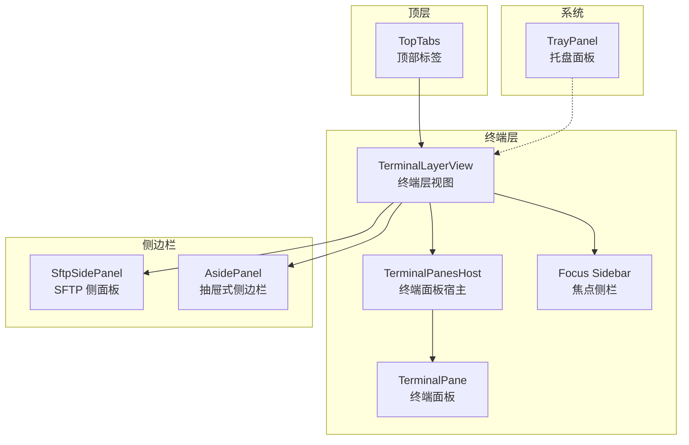
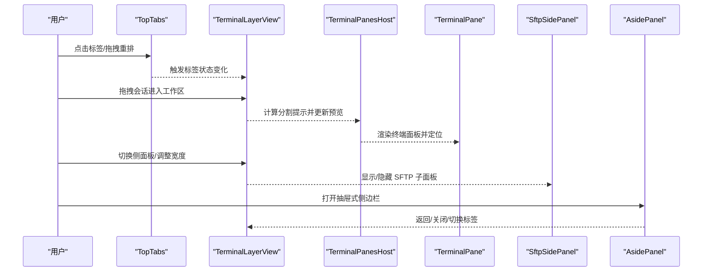
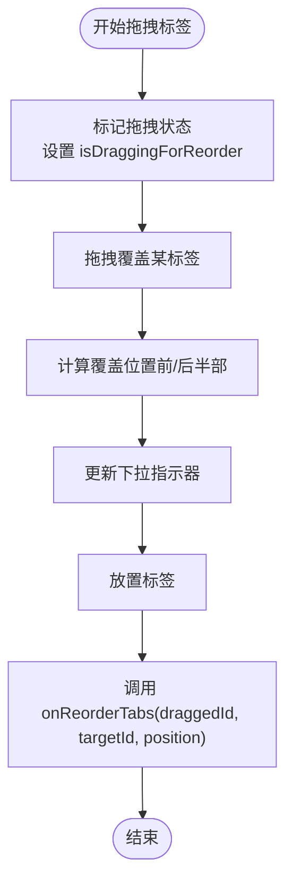
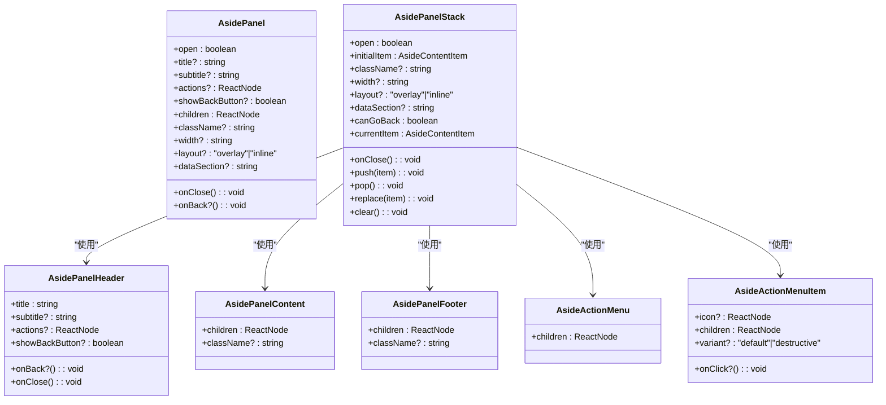
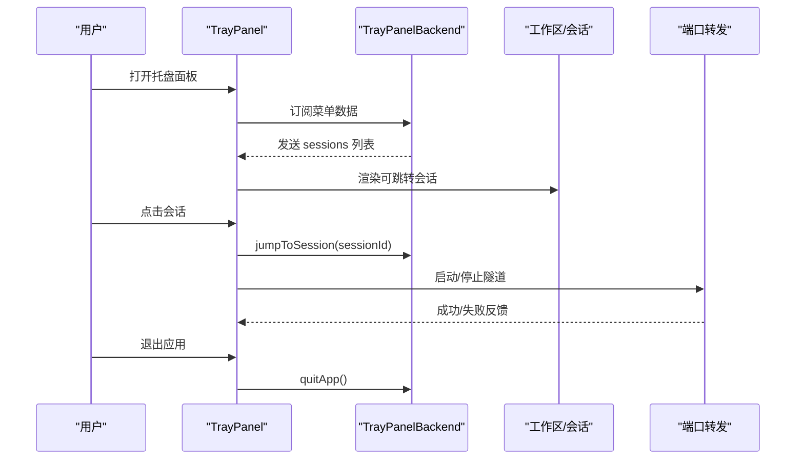
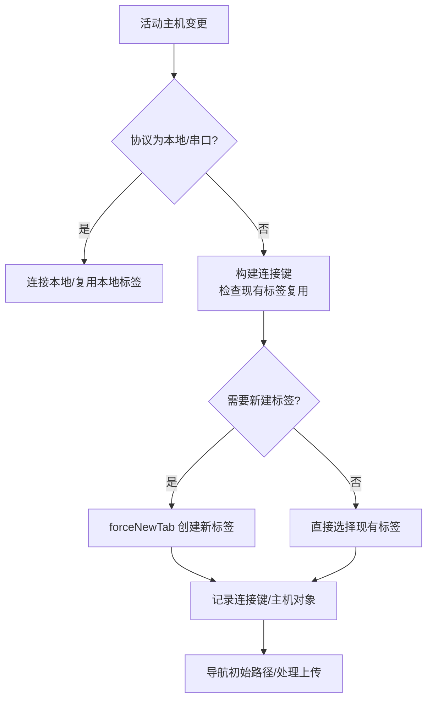
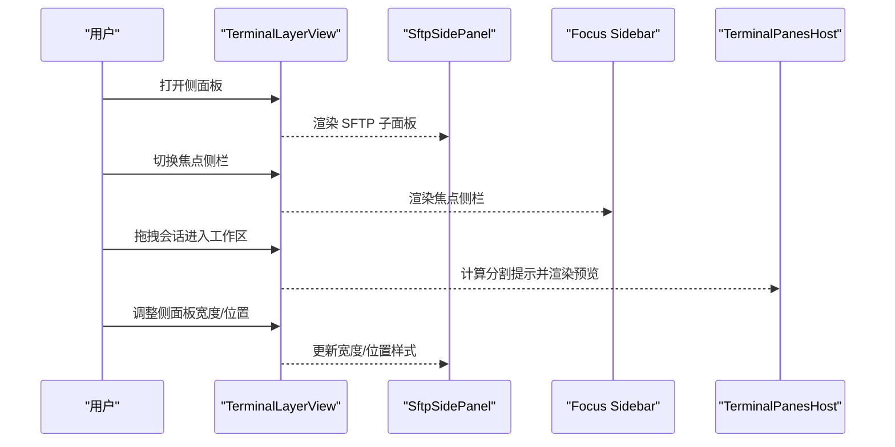
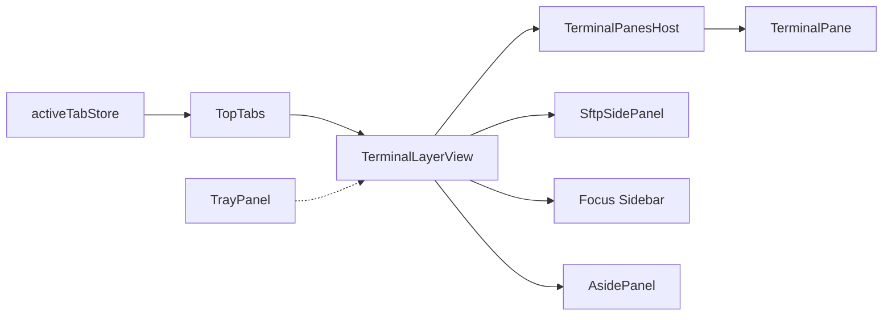

# 布局组件

<cite>
**本文档引用的文件**
- [TopTabs.tsx](file://components/TopTabs.tsx)
- [TopTabItems.tsx](file://components/top-tabs/TopTabItems.tsx)
- [aside-panel.tsx](file://components/ui/aside-panel.tsx)
- [TrayPanel.tsx](file://components/TrayPanel.tsx)
- [SftpSidePanel.tsx](file://components/SftpSidePanel.tsx)
- [TerminalLayerView.tsx](file://components/terminalLayer/TerminalLayerView.tsx)
- [TerminalLayerSupport.tsx](file://components/terminalLayer/TerminalLayerSupport.tsx)
- [useTerminalWorkspaceLayout.ts](file://components/terminalLayer/useTerminalWorkspaceLayout.ts)
- [useTerminalFocusSidebar.tsx](file://components/terminalLayer/useTerminalFocusSidebar.tsx)
</cite>

## 目录
1. [简介](#简介)
2. [项目结构](#项目结构)
3. [核心组件](#核心组件)
4. [架构总览](#架构总览)
5. [详细组件分析](#详细组件分析)
6. [依赖关系分析](#依赖关系分析)
7. [性能考量](#性能考量)
8. [故障排查指南](#故障排查指南)
9. [结论](#结论)
10. [附录](#附录)

## 简介
本文件聚焦于应用中的布局相关组件，涵盖顶部标签、侧边栏（含抽屉式侧边栏）、托盘面板以及终端工作区布局与焦点侧栏等模块。文档从API维度梳理各组件的属性、方法、状态管理、响应式与主题适配能力，并给出布局切换、面板折叠、位置调整等交互行为的配置选项说明；最后提供组合使用模式与自定义布局示例，以及性能优化与用户体验改进建议。

## 项目结构
布局体系由多层组件协同构成：
- 顶部标签：负责应用根级标签页与会话/工作区标签的展示与交互
- 终端工作区：支持分屏与焦点模式，提供拖拽拆分、预览提示、重排与尺寸调整
- 侧边栏：支持抽屉式堆叠导航与内嵌面板，提供头部、内容区、底部与动作菜单
- 托盘面板：系统托盘弹出面板，集中展示会话与端口转发状态
- SFTP 侧面板：在终端层中作为可选子面板，提供文件浏览与传输队列

**图表来源**
- [TopTabs.tsx:62-676](file://components/TopTabs.tsx#L62-L676)
- [TerminalLayerView.tsx:6-454](file://components/terminalLayer/TerminalLayerView.tsx#L6-L454)
- [TerminalLayerSupport.tsx:361-422](file://components/terminalLayer/TerminalLayerSupport.tsx#L361-L422)
- [aside-panel.tsx:174-333](file://components/ui/aside-panel.tsx#L174-L333)
- [TrayPanel.tsx:431-441](file://components/TrayPanel.tsx#L431-L441)
- [SftpSidePanel.tsx:78-800](file://components/SftpSidePanel.tsx#L78-L800)

**章节来源**
- [TopTabs.tsx:62-676](file://components/TopTabs.tsx#L62-L676)
- [TerminalLayerView.tsx:6-454](file://components/terminalLayer/TerminalLayerView.tsx#L6-L454)
- [TerminalLayerSupport.tsx:361-422](file://components/terminalLayer/TerminalLayerSupport.tsx#L361-L422)
- [aside-panel.tsx:174-333](file://components/ui/aside-panel.tsx#L174-L333)
- [TrayPanel.tsx:431-441](file://components/TrayPanel.tsx#L431-L441)
- [SftpSidePanel.tsx:78-800](file://components/SftpSidePanel.tsx#L78-L800)

## 核心组件
- 顶部标签 TopTabs
  - 职责：承载应用根标签（Vaults、SFTP）与动态标签（编辑器、会话、工作区、日志视图），支持拖拽重排、滚动与溢出处理、窗口控制按钮、主题切换等
  - 关键属性：主题、是否跟随应用终端主题、主机列表、会话列表、孤立会话、工作区列表、日志视图列表、标签顺序、拖拽会话ID、是否为 macOS 客户端、是否沉浸模式、是否显示 SFTP 标签、编辑器标签集合、主机映射
  - 关键回调：关闭会话、重命名会话、复制会话、重命名/关闭工作区、关闭日志视图、批量关闭标签、打开快速切换器、切换主题、打开设置、同步触发、开始/结束会话拖拽、重排标签、打开编辑器标签请求
- 侧边栏 AsidePanel
  - 职责：抽屉式侧边栏容器，支持单面板与堆叠栈、头部/内容/底部三段式结构、动作菜单、返回按钮、宽度与布局（覆盖 overlay 或内联 inline）
  - 关键属性：是否打开、关闭回调、标题/副标题/动作、是否显示返回按钮、返回回调、子节点、类名、宽度、布局、数据标识 dataSection
  - 关键方法：push/pop/replace/clear（堆叠栈操作）、canGoBack/currentItem（当前项）
- 托盘面板 TrayPanel
  - 职责：系统托盘弹出面板，展示可跳转会话、当前会话、端口转发规则及其状态，支持点击跳转、启动/停止隧道、退出应用
  - 关键属性：无（通过 hooks 订阅状态）
  - 关键交互：隐藏面板、打开主窗口、退出应用、跳转到会话、刷新菜单数据、关闭请求监听
- SFTP 侧面板 SftpSidePanel
  - 职责：在终端层中作为可选子面板，渲染单个 SFTP 面板，支持自动连接、初始路径、上传处理、文件监视、传输队列、文本编辑器、权限对话框、文件打开器等
  - 关键属性：主机列表、可写主机、密钥/身份、更新主机、默认视图模式、活动主机、初始位置、是否可见、是否渲染覆盖层、双击行为、自动同步、显示隐藏文件、压缩上传、热键方案、按键绑定、编辑器换行、终端设置
  - 关键行为：自动连接至活动主机、应用初始位置、处理外部上传、显示/隐藏文件、打开终端 CWD、保存文本文件、提升为标签、选择系统应用等
- 终端层视图 TerminalLayerView
  - 职责：组织终端工作区、侧边栏、焦点侧栏、拖拽拆分预览、重排指示、尺寸调整手柄、全局命令栏等
  - 关键属性：上下文 ctx 中包含主题预览、侧面板开关与位置、拖拽会话、工作区矩形映射、焦点会话、挂载的 SFTP/AI 标签页、热键与按键绑定、会话日志配置等
  - 关键交互：侧面板切换、侧面板宽度调整、侧面板位置左右互换、关闭侧面板、焦点侧栏渲染、拖拽进入工作区、重排会话、尺寸调整、全局命令栏开关
- 终端层支持 TerminalLayerSupport
  - 职责：定义类型（侧面板标签、分割提示、重排手柄、待上传、AI 上下文等）、主题预览变量清理、终端输出过滤、AI 面板宿主、终端面板宿主等
  - 关键类型：SidePanelTab、SplitHint、ResizerHandle、PendingSftpUpload、AI 聊天上下文
  - 关键函数：清除预览样式变量、过滤映射、终端输出清洗、AI 面板宿主、终端面板宿主
- 工作区布局 useTerminalWorkspaceLayout
  - 职责：计算工作区矩形、收集重排手柄、计算拖拽分割提示、处理工作区放置、跟踪拖拽状态、重置/设置拖拽会话ID
  - 关键方法：computeWorkspaceRects、collectResizers、computeSplitHint、handleWorkspaceDrop、findSplitNode
- 焦点侧栏 useTerminalFocusSidebar
  - 职责：焦点模式下的侧栏，支持搜索、添加到工作区、切换视图模式、拖拽重排、侧栏宽度持久化、按终端主题着色
  - 关键方法：渲染焦点侧栏、拖拽开始/移动/放置、容器拖拽目标判定、侧栏宽度调整、搜索过滤

**章节来源**
- [TopTabs.tsx:30-60](file://components/TopTabs.tsx#L30-L60)
- [TopTabs.tsx:62-676](file://components/TopTabs.tsx#L62-L676)
- [aside-panel.tsx:36-53](file://components/ui/aside-panel.tsx#L36-L53)
- [aside-panel.tsx:174-333](file://components/ui/aside-panel.tsx#L174-L333)
- [TrayPanel.tsx:114-117](file://components/TrayPanel.tsx#L114-L117)
- [TrayPanel.tsx:431-441](file://components/TrayPanel.tsx#L431-L441)
- [SftpSidePanel.tsx:43-76](file://components/SftpSidePanel.tsx#L43-L76)
- [SftpSidePanel.tsx:78-800](file://components/SftpSidePanel.tsx#L78-L800)
- [TerminalLayerView.tsx:6-454](file://components/terminalLayer/TerminalLayerView.tsx#L6-L454)
- [TerminalLayerSupport.tsx:21-48](file://components/terminalLayer/TerminalLayerSupport.tsx#L21-L48)
- [TerminalLayerSupport.tsx:361-422](file://components/terminalLayer/TerminalLayerSupport.tsx#L361-L422)
- [TerminalLayerSupport.tsx:424-787](file://components/terminalLayer/TerminalLayerSupport.tsx#L424-L787)
- [useTerminalWorkspaceLayout.ts:6-26](file://components/terminalLayer/useTerminalWorkspaceLayout.ts#L6-L26)
- [useTerminalWorkspaceLayout.ts:17-228](file://components/terminalLayer/useTerminalWorkspaceLayout.ts#L17-L228)
- [useTerminalFocusSidebar.tsx:15-41](file://components/terminalLayer/useTerminalFocusSidebar.tsx#L15-L41)
- [useTerminalFocusSidebar.tsx:29-392](file://components/terminalLayer/useTerminalFocusSidebar.tsx#L29-L392)

## 架构总览
布局系统采用“顶层标签 + 终端层 + 侧边栏/托盘”的分层设计，终端层内部再细分为工作区布局、焦点侧栏与侧边面板。组件间通过上下文与 hooks 共享状态，实现低耦合高内聚的布局编排。

**图表来源**
- [TopTabs.tsx:200-257](file://components/TopTabs.tsx#L200-L257)
- [TerminalLayerView.tsx:298-334](file://components/terminalLayer/TerminalLayerView.tsx#L298-L334)
- [TerminalLayerSupport.tsx:764-787](file://components/terminalLayer/TerminalLayerSupport.tsx#L764-L787)
- [SftpSidePanel.tsx:667-795](file://components/SftpSidePanel.tsx#L667-L795)
- [aside-panel.tsx:283-330](file://components/ui/aside-panel.tsx#L283-L330)

**章节来源**
- [TopTabs.tsx:200-257](file://components/TopTabs.tsx#L200-L257)
- [TerminalLayerView.tsx:298-334](file://components/terminalLayer/TerminalLayerView.tsx#L298-L334)
- [TerminalLayerSupport.tsx:764-787](file://components/terminalLayer/TerminalLayerSupport.tsx#L764-L787)
- [SftpSidePanel.tsx:667-795](file://components/SftpSidePanel.tsx#L667-L795)
- [aside-panel.tsx:283-330](file://components/ui/aside-panel.tsx#L283-L330)

## 详细组件分析

### 顶部标签 TopTabs
- 属性与方法
  - 主题 theme：'dark' | 'light'
  - 跟随应用终端主题 followAppTerminalTheme：布尔
  - 数据源 hosts/sessions/orphanSessions/workspaces/logViews/orderedTabs/draggingSessionId/isMacClient/showSftpTab
  - 回调 onCloseSession/onRenameSession/onCopySession/onRenameWorkspace/onCloseWorkspace/onCloseLogView/onCloseTabsBatch/onOpenQuickSwitcher/onToggleTheme/onOpenSettings/onSyncNow/isImmersiveActive/onStartSessionDrag/onEndSessionDrag/onReorderTabs
  - 内部状态：滚动状态（左/右/溢出）、窗口全屏状态、拖拽重排状态、下拉指示器、位移样式缓存
  - 优化：O(1) 查找映射（主机/工作区/日志视图/孤儿会话）、编辑器标签计数去重、拖拽位移样式预计算
- 交互行为
  - 标签拖拽重排：拖拽开始/结束、拖拽覆盖时更新下拉指示器、放置时调用 onReorderTabs
  - 滚动条与滚轮：垂直滚轮转换为水平滚动、溢出时显示遮罩与更多按钮
  - 双击标题栏最大化（非 macOS）
  - 窗口控制按钮：最小化/最大化/关闭
- 主题适配
  - 使用 CSS 变量 --top-tabs-* 控制背景、前景、强调色等
  - 支持沉浸模式下禁用主题切换按钮
- 响应式设计
  - macOS 全屏时调整左侧留白
  - 标签溢出时显示“更多”按钮与“新建标签”按钮

**图表来源**
- [TopTabs.tsx:200-257](file://components/TopTabs.tsx#L200-L257)

**章节来源**
- [TopTabs.tsx:30-60](file://components/TopTabs.tsx#L30-L60)
- [TopTabs.tsx:62-676](file://components/TopTabs.tsx#L62-L676)
- [TopTabItems.tsx:198-232](file://components/top-tabs/TopTabItems.tsx#L198-L232)
- [TopTabItems.tsx:296-381](file://components/top-tabs/TopTabItems.tsx#L296-L381)
- [TopTabItems.tsx:382-512](file://components/top-tabs/TopTabItems.tsx#L382-L512)
- [TopTabItems.tsx:514-647](file://components/top-tabs/TopTabItems.tsx#L514-L647)
- [TopTabItems.tsx:649-721](file://components/top-tabs/TopTabItems.tsx#L649-L721)

### 侧边栏 AsidePanel
- 组件形态
  - 单面板 AsidePanel：title/subtitle/actions/showBackButton/onBack/children/width/layout/dataSection
  - 堆叠面板 AsidePanelStack：initialItem/stack 操作 push/pop/replace/clear/canGoBack/currentItem
- 结构组成
  - 头部 AsidePanelHeader：title/subtitle/actions/onBack/onClose/showBackButton
  - 内容 AsidePanelContent：滚动区域包裹子节点
  - 底部 AsidePanelFooter：固定底部操作区
  - 动作菜单 AsideActionMenu/AsideActionMenuItem：弹出菜单与菜单项
- 布局与宽度
  - overlay：绝对定位，支持任意宽度类名
  - inline：相对定位，内联宽度通过 CSS 变量 --aside-inline-width 控制
- 使用建议
  - 优先使用堆叠面板以支持“返回”导航
  - 通过 dataSection 为自定义 CSS 提供稳定选择器

**图表来源**
- [aside-panel.tsx:36-53](file://components/ui/aside-panel.tsx#L36-L53)
- [aside-panel.tsx:65-102](file://components/ui/aside-panel.tsx#L65-L102)
- [aside-panel.tsx:105-116](file://components/ui/aside-panel.tsx#L105-L116)
- [aside-panel.tsx:119-128](file://components/ui/aside-panel.tsx#L119-L128)
- [aside-panel.tsx:131-171](file://components/ui/aside-panel.tsx#L131-L171)
- [aside-panel.tsx:174-280](file://components/ui/aside-panel.tsx#L174-L280)
- [aside-panel.tsx:283-330](file://components/ui/aside-panel.tsx#L283-L330)

**章节来源**
- [aside-panel.tsx:36-53](file://components/ui/aside-panel.tsx#L36-L53)
- [aside-panel.tsx:65-102](file://components/ui/aside-panel.tsx#L65-L102)
- [aside-panel.tsx:105-116](file://components/ui/aside-panel.tsx#L105-L116)
- [aside-panel.tsx:119-128](file://components/ui/aside-panel.tsx#L119-L128)
- [aside-panel.tsx:131-171](file://components/ui/aside-panel.tsx#L131-L171)
- [aside-panel.tsx:174-280](file://components/ui/aside-panel.tsx#L174-L280)
- [aside-panel.tsx:283-330](file://components/ui/aside-panel.tsx#L283-L330)

### 托盘面板 TrayPanel
- 功能概览
  - 展示可跳转会话（按工作区分组或独立会话）
  - 当前会话快捷入口
  - 端口转发规则（动态/静态）状态与启停
  - 打开主窗口、关闭托盘面板、退出应用
- 交互要点
  - 点击背景空白处关闭面板
  - ESC 键关闭面板
  - 点击会话跳转到对应终端
  - 端口转发点击启动/停止，失败时提示错误
- 状态来源
  - 通过 useTrayPanelBackend 订阅菜单数据与刷新事件

**图表来源**
- [TrayPanel.tsx:118-168](file://components/TrayPanel.tsx#L118-L168)
- [TrayPanel.tsx:203-208](file://components/TrayPanel.tsx#L203-L208)
- [TrayPanel.tsx:246-428](file://components/TrayPanel.tsx#L246-L428)

**章节来源**
- [TrayPanel.tsx:114-117](file://components/TrayPanel.tsx#L114-L117)
- [TrayPanel.tsx:118-168](file://components/TrayPanel.tsx#L118-L168)
- [TrayPanel.tsx:203-208](file://components/TrayPanel.tsx#L203-L208)
- [TrayPanel.tsx:246-428](file://components/TrayPanel.tsx#L246-L428)
- [TrayPanel.tsx:431-441](file://components/TrayPanel.tsx#L431-L441)

### SFTP 侧面板 SftpSidePanel
- 关键职责
  - 在终端层中作为可选子面板，渲染单个 SFTP 面板
  - 自动连接至活动主机（本地/远程/串口隔离），复用现有标签或新建
  - 处理初始位置导航、外部上传、文件监视、传输队列、文本编辑器、权限对话框、文件打开器
- 属性与行为
  - 主机/密钥/身份/更新主机
  - 默认视图模式、双击行为、自动同步、显示隐藏文件、压缩上传
  - 热键方案/按键绑定、编辑器换行、终端设置
  - 是否可见、是否渲染覆盖层、工作区主机头
  - 初始位置与回调、待上传处理与回调
- 性能与体验
  - 通过 ref 缓存与 useMemo 降低重渲染
  - 自动连接延迟处理，避免在编辑器/权限对话框/文件监视活跃时切换
  - 仅对当前连接主机显示传输目标回显与复制路径

**图表来源**
- [SftpSidePanel.tsx:356-454](file://components/SftpSidePanel.tsx#L356-L454)

**章节来源**
- [SftpSidePanel.tsx:43-76](file://components/SftpSidePanel.tsx#L43-L76)
- [SftpSidePanel.tsx:78-800](file://components/SftpSidePanel.tsx#L78-L800)
- [SftpSidePanel.tsx:356-454](file://components/SftpSidePanel.tsx#L356-L454)
- [SftpSidePanel.tsx:470-560](file://components/SftpSidePanel.tsx#L470-L560)
- [SftpSidePanel.tsx:562-646](file://components/SftpSidePanel.tsx#L562-L646)

### 终端层视图 TerminalLayerView
- 组织结构
  - 侧边栏：SFTP/脚本/主题/AI 子面板，支持标签头、内容区、关闭、左右位置切换、宽度调整
  - 焦点侧栏：焦点模式下的终端列表，支持搜索、添加到工作区、切换视图模式、拖拽重排
  - 工作区：终端面板宿主，支持拖拽拆分预览、重排指示、尺寸调整手柄
  - 全局命令栏：工作区广播输入与发送
- 关键交互
  - 侧面板开关与宽度：handleSidePanelResizeStart、setSidePanelPosition
  - 侧面板标签切换：handleToggleSftpFromBar/handleOpenScripts/handleOpenTheme/handleOpenAI
  - 工作区拖拽：computeSplitHint、setDropHint、handleWorkspaceDrop
  - 尺寸调整：findSplitNode、setResizing、activeResizers 渲染

**图表来源**
- [TerminalLayerView.tsx:26-291](file://components/terminalLayer/TerminalLayerView.tsx#L26-L291)
- [TerminalLayerView.tsx:297-435](file://components/terminalLayer/TerminalLayerView.tsx#L297-L435)
- [TerminalLayerView.tsx:439-450](file://components/terminalLayer/TerminalLayerView.tsx#L439-L450)

**章节来源**
- [TerminalLayerView.tsx:6-454](file://components/terminalLayer/TerminalLayerView.tsx#L6-L454)

### 终端层支持 TerminalLayerSupport
- 类型与工具
  - 侧面板标签：'sftp' | 'scripts' | 'theme' | 'ai'
  - 分割提示：direction/position/targetSessionId/rect
  - 重排手柄：id/splitId/index/direction/rect/splitArea
  - 待上传：requestId/hostId/connectionKey/targetPath/entries
  - AI 聊天上下文：scopeType/scopeTargetId/scopeHostIds/scopeLabel/terminalSessions
- 函数
  - 清除预览样式变量（终端/顶部标签）
  - 过滤映射 filterTabsMap
  - 终端输出清洗与通知判断
  - AI 面板宿主与状态维护

**章节来源**
- [TerminalLayerSupport.tsx:21-48](file://components/terminalLayer/TerminalLayerSupport.tsx#L21-L48)
- [TerminalLayerSupport.tsx:114-143](file://components/terminalLayer/TerminalLayerSupport.tsx#L114-L143)
- [TerminalLayerSupport.tsx:154-178](file://components/terminalLayer/TerminalLayerSupport.tsx#L154-L178)
- [TerminalLayerSupport.tsx:228-360](file://components/terminalLayer/TerminalLayerSupport.tsx#L228-L360)
- [TerminalLayerSupport.tsx:361-422](file://components/terminalLayer/TerminalLayerSupport.tsx#L361-L422)
- [TerminalLayerSupport.tsx:424-787](file://components/terminalLayer/TerminalLayerSupport.tsx#L424-L787)

### 工作区布局 useTerminalWorkspaceLayout
- 计算工作区矩形：根据方向与尺寸比例递归计算每个 pane 的坐标与大小
- 收集重排手柄：遍历分割节点生成手柄矩形，用于鼠标悬停与拖拽调整
- 分割提示：基于鼠标位置与相对坐标判断分割方向与位置，并裁剪预览矩形
- 拖拽放置：根据提示向工作区添加会话或从会话创建新工作区
- 状态管理：跟踪拖拽会话ID、下拉指示器、重置/设置拖拽状态

**章节来源**
- [useTerminalWorkspaceLayout.ts:17-228](file://components/terminalLayer/useTerminalWorkspaceLayout.ts#L17-L228)

### 焦点侧栏 useTerminalFocusSidebar
- 搜索：支持按主机标签/主机名/用户名过滤
- 添加到工作区：请求添加到当前工作区
- 切换视图模式：切换到分屏视图
- 拖拽重排：容器级拖拽目标判定、前后插入指示、最终调用 onReorderWorkspaceSessions
- 宽度调整：鼠标拖拽右侧边缘，使用 requestAnimationFrame 平滑更新，持久化存储
- 主题适配：使用终端主题颜色派生行颜色，确保与焦点终端一致

**章节来源**
- [useTerminalFocusSidebar.tsx:29-392](file://components/terminalLayer/useTerminalFocusSidebar.tsx#L29-L392)

## 依赖关系分析
- 组件耦合
  - TopTabs 与 TerminalLayerView 通过回调解耦，TopTabs 不直接操作工作区布局
  - SftpSidePanel 与 TerminalLayerView 通过上下文与 props 解耦，SFTP 状态独立于全局 activeTabStore
  - TrayPanel 通过 backend hooks 订阅状态，不直接依赖终端层
- 状态共享
  - 顶部标签状态通过 activeTabStore 管理，TopTabs 内部使用 store 订阅
  - 终端层通过 ctx 注入主题预览、拖拽会话ID、工作区矩形映射等
  - 侧边栏通过 useStoredNumber 持久化宽度
- 外部依赖
  - 窗口控制（最大化/最小化/关闭）通过 useWindowControls
  - 国际化通过 useI18n
  - 主题预览通过 resolvedPreviewTheme

**图表来源**
- [TopTabs.tsx:93-95](file://components/TopTabs.tsx#L93-L95)
- [TerminalLayerView.tsx:6-454](file://components/terminalLayer/TerminalLayerView.tsx#L6-L454)
- [TerminalLayerSupport.tsx:361-422](file://components/terminalLayer/TerminalLayerSupport.tsx#L361-L422)
- [aside-panel.tsx:174-333](file://components/ui/aside-panel.tsx#L174-L333)
- [TrayPanel.tsx:431-441](file://components/TrayPanel.tsx#L431-L441)
- [SftpSidePanel.tsx:78-800](file://components/SftpSidePanel.tsx#L78-L800)

**章节来源**
- [TopTabs.tsx:93-95](file://components/TopTabs.tsx#L93-L95)
- [TerminalLayerView.tsx:6-454](file://components/terminalLayer/TerminalLayerView.tsx#L6-L454)
- [TerminalLayerSupport.tsx:361-422](file://components/terminalLayer/TerminalLayerSupport.tsx#L361-L422)
- [aside-panel.tsx:174-333](file://components/ui/aside-panel.tsx#L174-L333)
- [TrayPanel.tsx:431-441](file://components/TrayPanel.tsx#L431-L441)
- [SftpSidePanel.tsx:78-800](file://components/SftpSidePanel.tsx#L78-L800)

## 性能考量
- 渲染优化
  - TopTabs 使用 useMemo 构建查找映射与标签项，避免 O(n) 查找与重复渲染
  - SftpSidePanel 使用 ref 缓存与 useMemo，减少状态抖动导致的重渲染
  - TerminalLayerView 将终端面板渲染委托给 TerminalPanesHost，按需渲染可见面板
- 事件处理
  - 滚轮事件在 TopTabs 中转换为水平滚动，避免滚动冲突
  - 侧边栏宽度调整使用 requestAnimationFrame，保证流畅性
- 主题与样式
  - 通过 CSS 变量与派生颜色，避免频繁重绘
  - 清理预览样式变量，防止样式污染

[本节为通用指导，无需特定文件引用]

## 故障排查指南
- 侧边栏无法关闭
  - 检查 isSidePanelOpenForCurrentTab 与 handleCloseSidePanel 的调用链
  - 确认侧面板根元素的 pointer-events 设置
- 拖拽拆分无效
  - 确认 isFocusMode 为 false，且拖拽事件包含 session-id
  - 检查 computeSplitHint 的边界计算与 rect 裁剪
- SFTP 侧面板不显示
  - 确认 activeTabId 与 activeSidePanelTab 匹配，且 isVisible 为 true
  - 检查 sftpActiveHost 与初始位置是否正确传入
- 托盘面板点击空白不关闭
  - 确认 onPointerDown 事件监听与 target 判定逻辑
- 焦点侧栏宽度调整无效
  - 检查 handleFocusSidebarResizeStart 与 requestAnimationFrame 的使用
  - 确认最小/最大宽度限制与持久化存储

**章节来源**
- [TerminalLayerView.tsx:190-200](file://components/terminalLayer/TerminalLayerView.tsx#L190-L200)
- [useTerminalWorkspaceLayout.ts:128-178](file://components/terminalLayer/useTerminalWorkspaceLayout.ts#L128-L178)
- [SftpSidePanel.tsx:200-264](file://components/SftpSidePanel.tsx#L200-L264)
- [TrayPanel.tsx:184-201](file://components/TrayPanel.tsx#L184-L201)
- [useTerminalFocusSidebar.tsx:58-83](file://components/terminalLayer/useTerminalFocusSidebar.tsx#L58-L83)

## 结论
本布局体系通过清晰的分层与解耦设计，实现了顶部标签、终端工作区、侧边栏与托盘面板的灵活组合。组件以 props 与 hooks 为核心进行状态传递，配合主题预览与样式变量，兼顾了视觉一致性与性能表现。通过拖拽拆分、焦点侧栏与抽屉式侧边栏等交互，提供了高效的工作流组织方式。

[本节为总结，无需特定文件引用]

## 附录
- 组合使用模式
  - 顶部标签 + 终端工作区：适用于多会话并行场景，结合焦点侧栏快速切换
  - 侧边栏抽屉式：用于设置、脚本、主题等辅助功能，支持堆叠导航
  - 托盘面板：系统级快速访问，集中管理会话与端口转发
  - SFTP 侧面板：与终端联动，提供文件浏览与传输队列
- 自定义布局示例
  - 将 AsidePanelStack 作为侧边栏内容，通过 push/replace 实现多级页面
  - 在 TerminalLayerView 中根据 isFocusMode 切换焦点侧栏与工作区布局
  - 使用 useStoredNumber 持久化侧边栏宽度，提升用户体验
- 最佳实践
  - 使用 useMemo/useCallback 缓存计算结果与回调
  - 通过 CSS 变量统一主题风格，避免硬编码颜色
  - 对高频事件（如滚轮、拖拽）进行节流/RAF 优化
  - 保持组件单一职责，通过 hooks 抽离状态逻辑

[本节为通用指导，无需特定文件引用]