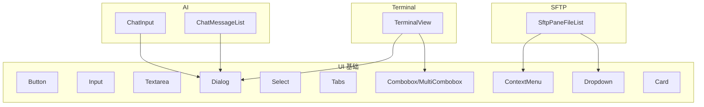
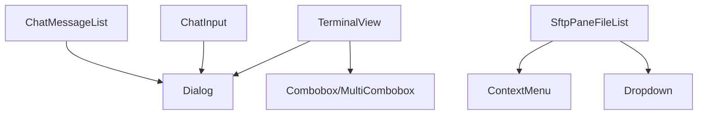
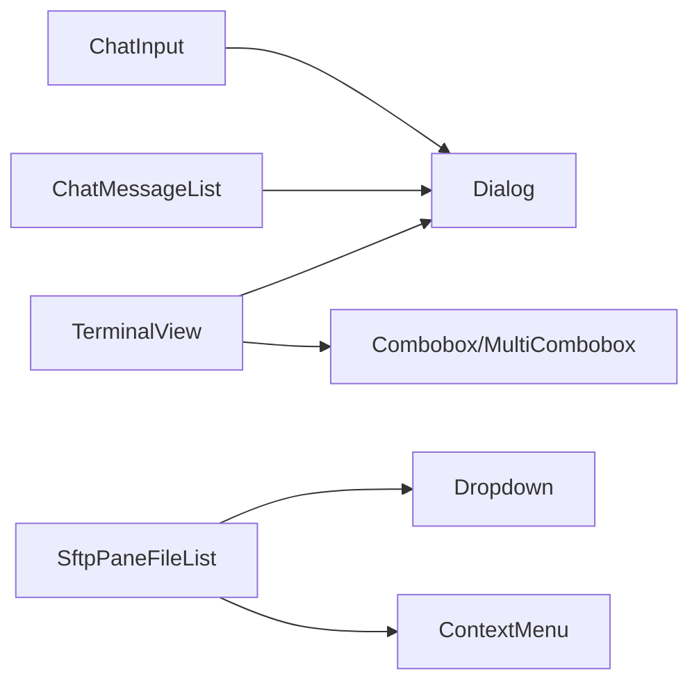

# 组件API

<cite>
**本文引用的文件**
- [components/ui/button.tsx](file://components/ui/button.tsx)
- [components/ui/dialog.tsx](file://components/ui/dialog.tsx)
- [components/ui/input.tsx](file://components/ui/input.tsx)
- [components/ui/select.tsx](file://components/ui/select.tsx)
- [components/ui/tabs.tsx](file://components/ui/tabs.tsx)
- [components/ui/card.tsx](file://components/ui/card.tsx)
- [components/ui/context-menu.tsx](file://components/ui/context-menu.tsx)
- [components/ui/dropdown.tsx](file://components/ui/dropdown.tsx)
- [components/ui/textarea.tsx](file://components/ui/textarea.tsx)
- [components/ui/combobox.tsx](file://components/ui/combobox.tsx)
- [components/ai/ChatInput.tsx](file://components/ai/ChatInput.tsx)
- [components/ai/ChatMessageList.tsx](file://components/ai/ChatMessageList.tsx)
- [components/sftp/SftpPaneFileList.tsx](file://components/sftp/SftpPaneFileList.tsx)
- [components/terminal/TerminalView.tsx](file://components/terminal/TerminalView.tsx)
</cite>

## 目录
1. [简介](#简介)
2. [项目结构](#项目结构)
3. [核心组件](#核心组件)
4. [架构总览](#架构总览)
5. [详细组件分析](#详细组件分析)
6. [依赖关系分析](#依赖关系分析)
7. [性能考量](#性能考量)
8. [故障排查指南](#故障排查指南)
9. [结论](#结论)
10. [附录](#附录)

## 简介
本文件系统化梳理 Netcatty 前端 React 组件库的公共 API，覆盖基础 UI 组件与业务场景组件（AI、SFTP、终端）。内容包括：
- 每个组件的 props 接口定义、默认值、类型约束与校验规则
- 事件回调、状态管理与内部方法
- 组件组合模式、嵌套使用与样式定制
- 可访问性、响应式设计与跨浏览器兼容性要点
- 性能优化建议与调试技巧

## 项目结构
组件主要分布在以下目录：
- components/ui：通用 UI 基础组件（按钮、输入框、对话框、选择器、标签页等）
- components/ai：AI 聊天相关组件（输入区、消息列表、工具调用等）
- components/sftp：SFTP 文件面板组件（文件列表、上下文菜单、拖放等）
- components/terminal：终端视图与工具条组件
- components/ai-elements：AI 元素级子组件（对话、消息、提示输入、工具调用等）

图表来源
- [components/ui/button.tsx:1-39](file://components/ui/button.tsx#L1-L39)
- [components/ui/dialog.tsx:1-132](file://components/ui/dialog.tsx#L1-L132)
- [components/ui/select.tsx:1-151](file://components/ui/select.tsx#L1-L151)
- [components/ui/tabs.tsx:1-54](file://components/ui/tabs.tsx#L1-L54)
- [components/ui/combobox.tsx:1-429](file://components/ui/combobox.tsx#L1-L429)
- [components/ui/context-menu.tsx:1-273](file://components/ui/context-menu.tsx#L1-L273)
- [components/ui/dropdown.tsx:1-261](file://components/ui/dropdown.tsx#L1-L261)
- [components/ui/card.tsx:1-20](file://components/ui/card.tsx#L1-L20)
- [components/ai/ChatInput.tsx:1-955](file://components/ai/ChatInput.tsx#L1-L955)
- [components/ai/ChatMessageList.tsx:1-468](file://components/ai/ChatMessageList.tsx#L1-L468)
- [components/sftp/SftpPaneFileList.tsx:1-704](file://components/sftp/SftpPaneFileList.tsx#L1-L704)
- [components/terminal/TerminalView.tsx:1-638](file://components/terminal/TerminalView.tsx#L1-L638)

章节来源
- [components/ui/button.tsx:1-39](file://components/ui/button.tsx#L1-L39)
- [components/ui/dialog.tsx:1-132](file://components/ui/dialog.tsx#L1-L132)
- [components/ui/select.tsx:1-151](file://components/ui/select.tsx#L1-L151)
- [components/ui/tabs.tsx:1-54](file://components/ui/tabs.tsx#L1-L54)
- [components/ui/combobox.tsx:1-429](file://components/ui/combobox.tsx#L1-L429)
- [components/ui/context-menu.tsx:1-273](file://components/ui/context-menu.tsx#L1-L273)
- [components/ui/dropdown.tsx:1-261](file://components/ui/dropdown.tsx#L1-L261)
- [components/ui/card.tsx:1-20](file://components/ui/card.tsx#L1-L20)
- [components/ai/ChatInput.tsx:1-955](file://components/ai/ChatInput.tsx#L1-L955)
- [components/ai/ChatMessageList.tsx:1-468](file://components/ai/ChatMessageList.tsx#L1-L468)
- [components/sftp/SftpPaneFileList.tsx:1-704](file://components/sftp/SftpPaneFileList.tsx#L1-L704)
- [components/terminal/TerminalView.tsx:1-638](file://components/terminal/TerminalView.tsx#L1-L638)

## 核心组件
本节概述基础 UI 组件的公共 API。

- Button
  - Props 接口：继承原生 button 属性，新增 variant、size
  - 默认值：variant="default"；size="default"
  - 类型约束：variant ∈ ["default","destructive","outline","secondary","ghost","link"]；size ∈ ["default","sm","lg","icon"]
  - 样式与交互：通过类名组合实现变体与尺寸；禁用态禁用点击与降低透明度
  - 可访问性：保留原生 button 行为，支持聚焦与键盘操作
  - 使用示例路径：[Button 示例:10-35](file://components/ui/button.tsx#L10-L35)

- Input
  - Props 接口：继承原生 input 属性
  - 默认值：无特定默认值
  - 类型约束：type 支持原生 input 类型
  - 样式与交互：统一圆角、边框、占位符颜色与禁用态
  - 使用示例路径：[Input 示例:7-21](file://components/ui/input.tsx#L7-L21)

- Textarea
  - Props 接口：继承原生 textarea 属性
  - 默认值：无特定默认值
  - 样式与交互：统一圆角、边框、占位符颜色与禁用态
  - 使用示例路径：[Textarea 示例:7-19](file://components/ui/textarea.tsx#L7-L19)

- Dialog
  - 组合组件：Root、Trigger、Portal、Overlay、Content、Header、Footer、Title、Description、Close
  - Props 关键点：Content 支持 hideCloseButton、overlayClassName；Overlay 动画类名；Content 动画与阴影
  - 可访问性：自动设置 aria-describedby；关闭按钮隐藏于屏幕阅读器
  - 使用示例路径：[Dialog 示例:31-71](file://components/ui/dialog.tsx#L31-L71)

- Select
  - 组合组件：Root、Group、Value、Trigger、ScrollUpButton、ScrollDownButton、Content、Viewport、Label、Item、Separator
  - Props 关键点：Content 支持 position；Item 支持选中指示器；滚动按钮支持自定义图标
  - 可访问性：基于 Radix UI，具备标准 ARIA 属性
  - 使用示例路径：[Select 示例:13-98](file://components/ui/select.tsx#L13-L98)

- Tabs
  - 组合组件：Root、List、Trigger、Content
  - Props 关键点：Trigger 支持激活态样式；Content 支持聚焦隐藏
  - 使用示例路径：[Tabs 示例:8-50](file://components/ui/tabs.tsx#L8-L50)

- Combobox / MultiCombobox
  - Props 关键点：支持搜索过滤、创建新项、多选标签、清空输入、键盘导航（Enter/Escape/Backspace）
  - 多选模式：values 数组驱动标签渲染与移除
  - 使用示例路径：[Combobox 示例:29-221](file://components/ui/combobox.tsx#L29-L221)、[MultiCombobox 示例:240-425](file://components/ui/combobox.tsx#L240-L425)

- ContextMenu
  - 特性：专用 Portal 根节点，避免被其他层遮挡；拦截 aria-hidden 防止可访问性警告
  - 组合组件：Root、Trigger、Portal、Sub、RadioGroup、Content、Item、CheckboxItem、RadioItem、Label、Separator、Shortcut、SubTrigger、SubContent
  - 使用示例路径：[ContextMenu 示例:122-143](file://components/ui/context-menu.tsx#L122-L143)

- Dropdown
  - 特性：受控/非受控开关；计算定位并限制在视口内；点击外部与 Esc 关闭；支持 align/alignToParent/side/sideOffset
  - 组合组件：Dropdown、DropdownTrigger、DropdownContent
  - 使用示例路径：[Dropdown 示例:34-58](file://components/ui/dropdown.tsx#L34-L58)

- Card
  - Props 接口：继承原生 div 属性
  - 使用示例路径：[Card 示例:4-16](file://components/ui/card.tsx#L4-L16)

章节来源
- [components/ui/button.tsx:4-36](file://components/ui/button.tsx#L4-L36)
- [components/ui/input.tsx:4-22](file://components/ui/input.tsx#L4-L22)
- [components/ui/textarea.tsx:4-21](file://components/ui/textarea.tsx#L4-L21)
- [components/ui/dialog.tsx:8-71](file://components/ui/dialog.tsx#L8-L71)
- [components/ui/select.tsx:7-98](file://components/ui/select.tsx#L7-L98)
- [components/ui/tabs.tsx:6-50](file://components/ui/tabs.tsx#L6-L50)
- [components/ui/combobox.tsx:14-42](file://components/ui/combobox.tsx#L14-L42)
- [components/ui/context-menu.tsx:64-143](file://components/ui/context-menu.tsx#L64-L143)
- [components/ui/dropdown.tsx:28-58](file://components/ui/dropdown.tsx#L28-L58)
- [components/ui/card.tsx:4-16](file://components/ui/card.tsx#L4-L16)

## 架构总览
下图展示组件间典型交互：上层容器组件（如 TerminalView、SftpPaneFileList）组合基础 UI 组件与业务元素组件（如 Dialog、Combobox），并通过回调 props 与状态管理联动。

图表来源
- [components/terminal/TerminalView.tsx:6-636](file://components/terminal/TerminalView.tsx#L6-L636)
- [components/sftp/SftpPaneFileList.tsx:1-704](file://components/sftp/SftpPaneFileList.tsx#L1-L704)
- [components/ai/ChatInput.tsx:101-126](file://components/ai/ChatInput.tsx#L101-L126)
- [components/ai/ChatMessageList.tsx:37-51](file://components/ai/ChatMessageList.tsx#L37-L51)
- [components/ui/dialog.tsx:8-71](file://components/ui/dialog.tsx#L8-L71)
- [components/ui/combobox.tsx:29-42](file://components/ui/combobox.tsx#L29-L42)
- [components/ui/context-menu.tsx:122-143](file://components/ui/context-menu.tsx#L122-L143)
- [components/ui/dropdown.tsx:34-58](file://components/ui/dropdown.tsx#L34-L58)

## 详细组件分析

### Button 组件
- Props 接口
  - 继承原生 ButtonHTMLAttributes<HTMLButtonElement>
  - 新增字段：
    - variant: "default" | "destructive" | "outline" | "secondary" | "ghost" | "link"
    - size: "default" | "sm" | "lg" | "icon"
  - 默认值：variant="default"；size="default"
- 事件与行为
  - 支持原生 onClick 等事件
  - 禁用态禁用交互并降低透明度
- 样式与主题
  - 通过类名映射不同变体与尺寸
- 可访问性
  - 保持原生 button 语义，支持键盘聚焦与激活
- 使用示例路径
  - [Button 定义:10-35](file://components/ui/button.tsx#L10-L35)

章节来源
- [components/ui/button.tsx:4-36](file://components/ui/button.tsx#L4-L36)

### Dialog 组件
- 组合组件
  - Root、Trigger、Portal、Overlay、Content、Header、Footer、Title、Description、Close
- Props 关键点
  - Content：hideCloseButton 控制是否显示关闭按钮；overlayClassName 自定义覆盖层样式
  - Overlay：内置动画类名；Content：内置阴影与居中布局
- 可访问性
  - 自动设置 aria-describedby；关闭按钮对屏幕阅读器隐藏
- 使用示例路径
  - [Dialog 组合组件导出:129-131](file://components/ui/dialog.tsx#L129-L131)
  - [Content 实现:31-71](file://components/ui/dialog.tsx#L31-L71)

章节来源
- [components/ui/dialog.tsx:16-71](file://components/ui/dialog.tsx#L16-L71)

### Input/Textarea 组件
- Props 接口
  - Input：继承 InputHTMLAttributes<HTMLInputElement>
  - Textarea：继承 TextareaHTMLAttributes<HTMLTextAreaElement>
- 默认值与行为
  - 统一圆角、边框、占位符颜色与禁用态
- 使用示例路径
  - [Input:7-21](file://components/ui/input.tsx#L7-L21)
  - [Textarea:7-19](file://components/ui/textarea.tsx#L7-L19)

章节来源
- [components/ui/input.tsx:4-22](file://components/ui/input.tsx#L4-L22)
- [components/ui/textarea.tsx:4-21](file://components/ui/textarea.tsx#L4-L21)

### Select 组件
- 组合组件
  - Root、Group、Value、Trigger、ScrollUpButton、ScrollDownButton、Content、Viewport、Label、Item、Separator
- Props 关键点
  - Trigger：内置 ChevronDown 图标与占位符样式
  - Content：支持 position；Viewport 计算触发器高度/宽度
  - Item：选中指示器 Check；Label：标题样式
- 可访问性
  - 基于 Radix UI，具备标准 ARIA 属性
- 使用示例路径
  - [SelectTrigger:13-30](file://components/ui/select.tsx#L13-L30)
  - [SelectContent:68-98](file://components/ui/select.tsx#L68-L98)
  - [SelectItem:113-133](file://components/ui/select.tsx#L113-L133)

章节来源
- [components/ui/select.tsx:7-98](file://components/ui/select.tsx#L7-L98)

### Tabs 组件
- 组合组件
  - Root、List、Trigger、Content
- Props 关键点
  - Trigger：激活态背景与阴影；Content：聚焦隐藏
- 使用示例路径
  - [TabsTrigger:23-35](file://components/ui/tabs.tsx#L23-L35)
  - [TabsContent:38-49](file://components/ui/tabs.tsx#L38-L49)

章节来源
- [components/ui/tabs.tsx:6-50](file://components/ui/tabs.tsx#L6-L50)

### Combobox / MultiCombobox 组件
- Props 关键点
  - Combobox：options、value、onValueChange、placeholder、emptyText、allowCreate、onCreateNew、createText、icon、className、triggerClassName、disabled
  - MultiCombobox：values、onValuesChange、placeholder、emptyText、allowCreate、onCreateNew、createText、icon、className、triggerClassName、disabled
- 行为特性
  - 搜索过滤（label/value/sublabel）
  - Enter 选择或创建；Escape 关闭；Backspace 多选删除最后一个
  - 清空输入按钮
- 使用示例路径
  - [Combobox:29-221](file://components/ui/combobox.tsx#L29-L221)
  - [MultiCombobox:240-425](file://components/ui/combobox.tsx#L240-L425)

章节来源
- [components/ui/combobox.tsx:14-42](file://components/ui/combobox.tsx#L14-L42)

### ContextMenu 组件
- 特性
  - 专用 Portal 根节点，z-index 达到最大安全值；拦截 aria-hidden 防止可访问性警告
  - SubTrigger/SubContent 支持二级菜单
- 组合组件
  - Root、Trigger、Portal、Sub、RadioGroup、Content、Item、CheckboxItem、RadioItem、Label、Separator、Shortcut、SubTrigger、SubContent
- 使用示例路径
  - [ContextMenuContent:122-143](file://components/ui/context-menu.tsx#L122-L143)

章节来源
- [components/ui/context-menu.tsx:64-143](file://components/ui/context-menu.tsx#L64-L143)

### Dropdown 组件
- 特性
  - 受控/非受控开关；useMemo 缓存 Portal 容器；计算定位并限制在视口内
  - 点击外部与 Esc 关闭；支持 align/alignToParent/side/sideOffset
- 组合组件
  - Dropdown、DropdownTrigger、DropdownContent
- 使用示例路径
  - [Dropdown:34-58](file://components/ui/dropdown.tsx#L34-L58)

章节来源
- [components/ui/dropdown.tsx:28-58](file://components/ui/dropdown.tsx#L28-L58)

### Card 组件
- Props 接口
  - 继承 HTMLAttributes<HTMLDivElement>
- 使用示例路径
  - [Card:4-16](file://components/ui/card.tsx#L4-L16)

章节来源
- [components/ui/card.tsx:4-16](file://components/ui/card.tsx#L4-L16)

### ChatInput 组件（AI）
- Props 接口（节选）
  - value、onChange、onSend、onStop、isStreaming、disabled
  - providerName、modelName、agentName、placeholder
  - modelPresets、selectedModelId、onModelSelect
  - files、onAddFiles、onRemoveFile
  - hosts、selectedUserSkills、userSkills、onAddUserSkill、onRemoveUserSkill
  - permissionMode、onPermissionModeChange
  - providerSwitcher（两层 Provider→Model 选择）
- 内部状态与行为
  - 展开/收起文本域；@ 提及与 / 技能弹窗；文件附件展示与移除；模型选择弹窗
  - 键盘导航：上下箭头、Enter、Esc
  - 粘贴/拖拽文件处理
- 可访问性
  - 弹窗使用 Portal；列表框 role 与 aria-* 属性；屏幕阅读器友好的关闭按钮
- 使用示例路径
  - [ChatInput Props:55-99](file://components/ai/ChatInput.tsx#L55-L99)
  - [输入区域与弹窗:423-617](file://components/ai/ChatInput.tsx#L423-L617)

章节来源
- [components/ai/ChatInput.tsx:55-126](file://components/ai/ChatInput.tsx#L55-L126)

### ChatMessageList 组件（AI）
- Props 接口
  - messages、isStreaming、activeSessionId
- 内部状态与行为
  - 审批请求订阅与清理；图片预览缩放与拖拽；工具调用审批控制
  - 性能优化：React.memo 深比较 messages 列表
- 可访问性
  - 对话与消息元素具备语义化结构
- 使用示例路径
  - [ChatMessageList:30-51](file://components/ai/ChatMessageList.tsx#L30-L51)
  - [图片预览与缩放:75-116](file://components/ai/ChatMessageList.tsx#L75-L116)

章节来源
- [components/ai/ChatMessageList.tsx:30-51](file://components/ai/ChatMessageList.tsx#L30-L51)

### SftpPaneFileList 组件（SFTP）
- Props 接口（节选）
  - pane、side、isPaneFocused、columnWidths、sortField、sortOrder、handleSort、handleResizeStart
  - fileListRef、handleFileListScroll、shouldVirtualize、totalHeight、sortedDisplayFiles
  - isDragOverPane、draggedFiles、onRefresh、onNavigateTo、onClearSelection
  - 新建/重命名/删除、权限编辑、下载/上传、复制/移动等动作回调
- 内部状态与行为
  - 列宽排序与拖拽调整；虚拟化渲染；上下文菜单；拖放覆盖层；错误/重连状态覆盖层
  - 本地/远程差异菜单项控制
- 可访问性
  - 行元素具备 data-sftp-row 属性；上下文菜单支持键盘操作
- 使用示例路径
  - [SftpPaneFileList:28-78](file://components/sftp/SftpPaneFileList.tsx#L28-L78)
  - [上下文菜单与动作:248-464](file://components/sftp/SftpPaneFileList.tsx#L248-L464)

章节来源
- [components/sftp/SftpPaneFileList.tsx:28-78](file://components/sftp/SftpPaneFileList.tsx#L28-L78)

### TerminalView 组件（终端）
- 上下文参数
  - ctx 包含大量终端运行时状态与回调（会话、主机、主题、服务器统计、自动补全、连接对话框、ZMODEM 传输等）
- 结构与功能
  - 工具栏：状态指示、服务器统计悬浮卡片、广播/焦点模式按钮
  - 搜索栏：独立浮动层
  - xterm 容器：动态定位与主题变量注入
  - 连接对话框：认证、主机密钥验证、进度与日志
  - ZMODEM：进度指示与覆盖冲突对话框
- 可访问性
  - 工具栏按钮具备 Tooltip；状态栏信息具备 aria-label
- 使用示例路径
  - [TerminalView:6-636](file://components/terminal/TerminalView.tsx#L6-L636)

章节来源
- [components/terminal/TerminalView.tsx:6-636](file://components/terminal/TerminalView.tsx#L6-L636)

## 依赖关系分析
- 组件耦合
  - ChatInput/ChatMessageList 依赖 Dialog 与 AI 元素组件
  - SftpPaneFileList 依赖 ContextMenu/Dropdown 与 UI 组合组件
  - TerminalView 依赖 Dialog、Combobox、HoverCard 等 UI 组件
- 外部依赖
  - Radix UI（Dialog、Select、Tabs、ContextMenu 等）
  - Lucide 图标库
  - 主题与样式工具函数（cn）
- 循环依赖
  - 未发现直接循环导入；各组件通过 props 传递回调，避免反向依赖

图表来源
- [components/ai/ChatInput.tsx:1-26](file://components/ai/ChatInput.tsx#L1-L26)
- [components/ai/ChatMessageList.tsx:1-21](file://components/ai/ChatMessageList.tsx#L1-L21)
- [components/sftp/SftpPaneFileList.tsx:1-26](file://components/sftp/SftpPaneFileList.tsx#L1-L26)
- [components/terminal/TerminalView.tsx:1-7](file://components/terminal/TerminalView.tsx#L1-L7)

章节来源
- [components/ai/ChatInput.tsx:1-26](file://components/ai/ChatInput.tsx#L1-L26)
- [components/ai/ChatMessageList.tsx:1-21](file://components/ai/ChatMessageList.tsx#L1-L21)
- [components/sftp/SftpPaneFileList.tsx:1-26](file://components/sftp/SftpPaneFileList.tsx#L1-L26)
- [components/terminal/TerminalView.tsx:1-7](file://components/terminal/TerminalView.tsx#L1-L7)

## 性能考量
- 虚拟化渲染
  - SftpPaneFileList 支持 shouldVirtualize 与 visibleRows，减少 DOM 节点数量
- 组件记忆化
  - ChatMessageList 使用 React.memo 并浅比较消息数组与关键字段，避免重复渲染
- 状态最小化
  - Dropdown 使用 useLayoutEffect 双帧计算定位，确保 offsetWidth 可用后再显示
- 事件去抖
  - 下拉菜单点击外部关闭使用 setTimeout 避免同点击立即关闭
- 动画与布局
  - Dialog/Select/ContextMenu 内置动画类名，注意首屏渲染时的堆叠与定位问题
- 建议
  - 大列表优先启用虚拟化
  - 合理拆分长列表渲染逻辑，避免一次性渲染过多节点
  - 使用 React.lazy 与 Suspense 加载重型模块
  - 对高频回调使用 useCallback 缓存

## 故障排查指南
- 可访问性警告
  - ContextMenu 通过拦截 aria-hidden 解决“后代保留焦点”警告；若仍出现，请检查是否在菜单打开时手动设置 aria-hidden
- 动画与定位异常
  - Select/Dialog/ContextMenu 首次打开可能因动画导致定位偏移；确认父容器无 transform 或 fixed 定位干扰
- 点击外部关闭不生效
  - Dropdown 需要 setTimeout 包裹监听器注册；确保未提前清理事件
- 输入框与弹窗联动
  - Combobox/MultiCombobox 在搜索与创建时需同步 inputValue 与外部 value；注意失焦后同步逻辑
- SFTP 拖放与覆盖层
  - isDragOverPane 与 draggedFiles 需正确传递；覆盖层样式需保证 z-index 高于列表
- 终端拖放与覆盖层
  - isDraggingOver 时需阻止指针事件穿透；覆盖层样式应适配不同分辨率

章节来源
- [components/ui/context-menu.tsx:11-62](file://components/ui/context-menu.tsx#L11-L62)
- [components/ui/select.tsx:71-82](file://components/ui/select.tsx#L71-L82)
- [components/ui/dropdown.tsx:206-237](file://components/ui/dropdown.tsx#L206-L237)
- [components/ui/combobox.tsx:49-56](file://components/ui/combobox.tsx#L49-L56)
- [components/sftp/SftpPaneFileList.tsx:609-617](file://components/sftp/SftpPaneFileList.tsx#L609-L617)
- [components/terminal/TerminalView.tsx:38-58](file://components/terminal/TerminalView.tsx#L38-L58)

## 结论
本组件库以基础 UI 组件为核心，围绕 AI、SFTP、终端三大业务场景构建了高内聚、低耦合的组件体系。通过统一的 props 接口、明确的默认值与类型约束、完善的可访问性与性能优化策略，开发者可以快速组合出一致体验的界面。建议在实际使用中：
- 明确各组件的职责边界，避免过度封装
- 严格遵循 props 接口与默认值约定
- 在复杂场景下优先采用虚拟化与记忆化策略
- 注重可访问性与跨浏览器兼容性测试

## 附录
- 组件组合模式
  - 容器组件（TerminalView、SftpPaneFileList、ChatInput）负责状态与回调，基础组件（Button、Dialog、Select、Combobox）负责呈现与交互
- 嵌套使用
  - Dialog 内可嵌套 Combobox；ContextMenu 内可嵌套 SubTrigger/SubContent；SftpPaneFileList 的行内可再嵌套 ContextMenu
- 样式定制
  - 通过 className 与 triggerClassName 扩展样式；部分组件支持 overlayClassName 与自定义阴影
- 可访问性支持
  - 基于 Radix UI 的 ARIA 属性；屏幕阅读器友好的关闭按钮与列表框角色
- 响应式设计与跨浏览器兼容
  - 使用相对单位与 CSS 变量；注意固定定位与 z-index 层级；在旧版浏览器中注意 CSS Grid 与 Flex 的降级方案