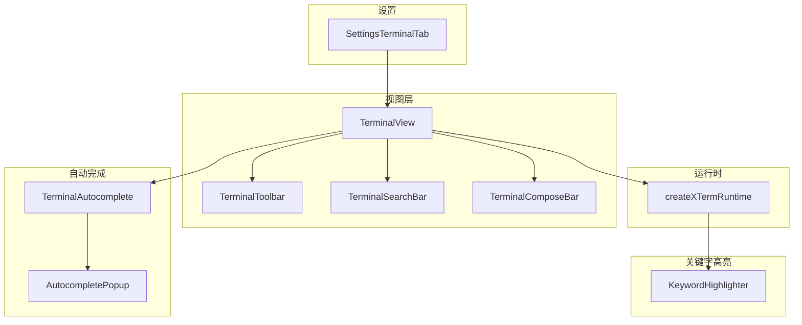
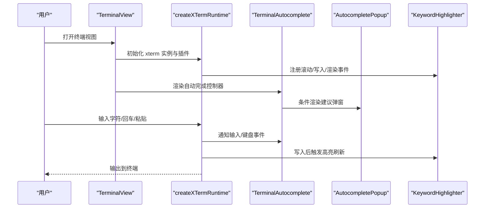
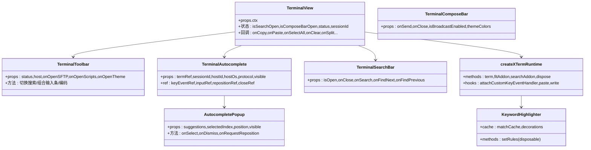

# 终端组件

<cite>
**本文引用的文件**
- [components/terminal/TerminalView.tsx](file://components/terminal/TerminalView.tsx)
- [components/terminal/TerminalToolbar.tsx](file://components/terminal/TerminalToolbar.tsx)
- [components/terminal/TerminalAutocomplete.tsx](file://components/terminal/TerminalAutocomplete.tsx)
- [components/terminal/TerminalSearchBar.tsx](file://components/terminal/TerminalSearchBar.tsx)
- [components/terminal/TerminalComposeBar.tsx](file://components/terminal/TerminalComposeBar.tsx)
- [components/terminal/hooks/useTerminalSearch.ts](file://components/terminal/hooks/useTerminalSearch.ts)
- [components/terminal/runtime/createXTermRuntime.ts](file://components/terminal/runtime/createXTermRuntime.ts)
- [components/terminal/autocomplete/AutocompletePopup.tsx](file://components/terminal/autocomplete/AutocompletePopup.tsx)
- [components/terminal/keywordHighlight.ts](file://components/terminal/keywordHighlight.ts)
- [components/terminal/runtime/terminalCommandExecution.ts](file://components/terminal/runtime/terminalCommandExecution.ts)
- [domain/models/terminal.ts](file://domain/models/terminal.ts)
- [components/settings/tabs/SettingsTerminalTab.tsx](file://components/settings/tabs/SettingsTerminalTab.tsx)
</cite>

## 目录
1. [简介](#简介)
2. [项目结构](#项目结构)
3. [核心组件](#核心组件)
4. [架构总览](#架构总览)
5. [详细组件分析](#详细组件分析)
6. [依赖关系分析](#依赖关系分析)
7. [性能考量](#性能考量)
8. [故障排查指南](#故障排查指南)
9. [结论](#结论)
10. [附录](#附录)

## 简介
本文件面向终端相关组件的使用者与维护者，系统性梳理终端视图、终端层、终端工具栏、自动完成、搜索、关键字高亮、主题与字体配置、会话生命周期与连接状态处理、错误恢复机制、以及性能优化与资源清理等关键能力，并提供组合使用模式与高级配置示例。内容以“从上到下”的方式组织：先看高层架构与组件职责，再深入到具体实现与数据流。

## 项目结构
终端相关代码主要分布在以下模块：
- 视图层：TerminalView、TerminalToolbar、TerminalSearchBar、TerminalComposeBar
- 自动完成：TerminalAutocomplete（封装 useTerminalAutocomplete）与 AutocompletePopup
- 运行时：createXTermRuntime（负责 xterm 实例、渲染器、事件绑定、粘贴与回车处理、命令执行记录）
- 关键字高亮：KeywordHighlighter（基于 xterm Decoration API 的惰性高亮）
- 设置页：SettingsTerminalTab（主题、字体、光标、键盘、可访问性、行为、关键字高亮、本地 Shell、连接参数等）

图表来源
- [components/terminal/TerminalView.tsx](file://components/terminal/TerminalView.tsx)
- [components/terminal/TerminalToolbar.tsx](file://components/terminal/TerminalToolbar.tsx)
- [components/terminal/TerminalAutocomplete.tsx](file://components/terminal/TerminalAutocomplete.tsx)
- [components/terminal/autocomplete/AutocompletePopup.tsx](file://components/terminal/autocomplete/AutocompletePopup.tsx)
- [components/terminal/runtime/createXTermRuntime.ts](file://components/terminal/runtime/createXTermRuntime.ts)
- [components/terminal/keywordHighlight.ts](file://components/terminal/keywordHighlight.ts)
- [components/settings/tabs/SettingsTerminalTab.tsx](file://components/settings/tabs/SettingsTerminalTab.tsx)

章节来源
- [components/terminal/TerminalView.tsx](file://components/terminal/TerminalView.tsx)
- [components/terminal/TerminalToolbar.tsx](file://components/terminal/TerminalToolbar.tsx)
- [components/terminal/TerminalAutocomplete.tsx](file://components/terminal/TerminalAutocomplete.tsx)
- [components/terminal/autocomplete/AutocompletePopup.tsx](file://components/terminal/autocomplete/AutocompletePopup.tsx)
- [components/terminal/runtime/createXTermRuntime.ts](file://components/terminal/runtime/createXTermRuntime.ts)
- [components/terminal/keywordHighlight.ts](file://components/terminal/keywordHighlight.ts)
- [components/settings/tabs/SettingsTerminalTab.tsx](file://components/settings/tabs/SettingsTerminalTab.tsx)

## 核心组件
- TerminalView：终端容器与布局，承载工具栏、搜索条、自动完成弹窗、连接对话框、ZMODEM 传输指示器、OSC-52 提示等；通过上下文注入大量回调与状态，统一协调各子组件。
- TerminalToolbar：终端状态栏工具条，提供 SFTP 打开、脚本面板、主题选择、编码切换、搜索开关、组合输入条开关、关闭会话等入口。
- TerminalAutocomplete：自动完成控制器，封装 useTerminalAutocomplete 并渲染 AutocompletePopup；通过 ref 暴露键盘与输入事件处理器给 xterm 运行时。
- AutocompletePopup：自动完成建议列表与详情面板，支持目录级联面板、来源标签、频率徽标、文件类型图标、悬停细节提示等。
- TerminalSearchBar：终端内搜索条，支持输入监听、方向键导航、匹配计数、快捷键（Esc、Enter、F3、Ctrl/Cmd+G）。
- TerminalComposeBar：沉浸式组合输入条，支持多行自适应、广播指示、发送/关闭逻辑。
- createXTermRuntime：xterm 实例创建与运行时装配，加载插件（fit、search、serialize、unicode、web-links、webgl），绑定热键、粘贴、回车、命令执行记录、渲染器监控与恢复。
- KeywordHighlighter：基于 Decoration 的关键字高亮管理器，惰性扫描可见区域，缓存匹配结果，避免滚动卡顿。
- SettingsTerminalTab：终端设置页，涵盖主题、字体、光标、键盘、可访问性、行为、关键字高亮规则、本地 Shell、连接参数等。

章节来源
- [components/terminal/TerminalView.tsx](file://components/terminal/TerminalView.tsx)
- [components/terminal/TerminalToolbar.tsx](file://components/terminal/TerminalToolbar.tsx)
- [components/terminal/TerminalAutocomplete.tsx](file://components/terminal/TerminalAutocomplete.tsx)
- [components/terminal/autocomplete/AutocompletePopup.tsx](file://components/terminal/autocomplete/AutocompletePopup.tsx)
- [components/terminal/TerminalSearchBar.tsx](file://components/terminal/TerminalSearchBar.tsx)
- [components/terminal/TerminalComposeBar.tsx](file://components/terminal/TerminalComposeBar.tsx)
- [components/terminal/runtime/createXTermRuntime.ts](file://components/terminal/runtime/createXTermRuntime.ts)
- [components/terminal/keywordHighlight.ts](file://components/terminal/keywordHighlight.ts)
- [components/settings/tabs/SettingsTerminalTab.tsx](file://components/settings/tabs/SettingsTerminalTab.tsx)

## 架构总览
终端组件围绕“视图层 + 运行时 + 自动完成 + 关键字高亮 + 设置”展开，形成清晰的分层与职责边界：
- 视图层负责 UI 布局与交互编排
- 运行时负责 xterm 实例、插件、事件与协议处理
- 自动完成与关键字高亮作为增强能力按需启用
- 设置页贯穿主题、字体、行为、连接参数等全局配置

图表来源
- [components/terminal/TerminalView.tsx](file://components/terminal/TerminalView.tsx)
- [components/terminal/runtime/createXTermRuntime.ts](file://components/terminal/runtime/createXTermRuntime.ts)
- [components/terminal/TerminalAutocomplete.tsx](file://components/terminal/TerminalAutocomplete.tsx)
- [components/terminal/autocomplete/AutocompletePopup.tsx](file://components/terminal/autocomplete/AutocompletePopup.tsx)
- [components/terminal/keywordHighlight.ts](file://components/terminal/keywordHighlight.ts)

## 详细组件分析

### TerminalView 组件
- 职责：承载终端 UI 容器、状态栏工具条、搜索条、自动完成弹窗、连接对话框、ZMODEM 传输指示器、OSC-52 提示、拖拽覆盖层、服务器统计展示等。
- 关键属性（节选）：
  - 上下文注入：hasSelection、keyBindings、hotkeyScheme、terminalSettings、serverStats、terminalCwdTracker、terminalPreviewVars、effectiveTheme、zmodem、auth、snippets 等
  - 回调：onCopy、onPaste、onPasteSelection、onSelectAll、onClear、onSelectWord、onSplitHorizontal、onSplitVertical、onToggleBroadcast、onCloseSession、onExpandToFocus 等
  - 状态：isSearchOpen、isComposeBarOpen、isBroadcastEnabled、isFocusMode、isDraggingOver、status、sessionId、showLogs、shouldShowConnectionDialog 等
- 事件处理：右键菜单、拖拽进入/离开/放置、顶部覆盖层点击捕获、复制主机名、显示服务器统计（CPU/内存/磁盘/网络）、打开/关闭搜索、发送组合输入、显示/隐藏连接对话框与主机密钥验证对话框等。

章节来源
- [components/terminal/TerminalView.tsx](file://components/terminal/TerminalView.tsx)

### TerminalToolbar 组件
- 职责：在终端状态栏提供高频操作入口，包括 SFTP、组合输入条、搜索、脚本、主题、编码切换等。
- 关键属性：
  - 状态：status、host
  - 回调：onOpenSFTP、onOpenScripts、onOpenTheme、onUpdateHost、onClose、onToggleSearch、onToggleComposeBar、onSetTerminalEncoding
  - 编码支持：仅对 SSH/Telnet/串口有效（本地/串口不支持快速切换）
- 行为：根据连接状态禁用部分按钮；编码子菜单与溢出菜单联动；高亮关键字弹窗与工具条联动。

章节来源
- [components/terminal/TerminalToolbar.tsx](file://components/terminal/TerminalToolbar.tsx)

### TerminalAutocomplete 组件
- 职责：封装自动完成逻辑，向 xterm 运行时暴露键盘与输入事件处理器，渲染建议弹窗。
- 关键属性：
  - termRef、sessionId、hostId、hostOs、protocol、getCwd
  - onAcceptText、onAcceptSnippet、snippets
  - 可见性：visible
  - 主题颜色：themeColors
  - 容器与偏移：containerRef、searchBarOffset
  - 处理器 ref：keyEventRef、inputRef、repositionRef、closeRef
- 交互：当可见且有建议时，通过 ReactDOM.createPortal 将弹窗挂载到 body，避免容器溢出限制；通过 ref 将键盘与输入事件转发给运行时。

章节来源
- [components/terminal/TerminalAutocomplete.tsx](file://components/terminal/TerminalAutocomplete.tsx)

### AutocompletePopup 组件
- 职责：绘制建议列表、目录级联面板、详情提示、来源标签、文件类型图标、频率徽标、按键提示等。
- 关键属性：
  - suggestions、selectedIndex、position、cursorLineTop、cursorLineBottom、visible、expandUpward
  - 主题颜色 themeColors、最大高度 maxHeight、子目录面板 subDirPanels、聚焦层级 subDirFocusLevel
  - 容器引用 containerRef、重新定位请求 onRequestReposition、搜索栏偏移 searchBarOffset
  - 回调：onSelect、onDismiss
- 交互：根据容器与光标位置计算固定定位，自动向上或向下展开；监听容器尺寸变化与窗口 resize；点击外部关闭；悬浮高亮与键盘导航。

章节来源
- [components/terminal/autocomplete/AutocompletePopup.tsx](file://components/terminal/autocomplete/AutocompletePopup.tsx)

### TerminalSearchBar 组件
- 职责：提供终端内搜索功能，支持输入监听、查找上一项/下一项、匹配计数、快捷键。
- 关键属性：
  - isOpen、onClose、onSearch、onFindNext、onFindPrevious、matchCount
- 交互：打开时自动聚焦并选中输入框；Esc 关闭；Enter/F3 或 Ctrl/Cmd+G 导航；禁用态控制。

章节来源
- [components/terminal/TerminalSearchBar.tsx](file://components/terminal/TerminalSearchBar.tsx)

### useTerminalSearch 钩子
- 职责：封装搜索状态与操作，对接 xterm SearchAddon。
- 关键状态：isSearchOpen、searchMatchCount
- 关键方法：handleToggleSearch、handleSearch、handleFindNext、handleFindPrevious、handleCloseSearch
- 交互：清空装饰、查找下一个/上一个、关闭时清理状态与焦点。

章节来源
- [components/terminal/hooks/useTerminalSearch.ts](file://components/terminal/hooks/useTerminalSearch.ts)

### TerminalComposeBar 组件
- 职责：沉浸式组合输入条，支持多行自适应、广播指示、发送/关闭。
- 关键属性：
  - onSend、onClose、isBroadcastEnabled、themeColors
- 交互：Enter 发送（Shift+Enter 插入换行）、Escape 关闭；自动聚焦与高度自适应；边框线分离以融入背景。

章节来源
- [components/terminal/TerminalComposeBar.tsx](file://components/terminal/TerminalComposeBar.tsx)

### createXTermRuntime 运行时
- 职责：创建并装配 xterm 实例与插件，绑定键盘、粘贴、回车、链接点击、序列化、适配、渲染器监控与恢复、命令执行记录等。
- 关键能力：
  - 插件：FitAddon、SearchAddon、SerializeAddon、UnicodeGraphemesAddon、WebLinksAddon、WebglAddon
  - 事件：attachCustomKeyEventHandler（热键、粘贴、回车、Kitty 键盘、Option+箭头跳词、Snippet 快捷键）
  - 中键粘贴：可选启用
  - 渲染器：WebGL/DOM 自动选择与上下文丢失处理；DPR 变化时纹理图集清理与重适配
  - 本地/串口特殊处理：本地日志写入、串口行模式缓冲与本地回显
  - 命令执行记录：基于提示符与外部命令识别，避免误记录
- 性能：根据设备内存与平台选择渲染器；对高负载 TUI 场景进行纹理图集清理；对粘贴与滚动进行策略控制。

章节来源
- [components/terminal/runtime/createXTermRuntime.ts](file://components/terminal/runtime/createXTermRuntime.ts)

### KeywordHighlighter 关键字高亮
- 职责：基于 xterm Decoration API 对可见区域进行惰性高亮，避免影响滚动性能。
- 关键能力：
  - 预编译规则与缓存匹配范围；ASCII 与宽字符映射；可见区域扫描；rAF 与定时器双重刷新保障
  - 在备用缓冲区（如 Vim/htop）禁用高亮；清理装饰与标记防止泄漏
- 性能：最小化每帧工作量，限制缓存条目数量，避免在隐藏标签页过度刷新。

章节来源
- [components/terminal/keywordHighlight.ts](file://components/terminal/keywordHighlight.ts)

### 终端会话与自动完成、搜索、关键字高亮 API

#### 会话生命周期与连接状态
- 生命周期：connecting → connected → disconnected
- 状态驱动：status、sessionId、host、terminalSettings、serverStats、zmodem、auth 等
- 连接对话框：根据 shouldShowConnectionDialog 控制显示，支持主机密钥验证、认证表单、进度与取消/重试/关闭会话
- 服务器统计：CPU/内存/磁盘/网络实时展示，HoverCard 详情
- ZMODEM：传输进度与冲突处理
- OSC-52：远程读剪贴板提示

章节来源
- [components/terminal/TerminalView.tsx](file://components/terminal/TerminalView.tsx)

#### 自动完成 API
- TerminalAutocompleteProps
  - termRef、sessionId、hostId、hostOs、protocol、getCwd
  - onAcceptText、onAcceptSnippet、snippets
  - visible、themeColors、containerRef、searchBarOffset
  - keyEventRef、inputRef、repositionRef、closeRef
- AutocompletePopupProps
  - suggestions、selectedIndex、position、cursorLineTop、cursorLineBottom、visible、expandUpward
  - themeColors、onSelect、maxHeight、subDirPanels、subDirFocusLevel、containerRef、onRequestReposition、searchBarOffset、onDismiss

章节来源
- [components/terminal/TerminalAutocomplete.tsx](file://components/terminal/TerminalAutocomplete.tsx)
- [components/terminal/autocomplete/AutocompletePopup.tsx](file://components/terminal/autocomplete/AutocompletePopup.tsx)

#### 搜索 API
- TerminalSearchBarProps
  - isOpen、onClose、onSearch、onFindNext、onFindPrevious、matchCount
- useTerminalSearch 返回
  - isSearchOpen、searchMatchCount、handleToggleSearch、handleSearch、handleFindNext、handleFindPrevious、handleCloseSearch

章节来源
- [components/terminal/TerminalSearchBar.tsx](file://components/terminal/TerminalSearchBar.tsx)
- [components/terminal/hooks/useTerminalSearch.ts](file://components/terminal/hooks/useTerminalSearch.ts)

#### 关键字高亮 API
- KeywordHighlighter
  - setRules(rules, enabled)：设置规则与开关
  - dispose()：清理装饰与订阅
- 规则模型：KeywordHighlightRule（patterns、color、enabled、customized）

章节来源
- [components/terminal/keywordHighlight.ts](file://components/terminal/keywordHighlight.ts)
- [domain/models/terminal.ts](file://domain/models/terminal.ts)

#### 主题与字体配置
- 主题：SettingsTerminalTab 支持跟随应用主题（深/浅）、手动选择、自定义主题导入/编辑/删除
- 字体：字体族、CJK 回退、字号、字重、行间距、仿真类型（xterm 系列）
- 光标：形状、闪烁
- 键盘：Alt 作 Meta、Option+箭头跳词
- 可访问性：最小对比度
- 关键字高亮：开关与规则编辑器

章节来源
- [components/settings/tabs/SettingsTerminalTab.tsx](file://components/settings/tabs/SettingsTerminalTab.tsx)
- [domain/models/terminal.ts](file://domain/models/terminal.ts)

#### 组合使用模式与高级配置示例
- 模式一：工具条 + 搜索 + 自动完成
  - 在 TerminalView 中同时启用 TerminalToolbar、TerminalSearchBar、TerminalAutocomplete，通过状态与回调协调
- 模式二：关键字高亮 + 自动完成
  - 启用 KeywordHighlighter 并配置 KeywordHighlightRule，同时开启自动完成以提升可读性与效率
- 模式三：组合输入条 + 广播
  - 使用 TerminalComposeBar 发送文本，结合 onBroadcastInput 将输入广播至其他会话
- 模式四：本地/串口专用
  - 本地/串口会话启用本地日志写入、串口行模式与本地回显；编码切换不适用

章节来源
- [components/terminal/TerminalView.tsx](file://components/terminal/TerminalView.tsx)
- [components/terminal/TerminalComposeBar.tsx](file://components/terminal/TerminalComposeBar.tsx)
- [components/terminal/runtime/createXTermRuntime.ts](file://components/terminal/runtime/createXTermRuntime.ts)

## 依赖关系分析

图表来源
- [components/terminal/TerminalView.tsx](file://components/terminal/TerminalView.tsx)
- [components/terminal/TerminalToolbar.tsx](file://components/terminal/TerminalToolbar.tsx)
- [components/terminal/TerminalAutocomplete.tsx](file://components/terminal/TerminalAutocomplete.tsx)
- [components/terminal/autocomplete/AutocompletePopup.tsx](file://components/terminal/autocomplete/AutocompletePopup.tsx)
- [components/terminal/TerminalSearchBar.tsx](file://components/terminal/TerminalSearchBar.tsx)
- [components/terminal/TerminalComposeBar.tsx](file://components/terminal/TerminalComposeBar.tsx)
- [components/terminal/runtime/createXTermRuntime.ts](file://components/terminal/runtime/createXTermRuntime.ts)
- [components/terminal/keywordHighlight.ts](file://components/terminal/keywordHighlight.ts)

## 性能考量
- 渲染器选择：根据平台与设备内存自动选择 WebGL 或 DOM；WebGL 上下文丢失时自动降级并清理纹理图集
- 惰性高亮：KeywordHighlighter 仅在可见区域扫描，使用缓存与 rAF/定时器双重刷新，降低滚动卡顿
- 自动完成：建议弹窗独立组件树，频繁更新不影响主终端渲染；建议数量与最小字符数可配置
- 搜索：SearchAddon 装饰样式与查找选项可配置，避免不必要的正则复杂度
- 输入与粘贴：根据设置决定滚动策略与中间键粘贴；串口行模式缓冲减少回显抖动
- 字体与渲染：Unicode Graphemes 保证 CJK/Emoji 宽度正确；字体权重检查避免粗体渲染异常

章节来源
- [components/terminal/runtime/createXTermRuntime.ts](file://components/terminal/runtime/createXTermRuntime.ts)
- [components/terminal/keywordHighlight.ts](file://components/terminal/keywordHighlight.ts)
- [domain/models/terminal.ts](file://domain/models/terminal.ts)

## 故障排查指南
- 连接失败/断开
  - 查看 TerminalView 的 shouldShowConnectionDialog 与 status；确认主机密钥验证流程与认证信息
  - 使用 onRetry/onCancelConnect/onCloseSession 控制重试与关闭
- 自动完成无响应
  - 确认 TerminalAutocomplete 的 visible 与 state.popupVisible；检查 keyEventRef/inputRef/repositionRef/closeRef 是否正确赋值
  - 检查 useTerminalAutocomplete 的设置与 cwd 获取
- 搜索无结果
  - 确认 useTerminalSearch 的 isSearchOpen 与 handleSearch 返回值；检查 SearchAddon 装饰是否被清理
- 关键字高亮不生效
  - 检查 KeywordHighlighter.setRules 的 enabled 与规则；确认不在备用缓冲区；查看缓存与 rAF/定时器刷新
- 渲染器问题（花屏/乱码）
  - 触发 clearTextureAtlas 或切换渲染器类型；检查 DPR 变化后的重适配
- OSC-52 与 ZMODEM
  - OSC-52 读取需要用户确认；ZMODEM 冲突时显示覆盖对话框

章节来源
- [components/terminal/TerminalView.tsx](file://components/terminal/TerminalView.tsx)
- [components/terminal/TerminalAutocomplete.tsx](file://components/terminal/TerminalAutocomplete.tsx)
- [components/terminal/hooks/useTerminalSearch.ts](file://components/terminal/hooks/useTerminalSearch.ts)
- [components/terminal/keywordHighlight.ts](file://components/terminal/keywordHighlight.ts)
- [components/terminal/runtime/createXTermRuntime.ts](file://components/terminal/runtime/createXTermRuntime.ts)

## 结论
该终端组件体系以清晰的分层与职责划分实现了高性能、可扩展、可配置的终端体验。通过 TerminalView 统一编排、createXTermRuntime 负责底层运行时、Autocomplete 与 KeywordHighlighter 提供增强能力、SettingsTerminalTab 提供全面配置，既满足日常使用，也支持高级场景与性能优化。建议在生产环境中关注渲染器选择、高亮缓存与自动完成策略，配合合理的设置项以获得最佳体验。

## 附录
- 终端会话模型与默认设置参考：[domain/models/terminal.ts](file://domain/models/terminal.ts)
- 自动完成与关键字高亮规则：[domain/models/terminal.ts](file://domain/models/terminal.ts)
- 设置页入口与主题/字体/行为配置：[components/settings/tabs/SettingsTerminalTab.tsx](file://components/settings/tabs/SettingsTerminalTab.tsx)