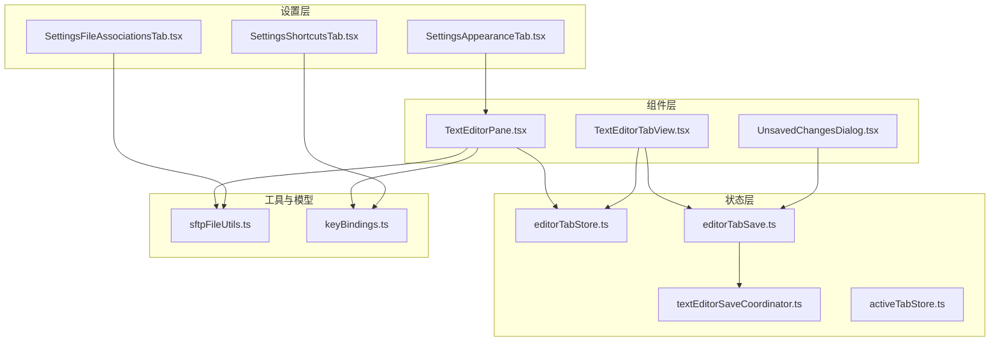
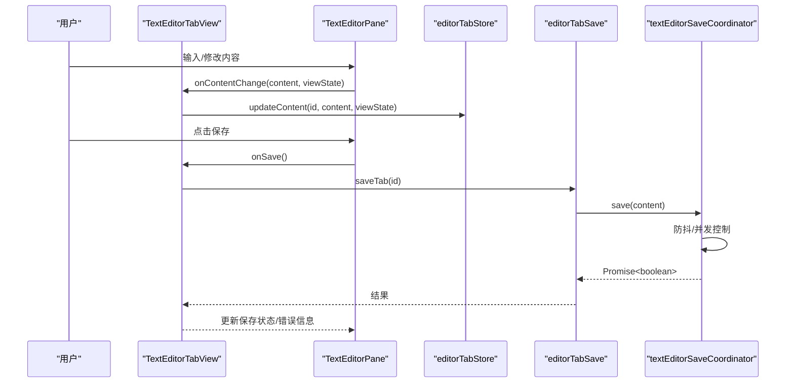
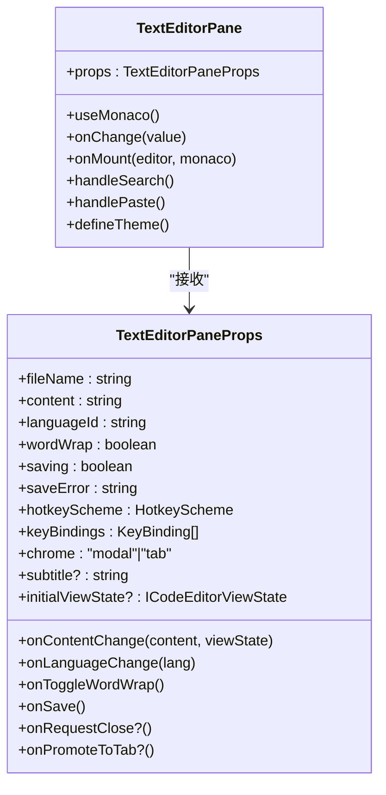
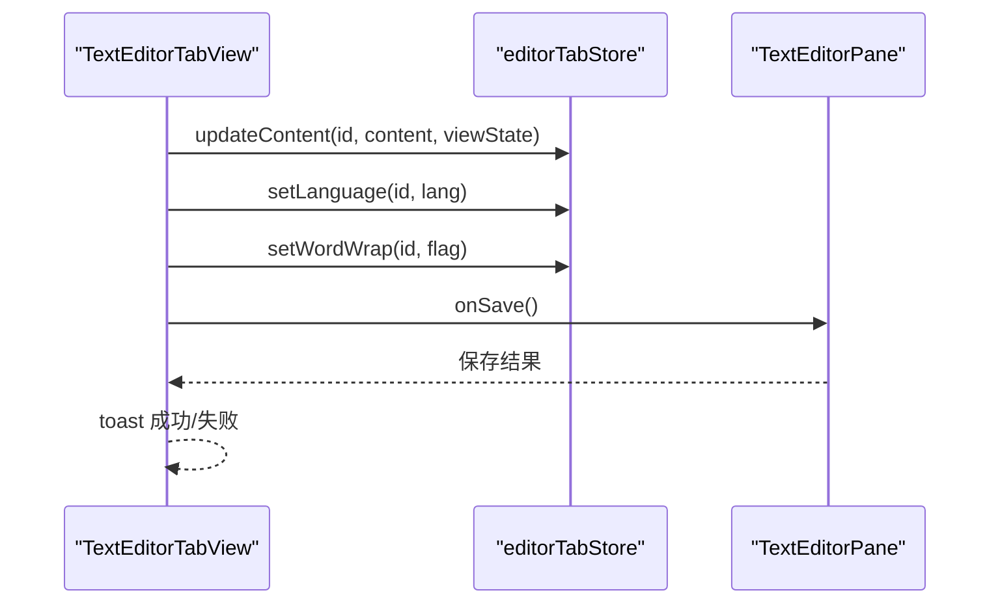
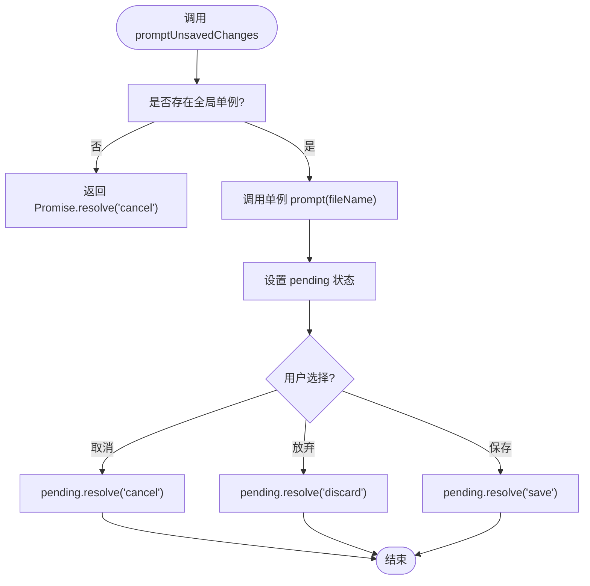
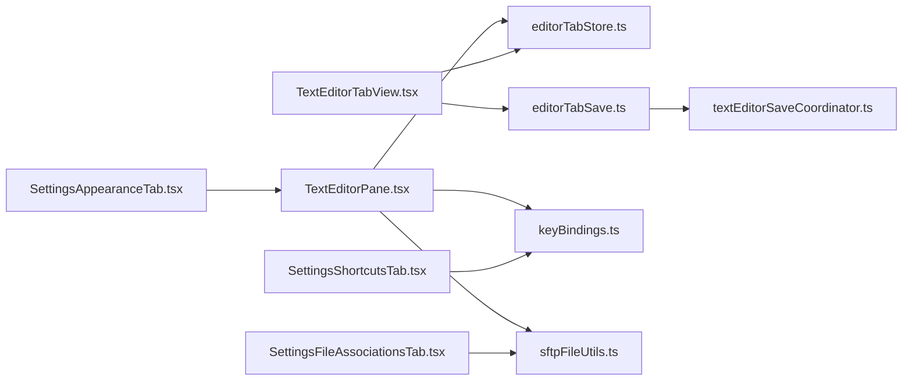

# 编辑器组件

<cite>
**本文引用的文件**
- [TextEditorPane.tsx](file://components/editor/TextEditorPane.tsx)
- [TextEditorTabView.tsx](file://components/editor/TextEditorTabView.tsx)
- [UnsavedChangesDialog.tsx](file://components/editor/UnsavedChangesDialog.tsx)
- [editorTabStore.ts](file://application/state/editorTabStore.ts)
- [textEditorSaveCoordinator.ts](file://application/state/textEditorSaveCoordinator.ts)
- [editorTabSave.ts](file://application/state/editorTabSave.ts)
- [activeTabStore.ts](file://application/state/activeTabStore.ts)
- [sftpFileUtils.ts](file://lib/sftpFileUtils.ts)
- [keyBindings.ts](file://domain/models/keyBindings.ts)
- [SettingsAppearanceTab.tsx](file://components/settings/tabs/SettingsAppearanceTab.tsx)
- [SettingsShortcutsTab.tsx](file://components/settings/tabs/SettingsShortcutsTab.tsx)
- [SettingsFileAssociationsTab.tsx](file://components/settings/tabs/SettingsFileAssociationsTab.tsx)
</cite>

## 目录
1. [简介](#简介)
2. [项目结构](#项目结构)
3. [核心组件](#核心组件)
4. [架构总览](#架构总览)
5. [详细组件分析](#详细组件分析)
6. [依赖关系分析](#依赖关系分析)
7. [性能考量](#性能考量)
8. [故障排查指南](#故障排查指南)
9. [结论](#结论)
10. [附录](#附录)

## 简介
本文件聚焦于编辑器相关组件，涵盖文本编辑器主体、标签页视图、未保存更改提示对话框，以及与之配套的状态管理、保存协调、快捷键绑定、主题与外观定制、文件关联与打开行为等。文档同时提供组件组合使用模式、扩展开发建议，以及针对大文件与性能优化的最佳实践。

## 项目结构
编辑器相关代码主要分布在以下位置：
- 组件层：components/editor 下的 TextEditorPane、TextEditorTabView、UnsavedChangesDialog
- 状态层：application/state 下的 editorTabStore、textEditorSaveCoordinator、editorTabSave、activeTabStore
- 工具与模型：lib/sftpFileUtils 提供语言识别、语法高亮映射；domain/models/keyBindings 提供快捷键模型与匹配逻辑
- 设置层：components/settings/tabs 下的外观、快捷键、文件关联等设置页面

**图表来源**
- [TextEditorPane.tsx:1-632](file://components/editor/TextEditorPane.tsx#L1-L632)
- [TextEditorTabView.tsx:1-119](file://components/editor/TextEditorTabView.tsx#L1-L119)
- [UnsavedChangesDialog.tsx:1-105](file://components/editor/UnsavedChangesDialog.tsx#L1-L105)
- [editorTabStore.ts:1-247](file://application/state/editorTabStore.ts#L1-L247)
- [textEditorSaveCoordinator.ts:1-91](file://application/state/textEditorSaveCoordinator.ts#L1-L91)
- [editorTabSave.ts:1-73](file://application/state/editorTabSave.ts#L1-L73)
- [activeTabStore.ts:1-103](file://application/state/activeTabStore.ts#L1-L103)
- [sftpFileUtils.ts:1-661](file://lib/sftpFileUtils.ts#L1-L661)
- [keyBindings.ts:1-241](file://domain/models/keyBindings.ts#L1-L241)
- [SettingsAppearanceTab.tsx:1-321](file://components/settings/tabs/SettingsAppearanceTab.tsx#L1-L321)
- [SettingsShortcutsTab.tsx:1-258](file://components/settings/tabs/SettingsShortcutsTab.tsx#L1-L258)
- [SettingsFileAssociationsTab.tsx:1-581](file://components/settings/tabs/SettingsFileAssociationsTab.tsx#L1-L581)

**章节来源**
- [TextEditorPane.tsx:1-632](file://components/editor/TextEditorPane.tsx#L1-L632)
- [TextEditorTabView.tsx:1-119](file://components/editor/TextEditorTabView.tsx#L1-L119)
- [UnsavedChangesDialog.tsx:1-105](file://components/editor/UnsavedChangesDialog.tsx#L1-L105)
- [editorTabStore.ts:1-247](file://application/state/editorTabStore.ts#L1-L247)
- [textEditorSaveCoordinator.ts:1-91](file://application/state/textEditorSaveCoordinator.ts#L1-L91)
- [editorTabSave.ts:1-73](file://application/state/editorTabSave.ts#L1-L73)
- [activeTabStore.ts:1-103](file://application/state/activeTabStore.ts#L1-L103)
- [sftpFileUtils.ts:1-661](file://lib/sftpFileUtils.ts#L1-L661)
- [keyBindings.ts:1-241](file://domain/models/keyBindings.ts#L1-L241)
- [SettingsAppearanceTab.tsx:1-321](file://components/settings/tabs/SettingsAppearanceTab.tsx#L1-L321)
- [SettingsShortcutsTab.tsx:1-258](file://components/settings/tabs/SettingsShortcutsTab.tsx#L1-L258)
- [SettingsFileAssociationsTab.tsx:1-581](file://components/settings/tabs/SettingsFileAssociationsTab.tsx#L1-L581)

## 核心组件
- 文本编辑器主体（TextEditorPane）：封装 Monaco 编辑器，提供语法高亮、自动换行、查找、语言切换、保存按钮、主题同步、快捷键绑定等能力，并通过 props 暴露内容变更、语言变更、换行切换、保存等回调。
- 标签页视图（TextEditorTabView）：将编辑器标签与 TextEditorPane 绑定，负责状态更新、保存调用、脏检查、标题栏副标题展示等。
- 未保存更改对话框（UnsavedChangesDialog）：提供“保存/放弃/取消”的确认流程，支持模块级单例调用，便于跨组件触发。

**章节来源**
- [TextEditorPane.tsx:159-179](file://components/editor/TextEditorPane.tsx#L159-L179)
- [TextEditorTabView.tsx:18-29](file://components/editor/TextEditorTabView.tsx#L18-L29)
- [UnsavedChangesDialog.tsx:13-22](file://components/editor/UnsavedChangesDialog.tsx#L13-L22)

## 架构总览
编辑器组件围绕“标签页状态”和“保存协调器”展开，Monaco 编辑器作为渲染与交互核心，通过状态层进行持久化与通知，设置层提供主题、快捷键、文件关联等外部配置。

**图表来源**
- [TextEditorPane.tsx:381-385](file://components/editor/TextEditorPane.tsx#L381-L385)
- [TextEditorTabView.tsx:62-70](file://components/editor/TextEditorTabView.tsx#L62-L70)
- [editorTabStore.ts:52-58](file://application/state/editorTabStore.ts#L52-L58)
- [editorTabSave.ts:52-57](file://application/state/editorTabSave.ts#L52-L57)
- [textEditorSaveCoordinator.ts:67-77](file://application/state/textEditorSaveCoordinator.ts#L67-L77)

## 详细组件分析

### TextEditorPane 组件
- 职责
  - 渲染 Monaco 编辑器主体与顶部工具栏（搜索、换行、语言选择、保存、最大化/关闭）
  - 主题同步：基于 CSS 变量动态生成自定义 Monaco 主题
  - 快捷键绑定：在编辑器内注册 Ctrl+S/Cmd+S 保存、Ctrl+W/Cmd+W 关闭、Ctrl+F 打开查找
  - 剪贴板增强：优先使用浏览器剪贴板，失败时回退到 Electron 桥接读取
  - 语言映射：将内部语言 ID 映射为 Monaco 支持的语言 ID
- 关键属性
  - fileName、content、languageId、wordWrap、saving、saveError、hotkeyScheme、keyBindings、chrome、subtitle、initialViewState
  - 回调：onContentChange、onLanguageChange、onToggleWordWrap、onSave、onRequestClose、onPromoteToTab
- 处理逻辑
  - 主题信号监听：通过 MutationObserver 监听 <html> 的 class/style/data-* 属性变化，触发主题重绘
  - 保存状态只读：当 saving=true 时，编辑器设为只读，防止并发写入
  - 查找与替换：通过触发 Monaco 内置 actions.find 打开查找面板
  - 语言切换：根据 getSupportedLanguages 生成下拉选项，映射到 Monaco 语言 ID
- 性能注意
  - 自定义主题仅在主题信号变化时重建，避免频繁重绘
  - 通过 initialViewState 恢复编辑器视图状态，减少滚动与定位抖动

**图表来源**
- [TextEditorPane.tsx:159-179](file://components/editor/TextEditorPane.tsx#L159-L179)
- [TextEditorPane.tsx:387-440](file://components/editor/TextEditorPane.tsx#L387-L440)
- [TextEditorPane.tsx:466-471](file://components/editor/TextEditorPane.tsx#L466-L471)

**章节来源**
- [TextEditorPane.tsx:149-157](file://components/editor/TextEditorPane.tsx#L149-L157)
- [TextEditorPane.tsx:248-285](file://components/editor/TextEditorPane.tsx#L248-L285)
- [TextEditorPane.tsx:392-437](file://components/editor/TextEditorPane.tsx#L392-L437)
- [TextEditorPane.tsx:466-471](file://components/editor/TextEditorPane.tsx#L466-L471)
- [TextEditorPane.tsx:580-614](file://components/editor/TextEditorPane.tsx#L580-L614)

### TextEditorTabView 组件
- 职责
  - 将具体标签页与 TextEditorPane 绑定，负责内容变更、语言切换、换行切换、保存调用
  - 计算脏检查状态（content 与 baselineContent 是否一致），并在标题后显示星号
  - 生成标题副标题 host:remotePath
- 关键属性
  - tabId、isVisible、hotkeyScheme、keyBindings、hostById、onRequestClose
- 处理逻辑
  - 使用 editorTabStore.updateContent/onLanguageChange/onToggleWordWrap 实现状态更新
  - 通过 saveEditorTab 触发保存，成功后 toast 提示，失败则显示错误消息
  - 当标签不存在时返回空，确保父组件安全卸载

**图表来源**
- [TextEditorTabView.tsx:42-54](file://components/editor/TextEditorTabView.tsx#L42-L54)
- [TextEditorTabView.tsx:62-70](file://components/editor/TextEditorTabView.tsx#L62-L70)
- [TextEditorTabView.tsx:96-113](file://components/editor/TextEditorTabView.tsx#L96-L113)

**章节来源**
- [TextEditorTabView.tsx:31-74](file://components/editor/TextEditorTabView.tsx#L31-L74)
- [TextEditorTabView.tsx:76-82](file://components/editor/TextEditorTabView.tsx#L76-L82)
- [TextEditorTabView.tsx:96-113](file://components/editor/TextEditorTabView.tsx#L96-L113)

### UnsavedChangesDialog 组件
- 职责
  - 提供“保存/放弃/取消”三选一的未保存更改提示
  - 模块级单例 prompt，允许非 React 上下文调用
- 关键 API
  - UnsavedChangesProvider(children: (api) => ReactNode)：向子树暴露 prompt 函数
  - promptUnsavedChanges(fileName): Promise<UnsavedChoice>：模块级调用入口
- 处理逻辑
  - 同步状态 pending，避免多个弹窗叠加
  - 注册/注销时清理未决状态，防止泄漏
  - 支持取消时 resolve("cancel")，保证调用方不会悬挂

**图表来源**
- [UnsavedChangesDialog.tsx:24-42](file://components/editor/UnsavedChangesDialog.tsx#L24-L42)
- [UnsavedChangesDialog.tsx:101-104](file://components/editor/UnsavedChangesDialog.tsx#L101-L104)

**章节来源**
- [UnsavedChangesDialog.tsx:24-64](file://components/editor/UnsavedChangesDialog.tsx#L24-L64)
- [UnsavedChangesDialog.tsx:101-104](file://components/editor/UnsavedChangesDialog.tsx#L101-L104)

### 状态管理与保存协调

#### editorTabStore
- 数据模型
  - EditorTab：包含 sessionId、hostId、remotePath、fileName、languageId、content、baselineContent、wordWrap、viewState、savingState、saveError
  - EditorSavingState："idle" | "saving" | "error"
- 核心操作
  - updateContent、markSaved、setWordWrap、setLanguage、setSavingState、close、forceCloseBySessions、promoteFromModal、confirmCloseBySession
  - 订阅通知：subscribe，延迟批量通知以避免重复渲染
- 脏检查：isDirty(id) 基于 content 与 baselineContent 对比

**章节来源**
- [editorTabStore.ts:17-33](file://application/state/editorTabStore.ts#L17-L33)
- [editorTabStore.ts:40-233](file://application/state/editorTabStore.ts#L40-L233)
- [editorTabStore.ts:235-247](file://application/state/editorTabStore.ts#L235-L247)

#### textEditorSaveCoordinator
- 职责
  - 串行化保存请求，防抖与并发保护
  - 生成 generation 以丢弃过期保存任务
- 接口
  - save(content): Promise<boolean>
  - isSaving(): boolean
  - reset(): void

**章节来源**
- [textEditorSaveCoordinator.ts:1-91](file://application/state/textEditorSaveCoordinator.ts#L1-L91)

#### editorTabSave
- 职责
  - 将 editorTabStore 与 editorSftpWrite 绑定，按标签页维度创建/复用保存协调器
  - 在保存开始、成功、失败时更新状态
- 导出
  - saveEditorTab(id, contentOverride?)、releaseEditorTabSaveCoordinator(id)

**章节来源**
- [editorTabSave.ts:8-63](file://application/state/editorTabSave.ts#L8-L63)
- [editorTabSave.ts:66-73](file://application/state/editorTabSave.ts#L66-L73)

### 快捷键与主题定制

#### 快捷键模型与匹配
- HotkeyScheme："disabled" | "mac" | "pc"
- KeyBinding：id、action、label、mac、pc、category
- 默认快捷键集合包含标签页、终端、导航、应用、SFTP 等类别
- 匹配逻辑：parseKeyCombo、matchesKeyBinding 支持特殊模式如 "[1...9]"、"arrows"

**章节来源**
- [keyBindings.ts:1-241](file://domain/models/keyBindings.ts#L1-L241)

#### 主题与外观设置
- SettingsAppearanceTab：主题模式（浅色/深色/系统）、UI 主题、强调色、字体、语言、自定义 CSS
- TextEditorPane 主题：基于 CSS 变量动态生成 netcatty-dark/netcatty-light 主题，并监听 <html> 的 class/style/data-* 变化

**章节来源**
- [SettingsAppearanceTab.tsx:1-321](file://components/settings/tabs/SettingsAppearanceTab.tsx#L1-L321)
- [TextEditorPane.tsx:248-285](file://components/editor/TextEditorPane.tsx#L248-L285)

### 文件关联与打开行为
- SettingsFileAssociationsTab：双击行为（打开/传输）、默认视图模式（列表/树）、自动同步、隐藏文件可见性、压缩上传、自动打开侧边栏、传输并发度、默认打开器（内置编辑器/系统应用）
- sftpFileUtils：文件类型判断、语言映射、支持语言列表、拖拽文件提取等

**章节来源**
- [SettingsFileAssociationsTab.tsx:1-581](file://components/settings/tabs/SettingsFileAssociationsTab.tsx#L1-L581)
- [sftpFileUtils.ts:104-428](file://lib/sftpFileUtils.ts#L104-L428)

## 依赖关系分析

**图表来源**
- [TextEditorPane.tsx:1-632](file://components/editor/TextEditorPane.tsx#L1-L632)
- [TextEditorTabView.tsx:1-119](file://components/editor/TextEditorTabView.tsx#L1-L119)
- [editorTabStore.ts:1-247](file://application/state/editorTabStore.ts#L1-L247)
- [editorTabSave.ts:1-73](file://application/state/editorTabSave.ts#L1-L73)
- [textEditorSaveCoordinator.ts:1-91](file://application/state/textEditorSaveCoordinator.ts#L1-L91)
- [keyBindings.ts:1-241](file://domain/models/keyBindings.ts#L1-L241)
- [sftpFileUtils.ts:1-661](file://lib/sftpFileUtils.ts#L1-L661)
- [SettingsAppearanceTab.tsx:1-321](file://components/settings/tabs/SettingsAppearanceTab.tsx#L1-L321)
- [SettingsShortcutsTab.tsx:1-258](file://components/settings/tabs/SettingsShortcutsTab.tsx#L1-L258)
- [SettingsFileAssociationsTab.tsx:1-581](file://components/settings/tabs/SettingsFileAssociationsTab.tsx#L1-L581)

**章节来源**
- [TextEditorPane.tsx:1-632](file://components/editor/TextEditorPane.tsx#L1-L632)
- [TextEditorTabView.tsx:1-119](file://components/editor/TextEditorTabView.tsx#L1-L119)
- [editorTabStore.ts:1-247](file://application/state/editorTabStore.ts#L1-L247)
- [editorTabSave.ts:1-73](file://application/state/editorTabSave.ts#L1-L73)
- [textEditorSaveCoordinator.ts:1-91](file://application/state/textEditorSaveCoordinator.ts#L1-L91)
- [keyBindings.ts:1-241](file://domain/models/keyBindings.ts#L1-L241)
- [sftpFileUtils.ts:1-661](file://lib/sftpFileUtils.ts#L1-L661)
- [SettingsAppearanceTab.tsx:1-321](file://components/settings/tabs/SettingsAppearanceTab.tsx#L1-L321)
- [SettingsShortcutsTab.tsx:1-258](file://components/settings/tabs/SettingsShortcutsTab.tsx#L1-L258)
- [SettingsFileAssociationsTab.tsx:1-581](file://components/settings/tabs/SettingsFileAssociationsTab.tsx#L1-L581)

## 性能考量
- 主题与布局
  - 主题信号仅在 <html> class/style/data-* 变更时重建，避免频繁主题切换导致的重绘
  - Monaco options 中启用 automaticLayout，减少手动尺寸计算
- 保存协调
  - 通过 generation 丢弃过期保存任务，避免竞态与重复网络请求
  - 串行化保存，降低并发写入风险
- 大文件与长文档
  - 使用 initialViewState 恢复滚动位置，减少重排
  - 语言映射与支持列表预计算，避免运行时重复解析
  - 仅在必要时重建主题，减少 DOM 与样式计算压力
- 剪贴板与输入
  - 优先使用浏览器剪贴板 API，失败回退至 Electron 桥接，减少异常路径的额外开销

[本节为通用指导，无需特定文件来源]

## 故障排查指南
- 保存失败
  - 检查 editorTabStore.setSavingState("error", message) 是否被正确调用
  - 确认 editorTabSave 的 onSaveStart/Success/Error 回调链路是否执行
- 并发保存问题
  - 确保 textEditorSaveCoordinator 的 save(content) 调用顺序正确，generation 未被 reset
- 快捷键无效
  - 确认 hotkeyScheme 与 keyBindings 匹配逻辑，检查 matchesKeyBinding 的修饰键与键名归一化
- 主题不生效
  - 检查 <html> 的 class/style/data-* 是否触发主题信号更新，确认 defineTheme 调用时机
- 未保存更改对话框不出现
  - 确认 UnsavedChangesProvider 已注册单例，promptUnsavedChanges 是否在正确的上下文中调用

**章节来源**
- [editorTabStore.ts:72-77](file://application/state/editorTabStore.ts#L72-L77)
- [editorTabSave.ts:31-46](file://application/state/editorTabSave.ts#L31-L46)
- [textEditorSaveCoordinator.ts:30-64](file://application/state/textEditorSaveCoordinator.ts#L30-L64)
- [keyBindings.ts:101-192](file://domain/models/keyBindings.ts#L101-L192)
- [TextEditorPane.tsx:287-301](file://components/editor/TextEditorPane.tsx#L287-L301)
- [UnsavedChangesDialog.tsx:46-58](file://components/editor/UnsavedChangesDialog.tsx#L46-L58)

## 结论
编辑器组件以 TextEditorPane 为核心，结合 editorTabStore 与 editorTabSave 提供稳定的标签页状态与保存协调机制；通过 UnsavedChangesDialog 实现一致的未保存更改提示；借助设置层完成主题、快捷键与文件关联的可配置化。整体设计在保证功能完整性的同时，兼顾了性能与可维护性。

[本节为总结性内容，无需特定文件来源]

## 附录

### 组件组合使用模式
- 单标签页编辑：使用 TextEditorTabView 包裹 TextEditorPane，通过 editorTabStore 管理内容与状态
- 多标签页编辑：每个标签页实例独立渲染，通过 activeTabStore 控制可见性与激活态
- 保存流程：编辑器触发 onSave -> 调用 saveEditorTab -> 通过 textEditorSaveCoordinator 串行化 -> 更新 editorTabStore savingState

**章节来源**
- [TextEditorTabView.tsx:31-115](file://components/editor/TextEditorTabView.tsx#L31-L115)
- [editorTabSave.ts:52-57](file://application/state/editorTabSave.ts#L52-L57)
- [textEditorSaveCoordinator.ts:67-77](file://application/state/textEditorSaveCoordinator.ts#L67-L77)

### 扩展开发示例
- 新增语言支持：在 sftpFileUtils 的 EXTENSION_TO_LANGUAGE 与 getSupportedLanguages 中添加映射
- 自定义快捷键：在 SettingsShortcutsTab 中新增 KeyBinding 条目，并在 TextEditorPane 中注册对应命令
- 主题定制：在 SettingsAppearanceTab 中选择 UI 主题或自定义强调色，TextEditorPane 将自动同步

**章节来源**
- [sftpFileUtils.ts:104-428](file://lib/sftpFileUtils.ts#L104-L428)
- [SettingsShortcutsTab.tsx:194-240](file://components/settings/tabs/SettingsShortcutsTab.tsx#L194-L240)
- [SettingsAppearanceTab.tsx:113-278](file://components/settings/tabs/SettingsAppearanceTab.tsx#L113-L278)
- [TextEditorPane.tsx:248-285](file://components/editor/TextEditorPane.tsx#L248-L285)