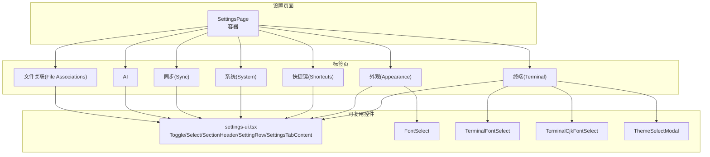
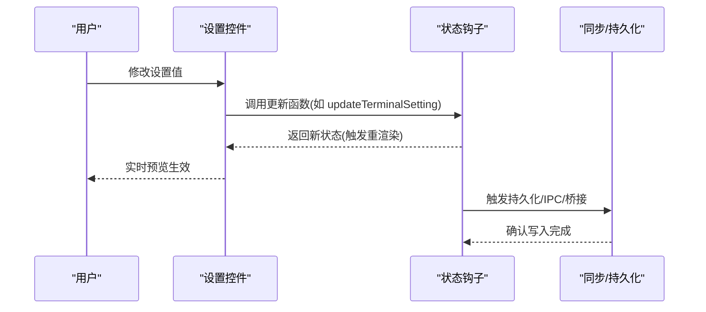
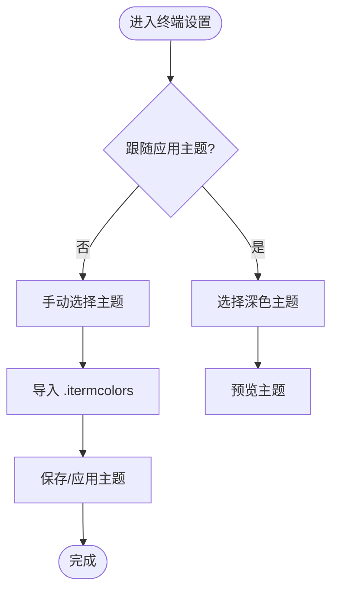
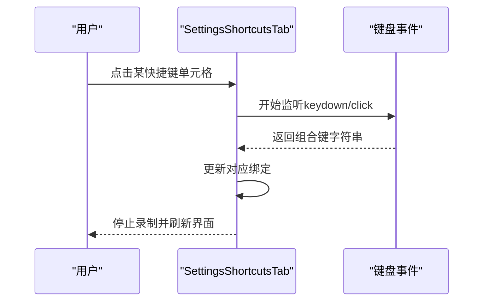
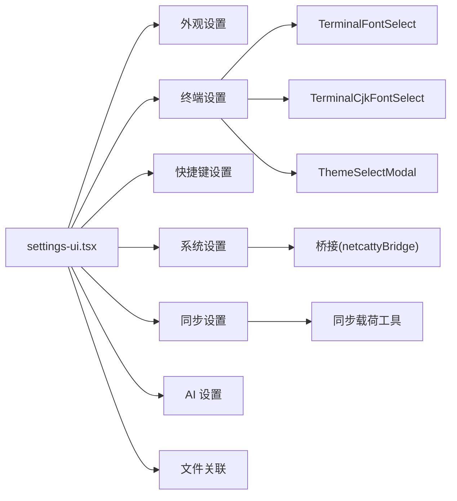

# 设置组件

<cite>
**本文引用的文件**
- [settings-ui.tsx](file://components/settings/settings-ui.tsx)
- [FontSelect.tsx](file://components/settings/FontSelect.tsx)
- [TerminalFontSelect.tsx](file://components/settings/TerminalFontSelect.tsx)
- [TerminalCjkFontSelect.tsx](file://components/settings/TerminalCjkFontSelect.tsx)
- [ThemeSelectModal.tsx](file://components/settings/ThemeSelectModal.tsx)
- [SettingsAppearanceTab.tsx](file://components/settings/tabs/SettingsAppearanceTab.tsx)
- [SettingsTerminalTab.tsx](file://components/settings/tabs/SettingsTerminalTab.tsx)
- [SettingsShortcutsTab.tsx](file://components/settings/tabs/SettingsShortcutsTab.tsx)
- [SettingsSystemTab.tsx](file://components/settings/tabs/SettingsSystemTab.tsx)
- [SettingsSyncTab.tsx](file://components/settings/tabs/SettingsSyncTab.tsx)
- [SettingsAITab.tsx](file://components/settings/tabs/SettingsAITab.tsx)
- [SettingsFileAssociationsTab.tsx](file://components/settings/tabs/SettingsFileAssociationsTab.tsx)
- [SettingsTerminalTabControls.tsx](file://components/settings/tabs/SettingsTerminalTabControls.tsx)
- [TerminalBehaviorSettings.tsx](file://components/settings/tabs/TerminalBehaviorSettings.tsx)
</cite>

## 目录
1. [简介](#简介)
2. [项目结构](#项目结构)
3. [核心组件](#核心组件)
4. [架构总览](#架构总览)
5. [详细组件分析](#详细组件分析)
6. [依赖关系分析](#依赖关系分析)
7. [性能考量](#性能考量)
8. [故障排查指南](#故障排查指南)
9. [结论](#结论)
10. [附录](#附录)

## 简介
本文件为 Netcatty 应用“设置”相关组件的详细 API 文档，覆盖设置页面、主题选择、字体配置、快捷键、系统与同步、AI 配置、文件关联等模块。重点说明：
- 组件属性与方法签名（以路径标注代替代码片段）
- 数据绑定、验证规则与持久化机制
- 设置状态管理、实时预览与配置导入导出
- 组件组合使用模式与自定义配置示例
- 扩展性、插件支持与版本兼容性处理建议

## 项目结构
设置系统采用“标签页 + 可复用 UI 控件”的分层设计：
- 通用 UI 控件：开关、下拉、分组布局等
- 字体与主题选择器：UI 字体、终端字体、CJK 字体、主题模态
- 各设置标签页：外观、终端、快捷键、系统、同步、AI、文件关联
- 控制器与状态：通过 useSettingsState/useSettingsState 等状态钩子驱动

图表来源
- [SettingsAppearanceTab.tsx:1-321](file://components/settings/tabs/SettingsAppearanceTab.tsx#L1-L321)
- [SettingsTerminalTab.tsx:1-975](file://components/settings/tabs/SettingsTerminalTab.tsx#L1-L975)
- [SettingsShortcutsTab.tsx:1-258](file://components/settings/tabs/SettingsShortcutsTab.tsx#L1-L258)
- [SettingsSystemTab.tsx:1-965](file://components/settings/tabs/SettingsSystemTab.tsx#L1-L965)
- [SettingsSyncTab.tsx:1-101](file://components/settings/tabs/SettingsSyncTab.tsx#L1-L101)
- [SettingsAITab.tsx:1-823](file://components/settings/tabs/SettingsAITab.tsx#L1-L823)
- [SettingsFileAssociationsTab.tsx:1-581](file://components/settings/tabs/SettingsFileAssociationsTab.tsx#L1-L581)
- [settings-ui.tsx:1-141](file://components/settings/settings-ui.tsx#L1-L141)
- [FontSelect.tsx:1-78](file://components/settings/FontSelect.tsx#L1-L78)
- [TerminalFontSelect.tsx:1-116](file://components/settings/TerminalFontSelect.tsx#L1-L116)
- [TerminalCjkFontSelect.tsx:1-154](file://components/settings/TerminalCjkFontSelect.tsx#L1-L154)
- [ThemeSelectModal.tsx:1-115](file://components/settings/ThemeSelectModal.tsx#L1-L115)

章节来源
- [settings-ui.tsx:1-141](file://components/settings/settings-ui.tsx#L1-L141)
- [SettingsAppearanceTab.tsx:1-321](file://components/settings/tabs/SettingsAppearanceTab.tsx#L1-L321)
- [SettingsTerminalTab.tsx:1-975](file://components/settings/tabs/SettingsTerminalTab.tsx#L1-L975)

## 核心组件
- Toggle/Select/SectionHeader/SettingRow/SettingsTabContent：统一的设置行布局与交互控件
- FontSelect：UI 字体选择器
- TerminalFontSelect：终端字体选择器（基于本地字体可用性订阅）
- TerminalCjkFontSelect：CJK 终端字体选择器（含自动匹配与已安装过滤）
- ThemeSelectModal：主题选择模态框（支持按明暗主题过滤与自动选项）

章节来源
- [settings-ui.tsx:8-141](file://components/settings/settings-ui.tsx#L8-L141)
- [FontSelect.tsx:7-78](file://components/settings/FontSelect.tsx#L7-L78)
- [TerminalFontSelect.tsx:14-116](file://components/settings/TerminalFontSelect.tsx#L14-L116)
- [TerminalCjkFontSelect.tsx:35-154](file://components/settings/TerminalCjkFontSelect.tsx#L35-L154)
- [ThemeSelectModal.tsx:13-115](file://components/settings/ThemeSelectModal.tsx#L13-L115)

## 架构总览
设置系统通过各标签页组件聚合具体设置项，并以统一的 UI 控件实现一致的交互体验。终端与外观设置支持实时预览；快捷键与系统设置涉及全局状态与桥接调用；同步与 AI 设置提供导入导出与外部集成能力。

图表来源
- [SettingsTerminalTab.tsx:44-800](file://components/settings/tabs/SettingsTerminalTab.tsx#L44-L800)
- [SettingsShortcutsTab.tsx:10-258](file://components/settings/tabs/SettingsShortcutsTab.tsx#L10-L258)
- [SettingsSystemTab.tsx:96-965](file://components/settings/tabs/SettingsSystemTab.tsx#L96-L965)
- [SettingsSyncTab.tsx:18-101](file://components/settings/tabs/SettingsSyncTab.tsx#L18-L101)

## 详细组件分析

### 外观设置（Appearance）
- 主题与配色
  - 系统主题：亮/暗/跟随系统
  - UI 主题：明/暗主题列表选择
  - 强调色：支持“跟随主题/自定义”，内置色板与自定义色盘
  - UI 字体：通过 FontSelect 切换
  - 自定义 CSS：文本域输入，即时生效
  - 客户端行为：最近主机、仅根目录显示未分组、SFTP 标签可见等
- 数据绑定与验证
  - 使用 props 接收当前值与 setter，双向绑定到 UI
  - 自定义色值通过 HSL 计算与校验
- 持久化
  - 通过状态钩子与存储层写入（见状态管理章节）

章节来源
- [SettingsAppearanceTab.tsx:12-321](file://components/settings/tabs/SettingsAppearanceTab.tsx#L12-L321)
- [settings-ui.tsx:8-141](file://components/settings/settings-ui.tsx#L8-L141)
- [FontSelect.tsx:7-78](file://components/settings/FontSelect.tsx#L7-L78)

### 终端设置（Terminal）
- 主题
  - 支持“跟随应用主题”与“手动选择”
  - 明/暗模式分别可选主题，支持“自动”选项
  - 自定义主题：新建、编辑、删除、从 .itermcolors 导入
  - 实时预览：根据明/暗模式预览所选主题
- 字体
  - 字体族：TerminalFontSelect（基于本地字体可用性订阅）
  - CJK 字体：TerminalCjkFontSelect（自动匹配 + 已安装过滤）
  - 字号、字重、行间距、仿真类型、光标样式与闪烁
- 行为与无障碍
  - 右键行为、复制/粘贴策略、括号粘贴、滚动策略、链接修饰键
  - 最小对比度、回滚行数、启动命令延迟
- 快捷键与键盘
  - Alt 作为 Meta、Option+方向词跳转等
- 本地 Shell 与连接参数
  - 本地 Shell 选择（默认/发现/自定义）、起始目录校验
  - Keepalive、X11 显示等
- 关键流程：.itermcolors 导入与自定义主题编辑

图表来源
- [SettingsTerminalTab.tsx:307-800](file://components/settings/tabs/SettingsTerminalTab.tsx#L307-L800)
- [SettingsTerminalTabControls.tsx:1-296](file://components/settings/tabs/SettingsTerminalTabControls.tsx#L1-L296)

章节来源
- [SettingsTerminalTab.tsx:29-975](file://components/settings/tabs/SettingsTerminalTab.tsx#L29-L975)
- [SettingsTerminalTabControls.tsx:15-296](file://components/settings/tabs/SettingsTerminalTabControls.tsx#L15-L296)
- [TerminalFontSelect.tsx:14-116](file://components/settings/TerminalFontSelect.tsx#L14-L116)
- [TerminalCjkFontSelect.tsx:35-154](file://components/settings/TerminalCjkFontSelect.tsx#L35-L154)
- [ThemeSelectModal.tsx:22-115](file://components/settings/ThemeSelectModal.tsx#L22-L115)

### 快捷键设置（Shortcuts）
- 热键方案：禁用/Mac/PC
- 录制热键：ESC 取消、特殊后缀（[1…9]、箭头）处理
- 重置单个/全部快捷键
- 分类展示：标签页、终端、导航、应用、SFTP

图表来源
- [SettingsShortcutsTab.tsx:10-258](file://components/settings/tabs/SettingsShortcutsTab.tsx#L10-L258)

章节来源
- [SettingsShortcutsTab.tsx:10-258](file://components/settings/tabs/SettingsShortcutsTab.tsx#L10-L258)

### 系统设置（System）
- 软件更新：检查/下载/安装/打开发布页/自动更新开关
- 凭据保护：检测可用性与提示
- 崩溃日志：加载/展开/清理/打开目录
- 临时目录：统计/刷新/清理/打开目录
- 全局热键：录制/重置为默认
- 会话日志：启用/目录/格式

章节来源
- [SettingsSystemTab.tsx:72-965](file://components/settings/tabs/SettingsSystemTab.tsx#L72-L965)

### 同步设置（Sync）
- 构建/应用同步载荷：支持本地备份保护与错误翻译
- 导入/导出：支持从字符串导入、清空本地数据
- 云同步设置：通过 CloudSyncSettings 组合

章节来源
- [SettingsSyncTab.tsx:18-101](file://components/settings/tabs/SettingsSyncTab.tsx#L18-L101)

### AI 设置（AI）
- 提供商管理：添加/编辑/移除、激活默认模型
- 外部代理：Codex/Claude/Copilot/Codebuddy 的路径解析与登录流程
- 默认代理：下拉选择
- 工具访问模式：MCP/Skills
- 用户技能：状态刷新、打开目录、查看技能清单与警告
- 网络搜索：Web 搜索设置

章节来源
- [SettingsAITab.tsx:59-823](file://components/settings/tabs/SettingsAITab.tsx#L59-L823)

### 文件关联设置（File Associations）
- SFTP 双击行为：打开/传输
- 默认视图模式：列表/树
- 自动同步、显示隐藏文件、压缩上传、自动打开侧边栏
- 传输并发数
- 默认打开器：内置编辑器/系统应用
- 文件扩展名关联：增删改、系统应用选择

章节来源
- [SettingsFileAssociationsTab.tsx:30-581](file://components/settings/tabs/SettingsFileAssociationsTab.tsx#L30-L581)

## 依赖关系分析
- 组件耦合
  - 各标签页依赖 settings-ui.tsx 的基础控件
  - 终端设置依赖字体与主题选择器，以及自定义主题编辑器
  - 系统设置依赖桥接能力（临时目录、崩溃日志、凭据保护等）
  - 同步设置依赖构建/应用载荷工具与本地备份保护
- 状态与持久化
  - 外观/终端/快捷键/系统/同步/AI/文件关联均通过状态钩子驱动
  - 字体与主题选择器内部维护本地订阅与可用性状态
- 外部依赖
  - Electron 桥接：系统信息、文件操作、崩溃日志、凭据保护
  - 第三方服务：云同步、AI 提供商与外部代理

图表来源
- [settings-ui.tsx:1-141](file://components/settings/settings-ui.tsx#L1-L141)
- [SettingsTerminalTab.tsx:1-975](file://components/settings/tabs/SettingsTerminalTab.tsx#L1-L975)
- [SettingsSystemTab.tsx:1-965](file://components/settings/tabs/SettingsSystemTab.tsx#L1-L965)
- [SettingsSyncTab.tsx:1-101](file://components/settings/tabs/SettingsSyncTab.tsx#L1-L101)

章节来源
- [settings-ui.tsx:1-141](file://components/settings/settings-ui.tsx#L1-L141)
- [SettingsTerminalTab.tsx:1-975](file://components/settings/tabs/SettingsTerminalTab.tsx#L1-L975)
- [SettingsSystemTab.tsx:1-965](file://components/settings/tabs/SettingsSystemTab.tsx#L1-L965)
- [SettingsSyncTab.tsx:1-101](file://components/settings/tabs/SettingsSyncTab.tsx#L1-L101)

## 性能考量
- 字体选择器
  - TerminalFontSelect 与 TerminalCjkFontSelect 基于 useSyncExternalStore 订阅字体可用性，避免无效渲染
  - 过滤逻辑在 useMemo 中缓存，仅当版本或字体集合变化时重新计算
- 实时预览
  - 主题与字体变更通过状态更新即时反映到 UI，避免不必要的重排
- 大量规则编辑
  - 关键词高亮规则编辑器使用受控表单与即时校验，减少 DOM 抖动
- 系统操作
  - 临时目录与崩溃日志读取采用异步加载与防抖式刷新，避免阻塞主线程

## 故障排查指南
- 字体不可见或切换无效
  - 检查字体可用性订阅是否生效；确认 isFontInstalled 与 hasAuthoritativeData 的状态
  - 对于 CJK 字体，确认系统已安装对应等宽字体或使用“自动”选项
- .itermcolors 导入失败
  - 确认文件为有效 XML；检查解析器返回结果与错误提示
- 快捷键录制异常
  - 确保未处于特殊键状态；ESC 可取消录制；注意 Mac/PC 方案差异
- 系统设置操作失败
  - 检查桥接能力是否存在；临时目录/崩溃日志读写权限；凭据保护可用性
- 同步应用失败
  - 查看本地备份保护失败提示；确认载荷构建与应用回调链路

章节来源
- [TerminalFontSelect.tsx:34-61](file://components/settings/TerminalFontSelect.tsx#L34-L61)
- [TerminalCjkFontSelect.tsx:61-92](file://components/settings/TerminalCjkFontSelect.tsx#L61-L92)
- [SettingsTerminalTab.tsx:153-178](file://components/settings/tabs/SettingsTerminalTab.tsx#L153-L178)
- [SettingsShortcutsTab.tsx:50-108](file://components/settings/tabs/SettingsShortcutsTab.tsx#L50-L108)
- [SettingsSystemTab.tsx:148-264](file://components/settings/tabs/SettingsSystemTab.tsx#L148-L264)
- [SettingsSyncTab.tsx:53-83](file://components/settings/tabs/SettingsSyncTab.tsx#L53-L83)

## 结论
设置系统以模块化标签页与可复用 UI 控件为核心，实现了从外观、终端、快捷键到系统、同步与 AI 的全栈配置能力。通过状态钩子与桥接层，组件具备良好的数据绑定、实时预览与持久化机制。扩展方面，可通过新增标签页与控件接入新的配置项；插件与外部服务可通过桥接与提供商接口集成；版本兼容性建议在导入导出与默认值迁移中保持向后兼容策略。

## 附录

### 组件组合使用模式与自定义配置示例
- 组合模式
  - 将 Toggle/Select/SettingRow/SectionHeader 组合用于常规设置项
  - 在终端设置中串联 TerminalFontSelect、TerminalCjkFontSelect 与 ThemeSelectModal，实现字体与主题一体化配置
  - 在 AI 设置中组合 ProviderCard、AddProviderDropdown、Codex/Claude/Copilot/Codebuddy 卡片与 Safety/WebSearch 设置
- 自定义配置示例
  - 新增自定义终端主题：点击“新建” → 编辑颜色 → 保存 → 应用
  - 自定义关键词高亮：打开编辑器 → 添加规则 → 正则校验 → 预览颜色
  - 自定义 UI 字体：在外观设置中选择字体家族 → 应用即刻生效

章节来源
- [SettingsTerminalTab.tsx:180-218](file://components/settings/tabs/SettingsTerminalTab.tsx#L180-L218)
- [SettingsTerminalTabControls.tsx:133-247](file://components/settings/tabs/SettingsTerminalTabControls.tsx#L133-L247)
- [SettingsAppearanceTab.tsx:166-172](file://components/settings/tabs/SettingsAppearanceTab.tsx#L166-L172)
- [SettingsAITab.tsx:500-650](file://components/settings/tabs/SettingsAITab.tsx#L500-L650)

### 设置状态管理、验证与持久化
- 状态管理
  - 各标签页通过 props 接收当前值与 setter，实现受控组件
  - 终端设置使用 updateTerminalSetting 泛型方法，确保类型安全
- 验证规则
  - 字号范围限制（最小/最大）、字体权重枚举、滚动行数范围、快捷键组合合法性
  - Shell/目录路径校验通过桥接进行存在性与类型判断
- 持久化机制
  - 通过状态钩子与存储层写入；系统设置中的临时目录与崩溃日志通过桥接写入磁盘
  - 同步设置通过构建/应用载荷实现跨设备同步与本地备份保护

章节来源
- [SettingsTerminalTab.tsx:301-304](file://components/settings/tabs/SettingsTerminalTab.tsx#L301-L304)
- [SettingsTerminalTab.tsx:232-299](file://components/settings/tabs/SettingsTerminalTab.tsx#L232-L299)
- [SettingsSystemTab.tsx:148-264](file://components/settings/tabs/SettingsSystemTab.tsx#L148-L264)
- [SettingsSyncTab.tsx:40-83](file://components/settings/tabs/SettingsSyncTab.tsx#L40-L83)