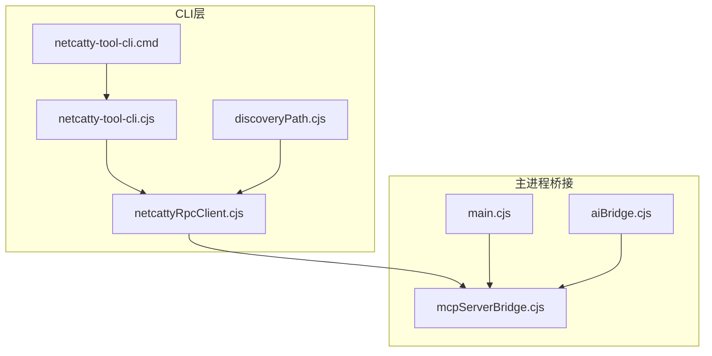
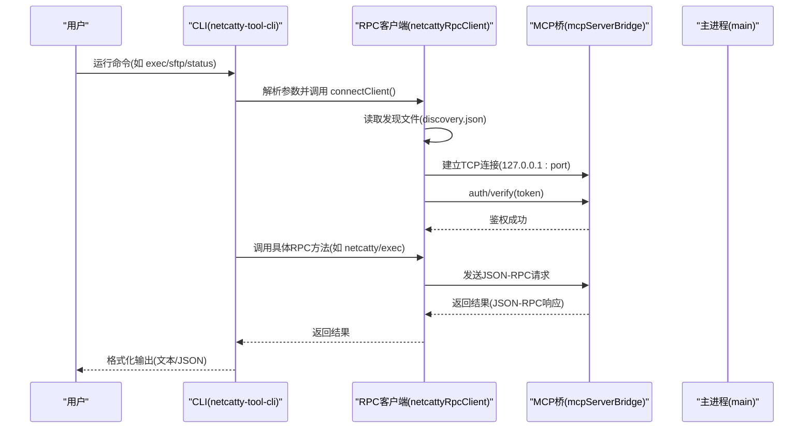
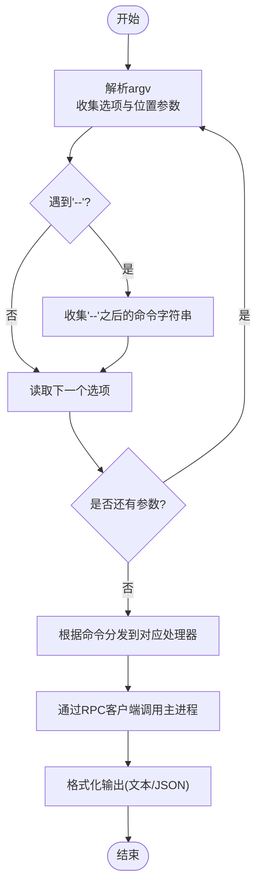
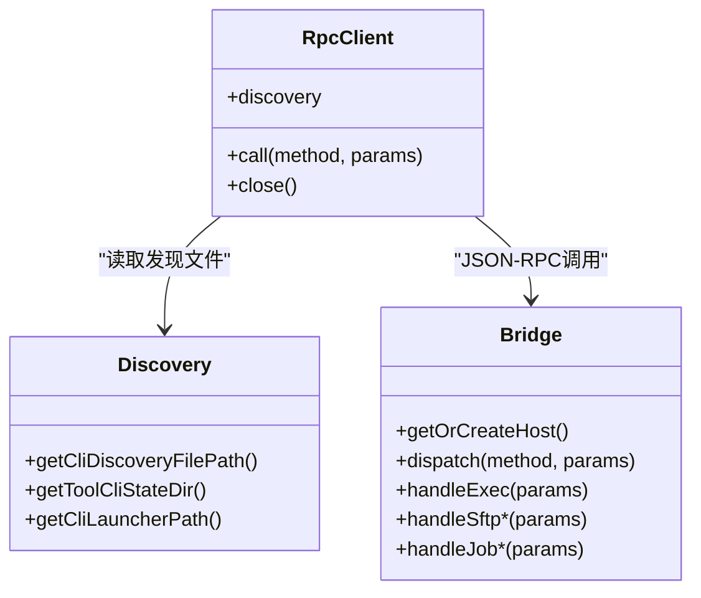
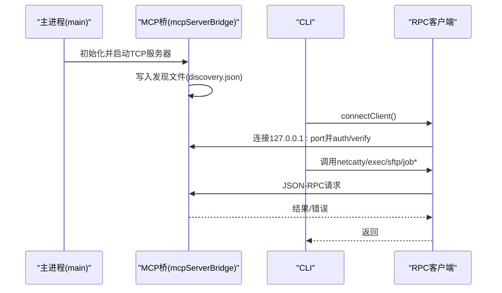
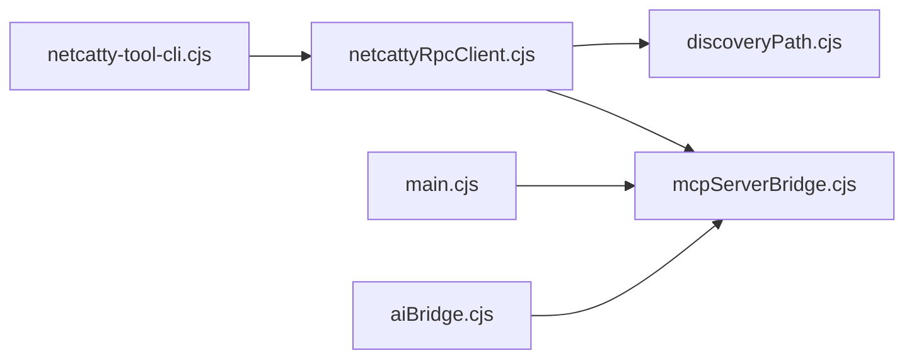

# CLI工具

<cite>
**本文引用的文件**
- [netcatty-tool-cli.cjs](file://electron/cli/netcatty-tool-cli.cjs)
- [netcattyRpcClient.cjs](file://electron/cli/netcattyRpcClient.cjs)
- [discoveryPath.cjs](file://electron/cli/discoveryPath.cjs)
- [netcatty-tool-cli.cmd](file://electron/cli/netcatty-tool-cli.cmd)
- [SKILL.md](file://skills/netcatty-tool-cli/SKILL.md)
- [exec.md](file://skills/netcatty-tool-cli/references/exec.md)
- [sftp.md](file://skills/netcatty-tool-cli/references/sftp.md)
- [session-types.md](file://skills/netcatty-tool-cli/references/session-types.md)
- [control-commands.md](file://skills/netcatty-tool-cli/references/control-commands.md)
- [errors.md](file://skills/netcatty-tool-cli/references/errors.md)
- [aiBridge.cjs](file://electron/bridges/aiBridge.cjs)
- [mcpServerBridge.cjs](file://electron/bridges/mcpServerBridge.cjs)
- [main.cjs](file://electron/main.cjs)
</cite>

## 目录
1. [简介](#简介)
2. [项目结构](#项目结构)
3. [核心组件](#核心组件)
4. [架构总览](#架构总览)
5. [详细组件分析](#详细组件分析)
6. [依赖关系分析](#依赖关系分析)
7. [性能考量](#性能考量)
8. [故障排查指南](#故障排查指南)
9. [结论](#结论)
10. [附录](#附录)

## 简介
本文件系统性介绍 Netcatty 的 CLI 工具集与实现，重点聚焦于 netcatty-tool-cli 命令行工具及其与主应用的集成方式。内容涵盖：
- 命令行参数解析与执行流程控制
- CLI 与主应用通过本地 TCP 桥（MCP Bridge）的 IPC 通信与数据交换
- 使用示例与最佳实践
- 扩展机制与自定义命令开发指南
- CLI 发现机制与路径解析实现

## 项目结构
Netcatty 的 CLI 工具位于 electron/cli 目录，主要文件包括：
- netcatty-tool-cli.cjs：CLI 主程序，负责参数解析、命令分发、格式化输出与错误处理
- netcattyRpcClient.cjs：RPC 客户端，负责连接本地 TCP 桥、鉴权、超时计算与消息收发
- discoveryPath.cjs：CLI 发现文件与启动器路径解析逻辑
- netcatty-tool-cli.cmd：Windows 启动器脚本，用于定位运行时并调用 CLI

技能参考文档位于 skills/netcatty-tool-cli/，为外部代理（ACPs）提供工作流指导。

图表来源
- [netcatty-tool-cli.cjs:1-691](file://electron/cli/netcatty-tool-cli.cjs#L1-L691)
- [netcattyRpcClient.cjs:1-261](file://electron/cli/netcattyRpcClient.cjs#L1-L261)
- [discoveryPath.cjs:1-83](file://electron/cli/discoveryPath.cjs#L1-L83)
- [netcatty-tool-cli.cmd:1-26](file://electron/cli/netcatty-tool-cli.cmd#L1-L26)
- [main.cjs:1-879](file://electron/main.cjs#L1-L879)
- [aiBridge.cjs:1-999](file://electron/bridges/aiBridge.cjs#L1-L999)
- [mcpServerBridge.cjs:1-1000](file://electron/bridges/mcpServerBridge.cjs#L1-L1000)

章节来源
- [netcatty-tool-cli.cjs:1-691](file://electron/cli/netcatty-tool-cli.cjs#L1-L691)
- [netcattyRpcClient.cjs:1-261](file://electron/cli/netcattyRpcClient.cjs#L1-L261)
- [discoveryPath.cjs:1-83](file://electron/cli/discoveryPath.cjs#L1-L83)
- [netcatty-tool-cli.cmd:1-26](file://electron/cli/netcatty-tool-cli.cmd#L1-L26)
- [main.cjs:1-879](file://electron/main.cjs#L1-L879)
- [aiBridge.cjs:1-999](file://electron/bridges/aiBridge.cjs#L1-L999)
- [mcpServerBridge.cjs:1-1000](file://electron/bridges/mcpServerBridge.cjs#L1-L1000)

## 核心组件
- CLI 主程序（netcatty-tool-cli.cjs）
  - 负责帮助信息打印、参数解析、命令分发、上下文解析、格式化输出与错误包装
  - 支持 status、env、session、exec、job-start、job-poll、job-stop、sftp 子命令族
- RPC 客户端（netcattyRpcClient.cjs）
  - 负责读取发现文件、建立到本地 TCP 桥的连接、鉴权、超时策略计算、请求/响应收发与错误传播
- 发现与路径（discoveryPath.cjs）
  - 解析 CLI 状态目录、发现文件路径、启动器路径，支持环境变量覆盖
- Windows 启动器（netcatty-tool-cli.cmd）
  - 在 Windows 上定位 Electron 可执行或系统 Node 并调用 CLI
- 技能参考（skills/netcatty-tool-cli/*.md）
  - 提供外部代理的工作流规范、路由规则、错误处理与最佳实践

章节来源
- [netcatty-tool-cli.cjs:1-691](file://electron/cli/netcatty-tool-cli.cjs#L1-L691)
- [netcattyRpcClient.cjs:1-261](file://electron/cli/netcattyRpcClient.cjs#L1-L261)
- [discoveryPath.cjs:1-83](file://electron/cli/discoveryPath.cjs#L1-L83)
- [netcatty-tool-cli.cmd:1-26](file://electron/cli/netcatty-tool-cli.cmd#L1-L26)
- [SKILL.md:1-48](file://skills/netcatty-tool-cli/SKILL.md#L1-L48)

## 架构总览
CLI 通过本地 TCP 桥与主进程交互，采用 JSON-RPC over TCP 的协议。主进程在启动时创建 MCP TCP 服务器，写入发现文件；CLI 通过发现文件获取端口与令牌后连接并鉴权，随后发起 RPC 调用。

图表来源
- [netcatty-tool-cli.cjs:344-688](file://electron/cli/netcatty-tool-cli.cjs#L344-L688)
- [netcattyRpcClient.cjs:104-255](file://electron/cli/netcattyRpcClient.cjs#L104-L255)
- [mcpServerBridge.cjs:498-649](file://electron/bridges/mcpServerBridge.cjs#L498-L649)
- [main.cjs:352-397](file://electron/main.cjs#L352-L397)

章节来源
- [netcatty-tool-cli.cjs:344-688](file://electron/cli/netcatty-tool-cli.cjs#L344-L688)
- [netcattyRpcClient.cjs:104-255](file://electron/cli/netcattyRpcClient.cjs#L104-L255)
- [mcpServerBridge.cjs:498-649](file://electron/bridges/mcpServerBridge.cjs#L498-L649)
- [main.cjs:352-397](file://electron/main.cjs#L352-L397)

## 详细组件分析

### CLI 参数解析与执行流程
- 参数解析
  - 支持 --json、--chat-session、--scope-session、--session、--job、--offset、--remote-path、--local-path、--content、--mode、--encoding 等选项
  - 使用 -- 分隔“命令字符串”部分，确保传入的 shell-ready 命令保持整体性
- 命令分发
  - status：查询桥状态（权限模式、超时、会话数等）
  - env：查询当前作用域内的主机上下文
  - session：解析目标主机元数据
  - exec：在指定会话执行命令，返回 stdout/stderr/exitCode
  - job-start/job-poll/job-stop：长任务的启动、轮询与停止
  - sftp 子命令族：list/read/write/download/upload/mkdir/delete/rename/stat/chmod/home
  - cancel/resume：对聊天作用域进行取消与恢复
- 输出格式
  - 文本格式：根据命令类型格式化输出（如 SFTP 列表表格、作业状态、执行结果）
  - JSON 格式：通过 --json 输出结构化结果

图表来源
- [netcatty-tool-cli.cjs:69-165](file://electron/cli/netcatty-tool-cli.cjs#L69-L165)
- [netcatty-tool-cli.cjs:344-688](file://electron/cli/netcatty-tool-cli.cjs#L344-L688)

章节来源
- [netcatty-tool-cli.cjs:69-165](file://electron/cli/netcatty-tool-cli.cjs#L69-L165)
- [netcatty-tool-cli.cjs:344-688](file://electron/cli/netcatty-tool-cli.cjs#L344-L688)

### RPC 客户端与超时策略
- 连接与鉴权
  - 从发现文件读取端口与令牌，连接 127.0.0.1:port
  - 首次发送 auth/verify(token)，鉴权成功后方可继续
- 超时策略
  - 默认 RPC 超时、执行类超时、审批等待超时三者组合，长任务与需要审批的方法具有更长超时
- 请求/响应
  - JSON-RPC over TCP，按行分隔
  - 维护 pending 映射与定时器，处理超时与错误
- 错误传播
  - 将桥侧错误包装为带 code/message 的标准错误对象

图表来源
- [netcattyRpcClient.cjs:104-255](file://electron/cli/netcattyRpcClient.cjs#L104-L255)
- [discoveryPath.cjs:62-82](file://electron/cli/discoveryPath.cjs#L62-L82)
- [mcpServerBridge.cjs:498-800](file://electron/bridges/mcpServerBridge.cjs#L498-L800)

章节来源
- [netcattyRpcClient.cjs:104-255](file://electron/cli/netcattyRpcClient.cjs#L104-L255)
- [discoveryPath.cjs:62-82](file://electron/cli/discoveryPath.cjs#L62-L82)
- [mcpServerBridge.cjs:498-800](file://electron/bridges/mcpServerBridge.cjs#L498-L800)

### CLI 与主应用的集成与 IPC
- 发现文件
  - 主进程启动时生成 discovery.json（含 port/token/permissionMode），CLI 通过 discoveryPath.cjs 解析
- TCP 桥
  - mcpServerBridge.cjs 创建本地 TCP 服务器，监听 127.0.0.1:port，处理 JSON-RPC 方法
- 权限与作用域
  - permissionMode 控制是否需要用户审批（confirm 模式）
  - scopedSessionIds 限制命令可见的会话集合，避免越权访问
- 外部代理集成
  - aiBridge.cjs 提供技能提示与 CLI 前缀构建，确保外部代理严格遵循作用域与安全策略

图表来源
- [main.cjs:352-397](file://electron/main.cjs#L352-L397)
- [mcpServerBridge.cjs:245-269](file://electron/bridges/mcpServerBridge.cjs#L245-L269)
- [netcatty-tool-cli.cjs:354-361](file://electron/cli/netcatty-tool-cli.cjs#L354-L361)
- [netcattyRpcClient.cjs:104-255](file://electron/cli/netcattyRpcClient.cjs#L104-L255)

章节来源
- [main.cjs:352-397](file://electron/main.cjs#L352-L397)
- [mcpServerBridge.cjs:245-269](file://electron/bridges/mcpServerBridge.cjs#L245-L269)
- [netcatty-tool-cli.cjs:354-361](file://electron/cli/netcatty-tool-cli.cjs#L354-L361)
- [netcattyRpcClient.cjs:104-255](file://electron/cli/netcattyRpcClient.cjs#L104-L255)

### 使用示例与最佳实践
- 基本用法
  - 先查询作用域内可用会话：env --chat-session <id> --json
  - 选择目标会话：session --session <id> --chat-session <id> --json
  - 简短命令：exec --session <id> --chat-session <id> --json -- "<命令>"
  - 长任务：job-start -> job-poll -> job-stop
  - 文件操作：优先使用 SFTP 子命令族，严格区分本地与远程路径
- 最佳实践
  - 始终携带 --chat-session <id>，并在每个命令中保留该参数
  - 对于可能耗时超过约 60 秒或持续输出的任务，使用 job-start/job-poll
  - SFTP 仅适用于已连接的 SSH 后端会话；非 SSH 会话（如本地、Mosh、Telnet、串口、网络设备）禁止使用
  - 严格遵循“先 session 再 exec/sftp”的顺序，避免因设备类型差异导致的失败

章节来源
- [exec.md:1-32](file://skills/netcatty-tool-cli/references/exec.md#L1-L32)
- [sftp.md:1-43](file://skills/netcatty-tool-cli/references/sftp.md#L1-L43)
- [session-types.md:1-18](file://skills/netcatty-tool-cli/references/session-types.md#L1-L18)
- [control-commands.md:1-18](file://skills/netcatty-tool-cli/references/control-commands.md#L1-L18)

### 扩展机制与自定义命令开发指南
- 当前 CLI 方法集
  - 读取类：netcatty/getContext、netcatty/getStatus
  - 执行类：netcatty/exec、netcatty/jobStart、netcatty/jobPoll、netcatty/jobStop
  - SFTP 类：netcatty/sftp/list/read/write/download/upload/mkdir/delete/rename/stat/chmod/home
  - 控制类：netcatty/setCancelled
- 扩展建议
  - 在主进程 MCP 桥中新增方法处理函数，并在 dispatch 中注册
  - 为新方法设计鉴权与作用域校验（参照现有 WRITE_METHODS 与 validateSessionScope）
  - 设计合理的超时与审批策略，必要时扩展 netcattyRpcClient 的超时计算
  - 提供 CLI 子命令映射到新 RPC 方法，并在 CLI 中添加帮助与错误处理
  - 编写技能参考文档，明确路由规则、参数约束与错误处理

章节来源
- [mcpServerBridge.cjs:653-800](file://electron/bridges/mcpServerBridge.cjs#L653-L800)
- [netcatty-tool-cli.cjs:357-672](file://electron/cli/netcatty-tool-cli.cjs#L357-L672)
- [netcattyRpcClient.cjs:45-70](file://electron/cli/netcattyRpcClient.cjs#L45-L70)

### CLI 发现机制与路径解析
- 发现文件路径
  - 优先使用环境变量 NETCATTY_TOOL_CLI_DISCOVERY_FILE 指定的路径
  - 否则默认在用户数据目录下的 netcatty-tool-cli 子目录中生成 discovery.json
- 启动器路径
  - Windows：netcatty-tool-cli.cmd
  - 其他平台：netcatty-tool-cli（Node 脚本）
  - 启动器会尝试使用捆绑的 Electron 运行时或系统 Node

章节来源
- [discoveryPath.cjs:47-82](file://electron/cli/discoveryPath.cjs#L47-L82)
- [netcatty-tool-cli.cmd:1-26](file://electron/cli/netcatty-tool-cli.cmd#L1-L26)

## 依赖关系分析
- CLI 依赖
  - netcattyRpcClient：连接与鉴权、超时策略
  - discoveryPath：发现文件与启动器路径
- 主进程依赖
  - mcpServerBridge：TCP 服务器、JSON-RPC 分发、权限与作用域控制
  - aiBridge：技能提示与 CLI 前缀构建
  - main：注册桥接、暴露 getCliDiscoveryFilePath

图表来源
- [netcatty-tool-cli.cjs:1-691](file://electron/cli/netcatty-tool-cli.cjs#L1-L691)
- [netcattyRpcClient.cjs:1-261](file://electron/cli/netcattyRpcClient.cjs#L1-L261)
- [discoveryPath.cjs:1-83](file://electron/cli/discoveryPath.cjs#L1-L83)
- [mcpServerBridge.cjs:1-1000](file://electron/bridges/mcpServerBridge.cjs#L1-L1000)
- [aiBridge.cjs:1-999](file://electron/bridges/aiBridge.cjs#L1-L999)
- [main.cjs:352-397](file://electron/main.cjs#L352-L397)

章节来源
- [netcatty-tool-cli.cjs:1-691](file://electron/cli/netcatty-tool-cli.cjs#L1-L691)
- [netcattyRpcClient.cjs:1-261](file://electron/cli/netcattyRpcClient.cjs#L1-L261)
- [discoveryPath.cjs:1-83](file://electron/cli/discoveryPath.cjs#L1-L83)
- [mcpServerBridge.cjs:1-1000](file://electron/bridges/mcpServerBridge.cjs#L1-L1000)
- [aiBridge.cjs:1-999](file://electron/bridges/aiBridge.cjs#L1-L999)
- [main.cjs:352-397](file://electron/main.cjs#L352-L397)

## 性能考量
- 超时与并发
  - 长任务与需要审批的方法具有较长超时，避免误判超时
  - 单个聊天作用域内严格串行执行，避免资源竞争
- I/O 与缓冲
  - TCP 接收缓冲上限控制，防止内存膨胀
  - SFTP 读写与下载上传采用流式处理，CLI 层对输出进行格式化
- 线程与进程
  - CLI 为单进程命令行工具，不引入额外线程；主进程通过 MCP 桥统一调度

## 故障排查指南
- 常见错误与处理
  - APP_NOT_RUNNING 或 DISCOVERY_INVALID：确认主应用已启动且发现文件存在
  - CONNECT_FAILED：检查本地 TCP 端口连通性
  - AUTH_FAILED：确认令牌正确，重新鉴权
  - RPC_TIMEOUT：适当增加命令超时或减少任务复杂度
  - SESSION_NOT_FOUND：使用 env 查看当前作用域内的会话列表
  - SFTP_UNSUPPORTED_SESSION：仅对已连接的 SSH 后端会话使用 SFTP
  - COMMAND_ALREADY_RUNNING：等待当前执行完成或使用 cancel/resume
- 建议排查步骤
  - status --json 检查权限模式、会话数与发现文件路径
  - env --json --chat-session <id> 确认作用域内会话
  - session --session <id> --json --chat-session <id> 校验目标会话元数据
  - cancel --chat-session <id> 清理阻塞状态后重试

章节来源
- [netcatty-tool-cli.cjs:55-63](file://electron/cli/netcatty-tool-cli.cjs#L55-L63)
- [netcattyRpcClient.cjs:72-102](file://electron/cli/netcattyRpcClient.cjs#L72-L102)
- [errors.md:1-11](file://skills/netcatty-tool-cli/references/errors.md#L1-L11)

## 结论
netcatty-tool-cli 通过本地 TCP 桥实现了与主进程的安全、可控通信，结合权限模式与作用域控制，为外部代理与用户提供了稳定可靠的多会话操作能力。其清晰的命令体系、严格的参数与路径约束以及完善的错误处理，使得 CLI 在复杂网络环境中仍能保持高可靠性与可维护性。通过扩展 MCP 桥与 CLI 的方法映射，可以平滑地引入新的能力，同时维持一致的安全与用户体验。

## 附录
- 技能参考文档索引
  - exec 参考：远程命令执行工作流与长任务处理
  - sftp 参考：远程文件/目录操作与路径语义
  - session-types 参考：设备类型与执行模式决策
  - control-commands 参考：运行时诊断与取消/恢复
  - errors 参考：权威错误处理与重试策略

章节来源
- [exec.md:1-32](file://skills/netcatty-tool-cli/references/exec.md#L1-L32)
- [sftp.md:1-43](file://skills/netcatty-tool-cli/references/sftp.md#L1-L43)
- [session-types.md:1-18](file://skills/netcatty-tool-cli/references/session-types.md#L1-L18)
- [control-commands.md:1-18](file://skills/netcatty-tool-cli/references/control-commands.md#L1-L18)
- [errors.md:1-11](file://skills/netcatty-tool-cli/references/errors.md#L1-L11)