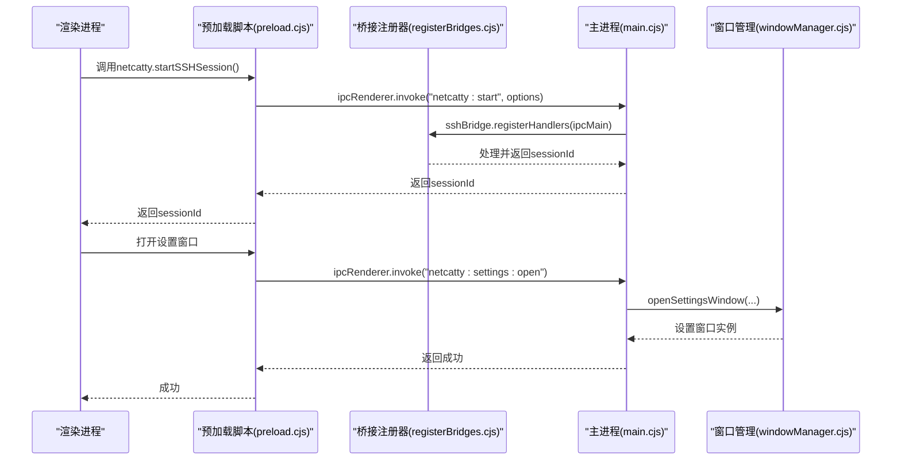
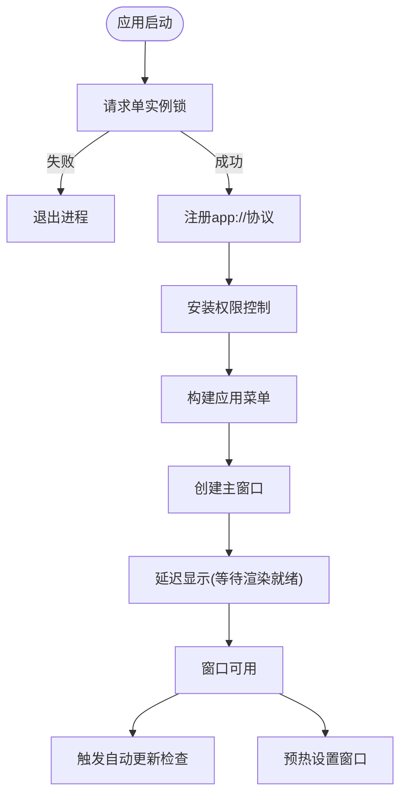
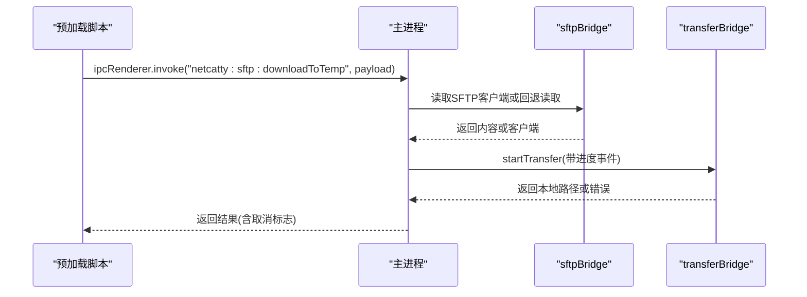
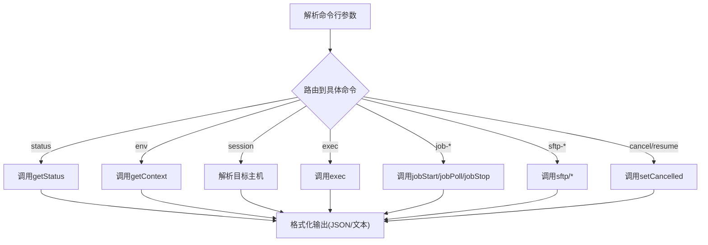
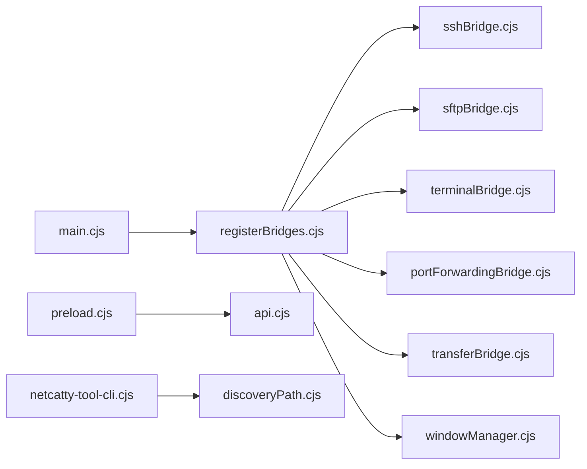

# Electron集成

<cite>
**本文档引用的文件**
- [main.cjs](file://electron/main.cjs)
- [preload.cjs](file://electron/preload.cjs)
- [api.cjs](file://electron/preload/api.cjs)
- [registerBridges.cjs](file://electron/main/registerBridges.cjs)
- [windowManager.cjs](file://electron/bridges/windowManager.cjs)
- [mainWindow.cjs](file://electron/bridges/windowManager/mainWindow.cjs)
- [settingsWindow.cjs](file://electron/bridges/windowManager/settingsWindow.cjs)
- [netcatty-tool-cli.cjs](file://electron/cli/netcatty-tool-cli.cjs)
- [discoveryPath.cjs](file://electron/cli/discoveryPath.cjs)
- [electron-builder.config.cjs](file://electron-builder.config.cjs)
</cite>

## 目录
1. [简介](#简介)
2. [项目结构](#项目结构)
3. [核心组件](#核心组件)
4. [架构总览](#架构总览)
5. [详细组件分析](#详细组件分析)
6. [依赖关系分析](#依赖关系分析)
7. [性能考虑](#性能考虑)
8. [故障排除指南](#故障排除指南)
9. [结论](#结论)
10. [附录](#附录)

## 简介
本文件面向Netcatty的Electron集成，系统化阐述主进程架构（窗口管理、菜单与系统托盘）、预加载脚本的安全机制与API暴露策略、IPC桥接层的设计与实现、CLI工具链集成以及Electron配置最佳实践。文档同时覆盖跨平台兼容性与平台特定功能，帮助开发者在保证安全与性能的前提下扩展与维护应用。

## 项目结构
Electron相关代码主要位于electron目录，采用“主进程 + 预加载 + 桥接模块”的分层设计：
- 主进程入口负责应用生命周期、协议注册、权限控制、窗口管理与桥接注册
- 预加载脚本通过contextBridge安全暴露有限API，并集中处理事件回调
- 桥接模块按功能拆分（SSH/SFTP/终端/传输/端口转发等），通过IPC与主进程交互
- CLI工具通过RPC客户端连接到主进程提供的能力，用于技能与命令行集成

```mermaid
graph TB
subgraph "主进程"
Main["main.cjs<br/>应用入口与生命周期"]
WM["windowManager.cjs<br/>窗口管理器"]
Reg["registerBridges.cjs<br/>桥接注册器"]
end
subgraph "预加载"
Preload["preload.cjs<br/>上下文桥接与事件分发"]
Api["api.cjs<br/>API工厂"]
end
subgraph "桥接模块"
SSH["sshBridge.cjs"]
SFTP["sftpBridge.cjs"]
Term["terminalBridge.cjs"]
PF["portForwardingBridge.cjs"]
Trans["transferBridge.cjs"]
WinMgr["windowManager/*.cjs"]
end
subgraph "CLI"
CLI["netcatty-tool-cli.cjs"]
Disc["discoveryPath.cjs"]
end
Main --> WM
Main --> Reg
Reg --> SSH
Reg --> SFTP
Reg --> Term
Reg --> PF
Reg --> Trans
WM --> WinMgr
Preload --> Api
Preload --> SSH
Preload --> SFTP
Preload --> Term
Preload --> PF
Preload --> Trans
CLI --> Disc
```

**图表来源**
- [main.cjs:1-879](file://electron/main.cjs#L1-L879)
- [registerBridges.cjs:1-678](file://electron/main/registerBridges.cjs#L1-L678)
- [windowManager.cjs:1-951](file://electron/bridges/windowManager.cjs#L1-L951)
- [preload.cjs:1-708](file://electron/preload.cjs#L1-L708)
- [api.cjs:1-928](file://electron/preload/api.cjs#L1-L928)
- [netcatty-tool-cli.cjs:1-691](file://electron/cli/netcatty-tool-cli.cjs#L1-L691)
- [discoveryPath.cjs:1-83](file://electron/cli/discoveryPath.cjs#L1-L83)

**章节来源**
- [main.cjs:1-879](file://electron/main.cjs#L1-L879)
- [registerBridges.cjs:1-678](file://electron/main/registerBridges.cjs#L1-L678)
- [windowManager.cjs:1-951](file://electron/bridges/windowManager.cjs#L1-L951)
- [preload.cjs:1-708](file://electron/preload.cjs#L1-L708)
- [api.cjs:1-928](file://electron/preload/api.cjs#L1-L928)
- [netcatty-tool-cli.cjs:1-691](file://electron/cli/netcatty-tool-cli.cjs#L1-L691)
- [discoveryPath.cjs:1-83](file://electron/cli/discoveryPath.cjs#L1-L83)

## 核心组件
- 主进程入口：负责环境初始化、协议注册、权限控制、GPU加速开关、单实例锁、应用菜单构建、窗口创建与生命周期管理、错误处理器安装、自动更新触发与设置窗口预热。
- 预加载脚本：通过contextBridge暴露受限API，集中管理会话数据、传输进度、认证事件、更新状态等回调；对可信源进行校验，拒绝不受信导航。
- 桥接注册器：统一初始化各桥接模块并注册IPC处理器，提供云同步密码持久化、临时目录管理、文件下载到临时路径、对话框与系统交互等通用能力。
- 窗口管理器：独立实现主窗口与设置窗口的创建、显示延迟、状态保存/恢复、全屏/最大化状态跟踪、导航拦截、OAuth加载遮罩、全局快捷键挂钩等。
- CLI工具：解析命令行参数，通过RPC客户端连接主进程，执行状态查询、环境上下文获取、会话操作、长任务轮询/停止、SFTP文件操作、取消/恢复聊天会话等。

**章节来源**
- [main.cjs:1-879](file://electron/main.cjs#L1-L879)
- [preload.cjs:1-708](file://electron/preload.cjs#L1-L708)
- [registerBridges.cjs:1-678](file://electron/main/registerBridges.cjs#L1-L678)
- [windowManager.cjs:1-951](file://electron/bridges/windowManager.cjs#L1-L951)
- [netcatty-tool-cli.cjs:1-691](file://electron/cli/netcatty-tool-cli.cjs#L1-L691)

## 架构总览
下图展示主进程、预加载与桥接模块之间的交互关系，以及IPC通道的典型调用序列。



**图表来源**
- [main.cjs:352-397](file://electron/main.cjs#L352-L397)
- [registerBridges.cjs:283-300](file://electron/main/registerBridges.cjs#L283-L300)
- [windowManager.cjs:649-695](file://electron/bridges/windowManager.cjs#L649-L695)
- [preload.cjs:595-638](file://electron/preload.cjs#L595-L638)

**章节来源**
- [main.cjs:352-397](file://electron/main.cjs#L352-L397)
- [registerBridges.cjs:283-300](file://electron/main/registerBridges.cjs#L283-L300)
- [windowManager.cjs:649-695](file://electron/bridges/windowManager.cjs#L649-L695)
- [preload.cjs:595-638](file://electron/preload.cjs#L595-L638)

## 详细组件分析

### 主进程架构与窗口管理
- 单实例锁与二次实例处理：确保同一时间仅有一个应用实例运行；若已有实例，聚焦或重建主窗口。
- 应用协议与权限控制：注册app://协议，限制渲染进程权限，仅允许本地字体、剪贴板读写等必要权限。
- 窗口创建与导航拦截：主窗口与设置窗口均设置contextIsolation与sandbox禁用，阻止不受信导航，防止RCE风险。
- 状态持久化与延迟显示：窗口bounds状态保存/恢复，首次渲染延迟显示以避免空白屏，支持全屏/最大化状态跟踪。
- 全局快捷键与关闭到托盘：通过全局快捷键实现quake模式，隐藏至托盘时仍可响应系统事件。
- 自动更新与设置窗口预热：启动后延时触发自动更新检查，后台预热设置窗口以提升打开速度。



**图表来源**
- [main.cjs:507-703](file://electron/main.cjs#L507-L703)
- [main.cjs:525-661](file://electron/main.cjs#L525-L661)
- [main.cjs:637-661](file://electron/main.cjs#L637-L661)
- [windowManager.cjs:410-473](file://electron/bridges/windowManager.cjs#L410-L473)

**章节来源**
- [main.cjs:507-703](file://electron/main.cjs#L507-L703)
- [main.cjs:525-661](file://electron/main.cjs#L525-L661)
- [windowManager.cjs:410-473](file://electron/bridges/windowManager.cjs#L410-L473)

### 预加载脚本的安全机制与API暴露
- 上下文隔离与信任源校验：仅在可信源（app://netcatty与开发服务器）下暴露netcatty桥接对象，其他源直接拒绝。
- API工厂与事件分发：通过createPreloadApi集中暴露SSH/Telnet/Mosh/本地会话、SFTP、传输、端口转发、系统托盘、自动更新等API；内部使用Map/Set维护事件监听器，避免内存泄漏。
- 数据过滤与MCP标记：对PTY输出进行缓冲与标记过滤，确保安全输出。
- 渲染就绪信号：主进程通过rendererReady回调避免首屏空白，提升用户体验。

```mermaid
classDiagram
class PreloadAPI {
+startSSHSession(options) Promise<string>
+startTelnetSession(options) Promise<string>
+startMoshSession(options) Promise<string>
+startLocalSession(options) Promise<string>
+startSerialSession(options) Promise<string>
+listSerialPorts() Promise<string[]>
+getDefaultShell() Promise<string>
+discoverShells() Promise<void>
+validatePath(path,type) Promise<boolean>
+writeToSession(sessionId,data,options) void
+getSessionPwd(sessionId) Promise<string>
+getSessionRemoteInfo(sessionId) Promise<object>
+getSessionDistroInfo(sessionId) Promise<object>
+getServerStats(sessionId) Promise<object>
+generateKeyPair(options) Promise<object>
+checkSshAgent() Promise<boolean>
+getDefaultKeys() Promise<string[]>
+resizeSession(sessionId,cols,rows) void
+setSessionFlowPaused(sessionId,paused) void
+closeSession(sessionId) void
+setSessionEncoding(sessionId,encoding) Promise<object>
+onSessionData(sessionId,cb) Function
+onSessionExit(sessionId,cb) Function
+onTelnetAutoLoginComplete(sessionId,cb) Function
+onTelnetAutoLoginCancelled(sessionId,cb) Function
+onAuthFailed(sessionId,cb) Function
+onKeyboardInteractive(cb) Function
+respondKeyboardInteractive(requestId,responses,cancelled) Promise<void>
+onHostKeyVerification(cb) Function
+respondHostKeyVerification(requestId,accept,addToKnownHosts) Promise<void>
+onPassphraseRequest(cb) Function
+respondPassphrase(requestId,passphrase,cancelled) Promise<void>
+respondPassphraseSkip(requestId) Promise<void>
+onPassphraseTimeout(cb) Function
+onPassphraseCancelled(cb) Function
+onPassphraseAuthFailed(cb) Function
+openSftp(options) Promise<string>
+listSftp(sftpId,path,encoding) Promise<any[]>
+readSftp(sftpId,path,encoding) Promise<string|Uint8Array>
+readSftpBinary(sftpId,path,encoding) Promise<Uint8Array>
+writeSftp(sftpId,path,content,encoding) Promise<void>
+writeSftpBinary(sftpId,path,content,encoding) Promise<void>
+closeSftp(sftpId) Promise<void>
+mkdirSftp(sftpId,path,encoding) Promise<void>
+deleteSftp(sftpId,path,encoding) Promise<void>
+renameSftp(sftpId,oldPath,newPath,encoding) Promise<void>
+statSftp(sftpId,path,encoding) Promise<object>
+chmodSftp(sftpId,path,mode,encoding) Promise<void>
+getSftpHomeDir(sftpId) Promise<string>
+writeSftpBinaryWithProgress(sftpId,path,content,transferId,encoding,onProgress,onComplete,onError) Promise<void>
+cancelSftpUpload(transferId) Promise<void>
+listLocalDir(path) Promise<any[]>
+readLocalFile(path) Promise<string|Uint8Array>
+writeLocalFile(path,content) Promise<void>
+deleteLocalFile(path) Promise<void>
+renameLocalFile(oldPath,newPath) Promise<void>
+mkdirLocal(path) Promise<void>
+statLocal(path) Promise<object>
+listLocalTree(path) Promise<any[]>
+getHomeDir() Promise<string>
+listDrives() Promise<string[]>
+getSystemInfo() Promise<object>
+readKnownHosts() Promise<string[]>
+setTheme(theme) Promise<void>
+setBackgroundColor(color) Promise<void>
+setLanguage(language) Promise<void>
+onLanguageChanged(cb) Function
+startStreamTransfer(options,onProgress,onComplete,onError) Promise<void>
+cancelTransfer(transferId) Promise<void>
+sameHostCopyDirectory(sftpId,sourcePath,targetPath,encoding,transferId) Promise<void>
+startCompressedUpload(options,onProgress,onComplete,onError) Promise<void>
+cancelCompressedUpload(compressionId) Promise<void>
+checkCompressedUploadSupport(sftpId) Promise<boolean>
+windowMinimize() Promise<void>
+windowMaximize() Promise<boolean>
+windowClose() Promise<void>
+windowIsMaximized() Promise<boolean>
+windowIsFullscreen() Promise<boolean>
+windowFocus() Promise<void>
+onWindowFullScreenChanged(cb) Function
+openSettingsWindow() Promise<void>
+closeSettingsWindow() Promise<void>
+notifySettingsChanged(payload) void
+onSettingsChanged(callback) Function
+cloudSyncSetSessionPassword(password) Promise<void>
+cloudSyncGetSessionPassword() Promise<string|null>
+cloudSyncClearSessionPassword() Promise<void>
+cloudSyncWebdavInitialize(config) Promise<void>
+cloudSyncWebdavUpload(config,syncedFile) Promise<void>
+cloudSyncWebdavDownload(config) Promise<void>
+cloudSyncWebdavDelete(config) Promise<void>
+cloudSyncS3Initialize(config) Promise<void>
+cloudSyncS3Upload(config,syncedFile) Promise<void>
+cloudSyncS3Download(config) Promise<void>
+cloudSyncS3Delete(config) Promise<void>
+openExternal(url) Promise<void>
+openPath(path) Promise<object>
+getAppInfo() Promise<object>
+ptyGetChildProcesses(sessionId) Promise<string[]>
+confirmCloseBusy(payload) Promise<boolean>
+getVaultBackupCapabilities() Promise<object>
+createVaultBackup(payload) Promise<void>
+listVaultBackups() Promise<any[]>
+readVaultBackup(payload) Promise<any>
+trimVaultBackups(payload) Promise<void>
+openVaultBackupDir() Promise<void>
+onVaultBackupsChanged(handler) Function
+rendererReady() void
+onCheckDirtyEditors(listener) Function
+reportDirtyEditorsResult(hasDirty) void
+startPortForward(options) Promise<string>
+stopPortForward(tunnelId) Promise<void>
+getPortForwardStatus(tunnelId) Promise<object>
+listPortForwards() Promise<any[]>
+stopAllPortForwards() Promise<void>
+stopPortForwardByRuleId(ruleId) Promise<void>
+onPortForwardStatus(tunnelId,cb) Function
+onChainProgress(cb) Function
+onSftpConnectionProgress(cb) Function
+prepareOAuthCallback() Promise<number>
+awaitOAuthCallback(expectedState,sessionId) Promise<string>
+cancelOAuthCallback(sessionId) Promise<void>
+githubStartDeviceFlow(options) Promise<object>
+githubPollDeviceFlowToken(options) Promise<object>
+githubCancelDeviceFlowPoll(pollId) Promise<void>
+googleExchangeCodeForTokens(options) Promise<object>
+googleRefreshAccessToken(options) Promise<object>
+googleGetUserInfo(options) Promise<object>
+googleDriveFindSyncFile(options) Promise<object>
+googleDriveCreateSyncFile(options) Promise<object>
+googleDriveUpdateSyncFile(options) Promise<object>
+googleDriveDownloadSyncFile(options) Promise<object>
+googleDriveDeleteSyncFile(options) Promise<object>
+onedriveExchangeCodeForTokens(options) Promise<object>
+onedriveRefreshAccessToken(options) Promise<object>
+onedriveGetUserInfo(options) Promise<object>
+onedriveFindSyncFile(options) Promise<object>
+onedriveUploadSyncFile(options) Promise<object>
+onedriveDownloadSyncFile(options) Promise<object>
+onedriveDeleteSyncFile(options) Promise<object>
+selectApplication() Promise<object|null>
+openWithApplication(filePath,appPath) Promise<boolean>
+downloadSftpToTemp(sftpId,remotePath,fileName,encoding) Promise<string>
+downloadSftpToTempWithProgress(sftpId,remotePath,fileName,encoding,transferId,onProgress,onComplete,onError,onCancelled) Promise<object>
+showSaveDialog(defaultPath,filters) Promise<string|null>
+selectDirectory(title,defaultPath) Promise<string|null>
+selectFile(title,defaultPath,filters) Promise<string|null>
+startFileWatch(localPath,remotePath,sftpId,encoding) Promise<string>
+stopFileWatch(watchId,cleanupTempFile) Promise<void>
+listFileWatches() Promise<any[]>
+registerTempFile(sftpId,localPath) Promise<void>
+onFileWatchSynced(cb) Function
+onFileWatchError(cb) Function
+deleteTempFile(filePath) Promise<object>
+getTempDirInfo() Promise<object>
+clearTempDir() Promise<void>
+getTempDirPath() Promise<string>
+openTempDir() Promise<void>
+exportSessionLog(payload) Promise<void>
+selectSessionLogsDir() Promise<string>
+autoSaveSessionLog(payload) Promise<void>
+openSessionLogsDir(directory) Promise<void>
+getCrashLogs() Promise<string[]>
+readCrashLog(fileName) Promise<string>
+clearCrashLogs() Promise<void>
+openCrashLogsDir() Promise<void>
+registerGlobalHotkey(hotkey) Promise<void>
+unregisterGlobalHotkey() Promise<void>
+getGlobalHotkeyStatus() Promise<boolean>
+setCloseToTray(enabled) Promise<void>
+isCloseToTray() Promise<boolean>
+updateTrayMenuData(data) Promise<void>
+onTrayFocusSession(callback) Function
+onTrayTogglePortForward(callback) Function
+hideTrayPanel() Promise<void>
+openMainWindow() Promise<void>
+quitApp() Promise<void>
+jumpToSessionFromTrayPanel(sessionId) Promise<void>
+connectToHostFromTrayPanel(hostId) Promise<void>
+onTrayPanelCloseRequest(callback) Function
+onTrayPanelRefresh(callback) Function
+onTrayPanelMenuData(callback) Function
+getPathForFile(file) Promise<string|undefined>
+readClipboardText() Promise<string>
+credentialsAvailable() Promise<boolean>
+credentialsEncrypt(plaintext) Promise<string>
+credentialsDecrypt(value) Promise<string>
+checkForUpdate() Promise<void>
+downloadUpdate() Promise<void>
+installUpdate() Promise<void>
+getUpdateStatus() Promise<object>
+setAutoUpdate(enabled) Promise<void>
+getAutoUpdate() Promise<boolean>
+onUpdateAvailable(cb) Function
+onUpdateNotAvailable(cb) Function
+onUpdateDownloadProgress(cb) Function
+onUpdateDownloaded(cb) Function
+onUpdateError(cb) Function
+aiSyncProviders(providers) Promise<void>
+aiSyncWebSearch(apiHost,apiKey) Promise<void>
+aiChatStream(requestId,url,headers,body,providerId) Promise<ReadableStream>
+aiChatCancel(requestId) Promise<void>
+aiFetch(url,method,headers,body,providerId,skipHostCheck,followRedirects,skipTLSVerify) Promise<object>
+aiAllowlistAddHost(baseURL) Promise<void>
+aiExec(sessionId,command,chatSessionId) Promise<object>
+aiCattyCancelExec(chatSessionId) Promise<void>
+aiDiscoverAgents() Promise<any[]>
+aiResolveCli(params) Promise<object>
+aiCodexGetIntegration(options) Promise<object>
+aiCodexStartLogin() Promise<object>
+aiCodexGetLoginSession(sessionId) Promise<object>
+aiCodexCancelLogin(sessionId) Promise<void>
+aiCodexLogout() Promise<void>
+aiSpawnAgent(agentId,command,args,env,options) Promise<void>
+aiWriteToAgent(agentId,data) Promise<void>
+aiCloseAgentStdin(agentId) Promise<void>
}
```



**图表来源**
- [api.cjs:1-928](file://electron/preload/api.cjs#L1-L928)
- [preload.cjs:595-708](file://electron/preload.cjs#L595-L708)

**章节来源**
- [preload.cjs:1-708](file://electron/preload.cjs#L1-L708)
- [api.cjs:1-928](file://electron/preload/api.cjs#L1-L928)

### IPC桥接层实现
- 统一初始化：registerBridges负责初始化各桥接模块（ssh/sftp/transfer/terminal/filewatcher/globalshortcut/ai等），并将依赖注入到各模块。
- IPC处理器注册：每个桥接模块通过registerHandlers向ipcMain注册对应通道，如netcatty:start、netcatty:sftp:*、netcatty:transfer:*等。
- 安全与容错：对敏感操作（如删除临时文件）进行路径合法性校验；对异常进行捕获并返回结构化错误；对渲染进程崩溃进行诊断记录。
- 特殊通道：figspec列表与加载、本地目录列举、设置窗口打开、外部链接打开、应用信息查询、PTy子进程查询、确认关闭对话框、剪贴板读取、应用选择器、文件下载到临时路径、临时文件清理等。



**图表来源**
- [registerBridges.cjs:565-605](file://electron/main/registerBridges.cjs#L565-L605)
- [registerBridges.cjs:612-648](file://electron/main/registerBridges.cjs#L612-L648)

**章节来源**
- [registerBridges.cjs:1-678](file://electron/main/registerBridges.cjs#L1-L678)

### CLI工具链集成
- 命令行参数解析：支持status、env、session、exec、job-start、job-poll、job-stop、sftp系列、cancel/resume等命令，严格校验必需参数。
- RPC客户端：通过connectClient建立与主进程的RPC通道，调用netcatty/*命名空间下的方法。
- 发现文件与状态目录：discoveryPath.cjs根据环境变量或用户数据目录定位CLI发现文件，支持自定义路径。
- 输出格式：支持JSON与人类可读格式，便于自动化与调试。



**图表来源**
- [netcatty-tool-cli.cjs:69-165](file://electron/cli/netcatty-tool-cli.cjs#L69-L165)
- [netcatty-tool-cli.cjs:344-688](file://electron/cli/netcatty-tool-cli.cjs#L344-L688)
- [discoveryPath.cjs:62-75](file://electron/cli/discoveryPath.cjs#L62-L75)

**章节来源**
- [netcatty-tool-cli.cjs:1-691](file://electron/cli/netcatty-tool-cli.cjs#L1-L691)
- [discoveryPath.cjs:1-83](file://electron/cli/discoveryPath.cjs#L1-L83)

### 系统托盘与菜单处理
- 托盘面板：提供托盘菜单数据订阅、跳转会话、连接主机、隐藏托盘面板、打开主窗口、退出应用等动作。
- 关闭到托盘：通过全局快捷键实现quake模式，隐藏窗口但保持功能可用；支持托盘菜单动态更新。
- 菜单国际化：根据当前语言重建应用菜单，支持中英文切换。

**章节来源**
- [preload.cjs:634-697](file://electron/preload.cjs#L634-L697)
- [windowManager.cjs:186-229](file://electron/bridges/windowManager.cjs#L186-L229)

## 依赖关系分析
- 主进程依赖：Electron核心API、Node内置模块、桥接模块集合、窗口管理器、自动更新桥、凭证加密桥、临时目录桥、会话日志桥、压缩上传桥、文件监控桥、OAuth桥、AI桥等。
- 预加载依赖：ipcRenderer、contextBridge、webUtils、crypto、os、随机数生成器；通过createPreloadApi聚合暴露API。
- CLI依赖：RPC客户端、发现文件解析、命令行参数解析、错误格式化。



**图表来源**
- [main.cjs:102-126](file://electron/main.cjs#L102-L126)
- [registerBridges.cjs:127-176](file://electron/main/registerBridges.cjs#L127-L176)
- [preload.cjs:595-638](file://electron/preload.cjs#L595-L638)
- [netcatty-tool-cli.cjs:1-691](file://electron/cli/netcatty-tool-cli.cjs#L1-L691)
- [discoveryPath.cjs:1-83](file://electron/cli/discoveryPath.cjs#L1-L83)

**章节来源**
- [main.cjs:102-126](file://electron/main.cjs#L102-L126)
- [registerBridges.cjs:127-176](file://electron/main/registerBridges.cjs#L127-L176)
- [preload.cjs:595-638](file://electron/preload.cjs#L595-L638)
- [netcatty-tool-cli.cjs:1-691](file://electron/cli/netcatty-tool-cli.cjs#L1-L691)
- [discoveryPath.cjs:1-83](file://electron/cli/discoveryPath.cjs#L1-L83)

## 性能考虑
- GPU加速与沙箱：默认启用硬件加速与零拷贝，保留沙箱开启；提供环境变量开关用于调试场景。
- V8缓存选项：窗口webPreferences启用bypassHeatCheck以减少冷启动编译成本。
- 首屏延迟显示：通过rendererReady信号与超时保护避免长时间隐藏窗口导致的资源浪费。
- 状态持久化异步写入：窗口bounds状态采用队列化写入，避免频繁磁盘IO。
- 打包优化：electron-builder配置中启用npmRebuild、asarUnpack关键模块、macOS UUID重写、平台特定图标与资源。

**章节来源**
- [main.cjs:128-139](file://electron/main.cjs#L128-L139)
- [windowManager.cjs:6-9](file://electron/bridges/windowManager.cjs#L6-L9)
- [windowManager.cjs:410-473](file://electron/bridges/windowManager.cjs#L410-L473)
- [electron-builder.config.cjs:1-165](file://electron-builder.config.cjs#L1-L165)

## 故障排除指南
- 渲染进程崩溃：主窗口监听render-process-gone事件并记录诊断信息，同时将WebContents标记为不健康，避免后续交互。
- 导航拦截：阻止不受信origin的顶层导航，防止恶意页面加载导致的安全问题。
- 退出守卫：在退出前询问渲染进程是否有未保存编辑，超时则强制退出，避免卡死。
- 临时文件清理：仅允许删除Netcatty临时目录内的文件，防止越权删除；失败静默处理。
- OAuth加载遮罩：在OAuth弹窗加载期间注入遮罩样式，改善用户体验。

**章节来源**
- [mainWindow.cjs:90-107](file://electron/bridges/windowManager/mainWindow.cjs#L90-L107)
- [mainWindow.cjs:109-136](file://electron/bridges/windowManager/mainWindow.cjs#L109-L136)
- [main.cjs:733-800](file://electron/main.cjs#L733-L800)
- [registerBridges.cjs:650-669](file://electron/main/registerBridges.cjs#L650-L669)
- [windowManager.cjs:328-408](file://electron/bridges/windowManager.cjs#L328-L408)

## 结论
Netcatty的Electron集成以“安全优先、模块解耦、可控暴露”为核心设计原则：主进程通过严格的协议与权限控制、导航拦截与GPU优化保障安全与性能；预加载脚本通过contextBridge与API工厂实现最小暴露面与强类型事件管理；桥接层将复杂能力封装为IPC通道，既满足功能需求又降低耦合度；CLI工具链通过RPC与发现文件实现与桌面应用的无缝协作。整体架构清晰、边界明确，适合长期演进与维护。

## 附录
- 跨平台兼容性要点
  - macOS：原生标题栏、Dock图标、硬实时签名与公证、NSLocalNetworkUsageDescription、Mach-O UUID重写。
  - Windows：任务栏图标紧裁、NSIS安装器、便携版、Mosh额外资源。
  - Linux：桌面图标紧裁、AppImage/Deb/RPM多目标、gzip压缩以提升兼容性。
- 平台特定功能
  - Windows：全局快捷键quake模式、alt+箭头键输入透传、应用选择器与openWithApplication。
  - macOS：Dock图标设置、硬实时签名与公证、OAuth加载遮罩。
  - Linux：桌面集成与图标适配、便携版支持。

**章节来源**
- [electron-builder.config.cjs:80-150](file://electron-builder.config.cjs#L80-L150)
- [registerBridges.cjs:441-512](file://electron/main/registerBridges.cjs#L441-L512)
- [windowManager.cjs:328-408](file://electron/bridges/windowManager.cjs#L328-L408)