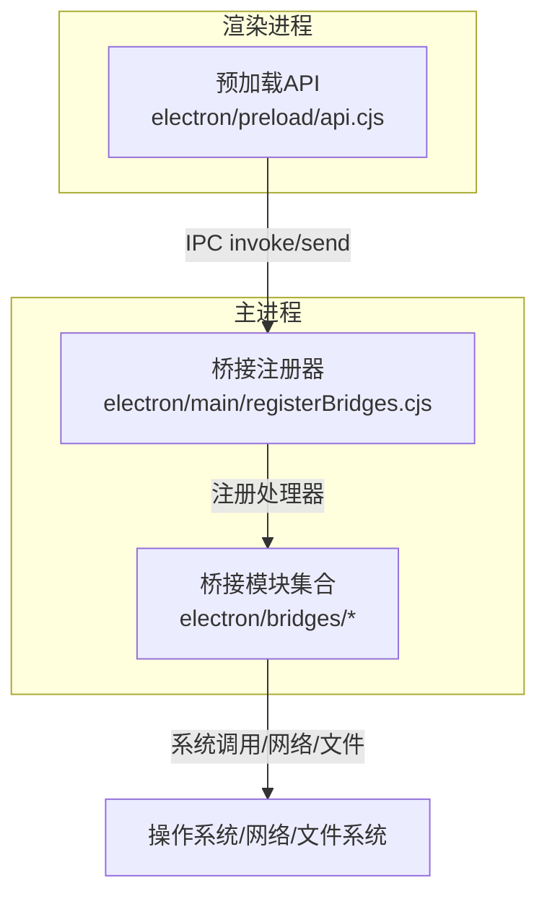
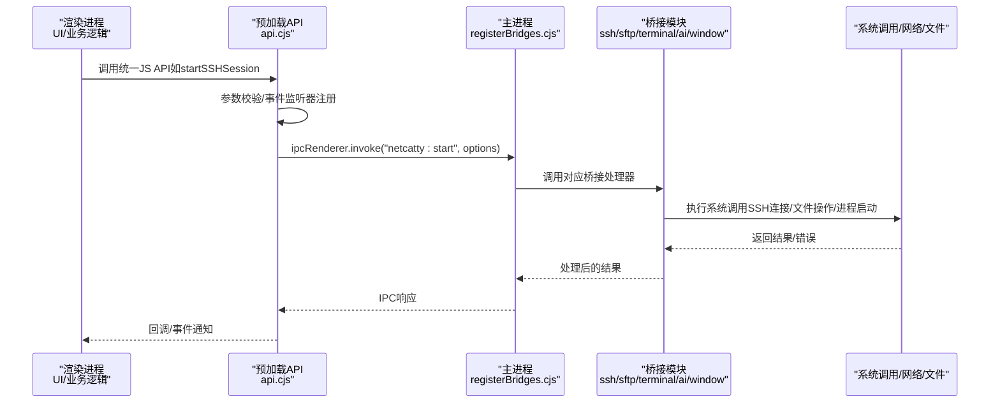
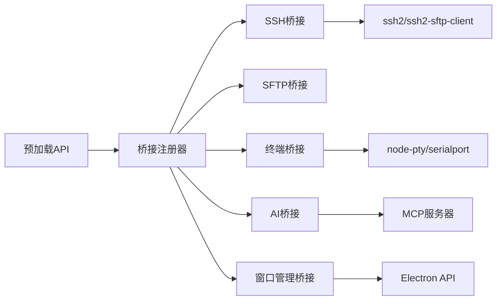

# IPC桥接层

<cite>
**本文档引用的文件**
- [api.cjs](file://electron/preload/api.cjs)
- [registerBridges.cjs](file://electron/main/registerBridges.cjs)
- [aiBridge.cjs](file://electron/bridges/aiBridge.cjs)
- [sshBridge.cjs](file://electron/bridges/sshBridge.cjs)
- [sftpBridge.cjs](file://electron/bridges/sftpBridge.cjs)
- [terminalBridge.cjs](file://electron/bridges/terminalBridge.cjs)
- [windowManager.cjs](file://electron/bridges/windowManager.cjs)
- [ipcUtils.cjs](file://electron/bridges/ipcUtils.cjs)
</cite>

## 目录
1. [引言](#引言)
2. [项目结构](#项目结构)
3. [核心组件](#核心组件)
4. [架构总览](#架构总览)
5. [详细组件分析](#详细组件分析)
6. [依赖关系分析](#依赖关系分析)
7. [性能考虑](#性能考虑)
8. [故障排除指南](#故障排除指南)
9. [结论](#结论)

## 引言
本文件深入解析Netcatty项目的IPC桥接层设计与实现原理，涵盖AI桥接、SSH桥接、SFTP桥接、终端桥接、窗口管理桥接等模块。重点阐述桥接层如何封装底层系统调用，提供统一的JavaScript API接口；如何通过预加载脚本（preload）暴露安全可控的API给渲染进程；以及主进程如何注册并分发各类桥接处理器。文档还提供了调用流程图、错误处理与超时控制机制、并发处理策略、桥接注册机制与模块化设计等内容。

## 项目结构
IPC桥接层位于electron目录下，采用“按功能域划分”的模块化组织方式：
- 预加载API：在渲染进程侧提供统一的JS API入口，负责参数校验、事件监听器注册、回调管理等。
- 主进程桥接注册：集中初始化各桥接模块并注册IPC处理器。
- 桥接模块：每个功能域独立实现（如AI、SSH、SFTP、终端、窗口管理），内部封装具体协议与系统调用。
- 公共工具：IPC安全发送、会话管理、桥接依赖注入等。

图表来源
- [api.cjs](file://electron/preload/api.cjs)
- [registerBridges.cjs](file://electron/main/registerBridges.cjs)

章节来源
- [api.cjs](file://electron/preload/api.cjs)
- [registerBridges.cjs](file://electron/main/registerBridges.cjs)

## 核心组件
- 预加载API（preload）
  - 提供统一的JS API，覆盖SSH/Telnet/Mosh/本地会话、串口、SFTP、本地文件系统、窗口控制、云同步、认证、传输、端口转发、剪贴板、自动更新、AI桥接等。
  - 管理事件监听器（数据流、退出、键盘交互、主机密钥验证、口令请求、ZMODEM事件等）。
  - 支持进度回调与取消操作（如SFTP上传、压缩上传、传输任务）。
- 主进程桥接注册器
  - 初始化各桥接模块（SSH、SFTP、终端、AI、云同步、文件监视、临时目录、会话日志、压缩上传、全局快捷键、凭证、自动更新、窗口管理、保险库备份等）。
  - 注册IPC处理器，建立渲染进程与系统调用之间的桥梁。
  - 维护共享依赖（会话表、SFTP客户端池、electron模块等）。
- 桥接模块
  - SSH桥接：支持跳点链路、代理、算法协商、密钥/密码/键盘交互认证、X11转发、ZMODEM、会话日志等。
  - SFTP桥接：会话级SFTP通道管理、编码检测与转换、断线重连恢复、批量删除、权限修改、POSIX重命名等。
  - 终端桥接：本地Shell、Telnet、Mosh、串口会话；输出缓冲、编码转换、NAWS调整、ZMODEM、会话日志。
  - AI桥接：LLM API代理（避免CORS）、外部Agent工具执行、MCP服务器集成、会话上下文提示构建、流式请求与取消。
  - 窗口管理桥接：主窗口、设置窗口创建与焦点管理、主题/语言切换、窗口状态持久化、OAuth加载遮罩等。

章节来源
- [api.cjs](file://electron/preload/api.cjs)
- [registerBridges.cjs](file://electron/main/registerBridges.cjs)
- [sshBridge.cjs](file://electron/bridges/sshBridge.cjs)
- [sftpBridge.cjs](file://electron/bridges/sftpBridge.cjs)
- [terminalBridge.cjs](file://electron/bridges/terminalBridge.cjs)
- [aiBridge.cjs](file://electron/bridges/aiBridge.cjs)
- [windowManager.cjs](file://electron/bridges/windowManager.cjs)

## 架构总览
IPC桥接层遵循“预加载API → 主进程桥接注册器 → 桥接模块 → 底层系统调用”的分层设计。预加载API负责参数标准化与事件管理；主进程桥接注册器负责模块初始化与处理器注册；桥接模块负责协议实现与系统调用封装；底层系统调用包括ssh2、ssh2-sftp-client、node-pty、serialport、原生网络套接字等。

图表来源
- [api.cjs](file://electron/preload/api.cjs)
- [registerBridges.cjs](file://electron/main/registerBridges.cjs)
- [sshBridge.cjs](file://electron/bridges/sshBridge.cjs)
- [sftpBridge.cjs](file://electron/bridges/sftpBridge.cjs)
- [terminalBridge.cjs](file://electron/bridges/terminalBridge.cjs)
- [aiBridge.cjs](file://electron/bridges/aiBridge.cjs)
- [windowManager.cjs](file://electron/bridges/windowManager.cjs)

## 详细组件分析

### 预加载API（渲染进程）
- 功能概览
  - 会话管理：启动/写入/调整大小/暂停/关闭会话；支持SSH/Telnet/Mosh/本地/串口。
  - 文件系统：本地与SFTP文件读写、目录列表、权限变更、路径操作。
  - 传输与压缩：实时进度回调、取消、同机复制、压缩上传。
  - 认证与授权：SSH密钥生成、SSH Agent检查、默认密钥获取、键盘交互认证、主机密钥验证、口令请求。
  - 云同步：WebDAV/S3网络操作代理。
  - 系统与应用：打开外部链接/路径、应用信息、剪贴板、自动更新、托盘菜单、崩溃日志、临时目录管理。
  - 窗口控制：最小化/最大化/关闭/聚焦/全屏状态查询、主题/背景色/语言设置。
  - AI桥接：提供统一的AI聊天流、HTTP代理、外部Agent执行、工具CLI集成等。
- 设计要点
  - 使用ipcRenderer.invoke/send进行双向通信，返回Promise或直接发送消息。
  - 对事件监听器使用WeakMap/Set进行注册与去重，支持解绑。
  - 对SFTP上传/下载/压缩等长耗时操作提供进度回调与取消能力。
  - 对SSH会话编码设置进行降级处理（优先SSH，否则走终端编码设置）。

章节来源
- [api.cjs](file://electron/preload/api.cjs)

### 主进程桥接注册器
- 功能概览
  - 初始化各桥接模块并注入共享依赖（会话表、SFTP客户端池、electron模块、CLI发现路径等）。
  - 注册所有IPC处理器，覆盖SSH、SFTP、本地文件系统、传输、端口转发、终端、OAuth、GitHub/Google/OneDrive认证、云同步、文件监视、临时目录、会话日志、压缩上传、全局快捷键、凭证、自动更新、AI、崩溃日志、保险库备份等。
  - 提供特定场景处理器（如ZMODEM取消、Fig自动补全规范加载、本地目录列举、设置窗口打开、外部链接打开、应用信息、PTY子进程查询、确认关闭忙碌进程对话框、剪贴板回退、选择应用、打开文件、保存对话框、选择文件/目录、SFTP下载到临时文件、删除临时文件、临时目录清理、会话日志导出/选择目录/自动保存/打开目录、崩溃日志列表/读取/清理/打开目录、全局热键注册/注销/状态查询、托盘菜单数据更新/事件转发、托盘面板窗口控制、拖拽文件路径解析、剪贴板文本读取、凭证加密/解密、自动更新状态查询/设置/事件监听等）。
- 设计要点
  - 采用惰性初始化与依赖注入，确保模块间解耦。
  - 对桥接模块进行统一注册，避免重复注册与资源泄漏。
  - 对敏感操作（如外部链接打开、应用选择、文件打开）进行平台适配与错误处理。

章节来源
- [registerBridges.cjs](file://electron/main/registerBridges.cjs)

### SSH桥接
- 功能概览
  - 会话启动：支持单跳与多跳跳点链路，代理支持，算法协商（兼容旧算法、跳过ECDSA主机密钥、算法覆盖），键盘交互认证（2FA/MFA），主机密钥验证，SSH Agent（含证书模式），默认密钥回退，X11转发，ZMODEM，会话日志，TCP/SSH NO_DELAY优化。
  - 命令执行：基于会话的命令执行API，支持算法与认证配置。
  - 密钥生成：RSA/ECDSA/ED25519类型与位数选择。
  - 认证缓存：按主机缓存成功认证方法，失败清除以重试。
  - 编码与解码：按会话维护iconv解码器，支持UTF-8与GB18030等。
- 设计要点
  - 将ssh2与NetcattyAgent组合，统一认证与会话生命周期管理。
  - 对链路中的每跳进行keepalive与算法配置，避免握手失败。
  - 对加密密钥进行口令请求与取消处理，防止阻塞。
  - 对调试与算法配置进行日志记录与可视化。

章节来源
- [sshBridge.cjs](file://electron/bridges/sshBridge.cjs)

### SFTP桥接
- 功能概览
  - 会话级SFTP通道管理：为SSH会话创建SFTP客户端，支持通道复用与恢复。
  - 编码检测与转换：根据远端文件名判断编码（UTF-8/Gb18030），自动转换路径与名称。
  - 文件操作：读写、统计、重命名（POSIX扩展优先，回退至普通重命名，必要时使用备份路径）、删除（递归/非递归）、权限修改、真实路径解析。
  - 上传/下载：支持流式管道传输、分块写入、中止信号、临时文件与备份策略。
  - 跳点链路：在链路中保持SFTP通道可用，避免sudo降权导致通道不可用。
- 设计要点
  - 通过ssh2内部SFTP包装器实现sudo支持，避免降权后通道失效。
  - 对通道打开进行超时与中止控制，避免长时间阻塞。
  - 对路径规范化与Windows/Unix差异进行兼容处理。

章节来源
- [sftpBridge.cjs](file://electron/bridges/sftpBridge.cjs)

### 终端桥接
- 功能概览
  - 本地Shell：基于node-pty，支持登录Shell参数、环境变量、工作目录、UTF-8本地化默认值、会话日志。
  - Telnet：原生net模块实现，支持自动登录、Telnet协议扩展（NAWS）、编码转换、ZMODEM。
  - Mosh：内置mosh-client二进制解析与运行时环境配置，握手与会话切换，NO_DELAY优化。
  - 串口：基于serialport，支持波特率、数据位、停止位、奇偶校验、流控、编码转换、ZMODEM。
  - 通用操作：写入、暂停/恢复背压、窗口大小调整、关闭会话、进程树跟踪。
- 设计要点
  - 对Windows本地PTY进行特殊处理（编码null不可用），仅在支持平台启用原始字节ZMODEM。
  - 对Telnet进行IAC转义，避免粘贴二进制内容破坏协议。
  - 对会话日志进行令牌化管理，避免重启后交叉影响。

章节来源
- [terminalBridge.cjs](file://electron/bridges/terminalBridge.cjs)

### AI桥接
- 功能概览
  - LLM API代理：通过主进程发起HTTP请求，避免CORS限制，支持TLS跳过、超时、错误透传、流式SSE事件转发。
  - 外部Agent执行：外部CLI工具与Agent进程管理，最大并发限制，进程树清理。
  - MCP服务器集成：动态获取/创建MCP主机，Copilot配置合并，调试信息输出。
  - 工具集成：技能CLI（SKILL.md）与MCP双模式，按请求动态切换。
  - 会话上下文：构建用户技能上下文与提示词，支持默认目标会话与聊天会话作用域。
  - 安全存储：API密钥加密存储与解密，提供占位符替换。
- 设计要点
  - 使用AbortController与超时控制，支持请求取消与内存保护（最大缓冲10MB）。
  - 对外部进程进行进程树追踪与清理，避免孤儿进程。
  - 对MCP服务器进行配置合并与调试输出，便于问题定位。

章节来源
- [aiBridge.cjs](file://electron/bridges/aiBridge.cjs)

### 窗口管理桥接
- 功能概览
  - 主窗口与设置窗口：创建、显示、焦点恢复、Bounds状态持久化、最小/最大/关闭/全屏查询、主题/背景色/语言设置广播。
  - OAuth加载遮罩：在OAuth回调页面加载期间注入遮罩样式与动画。
  - 渲染就绪机制：延迟显示窗口，等待渲染进程就绪信号或超时。
  - 外部窗口：浏览器回退打开、外部窗口管理。
- 设计要点
  - 使用WebContents ID映射与健康检查，避免向已销毁的渲染进程发送消息。
  - 对窗口状态进行队列化写入，避免频繁IO与竞态。

章节来源
- [windowManager.cjs](file://electron/bridges/windowManager.cjs)

## 依赖关系分析
- 模块耦合
  - 预加载API与主进程桥接注册器通过IPC通道耦合，桥接模块对预加载API无直接依赖，仅通过IPC交互。
  - 各桥接模块之间低耦合，通过共享依赖（会话表、SFTP客户端池、electron模块）进行协作。
- 外部依赖
  - SSH：ssh2、ssh2-sftp-client、NetcattyAgent。
  - 终端：node-pty、serialport、mosh-client。
  - 文件系统：fs、path、stream/pipeline。
  - 网络：http/https、net、URL。
  - UI：Electron BrowserWindow/webContents、nativeTheme、shell、clipboard、dialog等。
- 循环依赖
  - 通过函数式依赖注入避免循环依赖，桥接模块在init阶段接收依赖，不相互require。

图表来源
- [registerBridges.cjs](file://electron/main/registerBridges.cjs)
- [sshBridge.cjs](file://electron/bridges/sshBridge.cjs)
- [sftpBridge.cjs](file://electron/bridges/sftpBridge.cjs)
- [terminalBridge.cjs](file://electron/bridges/terminalBridge.cjs)
- [aiBridge.cjs](file://electron/bridges/aiBridge.cjs)
- [windowManager.cjs](file://electron/bridges/windowManager.cjs)

## 性能考虑
- 并发与背压
  - 终端桥接对输出源进行pause/resume背压控制，避免渲染进程拥塞。
  - SFTP上传/下载使用流式管道与分块写入，减少内存占用。
- 超时与取消
  - AI桥接HTTP请求设置2分钟超时，支持AbortController取消。
  - SFTP通道打开设置超时与中止信号，避免长时间阻塞。
- 缓存与复用
  - SSH认证方法缓存，避免重复认证尝试。
  - SFTP通道复用与恢复，减少握手开销。
- 编码与转换
  - 按会话维护iconv解码器，避免重复初始化。
  - 自动检测远端文件名编码，减少字符集错误。

## 故障排除指南
- SSH连接失败
  - 检查认证方法缓存是否命中，必要时清除缓存重试。
  - 确认跳点链路算法配置与代理设置正确。
  - 查看调试日志（可启用SSH调试）定位握手/密钥/键盘交互问题。
- SFTP操作异常
  - 确认SFTP通道可用性，sudo会话需保持专用通道。
  - 检查编码检测与转换，必要时强制指定编码。
  - 使用POSIX重命名或备份路径回退策略。
- 终端会话卡顿
  - 启用背压控制，降低渲染端写入压力。
  - 检查编码设置与NAWS调整，避免字符集与窗口尺寸问题。
- AI流式请求中断
  - 检查网络与TLS配置，必要时允许跳过TLS验证。
  - 监控缓冲区大小（最大10MB），避免过大响应导致内存压力。
- 窗口显示问题
  - 等待渲染就绪信号或超时，避免空白屏。
  - 检查窗口状态持久化文件完整性。

章节来源
- [sshBridge.cjs](file://electron/bridges/sshBridge.cjs)
- [sftpBridge.cjs](file://electron/bridges/sftpBridge.cjs)
- [terminalBridge.cjs](file://electron/bridges/terminalBridge.cjs)
- [aiBridge.cjs](file://electron/bridges/aiBridge.cjs)
- [windowManager.cjs](file://electron/bridges/windowManager.cjs)

## 结论
IPC桥接层通过“预加载API + 主进程注册器 + 模块化桥接”的设计，实现了对底层系统调用的安全封装与统一抽象。各桥接模块职责清晰、耦合度低，既满足了复杂网络协议（SSH/SFTP/Telnet/Mosh/串口）与AI工具链的需求，又保证了渲染进程的易用性与安全性。通过事件监听器管理、进度回调与取消、超时与背压控制、编码与路径兼容等机制，系统在功能与性能之间取得了良好平衡。未来可在以下方面持续优化：进一步细化错误分类与上报、增强桥接模块的可观测性与调试能力、完善桥接注册的插件化扩展机制。