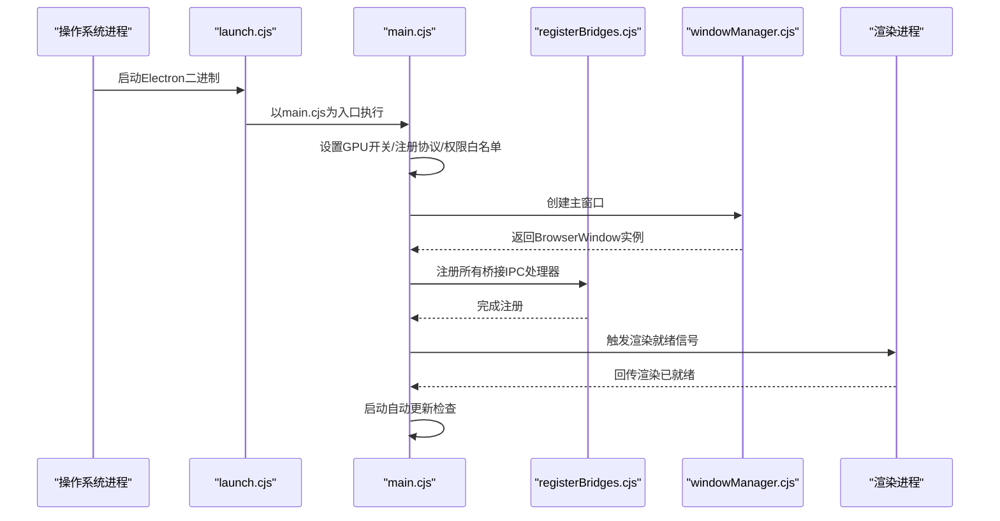
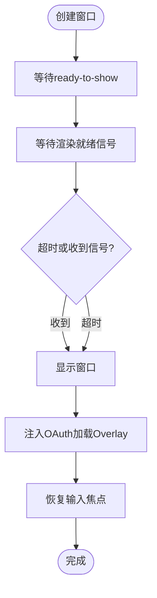
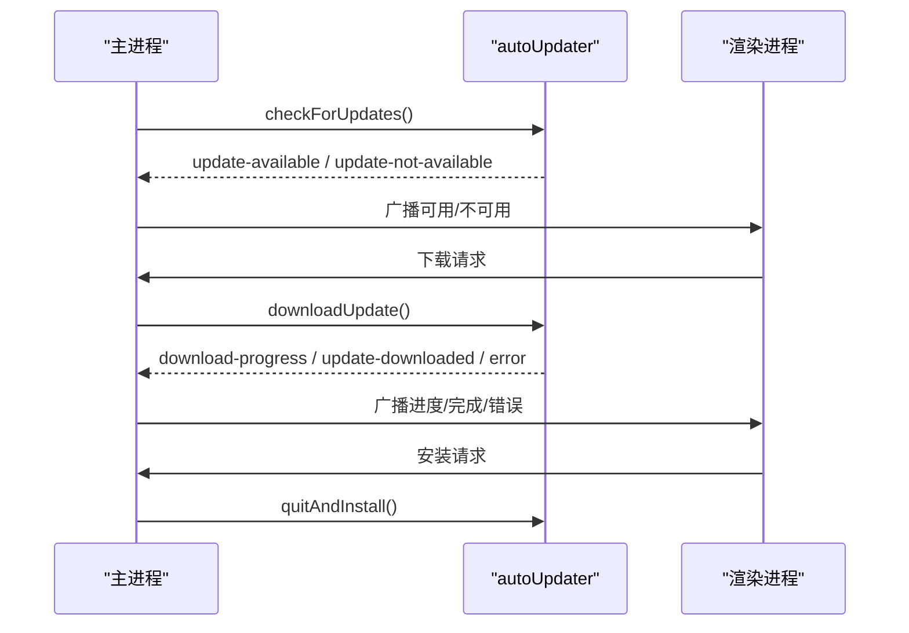

# 主进程架构

<cite>
**本文档引用的文件**
- [main.cjs](file://electron/main.cjs)
- [registerBridges.cjs](file://electron/main/registerBridges.cjs)
- [preload.cjs](file://electron/preload.cjs)
- [preload/api.cjs](file://electron/preload/api.cjs)
- [windowManager.cjs](file://electron/bridges/windowManager.cjs)
- [autoUpdateBridge.cjs](file://electron/bridges/autoUpdateBridge.cjs)
- [sshBridge.cjs](file://electron/bridges/sshBridge.cjs)
- [sftpBridge.cjs](file://electron/bridges/sftpBridge.cjs)
- [terminalBridge.cjs](file://electron/bridges/terminalBridge.cjs)
- [launch.cjs](file://electron/launch.cjs)
</cite>

## 目录
1. [引言](#引言)
2. [项目结构](#项目结构)
3. [核心组件](#核心组件)
4. [架构总览](#架构总览)
5. [详细组件分析](#详细组件分析)
6. [依赖关系分析](#依赖关系分析)
7. [性能考虑](#性能考虑)
8. [故障排查指南](#故障排查指南)
9. [结论](#结论)

## 引言
本文件系统性解析该 Electron 应用的主进程（Main Process）架构与实现，覆盖以下主题：
- 主进程职责边界：窗口管理、菜单系统、系统托盘、自动更新、协议注册、权限控制、GPU 加速配置等
- 主进程与渲染进程（Renderer）的通信机制：IPC 消息处理、事件分发、桥接模块组织
- 应用启动流程图：从进程启动到窗口显示的完整路径
- 错误处理与异常恢复：全局错误捕获、窗口生命周期保护、退出守卫
- 关键功能实现细节：GPU 加速开关、自定义协议 app:// 注册、权限白名单策略

## 项目结构
主进程代码采用“模块化桥接 + 窗口管理”的分层设计：
- 入口文件负责环境准备、协议注册、GPU 开关、权限白名单、窗口创建与生命周期管理
- registerBridges 负责集中注册各类业务桥接（SSH/SFTP/Terminal/CloudSync/更新等）的 IPC 处理器
- 各桥接模块封装具体能力（如 SSH 连接、SFTP 文件操作、本地终端会话、Mosh/Telnet/串口）
- preload 层通过 contextBridge 暴露受控 API，并在渲染侧进行事件订阅与回调分发

```mermaid
graph TB
subgraph "主进程入口"
MAIN["main.cjs<br/>应用入口与生命周期"]
REG["registerBridges.cjs<br/>集中注册IPC处理器"]
end
subgraph "桥接模块"
WM["windowManager.cjs<br/>窗口管理"]
AU["autoUpdateBridge.cjs<br/>自动更新"]
SSH["sshBridge.cjs<br/>SSH连接与会话"]
SFTP["sftpBridge.cjs<br/>SFTP文件操作"]
TERM["terminalBridge.cjs<br/>本地/远程终端"]
end
subgraph "渲染进程"
PRELOAD["preload.cjs<br/>上下文桥接与事件分发"]
API["preload/api.cjs<br/>对外暴露的API"]
end
MAIN --> REG
REG --> WM
REG --> AU
REG --> SSH
REG --> SFTP
REG --> TERM
PRELOAD --> API
PRELOAD <- --> WM
PRELOAD <- --> AU
PRELOAD <- --> SSH
PRELOAD <- --> SFTP
PRELOAD <- --> TERM
```

**图表来源**
- [main.cjs:1-879](file://electron/main.cjs#L1-L879)
- [registerBridges.cjs:1-678](file://electron/main/registerBridges.cjs#L1-L678)
- [windowManager.cjs:1-951](file://electron/bridges/windowManager.cjs#L1-L951)
- [autoUpdateBridge.cjs:1-415](file://electron/bridges/autoUpdateBridge.cjs#L1-L415)
- [sshBridge.cjs:1-960](file://electron/bridges/sshBridge.cjs#L1-L960)
- [sftpBridge.cjs:1-970](file://electron/bridges/sftpBridge.cjs#L1-L970)
- [terminalBridge.cjs:1-967](file://electron/bridges/terminalBridge.cjs#L1-L967)
- [preload.cjs:1-708](file://electron/preload.cjs#L1-L708)
- [preload/api.cjs:1-928](file://electron/preload/api.cjs#L1-L928)

**章节来源**
- [main.cjs:1-879](file://electron/main.cjs#L1-L879)
- [registerBridges.cjs:1-678](file://electron/main/registerBridges.cjs#L1-L678)

## 核心组件
- 应用入口与生命周期：单实例锁、协议注册、GPU 开关、权限白名单、菜单构建、窗口创建与关闭、退出守卫
- 窗口管理：窗口状态持久化、延迟显示、渲染就绪信号、OAuth 加载 Overlay、多窗口焦点与图标设置
- 自动更新：平台支持检测、检查/下载/安装流程、状态广播、偏好持久化
- 会话与传输：SSH/SFTP/Terminal/串口/远程转发等桥接模块，统一通过 registerBridges 注册 IPC
- 预加载层：安全暴露 API、事件订阅、跨窗口同步、崩溃日志与会话日志管理

**章节来源**
- [main.cjs:1-879](file://electron/main.cjs#L1-L879)
- [windowManager.cjs:1-951](file://electron/bridges/windowManager.cjs#L1-L951)
- [autoUpdateBridge.cjs:1-415](file://electron/bridges/autoUpdateBridge.cjs#L1-L415)
- [registerBridges.cjs:1-678](file://electron/main/registerBridges.cjs#L1-L678)

## 架构总览
主进程以“入口 + 桥接注册 + 模块化桥接”的方式组织，确保职责清晰、扩展性强。



**图表来源**
- [launch.cjs:1-18](file://electron/launch.cjs#L1-L18)
- [main.cjs:1-879](file://electron/main.cjs#L1-L879)
- [registerBridges.cjs:1-678](file://electron/main/registerBridges.cjs#L1-L678)
- [windowManager.cjs:1-951](file://electron/bridges/windowManager.cjs#L1-L951)

## 详细组件分析

### 窗口管理（windowManager）
职责范围
- 窗口创建与状态持久化（位置、尺寸、最大化/全屏）
- 延迟显示与渲染就绪信号（避免空白屏）
- OAuth 登录时注入加载 Overlay
- 多窗口焦点与图标设置、语言切换广播
- 退出守卫与窗口关闭策略

关键实现要点
- 窗口状态文件保存与加载，队列化写入避免竞争
- “ready-to-show” + 渲染就绪信号双保险，超时兜底
- OAuth 弹窗注入样式与脚本，动态移除
- 语言变更时向主/设置窗口广播事件



**图表来源**
- [windowManager.cjs:410-473](file://electron/bridges/windowManager.cjs#L410-L473)
- [windowManager.cjs:328-408](file://electron/bridges/windowManager.cjs#L328-L408)

**章节来源**
- [windowManager.cjs:1-951](file://electron/bridges/windowManager.cjs#L1-L951)

### 自动更新（autoUpdateBridge）
职责范围
- 平台支持检测（macOS/Windows/AppImage 支持；Linux deb/rpm/snap 不支持）
- 手动/自动检查、下载、安装流程
- 状态广播至所有窗口、偏好持久化
- 防并发检查与下载冲突

关键实现要点
- 使用 electron-updater，禁用默认日志输出，自行记录
- 全局监听器在后台推进状态，渲染侧可即时获取
- 自动检查定时器可取消/重调度，避免竞态
- 安装前清理托盘相关资源，确保退出安装流程



**图表来源**
- [autoUpdateBridge.cjs:105-168](file://electron/bridges/autoUpdateBridge.cjs#L105-L168)
- [autoUpdateBridge.cjs:255-412](file://electron/bridges/autoUpdateBridge.cjs#L255-L412)

**章节来源**
- [autoUpdateBridge.cjs:1-415](file://electron/bridges/autoUpdateBridge.cjs#L1-L415)

### SSH 桥接（sshBridge）
职责范围
- SSH 连接建立、认证（密码/公钥/键盘交互）、代理/跳板机链路
- 会话数据流缓冲、编码解码、ZMODEM 文件传输、会话日志
- 默认密钥发现与加密密钥处理、算法协商与兼容性

关键实现要点
- 认证方法缓存与回退策略，避免重复尝试失败方法
- 跳板机链路逐跳连接、握手、转发与清理
- 会话级编码解码器复用，减少开销
- 与预加载层事件联动（数据、退出、键盘交互、主机密钥验证、口令请求）

**章节来源**
- [sshBridge.cjs:1-960](file://electron/bridges/sshBridge.cjs#L1-L960)

### SFTP 桥接（sftpBridge）
职责范围
- SFTP 通道打开与恢复、路径规范化、递归目录创建/删除
- 文件读写、重命名（含备份）、权限修改、统计信息
- 编码检测与转换（UTF-8/GB18030），路径编码适配

关键实现要点
- 通道复用与“幽灵通道”恢复策略
- 递归删除与权限兼容处理
- 编码状态按会话维护，避免误判

**章节来源**
- [sftpBridge.cjs:1-970](file://electron/bridges/sftpBridge.cjs#L1-L970)

### 终端桥接（terminalBridge）
职责范围
- 本地 Shell、Telnet、Mosh、串口会话的统一抽象
- PTY/Socket/串口的数据收发、流量控制、窗口大小调整
- 编码归一化、Telnet 协议转义、ZMODEM 文件传输

关键实现要点
- 跨平台可执行解析（POSIX 额外路径、Windows where.exe/常见路径）
- Telnet 协议 IAC 转义与 NAWS 更新
- 串口会话与 PTY 会话一致的事件模型

**章节来源**
- [terminalBridge.cjs:1-967](file://electron/bridges/terminalBridge.cjs#L1-L967)

### 预加载层（preload）
职责范围
- 通过 contextBridge 安全暴露 API 至渲染进程
- 事件订阅与回调分发（会话数据、退出、键盘交互、主机密钥验证、口令请求、更新事件等）
- 跨窗口设置同步、渲染就绪上报、崩溃日志与会话日志访问

关键实现要点
- 受信来源校验，仅允许 app://netcatty 与开发服务器 origin
- 事件监听集合按会话维度管理，避免泄漏
- 将 IPC 调用封装为易用 API，屏蔽底层细节

**章节来源**
- [preload.cjs:1-708](file://electron/preload.cjs#L1-L708)
- [preload/api.cjs:1-928](file://electron/preload/api.cjs#L1-L928)

## 依赖关系分析
主进程模块间依赖关系如下：

```mermaid
graph LR
MAIN["main.cjs"] --> REG["registerBridges.cjs"]
REG --> WM["windowManager.cjs"]
REG --> AU["autoUpdateBridge.cjs"]
REG --> SSH["sshBridge.cjs"]
REG --> SFTP["sftpBridge.cjs"]
REG --> TERM["terminalBridge.cjs"]
PRELOAD["preload.cjs"] --> API["preload/api.cjs"]
PRELOAD <- --> WM
PRELOAD <- --> AU
PRELOAD <- --> SSH
PRELOAD <- --> SFTP
PRELOAD <- --> TERM
```

**图表来源**
- [main.cjs:1-879](file://electron/main.cjs#L1-L879)
- [registerBridges.cjs:1-678](file://electron/main/registerBridges.cjs#L1-L678)
- [windowManager.cjs:1-951](file://electron/bridges/windowManager.cjs#L1-L951)
- [autoUpdateBridge.cjs:1-415](file://electron/bridges/autoUpdateBridge.cjs#L1-L415)
- [sshBridge.cjs:1-960](file://electron/bridges/sshBridge.cjs#L1-L960)
- [sftpBridge.cjs:1-970](file://electron/bridges/sftpBridge.cjs#L1-L970)
- [terminalBridge.cjs:1-967](file://electron/bridges/terminalBridge.cjs#L1-L967)
- [preload.cjs:1-708](file://electron/preload.cjs#L1-L708)
- [preload/api.cjs:1-928](file://electron/preload/api.cjs#L1-L928)

**章节来源**
- [main.cjs:1-879](file://electron/main.cjs#L1-L879)
- [registerBridges.cjs:1-678](file://electron/main/registerBridges.cjs#L1-L678)

## 性能考虑
- GPU 加速与沙箱：默认启用硬件加速与零拷贝，可通过环境变量禁用沙箱用于调试
- 窗口延迟显示与渲染就绪：避免首屏空白，提升感知速度
- 通道复用与编码解码器缓存：降低频繁分配带来的 GC 压力
- 事件监听集合按会话维度管理：及时清理避免内存泄漏
- 自动更新下载状态广播：避免重复检查与下载，减少网络与 CPU 占用

[本节为通用指导，无需特定文件引用]

## 故障排查指南
- 协议注册失败：确认 app:// 方案已特权注册，否则无法提供静态资源服务
- 权限被拒：检查权限白名单是否仅对 app:// 或开发服务器 origin 生效
- 窗口空白或渲染未就绪：检查 ready-to-show 与渲染就绪信号是否触发，必要时延长超时
- 自动更新不生效：确认平台支持（macOS/Windows/AppImage），避免并发检查/下载
- SSH/SFTP 会话异常：查看认证缓存与加密密钥处理逻辑，必要时清除缓存重试
- 渲染崩溃：使用崩溃日志接口收集信息，结合会话日志定位问题

**章节来源**
- [main.cjs:67-82](file://electron/main.cjs#L67-L82)
- [main.cjs:528-597](file://electron/main.cjs#L528-L597)
- [windowManager.cjs:410-473](file://electron/bridges/windowManager.cjs#L410-L473)
- [autoUpdateBridge.cjs:53-63](file://electron/bridges/autoUpdateBridge.cjs#L53-L63)
- [sshBridge.cjs:1-960](file://electron/bridges/sshBridge.cjs#L1-L960)
- [sftpBridge.cjs:1-970](file://electron/bridges/sftpBridge.cjs#L1-L970)
- [preload.cjs:1-708](file://electron/preload.cjs#L1-L708)

## 结论
该主进程采用“入口 + 桥接注册 + 模块化桥接”的清晰架构，将复杂能力（SSH/SFTP/终端/更新/窗口管理）以独立模块实现并通过统一的 IPC 注册中心接入，既保证了职责分离，也便于扩展与维护。配合严格的权限白名单、GPU 加速与延迟显示策略，以及完善的错误处理与异常恢复机制，整体具备良好的稳定性与用户体验。