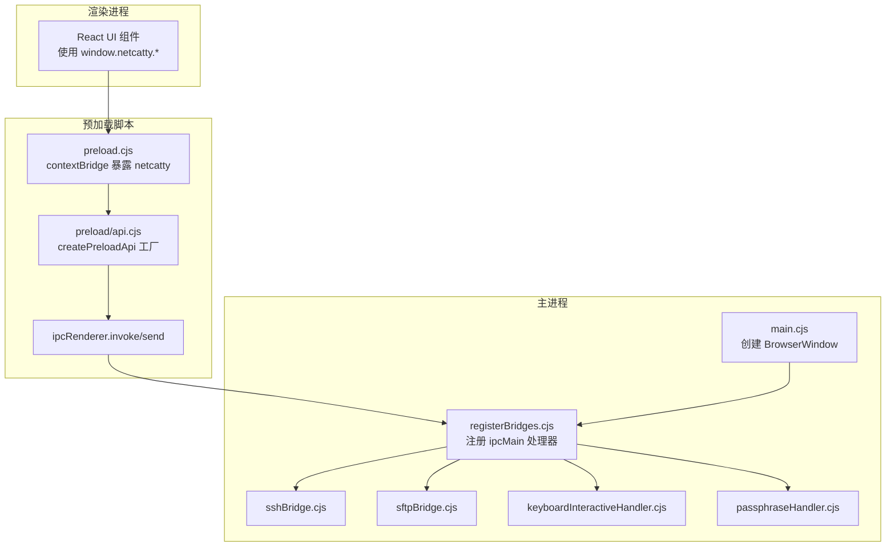
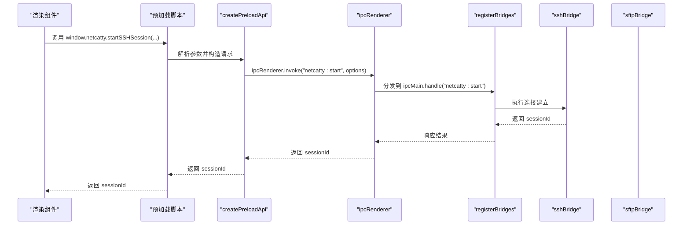
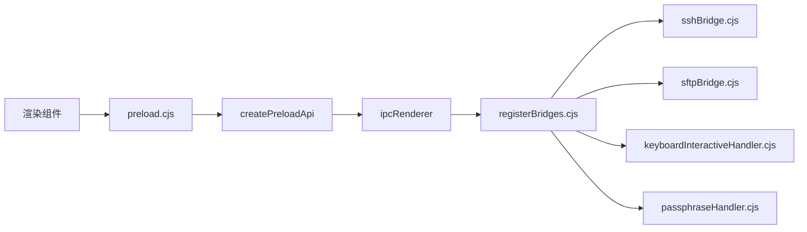

# 预加载脚本

<cite>
**本文引用的文件**
- [electron/preload.cjs](file://electron/preload.cjs)
- [electron/preload/api.cjs](file://electron/preload/api.cjs)
- [electron/main.cjs](file://electron/main.cjs)
- [electron/main/registerBridges.cjs](file://electron/main/registerBridges.cjs)
- [electron/bridges/sshBridge.cjs](file://electron/bridges/sshBridge.cjs)
- [electron/bridges/sftpBridge.cjs](file://electron/bridges/sftpBridge.cjs)
- [electron/bridges/keyboardInteractiveHandler.cjs](file://electron/bridges/keyboardInteractiveHandler.cjs)
- [electron/bridges/passphraseHandler.cjs](file://electron/bridges/passphraseHandler.cjs)
- [types/global/netcatty-bridge-app.d.ts](file://types/global/netcatty-bridge-app.d.ts)
- [types/global/netcatty-bridge-session.d.ts](file://types/global/netcatty-bridge-session.d.ts)
- [types/global/netcatty-bridge-files.d.ts](file://types/global/netcatty-bridge-files.d.ts)
</cite>

## 目录
1. [简介](#简介)
2. [项目结构](#项目结构)
3. [核心组件](#核心组件)
4. [架构总览](#架构总览)
5. [详细组件分析](#详细组件分析)
6. [依赖关系分析](#依赖关系分析)
7. [性能考量](#性能考量)
8. [故障排查指南](#故障排查指南)
9. [结论](#结论)
10. [附录](#附录)

## 简介
本文件系统性解析 Electron 预加载脚本的设计与实现，重点阐述其在安全沙箱中的职责边界、对渲染进程权限的限制策略、API 暴露原则、类型定义、错误处理与性能优化，并给出安全最佳实践与常见漏洞防护建议。预加载脚本通过 contextBridge 将受控的 API 暴露给渲染进程，同时利用 IPC 与主进程桥接，完成会话管理、SFTP 文件操作、传输进度回调、认证流程等能力。

## 项目结构
预加载脚本位于 electron/preload.cjs，其核心逻辑由 createPreloadApi 工厂函数生成的 API 对象组成；该对象通过 contextBridge.exposeInMainWorld 暴露到 window.netcatty。主进程在 electron/main.cjs 中注册各类桥接模块（如 sshBridge、sftpBridge 等），并通过 ipcMain.handle/ipcMain.on 提供 IPC 能力；预加载脚本使用 ipcRenderer.invoke/send 与之通信。

图示来源
- [electron/preload.cjs](file://electron/preload.cjs)
- [electron/preload/api.cjs](file://electron/preload/api.cjs)
- [electron/main.cjs](file://electron/main.cjs)
- [electron/main/registerBridges.cjs](file://electron/main/registerBridges.cjs)
- [electron/bridges/sshBridge.cjs](file://electron/bridges/sshBridge.cjs)
- [electron/bridges/sftpBridge.cjs](file://electron/bridges/sftpBridge.cjs)
- [electron/bridges/keyboardInteractiveHandler.cjs](file://electron/bridges/keyboardInteractiveHandler.cjs)
- [electron/bridges/passphraseHandler.cjs](file://electron/bridges/passphraseHandler.cjs)

章节来源
- [electron/preload.cjs](file://electron/preload.cjs)
- [electron/preload/api.cjs](file://electron/preload/api.cjs)
- [electron/main.cjs](file://electron/main.cjs)
- [electron/main/registerBridges.cjs](file://electron/main/registerBridges.cjs)

## 核心组件
- 预加载入口与上下文桥接：负责初始化监听器集合、过滤 PTY 数据、组装并暴露 API、校验渲染源信任度。
- API 工厂 createPreloadApi：封装所有对外暴露的方法，统一通过 ipcRenderer.invoke/send 与主进程交互。
- 主进程桥接注册：在 main.cjs 中通过 registerBridges.cjs 注册各功能桥接模块（SSH、SFTP、传输、端口转发、AI 等）。
- 安全校验：仅在可信源（app://netcatty 及开发服务器）时暴露 netcatty，避免跨源注入。

章节来源
- [electron/preload.cjs](file://electron/preload.cjs)
- [electron/preload/api.cjs](file://electron/preload/api.cjs)
- [electron/main/registerBridges.cjs](file://electron/main/registerBridges.cjs)

## 架构总览
预加载脚本以“最小暴露、可控调用”为原则，将渲染进程与主进程之间的交互抽象为一组稳定接口。渲染侧只通过 window.netcatty 访问受限能力，主进程集中处理敏感操作与状态变更。

图示来源
- [electron/preload.cjs](file://electron/preload.cjs)
- [electron/preload/api.cjs](file://electron/preload/api.cjs)
- [electron/main/registerBridges.cjs](file://electron/main/registerBridges.cjs)
- [electron/bridges/sshBridge.cjs](file://electron/bridges/sshBridge.cjs)

## 详细组件分析

### 预加载脚本设计与实现
- 上下文桥接与信任域校验
  - 使用 contextBridge.exposeInMainWorld 暴露 window.netcatty。
  - 通过 getAllowedRendererOrigins 与 isTrustedRendererLocation 判定当前页面来源是否可信（app 协议与开发服务器），仅在可信时才暴露桥接对象。
- 事件与监听器管理
  - 预加载脚本维护多组 Map/Set，用于存储会话数据回调、传输进度回调、认证事件回调等，确保按会话或传输维度精确分发。
  - 在会话退出或传输结束时清理对应监听器，避免内存泄漏。
- PTY 数据过滤与缓冲
  - 实现 MCP 标记行过滤与行缓冲，避免跨会话标记泄露与回显垃圾数据。
  - 使用定时器延迟刷新，保证不完整行在短暂停顿后仍能正确呈现。
- IPC 事件分发
  - 针对不同业务场景（会话数据、退出、ZMODEM、SFTP 进度、自动更新等）注册 ipcRenderer.on 监听器，统一分发至对应回调集合。

章节来源
- [electron/preload.cjs](file://electron/preload.cjs)

### API 工厂 createPreloadApi
- 会话与终端
  - 启动/关闭会话、写入数据、调整窗口大小、暂停流控、编码设置等。
  - 支持 SSH/Telnet/Mosh/本地/串口会话，统一返回 sessionId。
- SFTP 文件操作
  - 打开/关闭 SFTP、列出/读取/写入/删除/重命名/统计/修改权限等。
  - 支持二进制读写与带进度的上传取消。
- 传输与压缩
  - 流式传输、同主机目录复制、压缩打包上传、进度与错误回调。
- 文件系统与临时目录
  - 本地目录枚举、树形遍历、驱动器列表、系统信息、临时目录清理与打开。
- 设置与窗口控制
  - 主题/背景色/语言切换、窗口最小化/最大化/关闭/聚焦、全屏变化监听。
- 认证与交互
  - 键盘交互认证、主机密钥验证、加密密钥口令请求与超时/取消/失败通知。
- 云同步与网络
  - WebDAV/S3 接口代理、OAuth/GitHub/Google/OneDrive 登录流程代理。
- 应用与托盘
  - 自动更新检查/下载/安装、托盘菜单数据更新与动作转发、托盘面板窗口控制。
- AI 与 MCP/ACP
  - AI 聊天流式输出、工具集成、命令块/超时/迭代限制、用户技能上下文、审批门禁事件。
- 类型定义
  - 通过 TypeScript 全局声明文件提供 API 的类型约束，确保前端消费时具备良好类型提示与安全性。

章节来源
- [electron/preload/api.cjs](file://electron/preload/api.cjs)
- [types/global/netcatty-bridge-session.d.ts](file://types/global/netcatty-bridge-session.d.ts)
- [types/global/netcatty-bridge-files.d.ts](file://types/global/netcatty-bridge-files.d.ts)
- [types/global/netcatty-bridge-app.d.ts](file://types/global/netcatty-bridge-app.d.ts)

### 安全沙箱与权限限制
- 渲染源信任校验
  - 仅允许 app://netcatty 与开发服务器（根据环境变量推断）暴露桥接对象，防止恶意站点注入。
- 权限白名单
  - 主进程为默认会话设置权限检查与请求处理器，仅允许本地字体、剪贴板读写等必要权限，拒绝其他权限请求。
- IPC 严格路由
  - 所有敏感操作均通过 ipcMain.handle/ipcMain.on 注册，预加载脚本仅使用 ipcRenderer.invoke/send，避免直接暴露 Node/Electron API。
- 认证与交互隔离
  - 键盘交互认证与密钥口令请求通过独立处理器与 TTL 机制管理，防止长时间挂起与滥用。
- 加密与凭据
  - 凭据加密采用 safeStorage，密码持久化于用户数据目录，避免明文存储。

章节来源
- [electron/preload.cjs](file://electron/preload.cjs)
- [electron/main.cjs](file://electron/main.cjs)
- [electron/main/registerBridges.cjs](file://electron/main/registerBridges.cjs)
- [electron/bridges/keyboardInteractiveHandler.cjs](file://electron/bridges/keyboardInteractiveHandler.cjs)
- [electron/bridges/passphraseHandler.cjs](file://electron/bridges/passphraseHandler.cjs)

### IPC 通信桥接与错误处理
- 统一错误处理
  - 预加载脚本在回调执行处包裹 try/catch 并记录错误日志，避免异常冒泡影响渲染进程稳定性。
- 事件清理与资源回收
  - 会话退出、传输完成/取消时主动清理 Map/Set，防止监听器泄漏。
- 超时与取消
  - 键盘交互与口令请求设置 TTL，超时自动清理并回调取消；支持外部 AbortSignal 中断。
- 进度与状态
  - 传输/压缩/会话进度通过 Map 存储回调，按 transferId 或 sessionId 分发，确保 UI 与后台任务解耦。

章节来源
- [electron/preload.cjs](file://electron/preload.cjs)
- [electron/bridges/keyboardInteractiveHandler.cjs](file://electron/bridges/keyboardInteractiveHandler.cjs)
- [electron/bridges/passphraseHandler.cjs](file://electron/bridges/passphraseHandler.cjs)

### 性能优化
- 行缓冲与延迟刷新
  - PTY 数据分片到达时进行行级缓冲与延迟刷新，减少 UI 抖动与重复渲染。
- 回调集合管理
  - 使用 Map/Set 精确索引回调，避免全量遍历；及时清理无用回调。
- 最小暴露与按需注册
  - 仅在订阅时注册回调，避免一次性绑定过多监听器。
- 缓存与复用
  - 会话/传输标识复用，避免重复创建与销毁带来的开销。

章节来源
- [electron/preload.cjs](file://electron/preload.cjs)

## 依赖关系分析
预加载脚本与主进程桥接模块之间通过 IPC 交互，形成清晰的单向依赖链：渲染组件 → 预加载脚本 → API 工厂 → IPC → 主进程桥接 → 具体业务模块。

图示来源
- [electron/preload.cjs](file://electron/preload.cjs)
- [electron/preload/api.cjs](file://electron/preload/api.cjs)
- [electron/main/registerBridges.cjs](file://electron/main/registerBridges.cjs)
- [electron/bridges/sshBridge.cjs](file://electron/bridges/sshBridge.cjs)
- [electron/bridges/sftpBridge.cjs](file://electron/bridges/sftpBridge.cjs)
- [electron/bridges/keyboardInteractiveHandler.cjs](file://electron/bridges/keyboardInteractiveHandler.cjs)
- [electron/bridges/passphraseHandler.cjs](file://electron/bridges/passphraseHandler.cjs)

章节来源
- [electron/preload.cjs](file://electron/preload.cjs)
- [electron/preload/api.cjs](file://electron/preload/api.cjs)
- [electron/main/registerBridges.cjs](file://electron/main/registerBridges.cjs)

## 性能考量
- 渲染侧
  - 使用 Map/Set 管理回调，避免 O(n) 查找；在高频事件（如会话数据）中尽量减少闭包创建与深拷贝。
  - 合理拆分回调粒度，避免单个回调做过多工作。
- 预加载脚本
  - 行缓冲与延迟刷新降低 UI 更新频率；及时清理不再使用的监听器。
  - 将耗时计算（如编码检测）放在主进程或异步执行，避免阻塞主线程。
- 主进程
  - 桥接模块内部使用连接池与通道复用，避免频繁创建销毁带来的系统调用开销。

## 故障排查指南
- 无法暴露桥接对象
  - 检查渲染源是否为 app://netcatty 或开发服务器地址；确认环境变量 VITE_DEV_SERVER_URL 正确。
- 会话数据不显示或乱码
  - 关注 PTY 数据过滤逻辑与编码设置；确认会话编码配置与远端一致。
- 传输进度不更新
  - 确认 transferId 是否匹配；检查传输完成/取消后是否已清理监听器。
- 认证流程卡住
  - 检查键盘交互与口令请求的 TTL 与取消回调；确认 AbortSignal 是否被正确传递。
- 自动更新事件未触发
  - 确认 onXxx 回调是否在事件发生前注册；检查监听器集合是否被意外清空。

章节来源
- [electron/preload.cjs](file://electron/preload.cjs)
- [electron/bridges/keyboardInteractiveHandler.cjs](file://electron/bridges/keyboardInteractiveHandler.cjs)
- [electron/bridges/passphraseHandler.cjs](file://electron/bridges/passphraseHandler.cjs)

## 结论
该预加载脚本通过“最小暴露、可控调用”的设计，在 Electron 安全沙箱内为渲染进程提供了稳定且安全的能力边界。结合主进程严格的权限控制与桥接模块的职责分离，实现了从会话管理、文件操作到认证交互的全链路安全与可用性保障。遵循本文的安全最佳实践与排障建议，可进一步提升系统的健壮性与可维护性。

## 附录
- 安全最佳实践
  - 仅在可信源暴露桥接对象；避免在动态内容中拼接不受信任的脚本。
  - 对外暴露的 API 参数必须进行严格校验与白名单控制；对路径、命令等输入进行转义与长度限制。
  - 使用 AbortSignal 与 TTL 机制管理长时任务，防止僵尸请求占用资源。
  - 对敏感数据（凭据、密钥）使用 safeStorage，并避免在日志中输出明文。
- 常见安全漏洞与防护
  - XSS：严格限制 DOM 操作与 innerHTML 使用；对用户输入进行转义。
  - 代码注入：禁止 eval 与动态函数构造；对命令行参数进行安全拼接。
  - 权限滥用：严格限制权限申请与使用范围；避免授予不必要的权限。
  - 信息泄露：避免在错误消息中泄露内部路径、密钥或调试信息。