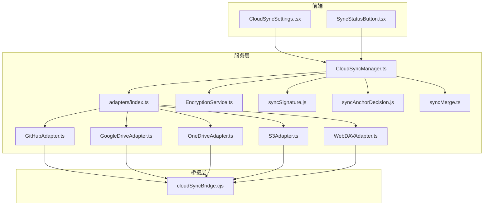
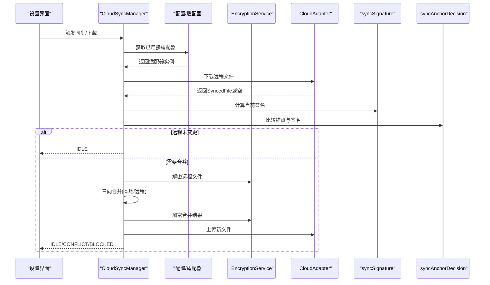
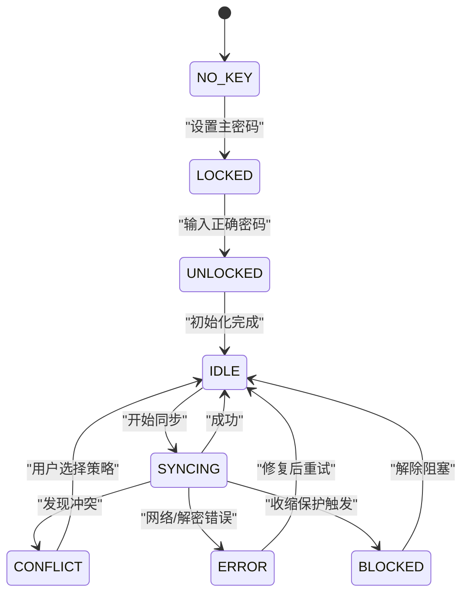
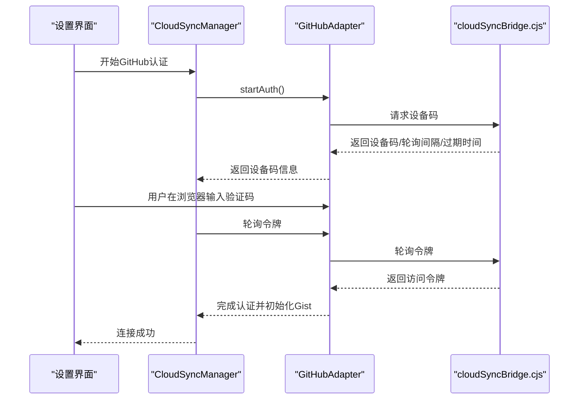
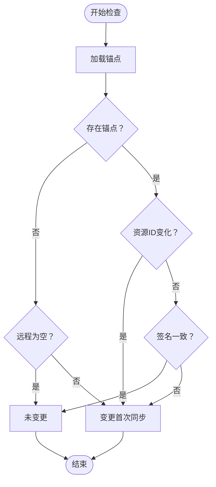
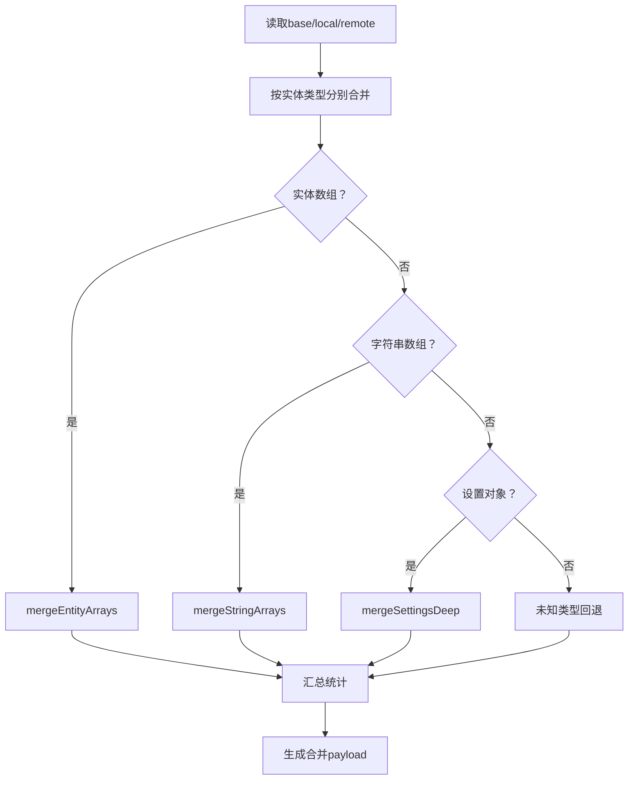
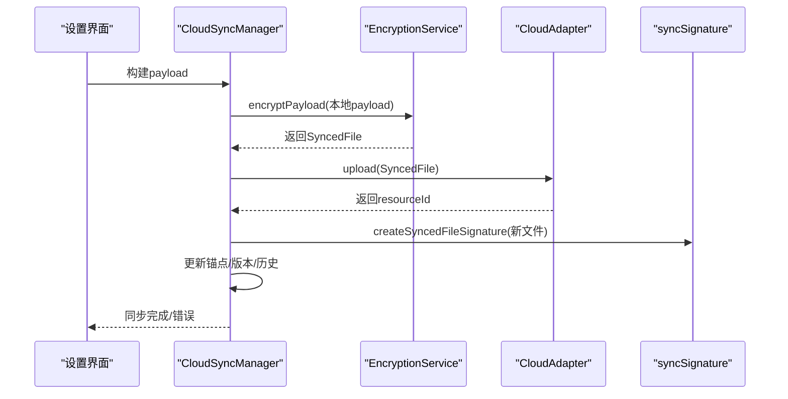
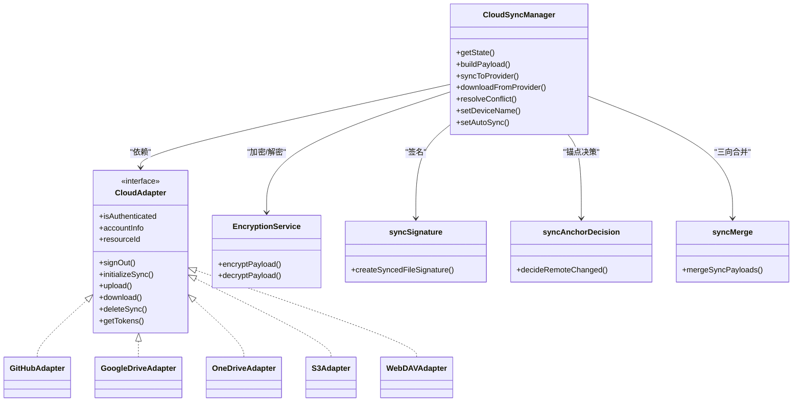
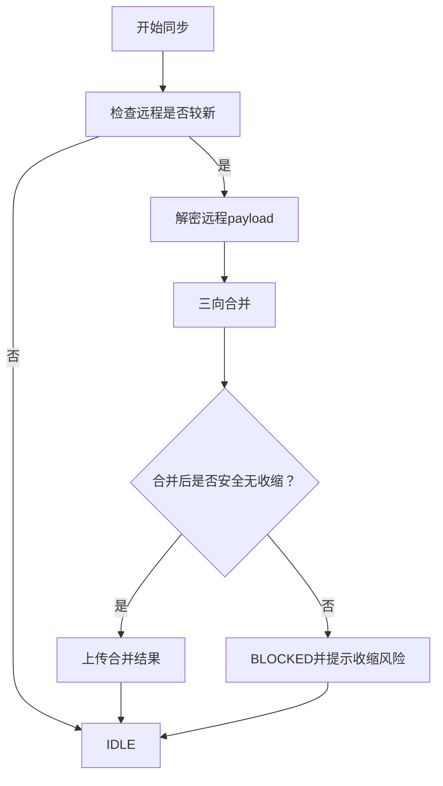

# 云同步服务

<cite>
**本文引用的文件**
- [CloudSyncManager.ts](file://infrastructure/services/CloudSyncManager.ts)
- [index.ts](file://infrastructure/services/adapters/index.ts)
- [GitHubAdapter.ts](file://infrastructure/services/adapters/GitHubAdapter.ts)
- [GoogleDriveAdapter.ts](file://infrastructure/services/adapters/GoogleDriveAdapter.ts)
- [OneDriveAdapter.ts](file://infrastructure/services/adapters/OneDriveAdapter.ts)
- [WebDAVAdapter.ts](file://infrastructure/services/adapters/WebDAVAdapter.ts)
- [S3Adapter.ts](file://infrastructure/services/adapters/S3Adapter.ts)
- [EncryptionService.ts](file://infrastructure/services/EncryptionService.ts)
- [syncSignature.js](file://infrastructure/services/syncSignature.js)
- [syncAnchorDecision.js](file://infrastructure/services/syncAnchorDecision.js)
- [syncMerge.ts](file://domain/syncMerge.ts)
- [CloudSyncSettings.tsx](file://components/CloudSyncSettings.tsx)
- [SyncStatusButton.tsx](file://components/SyncStatusButton.tsx)
- [cloudSyncBridge.cjs](file://electron/bridges/cloudSyncBridge.cjs)
</cite>

## 目录
1. [简介](#简介)
2. [项目结构](#项目结构)
3. [核心组件](#核心组件)
4. [架构总览](#架构总览)
5. [详细组件分析](#详细组件分析)
6. [依赖关系分析](#依赖关系分析)
7. [性能考量](#性能考量)
8. [故障排查指南](#故障排查指南)
9. [结论](#结论)
10. [附录](#附录)

## 简介
本文件面向Netcatty的云同步服务，系统性阐述CloudSyncManager的核心架构与实现细节，覆盖以下主题：
- 安全状态机（NO_KEY → LOCKED → UNLOCKED）与同步状态机（IDLE → SYNCING → CONFLICT/ERROR/BLOCKED）
- 多云提供商适配器（GitHub、Google Drive、OneDrive、S3、WebDAV）的OAuth认证流程与API集成
- 同步策略与算法（增量同步、三向合并、冲突检测与自动解决）
- 数据从本地到云端的完整传输流程（payload构建、加密、签名验证、版本管理）
- 性能优化、错误处理、自动重试与故障恢复
- 锚点机制、设备标识管理与跨窗口同步

## 项目结构
云同步相关代码主要分布在以下模块：
- 服务层：CloudSyncManager、适配器集合、加密与签名工具、合并逻辑
- 域模型：同步Payload、文件元数据、合并与签名决策
- 前端UI：云同步设置面板、状态按钮、冲突处理对话框
- 桥接层：Electron桥接，用于调用原生能力或绕过CORS限制

**图表来源**
- [CloudSyncManager.ts:166-830](file://infrastructure/services/CloudSyncManager.ts#L166-L830)
- [index.ts:33-63](file://infrastructure/services/adapters/index.ts#L33-L63)
- [GitHubAdapter.ts:522-698](file://infrastructure/services/adapters/GitHubAdapter.ts#L522-L698)
- [GoogleDriveAdapter.ts:483-658](file://infrastructure/services/adapters/GoogleDriveAdapter.ts#L483-L658)
- [OneDriveAdapter.ts:495-678](file://infrastructure/services/adapters/OneDriveAdapter.ts#L495-L678)
- [S3Adapter.ts:47-235](file://infrastructure/services/adapters/S3Adapter.ts#L47-L235)
- [WebDAVAdapter.ts:28-254](file://infrastructure/services/adapters/WebDAVAdapter.ts#L28-L254)
- [EncryptionService.ts:252-322](file://infrastructure/services/EncryptionService.ts#L252-L322)
- [syncSignature.js:93-131](file://infrastructure/services/syncSignature.js#L93-L131)
- [syncAnchorDecision.js:34-73](file://infrastructure/services/syncAnchorDecision.js#L34-L73)
- [syncMerge.ts:338-452](file://domain/syncMerge.ts#L338-L452)
- [cloudSyncBridge.cjs:60-108](file://electron/bridges/cloudSyncBridge.cjs#L60-L108)

**章节来源**
- [CloudSyncManager.ts:1-110](file://infrastructure/services/CloudSyncManager.ts#L1-L110)
- [index.ts:1-64](file://infrastructure/services/adapters/index.ts#L1-L64)

## 核心组件
- CloudSyncManager：云同步编排器，负责状态机、适配器生命周期、加密解密、签名与锚点、三向合并、历史记录与跨窗口同步。
- 适配器集合：统一接口CloudAdapter，针对不同提供商封装OAuth与文件操作。
- 加密服务：基于WebCrypto的零知识加密（AES-256-GCM + PBKDF2），确保云端仅存储密文。
- 签名与锚点：对远程快照生成稳定签名，结合锚点决定是否需要重新合并。
- 合并逻辑：三向合并，以实体ID为键进行去重与冲突判定。

**章节来源**
- [CloudSyncManager.ts:116-150](file://infrastructure/services/CloudSyncManager.ts#L116-L150)
- [index.ts:17-28](file://infrastructure/services/adapters/index.ts#L17-L28)
- [EncryptionService.ts:101-133](file://infrastructure/services/EncryptionService.ts#L101-L133)
- [syncSignature.js:93-131](file://infrastructure/services/syncSignature.js#L93-L131)
- [syncAnchorDecision.js:34-73](file://infrastructure/services/syncAnchorDecision.js#L34-L73)
- [syncMerge.ts:338-452](file://domain/syncMerge.ts#L338-L452)

## 架构总览
CloudSyncManager作为中央编排器，通过适配器访问各云提供商；所有数据在上传前均经加密服务处理；远程快照通过签名与锚点判断变更；三向合并保证多设备一致性；UI通过事件驱动更新状态。

**图表来源**
- [CloudSyncManager.ts:534-582](file://infrastructure/services/CloudSyncManager.ts#L534-L582)
- [EncryptionService.ts:297-322](file://infrastructure/services/EncryptionService.ts#L297-L322)
- [syncSignature.js:93-131](file://infrastructure/services/syncSignature.js#L93-L131)
- [syncAnchorDecision.js:34-73](file://infrastructure/services/syncAnchorDecision.js#L34-L73)
- [syncMerge.ts:338-452](file://domain/syncMerge.ts#L338-L452)

## 详细组件分析

### 安全状态机与同步状态机
- 安全状态机：NO_KEY（未设置主密码）→ LOCKED（已设置但未解锁）→ UNLOCKED（已解锁可进行同步）
- 同步状态机：IDLE（空闲）→ SYNCING（正在同步）→ CONFLICT（检测到冲突）→ ERROR（错误）→ BLOCKED（因收缩保护被阻塞）

**图表来源**
- [CloudSyncManager.ts:116-139](file://infrastructure/services/CloudSyncManager.ts#L116-L139)
- [CloudSyncManager.ts:156-160](file://infrastructure/services/CloudSyncManager.ts#L156-L160)

**章节来源**
- [CloudSyncManager.ts:116-139](file://infrastructure/services/CloudSyncManager.ts#L116-L139)
- [CloudSyncManager.ts:156-160](file://infrastructure/services/CloudSyncManager.ts#L156-L160)

### 多云提供商适配器与OAuth流程

#### GitHub（Device Flow）
- 设备授权码流程（RFC 8628），无需客户端密钥
- 步骤：请求设备码 → 用户在浏览器输入验证码 → 轮询获取令牌 → 初始化Gist资源
- 适配器提供下载/上传/删除/历史查询等操作

**图表来源**
- [GitHubAdapter.ts:109-157](file://infrastructure/services/adapters/GitHubAdapter.ts#L109-L157)
- [GitHubAdapter.ts:162-260](file://infrastructure/services/adapters/GitHubAdapter.ts#L162-L260)
- [GitHubAdapter.ts:549-574](file://infrastructure/services/adapters/GitHubAdapter.ts#L549-L574)
- [cloudSyncBridge.cjs:60-108](file://electron/bridges/cloudSyncBridge.cjs#L60-L108)

**章节来源**
- [GitHubAdapter.ts:109-157](file://infrastructure/services/adapters/GitHubAdapter.ts#L109-L157)
- [GitHubAdapter.ts:162-260](file://infrastructure/services/adapters/GitHubAdapter.ts#L162-L260)
- [GitHubAdapter.ts:549-574](file://infrastructure/services/adapters/GitHubAdapter.ts#L549-L574)

#### Google Drive（PKCE Loopback）
- PKCE授权码流程，使用loopback回调
- 使用appDataFolder存储隐藏文件
- 支持刷新令牌与用户信息获取

**章节来源**
- [GoogleDriveAdapter.ts:98-119](file://infrastructure/services/adapters/GoogleDriveAdapter.ts#L98-L119)
- [GoogleDriveAdapter.ts:124-144](file://infrastructure/services/adapters/GoogleDriveAdapter.ts#L124-L144)
- [GoogleDriveAdapter.ts:233-282](file://infrastructure/services/adapters/GoogleDriveAdapter.ts#L233-L282)
- [GoogleDriveAdapter.ts:287-347](file://infrastructure/services/adapters/GoogleDriveAdapter.ts#L287-L347)

#### OneDrive（MSAL风格PKCE）
- 类似Google的PKCE流程，使用Microsoft Graph API
- 在app特殊目录中存储文件
- 提供“最终一致性”重试以应对Graph延迟

**章节来源**
- [OneDriveAdapter.ts:116-137](file://infrastructure/services/adapters/OneDriveAdapter.ts#L116-L137)
- [OneDriveAdapter.ts:142-186](file://infrastructure/services/adapters/OneDriveAdapter.ts#L142-L186)
- [OneDriveAdapter.ts:339-375](file://infrastructure/services/adapters/OneDriveAdapter.ts#L339-L375)
- [OneDriveAdapter.ts:380-416](file://infrastructure/services/adapters/OneDriveAdapter.ts#L380-L416)

#### S3兼容对象存储
- 使用AWS SDK v3，支持Head/Put/Get/Delete
- 支持路径式与虚拟主机式endpoint
- 可选sessionToken

**章节来源**
- [S3Adapter.ts:192-205](file://infrastructure/services/adapters/S3Adapter.ts#L192-L205)
- [S3Adapter.ts:81-108](file://infrastructure/services/adapters/S3Adapter.ts#L81-L108)
- [S3Adapter.ts:110-130](file://infrastructure/services/adapters/S3Adapter.ts#L110-L130)
- [S3Adapter.ts:132-156](file://infrastructure/services/adapters/S3Adapter.ts#L132-L156)
- [cloudSyncBridge.cjs:96-108](file://electron/bridges/cloudSyncBridge.cjs#L96-L108)

#### WebDAV
- 支持Token/Digest/Password三种认证方式
- 统一的put/get/delete接口，自动规范化endpoint与路径

**章节来源**
- [WebDAVAdapter.ts:149-182](file://infrastructure/services/adapters/WebDAVAdapter.ts#L149-L182)
- [WebDAVAdapter.ts:62-79](file://infrastructure/services/adapters/WebDAVAdapter.ts#L62-L79)
- [WebDAVAdapter.ts:81-98](file://infrastructure/services/adapters/WebDAVAdapter.ts#L81-L98)
- [WebDAVAdapter.ts:100-118](file://infrastructure/services/adapters/WebDAVAdapter.ts#L100-L118)

### 同步策略与算法

#### 增量同步与锚点机制
- 通过ProviderSyncAnchor记录上次观察到的签名、版本、设备与资源ID
- decideRemoteChanged根据锚点与当前签名比较，判断是否需要三向合并
- 资源ID漂移（如新建文件）强制视为变更

**图表来源**
- [syncAnchorDecision.js:34-73](file://infrastructure/services/syncAnchorDecision.js#L34-L73)
- [CloudSyncManager.ts:472-504](file://infrastructure/services/CloudSyncManager.ts#L472-L504)

**章节来源**
- [syncAnchorDecision.js:34-73](file://infrastructure/services/syncAnchorDecision.js#L34-L73)
- [CloudSyncManager.ts:472-504](file://infrastructure/services/CloudSyncManager.ts#L472-L504)

#### 三向合并（Three-Way Merge）
- 以实体id为键，比较base/local/remote三方差异
- 冲突场景：双方修改同一实体时优先保留本地版本
- 特殊类型处理：字符串数组采用集合语义，设置采用深度合并

**图表来源**
- [syncMerge.ts:73-164](file://domain/syncMerge.ts#L73-L164)
- [syncMerge.ts:170-208](file://domain/syncMerge.ts#L170-L208)
- [syncMerge.ts:222-325](file://domain/syncMerge.ts#L222-L325)
- [syncMerge.ts:338-452](file://domain/syncMerge.ts#L338-L452)

**章节来源**
- [syncMerge.ts:73-164](file://domain/syncMerge.ts#L73-L164)
- [syncMerge.ts:170-208](file://domain/syncMerge.ts#L170-L208)
- [syncMerge.ts:222-325](file://domain/syncMerge.ts#L222-L325)
- [syncMerge.ts:338-452](file://domain/syncMerge.ts#L338-L452)

#### 冲突检测与自动解决
- 当远程较新且可合并时，自动执行三向合并并上传
- 若合并失败或签名不可读，则进入CONFLICT状态，交由用户选择USE_LOCAL或USE_REMOTE
- BLOCKED状态用于防止潜在的“收缩”风险（删除过多实体）

**章节来源**
- [CloudSyncManager.ts:166-281](file://infrastructure/services/CloudSyncManager.ts#L166-L281)
- [CloudSyncManager.ts:283-377](file://infrastructure/services/CloudSyncManager.ts#L283-L377)
- [CloudSyncManager.ts:482-506](file://infrastructure/services/CloudSyncManager.ts#L482-L506)

### 数据流与端到端流程

**图表来源**
- [CloudSyncManager.ts:619-631](file://infrastructure/services/CloudSyncManager.ts#L619-L631)
- [EncryptionService.ts:252-288](file://infrastructure/services/EncryptionService.ts#L252-L288)
- [CloudSyncManager.ts:19-20](file://infrastructure/services/CloudSyncManager.ts#L19-L20)
- [CloudSyncManager.ts:597-604](file://infrastructure/services/CloudSyncManager.ts#L597-L604)

**章节来源**
- [CloudSyncManager.ts:619-631](file://infrastructure/services/CloudSyncManager.ts#L619-L631)
- [EncryptionService.ts:252-288](file://infrastructure/services/EncryptionService.ts#L252-L288)
- [CloudSyncManager.ts:597-604](file://infrastructure/services/CloudSyncManager.ts#L597-L604)

### UI与交互
- CloudSyncSettings：提供主密码设置、提供商连接、冲突解决、历史备份等入口
- SyncStatusButton：显示各提供商连接状态与版本信息，支持一键下载/上传

**章节来源**
- [CloudSyncSettings.tsx:34-875](file://components/CloudSyncSettings.tsx#L34-L875)
- [SyncStatusButton.tsx:56-322](file://components/SyncStatusButton.tsx#L56-L322)

## 依赖关系分析

**图表来源**
- [CloudSyncManager.ts:166-830](file://infrastructure/services/CloudSyncManager.ts#L166-L830)
- [index.ts:17-28](file://infrastructure/services/adapters/index.ts#L17-L28)
- [GitHubAdapter.ts:522-698](file://infrastructure/services/adapters/GitHubAdapter.ts#L522-L698)
- [GoogleDriveAdapter.ts:483-658](file://infrastructure/services/adapters/GoogleDriveAdapter.ts#L483-L658)
- [OneDriveAdapter.ts:495-678](file://infrastructure/services/adapters/OneDriveAdapter.ts#L495-L678)
- [S3Adapter.ts:47-235](file://infrastructure/services/adapters/S3Adapter.ts#L47-L235)
- [WebDAVAdapter.ts:28-254](file://infrastructure/services/adapters/WebDAVAdapter.ts#L28-L254)
- [EncryptionService.ts:252-322](file://infrastructure/services/EncryptionService.ts#L252-L322)
- [syncSignature.js:93-131](file://infrastructure/services/syncSignature.js#L93-L131)
- [syncAnchorDecision.js:34-73](file://infrastructure/services/syncAnchorDecision.js#L34-L73)
- [syncMerge.ts:338-452](file://domain/syncMerge.ts#L338-L452)

**章节来源**
- [CloudSyncManager.ts:166-830](file://infrastructure/services/CloudSyncManager.ts#L166-L830)
- [index.ts:17-28](file://infrastructure/services/adapters/index.ts#L17-L28)

## 性能考量
- 传输优化
  - 仅在必要时进行三向合并，避免重复上传
  - 通过签名与锚点减少不必要的下载与解密
- 加密开销
  - PBKDF2迭代次数较高，确保安全性；可在后台线程或空闲时段进行
  - 对大payload建议分块或压缩（若未来扩展）
- 并发与重试
  - 适配器内部对OneDrive提供有限重试，避免“404幽灵”
  - 同步状态机在错误时置为ERROR，避免无限重试导致资源浪费
- 存储与序列化
  - 合并阶段对对象键排序以稳定指纹，避免误判
  - 历史记录与锚点持久化，减少下次启动的扫描成本

[本节为通用指导，不直接分析具体文件]

## 故障排查指南
- 常见错误与提示
  - GitHub：设备码过期、网络超时、浏览器取消
  - Google/OneDrive：CORS限制导致token交换失败（需通过桥接）
  - S3：403/404权限与对象不存在
  - WebDAV：认证失败、SSL自签名证书问题
- 自动重试与阻塞
  - BLOCKED状态会阻止可能破坏性的同步，需用户确认后继续
  - 同步失败后状态机进入ERROR，修复后可重试
- 冲突处理
  - UI提供USE_LOCAL/USE_REMOTE两种策略，USE_REMOTE会触发下载并应用云端数据

**章节来源**
- [CloudSyncSettings.tsx:95-108](file://components/CloudSyncSettings.tsx#L95-L108)
- [CloudSyncSettings.tsx:542-599](file://components/CloudSyncSettings.tsx#L542-L599)
- [OneDriveAdapter.ts:319-334](file://infrastructure/services/adapters/OneDriveAdapter.ts#L319-L334)
- [cloudSyncBridge.cjs:60-108](file://electron/bridges/cloudSyncBridge.cjs#L60-L108)

## 结论
Netcatty的云同步服务以CloudSyncManager为核心，结合零知识加密、稳定签名与锚点决策、以及严谨的三向合并算法，实现了高可靠、跨平台、跨提供商的一致性同步。通过UI与桥接层的配合，用户可以便捷地管理主密码、连接多个云提供商，并在冲突与异常情况下获得清晰的指引与恢复路径。

[本节为总结性内容，不直接分析具体文件]

## 附录

### 关键流程图：冲突检测与解决

**图表来源**
- [CloudSyncManager.ts:166-281](file://infrastructure/services/CloudSyncManager.ts#L166-L281)
- [CloudSyncManager.ts:283-377](file://infrastructure/services/CloudSyncManager.ts#L283-L377)