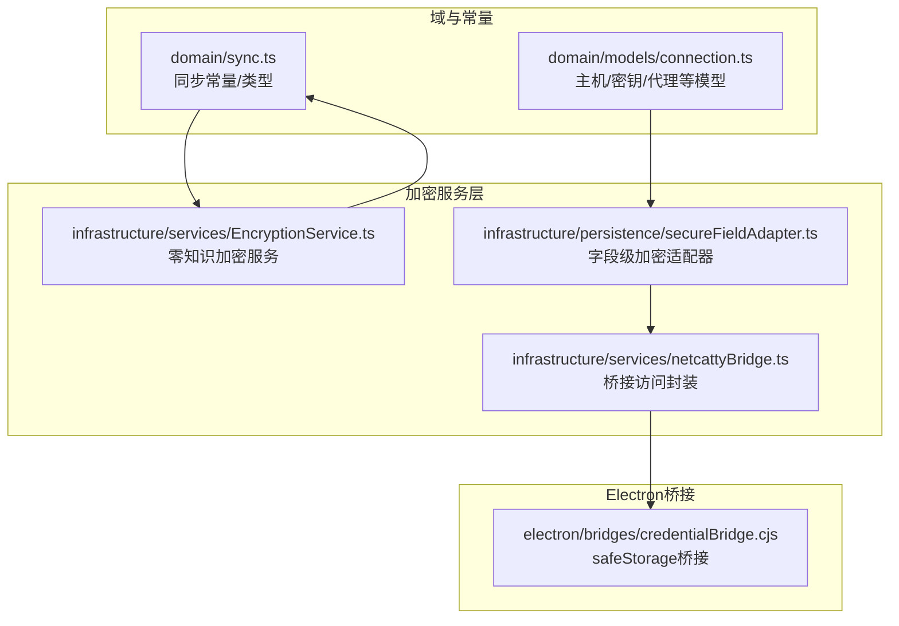
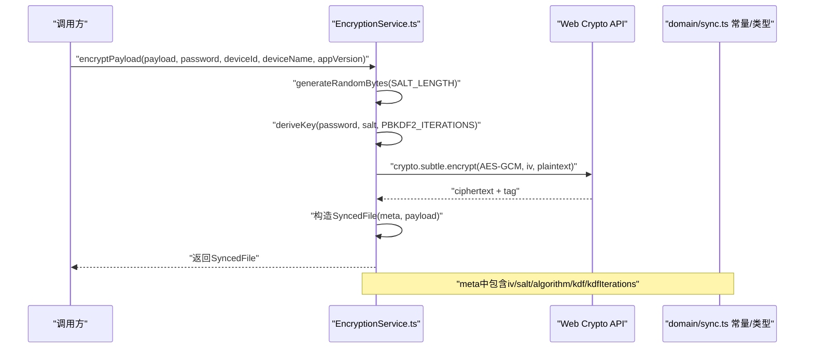
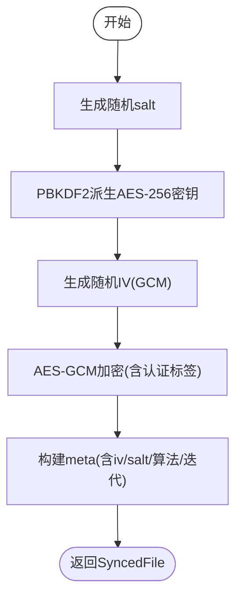
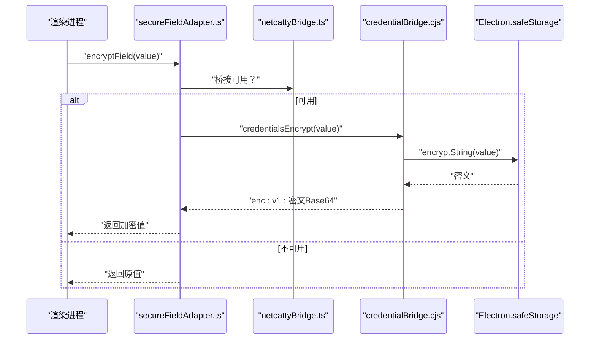
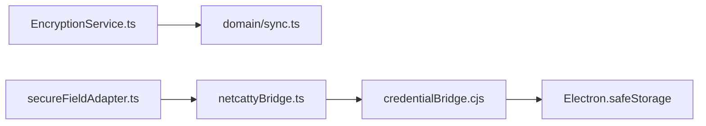
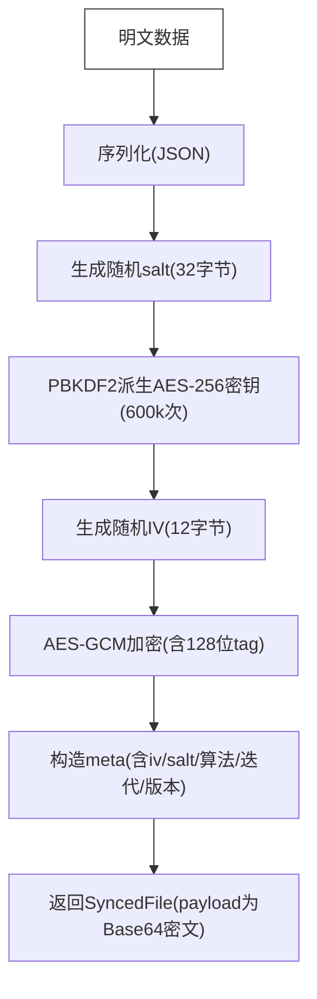

# 加密服务

<cite>
**本文引用的文件**
- [EncryptionService.ts](file://infrastructure/services/EncryptionService.ts)
- [secureFieldAdapter.ts](file://infrastructure/persistence/secureFieldAdapter.ts)
- [credentialBridge.cjs](file://electron/bridges/credentialBridge.cjs)
- [sync.ts](file://domain/sync.ts)
- [netcattyBridge.ts](file://infrastructure/services/netcattyBridge.ts)
- [connection.ts](file://domain/models/connection.ts)
- [credentialProtection.ts](file://infrastructure/services/credentialProtection.ts)
</cite>

## 目录
1. [简介](#简介)
2. [项目结构](#项目结构)
3. [核心组件](#核心组件)
4. [架构总览](#架构总览)
5. [详细组件分析](#详细组件分析)
6. [依赖关系分析](#依赖关系分析)
7. [性能与安全考量](#性能与安全考量)
8. [故障排查指南](#故障排查指南)
9. [结论](#结论)
10. [附录](#附录)

## 简介
本文件面向Netcatty的加密服务，系统化阐述EncryptionService的实现原理与安全设计，覆盖以下主题：
- 对称加密算法选择与AES-GCM模式应用
- 凭据保护机制：SSH密钥安全存储、密码学安全随机数生成、盐值管理与迭代次数配置
- 安全字段适配器架构：确保敏感数据在本地持久化时的完整性校验与防篡改
- 加密流程图：从明文到密文的完整转换过程（密钥派生、IV生成、认证标签计算）
- 密钥管理策略、安全审计、密钥轮换与威胁防护
- 跨平台兼容性、性能优化与内存安全

## 项目结构
围绕“加密服务”的相关模块分布如下：
- 域模型与同步常量：domain/sync.ts
- 零知识加密服务：infrastructure/services/EncryptionService.ts
- 字段级凭据加密适配器：infrastructure/persistence/secureFieldAdapter.ts
- Electron凭据桥接与安全存储：electron/bridges/credentialBridge.cjs
- 桥接访问封装：infrastructure/services/netcattyBridge.ts
- 凭据可用性探测：infrastructure/services/credentialProtection.ts
- 主机/密钥/身份等域模型：domain/models/connection.ts

**图表来源**
- [sync.ts:470-508](file://domain/sync.ts#L470-L508)
- [EncryptionService.ts:420-439](file://infrastructure/services/EncryptionService.ts#L420-L439)
- [secureFieldAdapter.ts:1-241](file://infrastructure/persistence/secureFieldAdapter.ts#L1-L241)
- [netcattyBridge.ts:8-18](file://infrastructure/services/netcattyBridge.ts#L8-L18)
- [credentialBridge.cjs:1-86](file://electron/bridges/credentialBridge.cjs#L1-L86)

**章节来源**
- [sync.ts:470-508](file://domain/sync.ts#L470-L508)
- [EncryptionService.ts:420-439](file://infrastructure/services/EncryptionService.ts#L420-L439)
- [secureFieldAdapter.ts:1-241](file://infrastructure/persistence/secureFieldAdapter.ts#L1-L241)
- [netcattyBridge.ts:8-18](file://infrastructure/services/netcattyBridge.ts#L8-L18)
- [credentialBridge.cjs:1-86](file://electron/bridges/credentialBridge.cjs#L1-L86)

## 核心组件
- EncryptionService：基于Web Crypto API的零知识加密服务，采用AES-256-GCM与PBKDF2，支持主口令派生、密钥验证、同步文件加解密与主口令变更。
- secureFieldAdapter：渲染进程侧的字段级加密适配器，负责将敏感字段（如密码、私钥、令牌）在写入localStorage前加密，在读取后解密；当桥接不可用时降级为透传。
- credentialBridge：Electron主进程桥接，通过safeStorage实现字段级加密/解密，并带版本化前缀以避免重复加密与支持未来重钥。
- netcattyBridge：桥接访问封装，提供可选/强制获取桥接对象的能力。
- credentialProtection：凭据保护可用性探测，用于判断是否可使用系统安全存储。

**章节来源**
- [EncryptionService.ts:1-440](file://infrastructure/services/EncryptionService.ts#L1-L440)
- [secureFieldAdapter.ts:1-241](file://infrastructure/persistence/secureFieldAdapter.ts#L1-L241)
- [credentialBridge.cjs:1-86](file://electron/bridges/credentialBridge.cjs#L1-L86)
- [netcattyBridge.ts:1-20](file://infrastructure/services/netcattyBridge.ts#L1-L20)
- [credentialProtection.ts:1-13](file://infrastructure/services/credentialProtection.ts#L1-L13)

## 架构总览
下图展示了从“明文数据”到“云端/本地密文”的端到端路径，涵盖密钥派生、随机IV生成、认证标签计算与字段级加密：

**图表来源**
- [EncryptionService.ts:252-288](file://infrastructure/services/EncryptionService.ts#L252-L288)
- [sync.ts:470-508](file://domain/sync.ts#L470-L508)

**章节来源**
- [EncryptionService.ts:252-288](file://infrastructure/services/EncryptionService.ts#L252-L288)
- [sync.ts:470-508](file://domain/sync.ts#L470-L508)

## 详细组件分析

### EncryptionService：零知识加密与密钥管理
- 算法与参数
  - 对称加密：AES-256-GCM
  - 密钥派生：PBKDF2（默认迭代600000次，哈希函数SHA-256）
  - 随机性：使用crypto.getRandomValues生成IV与salt
  - 认证标签长度：128位
- 关键流程
  - 密钥派生：deriveKey(password, salt, iterations) -> CryptoKey
  - 密钥验证：verifyPassword(password, config)通过比对verificationHash
  - 同步文件加解密：encryptPayload()/decryptPayload()，元数据meta包含iv/salt/algorithm/kdf/kdfIterations
  - 主口令变更：changeMasterPassword()要求先验证旧口令，再生成新配置
- 内存安全
  - UnlockedMasterKey仅在内存中持有，不落盘
  - 解密失败时不会回退到明文，而是抛出错误或返回null

**图表来源**
- [EncryptionService.ts:101-133](file://infrastructure/services/EncryptionService.ts#L101-L133)
- [EncryptionService.ts:186-213](file://infrastructure/services/EncryptionService.ts#L186-L213)
- [EncryptionService.ts:252-288](file://infrastructure/services/EncryptionService.ts#L252-L288)

**章节来源**
- [EncryptionService.ts:93-172](file://infrastructure/services/EncryptionService.ts#L93-L172)
- [EncryptionService.ts:178-237](file://infrastructure/services/EncryptionService.ts#L178-L237)
- [EncryptionService.ts:243-338](file://infrastructure/services/EncryptionService.ts#L243-L338)
- [sync.ts:470-508](file://domain/sync.ts#L470-L508)

### 安全字段适配器：字段级加密与完整性保护
- 设计目标
  - 在渲染进程侧对敏感字段进行加密/解密，防止明文写入localStorage
  - 当safeStorage不可用时，降级为透传，保证功能可用性
- 实现要点
  - 通过netcattyBridge访问主进程safeStorage能力
  - 使用前缀“enc:v1:”标识已加密值，避免重复加密并支持未来版本升级
  - 支持主机密码、Telnet密码、代理密码、SSH私钥、SSH口令、身份密码、云同步令牌与密钥等字段
- 数据流
  - 写入：encryptField() -> safeStorage.encryptString() -> 前缀拼接
  - 读取：decryptField() -> safeStorage.decryptString() -> 去前缀还原

**图表来源**
- [secureFieldAdapter.ts:22-34](file://infrastructure/persistence/secureFieldAdapter.ts#L22-L34)
- [netcattyBridge.ts:8-18](file://infrastructure/services/netcattyBridge.ts#L8-L18)
- [credentialBridge.cjs:32-60](file://electron/bridges/credentialBridge.cjs#L32-L60)

**章节来源**
- [secureFieldAdapter.ts:1-241](file://infrastructure/persistence/secureFieldAdapter.ts#L1-L241)
- [credentialBridge.cjs:1-86](file://electron/bridges/credentialBridge.cjs#L1-L86)
- [netcattyBridge.ts:1-20](file://infrastructure/services/netcattyBridge.ts#L1-L20)

### 凭据保护可用性与跨平台兼容
- 凭据保护可用性探测：通过credentialProtection获取系统凭据保护能力状态
- 兼容性策略
  - safeStorage不可用时（如Linux无libsecret），字段级加密降级为透传
  - 同步加密（零知识）始终使用Web Crypto API，不受safeStorage影响
- 错误处理
  - 桥接不可用时抛出BridgeUnavailableError
  - 解密失败时记录警告并返回原始值，避免泄露

**章节来源**
- [credentialProtection.ts:1-13](file://infrastructure/services/credentialProtection.ts#L1-L13)
- [credentialBridge.cjs:32-82](file://electron/bridges/credentialBridge.cjs#L32-L82)
- [netcattyBridge.ts:1-20](file://infrastructure/services/netcattyBridge.ts#L1-L20)

### 类型与常量：安全参数与元数据结构
- 加密常量
  - AES_KEY_LENGTH=256
  - GCM_IV_LENGTH=12字节
  - GCM_TAG_LENGTH=128位
  - SALT_LENGTH=32字节
  - PBKDF2_ITERATIONS=600000
  - PBKDF2_HASH='SHA-256'
- 元数据结构
  - SyncedFile.meta包含iv/salt/algorithm/kdf/kdfIterations/version/deviceId/deviceName/appVersion
  - MasterKeyConfig包含verificationHash/salt/kdf/kdfIterations/createdAt

**章节来源**
- [sync.ts:470-508](file://domain/sync.ts#L470-L508)
- [sync.ts:137-157](file://domain/sync.ts#L137-L157)
- [sync.ts:319-335](file://domain/sync.ts#L319-L335)

## 依赖关系分析
- 组件耦合
  - EncryptionService依赖Web Crypto API与domain/sync.ts常量
  - secureFieldAdapter依赖netcattyBridge与credentialBridge
  - credentialBridge依赖Electron.safeStorage
- 外部依赖
  - 浏览器/Node环境的crypto.subtle（Web Crypto API）
  - Electron safeStorage（可选）

**图表来源**
- [EncryptionService.ts:13-22](file://infrastructure/services/EncryptionService.ts#L13-L22)
- [secureFieldAdapter.ts:12-14](file://infrastructure/persistence/secureFieldAdapter.ts#L12-L14)
- [netcattyBridge.ts:8-18](file://infrastructure/services/netcattyBridge.ts#L8-L18)
- [credentialBridge.cjs:18-26](file://electron/bridges/credentialBridge.cjs#L18-L26)

**章节来源**
- [EncryptionService.ts:13-22](file://infrastructure/services/EncryptionService.ts#L13-L22)
- [secureFieldAdapter.ts:12-14](file://infrastructure/persistence/secureFieldAdapter.ts#L12-L14)
- [netcattyBridge.ts:8-18](file://infrastructure/services/netcattyBridge.ts#L8-L18)
- [credentialBridge.cjs:18-26](file://electron/bridges/credentialBridge.cjs#L18-L26)

## 性能与安全考量
- 性能
  - PBKDF2迭代次数较高（600000），提升抗暴力破解能力但增加解锁时间；可通过硬件能力与缓存策略平衡
  - AES-GCM认证开销低，适合大规模数据加解密
  - 字段级加密批量操作使用Promise.all并行处理，减少UI阻塞
- 安全
  - 零知识模型：云端不接触明文，verificationHash不存储密钥本身
  - 每个同步文件独立salt与IV，避免重放与统计分析
  - 字段级加密采用版本化前缀，支持未来重钥与迁移
- 内存安全
  - 主口令仅在内存中短暂持有，避免落盘
  - 解密失败严格处理，不回退到明文

[本节为通用指导，无需列出具体文件来源]

## 故障排查指南
- 同步文件无法解密
  - 检查主口令是否正确（verifyPassword）
  - 确认meta中的kdfIterations与算法一致
- 字段级加密异常
  - safeStorage不可用时会降级为透传，检查credentialProtection返回值
  - 若出现“Saved credentials cannot be decrypted”，确认桥接是否可用且值带有enc:v1:前缀
- 主口令变更失败
  - 确保旧口令验证通过后再执行changeMasterPassword
- 跨平台问题
  - Linux无libsecret时，字段级加密不可用；同步加密仍可用

**章节来源**
- [EncryptionService.ts:328-338](file://infrastructure/services/EncryptionService.ts#L328-L338)
- [credentialProtection.ts:1-13](file://infrastructure/services/credentialProtection.ts#L1-L13)
- [credentialBridge.cjs:32-82](file://electron/bridges/credentialBridge.cjs#L32-L82)
- [secureFieldAdapter.ts:22-34](file://infrastructure/persistence/secureFieldAdapter.ts#L22-L34)

## 结论
Netcatty的加密体系通过“零知识同步加密 + 字段级加密”的双层设计，实现了在多平台、多场景下的强安全与良好可用性：
- 同步层面：AES-256-GCM + PBKDF2，每文件独立salt/IV，云端不可见明文
- 本地层面：safeStorage驱动的字段级加密，带版本化前缀，具备迁移与重钥能力
- 运维层面：完善的可用性探测、降级策略与错误处理，保障跨平台一致性

[本节为总结性内容，无需列出具体文件来源]

## 附录

### 加密流程图（端到端）

**图表来源**
- [EncryptionService.ts:252-288](file://infrastructure/services/EncryptionService.ts#L252-L288)
- [sync.ts:470-508](file://domain/sync.ts#L470-L508)