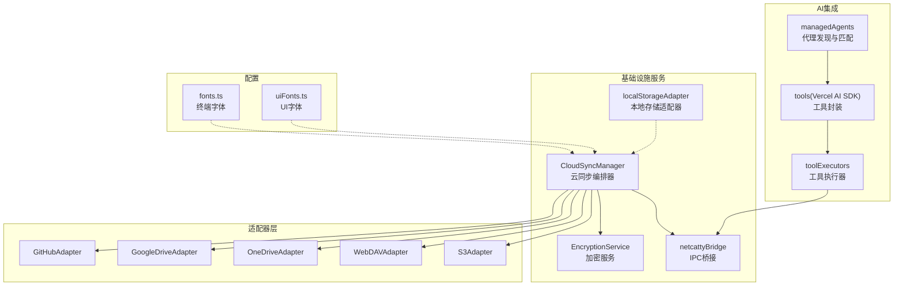
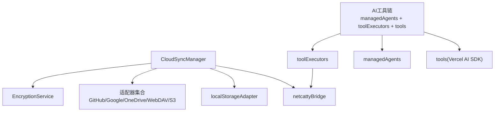
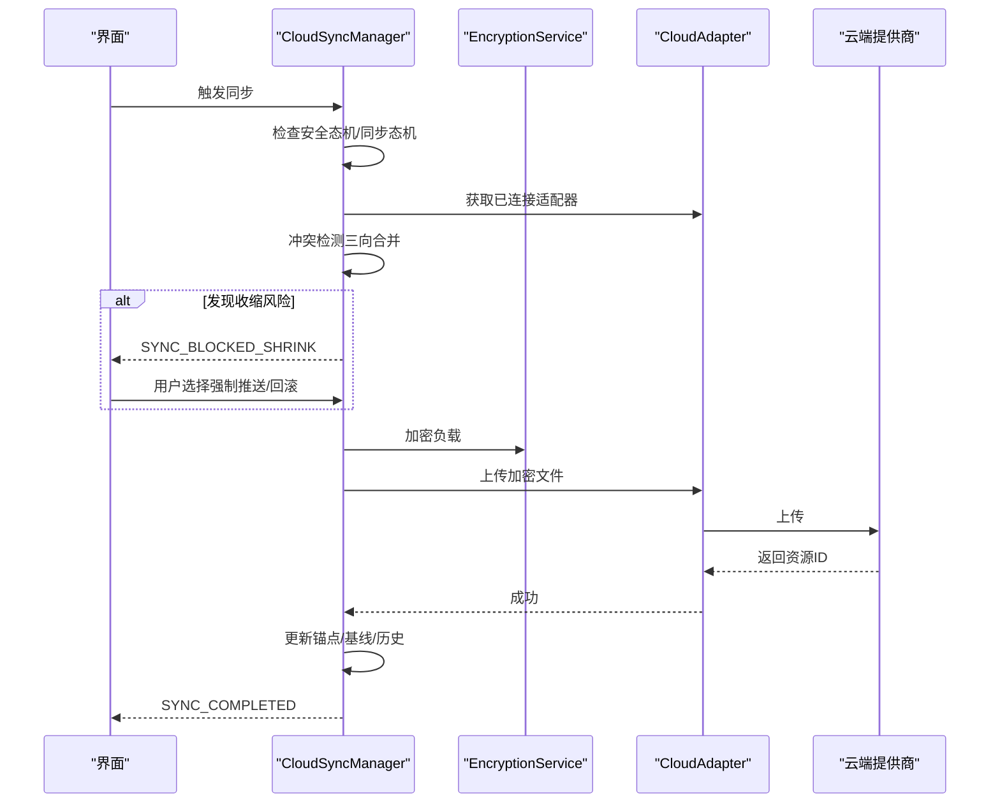
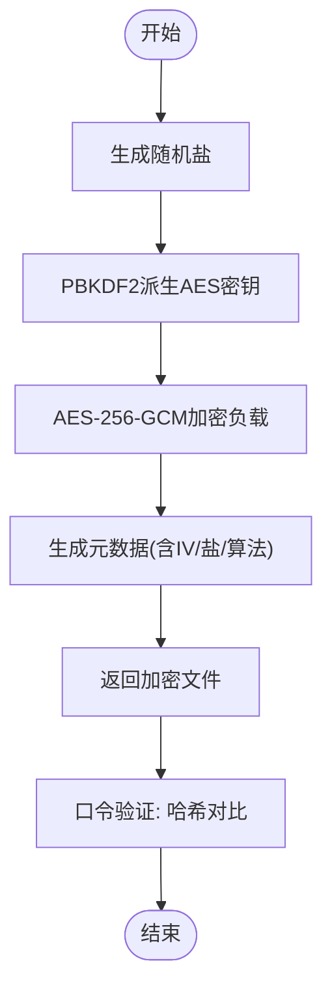
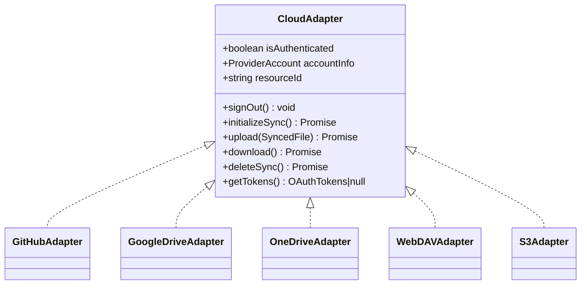
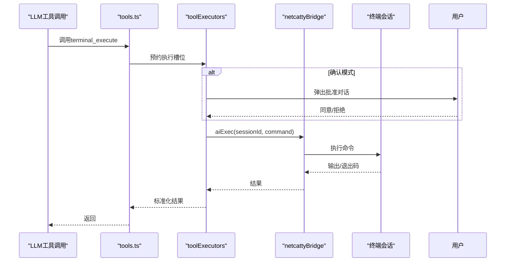
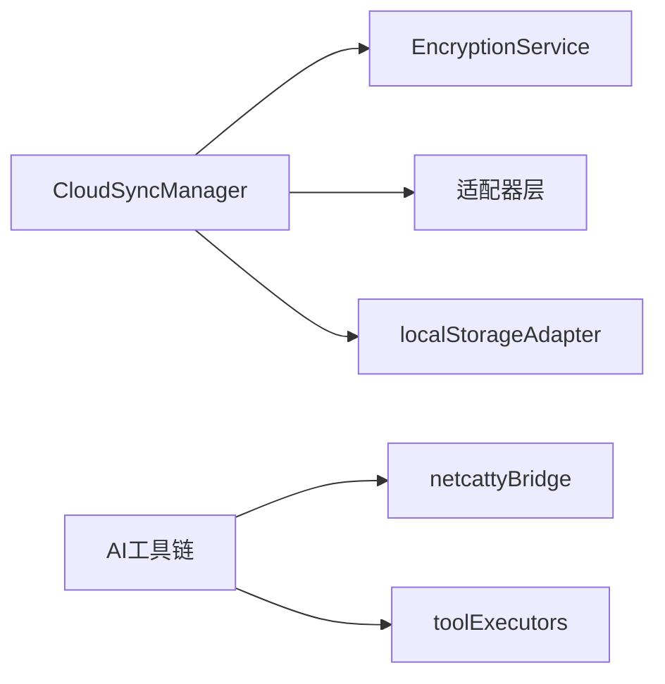

# 基础设施服务

<cite>
**本文引用的文件**
- [CloudSyncManager.ts](file://infrastructure/services/CloudSyncManager.ts)
- [EncryptionService.ts](file://infrastructure/services/EncryptionService.ts)
- [fonts.ts](file://infrastructure/config/fonts.ts)
- [uiFonts.ts](file://infrastructure/config/uiFonts.ts)
- [index.ts（适配器统一导出）](file://infrastructure/services/adapters/index.ts)
- [GitHubAdapter.ts](file://infrastructure/services/adapters/GitHubAdapter.ts)
- [WebDAVAdapter.ts](file://infrastructure/services/adapters/WebDAVAdapter.ts)
- [authMethods.ts](file://infrastructure/services/cloudSync/authMethods.ts)
- [providerSyncMethods.ts](file://infrastructure/services/cloudSync/providerSyncMethods.ts)
- [managedAgents.ts](file://infrastructure/ai/managedAgents.ts)
- [toolExecutors.ts](file://infrastructure/ai/shared/toolExecutors.ts)
- [tools.ts](file://infrastructure/ai/sdk/tools.ts)
- [netcattyBridge.ts](file://infrastructure/services/netcattyBridge.ts)
- [localStorageAdapter.ts](file://infrastructure/persistence/localStorageAdapter.ts)
- [sync.ts（领域模型）](file://domain/sync.ts)
</cite>

## 目录
1. [简介](#简介)
2. [项目结构](#项目结构)
3. [核心组件](#核心组件)
4. [架构总览](#架构总览)
5. [详细组件分析](#详细组件分析)
6. [依赖分析](#依赖分析)
7. [性能考虑](#性能考虑)
8. [故障排查指南](#故障排查指南)
9. [结论](#结论)
10. [附录](#附录)

## 简介
本文件面向Netcatty的基础设施服务，聚焦以下能力：
- 云同步服务：CloudSyncManager的设计与多云提供商支持（GitHub、Google、OneDrive、WebDAV、S3）
- 加密服务：零知识加密的数据保护、密钥管理、安全传输
- 字体配置系统：终端字体与UI字体的管理与动态切换
- AI服务集成：AI代理管理、工具调用、会话处理
- 运维支撑：服务配置、跨窗口状态同步、持久化适配、错误与恢复策略

## 项目结构
基础设施相关代码主要分布在以下目录：
- infrastructure/services：云同步、加密、桥接、持久化等核心服务
- infrastructure/services/adapters：各云提供商适配器
- infrastructure/services/cloudSync：云同步子模块（认证、同步、存储）
- infrastructure/ai：AI代理、工具执行、会话队列与权限控制
- infrastructure/config：字体、主题、国际化等配置
- domain：云同步领域模型与常量定义

图表来源
- [CloudSyncManager.ts:166-830](file://infrastructure/services/CloudSyncManager.ts#L166-L830)
- [EncryptionService.ts:420-440](file://infrastructure/services/EncryptionService.ts#L420-L440)
- [index.ts（适配器统一导出）:33-63](file://infrastructure/services/adapters/index.ts#L33-L63)
- [GitHubAdapter.ts:1-200](file://infrastructure/services/adapters/GitHubAdapter.ts#L1-L200)
- [WebDAVAdapter.ts:1-200](file://infrastructure/services/adapters/WebDAVAdapter.ts#L1-L200)
- [managedAgents.ts:1-78](file://infrastructure/ai/managedAgents.ts#L1-L78)
- [toolExecutors.ts:1-240](file://infrastructure/ai/shared/toolExecutors.ts#L1-L240)
- [tools.ts:1-177](file://infrastructure/ai/sdk/tools.ts#L1-L177)
- [fonts.ts:1-103](file://infrastructure/config/fonts.ts#L1-L103)
- [uiFonts.ts:1-150](file://infrastructure/config/uiFonts.ts#L1-L150)
- [netcattyBridge.ts:1-20](file://infrastructure/services/netcattyBridge.ts#L1-L20)
- [localStorageAdapter.ts:1-107](file://infrastructure/persistence/localStorageAdapter.ts#L1-L107)

章节来源
- [CloudSyncManager.ts:166-830](file://infrastructure/services/CloudSyncManager.ts#L166-L830)
- [index.ts（适配器统一导出）:33-63](file://infrastructure/services/adapters/index.ts#L33-L63)

## 核心组件
- 云同步编排器（CloudSyncManager）
  - 统一管理安全态机（无主钥/锁定/解锁）、同步态机（空闲/同步中/冲突/错误）、提供商连接、版本冲突检测与解决、自动同步调度
  - 提供主密码设置/解锁/加锁/改密、提供商认证（设备流/PKCE/配置型）、构建与分发同步负载、下载与应用远端数据、历史修订查看与回滚、阻塞状态清理与收缩检测
- 加密服务（EncryptionService）
  - 基于Web Crypto的AES-256-GCM与PBKDF2（60万轮），零知识加密，所有加密/解密在客户端完成
  - 提供派生密钥、验证口令、加密/解密负载、创建/解锁主密钥配置、变更主口令等
- 适配器层（多云提供商）
  - GitHub（设备流）、Google/OneDrive（PKCE）、WebDAV/S3（配置型）
  - 统一接口：初始化同步、上传/下载/删除、令牌获取、账户信息、认证登出
- 字体配置系统
  - 终端字体：拉丁+CJK组合运行时合成，支持禁用比例字体作为终端字体
  - UI字体：系统字体栈与CJK回退，提供默认UI字体ID
- AI服务集成
  - 代理管理：托管代理识别与路径匹配
  - 工具执行：终端命令执行、工作区信息查询、网络搜索、URL抓取；带权限模式、会话范围校验、安全检查、批准门控、串行执行队列
  - SDK封装：Vercel AI SDK工具包装，统一输入schema与结果形态

章节来源
- [CloudSyncManager.ts:116-150](file://infrastructure/services/CloudSyncManager.ts#L116-L150)
- [EncryptionService.ts:420-440](file://infrastructure/services/EncryptionService.ts#L420-L440)
- [index.ts（适配器统一导出）:17-28](file://infrastructure/services/adapters/index.ts#L17-L28)
- [fonts.ts:10-16](file://infrastructure/config/fonts.ts#L10-L16)
- [uiFonts.ts:6-10](file://infrastructure/config/uiFonts.ts#L6-L10)
- [managedAgents.ts:3-10](file://infrastructure/ai/managedAgents.ts#L3-L10)
- [toolExecutors.ts:66-116](file://infrastructure/ai/shared/toolExecutors.ts#L66-L116)

## 架构总览
下图展示基础设施服务的整体交互：CloudSyncManager协调加密、适配器与持久化；AI侧通过工具执行器经由netcattyBridge访问底层能力；字体配置服务于终端与UI渲染。

图表来源
- [CloudSyncManager.ts:166-830](file://infrastructure/services/CloudSyncManager.ts#L166-L830)
- [EncryptionService.ts:420-440](file://infrastructure/services/EncryptionService.ts#L420-L440)
- [index.ts（适配器统一导出）:33-63](file://infrastructure/services/adapters/index.ts#L33-L63)
- [netcattyBridge.ts:8-18](file://infrastructure/services/netcattyBridge.ts#L8-L18)
- [localStorageAdapter.ts:70-106](file://infrastructure/persistence/localStorageAdapter.ts#L70-L106)
- [managedAgents.ts:1-78](file://infrastructure/ai/managedAgents.ts#L1-L78)
- [toolExecutors.ts:66-116](file://infrastructure/ai/shared/toolExecutors.ts#L66-L116)
- [tools.ts:33-177](file://infrastructure/ai/sdk/tools.ts#L33-L177)

## 详细组件分析

### 云同步服务：CloudSyncManager
- 设计要点
  - 安全态机与同步态机分离，确保只有解锁后才允许同步
  - 跨窗口状态同步：基于localStorage事件与快照通知React
  - 提供商解密序列号：防止启动/跨窗写入过期覆盖
  - 认证尝试序列号：避免并发认证互相覆盖
  - 收缩检测（ShrinkGuard）：拒绝可能误删实体的推送，必要时阻塞并提示强制推送或回滚
- 关键流程
  - 认证流程：设备流（GitHub）/PKCE（Google/OneDrive）/配置（WebDAV/S3）
  - 同步流程：冲突检测（三向合并）→ 可能阻塞（收缩检测）→ 成功后更新锚点与基线
  - 历史回滚：支持查看Gist修订并一键恢复
- 事件系统：统一事件类型，驱动UI与日志记录

图表来源
- [CloudSyncManager.ts:558-680](file://infrastructure/services/CloudSyncManager.ts#L558-L680)
- [providerSyncMethods.ts:19-101](file://infrastructure/services/cloudSync/providerSyncMethods.ts#L19-L101)
- [EncryptionService.ts:252-288](file://infrastructure/services/EncryptionService.ts#L252-L288)
- [GitHubAdapter.ts:109-157](file://infrastructure/services/adapters/GitHubAdapter.ts#L109-L157)
- [WebDAVAdapter.ts:62-79](file://infrastructure/services/adapters/WebDAVAdapter.ts#L62-L79)

章节来源
- [CloudSyncManager.ts:116-150](file://infrastructure/services/CloudSyncManager.ts#L116-L150)
- [authMethods.ts:28-88](file://infrastructure/services/cloudSync/authMethods.ts#L28-L88)
- [providerSyncMethods.ts:19-101](file://infrastructure/services/cloudSync/providerSyncMethods.ts#L19-L101)

### 加密服务：EncryptionService
- 安全模型
  - 主口令→PBKDF2（60万轮，SHA-256）→AES-256-GCM密钥
  - 每次加密生成随机IV与盐，元数据明文存储用于版本控制
  - 口令验证通过哈希对比，不存储密钥本身
- 能力清单
  - 密钥派生、口令验证、加密/解密负载、创建/解锁主密钥配置、变更主口令
- 使用建议
  - 主密钥仅驻留内存，避免落盘
  - 变更主口令需重新加密全部数据

图表来源
- [EncryptionService.ts:101-133](file://infrastructure/services/EncryptionService.ts#L101-L133)
- [EncryptionService.ts:156-172](file://infrastructure/services/EncryptionService.ts#L156-L172)
- [EncryptionService.ts:252-322](file://infrastructure/services/EncryptionService.ts#L252-L322)

章节来源
- [EncryptionService.ts:101-172](file://infrastructure/services/EncryptionService.ts#L101-L172)
- [EncryptionService.ts:252-338](file://infrastructure/services/EncryptionService.ts#L252-L338)

### 多云提供商适配器
- 统一接口
  - signOut、initializeSync、upload、download、deleteSync、getTokens、accountInfo、resourceId、isAuthenticated
- 典型实现
  - GitHub：设备流授权，使用Gist API进行文件读写
  - WebDAV：支持basic/digest/token三种鉴权，自动补全协议与前缀
  - Google/OneDrive：PKCE授权，结合云端API进行文件管理
  - S3：兼容S3 API，支持路径式与虚拟主机式访问

图表来源
- [index.ts（适配器统一导出）:17-28](file://infrastructure/services/adapters/index.ts#L17-L28)
- [GitHubAdapter.ts:27-54](file://infrastructure/services/adapters/GitHubAdapter.ts#L27-L54)
- [WebDAVAdapter.ts:28-53](file://infrastructure/services/adapters/WebDAVAdapter.ts#L28-L53)

章节来源
- [index.ts（适配器统一导出）:33-63](file://infrastructure/services/adapters/index.ts#L33-L63)
- [GitHubAdapter.ts:109-157](file://infrastructure/services/adapters/GitHubAdapter.ts#L109-L157)
- [WebDAVAdapter.ts:62-136](file://infrastructure/services/adapters/WebDAVAdapter.ts#L62-L136)

### 字体配置系统
- 终端字体
  - 仅拉丁字形的CSS font-family，CJK与图标回退由运行时函数合成
  - 提供字体ID迁移与弃用检测，避免比例字体破坏终端网格对齐
- UI字体
  - 系统字体栈 + CJK回退，提供默认UI字体ID
- 动态切换
  - 通过设置项更新后，运行时重新合成字体堆栈并触发重绘

章节来源
- [fonts.ts:10-16](file://infrastructure/config/fonts.ts#L10-L16)
- [fonts.ts:72-102](file://infrastructure/config/fonts.ts#L72-L102)
- [uiFonts.ts:6-10](file://infrastructure/config/uiFonts.ts#L6-L10)
- [uiFonts.ts:14-34](file://infrastructure/config/uiFonts.ts#L14-L34)

### AI服务集成
- 代理管理
  - 托管代理标识与命令基名匹配，支持优先路径与回退路径解析
- 工具执行
  - 终端命令执行：会话范围校验、安全策略（命令黑名单）、退出码语义（网络设备返回null）
  - 工作区信息：返回当前工作区与会话列表
  - 网络搜索：按配置限制最大结果数
  - URL抓取：HTTPS限制、长度截断、错误聚合
- 权限与串行化
  - 观察者模式禁用执行；确认模式需要用户批准
  - 为每个聊天会话与目标会话保留执行槽位，保证顺序一致性

图表来源
- [tools.ts:53-114](file://infrastructure/ai/sdk/tools.ts#L53-L114)
- [toolExecutors.ts:66-116](file://infrastructure/ai/shared/toolExecutors.ts#L66-L116)
- [netcattyBridge.ts:8-18](file://infrastructure/services/netcattyBridge.ts#L8-L18)

章节来源
- [managedAgents.ts:3-77](file://infrastructure/ai/managedAgents.ts#L3-L77)
- [toolExecutors.ts:66-116](file://infrastructure/ai/shared/toolExecutors.ts#L66-L116)
- [tools.ts:33-177](file://infrastructure/ai/sdk/tools.ts#L33-L177)

## 依赖分析
- 组件耦合
  - CloudSyncManager依赖EncryptionService进行加密/解密；依赖适配器进行云端操作；依赖localStorageAdapter进行跨窗同步
  - AI工具执行器依赖netcattyBridge进行底层IPC调用
- 外部依赖
  - 云提供商API（GitHub/Google/OneDrive）、WebDAV库、S3兼容存储
  - Vercel AI SDK（tools.ts）

图表来源
- [CloudSyncManager.ts:166-830](file://infrastructure/services/CloudSyncManager.ts#L166-L830)
- [EncryptionService.ts:420-440](file://infrastructure/services/EncryptionService.ts#L420-L440)
- [localStorageAdapter.ts:70-106](file://infrastructure/persistence/localStorageAdapter.ts#L70-L106)
- [netcattyBridge.ts:8-18](file://infrastructure/services/netcattyBridge.ts#L8-L18)
- [toolExecutors.ts:66-116](file://infrastructure/ai/shared/toolExecutors.ts#L66-L116)

章节来源
- [CloudSyncManager.ts:166-830](file://infrastructure/services/CloudSyncManager.ts#L166-L830)
- [toolExecutors.ts:66-116](file://infrastructure/ai/shared/toolExecutors.ts#L66-L116)

## 性能考虑
- 加密性能
  - PBKDF2迭代次数较高（60万轮），建议在后台线程或空闲时段执行口令验证
  - AES-GCM为硬件加速友好，适合大块数据加密
- 同步性能
  - 三向合并与收缩检测在同步前执行，避免无效上传
  - 自动同步间隔可配置（1–60分钟），平衡实时性与资源消耗
- 字体渲染
  - 终端字体采用Latin+CJK运行时合成，避免预加载过多字体导致内存压力
- AI工具
  - 串行执行队列避免并发命令竞争；网络搜索与URL抓取限制结果数量与长度

## 故障排查指南
- 云同步
  - 锁定态：无法同步，需解锁主口令
  - 连接错误：检查提供商令牌是否有效、网络连通性
  - 冲突/阻塞：根据收缩检测提示选择回滚或强制推送；必要时手动清理阻塞状态
  - 历史回滚：使用Gist修订历史进行一键恢复
- 加密
  - 解密失败：确认主口令正确；不同设备间口令不一致会导致解密失败
  - 口令验证：通过验证哈希确认口令有效性
- 字体
  - 终端显示异常：检查是否选择了比例字体；系统会迁移弃用字体ID
  - UI字体缺失：确认回退栈是否生效
- AI工具
  - 命令被拦截：检查安全策略与权限模式；网络设备CLI跳过通用黑名单
  - 批准未响应：确认观察者模式下禁用执行；确认批准弹窗未被遮挡

章节来源
- [CloudSyncManager.ts:689-711](file://infrastructure/services/CloudSyncManager.ts#L689-L711)
- [providerSyncMethods.ts:189-200](file://infrastructure/services/cloudSync/providerSyncMethods.ts#L189-L200)
- [EncryptionService.ts:156-172](file://infrastructure/services/EncryptionService.ts#L156-L172)
- [fonts.ts:78-102](file://infrastructure/config/fonts.ts#L78-L102)
- [toolExecutors.ts:78-104](file://infrastructure/ai/shared/toolExecutors.ts#L78-L104)

## 结论
Netcatty的基础设施服务围绕“零知识加密 + 多云适配 + 安全态机 + 有序AI工具”构建，既保障了用户数据隐私，又提供了灵活的跨平台同步与强大的AI增强体验。通过严格的态机控制、收缩检测与跨窗同步机制，系统在复杂场景下仍保持稳健与可维护性。

## 附录
- 服务配置
  - 自动同步：可启用并设置周期（1–60分钟）
  - 设备名称：可自定义，用于同步锚点与历史记录
  - 存储键：集中管理主密钥、设备ID、提供商连接、同步基线等
- 监控与日志
  - 同步历史：记录每次上传/下载/合并/冲突解决的结果与时间戳
  - 事件总线：统一事件类型，便于UI与日志订阅
- 故障恢复
  - 重置本地版本：清空本地版本与时间戳，下次同步从远端下载
  - 清理阻塞：在非阻塞态下清除收缩检测结果
  - 本地存储：安全写入与配额溢出告警，避免崩溃

章节来源
- [CloudSyncManager.ts:727-794](file://infrastructure/services/CloudSyncManager.ts#L727-L794)
- [sync.ts（领域模型）:445-458](file://domain/sync.ts#L445-L458)
- [localStorageAdapter.ts:51-68](file://infrastructure/persistence/localStorageAdapter.ts#L51-L68)