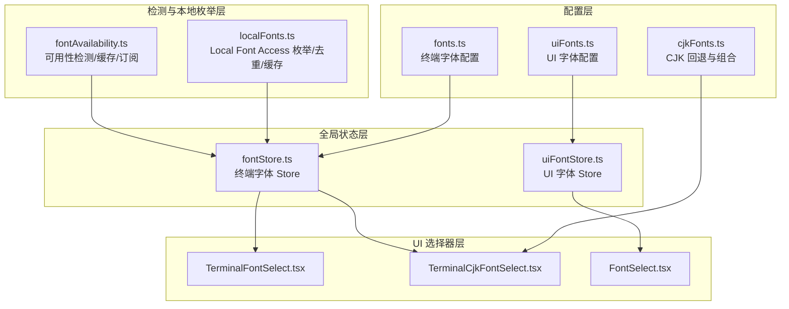
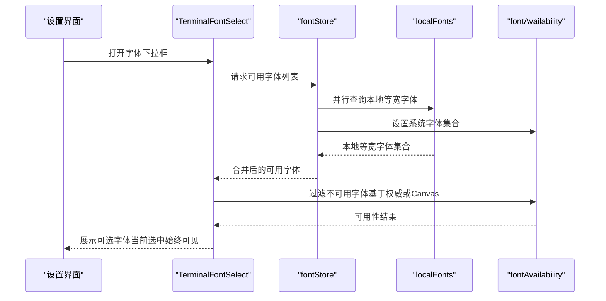
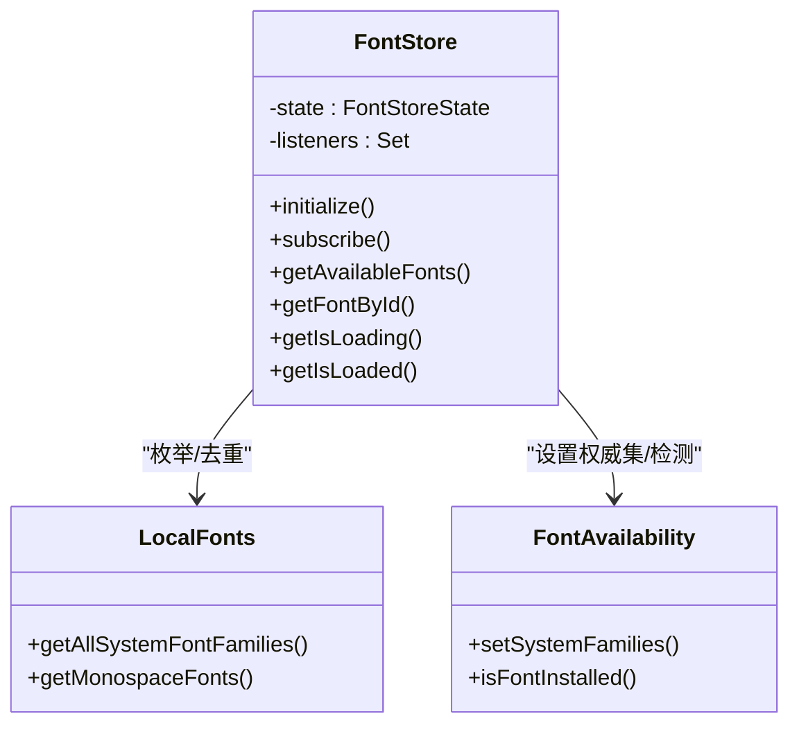
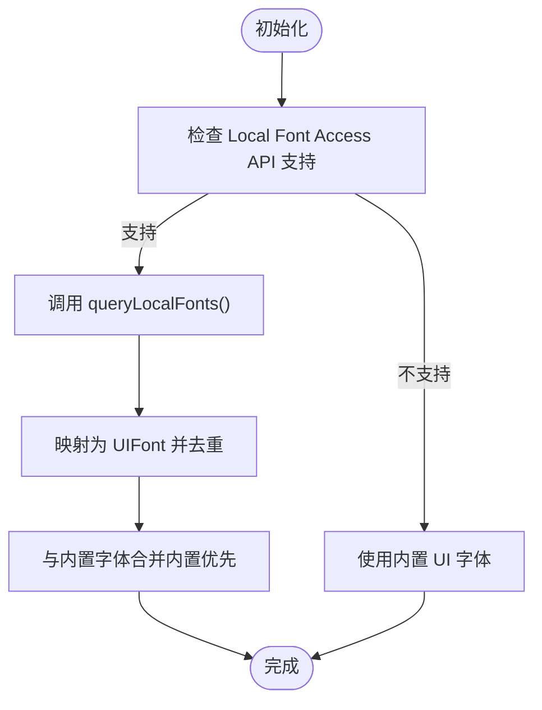
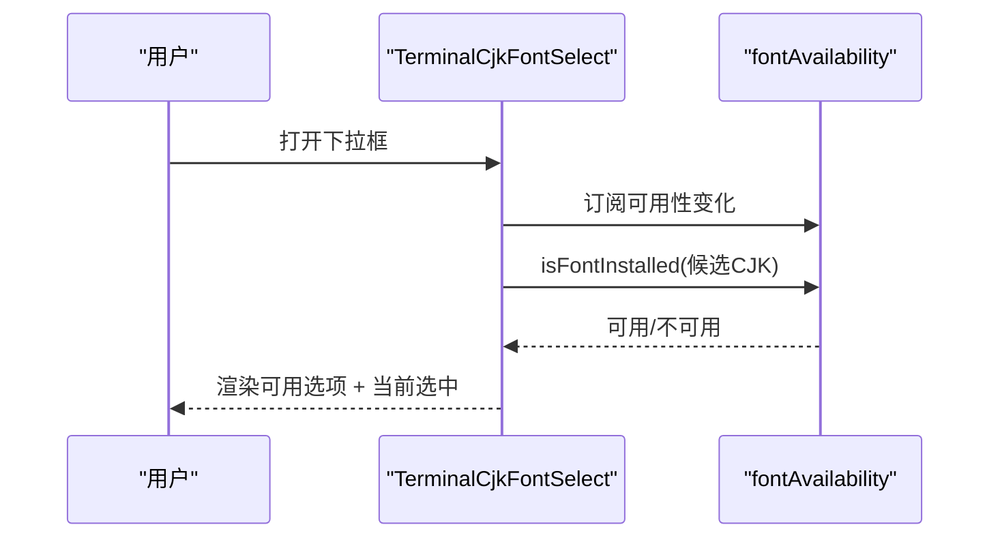
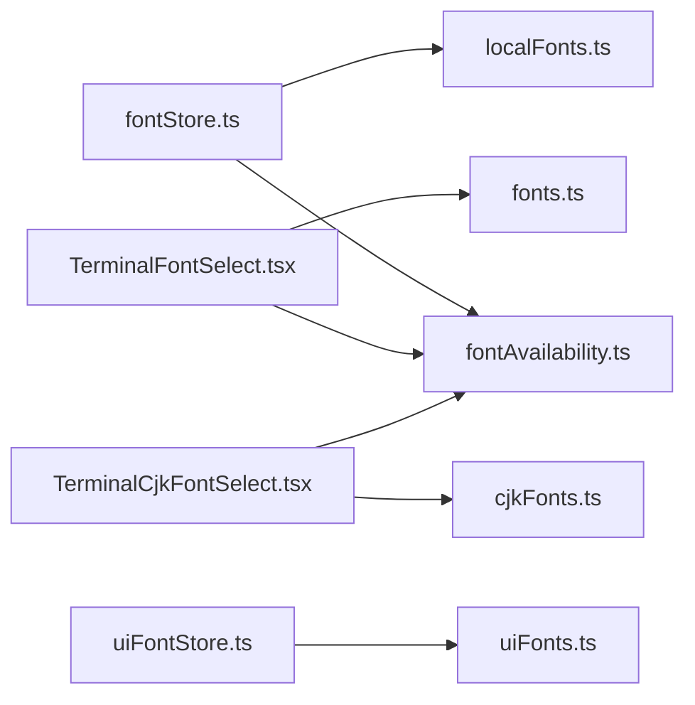

# 字体系统

<cite>
**本文引用的文件**
- [application/state/fontStore.ts](file://application/state/fontStore.ts)
- [application/state/uiFontStore.ts](file://application/state/uiFontStore.ts)
- [infrastructure/config/fonts.ts](file://infrastructure/config/fonts.ts)
- [infrastructure/config/uiFonts.ts](file://infrastructure/config/uiFonts.ts)
- [infrastructure/config/cjkFonts.ts](file://infrastructure/config/cjkFonts.ts)
- [lib/localFonts.ts](file://lib/localFonts.ts)
- [lib/fontAvailability.ts](file://lib/fontAvailability.ts)
- [components/settings/FontSelect.tsx](file://components/settings/FontSelect.tsx)
- [components/settings/TerminalFontSelect.tsx](file://components/settings/TerminalFontSelect.tsx)
- [components/settings/TerminalCjkFontSelect.tsx](file://components/settings/TerminalCjkFontSelect.tsx)
- [infrastructure/config/xtermPerformance.ts](file://infrastructure/config/xtermPerformance.ts)
</cite>

## 目录
1. [简介](#简介)
2. [项目结构](#项目结构)
3. [核心组件](#核心组件)
4. [架构总览](#架构总览)
5. [详细组件分析](#详细组件分析)
6. [依赖关系分析](#依赖关系分析)
7. [性能考量](#性能考量)
8. [故障排查指南](#故障排查指南)
9. [结论](#结论)
10. [附录](#附录)

## 简介
本文件系统化阐述 Netcatty 的字体系统：涵盖终端字体与 UI 字体的分类管理、等宽字体选择与配置（Monaco、Consolas、Sarasa Mono 等）、CJK 字体支持与回退机制、字体可用性检测与跨平台兼容、字体配置项清单、字体性能优化策略（缓存、预加载、内存管理），以及主题系统中的动态字体加载与响应式调整。

## 项目结构
字体系统由“配置层”“检测与本地枚举层”“全局状态层”“UI 选择器层”四部分组成：
- 配置层：定义终端字体、UI 字体、CJK 回退栈、默认值与迁移规则。
- 检测与本地枚举层：通过 Local Font Access API 枚举系统字体，并以 Canvas 宽度对比作为降级检测。
- 全局状态层：提供单例 Store，统一初始化、去重合并、监听通知与查询。
- UI 选择器层：根据可用性过滤并展示字体选项，支持“自动” CJK 回退与本地字体动态回退。

图表来源
- [infrastructure/config/fonts.ts:1-103](file://infrastructure/config/fonts.ts#L1-L103)
- [infrastructure/config/uiFonts.ts:1-150](file://infrastructure/config/uiFonts.ts#L1-L150)
- [infrastructure/config/cjkFonts.ts:1-184](file://infrastructure/config/cjkFonts.ts#L1-L184)
- [lib/localFonts.ts:1-190](file://lib/localFonts.ts#L1-L190)
- [lib/fontAvailability.ts:1-163](file://lib/fontAvailability.ts#L1-L163)
- [application/state/fontStore.ts:1-161](file://application/state/fontStore.ts#L1-L161)
- [application/state/uiFontStore.ts:1-208](file://application/state/uiFontStore.ts#L1-L208)
- [components/settings/TerminalFontSelect.tsx:1-116](file://components/settings/TerminalFontSelect.tsx#L1-L116)
- [components/settings/TerminalCjkFontSelect.tsx:1-154](file://components/settings/TerminalCjkFontSelect.tsx#L1-L154)
- [components/settings/FontSelect.tsx:1-78](file://components/settings/FontSelect.tsx#L1-L78)

章节来源
- [infrastructure/config/fonts.ts:1-103](file://infrastructure/config/fonts.ts#L1-L103)
- [infrastructure/config/uiFonts.ts:1-150](file://infrastructure/config/uiFonts.ts#L1-L150)
- [infrastructure/config/cjkFonts.ts:1-184](file://infrastructure/config/cjkFonts.ts#L1-L184)
- [lib/localFonts.ts:1-190](file://lib/localFonts.ts#L1-L190)
- [lib/fontAvailability.ts:1-163](file://lib/fontAvailability.ts#L1-L163)
- [application/state/fontStore.ts:1-161](file://application/state/fontStore.ts#L1-L161)
- [application/state/uiFontStore.ts:1-208](file://application/state/uiFontStore.ts#L1-L208)
- [components/settings/TerminalFontSelect.tsx:1-116](file://components/settings/TerminalFontSelect.tsx#L1-L116)
- [components/settings/TerminalCjkFontSelect.tsx:1-154](file://components/settings/TerminalCjkFontSelect.tsx#L1-L154)
- [components/settings/FontSelect.tsx:1-78](file://components/settings/FontSelect.tsx#L1-L78)

## 核心组件
- 终端字体配置与默认集：定义终端可用的等宽字体集合、默认字号范围、废弃字体迁移逻辑。
- UI 字体配置与 CJK 回退：定义 UI 文本字体集合，并为 UI 字体追加 CJK 回退栈。
- CJK 字体回退与组合：按平台与拉丁字体推荐配对，生成最终 CSS 字体堆栈，保证终端网格对齐。
- 本地字体枚举与缓存：通过 Local Font Access API 获取系统等宽字体，去重并缓存；并发调用去重。
- 字体可用性检测：优先权威系统数据（Local Font Access），否则使用 Canvas 宽度对比检测；结果缓存与订阅通知。
- 终端字体 Store：合并默认与本地字体，去重与回退，提供查询与初始化钩子。
- UI 字体 Store：合并内置与本地字体，处理本地字体 ID 命名空间与回退。
- 字体选择器：根据可用性过滤选项，支持“自动” CJK 回退与本地字体动态回退。

章节来源
- [infrastructure/config/fonts.ts:10-103](file://infrastructure/config/fonts.ts#L10-L103)
- [infrastructure/config/uiFonts.ts:6-150](file://infrastructure/config/uiFonts.ts#L6-L150)
- [infrastructure/config/cjkFonts.ts:1-184](file://infrastructure/config/cjkFonts.ts#L1-L184)
- [lib/localFonts.ts:15-190](file://lib/localFonts.ts#L15-L190)
- [lib/fontAvailability.ts:22-163](file://lib/fontAvailability.ts#L22-L163)
- [application/state/fontStore.ts:19-161](file://application/state/fontStore.ts#L19-L161)
- [application/state/uiFontStore.ts:24-208](file://application/state/uiFontStore.ts#L24-L208)
- [components/settings/TerminalFontSelect.tsx:14-116](file://components/settings/TerminalFontSelect.tsx#L14-L116)
- [components/settings/TerminalCjkFontSelect.tsx:12-154](file://components/settings/TerminalCjkFontSelect.tsx#L12-L154)
- [components/settings/FontSelect.tsx:7-78](file://components/settings/FontSelect.tsx#L7-L78)

## 架构总览
字体系统采用“配置 + 检测 + 状态 + UI”的分层设计，确保：
- 跨平台字体可用性检测与回退；
- 终端网格对齐与 CJK 渲染一致性；
- UI 与终端字体的独立配置与动态加载；
- 性能与内存占用的可控优化。

图表来源
- [application/state/fontStore.ts:55-106](file://application/state/fontStore.ts#L55-L106)
- [lib/localFonts.ts:161-189](file://lib/localFonts.ts#L161-L189)
- [lib/fontAvailability.ts:53-155](file://lib/fontAvailability.ts#L53-L155)
- [components/settings/TerminalFontSelect.tsx:34-60](file://components/settings/TerminalFontSelect.tsx#L34-L60)

## 详细组件分析

### 终端字体 Store（fontStore）
- 单例模式：使用 useSyncExternalStore 订阅状态变更，避免“渲染期间 setState”问题。
- 初始化流程：并行获取本地等宽字体与系统字体家族集合，设置权威系统字体集，合并默认与本地字体，去重后写入状态。
- 查询与回退：按 ID 查找字体，若不存在则回退到默认集首项；提供初始化钩子与惰性触发。
- 关键点：本地字体 ID 前缀区分与大小写不敏感去重；错误兜底使用默认字体集。

图表来源
- [application/state/fontStore.ts:19-115](file://application/state/fontStore.ts#L19-L115)
- [lib/localFonts.ts:151-189](file://lib/localFonts.ts#L151-L189)
- [lib/fontAvailability.ts:53-155](file://lib/fontAvailability.ts#L53-L155)

章节来源
- [application/state/fontStore.ts:19-161](file://application/state/fontStore.ts#L19-L161)
- [lib/localFonts.ts:96-189](file://lib/localFonts.ts#L96-L189)
- [lib/fontAvailability.ts:53-155](file://lib/fontAvailability.ts#L53-L155)

### UI 字体 Store（uiFontStore）
- 本地字体枚举：通过 Local Font Access API 获取系统字体家族，去重后映射为 UIFont 结构。
- 本地字体命名空间：本地字体 ID 以 local- 前缀区分，避免与内置字体冲突。
- 动态回退：当主窗口先收到本地字体 ID 但尚未加载时，构造临时回退对象以保证 UI 正常显示。
- 可用性校验：提供本地字体 ID 有效性判断。

图表来源
- [application/state/uiFontStore.ts:53-93](file://application/state/uiFontStore.ts#L53-L93)
- [application/state/uiFontStore.ts:95-122](file://application/state/uiFontStore.ts#L95-L122)
- [application/state/uiFontStore.ts:124-145](file://application/state/uiFontStore.ts#L124-L145)

章节来源
- [application/state/uiFontStore.ts:24-208](file://application/state/uiFontStore.ts#L24-L208)

### 字体可用性检测与回退（fontAvailability + localFonts）
- 权威路径：Local Font Access API 返回系统字体家族集合，进行大小写不敏感匹配。
- 降级路径：Canvas 宽度对比，针对目标字体与通用字体族（serif/sans-serif/monospace）分别测量宽度，只要与任意一个存在差异即判定已安装。
- 缓存与订阅：对每个字体家族缓存检测结果；setSystemFamilies 会提升版本并通知订阅者，使 UI 重新计算过滤。
- 本地枚举缓存：对 Local Font Access API 的调用进行 Promise 级别去重与家族集合缓存，避免重复请求与权限竞争。

图表来源
- [lib/fontAvailability.ts:131-155](file://lib/fontAvailability.ts#L131-L155)
- [lib/fontAvailability.ts:119-129](file://lib/fontAvailability.ts#L119-L129)
- [lib/localFonts.ts:112-139](file://lib/localFonts.ts#L112-L139)

章节来源
- [lib/fontAvailability.ts:22-163](file://lib/fontAvailability.ts#L22-L163)
- [lib/localFonts.ts:96-139](file://lib/localFonts.ts#L96-L139)

### CJK 字体支持与回退（cjkFonts）
- 真等宽 CJK 字体优先：仅收录真正等宽的 CJK 字体，避免比例字体导致终端单元格宽度不一致。
- 推荐配对：按拉丁字体 ID 提供推荐的 CJK 配对，无推荐时回退到平台默认真等宽字体。
- 字体堆栈组合：按“拉丁主字体 → JetBrains Mono（拉丁占位）→ 用户自选 CJK → 推荐/平台默认 CJK → 系统 CJK → Nerd 字体 → monospace”顺序组合，去重并安全兜底。
- 分割与引号处理：正确解析 CSS 字体列表，保留带逗号的字体名称。

图表来源
- [infrastructure/config/cjkFonts.ts:128-183](file://infrastructure/config/cjkFonts.ts#L128-L183)
- [infrastructure/config/cjkFonts.ts:82-109](file://infrastructure/config/cjkFonts.ts#L82-L109)

章节来源
- [infrastructure/config/cjkFonts.ts:1-184](file://infrastructure/config/cjkFonts.ts#L1-L184)

### 字体选择器（TerminalFontSelect / TerminalCjkFontSelect / FontSelect）
- TerminalFontSelect：订阅字体可用性版本，过滤不可用字体；当前选中始终可见；在权威数据到位后严格信任系统数据。
- TerminalCjkFontSelect：提供“自动”选项（__auto__）与真等宽 CJK 字体列表；同样基于可用性过滤与本地回退。
- FontSelect：用于 UI 字体选择，直接展示字体家族预览。

图表来源
- [components/settings/TerminalCjkFontSelect.tsx:48-92](file://components/settings/TerminalCjkFontSelect.tsx#L48-L92)
- [lib/fontAvailability.ts:71-76](file://lib/fontAvailability.ts#L71-L76)

章节来源
- [components/settings/TerminalFontSelect.tsx:14-116](file://components/settings/TerminalFontSelect.tsx#L14-L116)
- [components/settings/TerminalCjkFontSelect.tsx:12-154](file://components/settings/TerminalCjkFontSelect.tsx#L12-L154)
- [components/settings/FontSelect.tsx:7-78](file://components/settings/FontSelect.tsx#L7-L78)

### 等宽字体选择与配置（Monaco、Consolas、Sarasa Mono 等）
- Monaco：经典终端等宽字体，可读性佳；在 macOS 上常用。
- Consolas：Windows 风格等宽字体，清晰紧凑；在 Windows 上常用。
- Sarasa Mono SC/TC：Iosevka + Source Han Sans 的组合，专为编程设计，提供简繁中文支持，保持 2:1 等宽网格。
- 其他常见等宽字体：Source Code Pro、Fira Code、JetBrains Mono、Cascadia Code、Ubuntu Mono、Roboto Mono、IBM Plex Mono、Input Mono、Hack、Anonymous Pro、DejaVu Sans Mono、Liberation Mono、Inconsolata、Victor Mono、Space Mono、Go Mono、Overpass Mono 等。
- 选择建议：优先选择真等宽字体；避免比例字体（如 PingFang SC、Microsoft YaHei UI 等）作为终端主字体，以免破坏网格对齐。

章节来源
- [infrastructure/config/fonts.ts:18-60](file://infrastructure/config/fonts.ts#L18-L60)
- [infrastructure/config/fonts.ts:72-80](file://infrastructure/config/fonts.ts#L72-L80)

### 字体配置选项清单
- 终端字体
  - 字体族（id/name/family/description/category）
  - 默认字号：14；最小/最大字号：10–32
  - 废弃字体 ID 迁移：当记录中使用了已移除的比例字体 ID，将清除覆盖并回归全局默认
- UI 字体
  - 字体族（id/name/family）
  - CJK 回退：为 UI 字体追加 PingFang SC、Hiragino Sans GB、Microsoft YaHei UI、Microsoft YaHei、Noto Sans CJK SC、Source Han Sans SC、sans-serif 等
  - 默认 UI 字体 ID：space-grotesk
- CJK 字体
  - 真等宽 CJK 字体：Sarasa Mono SC/TC、Maple Mono CN、LXGW WenKai Mono、Noto Sans Mono CJK SC、Source Han Mono SC、SimSun 等
  - 平台默认：win32 使用 SimSun；darwin 使用 Sarasa Mono SC；其他使用 Noto Sans Mono CJK SC
  - 推荐配对：按拉丁字体 ID 映射推荐 CJK 字体
- 字体可用性
  - 权威系统数据：Local Font Access API 家族集合
  - Canvas 宽度对比：与 serif/sans-serif/monospace 的宽度差异判定
  - 缓存与订阅：检测结果缓存；setSystemFamilies 提升版本并通知订阅者

章节来源
- [infrastructure/config/fonts.ts:64-103](file://infrastructure/config/fonts.ts#L64-L103)
- [infrastructure/config/uiFonts.ts:15-150](file://infrastructure/config/uiFonts.ts#L15-L150)
- [infrastructure/config/cjkFonts.ts:30-72](file://infrastructure/config/cjkFonts.ts#L30-L72)
- [lib/fontAvailability.ts:24-163](file://lib/fontAvailability.ts#L24-L163)

## 依赖关系分析
- fontStore 依赖 localFonts 与 fontAvailability，负责合并与去重、回退与状态通知。
- uiFontStore 依赖内置 UI 字体配置与 Local Font Access API，负责本地字体注入与动态回退。
- 选择器组件依赖 fontAvailability 的可用性检测与订阅，确保 UI 实时反映系统字体可用情况。
- cjkFonts 为终端字体组合提供 CJK 回退栈，确保终端网格对齐与 CJK 渲染一致性。

图表来源
- [application/state/fontStore.ts:1-161](file://application/state/fontStore.ts#L1-L161)
- [application/state/uiFontStore.ts:1-208](file://application/state/uiFontStore.ts#L1-L208)
- [lib/localFonts.ts:1-190](file://lib/localFonts.ts#L1-L190)
- [lib/fontAvailability.ts:1-163](file://lib/fontAvailability.ts#L1-L163)
- [infrastructure/config/fonts.ts:1-103](file://infrastructure/config/fonts.ts#L1-L103)
- [infrastructure/config/uiFonts.ts:1-150](file://infrastructure/config/uiFonts.ts#L1-L150)
- [infrastructure/config/cjkFonts.ts:1-184](file://infrastructure/config/cjkFonts.ts#L1-L184)
- [components/settings/TerminalFontSelect.tsx:1-116](file://components/settings/TerminalFontSelect.tsx#L1-L116)
- [components/settings/TerminalCjkFontSelect.tsx:1-154](file://components/settings/TerminalCjkFontSelect.tsx#L1-L154)

章节来源
- [application/state/fontStore.ts:1-161](file://application/state/fontStore.ts#L1-L161)
- [application/state/uiFontStore.ts:1-208](file://application/state/uiFontStore.ts#L1-L208)
- [lib/localFonts.ts:1-190](file://lib/localFonts.ts#L1-L190)
- [lib/fontAvailability.ts:1-163](file://lib/fontAvailability.ts#L1-L163)
- [infrastructure/config/fonts.ts:1-103](file://infrastructure/config/fonts.ts#L1-L103)
- [infrastructure/config/uiFonts.ts:1-150](file://infrastructure/config/uiFonts.ts#L1-L150)
- [infrastructure/config/cjkFonts.ts:1-184](file://infrastructure/config/cjkFonts.ts#L1-L184)
- [components/settings/TerminalFontSelect.tsx:1-116](file://components/settings/TerminalFontSelect.tsx#L1-L116)
- [components/settings/TerminalCjkFontSelect.tsx:1-154](file://components/settings/TerminalCjkFontSelect.tsx#L1-L154)

## 性能考量
- 字体缓存
  - 字体可用性检测结果缓存，避免重复测量；权威系统数据更新时版本递增并通知订阅者。
  - Local Font Access API 调用去重与家族集合缓存，避免并发重复请求与权限竞争。
- 预加载与内存管理
  - 内置字体（如 JetBrains Mono、Sarasa Mono SC）通过 @font-face 预加载，确保拉丁与 CJK 渲染稳定。
  - 选择器组件在权威数据到达后严格信任系统数据，减少不必要的 DOM 测量。
- XTerm.js 渲染优化（与字体协同）
  - 平台感知的滚动缓冲区大小、光标闪烁、透明度、自绘字符、行高/字距、事件节流、日志级别、渲染监控阈值等，均影响终端渲染性能与内存占用。
  - 在 macOS 上降低滚动缓冲区与禁用透明度可显著改善性能；低内存设备自动启用 DOM 渲染以降低 GPU 压力。

章节来源
- [lib/fontAvailability.ts:83-163](file://lib/fontAvailability.ts#L83-L163)
- [lib/localFonts.ts:96-139](file://lib/localFonts.ts#L96-L139)
- [infrastructure/config/xtermPerformance.ts:1-199](file://infrastructure/config/xtermPerformance.ts#L1-L199)

## 故障排查指南
- 下拉框为空或选项极少
  - 检查 Local Font Access API 是否可用与权限是否允许；若不可用，将回落到 Canvas 检测，可能误判或漏判。
  - 确认 setSystemFamilies 是否已调用并填充权威系统数据；否则 UI 将使用 Canvas 检测结果。
- 选择了字体但显示无变化
  - 确认 isFontInstalled 对主字体首家族的检测结果；若返回 false，需更换为系统已安装字体。
  - 若使用比例字体（如 PingFang SC、Microsoft YaHei UI），终端网格会错位，应改用真等宽字体。
- CJK 字符显示异常或宽度不对
  - 确认 CJK 字体是否为真等宽；非等宽字体会导致单元格宽度不一致。
  - 检查 composeFontFamilyStack 是否正确拼接 JetBrains Mono、用户 CJK、系统 CJK 与 Nerd 字体回退。
- 本地字体无法识别
  - 确认本地字体 ID 以 local- 前缀命名；UI 字体 Store 对本地字体 ID 一律视为有效。
  - 若字体加载较早而本地字体尚未枚举，Store 会构造临时回退对象以保证 UI 可见。

章节来源
- [lib/fontAvailability.ts:131-155](file://lib/fontAvailability.ts#L131-L155)
- [components/settings/TerminalFontSelect.tsx:50-60](file://components/settings/TerminalFontSelect.tsx#L50-L60)
- [components/settings/TerminalCjkFontSelect.tsx:73-92](file://components/settings/TerminalCjkFontSelect.tsx#L73-L92)
- [application/state/uiFontStore.ts:196-200](file://application/state/uiFontStore.ts#L196-L200)

## 结论
Netcatty 的字体系统通过“配置 + 检测 + 状态 + UI”的分层设计，实现了跨平台的字体可用性检测、终端网格对齐与 CJK 渲染一致性、UI 与终端字体的独立配置与动态加载。结合本地字体枚举、权威数据优先与 Canvas 回退、缓存与订阅通知机制，以及 XTerm.js 的平台感知优化，整体在功能完整性与性能稳定性之间取得良好平衡。

## 附录
- 等宽字体推荐与适用场景
  - macOS：Menlo、Monaco、Sarasa Mono SC（含中文）
  - Windows：Consolas、Sarasa Mono SC（含中文）
  - 跨平台：JetBrains Mono、Fira Code、Source Code Pro、Cascadia Code、Ubuntu Mono、Roboto Mono、IBM Plex Mono、Input Mono、Hack、Anonymous Pro、DejaVu Sans Mono、Liberation Mono、Inconsolata、Victor Mono、Space Mono、Go Mono、Overpass Mono
- CJK 字体回退策略
  - 真等宽优先；无推荐时按平台回退；最后以系统 CJK 与 Nerd 字体兜底
- 字体性能优化建议
  - 使用内置字体预加载；避免比例字体；合理设置字号与行高；在 macOS 上降低滚动缓冲区与禁用透明度；低内存设备启用 DOM 渲染