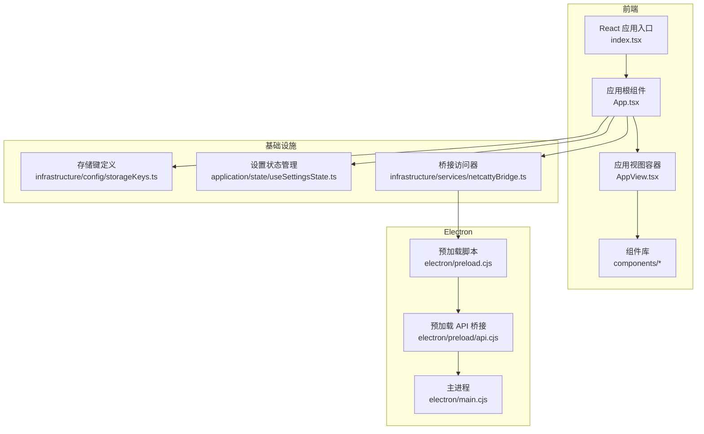
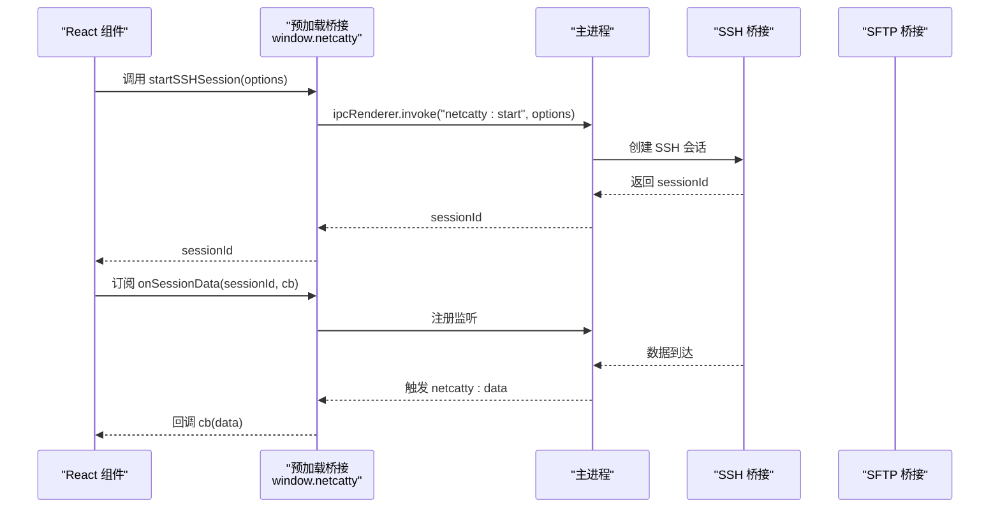
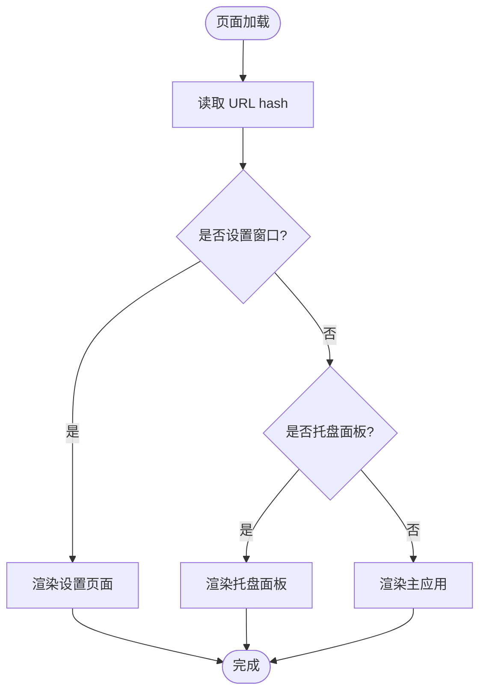
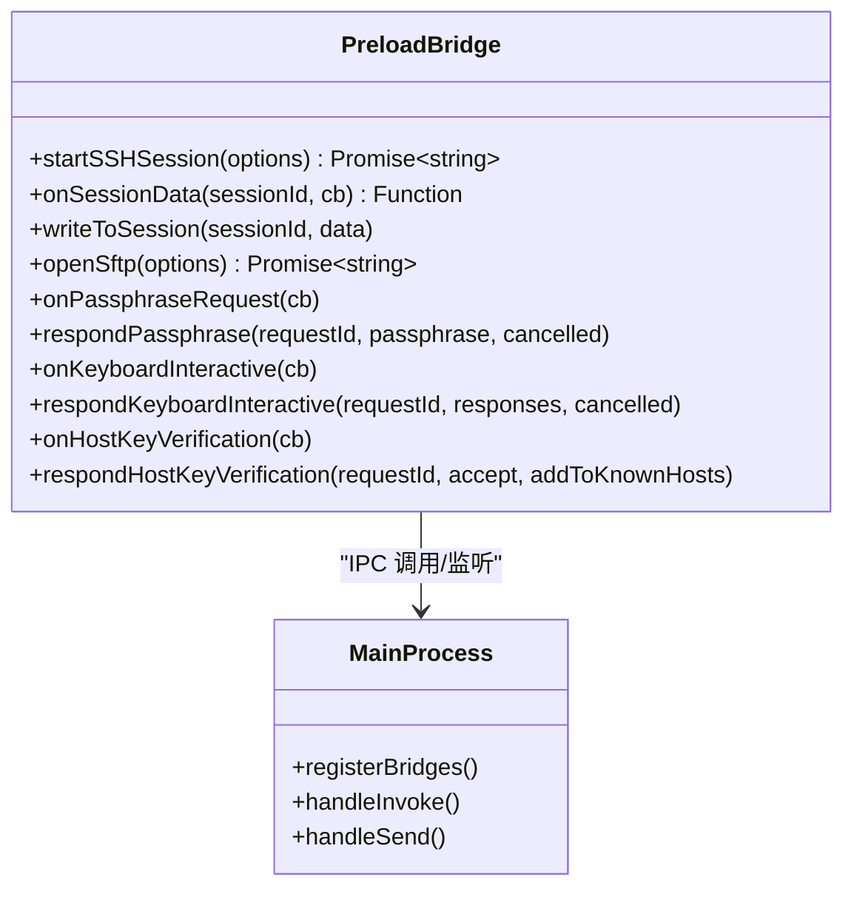
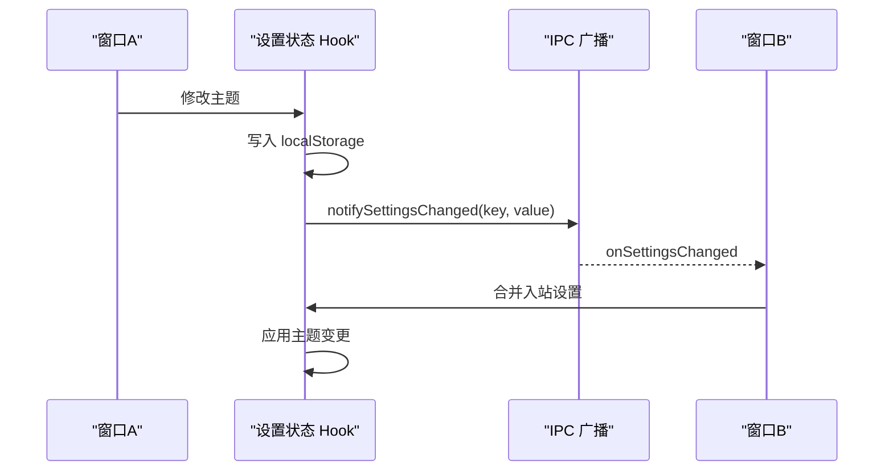
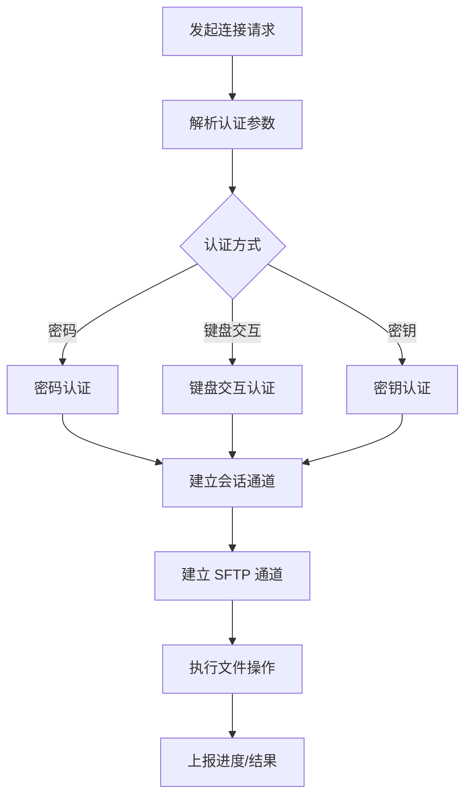
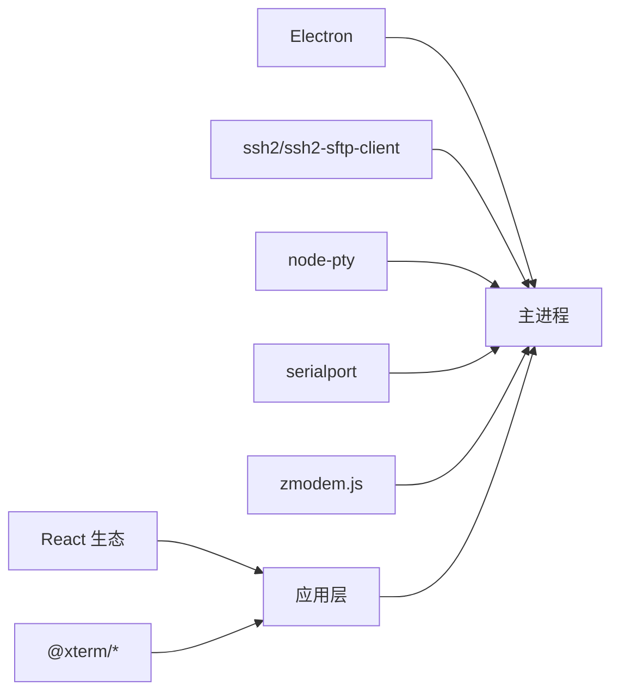

# 开发者文档

<cite>
**本文档引用的文件**
- [package.json](file://package.json)
- [README.md](file://README.md)
- [index.tsx](file://index.tsx)
- [App.tsx](file://App.tsx)
- [main.cjs](file://electron/main.cjs)
- [preload.cjs](file://electron/preload.cjs)
- [api.cjs](file://electron/preload/api.cjs)
- [AppView.tsx](file://application/app/AppView.tsx)
- [storageKeys.ts](file://infrastructure/config/storageKeys.ts)
- [useSettingsState.ts](file://application/state/useSettingsState.ts)
- [netcattyBridge.ts](file://infrastructure/services/netcattyBridge.ts)
- [sshBridge.cjs](file://electron/bridges/sshBridge.cjs)
- [sftpBridge.cjs](file://electron/bridges/sftpBridge.cjs)
</cite>

## 目录
1. [简介](#简介)
2. [项目结构](#项目结构)
3. [核心组件](#核心组件)
4. [架构总览](#架构总览)
5. [详细组件分析](#详细组件分析)
6. [依赖关系分析](#依赖关系分析)
7. [性能考虑](#性能考虑)
8. [故障排除指南](#故障排除指南)
9. [结论](#结论)
10. [附录](#附录)

## 简介
Netcatty 是一个基于 Electron + React + xterm.js 的现代化 SSH 客户端与终端管理器，支持主机分组、SFTP 文件浏览器、密钥管理、端口转发以及丰富的用户界面。项目采用模块化架构，将应用分为 application、components、domain、infrastructure、electron 等层次，清晰分离关注点，便于维护与扩展。

## 项目结构
项目采用前后端分离与模块化组织相结合的方式：
- 前端：React 应用入口与组件层，负责 UI、状态管理与用户交互
- 后端：Electron 主进程与预加载脚本，负责系统级能力（SSH、SFTP、本地文件系统、窗口管理等）
- 基础设施：领域模型、配置、持久化与服务层
- 应用层：应用启动、国际化、状态同步与业务编排

**图表来源**
- [index.tsx:1-134](file://index.tsx#L1-L134)
- [App.tsx:1-800](file://App.tsx#L1-L800)
- [main.cjs:1-800](file://electron/main.cjs#L1-L800)
- [preload.cjs:1-708](file://electron/preload.cjs#L1-L708)
- [api.cjs:1-800](file://electron/preload/api.cjs#L1-L800)
- [AppView.tsx:1-554](file://application/app/AppView.tsx#L1-L554)
- [storageKeys.ts:1-169](file://infrastructure/config/storageKeys.ts#L1-L169)
- [useSettingsState.ts:1-800](file://application/state/useSettingsState.ts#L1-L800)
- [netcattyBridge.ts:1-20](file://infrastructure/services/netcattyBridge.ts#L1-L20)

**章节来源**
- [package.json:1-120](file://package.json#L1-L120)
- [README.md:315-333](file://README.md#L315-L333)

## 核心组件
- 应用入口与路由：通过 hash 路由区分主窗口、设置窗口与托盘面板，使用 Suspense 实现懒加载
- 应用根组件：集中处理全局状态、热键、会话、同步、认证弹窗等
- 预加载桥接：在受控上下文中暴露安全的 IPC 接口给渲染进程
- 设置状态管理：统一管理主题、语言、终端设置、快捷键等，并通过 IPC 与其他窗口同步
- 存储键定义：集中管理所有持久化键名，避免硬编码与冲突

**章节来源**
- [index.tsx:88-134](file://index.tsx#L88-L134)
- [App.tsx:78-800](file://App.tsx#L78-L800)
- [preload.cjs:595-708](file://electron/preload.cjs#L595-L708)
- [useSettingsState.ts:99-800](file://application/state/useSettingsState.ts#L99-L800)
- [storageKeys.ts:1-169](file://infrastructure/config/storageKeys.ts#L1-L169)

## 架构总览
Netcatty 的架构围绕“前端 React 应用 + Electron 主进程 + 预加载桥接”的模式构建，通过 IPC 在渲染进程与主进程之间传递命令与事件，同时利用桥接对象统一暴露能力。

**图表来源**
- [api.cjs:18-21](file://electron/preload/api.cjs#L18-L21)
- [api.cjs:112-121](file://electron/preload/api.cjs#L112-L121)
- [main.cjs:103-108](file://electron/main.cjs#L103-L108)
- [sshBridge.cjs:1-200](file://electron/bridges/sshBridge.cjs#L1-L200)

**章节来源**
- [main.cjs:1-800](file://electron/main.cjs#L1-L800)
- [preload.cjs:1-708](file://electron/preload.cjs#L1-L708)
- [api.cjs:1-800](file://electron/preload/api.cjs#L1-L800)

## 详细组件分析

### 技术栈与架构决策
- 选择 Electron + React + xterm.js 的原因：
  - Electron 提供跨平台桌面能力与系统级权限
  - React 提供声明式 UI 与组件化开发体验
  - xterm.js 提供高性能终端渲染与插件生态
- 模块化架构理念：
  - application：应用启动、国际化、状态编排
  - components：可复用 UI 组件与业务组件
  - domain：领域模型与业务规则
  - infrastructure：配置、持久化、服务与适配器
  - electron：主进程、预加载桥接与 IPC 通道

**章节来源**
- [README.md:354-367](file://README.md#L354-L367)

### 应用启动与路由
- 前端入口根据 URL hash 切换不同视图（主窗口、设置窗口、托盘面板），使用 Suspense 与懒加载提升首屏性能
- 应用根组件集中处理热键、会话、同步、认证弹窗等全局逻辑

**图表来源**
- [index.tsx:88-134](file://index.tsx#L88-L134)

**章节来源**
- [index.tsx:1-134](file://index.tsx#L1-L134)
- [App.tsx:78-800](file://App.tsx#L78-L800)

### 预加载桥接与 IPC 设计
- 预加载脚本通过 contextBridge 暴露受控 API，仅在可信源（app://netcatty 或开发服务器）下生效
- 使用 Map/Set 管理会话级事件监听，确保生命周期内正确清理
- 将主进程事件转换为回调，简化渲染进程订阅

**图表来源**
- [preload.cjs:595-708](file://electron/preload.cjs#L595-L708)
- [api.cjs:1-800](file://electron/preload/api.cjs#L1-L800)
- [main.cjs:352-397](file://electron/main.cjs#L352-L397)

**章节来源**
- [preload.cjs:1-708](file://electron/preload.cjs#L1-L708)
- [api.cjs:1-800](file://electron/preload/api.cjs#L1-L800)
- [main.cjs:1-800](file://electron/main.cjs#L1-L800)

### 设置状态管理与跨窗口同步
- 使用自定义 Hook 管理主题、语言、终端设置、快捷键等
- 通过 localStorage 与 IPC 双向同步，保证多窗口一致性
- 支持“接收端去重”：避免重复广播与回环更新

**图表来源**
- [useSettingsState.ts:352-360](file://application/state/useSettingsState.ts#L352-L360)
- [useSettingsState.ts:539-564](file://application/state/useSettingsState.ts#L539-L564)
- [useSettingsState.ts:583-602](file://application/state/useSettingsState.ts#L583-L602)

**章节来源**
- [useSettingsState.ts:1-800](file://application/state/useSettingsState.ts#L1-L800)
- [storageKeys.ts:1-169](file://infrastructure/config/storageKeys.ts#L1-L169)

### SSH 与 SFTP 桥接实现
- SSH 桥接负责连接建立、认证（密码、键盘交互、密钥）、代理、X11 转发、算法协商等
- SFTP 桥接负责文件列表、读写、权限、编码检测与切换、上传进度与取消、跳板机链路等

**图表来源**
- [sshBridge.cjs:1-200](file://electron/bridges/sshBridge.cjs#L1-L200)
- [sftpBridge.cjs:1-200](file://electron/bridges/sftpBridge.cjs#L1-L200)

**章节来源**
- [sshBridge.cjs:1-200](file://electron/bridges/sshBridge.cjs#L1-L200)
- [sftpBridge.cjs:1-200](file://electron/bridges/sftpBridge.cjs#L1-L200)

### 数据模型与业务逻辑
- 类型导出统一从 domain/models 聚合，便于跨层引用
- 存储键集中定义，避免分散硬编码带来的维护成本
- 桥接访问器提供安全的桥接对象获取与错误处理

**章节来源**
- [types.ts:1-2](file://types.ts#L1-L2)
- [storageKeys.ts:1-169](file://infrastructure/config/storageKeys.ts#L1-L169)
- [netcattyBridge.ts:1-20](file://infrastructure/services/netcattyBridge.ts#L1-L20)

## 依赖关系分析
- 前端依赖：React、xterm.js、Radix UI、Monaco Editor 等
- Electron 依赖：ssh2、ssh2-sftp-client、node-pty、serialport、zmodem.js 等
- 构建工具：Vite、Electron Builder、Tailwind CSS

**图表来源**
- [package.json:38-87](file://package.json#L38-L87)
- [package.json:89-111](file://package.json#L89-L111)

**章节来源**
- [package.json:1-120](file://package.json#L1-L120)

## 性能考虑
- 预加载桥接中对事件监听进行集中管理，避免内存泄漏
- 渲染进程懒加载与 Suspense 提升首屏性能
- 终端渲染使用 xterm.js 插件（WebGL、搜索、链接等），按需启用以平衡性能与功能
- 多窗口设置同步采用“入站合并 + 去重签名”，减少不必要的广播与重绘

## 故障排除指南
- 桥接不可用：检查预加载脚本是否在可信源下运行，确认 window.netcatty 是否存在
- 会话数据不显示：确认 onSessionData 订阅是否正确注册，主进程是否正确发送 netcatty:data
- 设置不同步：检查 IPC 广播与入站合并逻辑，确认去重签名是否一致
- SSH/SFTP 连接失败：查看主进程日志与认证流程，确认密钥、代理与算法配置

**章节来源**
- [netcattyBridge.ts:1-20](file://infrastructure/services/netcattyBridge.ts#L1-L20)
- [preload.cjs:595-708](file://electron/preload.cjs#L595-L708)
- [useSettingsState.ts:539-564](file://application/state/useSettingsState.ts#L539-L564)

## 结论
Netcatty 通过 Electron + React + xterm.js 的组合，结合模块化架构与严格的 IPC 设计，在桌面端提供了强大的 SSH/SFTP 能力与优秀的用户体验。其清晰的层次划分、完善的桥接与状态同步机制，为后续扩展 AI 功能、云同步与更多协议支持奠定了坚实基础。

## 附录
- 开发环境搭建：安装 Node.js 与依赖，运行 npm run dev 启动 Vite + Electron
- 打包发布：使用 npm run pack 生成各平台安装包
- 调试技巧：利用预加载桥接的日志与错误处理，结合 Electron DevTools 进行断点调试

**章节来源**
- [README.md:280-351](file://README.md#L280-L351)