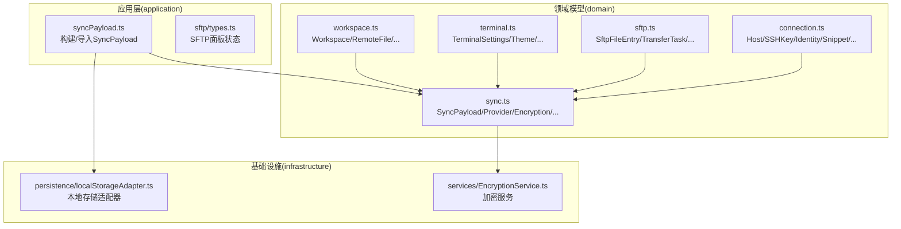
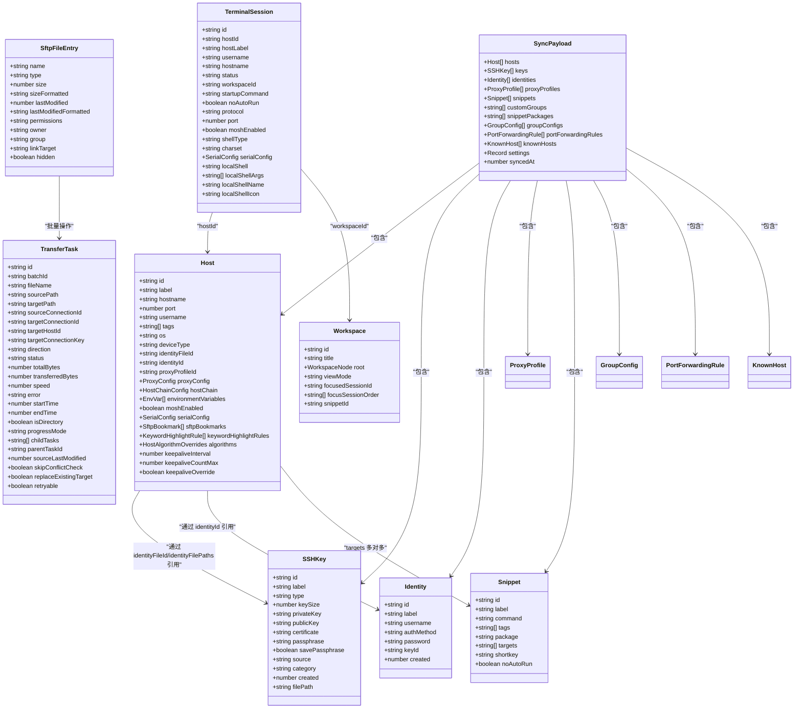
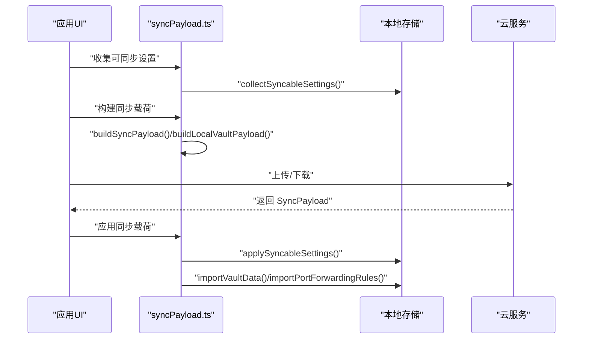
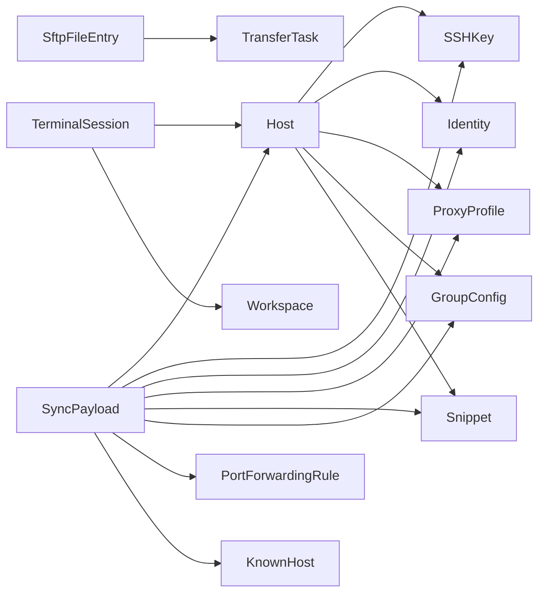

# 数据模型

<cite>
**本文引用的文件**
- [domain/models/connection.ts](file://domain/models/connection.ts)
- [domain/models/sftp.ts](file://domain/models/sftp.ts)
- [domain/models/terminal.ts](file://domain/models/terminal.ts)
- [domain/models/workspace.ts](file://domain/models/workspace.ts)
- [domain/models.ts](file://domain/models.ts)
- [domain/sync.ts](file://domain/sync.ts)
- [application/syncPayload.ts](file://application/syncPayload.ts)
- [application/state/sftp/types.ts](file://application/state/sftp/types.ts)
- [domain/host.ts](file://domain/host.ts)
- [domain/knownHosts.ts](file://domain/knownHosts.ts)
- [domain/credentials.ts](file://domain/credentials.ts)
</cite>

## 目录
1. [简介](#简介)
2. [项目结构](#项目结构)
3. [核心组件](#核心组件)
4. [架构总览](#架构总览)
5. [详细组件分析](#详细组件分析)
6. [依赖分析](#依赖分析)
7. [性能考虑](#性能考虑)
8. [故障排查指南](#故障排查指南)
9. [结论](#结论)
10. [附录](#附录)

## 简介
本文件系统性梳理 Netcatty 的核心数据模型与同步协议，聚焦以下实体：Host（主机）、TerminalSession（终端会话）、SSHKey（密钥）、SFTPFile（SFTP 文件条目）、SyncPayload（同步载荷）。文档将明确各实体的字段定义、数据类型、约束条件；解释实体间的关联关系（一对多、多对多）；给出数据模型图；说明数据验证与业务规则；并阐述序列化/反序列化与版本兼容策略。

## 项目结构
数据模型主要分布在 domain 层（领域模型）与 application 层（应用侧同步构建与导入），并通过基础设施层进行持久化与加密。

**图表来源**
- [domain/models/connection.ts:84-211](file://domain/models/connection.ts#L84-L211)
- [domain/models/sftp.ts:4-79](file://domain/models/sftp.ts#L4-L79)
- [domain/models/terminal.ts:233-338](file://domain/models/terminal.ts#L233-L338)
- [domain/models/workspace.ts:27-35](file://domain/models/workspace.ts#L27-L35)
- [domain/sync.ts:162-245](file://domain/sync.ts#L162-L245)
- [application/syncPayload.ts:643-735](file://application/syncPayload.ts#L643-L735)
- [application/state/sftp/types.ts:3-16](file://application/state/sftp/types.ts#L3-L16)

**章节来源**
- [domain/models.ts:1-8](file://domain/models.ts#L1-L8)
- [domain/sync.ts:1-562](file://domain/sync.ts#L1-L562)
- [application/syncPayload.ts:1-736](file://application/syncPayload.ts#L1-L736)

## 核心组件
本节从“实体-字段-类型-约束”的维度，逐项说明关键数据结构。

- Host（主机）
  - 字段要点：标识、标签、主机名、端口、用户名、组/标签、操作系统、设备类型、认证方法、代理/跳板链、环境变量、字符集、多协议配置、串口配置、SFTP 配置、关键字高亮覆盖、算法覆盖、SSH keepalive 覆盖、本地 shell 发现信息等。
  - 关键类型：协议枚举、串口配置、SFTP 书签、关键字高亮规则、算法覆盖、协议配置数组。
  - 约束与业务规则：协议默认值、串口参数合法范围、SFTP 编码枚举、关键字高亮规则的启用/禁用与自定义标记、算法覆盖仅在非空时生效、keepalive 可按主机覆盖。
  - 关联关系：与 SSHKey（通过 identityFileId 或 identityFilePaths 引用）、Identity（通过 identityId 引用）、ProxyProfile（通过 proxyProfileId 引用）存在一对一或外键关系；与 GroupConfig（按路径继承默认值）存在一对多继承关系；与 SftpBookmark 存在一对多关系。

- SSHKey（密钥）
  - 字段要点：标识、标签、类型（RSA/ECDSA/ED25519）、密钥大小、私钥、公钥、证书、口令、保存口令、来源（生成/导入/引用）、类别（密钥/证书/身份）、创建时间、文件路径。
  - 关键类型：KeySource、KeyCategory。
  - 约束与业务规则：类型与密钥大小的对应关系；私钥/口令可能为加密占位符；来源与类别用于区分密钥用途；可选文件路径用于外部文件引用。

- Identity（身份）
  - 字段要点：标识、标签、用户名、认证方式（密码/密钥/证书）、密码（可选）、密钥 ID（可选）。
  - 关联关系：与 SSHKey（通过 keyId 外键）存在一对一关系。

- Snippet（代码片段）
  - 字段要点：标识、标签、命令体（多行脚本）、标签/包/目标主机集合、快捷键、是否不自动执行。
  - 关联关系：与 Host（targets）存在多对多关系（通过 Host.targets 引用）。

- TerminalSession（终端会话）
  - 字段要点：标识、主机标识、主机标签、用户名、主机名、状态、工作区标识、启动命令、协议覆盖、端口覆盖、Mosh 开关、shell 类型、字符集覆盖、串口配置、本地 shell 发现信息。
  - 关联关系：与 Host（hostId）存在一对一关系；与 Workspace（workspaceId）存在一对一关系。

- SftpFileEntry（SFTP 文件条目）
  - 字段要点：名称、类型（文件/目录/符号链接）、大小、格式化大小、最后修改时间、格式化时间、权限、所有者/组、链接目标类型、隐藏属性（仅本地 Windows）。
  - 关联关系：与 SftpConnection（所属连接）存在一对多关系；与 SftpBookmark（全局/本地书签）存在一对多关系。

- TransferTask（传输任务）
  - 字段要点：标识、批次标识、文件名、源/目标路径、连接标识、方向、状态、总字节数、已传输字节数、速度、错误、开始/结束时间、是否目录、进度模式、父子任务、源最后修改时间缓存、冲突处理标志等。
  - 关联关系：与 SftpConnection（source/target）存在多对多关系；与 SftpFileEntry（批量操作）存在一对多关系。

- SyncPayload（同步载荷）
  - 字段要点：主机、密钥、身份、代理配置、代码片段、自定义分组、片段包、分组配置、端口转发规则、已知主机、设置、同步时间戳。
  - 关联关系：与 Host/SSHKey/Identity/ProxyProfile/Snippet/GroupConfig/PortForwardingRule/KnownHost 存在一对多关系；settings 中包含主题、终端、键盘、编辑器、SFTP、AI 等子域。

- Workspace（工作区）
  - 字段要点：标识、标题、根节点（pane/split）、视图模式、焦点会话、焦点顺序、片段来源。
  - 关联关系：与 TerminalSession（pane 中的 sessionId）存在一对多关系；与 Split（children）存在递归一对多关系。

**章节来源**
- [domain/models/connection.ts:84-211](file://domain/models/connection.ts#L84-L211)
- [domain/models/connection.ts:186-211](file://domain/models/connection.ts#L186-L211)
- [domain/models/connection.ts:213-222](file://domain/models/connection.ts#L213-L222)
- [domain/models/terminal.ts:316-338](file://domain/models/terminal.ts#L316-L338)
- [domain/models/sftp.ts:4-79](file://domain/models/sftp.ts#L4-L79)
- [domain/models/workspace.ts:27-35](file://domain/models/workspace.ts#L27-L35)
- [domain/sync.ts:162-245](file://domain/sync.ts#L162-L245)

## 架构总览
下图展示数据模型之间的依赖与继承层次，以及与同步流程的关系。

**图表来源**
- [domain/models/connection.ts:84-211](file://domain/models/connection.ts#L84-L211)
- [domain/models/connection.ts:186-211](file://domain/models/connection.ts#L186-L211)
- [domain/models/connection.ts:213-222](file://domain/models/connection.ts#L213-L222)
- [domain/models/terminal.ts:316-338](file://domain/models/terminal.ts#L316-L338)
- [domain/models/sftp.ts:4-79](file://domain/models/sftp.ts#L4-L79)
- [domain/sync.ts:162-245](file://domain/sync.ts#L162-L245)
- [domain/models/workspace.ts:27-35](file://domain/models/workspace.ts#L27-L35)

## 详细组件分析

### Host（主机）数据模型
- 字段与类型
  - 基本信息：id、label、hostname、port、username、tags、os、deviceType。
  - 认证与代理：identityId、identityFileId、authMethod、agentForwarding、x11Forwarding、proxyProfileId、proxyConfig、hostChain、environmentVariables、charset。
  - 协议与串口：protocols（多协议配置数组）、telnetEnabled/telnetPort/telnetUsername/telnetPassword、serialConfig。
  - SFTP：sftpSudo、sftpEncoding（枚举）、sftpBookmarks。
  - 主题与字体：theme/themeOverride、fontFamily/fontFamilyOverride、fontSize/fontSizeOverride、fontWeight/fontWeightOverride。
  - 设备检测与兼容：distro/distroMode/manualDistro、legacyAlgorithms、skipEcdsaHostKey、algorithms（算法覆盖）、keepaliveInterval/keepaliveCountMax/keepaliveOverride、backspaceBehavior、identityFilePaths、pinned、lastConnectedAt、localShell/localShellArgs/localShellName/localShellIcon。
- 约束与业务规则
  - protocols 数组中每个元素包含 protocol、port、enabled、可选 moshServerPath、可选 theme。
  - serialConfig 的字段具有严格的枚举/数值范围。
  - sftpEncoding 限定为 'auto' | 'utf-8' | 'gb18030'。
  - keywordHighlightRules 支持用户自定义与默认规则合并。
  - algorithms 每个分类（kex/cipher/hmac/serverHostKey/compress）为空数组或缺失时保持默认。
  - keepalive 可按主机覆盖，否则继承全局 TerminalSettings。
- 关联关系
  - 与 SSHKey：通过 identityFileId 或 identityFilePaths 引用本地/外部密钥文件。
  - 与 Identity：通过 identityId 引用统一的身份信息。
  - 与 ProxyProfile：通过 proxyProfileId 引用可复用代理配置。
  - 与 GroupConfig：按路径继承默认值（见 GroupConfig 字段）。
  - 与 SftpBookmark：一对多。

**章节来源**
- [domain/models/connection.ts:84-179](file://domain/models/connection.ts#L84-L179)

### SSHKey（密钥）数据模型
- 字段与类型
  - id、label、type（RSA/ECDSA/ED25519）、keySize、privateKey、publicKey、certificate、passphrase、savePassphrase、source（generated/imported/reference）、category（key/certificate/identity）、created、filePath。
- 约束与业务规则
  - type 与 keySize 存在典型组合；例如 RSA 常见 4096/2048/1024。
  - privateKey/passphrase 可能为加密占位符（见凭证模块）。
  - source 与 category 决定密钥用途与来源。
- 关联关系
  - 与 Identity：通过 keyId 外键建立一对一关系。

**章节来源**
- [domain/models/connection.ts:186-200](file://domain/models/connection.ts#L186-L200)

### Identity（身份）数据模型
- 字段与类型
  - id、label、username、authMethod（password/key/certificate）、password（可选）、keyId（可选）。
- 关联关系
  - 与 SSHKey：通过 keyId 外键建立一对一关系。

**章节来源**
- [domain/models/connection.ts:203-211](file://domain/models/connection.ts#L203-L211)

### Snippet（代码片段）数据模型
- 字段与类型
  - id、label、command（多行脚本）、tags、package、targets（主机 id 列表）、shortkey、noAutoRun。
- 关联关系
  - 与 Host：targets 与 Host.targets 形成多对多关系。

**章节来源**
- [domain/models/connection.ts:213-222](file://domain/models/connection.ts#L213-L222)

### TerminalSession（终端会话）数据模型
- 字段与类型
  - id、hostId、hostLabel、username、hostname、status（connecting/connected/disconnected）、workspaceId、startupCommand、noAutoRun、protocol/port/moshEnabled/shellType/charset、serialConfig、localShell/localShellArgs/localShellName/localShellIcon。
- 关联关系
  - 与 Host：hostId 外键。
  - 与 Workspace：workspaceId 外键。

**章节来源**
- [domain/models/terminal.ts:316-338](file://domain/models/terminal.ts#L316-L338)

### SFTPFileEntry（SFTP 文件条目）与 TransferTask（传输任务）
- SFTPFileEntry
  - name、type（file/directory/symlink）、size/sizeFormatted、lastModified/lastModifiedFormatted、permissions/owner/group/linkTarget、hidden。
- TransferTask
  - id、batchId、fileName、originalFileName、sourcePath、targetPath、sourceConnectionId、targetConnectionId、targetHostId、targetConnectionKey、direction（upload/download/remote-to-remote/local-copy）、status（pending/transferring/completed/failed/cancelled）、totalBytes、transferredBytes、speed、error、startTime、endTime、isDirectory、progressMode、childTasks、parentTaskId、sourceLastModified、skipConflictCheck、replaceExistingTarget、retryable。
- 关联关系
  - SftpFileEntry 与 TransferTask：批量传输场景下的一对多。
  - TransferTask 与 SftpConnection：通过 source/target 连接标识关联。

**章节来源**
- [domain/models/sftp.ts:4-79](file://domain/models/sftp.ts#L4-L79)

### SyncPayload（同步载荷）与应用侧构建/导入
- 字段与类型
  - hosts、keys、identities、proxyProfiles、snippets、customGroups、snippetPackages、groupConfigs、portForwardingRules、knownHosts、settings、syncedAt。
  - settings 包含主题/外观、终端、键盘、编辑器、SFTP、AI 等子域。
- 应用侧职责
  - 构建：buildSyncPayload/buildLocalVaultPayload 将本地数据打包为 SyncPayload，并清理端口转发规则的运行时状态。
  - 导入：applySyncPayload/applyLocalVaultPayload 将云端/本地备份导入到本地状态，调用 importers.importVaultData 与 importers.importPortForwardingRules。
  - 设置合并：collectSyncableSettings/applySyncableSettings 仅同步安全字段，合并终端设置以保留平台特定键。
  - 凭证保护：stripDeviceBoundApiKey 与 isEncryptedCredentialPlaceholder 在上传前移除设备绑定的加密占位符，避免泄露。
- 版本与兼容
  - SYNC_PAYLOAD_ENTITY_KEYS/CLOUD_SYNC_PAYLOAD_ENTITY_KEYS 定义可同步实体集合。
  - hasSyncPayloadEntityData 用于判断载荷是否包含有意义数据。
  - 自定义键盘绑定记录包含版本号，导入时更新版本。

**图表来源**
- [application/syncPayload.ts:292-427](file://application/syncPayload.ts#L292-L427)
- [application/syncPayload.ts:643-671](file://application/syncPayload.ts#L643-L671)
- [application/syncPayload.ts:723-735](file://application/syncPayload.ts#L723-L735)

**章节来源**
- [domain/sync.ts:162-245](file://domain/sync.ts#L162-L245)
- [application/syncPayload.ts:106-124](file://application/syncPayload.ts#L106-L124)
- [application/syncPayload.ts:292-427](file://application/syncPayload.ts#L292-L427)
- [application/syncPayload.ts:643-735](file://application/syncPayload.ts#L643-L735)

### Workspace（工作区）数据模型
- 字段与类型
  - id、title、root（WorkspaceNode：pane/split）、viewMode（split/focus）、focusedSessionId、focusSessionOrder、snippetId。
  - WorkspaceNode：pane（sessionId）或 split（direction/children/sizes）。
- 关联关系
  - 与 TerminalSession：pane 中的 sessionId 对应会话。

**章节来源**
- [domain/models/workspace.ts:11-35](file://domain/models/workspace.ts#L11-L35)

## 依赖分析
- 组件耦合与内聚
  - Host 与 SSHKey/Identity/ProxyProfile/GroupConfig 存在外键/引用关系，体现高内聚的认证与连接配置。
  - TerminalSession 与 Host/Workspace 解耦良好，便于会话与工作区独立演进。
  - SFTPFileEntry/TransferTask 与 SftpConnection 解耦，便于状态机与 UI 状态分离。
  - SyncPayload 作为聚合根，集中承载所有可同步实体，便于统一序列化与版本控制。
- 外部依赖
  - 同步加密：AES-256-GCM、PBKDF2/Argon2id、IV/salt 等。
  - 云服务：GitHub/GitHub Gist、Google Drive、OneDrive、WebDAV、S3 兼容存储。
- 循环依赖
  - 当前模型未发现循环依赖；如需扩展，建议通过接口抽象与工厂模式规避。

**图表来源**
- [domain/models/connection.ts:84-211](file://domain/models/connection.ts#L84-L211)
- [domain/models/terminal.ts:316-338](file://domain/models/terminal.ts#L316-L338)
- [domain/models/sftp.ts:4-79](file://domain/models/sftp.ts#L4-L79)
- [domain/sync.ts:162-245](file://domain/sync.ts#L162-L245)

**章节来源**
- [domain/models/connection.ts:84-211](file://domain/models/connection.ts#L84-L211)
- [domain/models/terminal.ts:316-338](file://domain/models/terminal.ts#L316-L338)
- [domain/models/sftp.ts:4-79](file://domain/models/sftp.ts#L4-L79)
- [domain/sync.ts:162-245](file://domain/sync.ts#L162-L245)

## 性能考虑
- SFTP 批量传输
  - TransferTask.childTasks 支持目录级并行/队列调度，减少往返次数。
  - sourceLastModified 缓存避免重复 stat，提升冲突检测效率。
- 终端设置合并
  - applySyncableSettings 采用“保留平台特定键”的合并策略，避免全量重写带来的 UI 抖动与无效渲染。
- 键盘绑定版本
  - 自定义键盘绑定记录包含版本号，导入时仅更新版本，降低存储与网络开销。

[本节为通用指导，无需具体文件分析]

## 故障排查指南
- 同步前凭证检查
  - 使用 isEncryptedCredentialPlaceholder 识别并移除设备绑定的加密占位符，防止上传不可解密数据。
  - findSyncPayloadEncryptedCredentialPaths 可扫描载荷中的敏感字段路径，提前拦截风险。
- 已知主机迁移
  - normalizeKnownHost/normalizeKnownHosts 自动补全指纹与密钥类型，避免连接时因字段缺失导致匹配失败。
- 端口转发规则清理
  - sanitizePortForwardingRulesForSync 在构建载荷时清理运行时状态字段（status/error/lastUsedAt），确保跨设备一致性。
- 同步设置冲突
  - mergeAiProvidersPreservingLocalApiKeys/mergeWebSearchConfigPreservingLocalApiKey 在应用设置时保留接收端本地凭据，避免误删。

**章节来源**
- [domain/credentials.ts:30-110](file://domain/credentials.ts#L30-L110)
- [domain/knownHosts.ts:153-192](file://domain/knownHosts.ts#L153-L192)
- [application/syncPayload.ts:126-150](file://application/syncPayload.ts#L126-L150)
- [application/syncPayload.ts:255-287](file://application/syncPayload.ts#L255-L287)

## 结论
Netcatty 的数据模型围绕“主机—认证—会话—传输—同步”主线展开，通过清晰的实体边界与外键关系实现高内聚低耦合。应用层通过 SyncPayload 统一构建与导入，结合凭证保护与设置合并策略，确保跨设备同步的安全与稳定。未来可在以下方面持续优化：引入更细粒度的版本号与迁移脚本、增强 SFTP 并发与断点续传策略、完善 AI 配置的增量合并与回滚机制。

[本节为总结性内容，无需具体文件分析]

## 附录

### 数据验证与业务规则清单
- Host
  - protocols 数组元素的 protocol/port/enabled 必填；可选 moshServerPath/theme。
  - serialConfig 的 path/baudRate 必填，其余字段有默认值。
  - sftpEncoding 限定枚举值。
  - algorithms 分类数组为空或缺失时使用默认。
  - keepalive 可按主机覆盖。
- SSHKey
  - type 与 keySize 存在典型组合；privateKey/passphrase 可能为加密占位符。
- Identity
  - authMethod 与 password/keyId 互斥。
- Snippet
  - targets 为 Host.id 列表，无重复校验由上层保证。
- TerminalSession
  - protocol/port/moshEnabled/shellType/charset 可覆盖 Host 默认。
- SFTPFileEntry/TransferTask
  - TransferTask.direction/status/progressMode 严格枚举。
- SyncPayload
  - settings 仅同步安全字段；knownHosts 在云同步中默认排除本地信任记录。

**章节来源**
- [domain/models/connection.ts:67-179](file://domain/models/connection.ts#L67-L179)
- [domain/models/connection.ts:186-211](file://domain/models/connection.ts#L186-L211)
- [domain/models/connection.ts:213-222](file://domain/models/connection.ts#L213-L222)
- [domain/models/terminal.ts:316-338](file://domain/models/terminal.ts#L316-L338)
- [domain/models/sftp.ts:4-79](file://domain/models/sftp.ts#L4-L79)
- [domain/sync.ts:162-245](file://domain/sync.ts#L162-L245)

### 序列化与反序列化
- 序列化
  - collectSyncableSettings：从 localStorage 读取并筛选可同步设置，构造 settings 子对象。
  - buildSyncPayload/buildLocalVaultPayload：聚合实体列表与 settings，添加 syncedAt 时间戳。
- 反序列化
  - applySyncableSettings：将 settings 合并写回 localStorage，保留平台特定键。
  - applySyncPayload/applyLocalVaultPayload：调用 importers 导入实体数据与端口转发规则。
- 凭证处理
  - stripDeviceBoundApiKey：上传前移除设备绑定的加密占位符。
  - isEncryptedCredentialPlaceholder：识别占位符，sanitizeCredentialValue：在连接边界替换为 undefined。

**章节来源**
- [application/syncPayload.ts:292-427](file://application/syncPayload.ts#L292-L427)
- [application/syncPayload.ts:643-735](file://application/syncPayload.ts#L643-L735)
- [domain/credentials.ts:30-52](file://domain/credentials.ts#L30-L52)

### 版本兼容策略
- 实体集合
  - SYNC_PAYLOAD_ENTITY_KEYS/CLOUD_SYNC_PAYLOAD_ENTITY_KEYS 明确可同步实体范围。
  - hasSyncPayloadEntityData 用于判断载荷是否包含有效数据。
- 设置合并
  - 仅同步安全字段（SYNCABLE_TERMINAL_KEYS），其余由本地保留。
  - 合并策略：新增键追加，已有键覆盖，平台特定键保留。
- 键盘绑定
  - 自定义键盘绑定记录包含版本号，导入时更新版本，避免回滚问题。
- AI 配置
  - 提供商与 Web 搜索配置在应用时保留本地 apiKey，避免凭据丢失。
  - pruneOrphanPerAgentBindings 清理孤儿代理/模型绑定，维持一致性。

**章节来源**
- [domain/sync.ts:247-283](file://domain/sync.ts#L247-L283)
- [application/syncPayload.ts:166-226](file://application/syncPayload.ts#L166-L226)
- [application/syncPayload.ts:433-564](file://application/syncPayload.ts#L433-L564)
- [application/syncPayload.ts:597-630](file://application/syncPayload.ts#L597-L630)