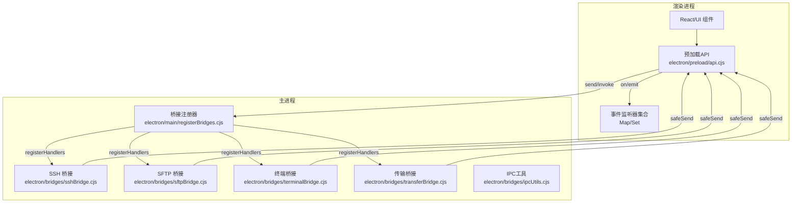
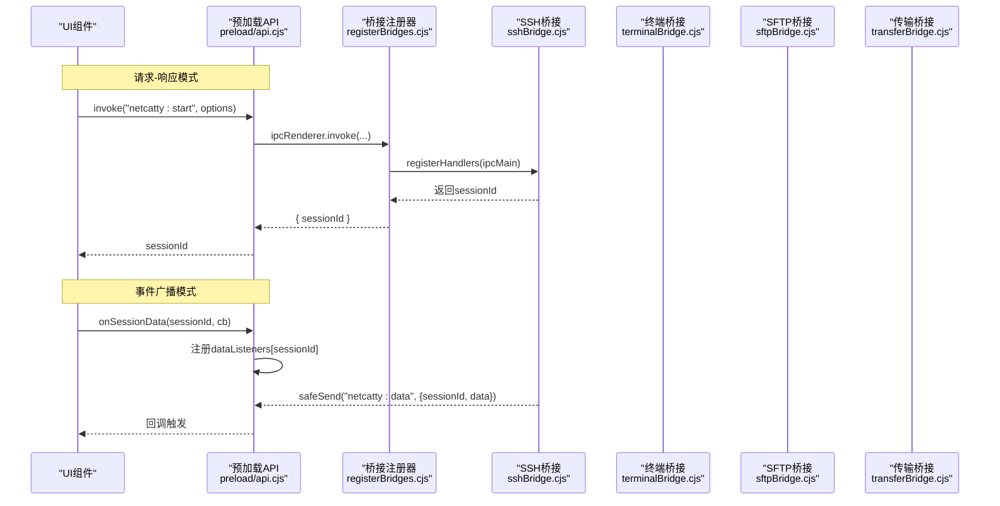
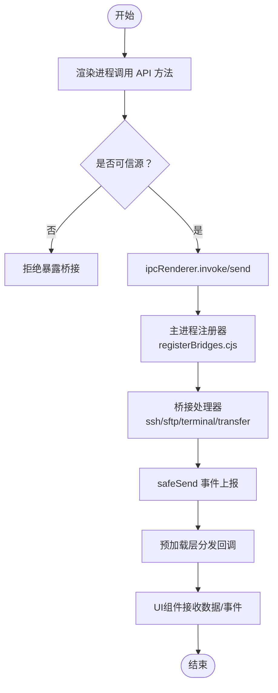
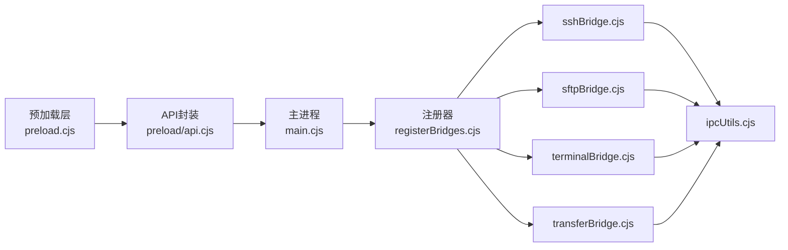

# IPC通信机制

<cite>
**本文档引用的文件**
- [electron/preload.cjs](file://electron/preload.cjs)
- [electron/preload/api.cjs](file://electron/preload/api.cjs)
- [electron/main.cjs](file://electron/main.cjs)
- [electron/main/registerBridges.cjs](file://electron/main/registerBridges.cjs)
- [electron/bridges/ipcUtils.cjs](file://electron/bridges/ipcUtils.cjs)
- [electron/bridges/sshBridge.cjs](file://electron/bridges/sshBridge.cjs)
- [electron/bridges/sftpBridge.cjs](file://electron/bridges/sftpBridge.cjs)
- [electron/bridges/terminalBridge.cjs](file://electron/bridges/terminalBridge.cjs)
- [electron/bridges/transferBridge.cjs](file://electron/bridges/transferBridge.cjs)
- [types/global/netcatty-bridge-session.d.ts](file://types/global/netcatty-bridge-session.d.ts)
- [types/global/netcatty-bridge-sftp.d.ts](file://types/global/netcatty-bridge-sftp.d.ts)
- [types/global/netcatty-bridge-ai.d.ts](file://types/global/netcatty-bridge-ai.d.ts)
</cite>

## 目录
1. [简介](#简介)
2. [项目结构](#项目结构)
3. [核心组件](#核心组件)
4. [架构总览](#架构总览)
5. [详细组件分析](#详细组件分析)
6. [依赖关系分析](#依赖关系分析)
7. [性能考量](#性能考量)
8. [故障排查指南](#故障排查指南)
9. [结论](#结论)

## 简介
本文件系统性阐述 Netcatty 的 IPC（进程间通信）机制，重点覆盖主进程与渲染进程之间的两类通信模式：请求-响应模式与事件广播模式；并深入解析 IPC 桥接层的设计原理，包括对底层 API 的封装与异步通信的处理策略。文档同时提供完整的消息传递流程图、错误处理机制说明、异步通信实现细节、性能优化建议与最佳实践，并给出常见通信场景的参考路径与调试技巧。

## 项目结构
Netcatty 的 IPC 架构由三层组成：
- 预加载层（Preload）：在渲染进程中暴露受控的 API，负责事件监听、回调分发与安全校验。
- 主进程桥接层（Main Bridges）：集中注册所有 IPC 处理器，协调底层资源（会话、SFTP、传输、终端等）。
- 类型与契约层（Type Definitions）：通过 TypeScript 接口定义 IPC 调用签名与事件结构，确保强类型约束。

图表来源
- [electron/preload.cjs](file://electron/preload.cjs)
- [electron/preload/api.cjs](file://electron/preload/api.cjs)
- [electron/main/registerBridges.cjs](file://electron/main/registerBridges.cjs)
- [electron/bridges/sshBridge.cjs](file://electron/bridges/sshBridge.cjs)
- [electron/bridges/sftpBridge.cjs](file://electron/bridges/sftpBridge.cjs)
- [electron/bridges/terminalBridge.cjs](file://electron/bridges/terminalBridge.cjs)
- [electron/bridges/transferBridge.cjs](file://electron/bridges/transferBridge.cjs)
- [electron/bridges/ipcUtils.cjs](file://electron/bridges/ipcUtils.cjs)

章节来源
- [electron/main.cjs](file://electron/main.cjs)
- [electron/main/registerBridges.cjs](file://electron/main/registerBridges.cjs)

## 核心组件
- 预加载 API（preload/api.cjs）
  - 提供统一的渲染侧入口，封装 invoke/send 调用、事件订阅与取消订阅、进度回调注册、跨窗口设置同步等能力。
  - 关键职责：将 Electron 原生 IPC 封装为易用的业务方法；维护事件监听器集合；处理回调清理与异常保护。
- 主进程桥接注册器（main/registerBridges.cjs）
  - 初始化各桥接模块并集中注册 IPC 处理器；提供安全存储、权限控制、临时目录管理等基础设施。
  - 关键职责：集中式注册；依赖注入；错误捕获与持久化；桥接模块生命周期管理。
- 底层桥接模块（bridges/*）
  - sshBridge、sftpBridge、terminalBridge、transferBridge 等，分别处理 SSH/SFTP/终端/传输等具体业务。
  - 关键职责：业务逻辑执行、事件上报、与预加载层的双向通信（invoke/send）。
- IPC 工具（bridges/ipcUtils.cjs）
  - 提供安全发送（safeSend），避免向已销毁的 WebContents 发送消息导致异常。

章节来源
- [electron/preload/api.cjs](file://electron/preload/api.cjs)
- [electron/main/registerBridges.cjs](file://electron/main/registerBridges.cjs)
- [electron/bridges/ipcUtils.cjs](file://electron/bridges/ipcUtils.cjs)

## 架构总览
下图展示了主进程与渲染进程之间典型的请求-响应与事件广播流程：

图表来源
- [electron/preload/api.cjs](file://electron/preload/api.cjs)
- [electron/main/registerBridges.cjs](file://electron/main/registerBridges.cjs)
- [electron/bridges/sshBridge.cjs](file://electron/bridges/sshBridge.cjs)
- [electron/bridges/terminalBridge.cjs](file://electron/bridges/terminalBridge.cjs)
- [electron/bridges/sftpBridge.cjs](file://electron/bridges/sftpBridge.cjs)
- [electron/bridges/transferBridge.cjs](file://electron/bridges/transferBridge.cjs)
- [electron/bridges/ipcUtils.cjs](file://electron/bridges/ipcUtils.cjs)

## 详细组件分析

### 预加载层（Preload）设计与实现
- 事件监听器集合
  - 使用 Map/Set 维护不同类型的事件监听器，如 dataListeners、exitListeners、transferProgressListeners 等，支持按 sessionId 或 transferId 进行分组与清理。
  - 在会话退出或传输完成时，自动清理对应监听器，防止内存泄漏。
- 数据过滤与缓冲
  - 对 PTY 输出进行 MCP 标记过滤与行缓冲，避免跨块边界导致的误判与漏报，保证 UI 显示的准确性。
- 安全暴露
  - 仅在可信源（app://netcatty 或开发服务器）下暴露 netcatty 对象，防止不受信任页面访问敏感 API。
- 请求-响应与事件广播
  - 通过 ipcRenderer.invoke 实现请求-响应；通过 ipcRenderer.on 实现事件广播；通过 api.* 方法统一封装调用与回调注册。

章节来源
- [electron/preload.cjs](file://electron/preload.cjs)
- [electron/preload/api.cjs](file://electron/preload/api.cjs)

### 主进程桥接层（Main Bridges）设计与实现
- 模块化注册
  - registerBridges 负责初始化各桥接模块并将处理器注册到 ipcMain，形成统一的处理入口。
- 依赖注入与共享状态
  - 向各桥接模块注入 sessions、sftpClients 等共享状态，确保跨模块协作。
- 安全与持久化
  - 使用 safeStorage 存储敏感信息（如云同步密码），并在读写失败时进行降级处理。
- 通用处理器
  - 提供应用信息查询、外部链接打开、文件选择对话框、临时文件管理等通用能力，统一由主进程代理，避免渲染进程直接操作系统资源。

章节来源
- [electron/main/registerBridges.cjs](file://electron/main/registerBridges.cjs)
- [electron/main.cjs](file://electron/main.cjs)

### 底层桥接模块（以 SSH/SFTP/Terminal/Transfer 为例）

#### SSH 桥接（sshBridge.cjs）
- 会话生命周期管理
  - 创建/关闭 SSH 会话、键盘交互认证、主机密钥验证、密钥口令处理等。
- 事件上报
  - 通过 safeSend 将会话数据、退出、认证失败、键盘交互等事件推送到预加载层。
- 编码与路径处理
  - 支持多种字符集编码，确保与远端系统的兼容性。

章节来源
- [electron/bridges/sshBridge.cjs](file://electron/bridges/sshBridge.cjs)
- [electron/bridges/ipcUtils.cjs](file://electron/bridges/ipcUtils.cjs)

#### SFTP 桥接（sftpBridge.cjs）
- 文件操作与编码
  - 列表、读写、重命名、权限修改、家目录获取等；内置编码检测与转换，避免中文路径乱码。
- 上传/下载进度与取消
  - 通过 transferBridge 协作实现带进度的流式传输；支持取消与清理。
- 跨模块协作
  - 与 fileWatcherBridge 协同实现自动同步功能。

章节来源
- [electron/bridges/sftpBridge.cjs](file://electron/bridges/sftpBridge.cjs)
- [electron/bridges/transferBridge.cjs](file://electron/bridges/transferBridge.cjs)

#### 终端桥接（terminalBridge.cjs）
- 本地 Shell、Telnet、Mosh、串口会话
  - 统一抽象终端会话，支持 PTY、串口、网络协议等多类后端。
- 自动登录与协议处理
  - 内置 Telnet 自动登录、Mosh 握手、ANSI 控制序列处理等。
- 输出缓冲与日志
  - 使用输出缓冲与会话日志管理，提升性能与可追溯性。

章节来源
- [electron/bridges/terminalBridge.cjs](file://electron/bridges/terminalBridge.cjs)

#### 传输桥接（transferBridge.cjs）
- 并发与节流
  - 采用并发读写与进度节流策略，平衡吞吐与 UI 响应。
- 隔离通道与空闲回收
  - 为下载场景建立隔离 SFTP 通道池，空闲通道定时回收，降低资源占用。
- 可取消命令执行
  - 通过关闭 exec 流实现远程命令的可取消执行，避免僵尸进程。

章节来源
- [electron/bridges/transferBridge.cjs](file://electron/bridges/transferBridge.cjs)

### IPC 桥接层设计原理
- 封装底层 API
  - 将 Electron 原生 IPC 抽象为业务语义明确的方法（如 startSSHSession、writeSftpBinaryWithProgress），隐藏底层细节。
- 异步通信处理
  - invoke 用于请求-响应；send 用于事件广播；结合 Map/Set 实现按标识符的回调分发与清理。
- 错误处理与健壮性
  - 在回调中使用 try/catch 包裹，避免单个监听器异常影响整体；在主进程侧通过 safeSend 防止向已销毁的 WebContents 发送消息。
- 类型契约保障
  - 通过 TypeScript 接口定义 IPC 方法签名与事件载荷，确保前后端一致。

章节来源
- [electron/preload/api.cjs](file://electron/preload/api.cjs)
- [electron/bridges/ipcUtils.cjs](file://electron/bridges/ipcUtils.cjs)
- [types/global/netcatty-bridge-session.d.ts](file://types/global/netcatty-bridge-session.d.ts)
- [types/global/netcatty-bridge-sftp.d.ts](file://types/global/netcatty-bridge-sftp.d.ts)
- [types/global/netcatty-bridge-ai.d.ts](file://types/global/netcatty-bridge-ai.d.ts)

### 请求-响应模式与事件广播模式

#### 请求-响应模式
- 典型流程
  - 渲染进程调用 api.startSSHSession(options) → ipcRenderer.invoke("netcatty:start", options) → 主进程 sshBridge 处理 → 返回 { sessionId }。
- 特点
  - 一对一通信，适合配置下发、状态查询、一次性任务。
  - 通过接口契约约束参数与返回值，便于测试与演进。

章节来源
- [electron/preload/api.cjs](file://electron/preload/api.cjs)
- [electron/main/registerBridges.cjs](file://electron/main/registerBridges.cjs)
- [electron/bridges/sshBridge.cjs](file://electron/bridges/sshBridge.cjs)

#### 事件广播模式
- 典型流程
  - 渲染进程调用 api.onSessionData(sessionId, cb) → 预加载层注册 dataListeners[sessionId]；sshBridge 通过 safeSend("netcatty:data", payload) 推送数据；预加载层分发给对应回调。
- 特点
  - 一对多通信，适合实时数据流（如会话输出、传输进度、认证事件）。
  - 需要配套的清理机制（会话退出、传输完成）避免内存泄漏。

章节来源
- [electron/preload.cjs](file://electron/preload.cjs)
- [electron/bridges/ipcUtils.cjs](file://electron/bridges/ipcUtils.cjs)

### 异步通信与错误处理
- 异步通信
  - invoke/invoke 链路天然异步；事件通过 Map/Set 分发，避免阻塞主线程。
- 错误处理
  - 预加载层：回调 try/catch；主进程：safeSend 防止已销毁 WebContents；桥接模块：捕获底层异常并上报。
- 资源清理
  - 会话退出、传输完成、窗口关闭时清理监听器与临时资源，防止内存泄漏。

章节来源
- [electron/preload.cjs](file://electron/preload.cjs)
- [electron/bridges/ipcUtils.cjs](file://electron/bridges/ipcUtils.cjs)

### 通信流程图（消息传递完整路径与数据流向）

图表来源
- [electron/preload.cjs](file://electron/preload.cjs)
- [electron/preload/api.cjs](file://electron/preload/api.cjs)
- [electron/main/registerBridges.cjs](file://electron/main/registerBridges.cjs)
- [electron/bridges/ipcUtils.cjs](file://electron/bridges/ipcUtils.cjs)

## 依赖关系分析
- 耦合与内聚
  - 预加载层与主进程桥接层通过 IPC 解耦；桥接模块内部高内聚，对外仅暴露注册接口。
- 直接与间接依赖
  - 预加载层依赖 Electron IPC 与上下文桥；主进程桥接层依赖各业务桥接模块；桥接模块依赖底层库（ssh2、ssh2-sftp-client、node-pty 等）。
- 循环依赖
  - 通过模块化与注册器避免循环依赖；共享状态通过依赖注入传递。
- 外部依赖与集成点
  - 与系统剪贴板、文件系统、网络协议、安全存储等集成；通过权限控制与沙箱策略保障安全。

图表来源
- [electron/preload.cjs](file://electron/preload.cjs)
- [electron/preload/api.cjs](file://electron/preload/api.cjs)
- [electron/main.cjs](file://electron/main.cjs)
- [electron/main/registerBridges.cjs](file://electron/main/registerBridges.cjs)
- [electron/bridges/ipcUtils.cjs](file://electron/bridges/ipcUtils.cjs)

章节来源
- [electron/main.cjs](file://electron/main.cjs)
- [electron/main/registerBridges.cjs](file://electron/main/registerBridges.cjs)

## 性能考量
- 消息序列化
  - 优先使用可序列化数据结构，避免函数、符号与循环引用；必要时进行 JSON 转换。
- 批量处理
  - 传输层采用并发读写与进度节流，减少 IPC 消息频率；对高频事件（如会话输出）进行去抖/限频。
- 内存管理
  - 严格清理监听器与临时资源；对长连接与大对象使用弱引用与延迟释放策略。
- I/O 优化
  - SFTP 传输使用固定块大小与并发度平衡吞吐；隔离通道池空闲回收降低资源占用。
- 线程与事件循环
  - 避免在回调中执行耗时操作；将重任务放入子线程或异步队列。

[本节为通用指导，无需特定文件引用]

## 故障排查指南
- 常见问题定位
  - 事件未到达：检查 sessionId 是否正确、预加载层监听器是否注册、主进程是否调用 safeSend。
  - 认证失败：查看键盘交互与主机密钥验证事件回调，确认用户输入与已知主机列表。
  - 传输中断：检查取消/错误事件回调，确认是否因网络波动或目标不可达。
- 调试技巧
  - 在预加载层打印回调触发与异常；在主进程桥接模块记录关键步骤与错误堆栈。
  - 使用最小复现场景（单一会话/传输）快速定位问题。
  - 利用类型定义核对 IPC 参数与返回值，避免类型不匹配导致的隐性错误。

章节来源
- [electron/preload.cjs](file://electron/preload.cjs)
- [electron/bridges/ipcUtils.cjs](file://electron/bridges/ipcUtils.cjs)

## 结论
Netcatty 的 IPC 体系通过“预加载 API + 主进程桥接 + 底层业务模块”的分层设计，实现了对 Electron 原生 IPC 的安全封装与业务抽象。请求-响应与事件广播两种模式覆盖了典型通信场景；桥接层以模块化与依赖注入实现高内聚低耦合；配合类型契约、安全发送与资源清理，构建了稳定可靠的跨进程通信机制。遵循本文的性能优化与最佳实践，可进一步提升系统在高并发与复杂业务下的稳定性与用户体验。