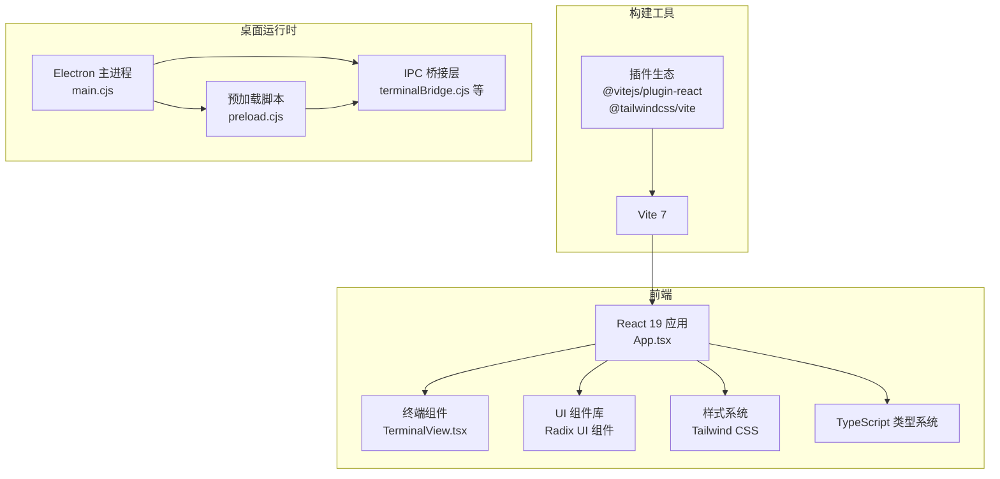
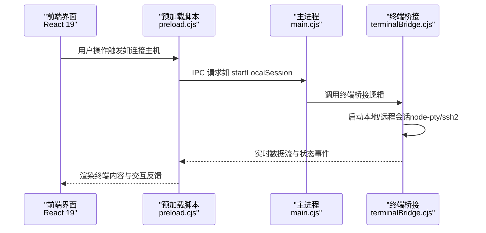
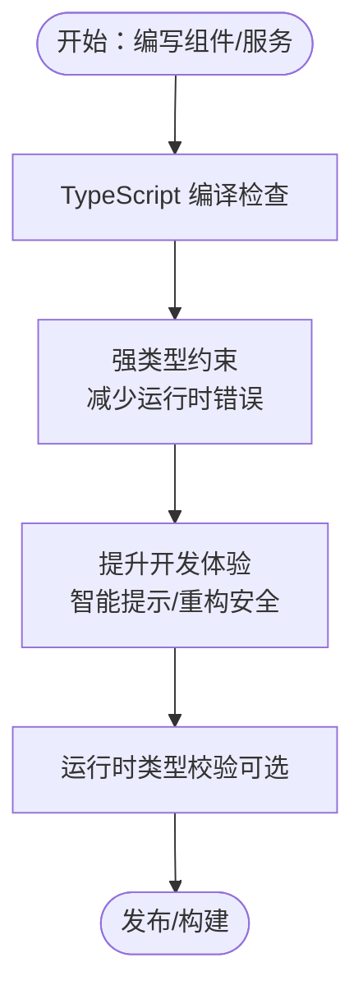
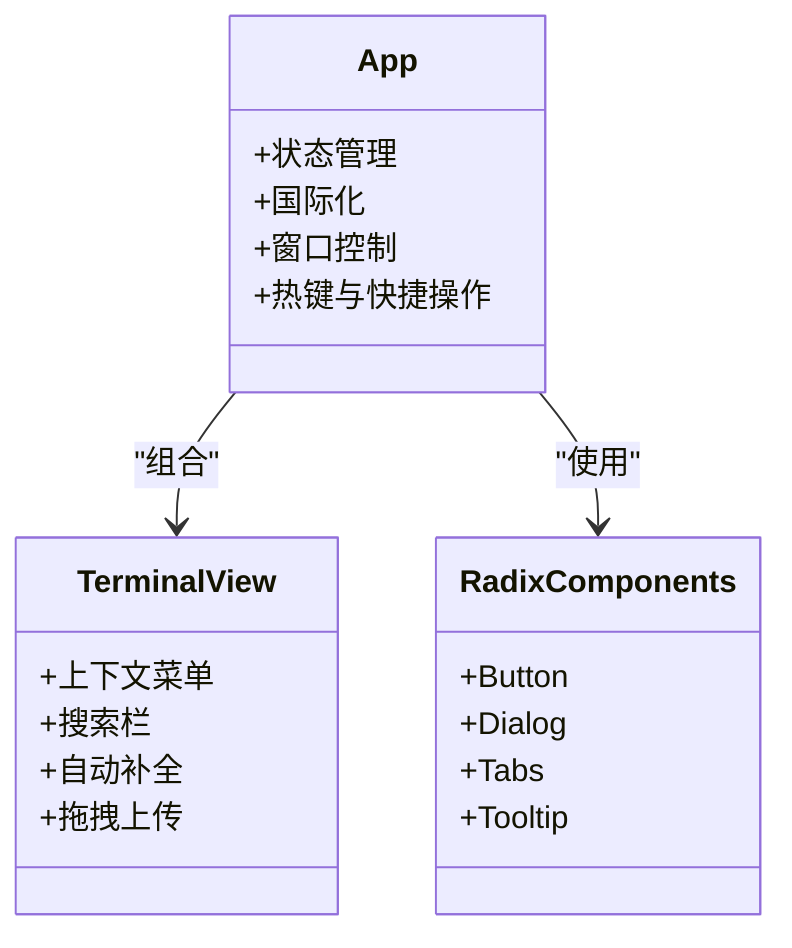
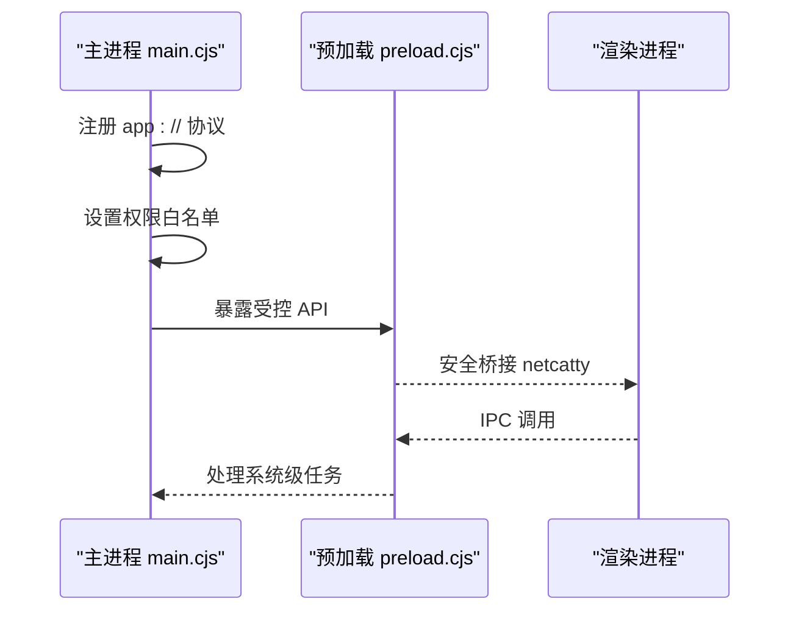
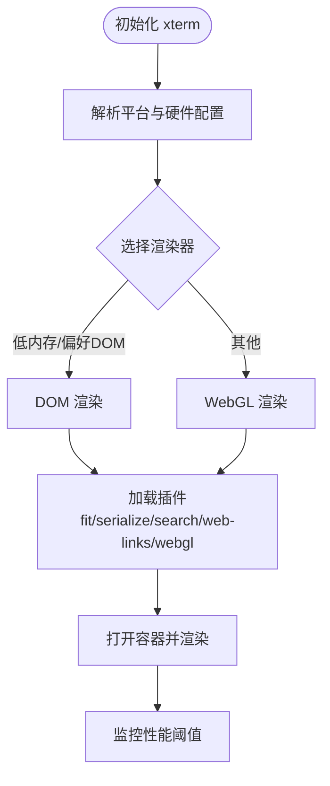
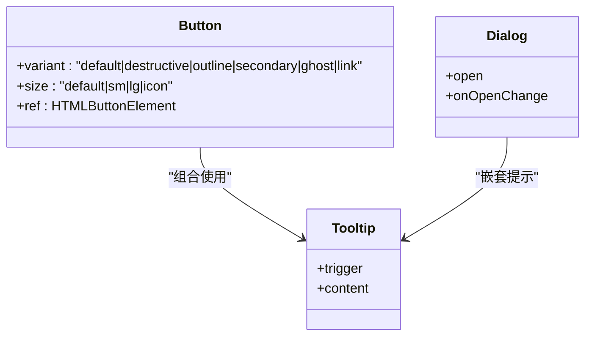
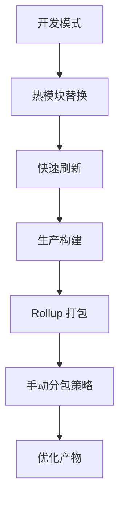
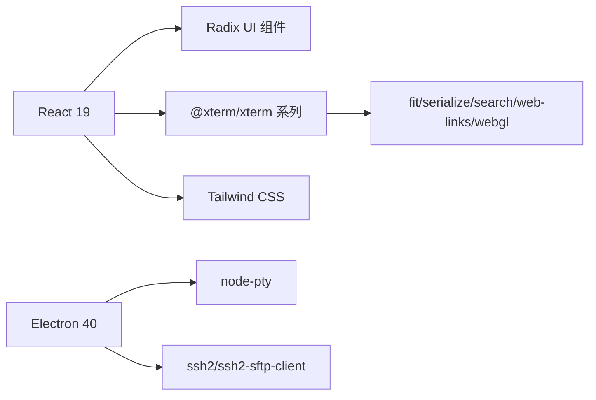

# 技术栈说明

<cite>
**本文档引用的文件**
- [package.json](file://package.json)
- [vite.config.ts](file://vite.config.ts)
- [tsconfig.json](file://tsconfig.json)
- [index.tsx](file://index.tsx)
- [App.tsx](file://App.tsx)
- [components/terminal/runtime/createXTermRuntime.ts](file://components/terminal/runtime/createXTermRuntime.ts)
- [components/terminal/TerminalView.tsx](file://components/terminal/TerminalView.tsx)
- [infrastructure/config/xtermPerformance.ts](file://infrastructure/config/xtermPerformance.ts)
- [electron/main.cjs](file://electron/main.cjs)
- [electron/preload.cjs](file://electron/preload.cjs)
- [electron/bridges/terminalBridge.cjs](file://electron/bridges/terminalBridge.cjs)
- [electron-builder.config.cjs](file://electron-builder.config.cjs)
- [components/ui/button.tsx](file://components/ui/button.tsx)
- [README.md](file://README.md)
</cite>

## 目录
1. [简介](#简介)
2. [项目结构](#项目结构)
3. [核心组件](#核心组件)
4. [架构总览](#架构总览)
5. [详细组件分析](#详细组件分析)
6. [依赖关系分析](#依赖关系分析)
7. [性能考量](#性能考量)
8. [故障排除指南](#故障排除指南)
9. [结论](#结论)
10. [附录](#附录)

## 简介
本技术栈说明面向Netcatty项目，系统阐述其核心技术选型与实现要点，重点覆盖以下方面：
- TypeScript在类型安全与开发体验上的优势
- React 19在组件化开发中的作用
- Electron在桌面应用开发中的价值
- @xterm/xterm在终端渲染中的关键地位
- Radix UI在UI组件库中的应用
- 构建工具Vite的选择理由及相关依赖
- 版本兼容性与升级策略
- 技术选型的决策依据与替代方案对比

## 项目结构
Netcatty采用前后端分离的桌面应用架构：前端基于React 19 + TypeScript，通过Vite进行开发与构建；后端（主进程）基于Electron，负责系统级能力、网络连接与跨平台打包。

**图表来源**
- [App.tsx:1-800](file://App.tsx#L1-L800)
- [vite.config.ts:1-84](file://vite.config.ts#L1-L84)
- [electron/main.cjs:1-800](file://electron/main.cjs#L1-L800)
- [electron/preload.cjs:1-708](file://electron/preload.cjs#L1-L708)

**章节来源**
- [README.md:354-368](file://README.md#L354-L368)

## 核心组件
- 前端框架与类型系统：React 19 + TypeScript，提供强类型约束与现代组件模型，提升开发效率与可维护性。
- 终端渲染引擎：@xterm/xterm 及其扩展（fit/search/serialize/web-links/webgl），支撑高性能终端显示与交互。
- UI组件库：Radix UI 提供语义化、可组合的基础组件，配合Tailwind CSS实现一致的视觉与交互体验。
- 构建工具链：Vite 7 提供快速开发服务器与高效生产构建，结合插件体系优化打包与性能。
- 桌面运行时：Electron 主进程负责窗口管理、协议注册、权限控制与打包分发；预加载脚本桥接安全的IPC通道。

**章节来源**
- [package.json:38-111](file://package.json#L38-L111)
- [vite.config.ts:1-84](file://vite.config.ts#L1-L84)
- [tsconfig.json:1-36](file://tsconfig.json#L1-L36)
- [README.md:354-368](file://README.md#L354-L368)

## 架构总览
下图展示从用户交互到系统调用的端到端流程，涵盖前端渲染、IPC通信与主进程处理：

**图表来源**
- [electron/preload.cjs:595-708](file://electron/preload.cjs#L595-L708)
- [electron/main.cjs:352-477](file://electron/main.cjs#L352-L477)
- [electron/bridges/terminalBridge.cjs:320-470](file://electron/bridges/terminalBridge.cjs#L320-L470)

## 详细组件分析

### TypeScript 在类型安全方面的优势
- 编译器选项：启用严格模式与模块解析，确保类型推导与导入路径一致性。
- 运行时类型保障：通过Zod等库在边界处进行运行时校验，降低异常传播风险。
- 代码组织：全局类型与模块路径别名（@/*）统一，便于大型项目维护。

**图表来源**
- [tsconfig.json:1-36](file://tsconfig.json#L1-L36)
- [package.json:89-111](file://package.json#L89-L111)

**章节来源**
- [tsconfig.json:1-36](file://tsconfig.json#L1-L36)
- [package.json:89-111](file://package.json#L89-L111)

### React 19 在组件化开发中的作用
- 组件组织：App.tsx作为根组件，集中管理状态、国际化与应用生命周期。
- 懒加载与路由：通过哈希路由与React.lazy实现多窗口（设置页、托盘面板）的按需加载。
- UI Provider：Toast与Tooltip等全局Provider贯穿应用，保证一致的用户体验。

**图表来源**
- [App.tsx:1-800](file://App.tsx#L1-L800)
- [components/terminal/TerminalView.tsx:1-638](file://components/terminal/TerminalView.tsx#L1-L638)
- [components/ui/button.tsx:1-39](file://components/ui/button.tsx#L1-L39)

**章节来源**
- [index.tsx:1-134](file://index.tsx#L1-L134)
- [App.tsx:1-800](file://App.tsx#L1-L800)

### Electron 在桌面应用开发中的价值
- 协议与窗口：注册自定义协议（app://）、窗口状态持久化与权限白名单控制。
- 安全沙箱：严格的IPC桥接与可信源校验，避免不安全导航暴露敏感API。
- 打包与分发：electron-builder配置多平台产物，支持签名、公证与增量更新。

**图表来源**
- [electron/main.cjs:67-278](file://electron/main.cjs#L67-L278)
- [electron/preload.cjs:659-708](file://electron/preload.cjs#L659-L708)
- [electron-builder.config.cjs:1-165](file://electron-builder.config.cjs#L1-L165)

**章节来源**
- [electron/main.cjs:1-800](file://electron/main.cjs#L1-L800)
- [electron/preload.cjs:1-708](file://electron/preload.cjs#L1-L708)
- [electron-builder.config.cjs:1-165](file://electron-builder.config.cjs#L1-L165)

### @xterm/xterm 在终端渲染中的重要性
- 性能优化：根据平台与设备内存动态选择DOM/WebGL渲染，限制滚动缓冲区大小，禁用光标闪烁等。
- 渲染扩展：Fit/Serialize/Search/WebLinks/WebGL等插件满足不同场景需求。
- 事件与回退：在WebGL上下文丢失或不可用时自动降级至Canvas/DOM渲染。

**图表来源**
- [infrastructure/config/xtermPerformance.ts:142-199](file://infrastructure/config/xtermPerformance.ts#L142-L199)
- [components/terminal/runtime/createXTermRuntime.ts:311-397](file://components/terminal/runtime/createXTermRuntime.ts#L311-L397)

**章节来源**
- [infrastructure/config/xtermPerformance.ts:1-199](file://infrastructure/config/xtermPerformance.ts#L1-L199)
- [components/terminal/runtime/createXTermRuntime.ts:311-397](file://components/terminal/runtime/createXTermRuntime.ts#L311-L397)

### Radix UI 在UI组件库中的应用
- 基础组件：Button、Dialog、Tabs、Tooltip等提供可组合、无障碍友好的基础能力。
- 设计一致性：与Tailwind CSS结合，统一间距、颜色与交互反馈。
- 可访问性：遵循ARIA规范，支持键盘导航与屏幕阅读器。

**图表来源**
- [components/ui/button.tsx:1-39](file://components/ui/button.tsx#L1-L39)

**章节来源**
- [components/ui/button.tsx:1-39](file://components/ui/button.tsx#L1-L39)

### 构建工具 Vite 的选择理由
- 开发体验：内置HMR、快速冷启动与零依赖安装，适合大型单页应用。
- 插件生态：React与Tailwind插件无缝集成，支持按需优化与产物拆分。
- 生产构建：Rollup底层，支持手动分包策略（vendor-radix/vendor-xterm/vendor-ai），降低首屏体积。

**图表来源**
- [vite.config.ts:21-84](file://vite.config.ts#L21-L84)

**章节来源**
- [vite.config.ts:1-84](file://vite.config.ts#L1-L84)

## 依赖关系分析
- 前端依赖：React 19、@xterm/xterm系列、Radix UI、Tailwind CSS、Lucide React等。
- 开发依赖：Vite 7、@vitejs/plugin-react、@tailwindcss/vite、TypeScript等。
- 可选依赖：Windows进程树工具，用于增强进程管理能力。
- 版本兼容：Electron 40、node-pty 1.1.0、ssh2-sftp-client等，确保跨平台稳定性。

**图表来源**
- [package.json:38-111](file://package.json#L38-L111)

**章节来源**
- [package.json:38-111](file://package.json#L38-L111)

## 性能考量
- 终端渲染：根据平台与设备内存选择DOM/WebGL渲染，限制滚动缓冲区，禁用光标闪烁，降低GPU/CPU占用。
- 构建优化：手动分包策略将稳定第三方库独立打包，提升缓存命中率；关闭SourceMap以减少产物体积。
- 运行时优化：主进程强制硬件加速与忽略GPU黑名单，确保跨平台渲染性能。
- 事件节流：终端resize与高亮扫描采用去抖策略，避免频繁重绘影响流畅度。

**章节来源**
- [infrastructure/config/xtermPerformance.ts:1-199](file://infrastructure/config/xtermPerformance.ts#L1-L199)
- [vite.config.ts:38-76](file://vite.config.ts#L38-L76)
- [electron/main.cjs:128-139](file://electron/main.cjs#L128-L139)

## 故障排除指南
- 终端无响应或卡顿：检查是否启用WebGL，若设备不支持则自动降级；适当降低滚动缓冲区与禁用光标闪烁。
- IPC桥接失败：确认预加载脚本对可信源的校验与允许的权限列表，避免不受信任来源加载。
- 打包问题：确保npmRebuild开启以适配Electron ABI；必要时清理node_modules重新安装。
- 窗口无法聚焦：检查主进程窗口状态与“最小化/隐藏”逻辑，确保焦点恢复路径正确。

**章节来源**
- [electron/preload.cjs:687-708](file://electron/preload.cjs#L687-L708)
- [electron/main.cjs:698-731](file://electron/main.cjs#L698-L731)
- [electron-builder.config.cjs:27-32](file://electron-builder.config.cjs#L27-L32)

## 结论
Netcatty的技术栈围绕“高性能终端 + 现代桌面体验”展开：TypeScript提供类型安全，React 19带来组件化与开发效率，Electron承载跨平台能力，@xterm/xterm确保终端渲染性能与兼容性，Radix UI与Tailwind CSS构建一致且可访问的UI体系，Vite提供高效的开发与构建体验。整体架构在功能丰富的同时兼顾性能与可维护性，适合长期演进与团队协作。

## 附录

### 版本兼容性与升级策略
- Electron：建议与node-pty保持ABI兼容，升级前验证本地PTY与SSH功能。
- React 19：关注新特性（如Suspense并发能力）对现有状态管理的影响，逐步迁移。
- Vite：升级时优先验证插件生态与Rollup配置，确保手动分包策略生效。
- @xterm/xterm：升级前测试WebGL/DOM渲染切换与插件兼容性，关注性能配置项变更。

**章节来源**
- [package.json:38-111](file://package.json#L38-L111)
- [electron-builder.config.cjs:27-32](file://electron-builder.config.cjs#L27-L32)

### 技术选型决策依据与替代方案对比
- React 19 vs 其他框架：更契合现有生态与团队经验，组件化与状态管理成熟。
- Electron vs Tauri：Electron生态完善、社区支持更好，Tauri在资源占用上更具优势但生态相对较小。
- @xterm/xterm vs 其他终端库：功能完备、社区活跃、插件丰富，适合复杂终端场景。
- Vite vs Webpack：开发体验与构建速度更优，生态与迁移成本更低。
- Radix UI vs Ant Design：更轻量、可组合性强，符合现代化设计语言与可访问性要求。

**章节来源**
- [README.md:354-368](file://README.md#L354-L368)
- [package.json:38-111](file://package.json#L38-L111)