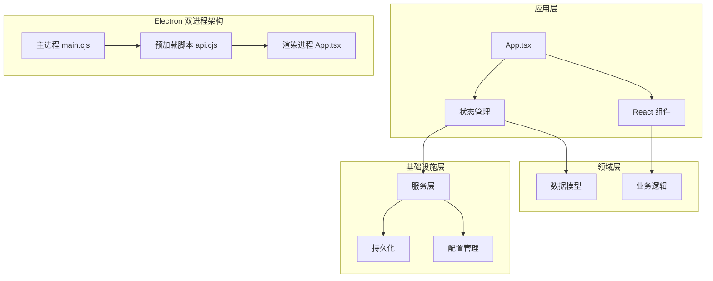
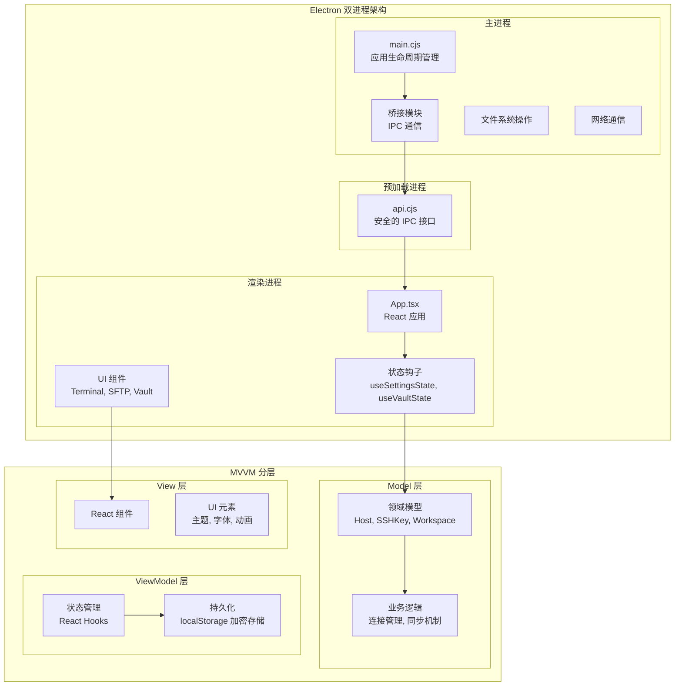
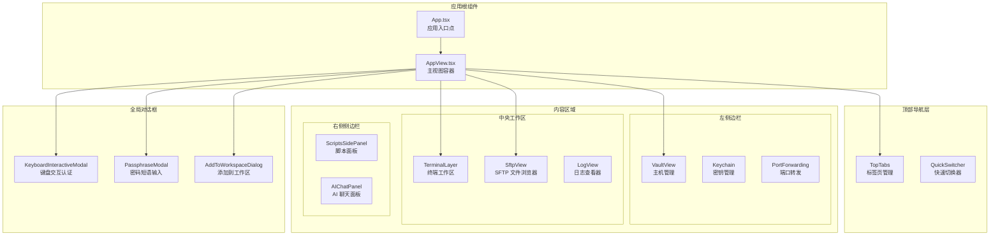
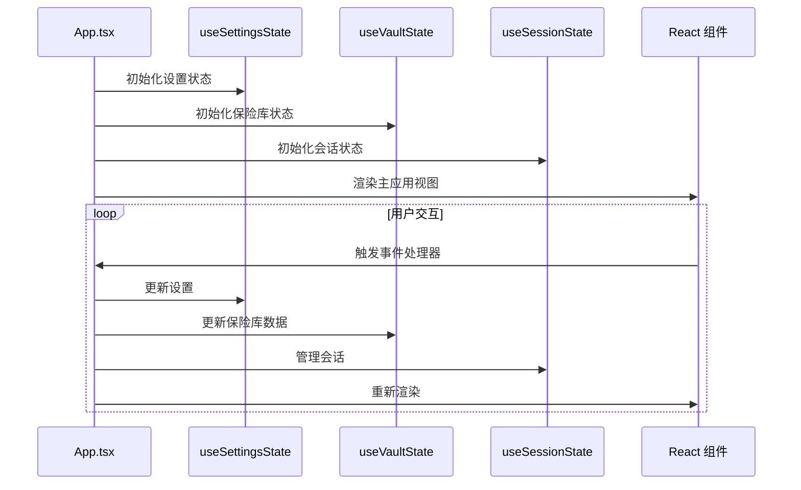
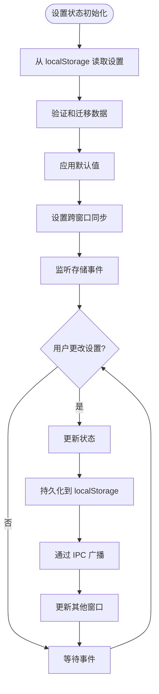
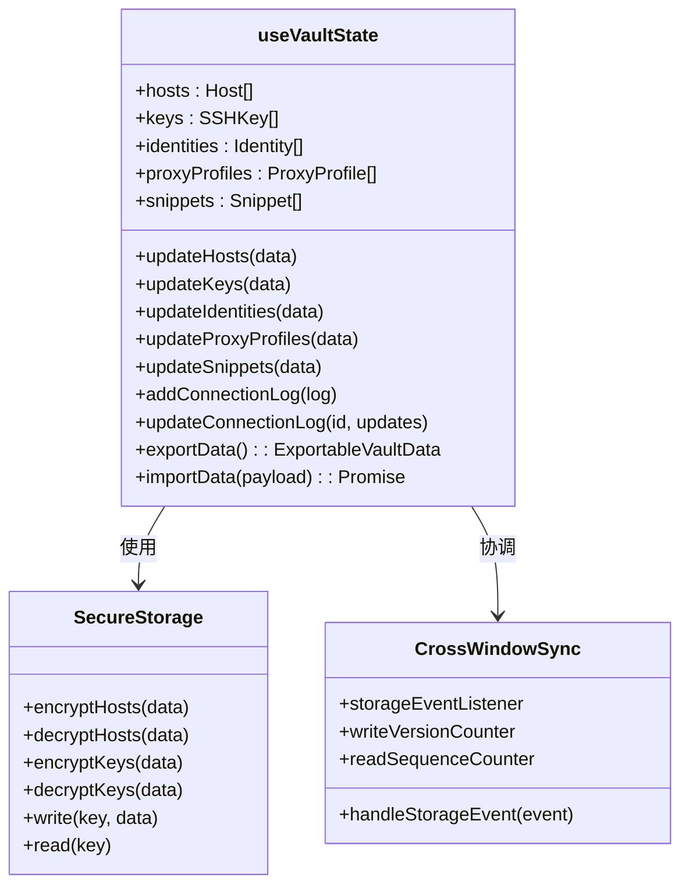
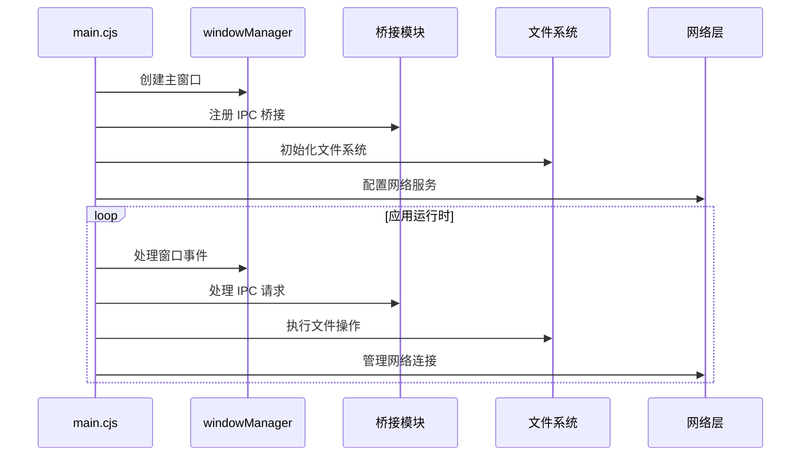
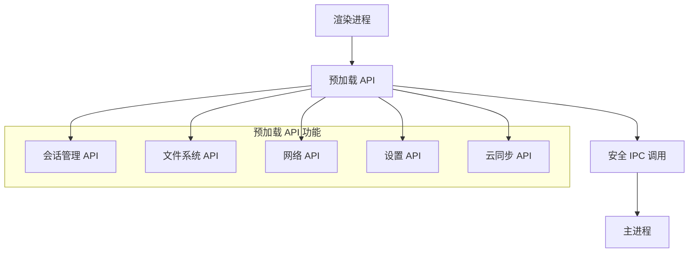
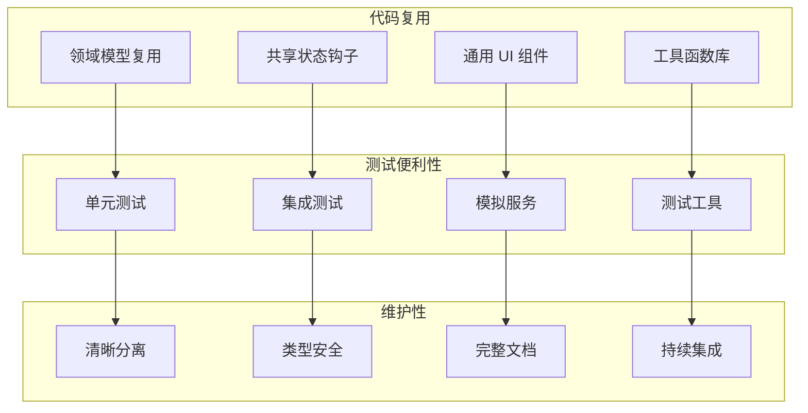
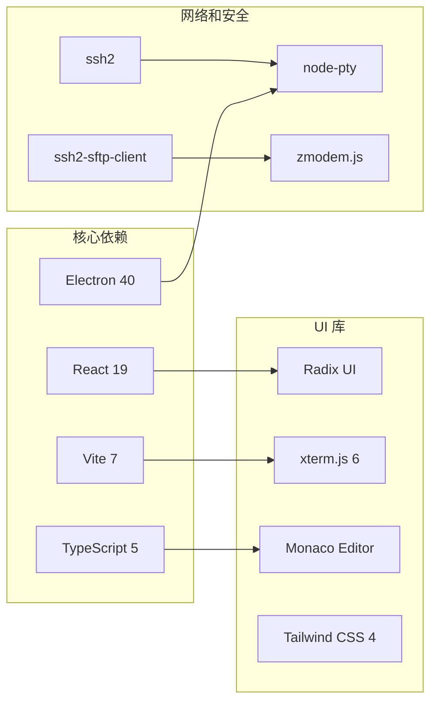

# 整体架构设计

<cite>
**本文档引用的文件**
- [App.tsx](file://App.tsx)
- [main.cjs](file://electron/main.cjs)
- [api.cjs](file://electron/preload/api.cjs)
- [useSettingsState.ts](file://application/state/useSettingsState.ts)
- [useVaultState.ts](file://application/state/useVaultState.ts)
- [AppView.tsx](file://application/app/AppView.tsx)
- [package.json](file://package.json)
- [README.md](file://README.md)
- [AGENTS.md](file://AGENTS.md)
</cite>

## 目录
1. [简介](#简介)
2. [项目结构](#项目结构)
3. [核心组件](#核心组件)
4. [架构总览](#架构总览)
5. [详细组件分析](#详细组件分析)
6. [依赖关系分析](#依赖关系分析)
7. [性能考虑](#性能考虑)
8. [故障排除指南](#故障排除指南)
9. [结论](#结论)

## 简介

Netcatty 是一个基于 Electron 和 React 的现代化 SSH 客户端，采用 MVVM 架构模式构建。该项目通过清晰的分层设计实现了前端应用的模块化组织，包括 Model 层的数据模型、View 层的 React 组件以及 ViewModel 层的状态管理。

该应用支持 SSH、Telnet、Mosh 和本地终端连接，提供主机分组、SFTP 文件浏览器、密钥管理、端口转发和丰富的用户界面功能。项目采用 TypeScript 进行类型安全开发，并使用 Vite 作为构建工具。

## 项目结构

Netcatty 采用了清晰的分层架构，主要包含以下核心目录：

**图表来源**
- [App.tsx:1-969](file://App.tsx#L1-L969)
- [main.cjs:1-879](file://electron/main.cjs#L1-L879)
- [api.cjs:1-928](file://electron/preload/api.cjs#L1-L928)

### 核心目录说明

- **application/**: 应用程序状态管理和国际化处理
- **components/**: React UI 组件库
- **domain/**: 领域模型和业务逻辑
- **infrastructure/**: 基础设施服务和配置
- **electron/**: Electron 主进程和渲染进程代码
- **application/state/**: React Hooks 状态管理

**章节来源**
- [README.md:315-332](file://README.md#L315-L332)
- [package.json:1-120](file://package.json#L1-L120)

## 核心组件

### MVVM 架构模式实现

Netcatty 严格遵循 MVVM（Model-View-ViewModel）架构模式：

#### Model 层（数据模型）
- **domain/models/**: 定义核心实体如 Host、SSHKey、Snippet、Workspace
- **domain/host.ts**: 主机信息处理和标准化
- **domain/workspace.ts**: 工作区树操作（分割、插入、删除、尺寸调整）

#### View 层（React 组件）
- **components/**: 包含所有 UI 组件，如 Terminal、SftpView、VaultView
- **application/app/AppView.tsx**: 主应用视图容器
- **components/VaultView.tsx**: 主机管理视图

#### ViewModel 层（状态管理）
- **application/state/**: React Hooks 实现的状态管理
- **useSettingsState.ts**: 设置状态管理
- **useVaultState.ts**: 保险库状态管理
- **useSessionState.ts**: 会话状态管理

**章节来源**
- [AGENTS.md:1-23](file://AGENTS.md#L1-L23)
- [useSettingsState.ts:1-970](file://application/state/useSettingsState.ts#L1-L970)
- [useVaultState.ts:1-811](file://application/state/useVaultState.ts#L1-L811)

## 架构总览

Netcatty 采用 Electron 双进程架构，结合 MVVM 模式实现完整的桌面应用程序：

**图表来源**
- [main.cjs:1-879](file://electron/main.cjs#L1-L879)
- [api.cjs:1-928](file://electron/preload/api.cjs#L1-L928)
- [App.tsx:1-969](file://App.tsx#L1-L969)

### 前端应用组织结构

前端应用采用模块化的组件层次结构：

**图表来源**
- [AppView.tsx:1-554](file://application/app/AppView.tsx#L1-L554)
- [App.tsx:1-969](file://App.tsx#L1-L969)

## 详细组件分析

### 应用入口点（App.tsx）

App.tsx 作为整个应用的入口点，负责协调各个状态管理钩子和组件：

**图表来源**
- [App.tsx:1-969](file://App.tsx#L1-L969)

### 状态管理策略

#### 设置状态管理（useSettingsState）

设置状态管理采用集中式存储和跨窗口同步机制：

**图表来源**
- [useSettingsState.ts:1-970](file://application/state/useSettingsState.ts#L1-L970)

#### 保险库状态管理（useVaultState）

保险库状态管理实现了加密存储和跨窗口同步：

**图表来源**
- [useVaultState.ts:1-811](file://application/state/useVaultState.ts#L1-L811)

**章节来源**
- [useSettingsState.ts:1-970](file://application/state/useSettingsState.ts#L1-L970)
- [useVaultState.ts:1-811](file://application/state/useVaultState.ts#L1-L811)

### Electron 双进程架构

#### 主进程（main.cjs）

主进程负责应用程序的生命周期管理和底层系统操作：

**图表来源**
- [main.cjs:1-879](file://electron/main.cjs#L1-L879)

#### 预加载脚本（api.cjs）

预加载脚本提供了安全的 IPC 接口给渲染进程：

**图表来源**
- [api.cjs:1-928](file://electron/preload/api.cjs#L1-L928)

**章节来源**
- [main.cjs:1-879](file://electron/main.cjs#L1-L879)
- [api.cjs:1-928](file://electron/preload/api.cjs#L1-L928)

## 依赖关系分析

### 模块化设计优势

Netcatty 的模块化设计带来了显著的优势：

### 关键依赖关系

**图表来源**
- [package.json:38-87](file://package.json#L38-L87)

**章节来源**
- [package.json:1-120](file://package.json#L1-L120)

## 性能考虑

### 状态管理优化

1. **写入版本控制**: 使用写入版本计数器防止异步写入覆盖较新的数据
2. **读取序列控制**: 使用读取序列计数器避免多个存储事件的竞态条件
3. **跨窗口同步**: 通过 IPC 机制实现实时状态同步
4. **加密存储**: 对敏感数据进行加密存储，确保数据安全

### 渲染性能优化

1. **组件记忆化**: 使用 React.memo 优化组件重渲染
2. **状态分离**: 将不同领域的状态分离到独立的钩子中
3. **懒加载**: 使用 React.lazy 实现组件的按需加载
4. **虚拟滚动**: 对大型列表使用虚拟滚动技术

## 故障排除指南

### 常见问题及解决方案

#### Electron 应用启动问题

1. **应用无法启动**: 检查主进程是否正确加载
2. **窗口显示异常**: 验证窗口管理器配置
3. **IPC 通信失败**: 确认预加载脚本正确注册

#### 状态同步问题

1. **设置不同步**: 检查 IPC 广播机制
2. **保险库数据不一致**: 验证加密/解密流程
3. **跨窗口状态冲突**: 检查版本控制机制

#### 性能问题

1. **内存泄漏**: 检查事件监听器的清理
2. **渲染卡顿**: 优化组件重渲染
3. **存储访问慢**: 实施缓存策略

**章节来源**
- [main.cjs:490-502](file://electron/main.cjs#L490-L502)
- [useVaultState.ts:566-690](file://application/state/useVaultState.ts#L566-L690)

## 结论

Netcatty 的整体架构设计体现了现代桌面应用开发的最佳实践。通过 MVVM 架构模式和 Electron 双进程架构的结合，实现了良好的代码组织、可维护性和扩展性。

### 主要成就

1. **清晰的分层设计**: Model-View-ViewModel 的明确分离
2. **模块化组织**: 各个层级职责明确，便于维护和测试
3. **安全的架构**: Electron 的安全沙箱和预加载机制
4. **高性能实现**: 优化的状态管理和渲染策略
5. **强大的功能**: 支持多种连接协议和丰富的 UI 功能

### 技术亮点

- **MVVM 模式的成功应用**: 在桌面应用中有效实现了关注点分离
- **Electron 架构的充分利用**: 充分发挥主进程和渲染进程的优势
- **状态管理的创新**: 结合 React Hooks 和传统 MVVM 模式的优点
- **安全性考虑**: 从架构层面确保应用的安全性

这个架构为 Netcatty 提供了坚实的基础，使其能够持续发展并支持更多高级功能，同时保持代码的可维护性和性能表现。