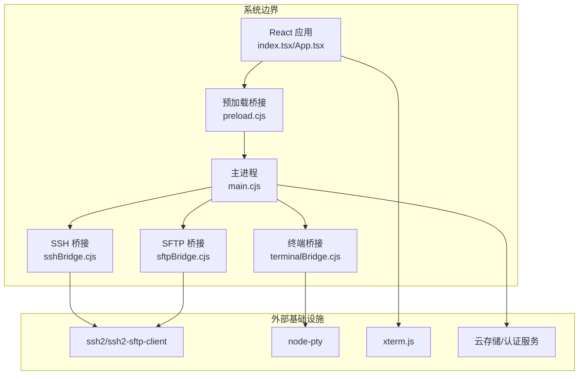
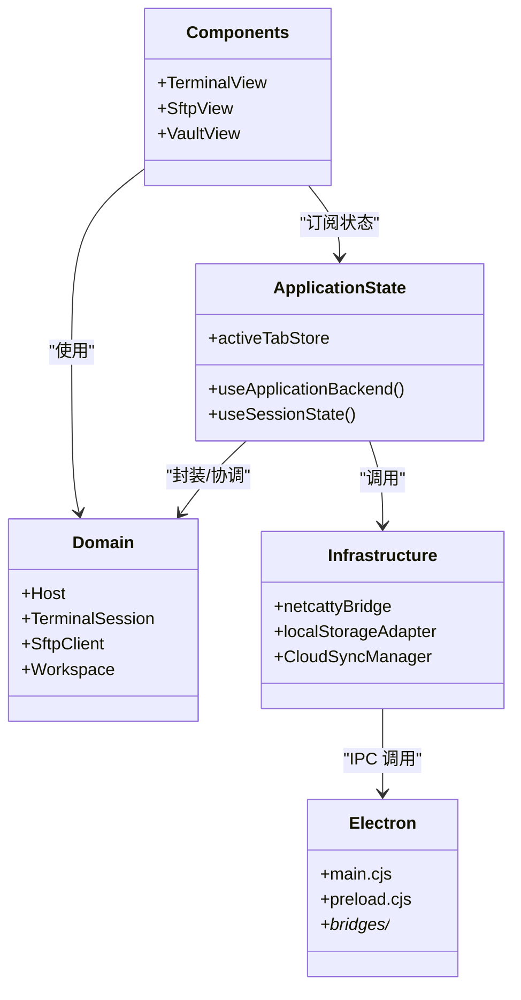
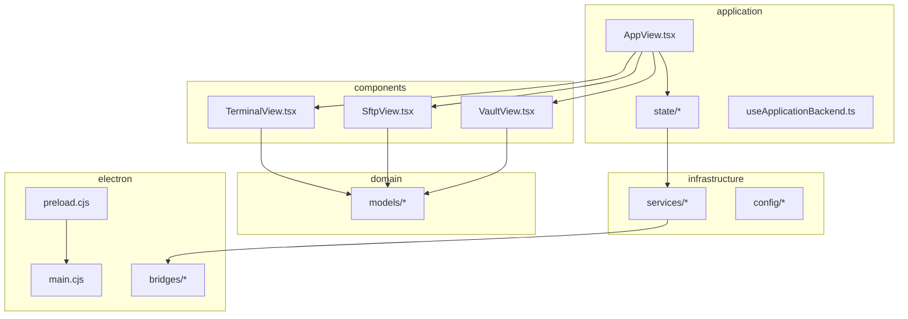
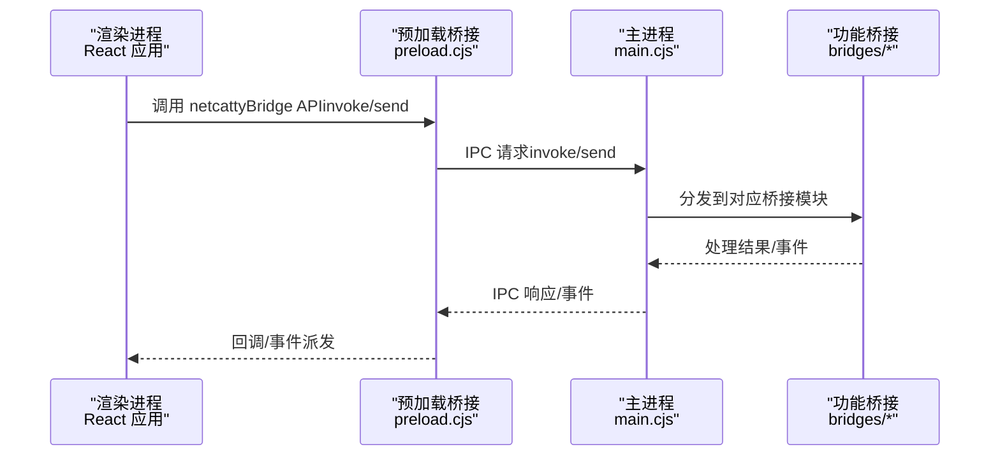
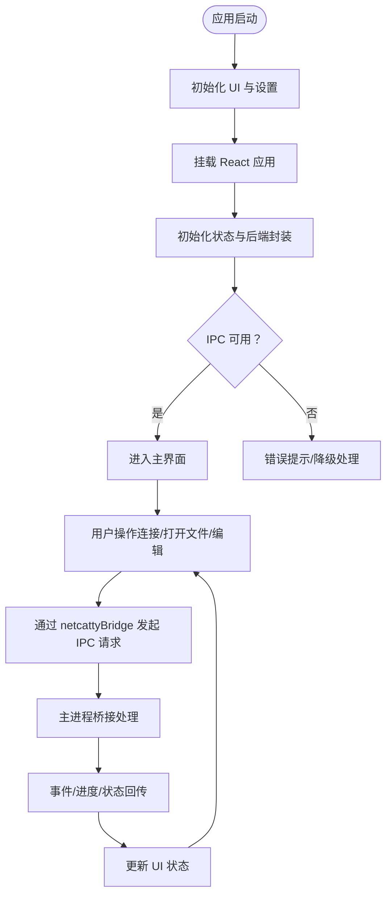
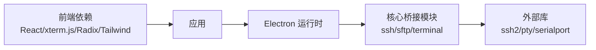

# 架构概览

<cite>
**本文档引用的文件**
- [package.json](file://package.json)
- [README.md](file://README.md)
- [index.tsx](file://index.tsx)
- [App.tsx](file://App.tsx)
- [main.cjs](file://electron/main.cjs)
- [preload.cjs](file://electron/preload.cjs)
- [api.cjs](file://electron/preload/api.cjs)
- [AppView.tsx](file://application/app/AppView.tsx)
- [useApplicationBackend.ts](file://application/state/useApplicationBackend.ts)
- [netcattyBridge.ts](file://infrastructure/services/netcattyBridge.ts)
- [storageKeys.ts](file://infrastructure/config/storageKeys.ts)
- [activeTabStore.ts](file://application/state/activeTabStore.ts)
- [sshBridge.cjs](file://electron/bridges/sshBridge.cjs)
- [terminalBridge.cjs](file://electron/bridges/terminalBridge.cjs)
- [sftpBridge.cjs](file://electron/bridges/sftpBridge.cjs)
</cite>

## 目录
1. [简介](#简介)
2. [项目结构](#项目结构)
3. [核心组件](#核心组件)
4. [架构总览](#架构总览)
5. [详细组件分析](#详细组件分析)
6. [依赖关系分析](#依赖关系分析)
7. [性能考虑](#性能考虑)
8. [故障排除指南](#故障排除指南)
9. [结论](#结论)

## 简介
本项目是一个基于 Electron + React + xterm.js 的现代化 SSH 客户端与终端管理器，支持多平台（macOS、Windows、Linux），提供主机分组、SFTP 文件浏览器、密钥管理、端口转发以及丰富的终端工作区功能。项目采用模块化分层架构，通过 MVVM 模式实现 Model-View-ViewModel 的清晰分离，并通过 IPC 桥接在渲染进程与主进程之间进行安全高效的数据与控制流传递。

## 项目结构
项目采用“分层 + 功能域”的组织方式：
- application：应用状态与国际化，包含 MVVM 中 ViewModel 层的实现（如 useApplicationBackend、useSessionState 等）
- components：UI 组件库与业务视图（如 Terminal、SftpView、VaultView 等）
- domain：领域模型与业务规则（如 host、sftp、terminal、workspace 等）
- infrastructure：基础设施与服务（持久化、配置、云同步、AI 适配器等）
- electron：Electron 主进程、预加载脚本与各类 IPC 桥接模块（ssh、sftp、terminal、window 等）

```mermaid
graph TB
subgraph "前端渲染进程"
A["React 应用<br/>index.tsx/App.tsx"]
B["应用视图<br/>application/app/AppView.tsx"]
C["状态与后端封装<br/>application/state/*"]
D["基础设施服务<br/>infrastructure/*"]
end
subgraph "Electron 预加载与主进程"
E["预加载桥接<br/>electron/preload.cjs"]
F["主进程入口<br/>electron/main.cjs"]
G["IPC 桥接模块<br/>electron/bridges/*"]
end
A --> B
B --> C
C --> D
A <- --> E
E --> F
F --> G
```

图表来源
- [index.tsx:1-134](file://index.tsx#L1-L134)
- [App.tsx:1-800](file://App.tsx#L1-L800)
- [main.cjs:1-800](file://electron/main.cjs#L1-L800)
- [preload.cjs:1-708](file://electron/preload.cjs#L1-L708)

章节来源
- [package.json:1-120](file://package.json#L1-L120)
- [README.md:315-332](file://README.md#L315-L332)

## 核心组件
- 前端 React 应用：负责用户界面与交互，使用 Suspense、lazy 加载与细粒度状态订阅
- Electron 主进程：窗口管理、协议注册、权限控制、全局热键、自动更新、崩溃日志等
- 预加载脚本：通过 contextBridge 暴露受控 API，监听并转发事件到渲染进程
- IPC 桥接模块：按功能拆分（ssh、sftp、terminal、window、cloudSync 等），封装底层能力
- 应用状态与后端封装：useApplicationBackend、useSessionState 等，作为 ViewModel 层协调 UI 与底层服务
- 基础设施服务：本地存储、主题配置、云同步、加密服务、AI 适配器等

章节来源
- [App.tsx:1-800](file://App.tsx#L1-L800)
- [useApplicationBackend.ts:1-45](file://application/state/useApplicationBackend.ts#L1-L45)
- [netcattyBridge.ts:1-20](file://infrastructure/services/netcattyBridge.ts#L1-L20)

## 架构总览
系统边界与组件交互如下：



图表来源
- [main.cjs:1-800](file://electron/main.cjs#L1-L800)
- [preload.cjs:1-708](file://electron/preload.cjs#L1-L708)
- [sshBridge.cjs:1-200](file://electron/bridges/sshBridge.cjs#L1-L200)
- [terminalBridge.cjs:1-200](file://electron/bridges/terminalBridge.cjs#L1-L200)
- [sftpBridge.cjs:1-200](file://electron/bridges/sftpBridge.cjs#L1-L200)

## 详细组件分析

### MVVM 架构模式应用
- Model（模型）：domain 层定义主机、会话、SFTP、终端、工作区等实体与规则
- View（视图）：components 层提供 UI 组件与页面（如 TerminalView、SftpView、VaultView）
- ViewModel（视图模型）：application/state 与 application/app 提供状态管理与事件处理逻辑，useApplicationBackend 作为后端封装，netcattyBridge 作为 IPC 适配器



图表来源
- [domain/models.ts:1-8](file://domain/models.ts#L1-L8)
- [AppView.tsx:1-554](file://application/app/AppView.tsx#L1-L554)
- [useApplicationBackend.ts:1-45](file://application/state/useApplicationBackend.ts#L1-L45)
- [netcattyBridge.ts:1-20](file://infrastructure/services/netcattyBridge.ts#L1-L20)
- [main.cjs:1-800](file://electron/main.cjs#L1-L800)
- [preload.cjs:1-708](file://electron/preload.cjs#L1-L708)

章节来源
- [AppView.tsx:1-554](file://application/app/AppView.tsx#L1-L554)
- [activeTabStore.ts:1-103](file://application/state/activeTabStore.ts#L1-L103)

### 模块化架构与层次职责
- application：状态与后端封装（ViewModel），视图容器（AppView）
- components：UI 组件与业务视图
- domain：领域模型与业务规则
- infrastructure：服务与基础设施（持久化、配置、云同步、AI 适配器）
- electron：主进程、预加载桥接、功能桥接模块



图表来源
- [AppView.tsx:1-554](file://application/app/AppView.tsx#L1-L554)
- [domain/models.ts:1-8](file://domain/models.ts#L1-L8)
- [main.cjs:1-800](file://electron/main.cjs#L1-L800)
- [preload.cjs:1-708](file://electron/preload.cjs#L1-L708)

章节来源
- [storageKeys.ts:1-169](file://infrastructure/config/storageKeys.ts#L1-L169)

### 技术栈选择原因
- Electron：统一桌面端体验，便于访问系统资源与原生能力（窗口、剪贴板、文件系统）
- React + Vite：现代前端开发体验，快速热重载与构建优化
- xterm.js：高性能终端渲染，支持 WebGL、搜索、Unicode 等增强插件
- ssh2/ssh2-sftp-client + node-pty：成熟的 SSH/SFTP 与本地伪终端实现
- Radix UI + Tailwind：可组合 UI 组件与实用工具类样式
- AI 集成：通过 netcattyBridge 与 AI 服务对接，支持对话流与工具执行

章节来源
- [README.md:354-367](file://README.md#L354-L367)
- [package.json:38-87](file://package.json#L38-L87)

### 跨进程通信（IPC）设计
- 预加载桥接：通过 contextBridge 将受控 API 暴露给渲染进程，集中注册事件监听器与回调队列
- 主进程桥接：按功能拆分（ssh、sftp、terminal、window、cloudSync 等），统一注册与路由
- 事件驱动：渲染进程通过 invoke/send 发起请求，主进程处理并在需要时回传事件（如数据流、进度、状态变更）



图表来源
- [preload.cjs:1-708](file://electron/preload.cjs#L1-L708)
- [api.cjs:1-928](file://electron/preload/api.cjs#L1-L928)
- [main.cjs:1-800](file://electron/main.cjs#L1-L800)

章节来源
- [netcattyBridge.ts:1-20](file://infrastructure/services/netcattyBridge.ts#L1-L20)
- [useApplicationBackend.ts:1-45](file://application/state/useApplicationBackend.ts#L1-L45)

### 数据流向与控制流程
- 启动流程：index.tsx 根据 URL hash 决定渲染入口；App.tsx 初始化字体、设置、状态；通过 useApplicationBackend 获取应用信息；通过 netcattyBridge 访问主进程能力
- 会话管理：AppView.tsx 作为视图容器，调度 TerminalLayerMount/SftpViewMount/VaultViewContainer 等子视图；状态通过 application/state 管理
- IPC 流程：渲染进程通过 preload 暴露的 API（如 startSSHSession/startLocalSession 等）发起请求，主进程桥接模块处理并返回结果或事件



图表来源
- [index.tsx:1-134](file://index.tsx#L1-L134)
- [App.tsx:1-800](file://App.tsx#L1-L800)
- [AppView.tsx:1-554](file://application/app/AppView.tsx#L1-L554)
- [netcattyBridge.ts:1-20](file://infrastructure/services/netcattyBridge.ts#L1-L20)

## 依赖关系分析
- 前端依赖：React、xterm.js、Radix UI、Tailwind、Monaco Editor 等
- Electron 依赖：Electron、node-pty、ssh2、ssh2-sftp-client、serialport、zmodem.js 等
- 构建与打包：Vite、electron-builder、patch-package 等



图表来源
- [package.json:38-114](file://package.json#L38-L114)

章节来源
- [package.json:14-36](file://package.json#L14-L36)

## 性能考虑
- 渲染进程性能：使用 Suspense/lazy 减少首屏负载；细粒度状态订阅避免不必要的重渲染；xterm.js 插件按需启用（WebGL、搜索、Unicode）
- 主进程性能：按功能拆分桥接模块，延迟加载（createLazyModule）；GPU 加速开关与零拷贝策略；SSH/SFTP 通道复用与算法缓存
- IPC 性能：批量事件合并、进度回调去抖、大对象传输使用临时文件；避免在渲染进程中直接进行重型计算
- 存储与同步：本地持久化键值对（storageKeys.ts）；云同步采用增量与冲突解决策略；压缩上传与并发控制

## 故障排除指南
- IPC 不可用：检查 netcattyBridge 是否存在，必要时抛出 BridgeUnavailableError 并降级处理
- 会话异常：通过 sessionLogStreamManager 与日志导出定位问题；检查主进程桥接模块的错误捕获与上报
- 字符编码问题：SFTP 编码检测与自动切换（UTF-8/GB18030），路径编码与解码一致性
- 自动更新失败：检查 COOP/COEP 头与更新源可达性；必要时禁用沙箱调试（开发环境）

章节来源
- [netcattyBridge.ts:1-20](file://infrastructure/services/netcattyBridge.ts#L1-L20)
- [sftpBridge.cjs:123-144](file://electron/bridges/sftpBridge.cjs#L123-L144)
- [main.cjs:179-184](file://electron/main.cjs#L179-L184)

## 结论
本项目以 Electron + React + xterm.js 为核心，结合模块化分层与 MVVM 设计，实现了高性能、可扩展且易维护的桌面终端应用。通过精心设计的 IPC 桥接与状态管理，系统在复杂网络场景（SSH、SFTP、Telnet、Mosh、Serial）与 AI 集成方面具备良好的稳定性与用户体验。未来可在以下方向持续演进：进一步细化桥接模块边界、引入更完善的错误恢复与可观测性、优化大文件传输与多会话并发处理。