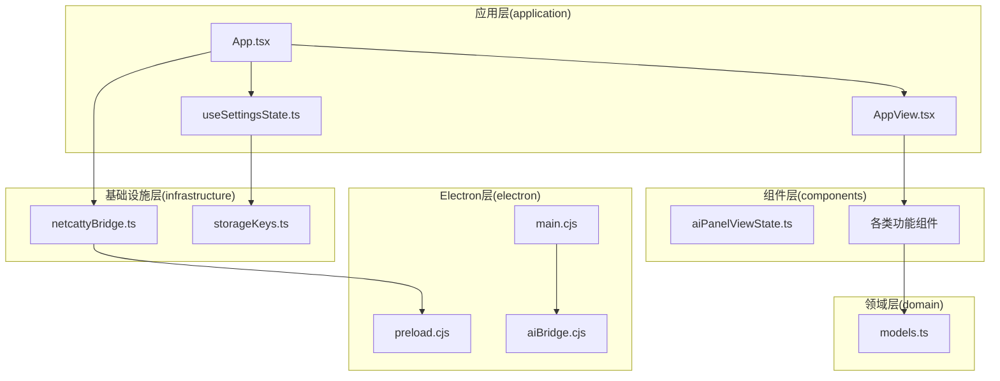
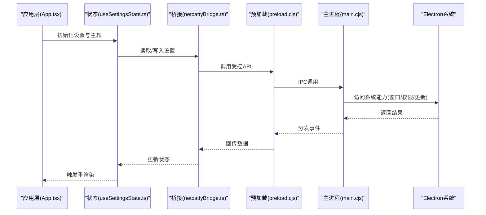
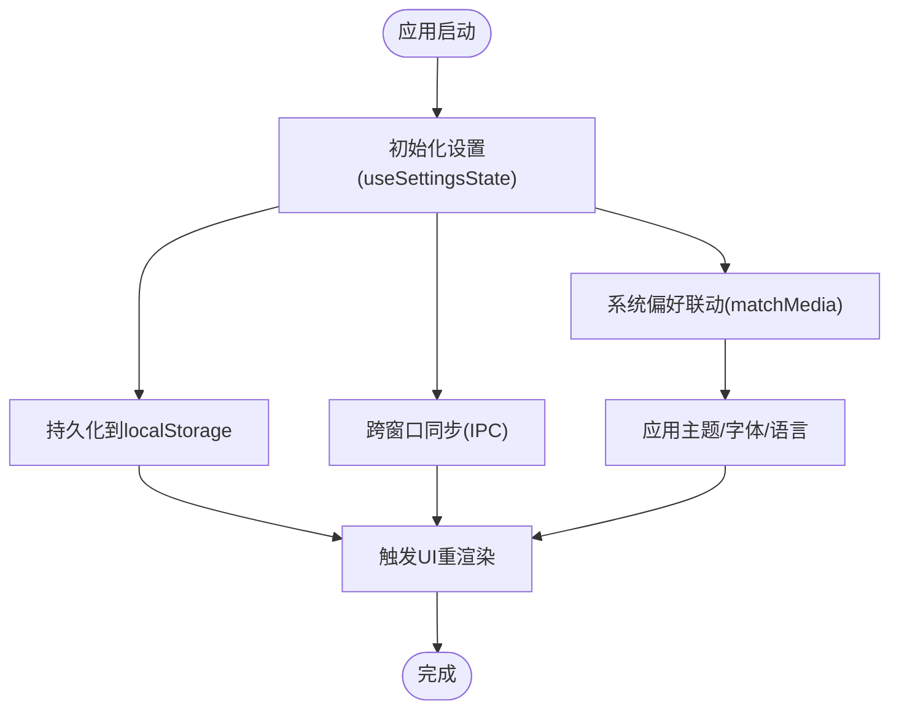
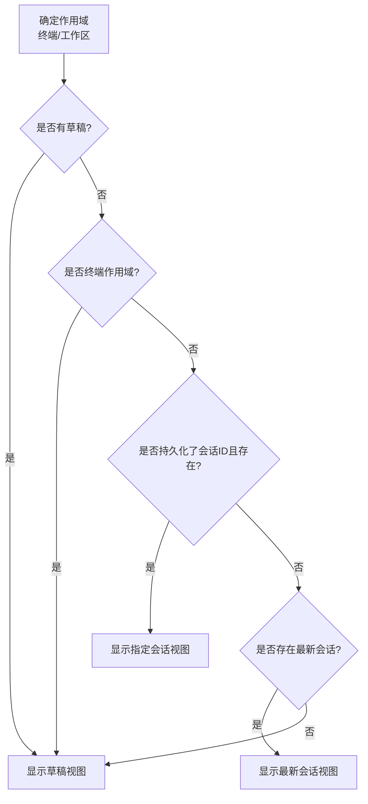
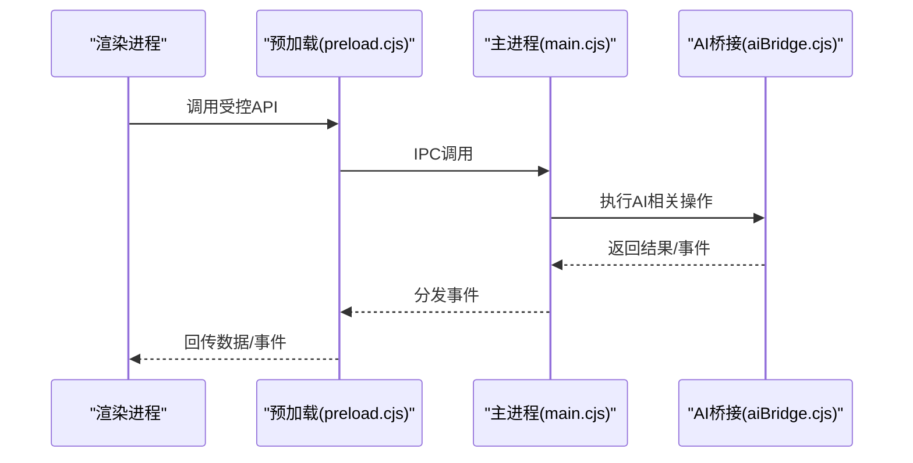
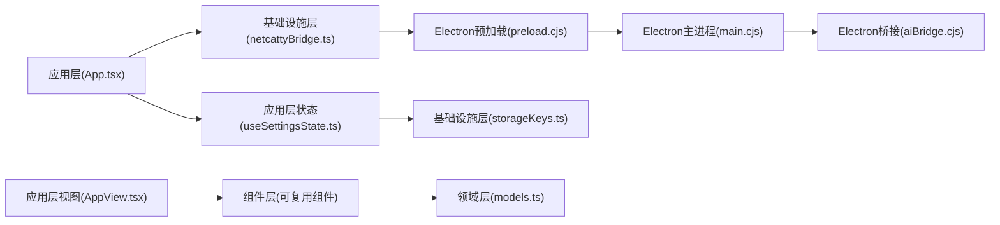

# 模块化设计

<cite>
**本文引用的文件**
- [package.json](file://package.json)
- [index.tsx](file://index.tsx)
- [App.tsx](file://App.tsx)
- [main.cjs](file://electron/main.cjs)
- [preload.cjs](file://electron/preload.cjs)
- [useSettingsState.ts](file://application/state/useSettingsState.ts)
- [aiPanelViewState.ts](file://components/ai/aiPanelViewState.ts)
- [netcattyBridge.ts](file://infrastructure/services/netcattyBridge.ts)
- [aiBridge.cjs](file://electron/bridges/aiBridge.cjs)
- [storageKeys.ts](file://infrastructure/config/storageKeys.ts)
- [AppView.tsx](file://application/app/AppView.tsx)
- [models.ts](file://domain/models.ts)
</cite>

## 目录
1. [引言](#引言)
2. [项目结构](#项目结构)
3. [核心组件](#核心组件)
4. [架构总览](#架构总览)
5. [详细组件分析](#详细组件分析)
6. [依赖分析](#依赖分析)
7. [性能考虑](#性能考虑)
8. [故障排查指南](#故障排查指南)
9. [结论](#结论)
10. [附录](#附录)

## 引言
本文件面向Netcatty项目的模块化设计，系统阐述应用层状态管理、组件层可复用组件库、领域层业务模型、基础设施层服务与Electron系统集成模块的职责划分、边界定义与接口设计。文档通过模块依赖图与流程图展示模块间的耦合度与内聚性，并总结模块化带来的代码复用、测试便利性与维护性提升，同时给出扩展最佳实践与注意事项。

## 项目结构
Netcatty采用多层模块化架构：
- 应用层（application）：负责UI状态管理、国际化、应用启动与窗口控制、跨模块状态协调。
- 组件层（components）：提供可复用UI组件与功能组件，按功能域分包组织。
- 领域层（domain）：定义业务模型与规则，如主机、会话、SFTP、终端、工作区等。
- 基础设施层（infrastructure）：封装持久化、配置、服务适配器、主题与字体等通用能力。
- Electron层（electron）：系统集成与桥接，负责主进程、预加载脚本、IPC桥接与平台能力。

图表来源
- [App.tsx:1-800](file://App.tsx#L1-L800)
- [useSettingsState.ts:1-970](file://application/state/useSettingsState.ts#L1-L970)
- [AppView.tsx:1-554](file://application/app/AppView.tsx#L1-L554)
- [aiPanelViewState.ts:1-95](file://components/ai/aiPanelViewState.ts#L1-L95)
- [models.ts:1-8](file://domain/models.ts#L1-L8)
- [netcattyBridge.ts:1-20](file://infrastructure/services/netcattyBridge.ts#L1-L20)
- [storageKeys.ts:1-169](file://infrastructure/config/storageKeys.ts#L1-L169)
- [main.cjs:1-879](file://electron/main.cjs#L1-L879)
- [preload.cjs:1-708](file://electron/preload.cjs#L1-L708)
- [aiBridge.cjs:1-999](file://electron/bridges/aiBridge.cjs#L1-L999)

章节来源
- [package.json:1-120](file://package.json#L1-L120)
- [index.tsx:1-134](file://index.tsx#L1-L134)
- [App.tsx:1-800](file://App.tsx#L1-L800)
- [main.cjs:1-879](file://electron/main.cjs#L1-L879)
- [preload.cjs:1-708](file://electron/preload.cjs#L1-L708)

## 核心组件
- 应用入口与路由
  - index.tsx：基于URL哈希实现主界面、设置页与托盘面板的路由切换，支持懒加载与骨架屏。
  - App.tsx：应用根组件，集中初始化设置、主题、国际化、同步、窗口控制与全局事件处理；聚合应用状态与业务逻辑。
- 应用层状态管理
  - useSettingsState.ts：统一管理主题、语言、终端设置、快捷键、SFTP行为、编辑器与日志等设置项，提供本地存储、跨窗口同步与系统设置联动。
- 组件层
  - aiPanelViewState.ts：AI侧边栏视图解析与会话选择策略，确保在不同作用域下（终端/工作区）的视图一致性。
- 领域层
  - models.ts：导出连接、历史、密钥绑定、端口转发、SFTP、终端、工作区等模型，作为跨层契约。
- 基础设施层
  - netcattyBridge.ts：对window.netcatty桥接的统一封装，提供可选与强制获取方法，便于错误处理。
  - storageKeys.ts：集中定义所有本地存储键名，避免硬编码与冲突。
- Electron层
  - main.cjs：主进程入口，注册协议、窗口管理、权限控制、单实例锁、自动更新、桥接模块注册与生命周期管理。
  - preload.cjs：预加载脚本，建立安全的IPC通道，暴露受控API给渲染进程，监听并分发事件。
  - aiBridge.cjs：AI相关桥接，代理LLM请求、工具执行、外部Agent与ACp会话管理，处理流式响应与进程树清理。

章节来源
- [index.tsx:1-134](file://index.tsx#L1-L134)
- [App.tsx:1-800](file://App.tsx#L1-L800)
- [useSettingsState.ts:1-970](file://application/state/useSettingsState.ts#L1-L970)
- [aiPanelViewState.ts:1-95](file://components/ai/aiPanelViewState.ts#L1-L95)
- [models.ts:1-8](file://domain/models.ts#L1-L8)
- [netcattyBridge.ts:1-20](file://infrastructure/services/netcattyBridge.ts#L1-L20)
- [storageKeys.ts:1-169](file://infrastructure/config/storageKeys.ts#L1-L169)
- [main.cjs:1-879](file://electron/main.cjs#L1-L879)
- [preload.cjs:1-708](file://electron/preload.cjs#L1-L708)
- [aiBridge.cjs:1-999](file://electron/bridges/aiBridge.cjs#L1-L999)

## 架构总览
Netcatty采用“前端应用 + Electron主进程 + 预加载桥接”的双层架构。应用层通过状态钩子与组件库驱动UI；领域层提供业务模型；基础设施层抽象配置与持久化；Electron层提供系统能力与IPC桥接。

图表来源
- [App.tsx:1-800](file://App.tsx#L1-L800)
- [useSettingsState.ts:1-970](file://application/state/useSettingsState.ts#L1-L970)
- [netcattyBridge.ts:1-20](file://infrastructure/services/netcattyBridge.ts#L1-L20)
- [preload.cjs:1-708](file://electron/preload.cjs#L1-L708)
- [main.cjs:1-879](file://electron/main.cjs#L1-L879)

## 详细组件分析

### 应用层：状态管理与应用编排
- 职责
  - 管理主题、语言、终端与SFTP等全局设置，提供跨窗口同步与系统偏好联动。
  - 聚合会话、工作区、日志、文本编辑器等状态，协调热键、托盘、全局事件。
  - 驱动云同步、版本备份、键盘交互认证与密钥口令处理。
- 关键接口
  - 设置状态钩子：useSettingsState，提供主题、语言、终端设置、快捷键、SFTP行为、编辑器与日志等的读写与持久化。
  - 应用视图：AppView，承载顶部标签、主内容区、日志回放、编辑器等容器挂载点。
- 内聚性与耦合度
  - 内聚性高：设置状态集中在单一钩子中，避免分散读写。
  - 耦合度适中：通过netcattyBridge与Electron层解耦系统能力访问；与组件层通过props/上下文解耦。

图表来源
- [useSettingsState.ts:1-970](file://application/state/useSettingsState.ts#L1-L970)
- [AppView.tsx:1-554](file://application/app/AppView.tsx#L1-L554)

章节来源
- [useSettingsState.ts:1-970](file://application/state/useSettingsState.ts#L1-L970)
- [AppView.tsx:1-554](file://application/app/AppView.tsx#L1-L554)

### 组件层：可复用组件库
- 职责
  - 提供AI聊天、SFTP、终端、设置、钥匙串、端口转发等领域的可复用UI组件。
  - 封装交互逻辑与状态，降低上层组件复杂度。
- 示例
  - aiPanelViewState：根据当前作用域与历史会话决定AI面板默认视图，保证用户体验一致性。
- 内聚性与耦合度
  - 内聚性高：按功能域分包，组件职责清晰。
  - 耦合度低：通过props与上下文传递数据，避免直接依赖应用层状态。

图表来源
- [aiPanelViewState.ts:1-95](file://components/ai/aiPanelViewState.ts#L1-L95)

章节来源
- [aiPanelViewState.ts:1-95](file://components/ai/aiPanelViewState.ts#L1-L95)

### 领域层：业务模型
- 职责
  - 定义主机、会话、SFTP、终端、工作区等核心业务实体与关系。
  - 作为跨层契约，约束应用层与基础设施层的数据结构与行为。
- 接口
  - models.ts：统一导出领域模型，便于跨模块引用。

章节来源
- [models.ts:1-8](file://domain/models.ts#L1-L8)

### 基础设施层：服务与配置
- 职责
  - 抽象持久化、配置、主题与字体、云同步、加密等通用能力。
  - 提供桥接封装与配置常量，降低上层对底层细节的感知。
- 关键接口
  - netcattyBridge：统一封装window.netcatty桥接，提供可选与强制获取方法。
  - storageKeys：集中定义所有本地存储键名，避免硬编码与冲突。

章节来源
- [netcattyBridge.ts:1-20](file://infrastructure/services/netcattyBridge.ts#L1-L20)
- [storageKeys.ts:1-169](file://infrastructure/config/storageKeys.ts#L1-L169)

### Electron层：系统集成与桥接
- 职责
  - 主进程：注册协议、窗口管理、权限控制、单实例锁、自动更新、桥接模块注册与生命周期管理。
  - 预加载：建立安全的IPC通道，暴露受控API给渲染进程，监听并分发事件。
  - 桥接：代理系统能力（SSH、SFTP、终端、AI等），处理流式响应与进程树清理。
- 关键接口
  - main.cjs：应用菜单、窗口、协议、权限、自动更新与桥接注册。
  - preload.cjs：事件监听与分发、受控API暴露、可信源校验。
  - aiBridge.cjs：AI工具执行、外部Agent与ACp会话管理、流式请求与TLS处理。

图表来源
- [preload.cjs:1-708](file://electron/preload.cjs#L1-L708)
- [main.cjs:1-879](file://electron/main.cjs#L1-L879)
- [aiBridge.cjs:1-999](file://electron/bridges/aiBridge.cjs#L1-L999)

章节来源
- [main.cjs:1-879](file://electron/main.cjs#L1-L879)
- [preload.cjs:1-708](file://electron/preload.cjs#L1-L708)
- [aiBridge.cjs:1-999](file://electron/bridges/aiBridge.cjs#L1-L999)

## 依赖分析
- 模块边界
  - 应用层仅依赖基础设施层提供的桥接与配置，不直接依赖Electron层具体实现。
  - 组件层仅依赖领域层模型与基础设施层的UI服务，不直接依赖应用层状态。
  - 领域层保持纯数据与规则，不依赖上层UI或系统能力。
  - 基础设施层封装系统细节，向上层暴露稳定接口。
  - Electron层独立于前端，通过桥接与预加载与前端通信。
- 依赖图

图表来源
- [App.tsx:1-800](file://App.tsx#L1-L800)
- [useSettingsState.ts:1-970](file://application/state/useSettingsState.ts#L1-L970)
- [AppView.tsx:1-554](file://application/app/AppView.tsx#L1-L554)
- [netcattyBridge.ts:1-20](file://infrastructure/services/netcattyBridge.ts#L1-L20)
- [storageKeys.ts:1-169](file://infrastructure/config/storageKeys.ts#L1-L169)
- [models.ts:1-8](file://domain/models.ts#L1-L8)
- [preload.cjs:1-708](file://electron/preload.cjs#L1-L708)
- [main.cjs:1-879](file://electron/main.cjs#L1-L879)
- [aiBridge.cjs:1-999](file://electron/bridges/aiBridge.cjs#L1-L999)

章节来源
- [App.tsx:1-800](file://App.tsx#L1-L800)
- [useSettingsState.ts:1-970](file://application/state/useSettingsState.ts#L1-L970)
- [AppView.tsx:1-554](file://application/app/AppView.tsx#L1-L554)
- [netcattyBridge.ts:1-20](file://infrastructure/services/netcattyBridge.ts#L1-L20)
- [storageKeys.ts:1-169](file://infrastructure/config/storageKeys.ts#L1-L169)
- [models.ts:1-8](file://domain/models.ts#L1-L8)
- [preload.cjs:1-708](file://electron/preload.cjs#L1-L708)
- [main.cjs:1-879](file://electron/main.cjs#L1-L879)
- [aiBridge.cjs:1-999](file://electron/bridges/aiBridge.cjs#L1-L999)

## 性能考虑
- 渲染与懒加载
  - index.tsx使用Suspense与lazy实现设置页与托盘面板的按需加载，减少首屏负担。
- 状态更新与去抖
  - App.tsx中对焦点移动等高频操作使用去抖，避免重复渲染与无效计算。
- 存储与IPC
  - useSettingsState.ts对设置变更进行批量持久化与跨窗口同步，减少频繁写入与广播。
- Electron桥接
  - aiBridge.cjs对流式请求设置超时与缓冲上限，防止内存膨胀；进程树清理避免僵尸进程。

## 故障排查指南
- 桥接不可用
  - netcattyBridge.ts提供可选与强制获取方法，结合错误类型定位问题来源。
- 设置同步异常
  - useSettingsState.ts中存在跨窗口同步与系统设置联动逻辑，检查持久化键名与序列化签名。
- Electron事件未到达
  - preload.cjs中事件监听与分发逻辑较为复杂，检查可信源校验与事件队列清理。
- AI桥接流中断
  - aiBridge.cjs中对流式请求设置了超时与缓冲上限，检查网络与TLS配置。

章节来源
- [netcattyBridge.ts:1-20](file://infrastructure/services/netcattyBridge.ts#L1-L20)
- [useSettingsState.ts:1-970](file://application/state/useSettingsState.ts#L1-L970)
- [preload.cjs:1-708](file://electron/preload.cjs#L1-L708)
- [aiBridge.cjs:1-999](file://electron/bridges/aiBridge.cjs#L1-L999)

## 结论
Netcatty通过清晰的模块划分与稳定的接口设计，实现了应用层状态管理、组件层可复用组件库、领域层业务模型、基础设施层服务与Electron系统集成的解耦协作。模块化带来了更高的内聚性与更低的耦合度，提升了代码复用、测试便利性与长期维护性。遵循本文的扩展实践与注意事项，可在不破坏现有边界的前提下持续演进系统能力。

## 附录
- 最佳实践
  - 明确模块边界：上层仅依赖下层接口，避免反向依赖。
  - 使用集中式配置：如storageKeys，统一管理键名与默认值。
  - 通过桥接封装系统能力：基础设施层统一封装，避免直接依赖平台细节。
  - 控制IPC频率：批量持久化与跨窗口同步，减少不必要的IPC往返。
  - 事件与状态分离：预加载层专注事件分发，应用层专注状态管理。
- 注意事项
  - Electron桥接需严格校验可信源，防止恶意页面注入。
  - 流式请求需设置超时与缓冲上限，避免资源泄漏。
  - 跨窗口同步需处理竞态与幂等，确保最终一致。
  - 新增模块应先定义接口契约，再实现具体逻辑，保持向后兼容。