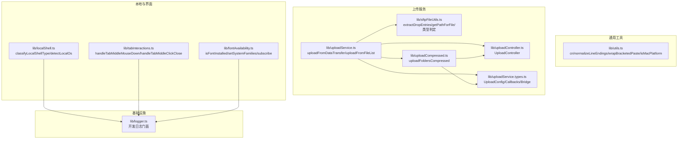
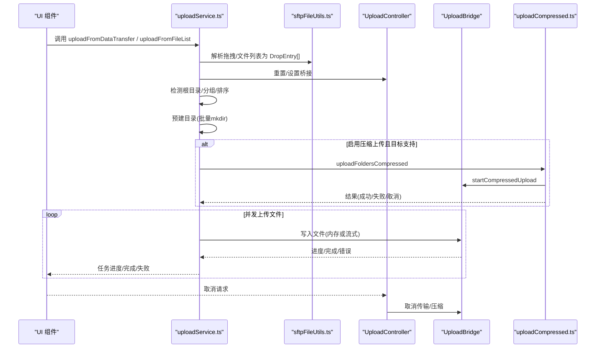
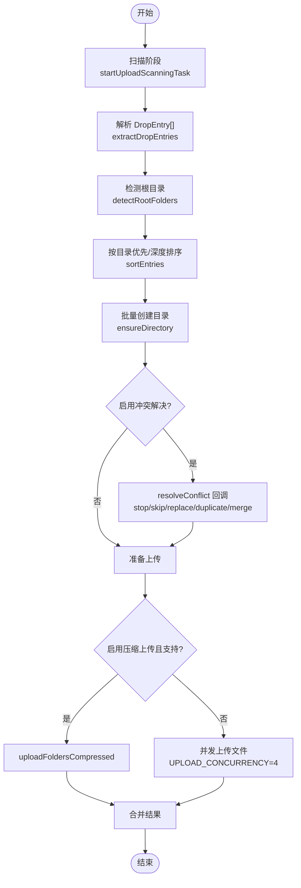
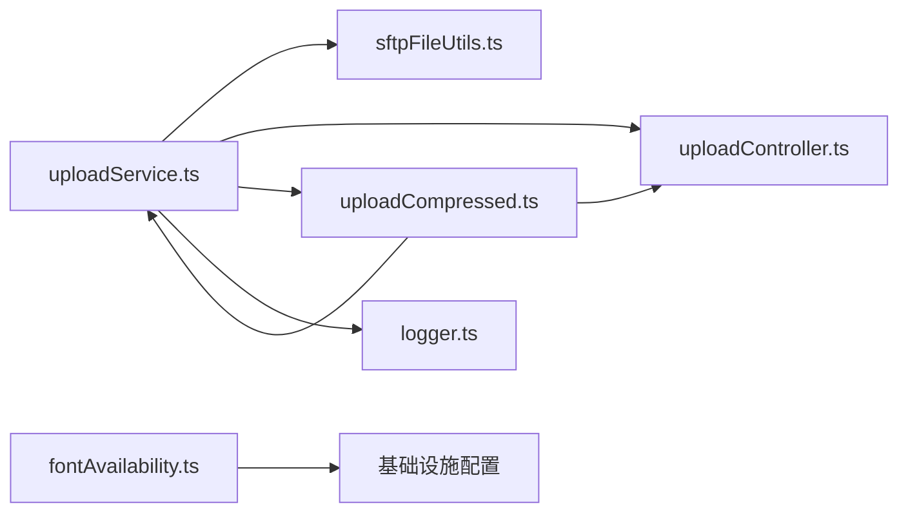

# 工具库

<cite>
**本文引用的文件**
- [lib/utils.ts](file://lib/utils.ts)
- [lib/uploadService.ts](file://lib/uploadService.ts)
- [lib/uploadService.types.ts](file://lib/uploadService.types.ts)
- [lib/uploadController.ts](file://lib/uploadController.ts)
- [lib/uploadCompressed.ts](file://lib/uploadCompressed.ts)
- [lib/sftpFileUtils.ts](file://lib/sftpFileUtils.ts)
- [lib/localShell.ts](file://lib/localShell.ts)
- [lib/tabInteractions.ts](file://lib/tabInteractions.ts)
- [lib/fontAvailability.ts](file://lib/fontAvailability.ts)
- [lib/logger.ts](file://lib/logger.ts)
- [lib/localShell.test.ts](file://lib/localShell.test.ts)
- [lib/tabInteractions.test.ts](file://lib/tabInteractions.test.ts)
- [lib/fontAvailability.test.ts](file://lib/fontAvailability.test.ts)
</cite>

## 目录
1. [简介](#简介)
2. [项目结构](#项目结构)
3. [核心组件](#核心组件)
4. [架构总览](#架构总览)
5. [详细组件分析](#详细组件分析)
6. [依赖关系分析](#依赖关系分析)
7. [性能考量](#性能考量)
8. [故障排查指南](#故障排查指南)
9. [结论](#结论)
10. [附录](#附录)

## 简介
本文件系统性梳理 Netcatty 的工具库与辅助函数，覆盖通用工具（字符串处理、平台判定、终端粘贴包装）、上传服务（拖拽/文件列表上传、压缩上传、冲突解决、进度与取消控制）、本地 Shell 分类与操作系统识别、字体可用性检测、标签页交互等模块。文档提供 API 说明、数据流图、错误处理策略、性能优化建议与测试方法，帮助开发者快速理解与正确使用这些工具。

## 项目结构
工具库主要位于 lib 目录，按功能域划分：
- 通用工具：字符串与平台相关的小工具
- 上传服务：统一的上传入口、控制器、压缩上传桥接
- 文件工具：SFTP 文件类型识别、拖拽解析、路径提取
- 本地 Shell：OS 与 Shell 类型分类
- 标签页交互：鼠标中键关闭与滚动抑制
- 字体可用性：Canvas 回退与权威系统集
- 日志：开发环境下的轻量日志门面

图表来源
- [lib/utils.ts:1-37](file://lib/utils.ts#L1-L37)
- [lib/uploadService.ts:1-205](file://lib/uploadService.ts#L1-L205)
- [lib/uploadService.types.ts:1-115](file://lib/uploadService.types.ts#L1-L115)
- [lib/uploadController.ts:1-136](file://lib/uploadController.ts#L1-L136)
- [lib/uploadCompressed.ts:1-229](file://lib/uploadCompressed.ts#L1-L229)
- [lib/sftpFileUtils.ts:1-661](file://lib/sftpFileUtils.ts#L1-L661)
- [lib/localShell.ts:1-42](file://lib/localShell.ts#L1-L42)
- [lib/tabInteractions.ts:1-35](file://lib/tabInteractions.ts#L1-L35)
- [lib/fontAvailability.ts:1-163](file://lib/fontAvailability.ts#L1-L163)
- [lib/logger.ts:1-25](file://lib/logger.ts#L1-L25)

章节来源
- [lib/utils.ts:1-37](file://lib/utils.ts#L1-L37)
- [lib/uploadService.ts:1-205](file://lib/uploadService.ts#L1-L205)
- [lib/uploadService.types.ts:1-115](file://lib/uploadService.types.ts#L1-L115)
- [lib/uploadController.ts:1-136](file://lib/uploadController.ts#L1-L136)
- [lib/uploadCompressed.ts:1-229](file://lib/uploadCompressed.ts#L1-L229)
- [lib/sftpFileUtils.ts:1-661](file://lib/sftpFileUtils.ts#L1-L661)
- [lib/localShell.ts:1-42](file://lib/localShell.ts#L1-L42)
- [lib/tabInteractions.ts:1-35](file://lib/tabInteractions.ts#L1-L35)
- [lib/fontAvailability.ts:1-163](file://lib/fontAvailability.ts#L1-L163)
- [lib/logger.ts:1-25](file://lib/logger.ts#L1-L25)

## 核心组件
- 通用工具
  - cn：基于 clsx/tailwind-merge 的类名合并
  - normalizeLineEndings：统一换行为 LF，避免终端粘贴产生空行
  - wrapBracketedPaste：包裹括号粘贴序列，便于终端区分粘贴与输入
  - isMacPlatform：浏览器端平台判定，用于快捷键差异处理
- 上传服务
  - uploadFromDataTransfer / uploadFromFileList：统一入口，支持拖拽与文件列表；自动分组根目录、批量创建目录、并发上传、进度聚合、冲突解决回调
  - UploadController：集中管理取消、活动传输与压缩任务 ID
  - uploadFoldersCompressed：对多文件夹进行压缩打包上传，支持进度映射与阶段通知
  - sftpFileUtils：拖拽解析、路径提取、文件类型判定（文本/图片/二进制）
- 本地 Shell 与字体
  - classifyLocalShellType / detectLocalOs：根据可执行名与平台识别 Shell 类型
  - isFontInstalled / setSystemFamilies / subscribe：权威系统字体集优先，回退 Canvas 宽度检测
- 标签页交互
  - handleTabMiddleMouseDown：阻止中间点击触发滚动
  - handleTabMiddleClickClose：中间点击关闭标签页

章节来源
- [lib/utils.ts:1-37](file://lib/utils.ts#L1-L37)
- [lib/uploadService.ts:115-205](file://lib/uploadService.ts#L115-L205)
- [lib/uploadService.types.ts:88-115](file://lib/uploadService.types.ts#L88-L115)
- [lib/uploadController.ts:1-136](file://lib/uploadController.ts#L1-L136)
- [lib/uploadCompressed.ts:1-229](file://lib/uploadCompressed.ts#L1-L229)
- [lib/sftpFileUtils.ts:586-661](file://lib/sftpFileUtils.ts#L586-L661)
- [lib/localShell.ts:19-42](file://lib/localShell.ts#L19-L42)
- [lib/fontAvailability.ts:131-163](file://lib/fontAvailability.ts#L131-L163)
- [lib/tabInteractions.ts:15-35](file://lib/tabInteractions.ts#L15-L35)

## 架构总览
上传流程从 UI 触发，经由统一入口解析拖拽/文件列表，按根目录分组，预建目录，再并发上传文件，并通过回调上报任务与进度；若启用压缩上传且目标支持，则优先走压缩通道，失败时回退到常规上传。

图表来源
- [lib/uploadService.ts:125-205](file://lib/uploadService.ts#L125-L205)
- [lib/uploadCompressed.ts:9-229](file://lib/uploadCompressed.ts#L9-L229)
- [lib/uploadService.types.ts:50-86](file://lib/uploadService.types.ts#L50-L86)
- [lib/uploadController.ts:13-58](file://lib/uploadController.ts#L13-L58)
- [lib/sftpFileUtils.ts:586-661](file://lib/sftpFileUtils.ts#L586-L661)

## 详细组件分析

### 通用工具：字符串与平台
- 函数
  - cn(inputs...)：合并类名，避免重复与冲突
  - normalizeLineEndings(text)：将 CRLF/CR 统一为 LF
  - wrapBracketedPaste(text)：包裹括号粘贴序列
  - isMacPlatform()：基于 navigator.platform 判定 macOS
- 设计要点
  - 无副作用纯函数，适合在渲染层与事件处理器中复用
  - 平台判定仅在浏览器端有效，无 navigator 时返回 false
- 使用示例
  - 在终端粘贴前调用 normalizeLineEndings，再用 wrapBracketedPaste 包裹
  - 在快捷键组合中根据 isMacPlatform 切换 Cmd/Ctrl

章节来源
- [lib/utils.ts:4-37](file://lib/utils.ts#L4-L37)

### 上传服务：统一入口与控制器
- 入口函数
  - uploadFromDataTransfer(dataTransfer, config, controller?)：支持拖拽
  - uploadFromFileList(fileList, config, controller?)：支持 FileList/File[]
- 关键流程
  - 扫描阶段：startUploadScanningTask 提供占位任务，提升感知
  - 根目录检测与分组：detectRootFolders 将同级文件与子目录归类
  - 排序：sortEntries 目录优先、深度优先
  - 预建目录：ensureDirectory 批量创建，失败记录并上报
  - 并发上传：UPLOAD_CONCURRENCY=4，RAF 去抖进度上报
  - 冲突解决：resolveConflict 回调支持 stop/skip/replace/duplicate/merge
  - 压缩上传：useCompressedUpload=true 时优先尝试压缩上传，失败回退
- 数据模型
  - UploadConfig：目标路径、SFTP ID、是否本地、桥接、路径拼接、回调、压缩开关、冲突回调
  - UploadCallbacks：任务生命周期回调
  - UploadBridge：写文件/目录、统计/删除、进度写入、流式传输、取消
- 错误处理
  - 统一格式化错误消息
  - 目录创建失败按相对路径去重上报
  - 上传失败抛出错误或返回错误结果
  - 取消时清理活动传输与压缩任务

图表来源
- [lib/uploadService.ts:140-205](file://lib/uploadService.ts#L140-L205)
- [lib/uploadService.ts:297-800](file://lib/uploadService.ts#L297-L800)
- [lib/uploadCompressed.ts:9-229](file://lib/uploadCompressed.ts#L9-L229)
- [lib/uploadService.types.ts:88-115](file://lib/uploadService.types.ts#L88-L115)

章节来源
- [lib/uploadService.ts:125-205](file://lib/uploadService.ts#L125-L205)
- [lib/uploadService.ts:297-800](file://lib/uploadService.ts#L297-L800)
- [lib/uploadService.types.ts:1-115](file://lib/uploadService.types.ts#L1-L115)
- [lib/uploadController.ts:1-136](file://lib/uploadController.ts#L1-L136)
- [lib/uploadCompressed.ts:1-229](file://lib/uploadCompressed.ts#L1-L229)

### 文件工具：拖拽解析与类型判定
- 功能
  - extractDropEntries：支持 webkitGetAsEntry 的递归遍历，非递归队列避免栈溢出
  - getPathForFile：优先 Electron webUtils，回退 legacy file.path
  - isTextFile / isTextData / isTextFileEnhanced：扩展名+内容混合判定
  - isKnownBinaryFile / couldBeTextFile：二进制排除与“可能文本”宽容判定
  - isImageFile / getImageMimeType / getLanguageId / getLanguageName：图像与语法高亮语言映射
- 性能与健壮性
  - 迭代式读取，周期 yield 保持 UI 响应
  - 对异常文件/目录读取进行警告并跳过
  - 严格区分目录与文件条目

章节来源
- [lib/sftpFileUtils.ts:586-661](file://lib/sftpFileUtils.ts#L586-L661)
- [lib/sftpFileUtils.ts:184-340](file://lib/sftpFileUtils.ts#L184-L340)

### 本地 Shell 分类与操作系统识别
- 功能
  - detectLocalOs：根据 platform 字符串判定 linux/macos/windows
  - classifyLocalShellType：基于规则集合匹配 powershell/cmd/fish/posix/unknown，无名时按 OS 返回默认
- 设计原则
  - 规则来自本地规则 JSON，确保与桥接层一致
  - 无输入时按平台返回合理默认值
- 测试策略
  - 覆盖常见路径与平台组合，同时验证与 CommonJS 版本一致性

章节来源
- [lib/localShell.ts:19-42](file://lib/localShell.ts#L19-L42)
- [lib/localShell.test.ts:13-38](file://lib/localShell.test.ts#L13-L38)

### 标签页交互：中键关闭与滚动抑制
- 功能
  - handleTabMiddleMouseDown：中间按下时阻止默认滚动行为
  - handleTabMiddleClickClose：中间点击时关闭标签页，阻止冒泡与默认行为
- 行为约束
  - 仅对中间键生效，左/右键保持原生行为
- 测试策略
  - 验证中间键触发关闭与阻止默认行为
  - 验证左右键不触发关闭

章节来源
- [lib/tabInteractions.ts:15-35](file://lib/tabInteractions.ts#L15-L35)
- [lib/tabInteractions.test.ts:31-67](file://lib/tabInteractions.test.ts#L31-L67)

### 字体可用性检测：权威集与 Canvas 回退
- 功能
  - extractPrimaryFamily：从 CSS 字体列表提取主字体名
  - setSystemFamilies：注入权威系统字体集，开启精确判定
  - isFontInstalled：优先权威集，否则 Canvas 宽度回退；带缓存
  - subscribeFontAvailability / getFontAvailabilityVersion：订阅变更与版本号
  - clearFontAvailabilityCache：清空缓存并通知订阅者
- 算法要点
  - Canvas 回退：对三种通用字体基线逐一比较，只要有一条不同即认为安装
  - 已知内置字体始终返回已安装
- 测试策略
  - 单元测试覆盖提取、回退算法、权威集切换、订阅与版本号

章节来源
- [lib/fontAvailability.ts:38-163](file://lib/fontAvailability.ts#L38-L163)
- [lib/fontAvailability.test.ts:14-204](file://lib/fontAvailability.test.ts#L14-L204)

## 依赖关系分析
- 上传服务依赖
  - sftpFileUtils：拖拽解析与路径提取
  - uploadCompressed：压缩上传桥接
  - uploadController：取消与活动任务管理
  - logger：开发期性能与调试日志
- 文件工具
  - 依赖 netcattyBridge 获取真实本地路径
- 字体工具
  - 依赖 splitFontFamilyList（基础设施配置）

图表来源
- [lib/uploadService.ts:1-25](file://lib/uploadService.ts#L1-L25)
- [lib/uploadCompressed.ts:1-8](file://lib/uploadCompressed.ts#L1-L8)
- [lib/sftpFileUtils.ts:6-7](file://lib/sftpFileUtils.ts#L6-L7)
- [lib/logger.ts:1-25](file://lib/logger.ts#L1-L25)

章节来源
- [lib/uploadService.ts:1-25](file://lib/uploadService.ts#L1-L25)
- [lib/uploadCompressed.ts:1-8](file://lib/uploadCompressed.ts#L1-L8)
- [lib/sftpFileUtils.ts:6-7](file://lib/sftpFileUtils.ts#L6-L7)
- [lib/logger.ts:1-25](file://lib/logger.ts#L1-L25)

## 性能考量
- 上传并发
  - 文件上传并发数固定为 4，避免过多 IO 抖动
  - 使用 RAF 去抖进度上报，降低渲染压力
- 目录预建
  - 按深度分组并行创建，减少重复 stat 与 mkdir 调用
- 压缩上传
  - 优先使用压缩上传以减少网络往返；失败时回退常规上传
- 字体检测
  - 缓存检测结果；权威系统集一旦可用即停止 Canvas 回退
- 日志
  - 开发模式下输出性能与调试信息，生产环境静默

章节来源
- [lib/uploadService.ts:762-762](file://lib/uploadService.ts#L762-L762)
- [lib/uploadService.ts:493-511](file://lib/uploadService.ts#L493-L511)
- [lib/uploadCompressed.ts:136-189](file://lib/uploadCompressed.ts#L136-L189)
- [lib/fontAvailability.ts:157-163](file://lib/fontAvailability.ts#L157-L163)
- [lib/logger.ts:3-7](file://lib/logger.ts#L3-L7)

## 故障排查指南
- 网络/桥接错误
  - UploadBridge 方法缺失：如缺少 writeLocalFile/writeSftpBinaryWithProgress，需补充桥接或降级逻辑
  - 取消失败：UploadController 会尝试 cancelTransfer/cancelSftpUpload，忽略取消过程中的异常
- 文件操作错误
  - 目录创建失败：记录相对路径并去重上报；检查权限与路径合法性
  - 写入失败：优先尝试带进度写入，失败后回退到普通写入
- 权限错误
  - 本地写入：确认目标路径存在且具备写权限
  - SFTP 写入：确认会话有效、远程路径可写、权限足够
- 压缩上传失败
  - 目标不支持压缩：捕获“不支持”错误并回退常规上传
- 字体检测异常
  - 无 DOM 或 API 拒绝：回退为“视为可用”，避免过滤全部字体
  - 订阅未触发：确认 setSystemFamilies 调用与版本号递增

章节来源
- [lib/uploadService.types.ts:50-86](file://lib/uploadService.types.ts#L50-L86)
- [lib/uploadController.ts:13-58](file://lib/uploadController.ts#L13-L58)
- [lib/uploadService.ts:380-385](file://lib/uploadService.ts#L380-L385)
- [lib/uploadService.ts:662-698](file://lib/uploadService.ts#L662-L698)
- [lib/uploadCompressed.ts:94-103](file://lib/uploadCompressed.ts#L94-L103)
- [lib/fontAvailability.ts:144-154](file://lib/fontAvailability.ts#L144-L154)

## 结论
该工具库以“统一入口 + 可插拔桥接 + 明确的生命周期回调”为核心设计，兼顾易用性与可扩展性。上传服务在复杂场景（拖拽、文件夹、冲突、压缩）下仍保持清晰的数据流与可控的性能开销；通用工具与 UI 辅助函数则提供了跨平台与用户体验层面的关键保障。配合完善的测试与日志策略，能够稳定支撑上层组件的复杂交互。

## 附录

### API 文档摘要

- 通用工具
  - cn(...inputs: ClassValue[]): string
    - 参数：任意数量的类名片段
    - 返回：合并后的类名字符串
    - 异常：无
    - 示例：参考源码路径 [lib/utils.ts:4-6](file://lib/utils.ts#L4-L6)
  - normalizeLineEndings(text: string): string
    - 参数：原始文本
    - 返回：统一换行符的文本
    - 异常：无
    - 示例：参考源码路径 [lib/utils.ts:13-15](file://lib/utils.ts#L13-L15)
  - wrapBracketedPaste(text: string): string
    - 参数：待包裹文本
    - 返回：括号粘贴序列包裹的文本
    - 异常：无
    - 示例：参考源码路径 [lib/utils.ts:23-25](file://lib/utils.ts#L23-L25)
  - isMacPlatform(): boolean
    - 参数：无
    - 返回：是否为 macOS
    - 异常：无
    - 示例：参考源码路径 [lib/utils.ts:31-36](file://lib/utils.ts#L31-L36)

- 上传服务
  - uploadFromDataTransfer(dataTransfer, config, controller?): Promise<UploadResult[]>
    - 参数：DataTransfer、配置、可选控制器
    - 返回：上传结果数组
    - 异常：解析失败、目录创建失败、写入失败等
    - 示例：参考源码路径 [lib/uploadService.ts:125-205](file://lib/uploadService.ts#L125-L205)
  - uploadFromFileList(fileList, config, controller?): Promise<UploadResult[]>
    - 参数：FileList/File[]、配置、可选控制器
    - 返回：上传结果数组
    - 异常：同上
    - 示例：参考源码路径 [lib/uploadService.ts:210-292](file://lib/uploadService.ts#L210-L292)
  - UploadController
    - 方法：cancel/reset/setBridge/add/removeActiveTransfer/clearCurrentTransfer/add/removeActiveCompression
    - 异常：取消过程中的桥接异常被吞掉
    - 示例：参考源码路径 [lib/uploadController.ts:13-136](file://lib/uploadController.ts#L13-L136)
  - uploadFoldersCompressed(folderEntries, targetPath, sftpId, callbacks?, controller?): Promise<UploadResult[]>
    - 参数：根目录分组、目标路径、SFTP ID、可选回调、可选控制器
    - 返回：压缩上传结果
    - 异常：不支持压缩时回退
    - 示例：参考源码路径 [lib/uploadCompressed.ts:9-229](file://lib/uploadCompressed.ts#L9-L229)

- 文件工具
  - extractDropEntries(dataTransfer): Promise<DropEntry[]>
    - 参数：DataTransfer
    - 返回：文件/目录条目数组
    - 异常：读取失败时警告并回退
    - 示例：参考源码路径 [lib/sftpFileUtils.ts:586-661](file://lib/sftpFileUtils.ts#L586-L661)
  - getPathForFile(file): string | undefined
    - 参数：File
    - 返回：本地绝对路径或 undefined
    - 异常：无
    - 示例：参考源码路径 [lib/sftpFileUtils.ts:564-574](file://lib/sftpFileUtils.ts#L564-L574)
  - isTextFile(fileName): boolean
    - 参数：文件名
    - 返回：是否为文本文件
    - 异常：无
    - 示例：参考源码路径 [lib/sftpFileUtils.ts:195-225](file://lib/sftpFileUtils.ts#L195-L225)

- 本地 Shell
  - detectLocalOs(platformLike?): LocalOs
    - 参数：平台字符串
    - 返回：linux/macos/windows
    - 异常：无
    - 示例：参考源码路径 [lib/localShell.ts:19-25](file://lib/localShell.ts#L19-L25)
  - classifyLocalShellType(shellPath, platformLike?): LocalShellType
    - 参数：可执行路径、平台字符串
    - 返回：posix/fish/powershell/cmd/unknown
    - 异常：无
    - 示例：参考源码路径 [lib/localShell.ts:27-41](file://lib/localShell.ts#L27-L41)

- 标签页交互
  - handleTabMiddleMouseDown(e: React.MouseEvent): void
    - 参数：鼠标事件
    - 返回：无
    - 异常：无
    - 示例：参考源码路径 [lib/tabInteractions.ts:15-19](file://lib/tabInteractions.ts#L15-L19)
  - handleTabMiddleClickClose(e: React.MouseEvent, close: () => void): void
    - 参数：鼠标事件、关闭回调
    - 返回：无
    - 异常：无
    - 示例：参考源码路径 [lib/tabInteractions.ts:26-34](file://lib/tabInteractions.ts#L26-L34)

- 字体可用性
  - isFontInstalled(family: string): boolean
    - 参数：字体族名
    - 返回：是否可用
    - 异常：无
    - 示例：参考源码路径 [lib/fontAvailability.ts:131-155](file://lib/fontAvailability.ts#L131-L155)
  - setSystemFamilies(families: Set<string> | null): void
    - 参数：系统字体集或 null
    - 返回：无
    - 异常：无
    - 示例：参考源码路径 [lib/fontAvailability.ts:53-57](file://lib/fontAvailability.ts#L53-L57)

### 测试方法与质量保证
- 单元测试
  - 本地 Shell：验证分类与 OS 判定在渲染与桥接层一致性
    - 参考：[lib/localShell.test.ts:13-38](file://lib/localShell.test.ts#L13-L38)
  - 标签页交互：验证中键关闭与滚动抑制
    - 参考：[lib/tabInteractions.test.ts:31-67](file://lib/tabInteractions.test.ts#L31-L67)
  - 字体可用性：覆盖提取、回退算法、权威集切换、订阅与版本号
    - 参考：[lib/fontAvailability.test.ts:14-204](file://lib/fontAvailability.test.ts#L14-L204)
- 质量保证
  - 开发日志：仅在开发环境输出，便于定位性能瓶颈与异常
    - 参考：[lib/logger.ts:3-7](file://lib/logger.ts#L3-L7)
  - 回退策略：缺失桥接方法时优雅降级，避免阻塞主流程
  - 取消一致性：UploadController 统一管理取消，避免遗漏

章节来源
- [lib/localShell.test.ts:13-38](file://lib/localShell.test.ts#L13-L38)
- [lib/tabInteractions.test.ts:31-67](file://lib/tabInteractions.test.ts#L31-L67)
- [lib/fontAvailability.test.ts:14-204](file://lib/fontAvailability.test.ts#L14-L204)
- [lib/logger.ts:3-7](file://lib/logger.ts#L3-L7)