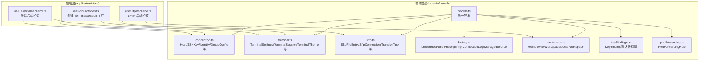
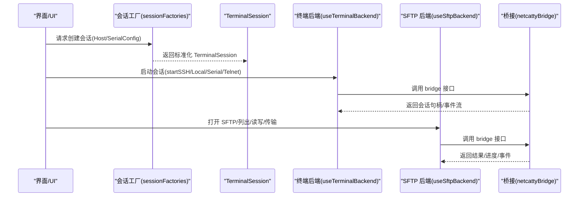
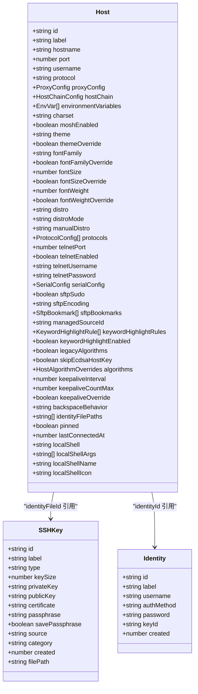
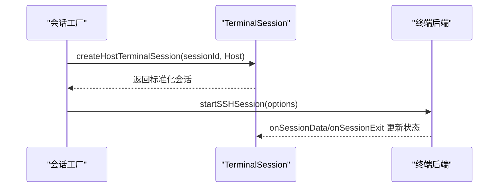
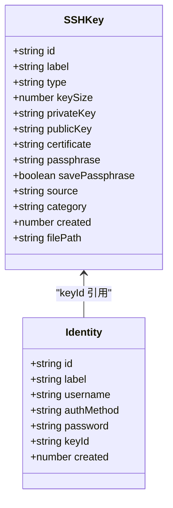
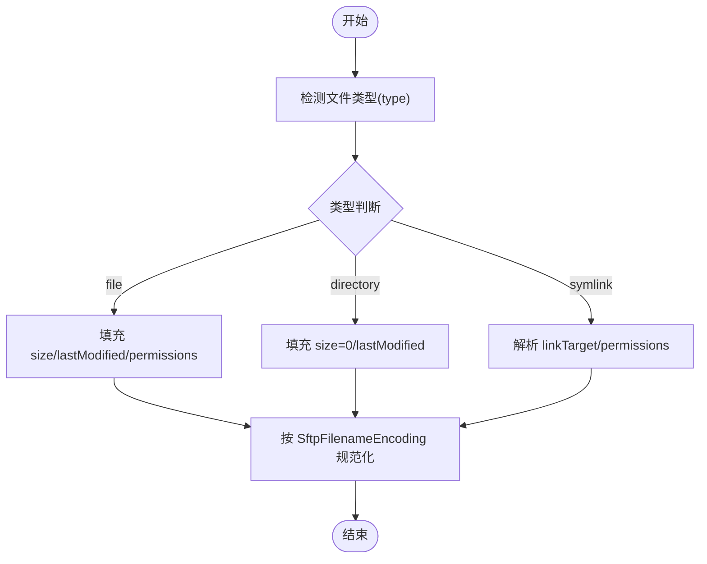
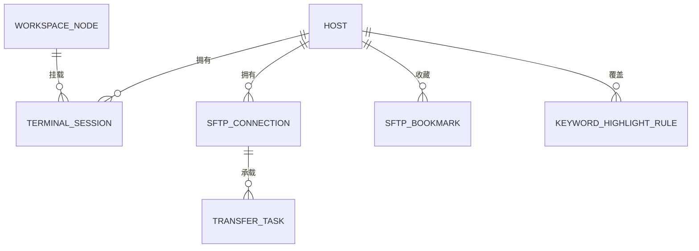
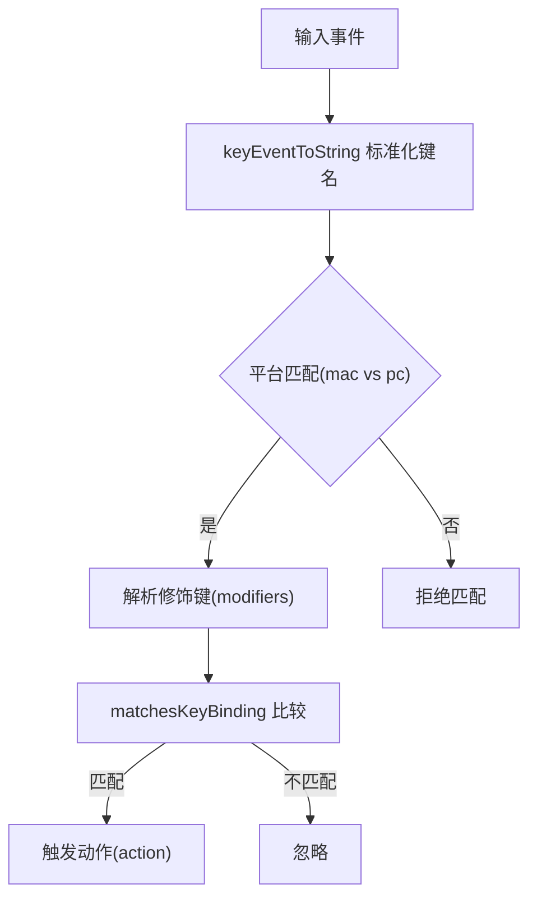
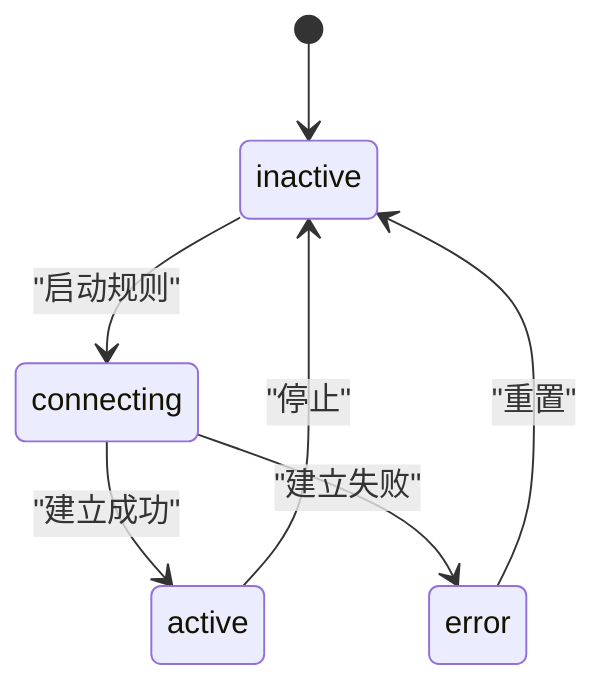
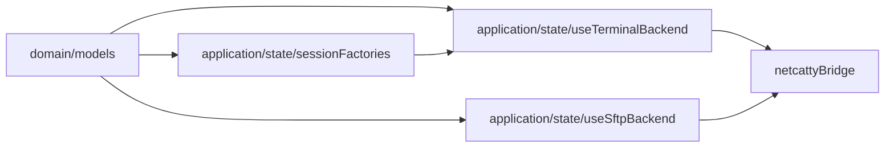

# 数据模型

<cite>
**本文引用的文件**
- [domain/models.ts](file://domain/models.ts)
- [domain/models/connection.ts](file://domain/models/connection.ts)
- [domain/models/terminal.ts](file://domain/models/terminal.ts)
- [domain/models/sftp.ts](file://domain/models/sftp.ts)
- [domain/models/history.ts](file://domain/models/history.ts)
- [domain/models/workspace.ts](file://domain/models/workspace.ts)
- [domain/models/keyBindings.ts](file://domain/models/keyBindings.ts)
- [domain/models/portForwarding.ts](file://domain/models/portForwarding.ts)
- [domain/host.ts](file://domain/host.ts)
- [application/state/sessionFactories.ts](file://application/state/sessionFactories.ts)
- [application/state/useTerminalBackend.ts](file://application/state/useTerminalBackend.ts)
- [application/state/useSftpBackend.ts](file://application/state/useSftpBackend.ts)
</cite>

## 目录
1. [简介](#简介)
2. [项目结构](#项目结构)
3. [核心组件](#核心组件)
4. [架构总览](#架构总览)
5. [详细组件分析](#详细组件分析)
6. [依赖分析](#依赖分析)
7. [性能考虑](#性能考虑)
8. [故障排查指南](#故障排查指南)
9. [结论](#结论)
10. [附录](#附录)

## 简介
本文件系统性梳理 Netcatty 的数据模型设计，聚焦以下核心实体与关系：Host 主机模型、TerminalSession 终端会话模型、SSHKey 密钥模型、SFTPFile 文件模型等。文档覆盖字段定义、数据验证与约束、序列化与反序列化处理、迁移与版本兼容、完整性保障机制，并通过多种图示展示实体间的关系与继承层次。

## 项目结构
数据模型主要位于 domain/models 目录，统一导出；应用层状态工厂与后端桥接在 application/state 中消费这些模型，同时调用底层 bridge 接口完成实际连接与传输操作。

图表来源
- [domain/models.ts:1-8](file://domain/models.ts#L1-L8)
- [domain/models/connection.ts:84-179](file://domain/models/connection.ts#L84-L179)
- [domain/models/terminal.ts:233-338](file://domain/models/terminal.ts#L233-L338)
- [domain/models/sftp.ts:4-78](file://domain/models/sftp.ts#L4-L78)
- [domain/models/history.ts:1-56](file://domain/models/history.ts#L1-L56)
- [domain/models/workspace.ts:1-35](file://domain/models/workspace.ts#L1-L35)
- [domain/models/keyBindings.ts:1-241](file://domain/models/keyBindings.ts#L1-L241)
- [domain/models/portForwarding.ts:1-24](file://domain/models/portForwarding.ts#L1-L24)
- [application/state/sessionFactories.ts:1-89](file://application/state/sessionFactories.ts#L1-L89)
- [application/state/useTerminalBackend.ts:1-262](file://application/state/useTerminalBackend.ts#L1-L262)
- [application/state/useSftpBackend.ts:1-293](file://application/state/useSftpBackend.ts#L1-L293)

章节来源
- [domain/models.ts:1-8](file://domain/models.ts#L1-L8)
- [domain/models/connection.ts:1-283](file://domain/models/connection.ts#L1-L283)
- [domain/models/terminal.ts:1-339](file://domain/models/terminal.ts#L1-L339)
- [domain/models/sftp.ts:1-79](file://domain/models/sftp.ts#L1-L79)
- [domain/models/history.ts:1-57](file://domain/models/history.ts#L1-L57)
- [domain/models/workspace.ts:1-36](file://domain/models/workspace.ts#L1-L36)
- [domain/models/keyBindings.ts:1-241](file://domain/models/keyBindings.ts#L1-L241)
- [domain/models/portForwarding.ts:1-25](file://domain/models/portForwarding.ts#L1-L25)

## 核心组件
本节对关键数据模型进行分层说明，涵盖字段语义、可空性、取值范围、默认值与约束。

- Host 主机模型（Host）
  - 关键字段：id、label、hostname、port、username、protocol、password、savePassword、authMethod、agentForwarding、x11Forwarding、proxyProfileId、hostChain、environmentVariables、charset、moshEnabled、theme、fontFamily、fontSize、fontWeight、distro、distroMode、manualDistro、protocols、telnetPort、telnetEnabled、telnetUsername、telnetPassword、serialConfig、sftpSudo、sftpEncoding、sftpBookmarks、managedSourceId、keywordHighlightRules、keywordHighlightEnabled、legacyAlgorithms、skipEcdsaHostKey、algorithms、keepaliveInterval、keepaliveCountMax、keepaliveOverride、backspaceBehavior、identityFilePaths、pinned、lastConnectedAt、localShell、localShellArgs、localShellName、localShellIcon。
  - 约束与规则：
    - 多协议支持：protocols 数组允许为不同协议配置独立端口与启用状态；当 protocol 指定为 serial 时，serialConfig 必须提供有效串口参数。
    - 代理与跳转：proxyProfileId 与 hostChain 提供结构化代理与跳转配置，避免字符串拼接带来的歧义。
    - 字体与主题：fontFamilyOverride/fontSizeOverride/fontWeightOverride 与 themeOverride 允许按主机覆盖全局设置。
    - SSH 算法与兼容：legacyAlgorithms、skipEcdsaHostKey、algorithms 支持针对老旧网络设备的兼容性调整。
    - 关键字高亮：keywordHighlightRules 支持用户自定义规则并可标记 customized 以保留用户编辑。
    - 保持活跃：keepaliveInterval/keepaliveCountMax/keepaliveOverride 支持主机级 keepalive 调整。
    - SFTP 配置：sftpSudo、sftpEncoding、sftpBookmarks 提升 SFTP 使用体验。
    - 本地 Shell：localShell 及其 args/name/icon 用于本地会话发现与展示。
  - 默认值与迁移：sanitizeHost 会清理 hostname 并规范化 distro 与 distroMode；normalizeTerminalSettings 会合并默认值并处理渲染器迁移。

- TerminalSession 终端会话模型
  - 关键字段：id、hostId、hostLabel、username、hostname、status、workspaceId、startupCommand、noAutoRun、protocol、port、moshEnabled、shellType、charset、serialConfig、localShell/localShellArgs/localShellName/localShellIcon。
  - 约束与规则：
    - 协议一致性：protocol 字段与 Host.protocol 对齐；serialConfig 仅在 protocol=serial 时有效。
    - 本地会话：localShell/localShellArgs/localShellName/localShellIcon 来源于系统 shell 发现结果。
    - 状态驱动：status 为连接生命周期的关键状态，配合后端事件驱动更新。
  - 创建工厂：sessionFactories.ts 提供 createLocalTerminalSession/createSerialTerminalSession/createHostTerminalSession，确保会话对象与 Host/SerialConfig 的一致性。

- SSHKey 密钥模型
  - 关键字段：id、label、type、keySize、privateKey、publicKey、certificate、passphrase、savePassphrase、source、category、created、filePath。
  - 约束与规则：
    - 类型与来源：type 限定为 RSA/ECDSA/ED25519；source 为 generated/imported/reference；category 为 key/certificate/identity。
    - 安全存储：passphrase 可加密或安全存储；savePassphrase 控制是否持久化。
    - 引用关系：Host.identityFileId 可指向 SSHKey，实现密钥与主机的绑定。

- SFTPFile 文件模型
  - SftpFileEntry：name、type(file/directory/symlink)、size、sizeFormatted、lastModified、lastModifiedFormatted、permissions、owner、group、linkTarget、hidden。
  - SftpConnection：id、hostId、hostLabel、isLocal、status(connecting/connected/disconnected/error)、error、currentPath、homeDir。
  - TransferTask：id、batchId、fileName、originalFileName、sourcePath、targetPath、sourceConnectionId、targetConnectionId、targetHostId、targetConnectionKey、direction(upload/download/remote-to-remote/local-copy)、status(pending/transferring/completed/failed/cancelled)、totalBytes、transferredBytes、speed、error、startTime、endTime、isDirectory、progressMode(bytes/files)、childTasks、parentTaskId、sourceLastModified、skipConflictCheck、replaceExistingTarget、retryable。
  - FileConflict/FileConflictAction：冲突检测与处理动作（stop/skip/replace/duplicate/merge）。
  - 文件编码：SftpFilenameEncoding 支持 auto/utf-8/gb18030，用于跨语言环境的路径显示与读写。

- 历史与工作区
  - KnownHost：从系统 known_hosts 解析的主机公钥记录，含指纹与发现时间。
  - ShellHistoryEntry：命令历史条目，关联 Host 与 Session。
  - ConnectionLog：连接日志，包含协议、起止时间、本地信息、主题与字体等视图配置。
  - ManagedSource：外部文件（如 ~/.ssh/config）管理主机集合，支持同步与哈希校验。
  - RemoteFile/WorkspaceNode/Workspace：远程文件树节点、工作区布局与焦点控制。

- 键盘快捷键
  - KeyBinding：mac 与 pc 平台的快捷键组合，category 分类便于 UI 呈现。
  - 默认快捷键集合 DEFAULT_KEY_BINDINGS 提供开箱即用的快捷键方案。

- 端口转发
  - PortForwardingRule：支持 local/remote/dynamic 三种类型，包含本地绑定地址、远端目标、自动启动、运行时状态与错误信息。

章节来源
- [domain/models/connection.ts:84-200](file://domain/models/connection.ts#L84-L200)
- [domain/models/terminal.ts:316-338](file://domain/models/terminal.ts#L316-L338)
- [domain/models/sftp.ts:4-78](file://domain/models/sftp.ts#L4-L78)
- [domain/models/history.ts:1-56](file://domain/models/history.ts#L1-L56)
- [domain/models/workspace.ts:1-35](file://domain/models/workspace.ts#L1-L35)
- [domain/models/keyBindings.ts:1-241](file://domain/models/keyBindings.ts#L1-L241)
- [domain/models/portForwarding.ts:1-24](file://domain/models/portForwarding.ts#L1-L24)
- [application/state/sessionFactories.ts:11-89](file://application/state/sessionFactories.ts#L11-L89)

## 架构总览
下图展示数据模型在应用层的使用路径：会话工厂根据 Host/SerialConfig 生成 TerminalSession；后端桥接负责与底层 bridge 交互；SFTP 后端桥接负责文件列表、读写、传输与进度回调。

图表来源
- [application/state/sessionFactories.ts:11-89](file://application/state/sessionFactories.ts#L11-L89)
- [application/state/useTerminalBackend.ts:30-134](file://application/state/useTerminalBackend.ts#L30-L134)
- [application/state/useSftpBackend.ts:6-175](file://application/state/useSftpBackend.ts#L6-L175)

章节来源
- [application/state/sessionFactories.ts:1-89](file://application/state/sessionFactories.ts#L1-L89)
- [application/state/useTerminalBackend.ts:1-262](file://application/state/useTerminalBackend.ts#L1-L262)
- [application/state/useSftpBackend.ts:1-293](file://application/state/useSftpBackend.ts#L1-L293)

## 详细组件分析

### Host 主机模型
- 字段与关系
  - 与 SSHKey/Identity 的引用关系：identityId、identityFileId。
  - 与 ProxyProfile/HostChain 的结构化配置：proxyProfileId、proxyConfig、hostChain。
  - 与 TerminalSettings 的覆盖：themeOverride/fontFamilyOverride/fontSizeOverride/fontWeightOverride。
  - 与 SFTP 的集成：sftpSudo、sftpEncoding、sftpBookmarks。
  - 与关键字高亮：keywordHighlightRules/keywordHighlightEnabled。
  - 与 Keepalive：keepaliveInterval/keepaliveCountMax/keepaliveOverride。
- 数据验证与约束
  - protocols 数组中 protocol 与 port 必须成对出现且启用状态明确。
  - serialConfig 在 protocol=serial 时必须完整（path/baudRate 等）。
  - algorithms 中任一类别数组非空时，视为完全替换默认算法列表，需谨慎配置。
  - distro/distroMode/manualDistro 三者协同决定最终图标与行为。
- 序列化与反序列化
  - 通过 sanitizeHost 清理 hostname，规范化 distro 与 distroMode。
  - 通过 normalizeTerminalSettings 合并默认值并处理渲染器迁移。
- 迁移与兼容
  - 保留 legacy 字段（如 envVars、hostChaining、proxy）以兼容旧数据格式。
  - migrateDeprecatedFontOverride 适配字体覆盖的废弃字段迁移。

图表来源
- [domain/models/connection.ts:84-200](file://domain/models/connection.ts#L84-L200)
- [domain/models/connection.ts:186-211](file://domain/models/connection.ts#L186-L211)

章节来源
- [domain/models/connection.ts:84-200](file://domain/models/connection.ts#L84-L200)
- [domain/host.ts:246-264](file://domain/host.ts#L246-L264)

### TerminalSession 终端会话模型
- 字段与关系
  - 与 Host 的一对一映射：hostId/hostLabel/hostname/username。
  - 与 SerialConfig 的选择性绑定：protocol=serial 时 serialConfig 必填。
  - 与 Workspace 的可选关联：workspaceId/focusedSessionOrder。
- 数据验证与约束
  - protocol 与 Host.protocol 必须一致；serialConfig 仅在对应协议下生效。
  - shellType 支持 posix/fish/powershell/cmd/unknown，用于提示与兼容。
- 序列化与反序列化
  - 通过 sessionFactories 的工厂方法确保字段齐全且类型正确。
- 运行时状态
  - status 由后端事件驱动更新，配合 onSessionData/onSessionExit 等回调。

图表来源
- [application/state/sessionFactories.ts:48-89](file://application/state/sessionFactories.ts#L48-L89)
- [application/state/useTerminalBackend.ts:30-102](file://application/state/useTerminalBackend.ts#L30-L102)

章节来源
- [domain/models/terminal.ts:316-338](file://domain/models/terminal.ts#L316-L338)
- [application/state/sessionFactories.ts:1-89](file://application/state/sessionFactories.ts#L1-L89)
- [application/state/useTerminalBackend.ts:1-262](file://application/state/useTerminalBackend.ts#L1-L262)

### SSHKey 密钥模型
- 字段与关系
  - 与 Host 的多对多间接关系：通过 Host.identityFileId 引用。
  - 与 Identity 的一对一关系：keyId 指向 SSHKey。
- 数据验证与约束
  - type/source/category 三元组互斥且完备；keySize 与 type 匹配。
  - passphrase 与 savePassphrase 决定安全存储策略。
- 序列化与反序列化
  - 私钥内容在连接时按需读取，避免在持久化中暴露明文。

图表来源
- [domain/models/connection.ts:186-211](file://domain/models/connection.ts#L186-L211)

章节来源
- [domain/models/connection.ts:186-211](file://domain/models/connection.ts#L186-L211)

### SFTPFile 文件模型
- 字段与关系
  - SftpFileEntry 描述单个文件/目录/符号链接的属性与权限。
  - SftpConnection 表示一次 SFTP 会话的生命周期与当前路径。
  - TransferTask 描述上传/下载任务的进度、速度与重试策略。
  - FileConflict 与 FileConflictAction 用于冲突决策。
- 数据验证与约束
  - type 限定为 file/directory/symlink；linkTarget 仅对 symlink 有意义。
  - TransferTask 的 direction 与 source/target 连接标识确保任务方向明确。
  - progressMode 支持按字节或按文件计数，提升大目录传输的可观测性。
- 序列化与反序列化
  - filename 编码通过 SftpFilenameEncoding 控制，避免乱码。
  - 二进制读写接口支持 ArrayBuffer，结合进度回调实现可靠传输。

图表来源
- [domain/models/sftp.ts:4-16](file://domain/models/sftp.ts#L4-L16)

章节来源
- [domain/models/sftp.ts:1-79](file://domain/models/sftp.ts#L1-L79)
- [application/state/useSftpBackend.ts:1-293](file://application/state/useSftpBackend.ts#L1-L293)

### 历史与工作区
- KnownHost：从系统 known_hosts 解析，支持指纹与发现时间追踪。
- ShellHistoryEntry：命令历史与 Host/Session 关联，便于审计与复现。
- ConnectionLog：连接日志包含协议、起止时间、本地信息与视图配置，支持保存与回放。
- ManagedSource：外部文件同步，记录同步时间与文件哈希，避免重复同步。
- Workspace：工作区布局采用树形节点（pane/split），支持 focus/split 视图模式与焦点会话顺序。

图表来源
- [domain/models/connection.ts:84-179](file://domain/models/connection.ts#L84-L179)
- [domain/models/terminal.ts:316-338](file://domain/models/terminal.ts#L316-L338)
- [domain/models/sftp.ts:18-27](file://domain/models/sftp.ts#L18-L27)
- [domain/models/workspace.ts:11-23](file://domain/models/workspace.ts#L11-L23)

章节来源
- [domain/models/history.ts:1-56](file://domain/models/history.ts#L1-L56)
- [domain/models/workspace.ts:1-35](file://domain/models/workspace.ts#L1-L35)

### 键盘快捷键
- KeyBinding：mac 与 pc 平台的快捷键组合，category 用于 UI 分类。
- 默认快捷键集合 DEFAULT_KEY_BINDINGS：覆盖标签页、终端、导航、应用、SFTP 操作。
- 键位解析与匹配：parseKeyCombo/keyEventToString/matchesKeyBinding 支持跨平台键位标准化与匹配。

图表来源
- [domain/models/keyBindings.ts:17-98](file://domain/models/keyBindings.ts#L17-L98)
- [domain/models/keyBindings.ts:101-192](file://domain/models/keyBindings.ts#L101-L192)
- [domain/models/keyBindings.ts:194-241](file://domain/models/keyBindings.ts#L194-L241)

章节来源
- [domain/models/keyBindings.ts:1-241](file://domain/models/keyBindings.ts#L1-L241)

### 端口转发
- PortForwardingRule：支持本地/远程/动态转发，包含本地绑定地址、远端目标、自动启动、状态与错误信息。
- 生命周期：inactive/connecting/active/error，配合 lastUsedAt 记录使用时间。

图表来源
- [domain/models/portForwarding.ts:1-24](file://domain/models/portForwarding.ts#L1-L24)

章节来源
- [domain/models/portForwarding.ts:1-25](file://domain/models/portForwarding.ts#L1-L25)

## 依赖分析
- 模块内聚与耦合
  - domain/models.ts 统一导出，降低上层导入复杂度。
  - Host 与 SSHKey/Identity 存在逻辑引用关系，但通过 id 引用解耦。
  - TerminalSession 与 Host/SerialConfig 的工厂创建确保强一致性。
  - SFTP 模型与后端桥接分离，便于扩展与测试。
- 外部依赖
  - 应用层通过 netcattyBridge 调用底层能力，避免直接依赖具体实现。
  - 关键字高亮规则与默认集的合并逻辑，减少用户配置负担。

图表来源
- [domain/models.ts:1-8](file://domain/models.ts#L1-L8)
- [application/state/sessionFactories.ts:1-89](file://application/state/sessionFactories.ts#L1-L89)
- [application/state/useTerminalBackend.ts:1-262](file://application/state/useTerminalBackend.ts#L1-L262)
- [application/state/useSftpBackend.ts:1-293](file://application/state/useSftpBackend.ts#L1-L293)

章节来源
- [domain/models.ts:1-8](file://domain/models.ts#L1-L8)
- [application/state/sessionFactories.ts:1-89](file://application/state/sessionFactories.ts#L1-L89)
- [application/state/useTerminalBackend.ts:1-262](file://application/state/useTerminalBackend.ts#L1-L262)
- [application/state/useSftpBackend.ts:1-293](file://application/state/useSftpBackend.ts#L1-L293)

## 性能考虑
- 传输性能
  - TransferTask 提供 speed/progressMode(bytes/files)，便于监控与优化。
  - 二进制读写接口与进度回调降低内存峰值与阻塞风险。
- 渲染与主题
  - TerminalSettings 的 rendererType 支持 auto/dom/webgl，结合 DEFAULT_TERMINAL_SETTINGS 的默认值平衡性能与体验。
- 连接稳定性
  - keepaliveInterval/keepaliveCountMax/keepaliveOverride 支持主机级调优，避免云/NAT 环境下的误判断线。
- 文件系统
  - SftpFilenameEncoding 的多编码支持减少字符集问题导致的额外转换成本。

## 故障排查指南
- 会话无法建立
  - 检查 Host.protocols 与 Host.protocol 是否一致；确认 serialConfig 在 protocol=serial 时完整。
  - 若使用代理/跳转，核对 proxyProfileId/proxyConfig/hostChain 配置。
- SFTP 乱码或路径异常
  - 设置 SftpFilenameEncoding 为 utf-8/gb18030 或 auto；确认远端服务器字符集。
  - 使用 statSftp/chmodSftp 校验权限与元数据。
- 传输中断或卡住
  - 查看 TransferTask.status/error/retryable；利用 onTransferProgress 获取实时进度。
  - 调整 keepalive 参数或在 Host 级别禁用 keepalive。
- 快捷键无效
  - 使用 matchesKeyBinding 校验当前事件与 KeyBinding 的修饰键与键名是否匹配。
  - 确认平台（isMac）与 DEFAULT_KEY_BINDINGS 的键位映射。

章节来源
- [domain/models/connection.ts:84-179](file://domain/models/connection.ts#L84-L179)
- [domain/models/sftp.ts:32-61](file://domain/models/sftp.ts#L32-L61)
- [domain/models/keyBindings.ts:101-192](file://domain/models/keyBindings.ts#L101-L192)
- [application/state/useTerminalBackend.ts:194-261](file://application/state/useTerminalBackend.ts#L194-L261)
- [application/state/useSftpBackend.ts:189-193](file://application/state/useSftpBackend.ts#L189-L193)

## 结论
Netcatty 的数据模型围绕“主机—会话—文件”主线构建，通过结构化配置（代理、跳转、算法、字体、主题）与严格的字段约束，兼顾易用性与可维护性。应用层通过工厂与后端桥接实现模型与执行的解耦，配合完善的序列化、迁移与完整性保障机制，满足复杂运维场景的需求。

## 附录
- 数据验证与约束清单
  - Host.protocol 与 protocols 中 protocol 必须一致。
  - serialConfig 在 protocol=serial 时必须完整。
  - algorithms 非空时完全替换默认算法列表。
  - distro/distroMode/manualDistro 三者协同决定图标与行为。
  - TransferTask 的 direction 与连接标识必须匹配。
- 迁移与版本兼容
  - sanitizeHost 与 normalizeTerminalSettings 提供默认值与兼容处理。
  - 保留 legacy 字段以兼容旧数据格式。
- 完整性保障
  - KnownHost/ManagedSource 支持指纹与哈希校验。
  - ConnectionLog 保存会话元数据，支持回放与审计。
  - WorkspaceNode 支持 split/focus 视图模式，保障多会话组织。